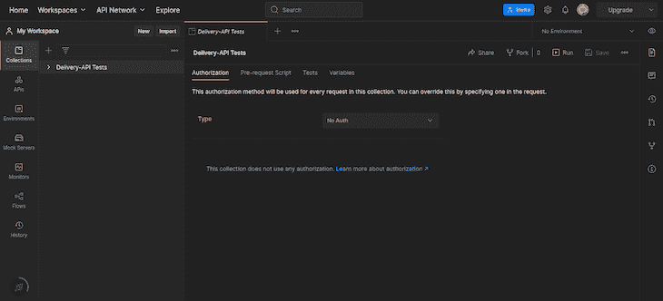
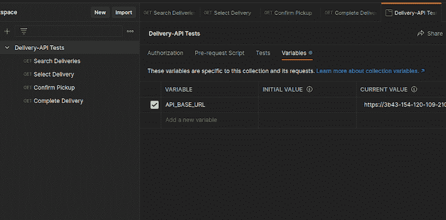
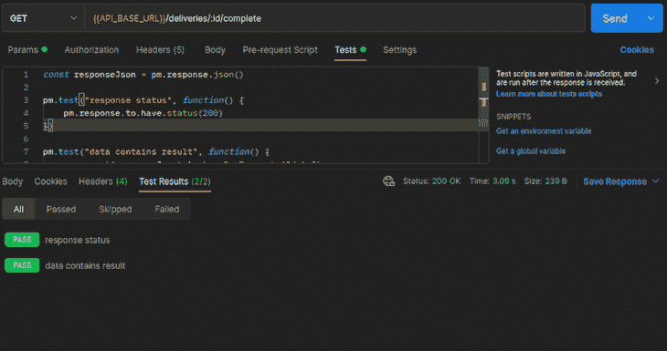
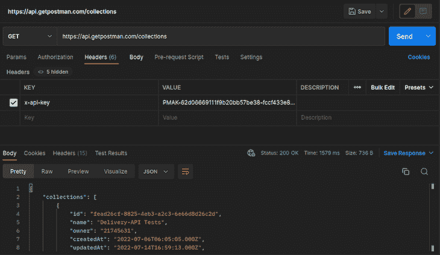
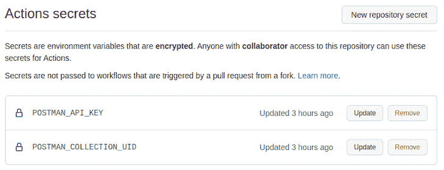

# 如何用 Postman 自动化 API 测试

> 原文：<https://blog.logrocket.com/how-automate-api-tests-postman/>

API 是开发人员构建的几乎每个应用程序背后的驱动力，充当两个或更多软件组件之间的通信渠道。

然而，这种系统的后果是，一个组件的故障会对依赖它的其他组件产生重大影响。因此，全面测试 API 以确保应用程序的正确性和可预测性是至关重要的。

有许多不同的方法可以测试您的 API，无论您选择哪种方法或方法组合，最终都取决于您当前的业务需求、可用资源和实现细节。

在本文中，我们将探索如何为将在 CI/CD 管道中运行的 API 编写自动化功能和集成测试。

## 为什么您应该自动化您的 API 测试？

编写测试有助于确保应用程序在任何给定时间的可预测性和正确性。因此，只要代码库发生变化，就应该运行测试。像这样的重复性任务通常很适合自动化。

自动化测试让您有信心对应用程序进行更改和添加新功能，因为您总是可以依靠您的测试来指出您可能引入的 bug。

## 用 Postman 编写 API 测试

Postman 是一个平台，它提供了一整套工具来构建、测试、记录和模仿 API。作为一名开发者，[你很可能在本地开发时使用 Postman 向你的后端应用程序发出请求](https://blog.logrocket.com/implement-oauth-2-0-node-js/#creating-new-user-postman)，但是你可以用它做更多的事情。

### 设置邮递员

要跟随本教程，您需要一个 Postman 帐户。如果您还没有帐户，[创建一个免费帐户](https://identity.getpostman.com/signup)。然后，导航到您的邮递员工作区开始。

我们将创建一个名为`Delivery-API Tests`的新集合，在这里我们将为一个交付 API 编写一些功能和集成测试，我们将在本节的后面创建这个 API。功能测试检查单个 API 端点的行为，并确保请求-响应周期符合预期。另一方面，集成测试检查由两个或更多端点组成的特定流，以确定用户流中涉及的不同组件是否按预期工作。

此时，您的工作区应该在左侧面板中显示该集合:



## 设置请求

接下来，我们需要创建保存测试的请求。一个请求将代表一个 API 端点。在`Delivery-API Tests`集合上，点击出现在右侧的**菜单**按钮。

选择**添加请求**，并将创建的请求命名为`Search Deliveries`。再创建三个名为`Select Delivery`、`Confirm Pickup`和`Complete Delivery`的请求。

现在，我们需要为每个请求编写测试。Postman 有一个内置的测试工具，允许您使用 JavaScript 语法编写测试。请求运行后，测试会立即执行，您可以在测试脚本中访问请求返回的响应。

在`Delivery-API Tests`集合中，选择`**Search Deliveries**`请求并选择**测试**选项卡。将以下代码块粘贴到编辑器中:

```
const responseJson = pm.response.json()

pm.test("response status", function() {
    pm.response.to.have.status(200)
})

pm.test("data contains results", function() {
    pm.expect(responseJson).to.haveOwnProperty("data")
    pm.expect(responseJson.data).to.be.an("array")
    pm.expect(responseJson.data[0]).to.haveOwnProperty("status")
})

pm.collectionVariables.set("SELECTED_DELIVERY_ID", responseJson.data[0].id)

```

在上面的代码中，我们通过调用`pm.response.json()`获得 JSON 格式的响应。注意`pm`是一个全局对象，在所有请求脚本中都可用。然后我们使用`pm.test`定义了两个测试用例。

如果你熟悉 JavaScript 测试，那么这里的语法应该很简单。Postman 支持来自 [Chai 断言库](https://www.chaijs.com/)的语法，因此您可以用您已经在 JavaScript 中使用的相同方式编写测试。

在测试用例中，我们检查正确的状态代码、返回的数据类型以及一些额外的必填字段。这些是简单的测试，但目标是理解 Postman 中测试的概念。

注意，在代码块的最后一行，我们设置了一个名为`SELECTED_DELIVERY_ID`的集合变量。集合变量是跨请求共享数据的直观方式。

接下来，我们想为其他请求编写测试。将以下代码块粘贴到相应的请求中:

```
// Select Delivery
const responseJson = pm.response.json()

pm.test("response status", function() {
    pm.response.to.have.status(200)
})

pm.test("data contains result", function() {
    pm.expect(responseJson).to.haveOwnProperty("data")
    pm.expect(responseJson.data).to.be.an("object")
    pm.expect(responseJson.data).to.haveOwnProperty("status")
    pm.expect(responseJson.data.status).to.eql("QUEUED")
})

// Confirm Pickup
const responseJson = pm.response.json()

pm.test("response status", function() {
    pm.response.to.have.status(200)
})

pm.test("data contains result", function() {
    pm.expect(responseJson).to.haveOwnProperty("data")
    pm.expect(responseJson.data).to.be.an("object")
    pm.expect(responseJson.data).to.haveOwnProperty("status")
    pm.expect(responseJson.data.status).to.eql("PICKED_UP")
})

// Complete Delivery
const responseJson = pm.response.json()

pm.test("response status", function() {
    pm.response.to.have.status(200)
})

pm.test("data contains result", function() {
    pm.expect(responseJson).to.haveOwnProperty("data")
    pm.expect(responseJson.data).to.be.an("object")
    pm.expect(responseJson.data).to.haveOwnProperty("status")
    pm.expect(responseJson.data.status).to.eql("COMPLETED")
})

```

除了`status`字段上的断言之外，其他请求的测试用例是相同的。现在我们已经为我们的请求准备了测试，让我们运行它们。我们需要创建一个后端服务器来处理 API 请求。您可以用任何语言或框架实现后端服务器，只要它是 REST 兼容的，但是在本文中，我们将使用 [Koa](https://github.com/koajs/koa) 构建一个简单的 Node.js 服务器。

## 构建 API 服务器

在您的终端中，创建一个文件夹并用 Yarn 或 npm 初始化 Node.js 项目:

```
$ mkdir delivery-api
$ cd delivery-api
$ yarn init -y 

```

现在，创建一个名为`app.js`的文件，并安装必要的依赖项:

```
$ touch app.js
$ yarn add koa @koa/router

```

在您的`package.json`文件中，添加以下脚本:

```
//...
  "scripts": {
    "start": "node app.js"
  },
//...

```

Koa 是 Node.js 的轻量级 HTTP 中间件框架，类似于 Express。让我们[初始化一个 Koa 服务器](https://blog.logrocket.com/first-steps-with-koa-js/)，并定义对应于我们在 Postman 中设置的请求的路由处理程序。在您的`app.js`文件中，粘贴下面的代码块:

```
const Koa = require("koa");
const Router = require("@koa/router");
const app = new Koa();
const router = new Router();

app.use(router.routes());

const deliveries = [
   {
      id: "1",
      pickupAddress: "1000 4th Ave, Seattle, WA, 98104",
      pickupPhoneNumber: "+14148928000",
      dropoffAddress: "1201 3rd Ave, Seattle, WA, 98101",
      dropoffPhoneNumber: "+14148928000",
      instructions: "",
      status: "CREATED",
   },
   {
      id: "2",
      pickupAddress: "1000 4th Ave, Seattle, WA, 98104",
      pickupPhoneNumber: "+14148915000",
      dropoffAddress: "1201 3rd Ave, Seattle, WA, 98101",
      dropoffPhoneNumber: "+14148915000",
      instructions: "",
      status: "CREATED",
   },
];

router.get("/deliveries", (ctx) => {
   ctx.body = {
      status: "00",
      message: "successs",
      data: deliveries,
   };
});

router.get("/deliveries/:id/select", (ctx) => {
   const id = ctx.params["id"];
   const delivery = deliveries.find((obj) => obj.id === id);
   if (!delivery) {
      ctx.body = {
         status: "01",
         message: "not found",
         data: null,
      };
   }
   ctx.body = {
      status: "00",
      message: "successs",
      data: { ...delivery, status: "QUEUED" },
   };
});

router.get("/deliveries/:id/confirm-pickup", (ctx) => {
   const id = ctx.params["id"];
   const delivery = deliveries.find((obj) => obj.id === id);
   if (!delivery) {
      ctx.body = {
         status: "01",
         message: "not found",
         data: null,
      };
   }
   ctx.body = {
      status: "00",
      message: "successs",
      data: { ...delivery, status: "PICKED_UP" },
   };
});

router.get("/deliveries/:id/complete", (ctx) => {
   const id = ctx.params["id"];
   const delivery = deliveries.find((obj) => obj.id === id);
   if (!delivery) {
      ctx.body = {
         status: "01",
         message: "not found",
         data: null,
      };
   }
   ctx.body = {
      status: "00",
      message: "successs",
      data: { ...delivery, status: "COMPLETED" },
   };
});

app.listen(8000);

```

这里发生了很多事情，让我们来分析一下。首先，我们初始化一个新的 Koa 应用程序和一个新的`Router`对象。使用`router`实例，我们定义了四条路径与我们在 Postman 中创建的请求相匹配的路由。最后，我们通过调用`app.listen()`来启动服务器。

总之，这个简单的 API 服务器试图模拟一个食品配送应用程序的订单配送过程。现在，通过在终端中运行`yarn start`来启动服务器。

## 对邮递员运行手动测试

现在，我们已经准备好进行测试了。如果您在网络上使用 Postman，您将无法连接到`localhost`。但是，有两种方法可以解决这个问题。你可以下载[邮差桌面应用](https://www.postman.com/downloads/)或者使用 [ngrok](https://ngrok.com/) 作为隧道将你的`localhost`端口暴露给互联网。

如果你决定使用 ngrok，你需要做的就是安装它并启动一个指向你的服务器的隧道。打开另一个终端实例，然后运行以下命令并复制显示的 URL:

```
$ ngrok http 8000

```

URL 应该类似于`[https://3d43-154-130-109-210.ngrok.io](https://3d43-154-130-109-210.ngrok.io)`。在 web 或桌面上导航到 Postman，选择`**Delivery-API Tests**`集合，并打开**变量**选项卡。

使用`API_BASE_URL`键添加一个变量，如果您没有使用 Postman desktop，则将值设置为`[http://localhost:8000](http://localhost:8000)`或 ngrok URL。添加新变量时，请务必点击 **Persist All** ，以确保外部服务可以访问它:



现在，我们可以为每个请求使用集合变量。将每个请求的 URL 字段更新为以下值:

*   `Search Deliveries` : `{{API_BASE_URL}}/deliveries?page=1&count=20`
*   `Select Delivery` : `{{API_BASE_URL}}/deliveries/:id/select`
*   `Confirm Pickup` : `{{API_BASE_URL}}/deliveries/:id/confirm-pickup`
*   `Complete Delivery` : `{{API_BASE_URL}}/deliveries/:id/complete`

我们可以使用两种方法之一手动运行我们的测试。第一种是单独运行请求，允许执行每个请求的测试脚本。或者，我们可以使用收集运行器一次性运行收集。我们将在下一节中使用收集运行器，但是您可以通过单击 **Send** 按钮来临时手动运行每个请求。

当您运行请求时，您将在底部面板中看到响应，但是您也可以通过单击底部面板中的**测试结果**选项卡来查看测试结果:



这就是在 Postman 中运行测试所需要做的全部工作。然而，每当您对代码库进行更改时，访问您的 Postman 工作区并运行测试感觉并不直观。这种方法不符合开发工作流，所以让我们改进它。

## 自动化您的 API 测试

在这一部分中，我们将通过自动化工作流程来使测试过程更加直观，并且节省时间。优化的开发工作流包括进行本地更改和将新特性推送到源代码控制，在那里它们被 CI/CD 管道拾取，触发一些构建或部署任务。

Postman 提供了一个名为 Newman 的[命令行工具，可以让您从 CLI 运行集合。它还提供了与 CI/CD 环境的无缝集成，这意味着我们可以设置我们的测试在部署步骤中运行。这极大地简化了测试过程，避免了我们不断地在工作空间中运行测试。](https://github.com/postmanlabs/newman)

## 将 Newman 与 GitHub Actions 集成

我们可以在许多持续集成服务中设置纽曼。在本文中，我们将使用 GitHub 动作。让我们从定义纽曼的工作流程开始。在您的`delivery-api`项目中，运行以下命令:

```
$ mkdir .github
$ mkdir .github/workflows
$ touch .github/workflows/postman-tests.yml

```

将以下工作流定义添加到`postman-tests.yml`文件中:

```
# postman-tests.yml
name: Newman Run
on:
  push:
    branches:
      - main
  # types: [closed]
jobs:
  newman:
    name: Postman-tests
    runs-on: ubuntu-latest
    steps:
      - name: Checkout
        uses: actions/[email protected]
      - name: Install Node
        uses: actions/[email protected]
        with:
          node-version: 14
      - name: Install Newman & Reporter
        run: |
          npm install -g newman
          npm install -g newman-reporter-htmlextra
      # Make directory for test results in workspace
      - name: Make Directory
        run: mkdir -p newman-results
      # Run newman cli
      - name: Run Newman
        env:
          POSTMAN_API_URL: 'https://api.getpostman.com'
          POSTMAN_API_KEY: ${{ secrets.POSTMAN_API_KEY }}
          POSTMAN_COLLECTION_UID: ${{ secrets.POSTMAN_COLLECTION_UID }}
        run: |
          newman run "${{env.POSTMAN_API_URL}}/collections/${{env.POSTMAN_COLLECTION_UID}}?apikey=${{env.POSTMAN_API_KEY}}" \
          -r htmlextra,cli --reporter-htmlextra-export newman-results/htmlreport.html
      # Upload test results to workspace
      - name: Upload Results
        uses: actions/[email protected]
        with:
          name: Postman_Test_Reports
          path: newman-results

```

上面的代码是一个简单的工作流，当我们推送到存储库时运行，特别是在默认的`main`分支上。我们用一系列步骤为邮递员测试定义了一个作业。

首先，我们运行 checkout 操作，然后使用预定义的操作`actions/[[email protected]](/cdn-cgi/l/email-protection)`安装 Node.js。接下来我们安装纽曼和`newman-reporter-htmlextra`。reporter 是 Newman 的一个插件，可以生成 HTML 格式的测试摘要。然后，我们使用一些参数运行 Newman CLI 工具，包括我们集合的 Postman API URL。

注意，我们已经定义了一些环境变量。`POSTMAN_API_KEY`和`POSTMAN_COLLECTION_UID`是从 GitHub 行动机密中提取的。在设置这些秘密之前，我们需要创建一个存储库。最后，在运行 Newman 之后，我们使用预定义的动作`actions/[[email protected]](/cdn-cgi/l/email-protection)`将报告器生成的 HTML 文件上传到一个我们稍后可以访问的位置。

## 将这一切结合在一起

最后，我们需要将项目推送到 GitHub，并看到工作流运行。导航到您的 GitHub 帐户，创建一个名为`delivery-api`的新存储库，并复制远程 URL。接下来，我们将在项目中初始化 Git，添加远程 URL，提交我们的更改，并推送更改:

```
$ git init -b main
$ git remote add origin <your-remote-url>
$ git add .
$ git commit "<message>"
$ git push -u origin main

```

如果您打开 GitHub 存储库中的`Actions`选项卡，您应该会看到工作流正在运行或者已经失败。这是因为我们没有添加密钥。

为了解决这个问题，我们需要在 Postman 上生成一个 API 键，并获取集合 UID。导航到您的邮递员工作区；在顶部菜单栏，点击您的个人资料并选择**设置**。从侧面导航栏中选择 **API 密钥**，然后生成一个 API 密钥并复制值。

接下来，向 URL `[https://api.getpostman.com/collections](https://api.getpostman.com/collections)`发出一个`GET`请求，并设置一个带有关键字`x-api-key`和一个等于您生成的 API 关键字的值的头。您的回复应包含您的收藏列表:



转到你的 GitHub 库，在 GitHub Action secrets 中添加`POSTMAN_API_KEY`和`POSTMAN_COLLECTION_UID`。`POSTMAN_COLLECTION_UID`是您的`Delivery-API Tests`收集对象中的`uid`字段。



现在，再次转到`Actions`选项卡，尝试重新运行失败的作业。如果一切正常，您应该在`Artifacts`面板中看到一个文件，这是从工作流生成的报告。您可以下载并在浏览器中打开 HTML 文件。


就是这样！我们已经成功地自动化了我们的 API 测试。每当我们做出更改并推进到上游分支时，就会触发工作流，运行我们的测试。理想情况下，我们希望在部署完成后运行这个工作流，但是为了保持简单，我们只定义了 Postman 测试的工作流。

## Postman 对 API 测试的限制

Postman 是一个很好的 API 测试工具，但是它也有自己的局限性。像软件中的其他东西一样，您需要考虑您独特的项目需求，以确定适合这项工作的工具。首先要考虑的是测试的范围和复杂性。如果您需要编写依赖于某些外部服务的测试，您可能无法轻松地实现自动化。

另一个限制是灵活性。因为您在与应用程序逻辑不同的环境中编写测试，所以很难共享和重用代码片段。当您想要针对多个不同的请求参数测试一个 API 端点时，这尤其令人沮丧。Postman 仍然是一个很好的测试工具，作为开发人员，使用它进行测试的明智决定取决于您。

## 结论

在本文中，我们回顾了为什么测试应用程序中的 API 很重要。我们探索了使用 Postman 测试我们的 API，包括设置 Newman 和 GitHub 动作。最后，我们回顾了 Postman 对测试的一些限制。总的来说，Postman 是构建、测试、记录和模仿 API 的一个很好的工具。我希望你喜欢这个教程，并快乐编码！

## 您是否添加了新的 JS 库来提高性能或构建新特性？如果他们反其道而行之呢？

毫无疑问，前端变得越来越复杂。当您向应用程序添加新的 JavaScript 库和其他依赖项时，您将需要更多的可见性，以确保您的用户不会遇到未知的问题。

LogRocket 是一个前端应用程序监控解决方案，可以让您回放 JavaScript 错误，就像它们发生在您自己的浏览器中一样，这样您就可以更有效地对错误做出反应。

[](https://lp.logrocket.com/blg/javascript-signup)[https://logrocket.com/signup/](https://lp.logrocket.com/blg/javascript-signup)

[LogRocket](https://lp.logrocket.com/blg/javascript-signup) 可以与任何应用程序完美配合，不管是什么框架，并且有插件可以记录来自 Redux、Vuex 和@ngrx/store 的额外上下文。您可以汇总并报告问题发生时应用程序的状态，而不是猜测问题发生的原因。LogRocket 还可以监控应用的性能，报告客户端 CPU 负载、客户端内存使用等指标。

自信地构建— [开始免费监控](https://lp.logrocket.com/blg/javascript-signup)。