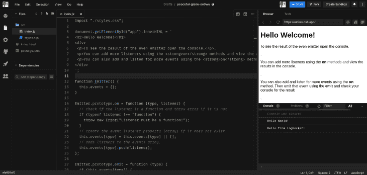

# 如何构建自定义 Node.js 事件发射器

> 原文：<https://blog.logrocket.com/how-build-custom-node-js-event-emitters/>

***编者按**:这篇文章于 2022 年 9 月 13 日更新，包含了为什么应该使用事件发射器的信息，以及`EventEmitter`中的类成员，并对文本进行了其他一般性更新。*

事件是具有软件或硬件意义的动作。它们是由于用户活动(如鼠标点击或击键)或直接来自系统(如错误或通知)而发出的。

JavaScript 语言使我们能够通过在事件处理程序中运行代码来响应事件。因为 Node.js 是基于 JavaScript 的，所以它在其事件驱动的架构中利用了这一特性。

在本文中，我们将讨论什么是事件发射器，为什么我们应该使用它们，以及如何构建定制的事件发射器。我们开始吧！

## 系统事件与自定义事件

[Node.js](https://nodejs.org/en/) 中的事件是在我们的应用程序中发生的我们可以响应的动作。Node.js 中有两种不同类型的事件，我们将在本文中介绍这两种事件:

### 1.系统事件

系统事件发生在 Node.js 核心的 C++端，由 Node.js 中使用的 C 库 libuv 处理。

libuv 库处理计算机系统内部发生的低级事件，本质上是来自操作系统的低级事件，比如从互联网接收数据、读完一个文件等等。

因为 Node.js 程序的流程是由事件决定的(事件驱动编程)，所以所有 I/O 请求最终都会生成一个完成/失败事件。

> 补充说明:JavaScript 没有处理系统事件的内置功能。

### 2.自定义事件

自定义事件发生在 Node.js 的 JavaScript 内核中。这些事件由名为`EventEmitter`的 Node.js 类处理。

`EventEmitter`是 Node.js 中用来处理自定义事件的 JavaScript 类，因为 JavaScript 没有任何内置的功能来处理事件。

通常，当一个事件在 libuv 中发生时，libuv 会生成定制的 JavaScript 事件，这样就可以很容易地处理它们。因此，Node.js 事件可能被视为单个实体，即使它们实际上是两种不同类型的事件。

在本文中，我们将重点关注定制 JavaScript 事件和事件发射器。

## 什么是事件发射器？

Node.js 使用如上所述的事件驱动编程模式。这种设计模式用于产生和消费事件，主要用于前端(浏览器)。单击按钮或按键等用户操作会生成一个事件。

这些事件有称为侦听器的关联函数，当它们被发出时，调用这些函数来处理它们对应的事件。

事件驱动模式有两个主要组件:

1.  事件处理程序(监听器)。这是在发出事件时将被调用的函数。一个以上的侦听器可以侦听一个事件。当发出事件时，这些侦听器将被同步调用。
2.  侦听事件并调用相关侦听器来处理该事件的主循环。

Node.js 通过`[EventEmitter](https://nodejs.org/api/events.html#events_class_eventemitter)`类将事件驱动编程带到后端。`EventEmitter`类是`events`核心 Node.js 模块的一部分。它为我们提供了一种发出和处理事件的方法，并且它公开了——除了其他方法之外——方法`on`和`emit`。

在本文中，我们将通过使用支持 Node.js 事件发射器的核心原则来构建一个自定义事件发射器，以便我们可以更好地理解它们是如何工作的。

下面的代码展示了如何使用`EventEmitter`对象发出和处理事件。

```
const EventEmitter = require('events');
const eventEmitter = new EventEmitter ();

eventEmitter.on('greet', () => {
  console.log('Hello world!');
});

eventEmitter.emit('greet');

```

在上面的代码中，`eventEmitter.on`方法用于注册处理事件的侦听器，而`eventEmitter.emit`方法用于发出事件。

通过发出上面的`greet`事件，监听`greet`事件的函数被调用，`Hello world!`被记录到控制台。

由`EventEmitter`对象公开的其他方法有:

1.  `eventEmitter.once()`:这增加了一个一次性监听器
2.  `eventEmitter.off()`:这是`eventEmitter.removeListener()`的别名。它从事件中移除事件侦听器
3.  `eventEmitter.listnersCount()`:返回收听事件的听众人数

在 Node.js 中，还有其他可以发出事件的对象。然而，所有发出事件的对象都是`EventEmitter`类的一个实例。为了更好地理解事件发射器，让我们构建自己的发射器。

* * *

### 更多来自 LogRocket 的精彩文章:

* * *

## 为什么使用事件发射器？

Node.js 通过`EventEmitter`类将事件驱动编程带到后端。`EventEmitter`类是`events`核心 Node.js 模块的一部分。

事件发射器和监听器对于 Node.js 开发至关重要。它们使 Node.js 运行时能够实现其单线程、异步、非阻塞 I/O 特性，这是 Node.js 出色性能的关键。

## `EventEmitter`内的类成员

Node.js `EventEmitter`类为我们提供了一种发出和处理事件的方法。在它内部，它公开了许多[类成员](https://nodejs.org/api/events.html):

*   `emit`方法顺序并同步地调用每个监听被触发事件的监听器——将提供的参数传递给每个监听器
*   `on`方法有两个参数:事件名和事件监听器。它将这个事件侦听器函数添加到侦听器数组的末尾
*   `off`是 [`emitter.removeListener()`的别名](https://nodejs.org/api/events.html#emitterremovelistenereventname-listener)
*   `removeListener`方法有两个参数:事件名和事件监听器。然后，当指定的事件触发时，它从事件数组中移除该事件侦听器
*   `addListener`是`on`方法的别名

## 自定义事件发射器的一般模式

事件发射器的一般思想是拥有一个事件对象，它的键充当自定义事件，对应的值是侦听器数组，当事件被发射时，这些侦听器被同步调用。

考虑下面的代码:

```
const GreetHandlers = [
  ()=> {console.log("Hello world!"), 
  ()=> {console.log("Hello Developer!"), 
  ()=> {console.log("Hello From LogRocket!"}
];

const events = {
  "greet": GreetHandlers
}

```

这里，`events`对象有一个属性:`"greet"`。这个对象的每个属性名都被认为是一个唯一的事件，这意味着`"greet"`属性是一个事件。

`"greet"`属性(event)的值是`GreetHandlers`数组。这是一个包含函数(或监听器)的数组，当`"greet"`事件发生时，这些函数将被同步调用。

为了同步调用这些函数，我们遍历数组并调用每个函数，如下所示:

```
GreetHandlers.forEach(listener => {
 listener();
});

// Output:
// "Hello world!"
// "Hello Developer!"
// "Hello From LogRocket!"

```

上面的例子给出了 Node.js 事件发射器中使用的模式的简单概述。在下一节中，我们将使用与构建自己的事件发射器相同的模式。

## 在 Node.js 中构建自定义事件发射器

虽然 Node.js `EventEmitter`是一个 JavaScript 类，但我们将使用函数构造器构建自己的类，这样我们就可以了解后台发生了什么。

JavaScript 中的类给了我们一个新的简单的语法来处理 JavaScript 的[原型继承](https://blog.logrocket.com/inheritance-with-javascript-prototypes/)。因为 JavaScript 中的类是原型模式的语法糖，所以许多事情发生在对我们隐藏的幕后。

要构建我们的自定义事件发射器，请遵循以下步骤:

### 1.创建事件发射器函数构造函数

这应该有一个属性(事件对象)。

```
function Emitter( ) {
    this.events = { };
}
```

上面的`events`对象将作为保存所有定制事件的主对象。这个对象的每个`key`和`value`对应一个事件和它的监听器数组。

```
function Emitter( ) {
    this.events = {
      "greet": [
                  ()=> {},
                  ()=> {},
                  ()=> {}, 
              ],
      "speak": [
                  ()=> {},
                  ()=> {},
                  ()=> {}, 
              ]
}

```

### 2.向事件发射器原型添加方法

面向对象的 JavaScript 为我们提供了一种在应用程序间共享属性和方法的干净方式。这是因为原型模式允许对象沿着原型链访问属性，这意味着一个对象可以访问其原型中的属性、其原型的原型中的属性以及其他属性。

如果对象中没有方法或属性，JavaScript 引擎首先在对象的原型中搜索它。如果在该对象的原型中没有找到，它将继续沿着原型链向下搜索。这种继承模式被称为原型继承。

由于 JavaScript 原型继承，当我们向对象的原型添加属性和方法时，该对象的所有实例都可以访问它们。

在下面的代码中，我们添加了`on`方法:

```
Emitter.prototype.on = function (type, listener) {
    // check if the listener is a function and throw error if it is not
    if(typeof listener !== "function") {
        throw new Error("Listener must be a function!")
    }
    // create the event listener property (array) if it does not exist.
    this.events[type] = this.events[type] || []; 
    // adds listners to the events array.
    this.events[type].push(listener); 
}

```

这将把`on`函数添加到`Emitter`对象的原型中，这允许`Emitter`对象的所有实例继承这个方法。`on`方法有两个参数，即`type`和`listener`(一个函数)。

首先，`on`方法检查`listener`是否是一个函数。否则，它会抛出如下所示的错误:

```
if(typeof listener !== "function") {
    throw new Error("Listener must be a function!")
}

```

另外，`on`方法检查事件的`type`是否出现在`events`对象中(作为一个键)。如果它不存在，它将向`events`对象添加一个事件(作为一个键),并将其值设置为一个空数组。最后，它将侦听器添加到相应的事件数组:`this.events[type].push(listener);`。

现在让我们添加`emit`方法:

```
Emitter.prototype.emit = function(type) {
    if (this.events[type]) { // checks if event is a property on Emitter
        this.events[type].forEach(function(listener) { 
        // loop through that events array and invoke all the listeners inside it.
            listener( );
        })
    }
 }

// if used as a node module. Exports this function constructor
modules.exports = Emitter; 
// This makes it available from the require() 
// so we can make as many instances of it as we want.

```

上面的代码将`emit`方法添加到了`Emitters`原型中。它只是检查事件类型是否出现在`events`对象中(作为一个键)。如果它存在，它就调用所有相应的监听器，如上面已经讨论过的。

`this.events[type]`返回相应事件属性的值，该属性是一个包含侦听器的数组。

因此，下面的代码遍历数组并同步调用它的所有侦听器。

```
this.events[type].forEach(function(listener) { 
    // loop through that events array and invoke all the listeners inside it.
        listener( );
})

```

要使用我们的事件发射器，我们必须手动发射一个事件。

```
// if used in a Node.js environment require the module as seen below.
const Emitter = require('./emitter'); 

const eventEmitter = new Emitter();

eventEmitter.on('greet', ()=> {
  console.log("Hello World!");
});

eventEmitter.on('greet', ()=> {
  console.log("Hello from LogRocket!");
});

eventEmitter.emit("greet"); // manually emit an event 

```

在上面的代码中，我们首先需要并创建一个`Emitter`模块的实例，如下所示:

```
const Emitter = require('./emitter'); 

const eventEmitter = new Emitter(); 

```

然后我们使用`on`方法将监听器分配给`"greet"`事件。

```
eventEmitter.on('greet', ()=> {
  console.log("Hello World!");
});

eventEmitter.on('greet', ()=> {
  console.log("Hello from LogRocket!");
});

```

最后，我们使用下面这行代码手动发出`greet`事件:

```
emtr.emit("greet");

```



上面的图像显示了运行我们的代码的结果。[点击此处](https://codesandbox.io/s/peaceful-glade-oe0wu?fontsize=14&hidenavigation=1&theme=dark)查看沙盒中的完整代码。

## 添加更多事件方法

### `addListener`法

需要注意的是，`on`方法实际上是事件发射器中`addListener`方法的别名。因此，我们需要重构实现。

```
Emitter.prototype.addListener = function (type, listener) {
  // check if the listener is a function and throw error if it is not
  if (typeof listener !== "function") {
    throw new Error("Listener must be a function!");
  }
  // create the event listener property (array) if it does not exist.
  this.events[type] = this.events[type] || [];
  // adds listners to the events array.
  this.events[type].push(listener);
};
Emitter.prototype.on = function (type, listener) {
  return this.addListener(type, listener);
};

```

上面的代码仍然有效，但是在这个版本中，`addListener`和`on`方法做了同样的事情。

### `listenersCount`法

还有一个`listenersCount`方法。这将返回正在侦听特定事件的函数(侦听器)的总数。我们将在下面实现它:

```
Emitter.prototype.listenerCount = function (type) {
  let listnersCount = 0;
  let listeners = this.events[type] || [];
  listnersCount = listners.length;
  console.log("listeners listnersCount", listnersCount);
  return listnersCount;
};

```

在这里，我们告诉简单存储指定事件的侦听器数组到`listeners`变量，使用:

```
let listeners = this.events[type] || []; 

```

如果找不到该事件，则存储一个空数组。然后，我们返回`listener variable`的`length`。

Node.js 中的事件发射器遵循同样的思想，但是它们有很多额外的特性。我们只是做了一个简单的版本。你可以[在这里](https://codesandbox.io/s/festive-driscoll-qvwmi?fontsize=14&hidenavigation=1&theme=dark)用普通的 JavaScript 处理最终代码。

## 结论

事件发射器是 Node.js JavaScript 核心的许多部分的基本构建块。所有发出事件的 Node.js 对象，比如 streams 和 HTTP 模块，都是`EventEmitter`类的实例。它是 Node.js 中的一个重要对象，由`events`模块定义和公开。

Node.js 通过`EventEmitter`类将事件驱动编程带到了服务器端。我希望通过构建我们设计的事件发射器，您能够了解更多关于 Node.js `EventEmitter`类的知识。

## 200 只显示器出现故障，生产中网络请求缓慢

部署基于节点的 web 应用程序或网站是容易的部分。确保您的节点实例继续为您的应用程序提供资源是事情变得更加困难的地方。如果您对确保对后端或第三方服务的请求成功感兴趣，

[try LogRocket](https://lp.logrocket.com/blg/node-signup)

.

[](https://lp.logrocket.com/blg/node-signup)[https://logrocket.com/signup/](https://lp.logrocket.com/blg/node-signup)

LogRocket 就像是网络和移动应用程序的 DVR，记录下用户与你的应用程序交互时发生的一切。您可以汇总并报告有问题的网络请求，以快速了解根本原因，而不是猜测问题发生的原因。

LogRocket 检测您的应用程序以记录基线性能计时，如页面加载时间、到达第一个字节的时间、慢速网络请求，还记录 Redux、NgRx 和 Vuex 操作/状态。

[Start monitoring for free](https://lp.logrocket.com/blg/node-signup)

.