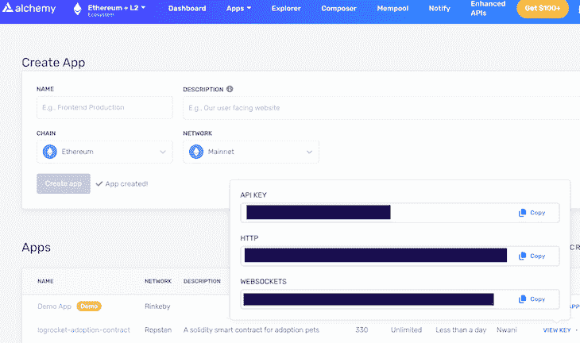
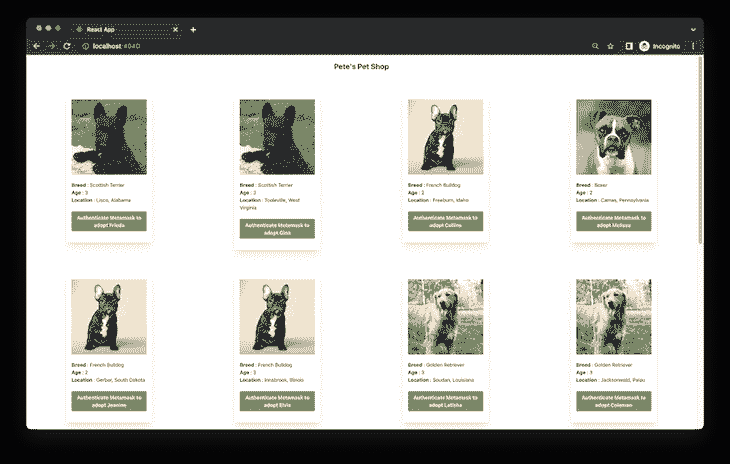
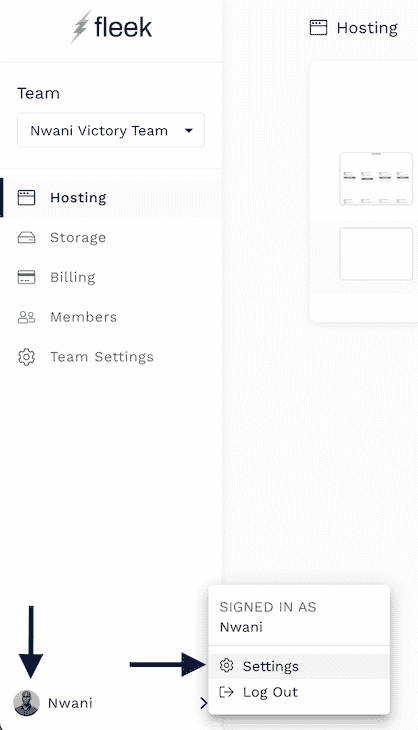
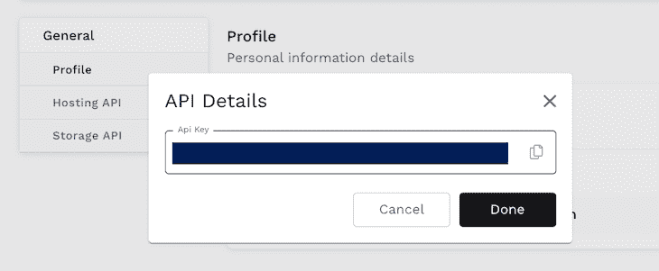
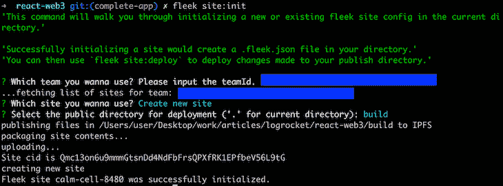
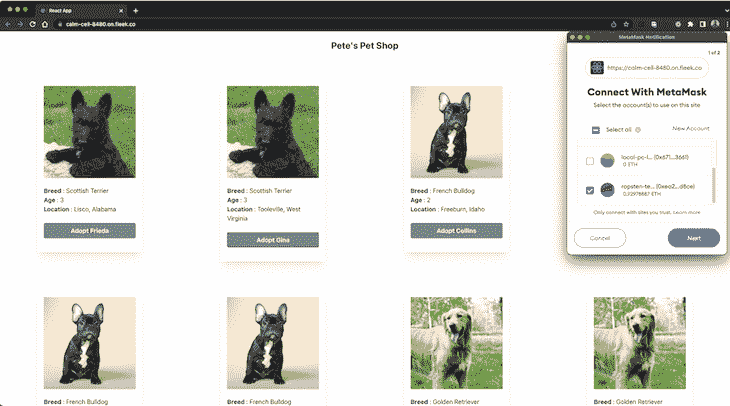

# 如何使用 Fleek - LogRocket 博客创建一个 DApp 并将其托管在 IPFS

> 原文：<https://blog.logrocket.com/how-build-dapp-host-ipfs-fleek/>

应用程序的部署阶段是开发过程中至关重要的一步。在这一阶段，应用程序从本地托管发展到可供世界上任何地方的目标受众使用。

随着区块链在构建应用程序中的使用越来越多，您可能想知道与智能合约交互的 DApps 是如何托管的。

在本教程中，您将通过使用 React、Hardhat 和 Alchemy 构建一个示例分散式宠物收养应用程序，学习如何使用 Fleek 托管 DApps。我们将涵盖:

## 在开始本教程之前，您需要什么

本教程包含几个实际操作步骤。为了跟进，我建议您执行以下操作:

*   安装 [React](https://reactjs.org/) ，我们将使用它来构建 UI。我在本教程中使用 React v14
*   安装 [Hardhat](https://hardhat.org/) ，我们将使用它作为我们的开发环境
*   为[炼金术](https://www.alchemy.com/)区块链开发者平台创建一个免费账户
*   为 [Fleek](https://fleek.co/) 创建一个免费账户，你将在下一节了解更多
*   下载[元掩码](https://metamask.io/)浏览器扩展

MetaMask 是一种加密货币钱包，允许用户通过浏览器或移动应用程序访问 dapp。您还需要一个在[以太坊测试网上的测试元掩码帐户，用于测试智能合约](https://blog.logrocket.com/top-4-ethereum-testnets-testing-smart-contracts/)。在本教程中，我使用的是 Ropsten 测试网络。

## Fleek 是什么？

Fleek 是一个 Web3 解决方案，旨在无缝部署您的站点、DApps 和服务。目前，Fleek 为[在星际文件系统(IPFS)](https://blog.logrocket.com/decentralized-data-storage-using-ipfs-and-react-a-tutorial-with-examples/) 或来自 Dfinity 的[互联网计算机(IC)上托管您的服务提供了一个网关。](https://dfinity.org/#:~:text=Internet%20Computer%20Ecosystem)

Fleek 将自己描述为 Web3 应用程序的等同物。因此，您会发现一些类似于 Netlify 的功能，例如使用 docker 映像执行构建和生成部署预览。

根据 IPFS 的博客,“Fleek 2022 年的主要目标是重组其 IPFS 基础设施，以进一步分散和激励它。它还将为 Web 构建堆栈的不同部分提供新的 Web3 基础设施提供商。”

Fleek 为 IPFS 挑战提供了一个解决方案，在这个挑战中，每次你更新网站时，你的网站的散列都会改变，因此很难有一个固定的地址散列。初始部署后，Fleek 将构建、固定和更新您的站点。

让我们在下一节开始构建我们的示例 DApp，并使用 Fleek 部署它。我们将在 IPFS 举办 DApp。

## 构建一个部署到 Fleek 的示例 DApp

在本节中，我们将为一家宠物店构建一个分散式收养跟踪系统。

如果你对松露组曲很熟悉，你可能会认出这个练习的某些部分。这款 DApp 的灵感来自[松露指南](https://trufflesuite.com/tutorial/)。我们将通过使用炼金术、安全帽和反应来更进一步。

为了使您能够专注于编写智能合同和部署 DApp，我已经构建了 UI 组件和状态。智能协定和 React 代码将包含在单个项目中。

简单地[从我的 GitHub 库](https://github.com/vickywane/react-web3)中克隆 React 应用程序，开始编写智能契约:

```
git clone  https://github.com/vickywane/react-web3 

```

接下来，将目录更改为克隆的文件夹，并安装`package.json`文件中列出的依赖项:

```
# change directory
cd react-web3

# install application dependencies
npm install

```

设置好 React 应用程序后，让我们继续创建宠物收养智能合同。

### 创建宠物收养智能合同

在`react-web3`目录中，创建一个 contracts 文件夹来存储我们的宠物收养智能合同的可靠性代码。

使用您的代码编辑器，创建一个名为`Adoption.sol`的文件，并粘贴以下代码，以在智能合约中创建必要的变量和函数，包括:

*   一个 16 长度的数组来存储每个宠物收养者的地址
*   收养宠物的功能
*   检索所有被收养宠物的地址的功能

```
//SPDX-License-Identifier: Unlicense
// ./react-web3/contracts/Adoption.sol
pragma solidity ^0.8.0;

contract Adoption {
  address[16] public adopters;
  event PetAssigned(address indexed petOwner, uint32 petId);

  // adopting a pet
  function adopt(uint32 petId) public {
    require(petId >= 0 && petId <= 15, "Pet does not exist");

    adopters[petId] = msg.sender;
    emit PetAssigned(msg.sender, petId);
  }

  // Retrieving the adopters
  function getAdopters() public view returns (address[16] memory) {
    return adopters;
  }
}

```

接下来，在 contracts 文件夹中创建另一个名为`deploy-contract-script.js`的文件。将下面的 JavaScript 代码粘贴到文件中。代码将作为一个脚本，使用来自 Hardhat 的异步`getContractFactory`方法来创建采用智能契约的工厂实例，然后部署它。

```
// react-web3/contract/deploy-contract-script.js
require('dotenv').config()
const { ethers } = require("hardhat");

async function main() {
  // We get the contract to deploy
  const Adoption = await ethers.getContractFactory("Adoption");
  const adoption = await Adoption.deploy();
  await adoption.deployed();

  console.log("Adoption Contract deployed to:", adoption.address);
}

// We recommend this pattern to be able to use async/await everywhere
// and properly handle errors.
main()
  .then(() => process.exit(0))
  .catch((error) => {
    console.error(error);
    process.exit(1);
});

```

最后，创建一个名为`hardhat.config.js`的文件。该文件将指定安全帽配置。

将下面的 JavaScript 代码添加到`hardhat.config.js`文件中，为您的 Ropsten 网络帐户指定一个 Solidity 版本和 URL 端点。

```
require("@nomiclabs/hardhat-waffle");
require('dotenv').config();

/**
 * @type import('hardhat/config').HardhatUserConfig
 */
module.exports = {
  solidity: "0.8.4",
  networks: {
    ropsten: {
      url: process.env.ALCHEMY_API_URL,
      accounts: [`0x${process.env.METAMASK_PRIVATE_KEY}`]
    }
  }
};

```

我使用环境变量`ALCHEMY_API_URL`和`METAMASK_PRIVATE_KEY`来存储用于 Ropsten 网络配置的 URL 和私有帐户密钥值:

*   `METAMASK_PRIVATE_KEY`与您的元掩码钱包相关联
*   链接到一个炼金术应用程序

您可以使用一个`.env`文件和`dotenv`包在这个`react-web3`项目中[存储和访问这些环境变量](https://blog.logrocket.com/understanding-react-native-env-variables/)。我们将在下一节回顾如何做到这一点。

如果您已经成功地完成了，那么在项目的这个阶段，您还没有创建一个 Alchemy 应用程序。您将需要使用它的 API URL 端点，所以让我们继续在 Alchemy 上创建一个应用程序。

## 创建炼金术应用程序

Alchemy 提供了一些功能，使您能够连接到网络的外部远程过程调用(RPC)节点。RPC 节点使您的 DApp 和区块链之间的通信成为可能。

使用您的 web 浏览器，[导航到 Alchemy web dashboard](https://auth.alchemyapi.io/) 并创建一个新应用程序。

提供应用程序的名称和描述，然后选择 Ropsten 网络。点击“创建应用程序”按钮继续。


创建应用程序后，您会发现它列在页面底部。

点击“查看密钥”以显示 Alchemy 应用程序的 API 密钥。记下 HTTP URL。我编辑了下图中的信息。



在您的 Hardhat 项目中创建一个`.env`文件，如下所示。您将使用这个`.env`文件来存储您的 Alchemy 应用程序 URL 和 MetaMask 私钥。

```
// react-web3/.env

ALCHEMY_API_URL=<ALCHEMY_HTTP_URL>
METAMASK_PRIVATE_KEY=<METAMASK_PRIVATE_KEY>

```

用 Alchemy 的 HTTP URL 和您的元掩码私钥替换上面的`ALCHEMY_HTTP_URL`和`METAMASK_PRIVATE_KEY`占位符。遵循[元掩码导出私钥指南](https://metamask.zendesk.com/hc/en-us/articles/360015289632-How-to-Export-an-Account-Private-Key)了解如何为您的钱包导出这些信息。

最后，执行下一个命令，将您的宠物收养智能合同部署到指定的 Ropsten 网络:

```
npx hardhat run contracts/deploy-contract-script.js --network ropsten

```

如下图所示，请注意在部署合同后返回到您的控制台的地址。在下一节中，您将需要这个地址。


至此，宠物收养智能合约已经部署完毕。现在让我们将焦点转移到 DApp 本身，并创建与宠物收养智能合同交互的函数。

## 建设 DApp 前端

类似于《松露指南》中的宠物店教程，我们的 DApp 将展示 16 种不同品种的狗，供人们收养。每只狗的详细信息存储在`[src/pets.json](https://github.com/vickywane/react-web3/tree/master/src)` [文件](https://github.com/vickywane/react-web3/tree/master/src)中。我们正在使用 TailwindCSS 来设计 DApp 的风格。

首先，打开`[state/context.js](https://github.com/vickywane/react-web3/tree/master/src/state)` [文件](https://github.com/vickywane/react-web3/tree/master/src/state)，用下面的代码替换现有内容:

```
// react-web3/state/context.js

import React, {useEffect, useReducer} from "react";
import Web3 from "web3";
import {ethers, providers} from "ethers";

const {abi} = require('../../artifacts/contracts/Adoption.sol/Adoption.json')

if (!abi) {
    throw new Error("Adoptiom.json ABI file missing. Run npx hardhat run contracts/deploy-contract-script.js")
}

export const initialState = {
    isModalOpen: false,
    dispatch: () => {
    },
    showToast: false,
    adoptPet: (id) => {
    },
    retrieveAdopters: (id) => {
    },
};

const {ethereum, web3} = window

const AppContext = React.createContext(initialState);
export default AppContext;

const reducer = (state, action) => {
    switch (action.type) {
        case 'INITIATE_WEB3':
            return {
                ...state,
                isModalOpen: action.payload,
            }
        case 'SENT_TOAST':
            return {
                ...state,
                showToast: action.payload.toastVisibility
            }
        default:
            return state;
    }
};

const createEthContractInstance = () => {
    try {
        const provider = new providers.Web3Provider(ethereum)
        const signer = provider.getSigner()
        const contractAddress = process.env.REACT_APP_ADOPTION_CONTRACT_ADDRESS

        return new ethers.Contract(contractAddress, abi, signer)
    } catch (e) {
        console.log('Unable to create ethereum contract. Error:', e)
    }
}

export const AppProvider = ({children}) => {
    const [state, dispatch] = useReducer(reducer, initialState);

    const instantiateWeb3 = async _ => {
        if (ethereum) {
            try {
                // Request account access
                return await ethereum.request({method: "eth_requestAccounts"})
            } catch (error) {
                // User denied account access...
                console.error("User denied account access")
            }
        } else if (web3) {
            return
        }
        return new Web3(Web3.givenProvider || "ws://localhost:8545")
    }

    const adoptPet = async id => {
        try {
            const instance = createEthContractInstance()
            const accountData = await instantiateWeb3()

            await instance.adopt(id, {from: accountData[0]})

            dispatch({
                type: 'SENT_TOAST', payload: {
                    toastVisibility: true
                }
            })

            // close success toast after 3s
            setTimeout(() => {
                dispatch({
                    type: 'SENT_TOAST', payload: {
                        toastVisibility: false
                    }
                })
            }, 3000)
        } catch (e) {
            console.log("ERROR:", e)
        }
    }

    const retrieveAdopters = async _ => {
        try {
            const instance = createEthContractInstance()
            return await instance.getAdopters()
        } catch (e) {
            console.log("RETRIEVING:", e)
        }
    }

    useEffect(() => {
        (async () => { await instantiateWeb3() })()
    })

    return (
        <AppContext.Provider
            value={{
                ...state,
                dispatch,
                adoptPet,
                retrieveAdopters
            }}
        >
            {children}
        </AppContext.Provider>
    );
};

```

通读上面的代码块，您将观察到以下内容:

以太坊和 Web3 对象在浏览器窗口中被析构。MetaMask 扩展将以太坊对象注入到浏览器中。

`createEthContractInstance`助手函数使用合同的 ABI 和 Alchemy 的地址创建并返回宠物收养合同的实例。

`instantiateWeb3` helper 函数将在一个数组中检索并返回用户的帐户地址，使用 MetaMask 来验证以太坊窗口对象是否已定义。

`instantiateWeb3`助手函数也在`useEffect`钩子中执行，以确保用户在 web 浏览器中打开应用程序后立即与 MetaMask 连接。

`adoptPet`函数需要一个数字`petId`参数，创建收养契约实例，并使用`createEthContractInstance`和`instantiateWeb3`助手函数检索用户的地址。

将`petId`参数和用户帐户地址从宠物收养合同实例传递到`adopt`方法中，以收养宠物。

`retrieveAdopters`函数在收养实例上执行`getAdopters`方法来检索所有被收养宠物的地址。

保存这些更改，并启动 React 开发服务器查看位于 [http://localhost4040/](http://localhost4040/) 的宠物店 DApp。

此时，领养合同中的功能已经在`state/context.js`文件中实现，但是还没有执行。如果不使用 MetaMask 进行身份验证，用户的帐户地址将无法定义，并且收养宠物的所有按钮都将被禁用，如下所示:



让我们继续添加宠物收养合同地址作为环境变量，并在 Fleek 上托管 DApp。

## 将反应 DApp 部署到弗利克

在 Fleek 上托管 DApp 可以通过 Fleek dashboard、Fleek CLI，甚至使用 Fleek GitHub Actions 以编程方式[来完成。在本节中，您将学习如何使用 Fleek CLI，因为我们通过 Fleek 托管 IPFS DApp 宠物店。](https://docs.fleek.co/fleek-cli/github-actions/)

### 配置 Fleek CLI

执行以下命令，在您的计算机上全局安装 Fleek CLI:

```
npm install -g @fleek/cli

```

要使用已安装的 Fleek CLI，您需要将 Fleek 帐户的 API 密钥作为环境变量存储在终端中。让我们使用 Fleek web dashboard 为您的帐户生成一个 API 密钥。

使用您的网络浏览器，导航到您的 Fleek 帐户仪表板，然后单击您的帐户头像以显示弹出菜单。在此菜单中，单击“设置”导航至您的 Fleek 帐户设置。



在您的 Fleek 帐户设置中，单击“生成 API”按钮启动“API 详细信息”模式，这将为您的 Fleek 帐户生成一个 API 密钥。



获取生成的 API 密钥并替换下面命令中的`FLEEK_API_KEY`占位符:

```
export FLEEK_API_KEY='FLEEK_API_KEY'

```

执行此命令将 Fleek API 密钥导出为计算机终端的临时环境变量。当您对您的 Fleek 帐户执行命令时，Fleek CLI 将读取`FLEEK_API_KEY`变量的值。

### 通过 Fleek CLI 初始化站点

您需要在本地为 React DApp 生成静态文件，然后才能使用 Fleek 在 IPFS 上托管 DApp 及其文件。

通过指定 Docker 映像和用于构建静态文件的命令，可以在构建过程中自动生成静态文件。但是，在本教程中，您将手动生成静态文件。

执行下面的 npm 命令，在`build`目录中为 DApp 生成静态文件。

```
npm run build

```

接下来，使用以下命令在`react-web3`文件夹中初始化 Fleek 站点工作区:

```
fleek site:init

```

初始化过程是每个 Fleek 站点的一次性步骤。Fleek CLI 将启动一个交互式会话，引导您完成网站的初始化过程。

在初始化过程中，系统会提示您输入一个`teamId`，如下图所示:



您将在 Fleek dashboard URL 中找到您的`teamId`作为数字。下面是一个`teamId`的例子:


此时，Fleek CLI 已经使用 Fleek 的托管配置在`react-web3`目录中生成了一个`.fleek.json`文件。但是，还缺少一样东西:包含宠物收养智能合同地址的环境变量。

让我们来看看如何为 Fleek 上本地部署的站点添加环境变量。

### 添加环境变量

Fleek 使开发人员能够通过 Fleek 仪表板或配置文件安全地管理其网站的敏感凭据。由于在本教程中您从命令行本地托管一个站点，您将在`.fleek.json`文件中指定您的环境变量。

在下面的代码中，用宠物收养智能合同地址替换`ADOPTION_CONTRACT_ADDRESS`占位符。记住，这个地址是在我们创建了 Alchemy 应用程序并使用本教程前面的 npx 命令部署了智能契约[之后返回的](#creating-alchemy-application)。

```
 {
  "site": {
    "id": "SITE_ID",
    "team": "TEAM_ID",
    "platform": "ipfs",
    "source": "ipfs",
    "name": "SITE_NAME"
  },
  "build": {
    "baseDir": "",
    "publicDir": "build",
    "rootDir": "",
    "environment": {
       "REACT_APP_ADOPTION_CONTRACT": "ADOPTION_CONTRACT_ADDRESS"
    }
  }
}

```

注意:`SITE_ID`、`TEAM_ID`和`SITE_NAME`占位符将在初始化 Fleek 站点时由 Fleek CLI 在`.fleek.json`文件中自动生成。

上面的代码还包含以下对象，您应该将它添加到您的`.fleek.json`文件中的 build 对象中:

```
    "environment": {
       "REACT_APP_ADOPTION_CONTRACT": "ADOPTION_CONTRACT_ADDRESS"
    }

```

上面的 JSON 对象指定了 Fleek 在构建 DApp 时使用的节点 docker 图像。在构建过程中，将执行`command`字段中的 npm 命令。

执行下面的命令，使用`.fleek.json`文件中的新构建配置重新部署 DApp。

```
fleek site:deploy

```


恭喜你！DApp 已经完全部署，现在您可以通过 web 浏览器访问实时网站。您还可以按照以下步骤通过 Fleek 仪表盘获取托管 DApp 的更多详细信息:

*   导航到您的 Fleek 仪表板
*   单击您部署的 DApp 的名称
*   查看左侧已部署的网站 URL
*   查看右侧的部署预览图像


单击站点 URL 在新的浏览器选项卡中打开 DApp。DApp 启动后，系统会立即提示您连接元掩码钱包。连接钱包后，你可以通过点击“领养”按钮来领养 16 只狗中的任何一只。



就是这样！您的样本宠物收养 DApp 已被部署到 Fleek。

## 结论

在本教程中，我们主要通过 Fleek 在 IPFS 构建和托管一个示例 DApp。这个过程类似于《松露指南》中的宠物收养智能合同。然后，您进一步构建了一个 DApp 来与宠物收养智能合同进行交互。

如果您想利用本教程中的步骤来托管生产就绪的 DApp，我强烈建议您考虑以下事项:

首先，确保将 Fleek 连接到一个代码主机提供者，比如 GitHub，并从其存储库中的生产分支部署 DApp。这将允许 Fleek 在您向已部署的分支推送新的代码提交时自动重新部署 DApp。

第二，如果你使用一个`.fleek.json`文件来存储环境变量，在你的`.gitignore`文件中包含`.fleek.json`文件名。这样做将确保`.fleek.json`文件不会被推送，并且您的环境变量不会被暴露。

我希望这个教程对你有用。如果您有任何问题，请随时分享您的意见。

## 加入像 Bitso 和 Coinsquare 这样的组织，他们使用 LogRocket 主动监控他们的 Web3 应用

影响用户在您的应用中激活和交易的能力的客户端问题会极大地影响您的底线。如果您对监控 UX 问题、自动显示 JavaScript 错误、跟踪缓慢的网络请求和组件加载时间感兴趣，

[try LogRocket](https://lp.logrocket.com/blg/web3-signup)

.

[](https://lp.logrocket.com/blg/web3-signup)[https://logrocket.com/signup/](https://lp.logrocket.com/blg/web3-signup)

LogRocket 就像是网络和移动应用的 DVR，记录你的网络应用或网站上发生的一切。您可以汇总和报告关键的前端性能指标，重放用户会话和应用程序状态，记录网络请求，并自动显示所有错误，而不是猜测问题发生的原因。

现代化您调试 web 和移动应用的方式— [开始免费监控](https://lp.logrocket.com/blg/web3-signup)。