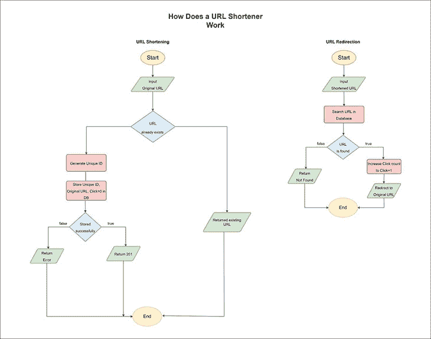
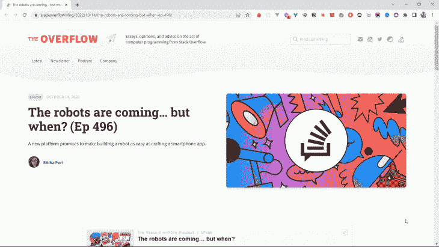

# 如何用 Node.js - LogRocket Blog 构建 URL shortener

> 原文：<https://blog.logrocket.com/how-build-url-shortener-node-js/>

***编者按*** : *本文* *于 2022 年 9 月 29 日* *更新**添加关于* *w* hy *一个人应该* *使用一个网址缩短器**、**一个网址缩短器如何工作* *s、使用一个程序 vs .制作自己的代码也做了改动，包括* *将 app 转换为* *an* *ES6 模块，从* `shortId` *迁移到* `nanoid` *，以及使用***`$inc`运算符递增点击次数。如果你希望检查旧版本的代码，你可以检查* [*这个应用程序的*](https://github.com/nemo0/node-url-shortener/tree/1d355d2d9d2cef9dbc64b11e7262b66154954c2c) *。**

 *像小点儿的[和大点儿的](http://bit.ly/)[和小点儿的](http://cutt.ly/)这样的网址缩写非常流行。但是如果我们能自己造一个呢？

在本文中，我们将通过构建一个缩短提供给它的 URL 的 API 服务来创建一个类似于 Bitly 和 Cuttly 的工具。您可以在下面的 GIF 中看到我们计划的示例:


对于这个项目，我们将使用 [MongoDB](https://www.mongodb.com/) 和 [Node.js](https://nodejs.org/en/) ，所以你应该对本教程有基本的了解。

## 为什么要使用网址缩写？

[URL shorter 为您缩短 URL 的长度](https://blog.logrocket.com/creating-url-shortener-cloudflare-workers/)。大的 URL 可能很难记住或与他人分享。缩短的 URL 版本可以帮助您更轻松地分享您最喜爱的链接。

一个网址缩写程序也可以在许多其他方面帮助你。例如，使用相同工具缩短的链接看起来几乎相同，至少对于域部分是如此。这总体上增加了 URL 的真实性。

此外，在你的社交媒体简历中添加一个大而复杂的网址，或者在链接清晰可见的地方，看起来会很混乱。取而代之的是，一个缩短的 URL 看起来很专业，很简洁。

缩短的 URL 还可以让您轻松跟踪页面的点击数。这是不可能使用没有网址缩写的第三方网站。这些指标可以帮助您测量链路的性能。

## 使用精简的 URL 与构建自己的 URL 精简程序

Cuttly 和 Bitly 是两个非常流行的网址缩写服务。但是它们也有一些缺点，这加强了构建自己的 URL 缩短器的需要。我们简单讨论一下。

首先，我们有定价。像 Cuttly 或 Bitly 这样的服务很容易收取高达 100 美元的基本付费计划年费。它们限制了您可以生成的缩短 URL 的数量。使用你自己的 URL shortener 服务会让你花费更少，如果你在一个云托管服务中正确设置它，比如 AWS。如果您有资格加入 [AWS 免费等级](https://aws.amazon.com/free)，您可以轻松地免费运行您的基本 URL 缩短服务一整年(不包括域名费用)。

其次，大多数网址缩短服务不允许你使用自定义域名来缩短网址。使用自定义域名的选项需要额外付费。但是不使用自定义域名，你的品牌就不会突出。

最后，URL 缩短服务的大多数免费或基本计划不允许您查看分析。但是，通过在您的定制应用程序中做一些简单的调整，您可以轻松地跟踪分析，比如链接的点击量。

## 一个网址缩写器和一个短链接生成器有什么不同？

正如已经讨论过的，你的自定义短链接生成器给你带来了一些好处，比如使用你的自定义域名，定价等等。但是除此之外，你的数据在你自己的空间里也是安全的。

如果您正在考虑为您的组织构建一个内部工具，从隐私的角度来看，将您的数据锁定在您的机构内是非常重要的。使用第三方服务并不能保证你的数据隐私。

## 网址缩写是如何工作的？

URL 缩短器的基本工作很简单。在短 URL 生成部分，API 接受一个 POST 请求，将原始 URL 作为有效负载。生成对应于原始 URL 的唯一 ID。这个 ID 被添加到基本 URL 的末尾，即应用程序的 URL。

生成的 URL 和原始 URL 存储在数据库中。

当用户访问缩短的 URL 时，在数据库中搜索缩短的 URL。如果找到该 URL，用户将被重定向到原始 URL。此外，数据库中 URL 的点击次数增加了`1`。否则，它会返回一个错误:



上面的流程图以非常简单的方式解释了应用程序是如何工作的。第一个流程图解释了缩短的 URL 生成部分，第二个流程图描述了当用户访问缩短的 URL 时会发生什么。

## 在 Node.js 中规划 URL shortener 构建过程

我们先来规划一下搭建流程。如上所述，对于传入我们 API 的每个 URL，我们将生成一个惟一的 ID，并用它创建一个短 URL。然后，长 URL、短 URL、具有值`0`的变量 click 和唯一 ID 将被存储在数据库中。

当用户向短 URL 发送 GET 请求时，将在数据库中搜索该 URL，用户将被重定向到相应的原始 URL。声音复杂？别担心，我们会涵盖你需要知道的一切。

## 使用 MongoDB 初始化应用程序并安装依赖项

首先，我们需要一个数据库。因为我们将使用 MongoDB，所以我们需要一个 MongoDB SRV URI。[您可以通过此链接](https://www.mongodb.com/cloud/atlas)创建一个数据库。我们的下一步是用 NPM 初始化项目文件夹。

让我们使用项目目录中的命令`npm init`进行初始化。初始化之后，我们需要在生成的`package.json`文件中再添加一行。打开`package.json`文件，在文件末尾添加一行`"type": "module"`。在`package.json`文件中添加这一行将允许我们使用`import`语句导入依赖项。项目初始化后，我们将安装所需的依赖项。

我们需要的依赖关系是:

*   dotenv:这个包从一个名为`.env`到`process.env`的文件中加载环境变量
*   Express.js:这是 Node.js 的一个最小且灵活的 web 应用程序框架
*   Mongoose:这是一个用于 Node.js 的 MongoDB 对象建模工具
*   NanoID:这个包使我们能够为我们的 URL 生成短 ID

我们唯一需要的开发者依赖是`nodemon`。`nodemon`包是一个简单的工具，当文件发生变化时，它会自动重启 Node.js 服务器。

现在，让我们安装依赖项。为了安装我们的应用程序中需要的依赖项，我们将使用以下命令:

```
npm i dotenv express mongoose nanoid

```

安装完依赖项后，我们将安装开发人员依赖项:

```
npm i -D nodemon

```

让我们使用 Express 在我们的`app.js`文件中创建我们的服务器。要设置 Express 服务器，我们需要将 Express 包导入到`app.js`文件中。一旦包被导入，初始化并存储到一个名为`app`的变量中。

现在，使用可用的`listen`函数来创建服务器。这里有一个例子:

```
import express from 'express';
const app = Express();

// Server Setup
const PORT = 3333;
app.listen(PORT, () => {
  console.log(`Server is running at PORT ${PORT}`);
});

```

我已经使用端口`3333`来运行服务器。Express 中的`listen`方法启动一个 UNIX 套接字并监听给定端口中的连接。

现在，在`config`文件夹中创建一个`.env`文件来存储 MongoDB SRV URI 和基本 URL。基本 URL 现在将是您的本地主机服务器位置。下面是我的`.env`文件代码:

```
PORT=3333
MONGO_URI=mongodb+srv://nemo:[email protected]/myFirstDatabase?retryWrites=true&w=majority
BASE=http://localhost:3333

```

记得用您的数据库密码更改 MongoDB URI 中的`<password>`字段。

* * *

### 更多来自 LogRocket 的精彩文章:

* * *

## 将数据库连接到应用程序

现在，我们将数据库连接到应用程序。为此，将 Mongoose 和 dotenv 依赖项导入到您的`db.js`文件中，该文件位于`config`文件夹中:

```
import mongoose from 'mongoose';
import dotenv from 'dotenv';
dotenv.config({ path: './.env' });

```

因为`.env`文件不在根目录中，所以`path`对象键在`dotenv`配置中传递。我们通过这个来传递`.env`文件的位置。

现在在`config`文件夹中的`db.js`文件中创建一个名为`connectDB`的异步函数。本文中我将使用 async/await:

```
const connectDB = async () => {
  try {
    await mongoose.connect(process.env.MONGO_URI, {
      useNewUrlParser: true,
      useUnifiedTopology: true,
    });
    console.log('Database Connected');
  } catch (err) {
    console.error(err.message);
    process.exit(1);
  }
};

export default connectDB;

```

在`try`块中，我们等待 Mongoose 连接给定的 MongoDB URI。`mongoose.connect`方法中的第一个参数是 MongoDB SRV URI。请注意，第二个参数中传递了两个键值对，以移除控制台警告。让我们理解这两个键值参数的含义:

*   `useNewUrlParser: true`:底层 MongoDB 驱动不赞成使用当前的连接字符串解析器。这就是为什么它增加了一个新的标志。如果连接遇到新的字符串解析器的任何问题，它可以退回到旧的解析器
*   `useUnifiedTopology: true`:默认设置为`false`。这里，它被设置为`true`,这样就可以使用 MongoDB 驱动程序的新连接管理引擎

如果在`catch`语句中出现任何错误，我们将在控制台记录该错误并使用`process.exit(1)`退出。最后，我们用`module.exports`导出函数。

现在，用`import connectDB from './config/db.js';`将`db.js`文件导入到`app.js`文件中，用`connectDB()`调用`connectDB`函数。

## 在 MongoDB 中创建 Mongoose 模式

我们将使用一个 Mongoose 模式来确定数据如何存储在 MongoDB 中。本质上，Mongoose 模式是数据的模型。让我们在一个`models`文件夹中创建一个名为`Url.js`的文件。在这里导入 Mongoose，然后使用`mongoose.Schema`构造函数创建模式。

```
import mongoose from 'mongoose';

const UrlSchema = new mongoose.Schema({
  urlId: {
    type: String,
    required: true,
  },
  origUrl: {
    type: String,
    required: true,
  },
  shortUrl: {
    type: String,
    required: true,
  },
  clicks: {
    type: Number,
    required: true,
    default: 0,
  },
  date: {
    type: String,
    default: Date.now,
  },
});

export default mongoose.model('Url', UrlSchema);

```

父对象键是将要存储在数据库中的键。我们定义每个数据键。请注意，有些键有一个必填字段，其他键有一个默认值。

最后，我们使用`export default mongoose.model('Url', UrlSchema);`导出模式。`mongoose.model`中的第一个参数是要存储的数据的单数形式，第二个参数是模式本身。

## 构建 URL 和索引路由

URL 路由将从原始 URL 创建一个短 URL，并将其存储在数据库中。在根目录下创建一个名为`routes`的文件夹，并在其中创建一个名为`urls.js`的文件。我们将在这里使用快速路由器。首先，导入所有必需的包，如下所示:

```
import express from 'express';
import { nanoid } from 'nanoid';
import Url from '../models/Url.js';
import { validateUrl } from '../utils/utils.js';
import dotenv from 'dotenv';
dotenv.config({ path: '../config/.env' });

```

`utils`文件夹中的`utils.js`文件包含一个函数，用于检查传递的 URL 是否有效。下面是`utils.js`文件的代码:

```
export function validateUrl(value) {
  return /^(?:(?:(?:https?|ftp):)?\\/\\/)(?:\\S+(?::\\S*)[email protected])?(?:(?!(?:10|127)(?:\\.\\d{1,3}){3})(?!(?:169\\.254|192\\.168)(?:\\.\\d{1,3}){2})(?!172\\.(?:1[6-9]|2\\d|3[0-1])(?:\\.\\d{1,3}){2})(?:[1-9]\\d?|1\\d\\d|2[01]\\d|22[0-3])(?:\\.(?:1?\\d{1,2}|2[0-4]\\d|25[0-5])){2}(?:\\.(?:[1-9]\\d?|1\\d\\d|2[0-4]\\d|25[0-4]))|(?:(?:[a-z\\u00a1-\\uffff0-9]-*)*[a-z\\u00a1-\\uffff0-9]+)(?:\\.(?:[a-z\\u00a1-\\uffff0-9]-*)*[a-z\\u00a1-\\uffff0-9]+)*(?:\\.(?:[a-z\\u00a1-\\uffff]{2,})))(?::\\d{2,5})?(?:[/?#]\\S*)?$/i.test(
    value
  );
}

```

我们将使用`urls.js`文件中的 HTTP post 请求来生成并向数据库发送详细信息:

```
import express from 'express';
import { nanoid } from 'nanoid';
import Url from '../models/Url.js';
import { validateUrl } from '../utils/utils.js';
import dotenv from 'dotenv';
dotenv.config({ path: '../config/.env' });

const router = express.Router();

// Short URL Generator
router.post('/short', async (req, res) => {
  const { origUrl } = req.body;
  const base = process.env.BASE;

  const urlId = nanoid();
  if (utils.validateUrl(origUrl)) {
    try {
      let url = await Url.findOne({ origUrl });
      if (url) {
        res.json(url);
      } else {
        const shortUrl = `${base}/${urlId}`;

        url = new Url({
          origUrl,
          shortUrl,
          urlId,
          date: new Date(),
        });

        await url.save();
        res.json(url);
      }
    } catch (err) {
      console.log(err);
      res.status(500).json('Server Error');
    }
  } else {
    res.status(400).json('Invalid Original Url');
  }
});

module.exports = router;

```

`const { origUrl } = req.body;`将从 HTTP 请求体中提取`origUrl`值。然后，我们将基本 URL 存储到一个变量中。`const urlId = nanoid()`正在生成并存储一个变量的短 ID。您还可以通过在`nanoid`函数中传递大小来指定`urlId`的大小。例如，写入`nanoid(8)`将生成长度为`8`的唯一 ID。

一旦它被生成，我们使用来自`utils`目录的函数检查原始 URL 是否有效。对于有效的 URL，我们移动到`try`块。

这里，我们首先使用`Url.findOne({ origUrl });`mongose 方法搜索原始 URL 是否已经存在于我们的数据库中。如果找到，我们以 JSON 格式返回数据；否则，我们将创建一个由基本 URL 和短 ID 组成的短 URL。

然后，使用我们的 Mongoose 模型，我们将字段传递给模型构造器，并用`url.save();`方法将其保存到数据库。保存后，我们以 JSON 格式返回响应。

`try`块的意外错误在`catch`块中处理，在我们的`validateUrl`函数中返回`false`的无效 URL 会发回 URL 无效的消息。最后，我们导出路由器。

以前，我们需要安装`body-parser`包，但是现在它被集成到了 Express 中，所以回到`app.js`文件并添加这两行以使用`body-parser`:

```
// Body Parser
app.use(Express.urlencoded({ extended: true }));
app.use(Express.json());

```

这两行帮助我们读取收到的请求。在这两行代码之后，导入 URL 路由:

```
import urlsRouter from './routes/urls.js';
app.use('/api', urlsRouter);

```

因为我们使用的是`/api`端点，所以我们的完整端点变成了`[http://localhost:3333/api/short](http://localhost:3333/api/short)`。这里有一个例子:



现在在`routes`文件夹中创建另一个名为`index.js`的文件来处理重定向过程。在这个文件中，导入必要的依赖项。

这里，我们首先要在数据库中搜索传递的短 URL ID。如果找到该 URL，我们将重定向到原始 URL:

```
import express from 'express';
import Url from '../models/Url.js';
const router = express.Router();

router.get('/:urlId', async (req, res) => {
  try {
    const url = await Url.findOne({ urlId: req.params.urlId });
    if (url) {
      await Url.updateOne(
        {
          urlId: req.params.urlId,
        },
        { $inc: { clicks: 1 } }
      );
      return res.redirect(url.origUrl);
    } else res.status(404).json('Not found');
  } catch (err) {
    console.log(err);
    res.status(500).json('Server Error');
  }
});

export default router;

```

HTTP `GET`请求在`:urlId`的帮助下获取 URL ID。然后，在`try`块中，我们使用`Url.findOne`方法找到 URL，类似于我们在`urls.js`路径中所做的。

如果找到了 URL，我们会增加该 URL 的点击次数，并保存点击量。正如 Claude 在评论中提到的，为了避免竞争情况，我们在这里使用 MongoDB `$inc`方法来增加点击次数。

在 Mongoose 模型上调用了`updateOne`方法。在`updateOne`函数中，第一个参数作为条件传递。这里的条件是将模型中的`urlId`与 URL 参数中的`urlId`相匹配。如果条件匹配，`clicks`值增加`1`。最后，我们使用`return res.redirect(url.origUrl);`将用户重定向到原始 URL。

如果没有找到 URL，我们会发送一条 JSON 消息，说明没有找到 URL。任何未捕获的异常都在`catch`块中处理。我们在控制台记录错误，并发送“服务器错误”的 JSON 消息最后，我们导出路由器。

将路径导入到`app.js`文件中，我们的 URL 缩短器就可以使用了。导入之后，我们最终的`app.js`文件将如下所示:

```
import express from 'express';
import connectDB from './config/db.js';
import dotenv from 'dotenv';
dotenv.config({ path: './config/.env' });
const app = express();

connectDB();

import indexRouter from './routes/index.js';
import urlsRouter from './routes/urls.js';

// Body Parser
app.use(express.urlencoded({ extended: true }));
app.use(express.json());

app.use('/', indexRouter);
app.use('/api', urlsRouter);

// Server Setup
const PORT = process.env.PORT || 3333;
app.listen(PORT, () => {
  console.log(`Server is running at PORT ${PORT}`);
});

```

## 结论

在本文中，我们学习了如何从头开始构建 URL 缩短服务 API。你可以将它与任何你想要的前端集成，甚至构建一个全栈的 URL shortener 服务。我希望你喜欢阅读这篇文章，并且在阅读的过程中学到一些新的东西。你可以在我的 [GitHub repo](https://github.com/nemo0/node-url-shortener) 上找到完整的源代码。

## 200 只显示器出现故障，生产中网络请求缓慢

部署基于节点的 web 应用程序或网站是容易的部分。确保您的节点实例继续为您的应用程序提供资源是事情变得更加困难的地方。如果您对确保对后端或第三方服务的请求成功感兴趣，

[try LogRocket](https://lp.logrocket.com/blg/node-signup)

.

[](https://lp.logrocket.com/blg/node-signup)[https://logrocket.com/signup/](https://lp.logrocket.com/blg/node-signup)

LogRocket 就像是网络和移动应用程序的 DVR，记录下用户与你的应用程序交互时发生的一切。您可以汇总并报告有问题的网络请求，以快速了解根本原因，而不是猜测问题发生的原因。

LogRocket 检测您的应用程序以记录基线性能计时，如页面加载时间、到达第一个字节的时间、慢速网络请求，还记录 Redux、NgRx 和 Vuex 操作/状态。

[Start monitoring for free](https://lp.logrocket.com/blg/node-signup)

.*