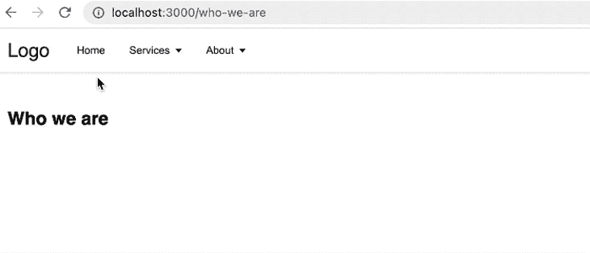
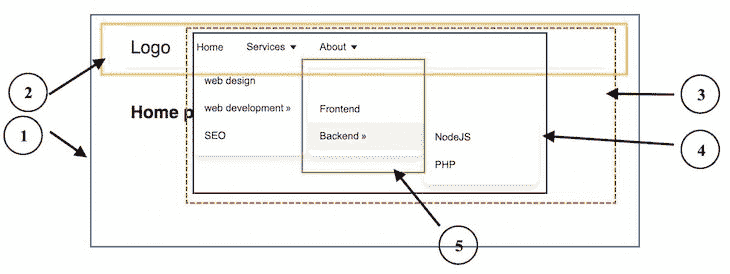
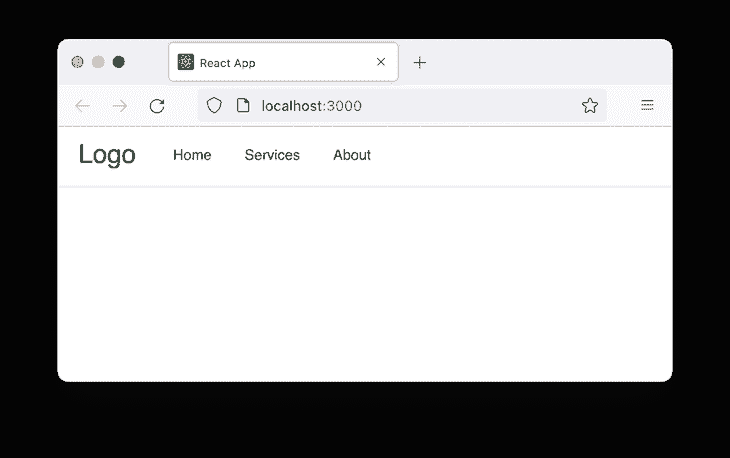
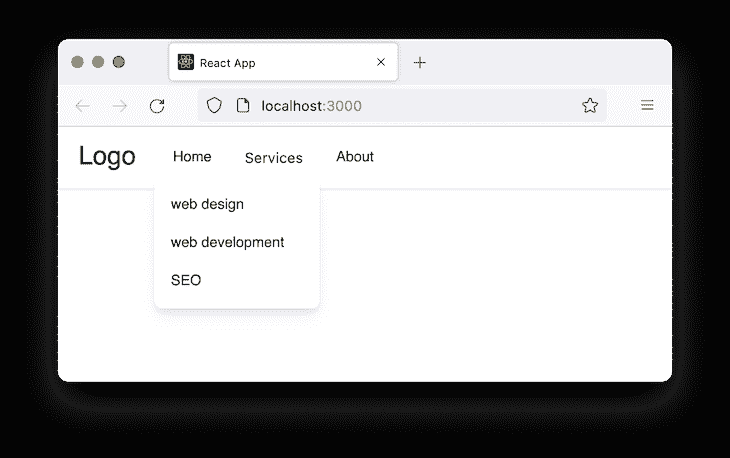
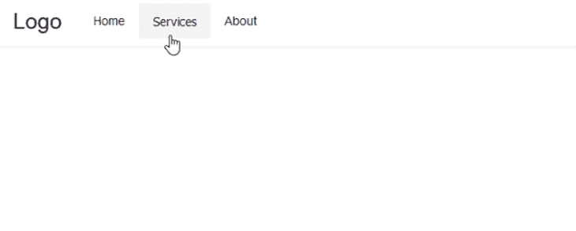
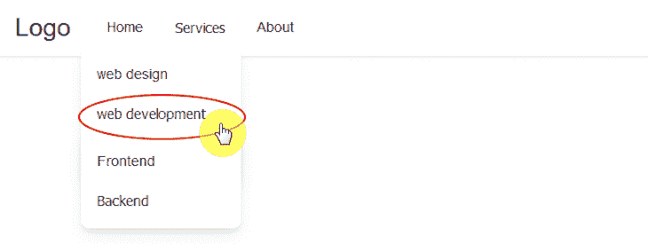

# 如何在 React - LogRocket 博客中创建多级下拉菜单

> 原文：<https://blog.logrocket.com/how-create-multilevel-dropdown-menu-react/>

***编者按:**此贴已于 2022 年 8 月 17 日更新，以更新代码示例和项目说明，并添加关于[多级菜单与巨型菜单](#multilevel-menu-vs-megamenu)和[实现菜单项](#implementing-routing)的路由的章节。*

多级下拉菜单是网页设计的主要元素。由于能够提供多种选项供选择，它们使导航栏变得动态而有条理。

对于任何使用 React 或任何基于 React 的项目(如 Gatsby 或 Next.js)的开发人员，本教程涵盖了如何在 React 项目中实现 dropdown 特性的分步过程。

在本指南的最后，我们将看到下面的菜单:



要遵循本教程，请确保您对 React 有基本的了解，并确认您的计算机上安装了 Node.js。然后，我们可以开始了。

以下是我们将要介绍的内容:

当我们点击或悬停在子菜单项上时，多级菜单被设计成显示深度嵌套的导航，如上面的 GIF 所示。这种设计是中小型企业网站或博客的理想选择。

另一方面，巨型菜单可以一次显示整个网站的导航，而无需点击子菜单。也就是说，一个简单的扩展就可以揭示一个嵌套很深的网站菜单。这种设计对于拥有许多类别和子类别的大型网站非常有用，例如，一个零售网站。

让我们使用`create-react-app` CLI 创建一个新的 React 项目:

```
npx create-react-app react-multilevel-dropdown-menu

```

然后执行以下操作:

```
cd react-multilevel-dropdown-menu
npm start

```

## React 项目结构

让我们将我们的项目形象化，并将用户界面分解成小块组件:



上图中的编号标签对应于以下组件名称:

1.  `App`:父/根组件
2.  `Header`:渲染 logo 和导航条内容
3.  `Navbar`:渲染`MenuItems`组件
4.  `MenuItems`:渲染单个项目和下拉菜单
5.  `Dropdown`:也呈现菜单项

根据这个细分，我们将创建五个不同的组件。当我们开始路由时，我们将添加更多的组件。

正如我们所看到的，这个项目在页面的顶部呈现了菜单导航。尽管如此，相同的过程将被应用于在侧边栏中呈现导航。

### 创建项目文件

在`src`文件夹中，让我们确保文件树遵循以下结构:

```
 ...
  ├── src
  │    ├── components
  │    │     ├── App.js
  │    │     ├── Dropdown.js
  │    │     ├── Header.js
  │    │     ├── MenuItems.js
  │    │     └── Navbar.js
  │    ├── App.css
  │    └── index.js

```

在`components/App.js`文件中，让我们呈现一些简单的文本:

```
const App = () => {
  return <div>App content</div>;
};

export default App;

```

保存文件。现在用以下内容替换`src/index.js`文件的内容:

```
import React from 'react';
import ReactDOM from 'react-dom/client';
import App from './components/App';

// styles
import './App.css';

const root = ReactDOM.createRoot(document.getElementById('root'));
root.render(
  <React.StrictMode>
    <App />
  </React.StrictMode>
);

```

我们导入了一个 CSS 文件，将我们想要的“外观”添加到我们的项目中。所以，让我们从多级下拉菜单项目中复制样式[来替换`src/App.css`文件中的样式。](https://github.com/Ibaslogic/react-multilevel-dropdown-menu/blob/main/src/App.css)

保存所有文件，查看浏览器中呈现的`App`组件的内容。

让我们从呈现顶级菜单项开始构建。为此，让我们创建一个`src/menuItems.js`文件来保存菜单项:

```
export const menuItems = [
  {
    title: 'Home',
    url: '/',
  },
  {
    title: 'Services',
    url: '/services',
  },
  {
    title: 'About',
    url: '/about',
  },
];

```

现在，保存文件。

如果我们从一开始就回忆我们的项目图像，`components/App.js`文件将呈现包含徽标的`Header`组件和`Navbar`组件。所以，在`components/Header.js`文件中，让我们添加以下代码:

```
import Navbar from './Navbar';

const Header = () => {
  return (
    <header>
      <div className="nav-area">
        <a href="/" className="logo">
          Logo
        </a>
        <Navbar />
      </div>
    </header>
  );
};

export default Header;

```

现在，我们对内部链接使用`<a>`标签。在本指南的后面，我们将用`react-router-dom`中的`Link`或`NavLink`组件替换它。

注意，我们导入了`Navbar`组件。因此，转到`components/Navbar.js`并添加以下代码:

```
const Navbar = () => {
  return (
    <nav>
      <ul className="menus">Nav Items here</ul>
    </nav>
  );
};

export default Navbar;

```

接下来，让我们确保更新了`components/App.js`文件以呈现`Header`组件:

```
import Header from './Header';

const App = () => {
  return (
    <div>
      <Header />
    </div>
  );
};

export default App;

```

如果我们保存所有文件，我们应该看到一个标志和导航文本显示在前端。

接下来，在`components/Navbar.js`文件中，导入`menuItems`数据，遍历它，然后在 JSX 中渲染它们:

```
import { menuItems } from '../menuItems';
const Navbar = () => {
  return (
    <nav>
      <ul className="menus">
        {menuItems.map((menu, index) => {
          return (
            <li className="menu-items" key={index}>
              <a href={menu.url}>{menu.title}</a>
            </li>
          );
        })}
      </ul>
    </nav>
  );
};

export default Navbar;

```

保存文件并检查前端。它应该是这样的:



这是一个基本的导航菜单。让我们更进一步，接下来显示一个单级下拉列表。

让我们转到`src/menuItems.js`文件，更新数据以包含一个`submenu`，如下所示:

```
export const menuItems = [
  // ...
  {
    title: 'Services',
    url: '/services',
    submenu: [
      {
        title: 'web design',
        url: 'web-design',
      },
      {
        title: 'web development',
        url: 'web-dev',
      },
      {
        title: 'SEO',
        url: 'seo',
      },
    ],
  },
  // ...
];

```

这里，我们给`Services`添加了一个`submenu`，因为我们想让它成为一个下拉菜单。让我们保存文件。

请注意，您可以忽略`submenu`URL 中的正斜杠`/`。在我们这种情况下，加不加都无所谓。但是，如果你想实现一个动态嵌套路由，你不能包含它。

此时，`Navbar`正在我们的代码中呈现菜单项。如果我们再看一下设计，作为`Navbar`的直接子组件的`MenuItems`组件负责呈现这些项目。

所以，修改`Navbar`，这样我们就有了以下内容:

```
import { menuItems } from '../menuItems';
import MenuItems from './MenuItems';
const Navbar = () => {
  return (
    <nav>
      <ul className="menus">
        {menuItems.map((menu, index) => {
          return <MenuItems items={menu} key={index} />;
        })}
      </ul>
    </nav>
  );
};

export default Navbar;

```

在代码中，我们通过`items`属性将菜单项数据传递给`MenuItems`组件。这是一个被称为正确钻孔的过程，也是一个基本的反应原理。

在`MenuItems`组件中，我们将接收项目属性并显示菜单项。我们还将检查项目是否有一个`submenu`，然后显示一个下拉列表。所以打开`components/MenuItems.js`文件并添加以下代码:

```
import Dropdown from './Dropdown';

const MenuItems = ({ items }) => {
  return (
    <li className="menu-items">
      {items.submenu ? (
        <>
          <button type="button" aria-haspopup="menu">
            {items.title}{' '}
          </button>
          <Dropdown submenus={items.submenu} />
        </>
      ) : (
        <a href={items.url}>{items.title}</a>
      )}
    </li>
  );
};

export default MenuItems;

```

在代码中，我们使用`button`元素打开[下拉菜单](https://blog.logrocket.com/building-a-custom-dropdown-menu-component-for-react-e94f02ced4a1/)。如果我们使用链接标签，如果我们需要辅助技术，比如屏幕阅读器，我们必须添加一个`role="button"`。

同样在代码中，我们导入了`Dropdown`组件，并通过 prop 传递了`submenu`项。

现在让我们打开`components/Dropdown.js`文件并访问道具，这样我们可以像这样渲染`submenu`:

```
const Dropdown = ({ submenus }) => {
  return (
    <ul className="dropdown">
      {submenus.map((submenu, index) => (
        <li key={index} className="menu-items">
          <a href={submenu.url}>{submenu.title}</a>
        </li>
      ))}
    </ul>
  );
};

export default Dropdown;

```

记得保存所有文件。

要查看下拉菜单，打开`src/App.css`文件并暂时注释掉 CSS 的`display: none;`部分:

```
.dropdown {
 ...
 /* display: none; */
}

```

我们在下拉菜单中添加了一个`display: none;`属性，默认情况下隐藏它，只有当我们与菜单交互时才打开它。

一旦我们删除了`display: none;`属性，菜单看起来应该是这样的:



很好。我们快到了！

现在，让我们定义检测下拉菜单项何时被单击的逻辑，以便我们可以动态地显示或隐藏下拉框。为此，我们必须添加一个状态，并在下拉菜单中单击更新它。

在`components/MenuItems.js`文件中，让我们更新代码以包含状态:

```
import { useState } from "react";
// ...
const MenuItems = ({ items }) => {
 const [dropdown, setDropdown] = useState(false);
 return (
  <li className="menu-items">
   {items.submenu ? (
    <>
     <button
      // ...
      aria-expanded={dropdown ? "true" : "false"}
      onClick={() => setDropdown((prev) => !prev)}
     >
      {items.title}{" "}
     </button>
     <Dropdown 
      // ...
      dropdown={dropdown} 
     />
    </>
   ) : (
    // ...
   )}
  </li>
 );
};

```

在代码中，我们定义了一个名为`dropdown`的状态变量，默认值为`false`和一个`setDropdown`更新器，用于在单击下拉按钮时切换状态，如`onClick`事件所示。

这允许我们动态地给`aria-expanded`属性添加值，以指示下拉框是展开还是折叠，这对屏幕阅读器是有益的。我们还将`dropdown`变量作为道具传递给了`Dropdown`组件，这样我们就可以处理下拉切换。

让我们打开`components/Dropdown.js`来访问`dropdown`属性，并使用它在单击下拉菜单时动态添加一个类名。

```
const Dropdown = ({ submenus, dropdown }) => {
 return (
  <ul className={`dropdown ${dropdown ? "show" : ""}`}>
   {/* ... */}
  </ul>
 );
};

export default Dropdown;

```

激活下拉菜单时会添加`show`类名。我们还在 CSS 文件中添加了一个`display: block;`样式声明来显示下拉列表。

现在，我们可以将`display: none;`返回到`src/App.css`中的`.dropdown`类选择器:

```
.dropdown {
 ...
 display: none;
}

```

让我们保存我们的文件。我们现在应该能够切换我们的下拉菜单，就像这样:



像单级下拉列表一样，要添加多级下拉列表，让我们打开`src/menuItems.js`文件并更新数据以包含多级`submenu`组件，如下所示:

```
export const menuItems = [
  // ...
  {
    title: 'web development',
    url: 'web-dev',
    submenu: [
      {
        title: 'Frontend',
        url: 'frontend',
      },
      {
        title: 'Backend',
        submenu: [
          {
            title: 'NodeJS',
            url: 'node',
          },
          {
            title: 'PHP',
            url: 'php',
          },
        ],
      },
    ],
  },
  // ...
];

```

在“web 开发”选项中添加了一个`submenu`和“后端”选项中添加了另一个`submenu`之后，保存文件。

我们知道，一个下拉项目也可以有菜单项，另一个下拉项目，等等。为了实现这个设计，我们将递归地呈现菜单项。在`Dropdown`组件中，让我们将菜单项的呈现委托给`MenuItems`组件。

打开`components/Dropdown.js`文件，导入`MenuItems`，通过`items`道具传递`submenu`:

```
import MenuItems from "./MenuItems";
const Dropdown = ({ submenus, dropdown }) => {
 return (
  <ul className={`dropdown ${dropdown ? "show" : ""}`}>
   {submenus.map((submenu, index) => (
    <MenuItems items={submenu} key={index} />
   ))}
  </ul>
 );
};

export default Dropdown;

```

如果我们保存文件并测试下拉列表，它可以工作，但是我们会注意到下拉列表相互重叠:



当我们点击“web development”子菜单时，我们希望在逻辑上将它的下拉菜单放在右边。我们可以通过检测下拉深度级别来实现这一点。

了解菜单深度级别可以让我们做几件事情。首先，我们可以动态地添加不同的箭头来显示下拉菜单的存在。第二，我们可以用它来检测“第二层及以上”的下拉菜单，因此逻辑上将它们定位在子菜单的右边。

打开`components/Navbar.js`文件，在`return`语句上方添加以下内容:

```
const depthLevel = 0;

```

同样，让我们确保通过一个 prop 将值传递给`MenuItems`。我们的代码现在看起来像这样:

```
// ...
 return (
  // ...
   {menuItems.map((menu, index) => {
    const depthLevel = 0;
    return <MenuItems items={menu} key={index} depthLevel={depthLevel} />;
   })}
  // ...
 );
// ...

```

接下来，在`MenuItems`组件中，我们访问`depthLevel`并使用它来显示下拉箭头:

```
const MenuItems = ({ items, depthLevel }) => {
 // ...
 return (
  <li className="menu-items">
   {items.submenu ? (
    <>
     <button
      // ...
     >
      {items.title}{" "}
      {depthLevel > 0 ? <span>&raquo;</span> : <span className="arrow" />}
     </button>
     <Dropdown
      depthLevel={depthLevel}
      // ...
     />

```

对于大于 T1 的 T0，我们使用一个 HTML 实体名`&raquo;`显示一个右箭头，否则我们添加一个`.arrow`类名来定制一个向下箭头。在样式表中，我们添加了向下箭头的样式。

还要注意，我们通过 prop 将`depthLevel`传递给`Dropdown`；在那里，我们将为下拉菜单增加它。

在`components/Dropdown.js`文件中，访问`depthLevel`属性，增加它，并检查值是否大于`1`，这样我们可以向下拉列表中添加一个自定义类。我们已经在样式表中为该类添加了样式。

同样，确保我们将`depthLevel`作为道具传递给`MenuItems`:

```
const Dropdown = ({ submenus, dropdown, depthLevel }) => {
 depthLevel = depthLevel + 1;
 const dropdownClass = depthLevel > 1 ? "dropdown-submenu" : "";
 return (
  <ul className={`dropdown ${dropdownClass} ${dropdown ? "show" : ""}`}>
   {submenus.map((submenu, index) => (
    <MenuItems 
     // ... 
     depthLevel={depthLevel} 
    />
   ))}
  </ul>
 );
};

export default Dropdown;

```

让我们保存文件并测试项目。


现在我们可以切换菜单，我们需要一种方法来关闭下拉菜单，当我们点击它的外部。

通过在下拉菜单外单击，我们想要关闭它。我们可以通过将`dropdown`状态设置为默认值`false`来做到这一点。我们将定义一个逻辑来检测下拉列表之外的点击。

让我们打开`components/MenuItems.js`文件并更新`import`以包含`useEffect`和`useRef`钩子，如下所示:

```
import { useState, useEffect, useRef } from "react";

```

接下来，我们将使用`useRef`通过向目标节点传递一个引用对象来访问下拉列表中的 DOM 元素:

```
const MenuItems = ({ items, depthLevel }) => {
 // ...
 let ref = useRef();
 return (
  <li className="menu-items" ref={ref}>
   {/* ... */}
  </li>
 );
};

export default MenuItems;

```

然后，在`return`语句上方添加以下代码:

```
useEffect(() => {
 const handler = (event) => {
  if (dropdown && ref.current && !ref.current.contains(event.target)) {
   setDropdown(false);
  }
 };
 document.addEventListener("mousedown", handler);
 document.addEventListener("touchstart", handler);
 return () => {
  // Cleanup the event listener
  document.removeEventListener("mousedown", handler);
  document.removeEventListener("touchstart", handler);
 };
}, [dropdown]);

```

让我们保存文件并测试我们的项目。有用！

在`useEffect`钩子中，我们检查下拉菜单是否打开，然后检查被点击的 DOM 节点是否在下拉菜单之外，然后我们关闭下拉菜单。你可以在这里阅读更多关于[检测外部点击反应。](https://blog.logrocket.com/detect-click-outside-react-component-how-to/)

## 切换鼠标悬停时的下拉菜单以获得更大的屏幕

让我们添加当用户将鼠标移动到菜单项上时显示下拉菜单的功能。

在`components/MenuItems.js`中，更新 JSX 中的`li`以包含`onMouseEnter`和`onMouseLeave`事件:

```
const MenuItems = ({ items, depthLevel }) => {
 // ...
 return (
  <li
   // ...
   onMouseEnter={onMouseEnter}
   onMouseLeave={onMouseLeave}
  >
   {/* ... */}
  </li>
 );
};

export default MenuItems;

```

然后，在`return`语句上方添加以下事件处理函数:

```
const onMouseEnter = () => {
 window.innerWidth > 960 && setDropdown(true);
};

const onMouseLeave = () => {
 window.innerWidth > 960 && setDropdown(false);
};

```

保存文件并测试您的项目。

通过这段代码，当鼠标指针移动到一个菜单项上时，就会调用`onMouseEnter`处理程序。从那里，我们检查窗口的内部宽度是否大于`960px`，然后，我们打开下拉菜单。

每当鼠标离开菜单项时，我们调用`onMouseLeave`处理程序，然后关闭下拉菜单。

## 实施路由

目前，在我们的项目中，我们使用 HTML `<a>`标签来链接内部页面。每当我们单击任何菜单项时，都会导致整个页面重新加载。

对于一个 React 应用程序，我们期望使用优化的链接标签，比如用于该操作的`Link`或`NavLink`组件。同样，我们需要确保导航条目指向并呈现它们各自的页面，这样我们就有了多页面应用程序的感觉。

这就是路由的用武之地。我们将使用 React 路由器跟踪当前的 URL，并根据 URL 显示不同的视图。

让我们安装库:

```
npm install [email protected]

```

### 将 React 应用程序连接到浏览器的 URL

在`src/index.js`文件中，让我们将顶层组件`App`包装在路由器组件中:

```
// ...
import { BrowserRouter } from 'react-router-dom';

const root = ReactDOM.createRoot(document.getElementById('root'));
root.render(
  <React.StrictMode>
    <BrowserRouter>
      <App />
    </BrowserRouter>
  </React.StrictMode>
);

```

保存并确保您的应用程序仍能工作。

### 更新内部链接

`Header`和`MenuItems`组件都使用`<a>`标签来链接内部页面。我们将用路由器库中的`Link`组件替换标签。打开`components/Header.js`，导入`Link`，使用方法如下:

```
// ...
import { Link } from 'react-router-dom';

const Header = () => {
  return (
    <header>
      <div className="nav-area">
        <Link to="/" className="logo">
          Logo
        </Link>
        <Navbar />
      </div>
    </header>
  );
};

export default Header;

```

同样，在`components/MenuItems.js`中，让我们导入`Link`来替换 HTML `<a>`标签:

```
// ...
import { Link } from 'react-router-dom';

const MenuItems = ({ items, depthLevel }) => {
  // ...
  return (
    <li>
      {items.submenu ? (
        <>{/* ... */}</>
      ) : (
        <Link to={items.url}>{items.title}</Link>
      )}
    </li>
  );
};

export default MenuItems;

```

如果我们保存文件并测试我们的应用程序，我们现在应该能够导航而不需要重新加载页面。

### 添加一些路线

现在，我们将添加路线并渲染它们以匹配它们的 URL。让我们创建一个`src/routes`文件夹来保存所有不同的路线。在文件夹中，让我们添加`Home.js`文件来呈现索引页面，并添加以下代码:

```
const Home = () => {
  return <h2>Home page content</h2>;
};

export default Home;

```

您可以在这里找到所有项目路线的[列表。请将它们包含在您的项目中，并确保您添加了它们各自的内容。](https://github.com/Ibaslogic/react-multilevel-dropdown-menu/tree/main/src/routes)

接下来，我们将配置路由，以便 React router 知道如何在不同的 URL 呈现应用程序。我们将在`components/App.js`文件中这样做。这个文件目前呈现了`Header`组件。

让我们移除`Header`组件并渲染路线:

```
import { Routes, Route } from 'react-router-dom';
import Home from '../routes/Home';
import About from '../routes/About';
// ...

const App = () => {
  return (
    <>
      <Routes>
        <Route path="/" element={<Layout />}>
          <Route index element={<Home />} />
          <Route path="about" element={<About />} />
          {/* ...*/}
        </Route>
      </Routes>
    </>
  );
};

export default App;

```

为了简洁起见，我们删除了一些路线。参见[这里的完整代码](https://github.com/Ibaslogic/react-multilevel-dropdown-menu/blob/main/src/components/App.js)。

在代码中，我们将所有路由作为孩子嵌套在一个`Layout`路由中。让我们创建一个`components/Layout.js`文件，并呈现在子路由之间交换的`Header`组件和`Outlet`。

```
import { Outlet } from 'react-router-dom';
import Header from './Header';

const Layout = () => {
  return (
    <div>
      <Header />
      <div className="content">
        <Outlet />
      </div>
    </div>
  );
};

export default Layout;

```

如果我们保存并测试我们的项目，我们应该能够呈现与其路线相匹配的组件。

### 可链接的下拉按钮

有时，我们可能希望像“服务”这样的下拉菜单按钮指向自己的页面`/services`,而当我们悬停在大屏幕上时仍然显示下拉项目。

为此，我们必须确保`src/menuItems.js`中的下拉菜单也包含其 URL 路径:

```
export const menuItems = [
  // ...
  {
    title: 'Services',
    url: '/services',
    submenu: [
      // ...
    ],
  },
  // ...
];

```

接下来，在`components/MenuItems.js`文件中，我们将展开条件检查。目前，我们只检查是否存在一个`submenu`来呈现一个按钮元素，如下所示:

```
return (
  <li>
    {items.submenu ? (
      <>
        <button>
          {items.title}{' '}
          {/* ... */}
        </button>
      </>
    ) : (
      <Link to={items.url}>{items.title}</Link>
    )}
  </li>
);

```

现在，我们不仅要检查`submenu`还要检查 URL，然后我们将确保按钮是可链接的，如下所示:

```
return (
  <li>
    {items.submenu && items.url ? (
      <>
        <button>
          <Link to={items.url}>{items.title}</Link>
          {/* ... */}
        </button>
      </>
    ) : !items.url && items.submenu ? (
      <>
        <button>
          {items.title}{' '}
          {/* ... */}
        </button>
      </>
    ) : (
      <Link to={items.url}>{items.title}</Link>
    )}
  </li>
); 

```

### 单击下拉菜单的项目时关闭下拉菜单

当我们单击一个下拉项目来打开它的页面时，我们希望关闭下拉面板。我们将向菜单项添加一个 click 事件，以调用一个函数来将下拉列表状态设置回默认的 false 值。

```
const MenuItems = ({ items, depthLevel }) => {
  const [dropdown, setDropdown] = useState(false);
  // ...
  const closeDropdown = () => {
    dropdown && setDropdown(false);
  };

  return (
    <li
      // ...
      onMouseEnter={onMouseEnter}
      onMouseLeave={onMouseLeave}
      onClick={closeDropdown}
    >
      {/* ... */}
    </li>
  );
};

export default MenuItems; 

```

### 较小屏幕上的单级下拉菜单

虽然我们的项目可以在桌面和移动设备上运行，但用户体验在设计导航菜单时很重要，而不仅仅是为了 React 中[菜单栏的可访问性。](https://blog.logrocket.com/building-accessible-menubar-component-react/)

我们可能希望将下拉级别限制为单个下拉，然后防止菜单按钮指向自己的页面，而是打开一个下拉面板。以我们目前所学，我们应该能够实现我们想要的任何逻辑。

在`components/MenuItems.js`中，在`button`元素内，如果屏幕小于 960 像素，我们可以删除主导航条的`Link`功能:

```
{items.submenu && items.url ? (
  <>
    <button
    // ...
    >
      {window.innerWidth < 960 && depthLevel === 0 ? (
        items.title
      ) : (
        <Link to={items.url}>{items.title}</Link>
      )}
      {/* ... */}
    </button>
  </>
) : !items.url && items.submenu ? (
  <>{/* ... */}</>
) : (
  {
    /* ... */
  }
)}

```

接下来，我们将删除目标窗口屏幕下拉列表中的右箭头。仍然在`components/MenuItems.js`中，在`button`元素中查找以下代码:

```
{depthLevel > 0 ? (
  <span>&raquo;</span>
) : (
  <span className="arrow" />
)}

```

替换为:

```
{depthLevel > 0 &&
window.innerWidth < 960 ? null : depthLevel > 0 &&
  window.innerWidth > 960 ? (
  <span>&raquo;</span>
) : (
  <span className="arrow" />
)}

```

保存并测试您的项目。它应该像预期的那样工作。

## 结论

我很高兴我们在这里。现在我们可以在 React 项目中实现一个[多级下拉菜单。](https://blog.logrocket.com/how-to-build-a-react-accordion-menu-from-scratch/)

使用本教程中的实现，我们可以在数据文件中添加尽可能多的菜单和子菜单，多级下拉菜单神奇地出现在前端。然而，我们应该注意我们添加的下拉列表的级别，这样用户就不会觉得讨厌了。

如果你有问题和/或贡献，我在评论区。如果你喜欢这个教程，确保你在网上分享它。

你可以从[这个 GitHub 库](https://github.com/Ibaslogic/react-multilevel-dropdown-menu)中找到项目源代码。

## [LogRocket](https://lp.logrocket.com/blg/react-signup-general) :全面了解您的生产 React 应用

调试 React 应用程序可能很困难，尤其是当用户遇到难以重现的问题时。如果您对监视和跟踪 Redux 状态、自动显示 JavaScript 错误以及跟踪缓慢的网络请求和组件加载时间感兴趣，

[try LogRocket](https://lp.logrocket.com/blg/react-signup-general)

.

[ ](https://lp.logrocket.com/blg/react-signup-general) [](https://lp.logrocket.com/blg/react-signup-general) 

LogRocket 结合了会话回放、产品分析和错误跟踪，使软件团队能够创建理想的 web 和移动产品体验。这对你来说意味着什么？

LogRocket 不是猜测错误发生的原因，也不是要求用户提供截图和日志转储，而是让您回放问题，就像它们发生在您自己的浏览器中一样，以快速了解哪里出错了。

不再有嘈杂的警报。智能错误跟踪允许您对问题进行分类，然后从中学习。获得有影响的用户问题的通知，而不是误报。警报越少，有用的信号越多。

LogRocket Redux 中间件包为您的用户会话增加了一层额外的可见性。LogRocket 记录 Redux 存储中的所有操作和状态。

现代化您调试 React 应用的方式— [开始免费监控](https://lp.logrocket.com/blg/react-signup-general)。