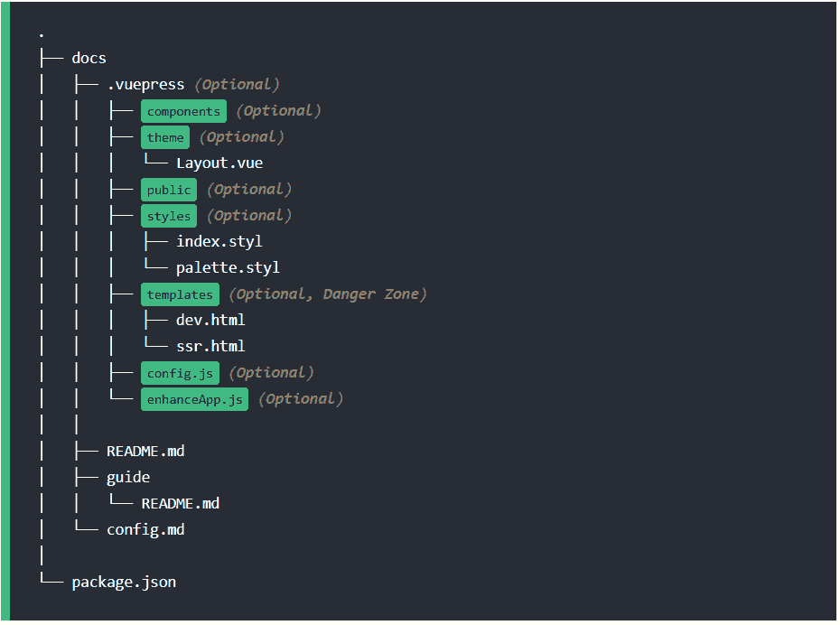
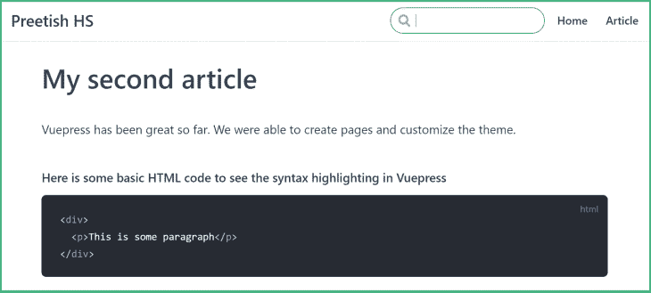
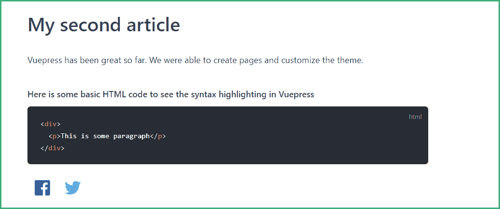
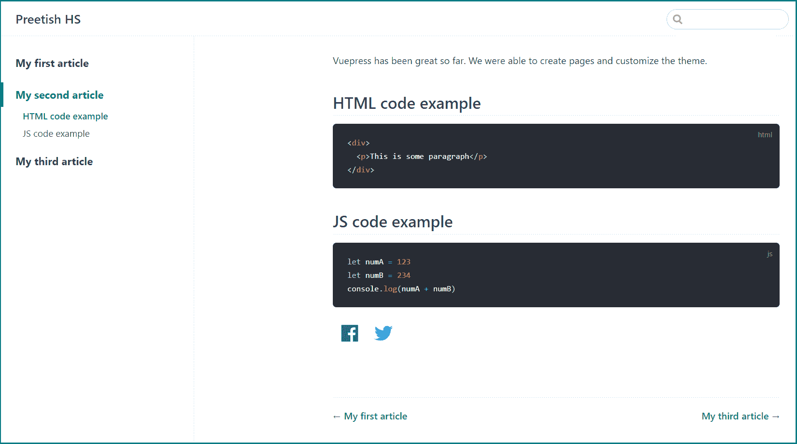

# 如何使用 VuePress 和 Markdown - LogRocket 博客创建作品集和博客

> 原文：<https://blog.logrocket.com/how-create-portfolio-blog-using-vuepress-markdown/>

VuePress 是一个由 Vue 驱动的静态站点生成器，由 Vue.js 团队开发和维护。尽管它是在考虑技术文档的情况下构建的，但它可以用于创建更多内容，包括登录页面、文件夹、博客等等。

[VuePress](https://blog.logrocket.com/vuepress-in-all-its-glory-2f682e4f70c0/) 自带一些默认插件，用户也可以安装自定义插件。默认主题针对文档进行了优化，但用户也可以安装自定义主题或开发自己的主题。

## vexpress 如何工作

VuePress 是使用 Markdown 编写的，它的引擎会将每个 Markdown 文件转换为预先呈现的静态 HTML 页面。因为它是静态呈现的，所以应用程序是快速且 SEO 友好的。该网站仍然使用 Vue.js，这意味着它在初始页面加载后仍然是一个 SPA，因此我们也享受到了流畅的导航功能。

从技术上讲，你根本不需要了解 Vue.js 就可以使用 VuePress 创建一个网站，但是了解 Vue.js 会给你带来很多好处。如果你在你的 Markdown 文件之间编写定制的 Vue 组件作为 Markdown，你会发现自己在使用 VuePress 时受到限制。

## 安装和使用 vexpress

要安装 VuePress，请输入以下代码。

```
yarn global add vuepress

```

注:在撰写本文时，我无法使用 NPM 安装 VuePress。

接下来，为您的 VuePress 应用程序创建一个目录，并创建一个启动文件。让我们试着用 VuePress 建立一个简单的博客组合。

通过运行以下命令启动应用程序。

```
vuepress dev

```

打开浏览器`localhost:8080`，你会看到一个应用程序只运行一个 Markdown 文件。记住，`README.md`文件被转换为`index.html`。如果我们使用其他名字(比如说，`Hello.md`，我们将不得不打开`localhost:8080/hello`。

`vuepress dev`使 VuePress 在根目录下运行。我们将创建一个`src`或`docs`目录来保存我们所有的文件，然后使用:

```
vuepress dev src

```

## 目录结构



这大概就是 VuePress 应用程序的目录结构的样子。我们将详细讨论这些目录及其用途。

路由表根据目录结构自动创建。根文件`README.md`将是我们的主文件`index.html`，根目录中的后续目录将使用 URL 路径名作为它们的目录名。

在我们深入讨论之前，让我们再创建几个文件来看看实际的路由。

创建一个名为`src`的目录，并将`README.md`文件移动到这个文件夹中。在`src`目录下再创建一个名为`Article.md`的文件，并添加下面的 Markdown 代码。

```
//Article.md
# My first Article
VuePress is an amazing static site generator! 

```

现在使用下面的代码重新运行项目。

```
vuepress dev src

```

打开浏览器，你会看到`localhost:8080/article`，还有第一篇文章。但是我们的网站看起来有点简单，没有任何标题，所以让我们现在配置它。

### 配置

VuePress 高度可定制。让我们在`src`文件夹中创建一个`.vuepress`目录，并在其中创建一个`config.js`文件。`config.js`文件用于定义所有的全局配置，比如主标题、主题配置、webpack 配置、添加插件等等。

```
//config.js
module.exports = {
  title: 'Preetish HS',
  description: 'My awesome portfolio blog'
}

```

保存并重新加载应用程序，您将看到标题显示在标题中。让我们在这个文件中做一些特定于主题的修改。

```
//config.js
module.exports = {
  title: 'Preetish HS',
  description: 'My awesome portfolio blog',
  themeConfig: {
    nav: [
      { text: 'Home', link: '/' },
      { text: 'Article', link: '/article' }
    ]
  }
}

```

我们刚刚添加了两个`navbar`链接，应该是这样的:


在我们进一步定制我们的应用程序之前，让我们再添加两篇文章。创建`Article2.md`和`Article3.md`。默认主题支持所有基本的 Markdown 特性，比如标题、表格和代码块的语法突出显示。

```
//Article2.md
# My second article

VuePress has been great so far. We were able to create pages and customize the theme.

```



Add some content to create a third article. Since the number of articles is increasing, let’s put all the articles into a `blog` folder and create a separate page for them.

将`config.js`改为链接到`blog`。

```
 themeConfig: {
    nav: [
      { text: 'Home', link: '/' },
      { text: 'blog', link: '/blog' }
    ]
  },

```

点击导航栏上的`blog`链接会出现 404 页面，因为在`blog`文件夹中没有`Readme.md`文件，但是文章仍然可以从`localhost:8080/blog/article`访问。

让我们设计一个页面来展示我们所有的文章。我们可以建造这样的东西:

```
//blog/Readme.md

# My Posts
[Article 1](Article.md)
[Article 2](Article2.md)
[Article 3](Article3.md)

```

这是可行的，但是看起来像是 90 年代的东西。相反，让我们利用 Vue.js 为我们的博客页面编写一个漂亮的卡片布局。

## 在降价中使用 Vue 组件

我们可以在`.vuepress/components`目录中创建 Vue 组件。该文件夹中的任何`.vue`文件都将被全局注册，并且可以通过直接使用组件名称从我们的任何 Markdown 文件中访问。

让我们用一些卡片创建一个`Posts.vue`组件。

```
<template>
  <div class="post-container">
    <router-link to="article">
      <div class="post-card">
        
        <div class="description">
          My first Article
        </div>
      </div>
    </router-link>
    <router-link to="article2">
      <div class="post-card">
        
        <div class="description">
          My Second Article
        </div>
      </div>
    </router-link>
    <router-link to="article3">
      <div class="post-card">
        
        <div class="description">
          My third Article
        </div>
      </div>
    </router-link>
  </div>
</template>
<script>
export default {}
</script>
<style scoped>
.post-container {
  display: flex;
  flex-wrap: wrap;
  width: 100%;
}
.post-card {
  width: 600px;
  height: 150px;
  margin: 10px;
  border: 1px solid #ccc;
  border-radius: 3px;
  padding: 10px;
  display: flex;
  align-items: center;
}
.article-image {
  height: 100%;
}
.description {
  width: 100%;
  display: flex;
  justify-content: center;
}
</style>

```

使用 Markdown 文件中的以下组件并重新加载页面。

```
# My Posts
<posts />

```


这看起来好多了，但仍然不完美。我们对所有内容都进行了硬编码，一个博客帖子应该有更多的细节，比如作者姓名和简短描述。

VuePress 将整个网站的数据注入所有组件。这使我们能够访问`$site`和`$page`，它们由 Vue 组件和 Markdown 文件中与站点和页面相关的数据组成。

数据大概是这样的:


这包括与完整的应用程序配置和单个页面相关的数据。我们使用`$site.pages`来动态创建我们的文章页面，而不是硬编码。问题是这个数组列出了所有的页面，包括主页和文章页面本身。我们需要将文章页面与其他页面区分开来。

## 前沿问题

在每个页面对象中，您会看到一个名为`frontmatter`的对象。`frontmatter`本质上是特定于页面的元数据，我们可以在文件的开头用 YAML、JSON 或 TOML 格式编写。让我们为我们的文章页面写`frontmatter`。

```
//Article.md

---
title: My first article
description: Basic intro to vuepress
author: Preetish HS
type: article
---

```

现在我们可以使用这些来动态填充我们的文章页面。

```
<template>
  <div class="post-container">
    <router-link v-for="page in pages" :to="page.path">
      <div class="post-card">
        
        <div class="page-detail">
          <div class="page-title">{{ page.title }}</div>
          <div class="page-description">{{ page.frontmatter.description }}</div>
          <div class="page-author">Author: {{ page.frontmatter.author }}</div>
        </div>
      </div>
    </router-link>
  </div>
</template>
<script>
export default {
  data() {
    return {
      pages: []
    }
  },
  mounted() {
    this.$site.pages.forEach(page => {
      if (page.frontmatter.type === 'article') {
        this.pages.push(page)
      }
    })
  }
}
</script>

```


代码看起来更干净，卡片看起来也更好。

现在让我们为`portfolio`创建另一个文件夹，添加我们的每个项目，最后，添加一个到导航栏的链接。

## 主页定制

直到现在，我们还没有对主页做太多的改动。我们可以定制 VuePress 的默认主题来创建一个令人惊叹的主页，并配有横幅图像等。从根目录打开`Readme.md`，添加下面的`frontmatter`代码。

```
---
home: true
heroImage: /images/banner.jpg
heroText: Hi, I am Preetish. Welcome to my blog!
tagline: I am a Remote Vue.js Developer and a Tech Blogger
actionText: See my work →
actionLink: /blog/
features:
  - title: Frontend Developer
    details: I am a frontend developer with expertise in Vue.js and Nuxt.js
  - title: Tech Blogger
    details: I love writing tech articles to share my knowledge on frontend frameworks, libraries, best practices and more.
  - title: Traveller
    details: Travelling is my favourite activity, I am an avid hiker and backpacker
footer: Developed using VuePress ♥️
---

```

我们在作品集主页上添加了很多东西，比如标题、横幅图像和一些其他细节。它现在应该看起来像这样:


您可能会从 Vue.js 官方文档中认出这种布局——Vue press 最初是为了维护 Vue.js 和其他官方 Vue 包文档而编写的——但我们仍然可以进一步定制它。我们可以覆盖默认 CSS，编写自定义 CSS，甚至为整个网站编写自定义布局。

### 自定义 CSS

要编写定制的、特定于页面的 CSS，使用`frontmatter`向页面添加一个类名，并在该类下编写样式来覆盖现有的样式。

让我们自定义我们的主页，让它看起来更好一点。将下面的代码添加到根目录的`Readme.md`中。

```
---
pageClass: homepage
---

```

我们需要以`stylus`格式编写`.vuepress/styles/index.styl`文件中的样式。让我们在那里创建一个文件，并对主页进行一些修改。

```
.theme-container.homepage {
  .hero {
    img {
      width: 100%;
      object-fit: cover;
      margin: 30px 0 0 0;
    }
  }
  .home {
    max-width: 100%;
    padding: 0;
  }
  .features {
    padding: 0.5rem 1rem;
  }
}

```

使用上面的代码，我们添加了一些自定义的 CSS 来使我们的页面和英雄图像全角。我们还可以覆盖默认的配色方案，改变导航条的高度，甚至修改默认主题的响应断点。

现在让我们修改主色，把它改成蓝绿色。这段代码写在`.vuepress/styles/palette.styl`文件中:

```
$accentColor = #007f80

```


现在我们的投资组合网站正在成形！

## 安装插件

通过运行以下命令创建一个`package.json`文件:

```
npm init

```

VuePress 有许多官方插件以及无数的社区插件。让我们安装一个插件，让读者可以在社交媒体上分享文章。

```
npm install vuepress-plugin-social-share -D

```

要使用这个插件，我们需要在`config.js`文件中声明它，如果需要的话，还需要额外的配置。

```
//config.js
module.exports = {
  plugins: [
      'social-share',
      {
         networks: ['twitter', 'facebook', 'reddit', 'telegram']
      },
  ],
}

```

现在让我们将插件应用到我们的文章中。

```
//Article2.md
.
.
<social-share :networks="['facebook', 'twitter']"/>

```



## 更多自定义

将我们的每个文章文件重新命名为有意义的名称(例如，`my-first-article.md`)可能有助于生成一个更加 SEO 友好的 URL(例如，`[http://localhost:8080/blog/my-first-article.html](http://localhost:8080/blog/my-first-article.html)`)。

当我们打开一篇单独的文章时，我们会看到边上有很多空间。此外，我们不能直接导航到其他文章。让我们通过使用默认主题中的`siderbar`特性来解决这个问题。

在`config.js`文件中，添加以下代码。

```
themeConfig: {
    sidebar: [
      '/blog/my-first-article',
      '/blog/my-second-article',
      '/blog/my-third-article'
    ]
}

```



这应该会创建一个导航侧栏，以及导航到上一篇和下一篇文章的链接。

## 部署

最后，让我们通过运行以下命令来构建和部署我们的应用程序:

```
vuepress run build src

```

构建文件将在`.vuepress/dist`中提供。与`Nuxt generate`类似，VuePress 为所有可能的路线创建 HTML 静态页面。这可以很容易地部署在任何静态托管服务中，如 GitHub Pages、 [Netlify](https://blog.logrocket.com/exploring-netlify-split-testing/) 等。

## 结论

现在，您应该能够在大约 10 分钟内使用 VuePress 创建一个 SEO 友好的静态文件夹和博客。如你所见，你甚至可以在不了解 Vue 的情况下使用 VuePress。默认主题有无数现成的特性，您可以通过修改现有主题或从头开始编写一个新主题来定制它。VuePress 功能强大，它的用途不应该仅限于文档。

## 像用户一样体验您的 Vue 应用

调试 Vue.js 应用程序可能会很困难，尤其是当用户会话期间有几十个(如果不是几百个)突变时。如果您对监视和跟踪生产中所有用户的 Vue 突变感兴趣，

[try LogRocket](https://lp.logrocket.com/blg/vue-signup)

.

[](https://lp.logrocket.com/blg/vue-signup)[https://logrocket.com/signup/](https://lp.logrocket.com/blg/vue-signup)

LogRocket 就像是网络和移动应用程序的 DVR，记录你的 Vue 应用程序中发生的一切，包括网络请求、JavaScript 错误、性能问题等等。您可以汇总并报告问题发生时应用程序的状态，而不是猜测问题发生的原因。

LogRocket Vuex 插件将 Vuex 突变记录到 LogRocket 控制台，为您提供导致错误的环境，以及出现问题时应用程序的状态。

现代化您调试 Vue 应用的方式- [开始免费监控](https://lp.logrocket.com/blg/vue-signup)。