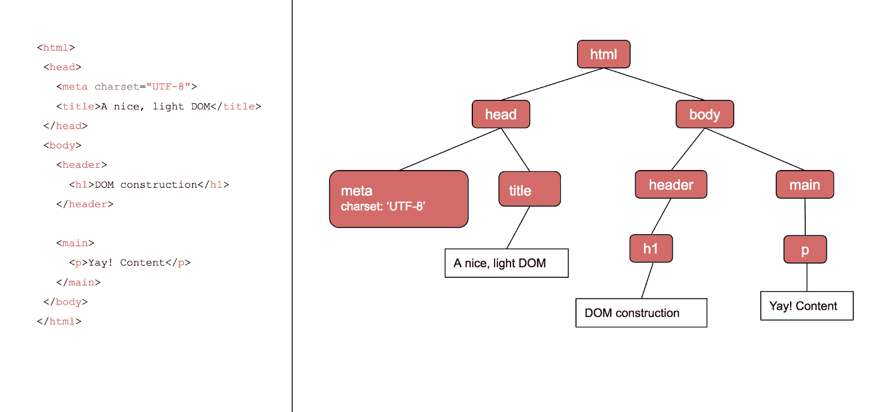
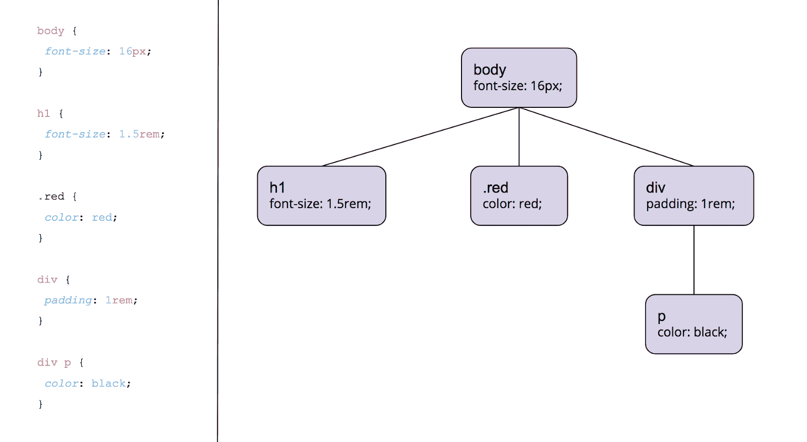
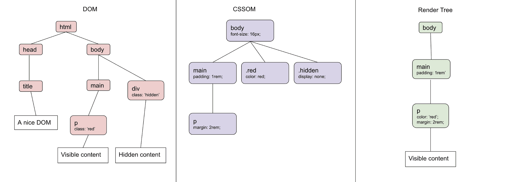

# CSS 如何工作:在关键渲染路径中解析和绘制 CSS

> 原文：<https://blog.logrocket.com/how-css-works-parsing-painting-css-in-the-critical-rendering-path-b3ee290762d3/>

[https://platform.twitter.com/widgets.js](https://platform.twitter.com/widgets.js)

CSS 经常让人感觉像是一种神秘的、异想天开的力量，控制着我们在网络上看到的一切。有时它本身可能很简单，但是编写可伸缩的、高性能的 CSS 似乎是例外而不是标准。

无论你认为 CSS 是“不可避免的邪恶”,还是认为它有能力但被误解，CSS 对于任何从事 web 应用的人来说都是必备的。对 CSS 的深入了解可能是一个漂亮、精致的 web 应用程序和一个感觉有点“嗯”的应用程序之间的差别。

这篇文章将是我们深入研究 CSS 及其附属生态系统的系列文章的第一篇。我们的愿景是，通过打开 CSS 的盖子，我们可以更深入地理解和欣赏事实上的 web 样式语言，使我们能够编写更快、更干净、更漂亮的 CSS，随着应用程序的规模和复杂性的增长而扩展。

* * *

在本系列的第一篇文章中，我们将讨论 CSS 如何在初始页面加载时呈现在屏幕上。

我们关心 CSS 变成漂亮像素的途径的原因可以归结为两个词。

***加载时间。***

如果你的网站加载时间很长，那么你的用户可能不会等着它结束，即使那里有有价值的内容。一些研究表明，多达 50%的移动用户在等待 3 秒钟后离开页面。

随着用户对这些类型的加载时间的期待，我们作为 web 开发人员有责任不增加我们发送给用户的内容数量。可悲的是，CSS 经常是增加加载时间的罪魁祸首，所以对你发送的 CSS 如何转换成漂亮的像素有一个细致入微的理解将帮助你优化用户最有可能反弹的关键时刻。

### 不管怎样，关键的渲染路径是什么？

当我们说用户想要更快的加载时间时，我们必须区分*关键*和*非关键*资源。也许你在偷懒加载你的一些图片，或者你设置了一点奇特的路径分割(谢谢你，webpack！)不要一次发送所有的 JavaScript。这些在初始页面呈现之后加载的资源被认为是*非关键的*——也就是说，它们不会延迟页面的初始呈现。延迟页面第一次呈现的资源被认为是*关键*。

关键呈现路径是浏览器从接收到 HTML 的第一个字节到第一次在屏幕上呈现像素必须采取的最少步骤。本质上，它是浏览器必须做的事情，将我们的关键资源处理成我们的用户可以享受的东西。它看起来像这样。

1.  从接收到的 HTML 构建 DOM(文档对象模型)
2.  如果我们遇到一个 CSS 样式表(嵌入的或链接的)，开始构建 CSSOM (CSS 对象模型——我们一会儿会谈到这是什么)。
3.  如果我们在构建 DOM 的时候遇到了 JS 块(没有指定为`async`)，等待 CSSOM 构建，停止 DOM 构建，解析/执行代码。这样做的原因是因为 JS 执行可以修改 DOM 并访问/修改 CSSOM。

出于本文的目的，我们将深入第二步 CSS 如何影响关键的渲染路径。我们很容易极其小心地对 JavaScript 进行树抖动、路径分割和延迟加载，但有时 CSS 可能会被遗忘。然而，一个未优化的 CSS 包很容易严重影响你的加载时间。

### HTML 和关键呈现路径

由于这主要是一篇关于 CSS 的文章，我们不会在 DOM 构造上花太多时间。然而，CSS 基本上是一种用于样式标记的语言，所以我们需要知道它是如何与 DOM 交互的。

DOM 是一个树状数据结构，包含页面上的所有 HTML 节点。每个节点都包含关于 HTML 元素的数据(例如属性、id 和类)。如果节点有任何 HTML 元素作为子节点，它也会指向这些子节点。例如，给定下面的 HTML，我们将构造下面的 DOM。注意 HTML 的缩进和 DOM 的结构非常相似。

至于关键的呈现路径，我们认为 HTML 是我们的呈现阻塞的关键资源之一——如果我们还没有解析它，我们就不能呈现任何内容！

### 构建 CSS 对象模型

当浏览器遇到 CSS 样式表(嵌入式或外部)时，它需要将文本解析成可用于样式布局和绘制的内容。浏览器将 CSS 转换成的数据结构被创造性地命名为 CSSOM，即 CSS 对象模型。

CSSOM 看起来像什么？给定下面的 CSS，浏览器将构建一个如下所示的 CSSOM。

本质上，我们解析所有的 CSS 选择器，并给它们分配在树中的位置。如果只有一个选择器，它将被附加到树的根节点上。嵌套的选择器将被附加到它们所嵌套的节点上。CSS 解析器必须从右到左读取嵌套的选择器，以保证它们最终位于正确的节点之下。

将 CSS 转换成 CSSOM 被认为是一个“渲染阻塞”阶段，就像从 HTML 中构建 DOM 一样。如果它不等待 CSSOM 就直接渲染成像素，我们会看到一闪而过的无样式内容(难看！)在 CSSOM 解析的时候。之后，当最终应用 CSS 时，一切都会改变。远远算不上伟大的 UX。

### 朗读者

浏览器使用构造的 CSSOM 和 DOM 创建“渲染树”。简而言之，渲染树包含浏览器在页面上创建像素所需的所有信息。浏览器基本上把 DOM 和 CSSOM 放在一起，去掉任何对渲染输出没有影响的东西。

首先，浏览器删除所有不可见的元素。这包括像`<head>`、`<script>`和`<meta>`这样的元素，以及具有`hidden`属性的 HTML 元素。这些元素虽然被应用程序的其他部分使用，但不会呈现到页面上，因此浏览器可以安全地继续呈现，因为它知道呈现树中的所有元素实际上都是可见的 HTML 元素。

接下来，我们遍历 CSSOM，找出当前渲染树中的哪些元素与 CSS 选择器匹配。任何匹配的选择器的 CSS 规则将被应用到渲染树的那个节点。

不过，有一个 CSS 规则是个例外。在 CSS 规则中应用`display: none;`将*从渲染树中完全移除一个元素*。这又回到了在渲染树中只包含可见元素。*其他隐藏元素的方法，如* `*opacity: 0;*` *不会从渲染树中移除元素，而是渲染它而不显示它*。

这样我们就有了一个渲染树，一切准备就绪！在我们将 CSSOM 和 DOM 组合成一个渲染树之后，浏览器可以使用它并安全地假设渲染树包含了绘制第一批像素所需的信息——不多也不少。

### 冲刺阶段:布局和绘画

有了完整的渲染树，浏览器就可以开始在页面上放置实际的像素了。关键渲染管道的最后阶段包含两个主要步骤:布局和绘制。

布局是浏览器计算出*元素去哪里*和*它们占据了多少空间*的地方。浏览器在这里考虑影响边距、填充、宽度和位置的规则。计算布局时，浏览器必须从渲染树的顶部开始向下移动，因为每个元素的位置、宽度和高度都是根据其父节点的位置计算的。

如果你熟悉 CSS 盒子模型，浏览器实际上是在页面上绘制一堆 CSS 盒子(如果你想了解更多关于盒子模型的信息，这里有一些很好的读物)。

然而，重要的是要记住，此时*页面*上没有显示任何内容。可以把它想象成在视窗中绘制模板线，准备填充它们。

绘制直接发生在布局阶段之后，我们终于可以看到一些渲染到页面上的东西了！如果你用到达第一个像素的时间来衡量比赛的终点，这就是终点线。浏览器遍历所有其他 CSS 框，并用非布局规则填充它们。如果你正在使用多个合成器层，浏览器将确保东西进入它们的专用层。

重要的是要记住，有些 CSS 属性对页面权重的影响比其他属性更大(例如，绘制径向渐变比绘制简单的颜色要复杂得多)。如果你在绘制过程中遇到一些“问题”,减少“昂贵的”CSS 规则可以极大地提高应用程序的感知性能。

* * *

### 我为什么要关心关键渲染路径中的 CSS？

你可以花尽可能多的时间来优化你的应用程序的每秒帧数性能，让它看起来很漂亮，或者 A-B 测试更高的转化率，但如果你的用户在页面加载前反弹也没关系。

知道浏览器采取哪一步来到达非常重要的第一个像素是至关重要的(没有双关语😂)如果你想提高你的加载时间。由于浏览器在解析完所有 CSS 之前会阻止渲染，所以通过从初始 HTML 文档中删除任何不适用于第一次绘制的 CSS，可以大大缩短加载时间。这样做可以大大减少浏览器构建 CSSOM 和渲染树所需的时间。

任何第一次加载不需要的 CSS 都可以被认为是“非关键的”,可以在用户获得第一次绘制后延迟加载(如果你有一个单页面应用程序，这一点尤其重要，为甚至还不可见的页面发送 CSS 会严重影响性能！)

了解 CSSOM 是如何构造的另一个好处是对选择器性能有更深入的了解。因为嵌套选择器必须检查 CSSOM 的父节点，所以它们的性能往往比避免嵌套选择器的平面 CSSOM 稍差。然而，我敢说，在大多数应用程序中，这并不是你的性能瓶颈，在你需要重写 CSS 选择器之前，可能还有其他事情可以优化。

与任何与 web 性能相关的事情一样，在开始对 CSS 进行全面检查之前，您可能最好先分析一下您的加载时间。如果你用的是 Chrome，打开 DevTools，进入`Performance`标签。通过查找`Recalculate Styles`、`Layout`和`Paint`事件，您可以快速查看您在 CSSOM 构建、布局和绘制上花费了多少时间。然后你可以开始琢磨你的瓶颈，并开始相应地优化。

## 200 只显示器出现故障，生产中网络请求缓慢

部署基于 Node 的 web 应用程序或网站是最简单的部分。确保你的 Node 实例继续为你的应用程序提供资源是事情变得更难的地方。如果您有兴趣确保对后端或第三方服务的请求成功，

[try LogRocket](https://lp.logrocket.com/blg/node-signup)

.

[https://logrocket.com/signup/](https://lp.logrocket.com/blg/node-signup)

LogRocket 就像是网络和移动应用程序的 DVR，记录下用户与你的应用程序交互时发生的一切。您可以汇总并报告有问题的网络请求，以快速了解根本原因，而不是猜测问题发生的原因。

LogRocket 检测您的应用程序以记录基线性能计时，如页面加载时间、到达第一个字节的时间、慢速网络请求，还记录 Redux、NgRx 和 Vuex 操作/状态。

[Start monitoring for free](https://lp.logrocket.com/blg/node-signup)

.