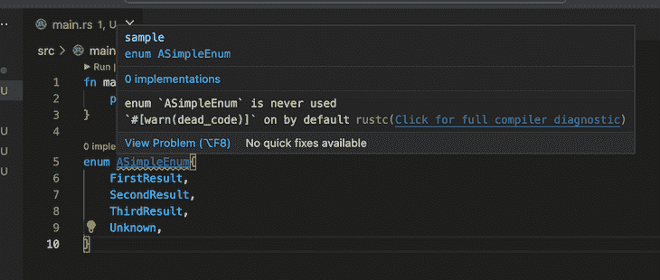
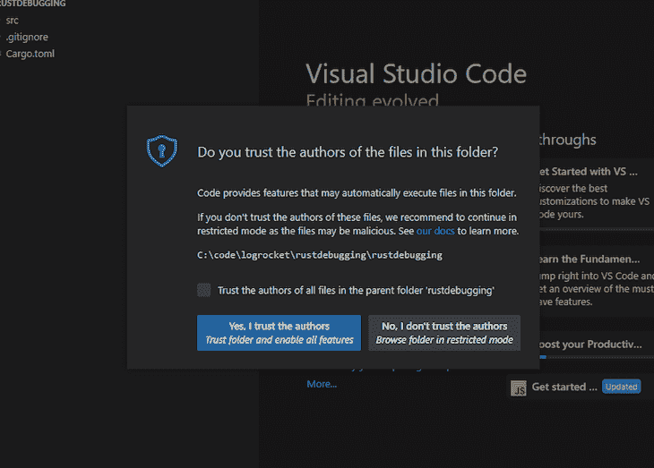
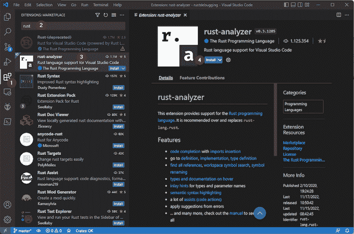
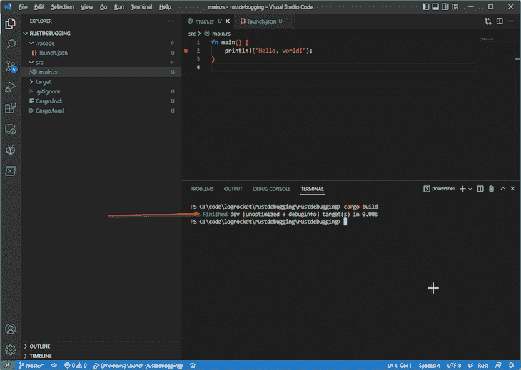
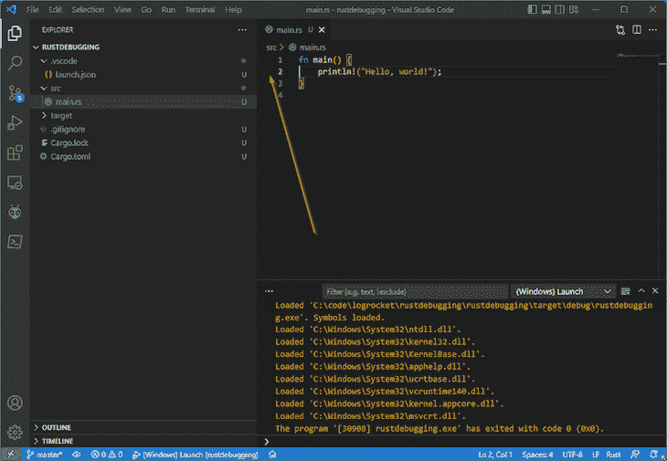
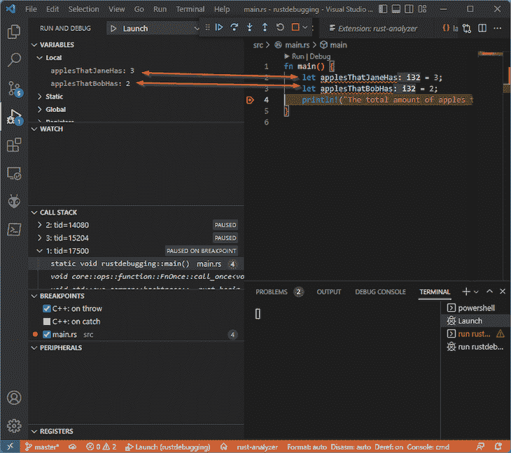
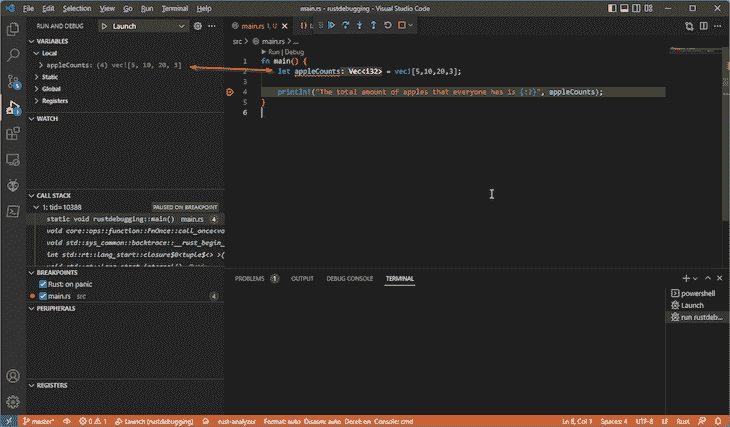
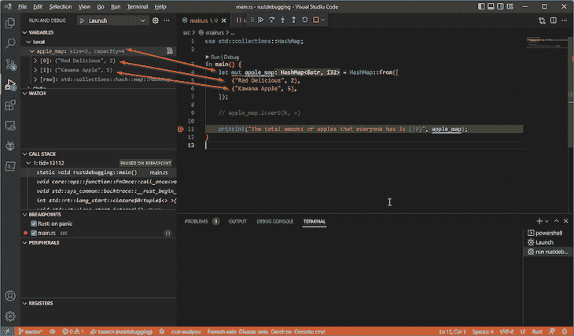

# 如何用 VS 代码调试 Rust

> 原文：<https://blog.logrocket.com/how-debug-rust-vs-code/>

Rust 因其易用性、安全性和高性能而继续保持其作为最受欢迎的编程语言的地位。随着这种流行，许多新开发人员都是第一次学习 Rust。

在本地设置 Rust 开发时，一个重要的任务是选择一个开发环境，然后设置该环境来做您想要它做的事情。许多开发人员选择在 Visual Studio 代码中调试他们的代码，因为它是免费的，并且在大多数硬件上使用起来感觉很快。

让我们看看如何在 Visual Studio 代码上安装 Rust 进行调试！🧑‍💻🚀

向前跳:

## 使用 VS 代码调试 Rust 的好处

VS 代码受益于跨多种平台的可用性，所以无论你是在 Linux、Windows 还是 macOS 上编码，你都可以开发和调试 Rust。

开发体验也是一流的，因为 VS 代码的 [Rust 插件也在你的 Rust 项目中使用了`rust-analyzer`。就其本身而言，这意味着您可以在 VS 代码中获得优秀的代码提示和建议。](https://marketplace.visualstudio.com/items?itemName=rust-lang.rust-analyzer)

价格也合适——免费！—并且表现良好。如果你将使用 VS 代码与另一个 IDE 如 CLion 进行比较，VS 代码表现得出奇的好。而且，如果你已经在开发软件，很有可能你已经在电脑上安装了。

查看这篇[关于 VS 代码和其他 ide 的深入比较](https://blog.logrocket.com/comparing-rust-ides-intellij-idea-vs-code-more/)以了解更多信息。

## 使用 VS 代码调试 Rust 时可用的操作

当您对 VS 代码使用`rust-analyzer`扩展时，它提供了一系列代码林挺特性，帮助您编写更高质量的代码。例如，如果我们创建了一个`enum`而没有使用它，VS 代码会显示一个警告，指出这个`enum`的声明是多余的:



如果我们在`main`函数中使用`getSimpleEnum`函数，`rust-analyzer`会提示我们是否使用了`match`调用的所有结果:


更好的是，来自`rust-analyzer`的建议会自动为我们生成比赛武器:


在 VS 代码中`rust-analyzer`有[更多的特性可供我们](https://marketplace.visualstudio.com/items?itemName=rust-lang.rust-analyzer)使用。[查看用户手册](https://rust-analyzer.github.io/manual.html)了解全部内容。

在我们的计算机上安装了 VS 代码后，让我们[开始安装 Rust](https://blog.logrocket.com/getting-up-to-speed-with-rust/) 🚀

## 在你的电脑上设置 Rust

在 macOS 或 Linux 上，安装 Rust 非常简单，只需在终端中键入以下命令:

```
$ curl --proto '=https' --tlsv1.3 https://sh.rustup.rs -sSf | sh

```

在 macOS 上，你还需要一个 C 编译器，你可以通过在终端输入`xcode-select --install`来获得。

如果你在 Windows 上安装 Rust，设置会有所不同。你需要首先从网站上检索 [Rust，然后安装 Windows 的构建工具。这些是](https://www.rust-lang.org/tools/install) [Visual Studio 2022](https://visualstudio.microsoft.com/vs/) 的一部分，所以确保你安装了“用 C++进行桌面开发”工作负载以及 Windows 10 或 11 SDK。

完成所有这些后，您应该在计算机上安装了 Rust CLI。你可以通过打开一个命令窗口或终端并输入`rustc --version`来检查。输出应该显示您当前安装的 Rust 版本，如下所示:


## 创建我们的 Rust 项目

当您仍在命令窗口中时，导航到要创建项目的目录。然后运行`cargo new rustdebugging`。在本教程中,`rustdebugging`是我们项目的名称，但是如果您愿意，您可以将您的项目命名为其他名称。

大约一秒钟后，您应该会在窗口中看到以下消息:


现在，通过键入`cd rustdebugging`将目录切换到我们的新项目中。然后，键入`code .`将打开该目录中的 Visual Studio 代码。

## 为调试 Rust 设置 VS 代码

当我们第一次打开我们的项目时，我们需要在得到提示时表明我们信任该项目，否则我们将不能做任何事情:



接下来，我们需要安装`rust-analyzer`。这是从 VS 代码内部编译和调试 Rust 代码的一个组成部分。在 VS 代码中导航到扩展市场，然后找到并安装`rust-analyzer`包:



然后我们可以从 VS 代码中打开一个终端窗口，并执行`cargo build`:



这样做之后，我们应该在我们的项目`target/debug/rustdebugging.exe`中有一条新的路径。

## 在 VS 代码中设置断点

打开您的`main.rs`文件，观察现有的“Hello，world！”声明。如果我们单击行号的左侧，我们可以为该特定行设置一个断点:



一旦我们设置了一个断点，那一行上会有一个红色小圆圈:


如果我们点击键盘上的`F5`，一个新的控制台窗口应该出现，我们的代码应该在那一行停止。我们还应该看到调试窗口出现在 VS 代码中，比如`Variable`视图和`Call Stack`。我们的“你好，世界！”行以黄色突出显示，表示这是暂停执行的行:


现在，让我们通过将两个数相加来使我们的代码更复杂。用以下内容替换`main.rs`的内容:

```
fn main() {
    let applesThatJaneHas = 3;
    let applesThatBobHas = 2;
    println!("The total amount of apples that everyone has is {:?}", applesThatBobHas + applesThatJaneHas);
}

```

现在，如果我们在`println`调用中重新应用断点并按 F5，我们的代码仍然会在那一行停止。但是我们可以看到，在 VS 代码的左边有我们的局部变量视图:



将我们的苹果计数更新为`vec`在调试器中也是可见的:



甚至其他更复杂的类型如`HashMap`在局部变量视图中也有很好的解释。用以下代码替换`main.rs`中的代码:

```
use std::collections::HashMap;
fn main() {
    let mut apple_map = HashMap::from([
        ("Red Delicious", 2),
        ("Kawana Apple", 5),
    ]);
    println!("The total amount of apples that everyone has is {:?}", apple_map);
}

```



随着您的断点被命中，变量出现在视图中，您现在可以在 VS 代码中调试 Rust 程序了！

## 使用 VS 代码调试 Rust 的局限性

虽然 VS 代码是开发 Rust 项目的优秀工具，但开发人员应该记住，从技术上讲，它不是一个完整的 IDE。

虽然这可能是一件好事——例如，就 VS 代码对使用的响应而言——但这也意味着一些高级功能可能在 VS 代码中不存在，或者可能必须通过扩展来添加。

VS 代码的另一个可能的问题是，与许多其他开发工具不同，它不能将标签从编辑器中分离到新窗口中。与此功能相关的一个问题[已经公开了很长一段时间](https://github.com/microsoft/vscode/issues/8171)，而且没有迹象表明会很快改变。

这不一定是一个大问题，但对于许多习惯了这种功能的开发人员来说，这不是今天 VS 代码的一部分。

## 结论

现在，您已经为在 Visual Studio 代码中开发 Rust 项目做好了准备。你可以利用这个机会[在 VS 代码](https://blog.logrocket.com/top-10-vs-code-extensions-2021/)中安装更多的扩展来帮助你的开发工作流程。看看下面的几个建议。

Rust 使用一个`cargo.toml`文件来跟踪依赖关系和其他项目元数据。[使用更好的 TOML 扩展](https://marketplace.visualstudio.com/items?itemName=bungcip.better-toml)给你语法高亮和验证。

[使用板条箱检查](https://marketplace.visualstudio.com/items?itemName=serayuzgur.crates)您是否在项目中使用了最新的板条箱。这个扩展有助于更新依赖关系，无论是一次更新一个，还是一次更新全部。

对于 VS 代码中 Rust 项目的更高级调试，[查看 CodeLLDB 扩展](https://marketplace.visualstudio.com/items?itemName=vadimcn.vscode-lldb)。在其他特性中，这个扩展允许您设置条件断点。

如果你开始接触 Rust，现在是参考 Rust 官方编程语言教程的好时机，比如[如何编写猜谜游戏](https://doc.rust-lang.org/stable/book/ch02-00-guessing-game-tutorial.html)。这些教程从整体上很好地介绍了 Rust 语言，并将帮助你成为一名 Rust 开发人员。

一旦你建立了你的工作空间，你就可以轻松地处理 Rust 项目，而不用考虑你的操作系统。编码快乐！🦀

## [log rocket](https://lp.logrocket.com/blg/rust-signup):Rust 应用的 web 前端的全面可见性

调试 Rust 应用程序可能很困难，尤其是当用户遇到难以重现的问题时。如果您对监控和跟踪 Rust 应用程序的性能、自动显示错误、跟踪缓慢的网络请求和加载时间感兴趣，

[try LogRocket](https://lp.logrocket.com/blg/rust-signup)

.

[](https://lp.logrocket.com/blg/rust-signup)

LogRocket 就像是网络和移动应用程序的 DVR，记录你的 Rust 应用程序上发生的一切。您可以汇总并报告问题发生时应用程序的状态，而不是猜测问题发生的原因。LogRocket 还可以监控应用的性能，报告客户端 CPU 负载、客户端内存使用等指标。

现代化调试 Rust 应用的方式— [开始免费监控](https://lp.logrocket.com/blg/rust-signup)。