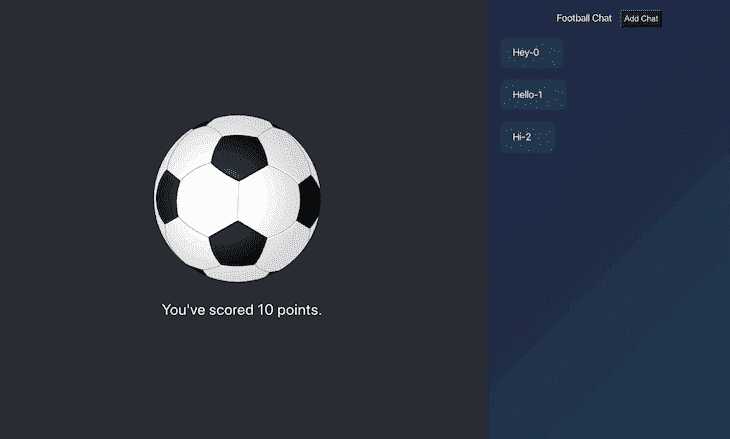
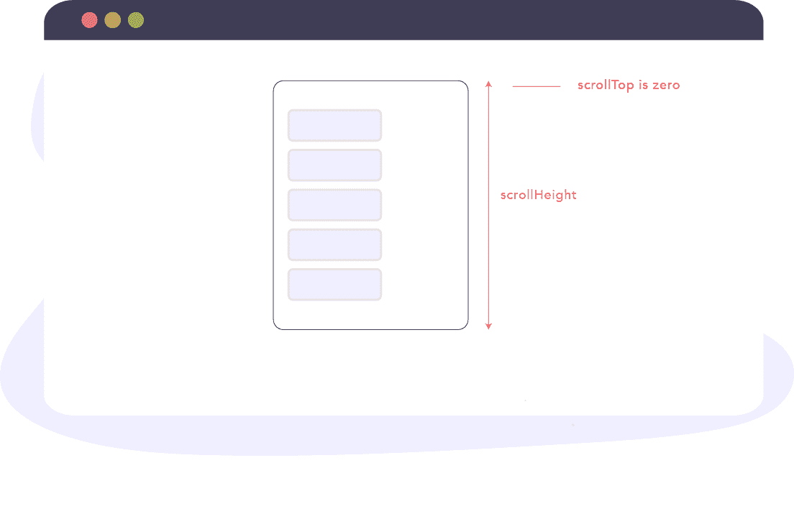
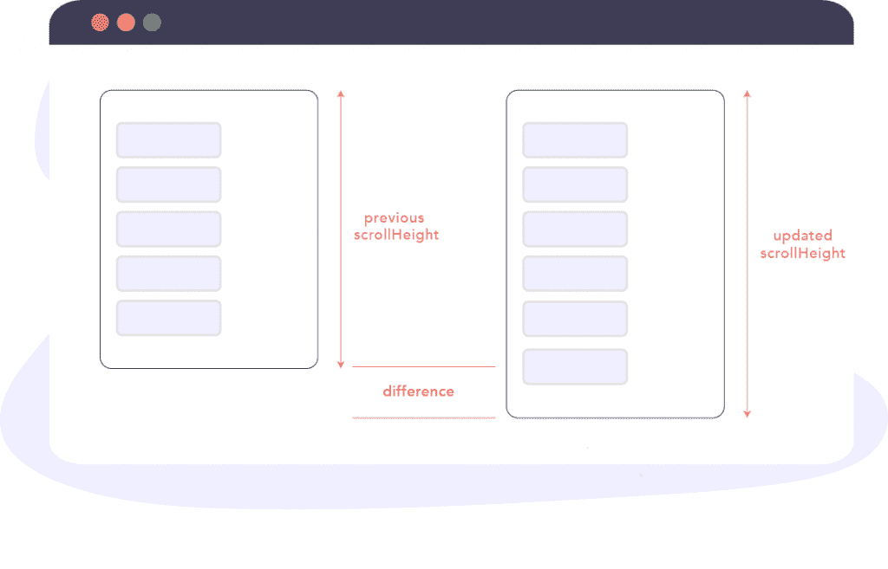
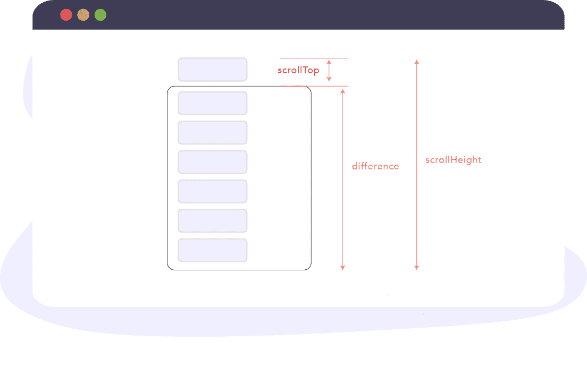
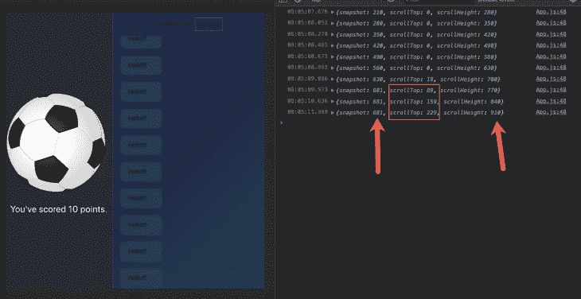
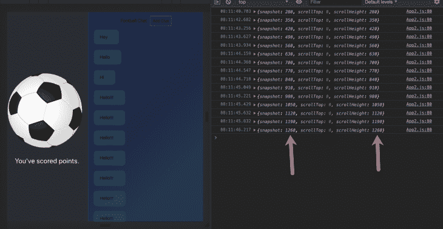
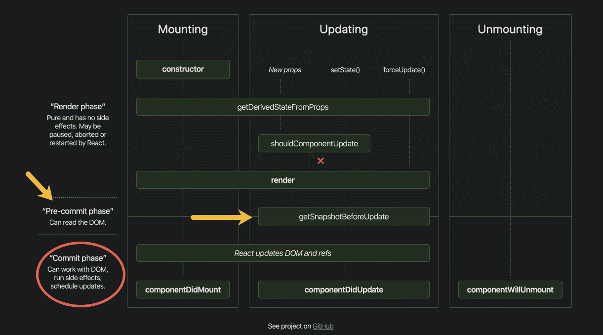

# getSnapshotBeforeUpdate 是如何用钩子实现的？- LogRocket 博客

> 原文：<https://blog.logrocket.com/how-is-getsnapshotbeforeupdate-implemented-with-hooks/>

TL；DR:简单的回答是`getSnapshotBeforeUpdate`不能用钩子实现。然而，更有趣的问题是为什么不呢？我们能从自己的实践中学到什么？

## 介绍

自从引入[钩子](https://medium.com/free-code-camp/learn-the-basics-of-react-hooks-in-10-minutes-b2898287fe5d)已经一年多了，毫不奇怪它们已经被 React 社区广泛采用。React 钩子的引入启发了其他库[，比如 Vue](https://twitter.com/youyuxi/status/1137567675356291072?lang=en) ，也创建了基于函数的组件 API。一年后，公平地说，前端社区在很大程度上接受了由 Hooks 推动的构建组件的功能方法。

出于好奇，你一定曾经问过钩子是否覆盖了所有被处理的用例 React 类。嗯，[答案是否定的](https://reactjs.org/docs/hooks-faq.html#do-hooks-cover-all-use-cases-for-classes)。对于`getSnapshotBeforeUpdate`和`componentDidCatch`类的生命周期方法，没有对应的钩子。公平地说，这些方法没有其他方法用得多——不管怎样，它们仍然是有用的生命周期方法，React 团队已经承诺“很快”发布这种方法。

也就是说，我们能不能至少试着用钩子实现`getSnapshotBeforeUpdate`生命周期方法？如果在我们现在可用的钩子的范围内是可能的，我们实现它的最好机会是什么？

在接下来的部分中，我们将尝试使用`useLayoutEffect`和`useEffect`来实现`getSnapshotBeforeUpdate`。

## 演示应用程序

为了尽可能实用，我们将使用下面的[演示应用程序](https://github.com/ohansemmanuel/points):



这个应用程序有一个非常简单的设置。该应用程序在左侧呈现一个足球和得分，但更重要的是，它还在右侧呈现一个聊天窗格。该聊天窗格的重要之处在于，随着更多聊天消息出现在窗格中(点击*添加聊天*按钮)，窗格会自动向下滚动到最新消息，即自动滚动。这是 WhatsApp、Skype、iMessage 等聊天应用的普遍要求。当您发送更多邮件时，面板会自动滚动，因此您不必手动滚动。

我在之前关于生命周期方法的文章中解释了这是如何工作的，但是我很乐意做一个简单的回顾。

## 回顾:getSnapshotBeforeUpdate 如何用于自动滚动

简而言之，您检查是否有新的聊天消息，并返回在`getSnapshotBeforeUpdate`生命周期方法中滚动的维度，如下所示:

```
getSnapshotBeforeUpdate (prevProps, prevState) {
    if (this.state.chatList > prevState.chatList) {
      const chatThreadRef = this.chatThreadRef.current
      return chatThreadRef.scrollHeight - chatThreadRef.scrollTop
    }
    return null
  }
```

下面是上面的代码片段的工作原理。

首先，考虑所有聊天消息的整体高度不超过聊天窗格高度的情况。



这里，表达式`chatThreadRef.scrollHeight - chatThreadRef.scrollTop`将等同于`chatThreadRef.scrollHeight - 0`。

当进行评估时，从`getSnapshotBeforeUpdate`返回的值将等于聊天窗格的`scrollHeight`——就在新消息被插入 DOM 之前。

如果您还记得`getSnapshotBeforeUpdate`是如何工作的，那么从`getSnapshotBeforeUpdate`方法返回的值将作为第三个参数传递给`componentDidUpdate`方法。

我们称这个值为`snapshot`:

```
componentDidUpdate(prevProps, prevState, snapshot) {

}
```

这里传入的快照值——此时，是 DOM 更新之前的前一个`scrollHeight`。

在`componentDidUpdate`生命周期方法中，下面是更新聊天窗格滚动位置的代码:

```
componentDidUpdate(prevProps, prevState, snapshot) {
    if (snapshot !== null) {
      const chatThreadRef = this.chatThreadRef.current;
      chatThreadRef.scrollTop = chatThreadRef.scrollHeight - snapshot;
    }
  }
```

实际上，我们是以编程方式从上到下垂直滚动窗格，距离等于`chatThreadRef.scrollHeight - snapshot`。

由于快照指的是在更新之前的`scrollHeight` *，所以上面的表达式返回新聊天消息的高度加上由于更新导致的任何其他相关高度。请参见下图:*



当整个聊天窗格的高度被消息占据时(并且已经向上滚动了一点)，由`getSnapshotBeforeUpdate`方法返回的快照值将等于聊天窗格的实际高度。



来自`componentDidUpdate`的计算将把`scrollTop`值设置为额外消息高度的总和——这正是我们想要的。

而且，就是这样！

## 我们如何用钩子复制这个？

这里的目标是尽可能多地尝试使用钩子重新创建一个类似的 API。虽然这不完全可能，但让我们试一试吧！

为了用钩子实现`getSnapshotBeforeUpdate`,我们将编写一个名为`useGetSnapshotBeforeUpdate`的定制钩子，并期望用如下的函数参数调用:

```
useGetSnapshotBeforeUpdate(() => {

})
```

用`prevProps`和`prevState`调用类生命周期方法`getSnapshotBeforeUpdate`。所以我们希望传递给`useGetSnapshotBeforeUpdate`的函数用相同的参数调用。

```
useGetSnapshotBeforeUpdate((prevProps, prevState) => {

})
```

除了编写一个定制的解决方案，根本没有办法访问`prevProps`和`prevState`。一种方法是用户将当前的`props`和`state`传递给自定义钩子`useGetSnapshotBeforeUpdate`。钩子将接受另外两个参数，`props`和`state`——从这些参数中，我们将跟踪钩子中的`prevProps`和`prevState`。

```
useGetSnapshotBeforeUpdate((prevProps, prevState) => {

}, props, state)
```

现在让我们通过了解前面的`props`和`state`来编写`useGetSnapshotBeforeUpdate`钩子的内部结构。

* * *

### 更多来自 LogRocket 的精彩文章:

* * *

```
// custom Hook for getting previous props and state
// https://reactjs.org/docs/hooks-faq.html#how-to-get-the-previous-props-or-state
const usePrevPropsAndState = (props, state) => {
  const prevPropsAndStateRef = useRef({ props: null, state: null })
  const prevProps = prevPropsAndStateRef.current.props
  const prevState = prevPropsAndStateRef.current.state

  useEffect(() => {
    prevPropsAndStateRef.current = { props, state }
  })

  return { prevProps, prevState }
}

// actual hook implementation 
const useGetSnapshotBeforeUpdate = (cb, props, state) => {
  // get prev props and state
  const { prevProps, prevState } = usePrevPropsAndState(props, state)

}
```

如上所述，`useGetSnapshotBeforeUpdate`钩子将用户回调、属性和状态作为参数，然后调用`usePrevPropsAndState`定制钩子来获取之前的属性和状态。

接下来，理解类生命周期方法`getSnapshotBeforeUpdate`永远不会在挂载时被调用是很重要的。它仅在组件更新时被调用。然而，钩子`useEffect`和`useLayoutEffect`是默认的，在挂载时总是至少被调用一次。我们需要防止这种情况发生。

方法如下:

```
const useGetSnapshotBeforeUpdate = (cb, props, state) => {
  // get prev props and state
  const { prevProps, prevState } = usePrevPropsAndState(props, state)

// getSnapshotBeforeUpdate - not run on mount + run on every update
  const componentJustMounted = useRef(true)
  useLayoutEffect(() => {
    if (!componentJustMounted.current) {
      // do something
    }
    componentJustMounted.current = false
  })
}
```

为了防止`useLayoutEffect`在 mount 上运行，我们保留一个 ref 值`componentJustMounted`，默认情况下该值为真，只有在`useLayoutEffect`被触发后才至少设置一次为假。

如果你注意的话，你会注意到我用的是`useLayoutEffect`钩而不是`useEffect`。这重要吗？

我这么做是有原因的。

类生命周期方法`getSnapshotBeforeUpdate`返回传递给`componentDidUpdate`方法的快照值。然而，这个快照通常是在 React 有机会将更改提交到 DOM 之前从 DOM 中检索的值。

因为`useLayoutEffect`总是在`useEffect`之前被触发，所以这是我们在浏览器有机会将更改绘制到屏幕上之前从 DOM 中获取的最接近的值。

此外，请注意，`useLayoutEffect`钩子没有使用任何数组依赖来调用——这确保了它在每次更新/重新呈现时触发。

让我们去拍快照吧。请注意，这是调用用户回调时返回的值。

```
const useGetSnapshotBeforeUpdate = (cb, props, state) => {
  // get prev props and state
  const { prevProps, prevState } = usePrevPropsAndState(props, state)
  // 👇 look here
  const snapshot = useRef(null)

// getSnapshotBeforeUpdate - not run on mount + run on every update
  const componentJustMounted = useRef(true)
  useLayoutEffect(() => {
    if (!componentJustMounted.current) {
      // 👇 look here
           snapshot.current = cb(prevProps, prevState)  
    }
    componentJustMounted.current = false
  })
}
```

到目前为止，一切顺利。

该解决方案的结论部分包括适应`componentdidUpdate`，因为它与`getSnapshotBeforeUpdate`紧密相关。

记住，`componentdidUpdate`生命周期方法是用`prevProps`、`prevState`调用的，快照是从`getSnapshotBeforeUpdate`返回的。

为了模仿这个 API，我们将让用户调用一个带有回调的自定义`useComponentDidUpdate`钩子:

```
useComponentDidUpdate((prevProps, prevState, snapshot) => {

})
```

我们如何做到这一点？一种解决方案是从先前构建的`useGetSnapshotBeforeUpdate`钩子返回`useComponentDidUpdate`钩子。是的，自定义钩子可以返回另一个钩子！通过这样做，我们利用了 JavaScript [闭包](https://developer.mozilla.org/en-US/docs/Web/JavaScript/Closures)。

下面是它的实现:

```
const useGetSnapshotBeforeUpdate = (cb, props, state) => {
  // get prev props and state
  const { prevProps, prevState } = usePrevPropsAndState(props, state)

  const snapshot = useRef(null)

// getSnapshotBeforeUpdate - not run on mount + run on every update
  const componentJustMounted = useRef(true)
  useLayoutEffect(() => {
    if (!componentJustMounted.current) {
           snapshot.current = cb(prevProps, prevState)  
    }
    componentJustMounted.current = false
  })

 // 👇 look here
 const useComponentDidUpdate = cb => {
    useEffect(() => {
      if (!componentJustMounted.current) {
        cb(prevProps, prevState, snapshot.current)
      }
    })
  }
  // 👇 look here
  return useComponentDidUpdate
}
```

从上面的代码块中可以注意到一些事情。首先，我们还防止在组件刚刚挂载时触发用户回调——因为在挂载时不会调用`componentDidUpdate`。

此外，我们在这里使用了`useEffect`钩子，而不是`useLayoutEffect`。

就是这样！我们已经尝试为`getSnapshotBeforeUpdate`复制 API，但是这行得通吗？

## 测试实施的解决方案

我们现在可以从演示中重构 App 组件，使用[钩子](https://github.com/ohansemmanuel/points/blob/f9206c709f475d19b414fc689e357edb70c34696/src/App2.js)。这包括使用我们刚刚构建的自定义挂钩，如下所示:

```
const App = props => {
  // other stuff ...

  const useComponentDidUpdate = useGetSnapshotBeforeUpdate(
    (_, prevState) => {
      if (state.chatList > prevState.chatList) {
        return (
          chatThreadRef.current.scrollHeight - chatThreadRef.current.scrollTop
        )
      }
      return null
    },
    props,
    state
  )

  useComponentDidUpdate((prevProps, prevState, snapshot) => {
    console.log({ snapshot }) // 👈 look here
    if (snapshot !== null) {
      chatThreadRef.current.scrollTop =
        chatThreadRef.current.scrollHeight - snapshot
    }
  })
}
```

这些钩子中的实现与类组件是一样的。但是，请注意，我已经记录了从我们的定制实现中收到的快照。

从使用类生命周期方法的实现中，您会得到以下结果:



快照确实是在 React 向 DOM 提交之前收到的。我们之所以知道这个，是因为快照指的是实际更新前和截图中的`scrollHeight`，和现在的`scrollHeight`明显不同。

然而，在我们的钩子实现中，之前的`scrollHeight`实际上是我们寻找的快照，与当前的`scrollHeight`没有什么不同。



出于某种原因，我们无法在 DOM 更新之前捕捉快照。为什么会这样呢？

## 结论

虽然看起来无关紧要，但这个练习对于质疑你对钩子和某些 React 基础知识的理解是非常有用的。简而言之，我们无法在 DOM 更新之前获得快照，因为所有钩子都是在 React“提交阶段”调用的——在 React 内部更新 DOM 和 refs 之后。



[http://projects.wojtekmaj.pl/react-lifecycle-methods-diagram/](http://projects.wojtekmaj.pl/react-lifecycle-methods-diagram/)

由于`getSnapshotBeforeUpdate`在提交阶段之前被调用，这使得它不可能在钩子、`useEffect`和`useLayoutEffect`的范围内被复制。

我希望你喜欢这次演讲，并且学到了一些新的东西。及时了解我的作品。

## 使用 LogRocket 消除传统反应错误报告的噪音

[LogRocket](https://lp.logrocket.com/blg/react-signup-issue-free)

是一款 React analytics 解决方案，可保护您免受数百个误报错误警报的影响，只针对少数真正重要的项目。LogRocket 告诉您 React 应用程序中实际影响用户的最具影响力的 bug 和 UX 问题。

[ ](https://lp.logrocket.com/blg/react-signup-general) [  ](https://lp.logrocket.com/blg/react-signup-general) [LogRocket](https://lp.logrocket.com/blg/react-signup-issue-free)

自动聚合客户端错误、反应错误边界、还原状态、缓慢的组件加载时间、JS 异常、前端性能指标和用户交互。然后，LogRocket 使用机器学习来通知您影响大多数用户的最具影响力的问题，并提供您修复它所需的上下文。

关注重要的 React bug—[今天就试试 LogRocket】。](https://lp.logrocket.com/blg/react-signup-issue-free)