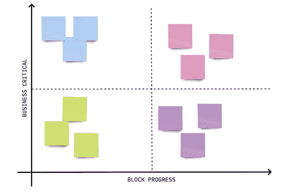
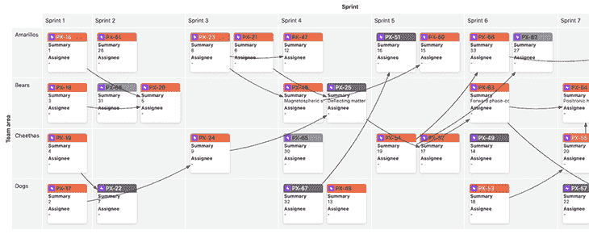

# 产品经理如何有效处理依赖性

> 原文：<https://blog.logrocket.com/product-management/how-product-managers-effectively-deal-with-dependencies/>

“我们无法达到冲刺目标，因为蓝队没有解决依赖性。我们被挡住了。”

当我从我们最有经验的软件工程师那里听到这句话时，我很恼火，因为这让我陷入了无能为力的境地。这就像我们接受了这个案子，但决定不采取行动。那不是我，所以我决定和蓝队谈谈。

蓝队的产品经理解释说，他们无法处理这种依赖性，因为黄队有另一种依赖性阻止了他们。我又一次出现了，在同样的情况下，在一个不同的团队。

猜猜我和黄队谈话时发生了什么？他们也有一个阻塞依赖，但在这个时候，与团队绿色，我是产品经理。奇怪的是，我没有意识到这种依赖性。

我们怎么会陷入这种无意义的境地？

在这篇文章中，我将带你浏览一下，希望你能理解并学会如何有效地处理依赖关系。

* * *

*向前跳过:*

* * *

## 什么是依赖？

也许你很清楚依赖，但我知道我偶然发现了一些误解。这就是为什么我将简要描述我的理解，并确保我们谈论的是同一件事。

假设你在一家市场工作，负责搜索体验。你意识到你可以通过获取相关的产品信息来优化搜索结果。然而，这样的信息是不可用的。另一个团队负责产品信息管理。这意味着要实现你的想法，你需要依靠另一个团队。

上面的例子是一个产品依赖，当一个团队因为另一个团队而不能完成某件事情时就会发生。你可以面对其他类型的依赖，比如业务和外部。

依赖关系可以被视为拦截器，但并不都是一样的。有时你可以找到替代方案，摆脱依赖。

## 如何管理依赖关系

如果你不能有效地处理依赖性，你会陷入可怕的境地。

回到我最初关于蓝队、黄队和绿队的例子。发生了什么事？

我们和吉拉一起工作，每当我们有依赖时，[我们会在响应团队的产品待办事项中创建一个产品待办事项](https://blog.logrocket.com/product-management/product-vs-sprint-vs-release-backlog/)。然后，我们会把我们的项目作为“封锁”由于依赖关系。当然，有人会发表评论，希望这就足够了。

总的来说，我们用电子方式管理依赖关系，很少进行团队对话来解决它们。

> 学习:与团队交流，而不是仅仅创建标签并期望他们迅速处理。

团队的设置在产品依赖中起着至关重要的作用。让我澄清一下:

*   组件团队(Component teams):当职责位于组件层时，团队将不可避免地处理一些依赖关系。这是一种次优的工作方式
*   **跨职能** : [拥有完成工作所需技能的团队](https://blog.logrocket.com/product-management/what-cross-functional-team-how-build/)减少依赖。例如，一些团队没有专门的设计师，因为有一个单独的团队负责这个。这种方法强迫依赖，并且会产生麻烦。团队越独立，功能就越强

理解您的场景并努力将依赖性降低到最低限度是至关重要的。这样做很快就会有回报，因为依赖会减慢进度。

### 使用对你有利的技术

无论情况如何，不要让你的团队成为环境的牺牲品。你可以随时行动，减少依赖。方法如下:

*   **事件**:受益于[事件驱动架构](https://microservices.io/patterns/data/event-driven-architecture.html)。确保发布事件，以便感兴趣的团队可以在需要时使用信息
*   被模仿的 API:在某些情况下，你需要和其他人的域进行交互，而你没有这样的 API。与其创建一个标签并阻碍进度，不如和团队坐下来，[就 API 格式达成一致，模仿它](https://blog.logrocket.com/mirage-js-tutorial-mocking-apis-in-react/)，并结束应用程序。它仍然没有做好生产准备，但是你不会被阻塞
*   **数据暴露**:对于团队如何向其他人提供他们的数据，有一个策略是非常重要的。每个团队都有一个领域职责，并最终相互交互。当你有依赖时，寻找解决方案是适得其反的。拥有一个策略并知道如何在团队之间交换数据是最好的。例如，负责提供 API 的领域团队可以是一个策略

### 尽早映射依赖关系

不管你喜不喜欢，依赖都会存在，你不能忽视它们。你可以说你是产品经理，不是项目经理。我会说你是对的，但是选择忽略依赖就等于选择失败。

> 您不需要创建一个包含所有依赖项、时间线等的庞大流程。这将是一种浪费。我们知道我们不擅长评估。

您可以映射依赖关系，定义解决依赖关系的责任，指定人员，而不是团队，并定义类型。并非所有的依赖都是相同的。有些人会阻止你，而对有些人来说，你有其他选择。先对付阻挡者，然后再对付其他人。

我可以推荐你使用吉拉项目计划或其他工具来映射依赖关系。他们会直观地展示一幅充满联系的巨大地图，但我不会。原因很简单——大量的依赖性会吓到人们。我的建议是保持简单，专注于协作。

* * *

订阅我们的产品管理简讯
将此类文章发送到您的收件箱

* * *

我的方法如下:

1.  名称依赖性
2.  定义业务重要性以及它如何阻碍进展
3.  使用一个 2×2 矩阵来可视化你的依赖关系
4.  优先处理那些阻碍进展和对业务至关重要的问题
5.  丢掉那些与业务无关的，你会有一个替代方案
6.  定义责任和行动
7.  冲洗并重复

### 依赖关系图

如果最适合您，您可以忽略我的提示，使用依赖关系图。吉拉提供开箱即用的依赖地图。我不喜欢它们，因为当人们看到如下图时，他们会优先考虑流程和工具而不是协作:

Example — Jira Dependency Map.

## 处理依赖性的关键要点

依赖关系是任何产品的一部分。你必须理解它们并定义行动。忽视他们对每个人来说都是错误的选择。

处理依赖性的关键要点是:

*   **定义一个处理技术依赖的策略**——确保你的团队知道如何减少依赖的影响，并不断改进这个策略
*   永远不要成为受害者——不要说我们因为依赖而无法进步，而是要问我们现在能做什么。寻找替代品
*   不是所有的依赖关系都是一样的 —有些依赖关系有替代方案，你可以从中受益。其他的，你必须处理。不要因为依赖而恐慌。用心处理它们
*   **协作胜过工具** —克服依赖是一项团队工作。工具可以帮助你将它们可视化，了解你当前的状态，但是记住目标是解决依赖性。协作是你最好的工具
*   **设计减少依赖性** —让团队尽可能独立。此外，努力制定一套策略，使团队知道在快速面对依赖时如何行动

补充一点。最终，您将偶然发现一个业务关键的外部依赖，如果不解决，它将阻碍进展。这是一种危险的依赖，因为它不依赖于你。在对产品或项目投入大量时间之前，确保此类依赖关系得到解决。否则，你就是在赌运气。

> “承认自己不知道的事情没关系。寻求帮助是可以的。倾听你所领导的人的意见不仅仅是好的，事实上，这是必要的。”—通用汽车公司首席执行官玛丽·巴拉

*精选图片来源:[icon scout](https://iconscout.com/icon/warning-sign-4641188)*

## [LogRocket](https://lp.logrocket.com/blg/pm-signup) 产生产品见解，从而导致有意义的行动

[LogRocket](https://lp.logrocket.com/blg/pm-signup) 确定用户体验中的摩擦点，以便您能够做出明智的产品和设计变更决策，从而实现您的目标。

使用 LogRocket，您可以[了解影响您产品的问题的范围](https://logrocket.com/for/analytics-for-web-applications)，并优先考虑需要做出的更改。LogRocket 简化了工作流程，允许工程和设计团队使用与您相同的[数据进行工作](https://logrocket.com/for/web-analytics-solutions)，消除了对需要做什么的困惑。

让你的团队步调一致——今天就试试 [LogRocket](https://lp.logrocket.com/blg/pm-signup) 。

[David Pereira Follow](https://blog.logrocket.com/author/davidpereira/) Product Leader with 15+ years of experience. Partner at Value Rebels and interim CPO at omoqo. Almost every product team is trapped somehow; untrapping them is what drives me.