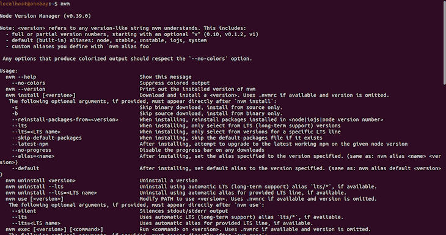
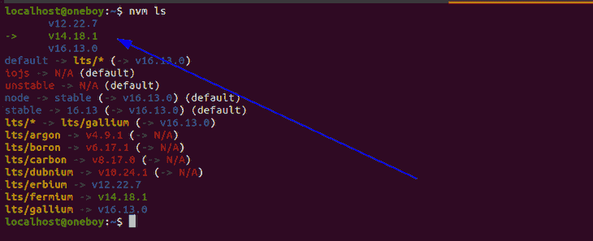
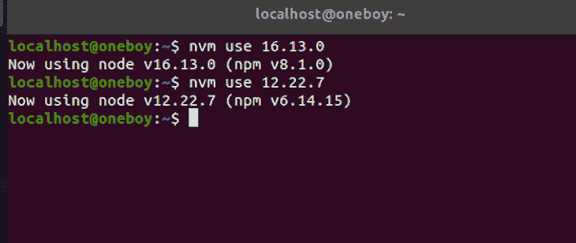
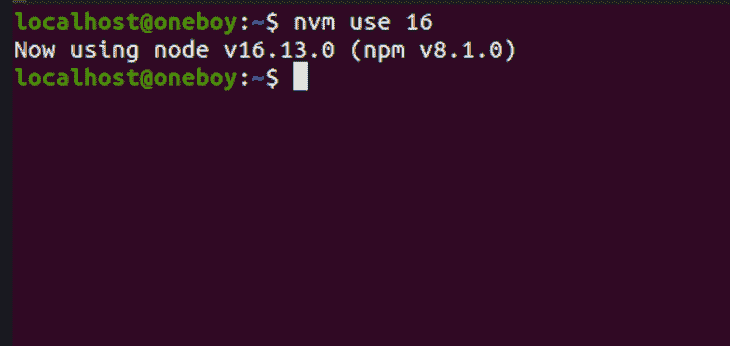

# 如何用 NVM - LogRocket 博客切换 Node.js 版本

> 原文：<https://blog.logrocket.com/how-switch-node-js-versions-nvm/>

随着技术的发展，尤其是在开发阶段，版本问题可能会出现。作为开发人员，同时处理多个项目是正常的，但是在不同版本的软件之间切换可能会变得非常麻烦和烦人。

在本文中，我们将重点介绍 Node.js 和节点版本管理器(NVM)，这是一个允许用户直接从 CLI 快速安装节点版本并毫不费力地在版本之间切换的工具。

## 什么是节点版本管理器(NVM)？

[节点版本管理器是一个帮助我们管理节点版本的工具](https://github.com/nvm-sh/nvm)，是一种安装节点的便捷方式。可以把它想象成帮助管理节点包的 npm 或 Yarn，但是 NVM 管理的不是包，而是节点版本。

这也意味着您可以同时在您的机器上安装多个节点版本，并在需要时在它们之间切换。

## Node.js 开发者为什么需要 NVM

使用 Node 的开发人员经常会遇到这种情况:例如，在构建一个项目时使用 Node 的第 12 版，并完成和托管该项目。

然而，尽管一切都运行得非常好，但是几个月后某个特性可能需要更新，而用于开发的机器运行的是 Node 的版本 14。

运行`npm install`或`yarn install`来下载本例中的节点模块会显示关于不推荐使用的包的错误，对此您不会感到惊讶。

也有这样的情况，当一个项目特别需要一个旧版本时，您可以使用一个更高版本的 Node。

例如，您可能使用一个 [SPFx 应用程序或一个使用节点 LTS v14 的 SPFx 解决方案](https://docs.microsoft.com/en-us/sharepoint/dev/spfx/sharepoint-framework-overview)，但是您同时还在使用另一个节点应用程序，如 [cli-microsoft356](https://github.com/pnp/cli-microsoft365/) ，它在一个更高的节点版本上工作。

在这种情况下，您希望在不同的节点版本之间来回切换，最简单的方法是使用节点版本管理器。

每个节点项目也倾向于有它支持的版本的需求。就我个人而言，我需要参与一个项目，该项目支持 10.16 到 12 之间的节点版本，而当时我的机器运行的是版本 14。

如果没有 NVM，我将无法在不删除现有版本的情况下在同一台机器上为项目做出贡献，这将导致很多问题，或者导致双重引导，这会降低性能，特别是在旧机器上。

因此，为了避免头痛，让我们看看 NVM 是如何工作的。

## 安装 NVM

在安装 NVM 之前，您不需要在您的计算机上安装节点版本，并且，[如果您已经安装了节点](https://blog.logrocket.com/comparing-top-node-js-frameworks-frontend-developers/)，这没有关系。安装 NVM 并使用它来安装节点版本将与现有版本分开工作。

让我们在终端上运行`nvm`和`node`。显示没有找到`nvm`和`node`，并建议如何安装节点:


但是，由于我们不是直接安装 Node，所以我们将重点关注 NVM 的使用。

要安装 NVM，请在终端上运行以下命令:

```
curl -o- https://raw.githubusercontent.com/nvm-sh/nvm/v0.39.0/install.sh | bash

```

cURL 是大多数基于 Linux 的操作系统自带的。如果出于某种原因，您的机器上没有安装 cURL，[您可以从本指南](https://curl.se/download.html)中下载它。

运行上面的命令下载并运行一个脚本。

该脚本将整个 NVM 存储库下载到`~/.nvm`，并将下面代码片段中的源代码行添加到正确的 shell 启动脚本中，即`~/.bash_profile`、`~/.zshrc`、`~/.profile`或`~/.bashrc`，具体取决于您使用的 shell 程序。

在我的例子中，我使用的是`~/.bashrc`:

```
//source line added
export NVM_DIR="$([ -z "${XDG_CONFIG_HOME-}" ] && printf %s "${HOME}/.nvm" || printf %s "${XDG_CONFIG_HOME}/nvm")"
[ -s "$NVM_DIR/nvm.sh" ] && \. "$NVM_DIR/nvm.sh" # This loads nvm

```

之后，退出终端并重新打开它。

运行`nvm`，您应该得到以下内容:



您已经成功安装了 NVM。现在，让我们安装和管理多个节点版本。

## 安装和管理 Node.js 版本

要安装节点版本，只需运行以下命令:

```
nvm install --<the node version>

```

让我们从安装最新的 LTS 版本开始，在撰写本文时是版本 16.13.0。这可以通过运行`nvm install --lts`来完成，这将产生以下屏幕:


我们现在也有 npm 版本 8.1.0。

安装完成后，它会自动将默认节点版本设置为我们刚刚下载的 LTS。

对于本教程，我们希望在我们的机器上运行三个节点版本。要查找可用节点版本列表，请执行以下操作:

```
nvm ls-remote

```

运行`nvm install node`安装当时可用的最新节点版本。如果我们想安装版本`12.22.7`，我们只需运行`nvm install 12.22.7`:


这将从源代码下载 12.22.7 版并安装它；在使用 12.22.7 时，npm 版本是 6.14.15。

每当您下载新版本时，它都会替换正在使用的上一个版本。让我们继续安装带有`nvm install 14.18.1`的 14.18.1 版本:


### 显示 Node.js 版本列表

我们现在可以查看到目前为止下载的所有版本；目前，我们使用 NVM 安装了三个节点版本。

要查看完整列表，请运行以下命令:

```
nvm ls

```

然后列表出现:



前三行显示了节点版本列表，箭头指向当前使用的 14.18.1 版本；当一个版本被使用时，它显示为绿色。

如果你碰巧安装了三个以上的版本，当然也会显示出来。

### 在 Node.js 版本之间切换

NVM 的最佳特性是能够在不同的节点版本之间轻松切换。
说我们必须使用 16.13.0 版本，然后切换到 12 . 22 . 7；我们可以简单地运行`nvm use 12.22.7`或`nvm use 16.13.0`来轻松地切换到我们需要的任何一个版本。



注意，由于我们只有一个以 12、14 或 16 开头的版本，我们可以用一个简单的`nvm use 16`、`nvm use 14`或`nvm use 12`命令来切换版本。



### 删除 Node.js 版本

通常，对于您正在处理的项目，您可能不需要特定版本的 Node。使用 NVM，您可以轻松删除不需要的版本。

要删除某个版本，只需运行以下命令:

```
nvm uninstall <the version number>

```

然后，终端将显示该版本已卸载:


您必须注意，安装的每个版本都是独立的，这意味着先前安装的版本中的全局软件包在新的安装中将不可用。

例如，如果您在 Node 的版本 14 上全局安装了[Gatsby CLI](https://blog.logrocket.com/is-gatsby-really-that-great-e7b19c4c1c05/)，当您切换到版本 16 或任何其他使用 NVM 的版本时，Gatsby CLI 将在您刚刚切换到的版本中不可用。

我们可以通过在第一次安装 Node 时将所有的全局包带到 Node 的新版本来解决这个问题。

同样，要知道 NVM 是基于 Linux 的，这意味着上面提到的安装部分和所有内容只适用于基于 Linux 的 macOS 或基于 Linux 的发行版。

如果你是 Windows 用户，[看看 Corey Butler](https://github.com/coreybutler/nvm-windows) 的这个项目，它为 Windows 提供 NVM。一切都很相似，我[t 这里已经有一个安装程序](https://github.com/coreybutler/nvm-windows/releases)。

## 结论

我们已经到了本教程的结尾。我们讨论了什么是 NVM 及其使用案例，包括在一台机器上管理多个节点版本。

NVM 是一种安装和管理不同版本的节点的便捷方式，而不是直接安装，这将您限制为只有一个版本，提供了灵活性。

## 200 只显示器出现故障，生产中网络请求缓慢

部署基于节点的 web 应用程序或网站是容易的部分。确保您的节点实例继续为您的应用程序提供资源是事情变得更加困难的地方。如果您对确保对后端或第三方服务的请求成功感兴趣，

[try LogRocket](https://lp.logrocket.com/blg/node-signup)

.

[](https://lp.logrocket.com/blg/node-signup)[https://logrocket.com/signup/](https://lp.logrocket.com/blg/node-signup)

LogRocket 就像是网络和移动应用程序的 DVR，记录下用户与你的应用程序交互时发生的一切。您可以汇总并报告有问题的网络请求，以快速了解根本原因，而不是猜测问题发生的原因。

LogRocket 检测您的应用程序以记录基线性能计时，如页面加载时间、到达第一个字节的时间、慢速网络请求，还记录 Redux、NgRx 和 Vuex 操作/状态。

[Start monitoring for free](https://lp.logrocket.com/blg/node-signup)

.