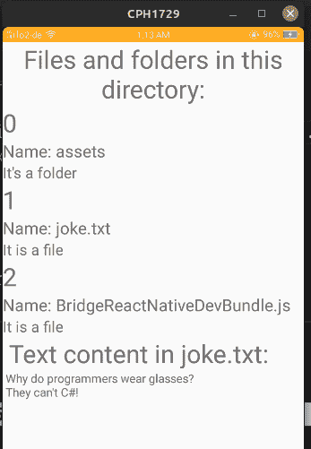
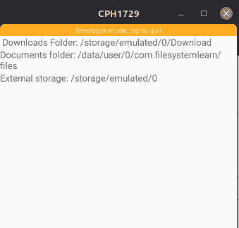
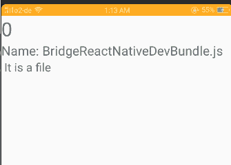
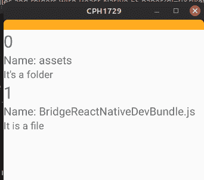
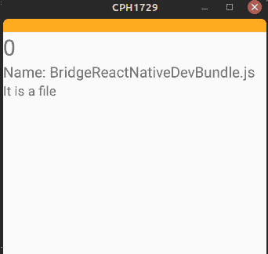

# 如何使用 React Native - LogRocket 博客访问文件系统

> 原文：<https://blog.logrocket.com/how-to-access-file-systems-react-native/>

假设您正在开发一个图像编辑器应用程序。在这种情况下，您可以让用户执行以下步骤:

*   在应用程序中，访问用户的相机来拍照
*   如果用户拍摄了照片，将此文件导入到另一个模块，让他们编辑图像
*   当用户完成修改图片，应用程序应该上传到社交媒体

当然，这可能行得通。但是有一个小缺陷:如果客户想要编辑现有的图像怎么办？为了使这成为可能，这意味着程序应该能够访问用户的文件系统。

这就是`[react-native-fs](https://github.com/itinance/react-native-fs)`的用武之地。这是一个易于使用的库，允许开发人员在主机设备上读写文件和文件夹。在本指南中，您将学习`react-native-fs`库的基础知识，并学习一些高级用例。

这将是本文的结果:

[](https://blog.logrocket.com/?attachment_id=102256)

以下是我们将采取的步骤:

## 入门指南

作为第一步，我们必须使用`react-native-cli`初始化一个 React 本地项目，如下所示:

```
react-native init fileSystemLearn

```

完成后，安装`react-native-fs`模块:

```
npm install react-native-fs
react-native link react-native-fs #link this library with our app's native code

```

## 基本用法

### 获取文件路径

RNFS 包括一组常量来通知用户在他们的设备上配置的文件路径列表。其中一些包括:

*   `MainBundleDirectory`:app 的数据文件夹
*   `DownloadDirectoryPath`:指向用户的`Downloads`目录
*   `ExternalStorageDirectory`:包含设备外部存储的路径

下面是这些常量的一个简单例子:

```
import {useState, useEffect} from 'react';
import RNFS from 'react-native-fs';
function App() {
  const [downloadsFolder, setDownloadsFolder] = useState('');
  const [documentsFolder, setDocumentsFolder] = useState('');
  const [externalDirectory, setExternalDirectory] = useState('');
  useEffect(() => {
    //get user's file paths from react-native-fs
    setDownloadsFolder(RNFS.DownloadDirectoryPath);
    setDocumentsFolder(RNFS.DocumentDirectoryPath); //alternative to MainBundleDirectory.
    setExternalDirectory(RNFS.ExternalStorageDirectoryPath);
  }, []);
  return (
    <SafeAreaView>
      <Text> Downloads Folder: {downloadsFolder}</Text>
      <Text>Documents folder: {documentsFolder}</Text>
      <Text>External storage: {externalDirectory}</Text>
    </SafeAreaView>
  );
}

```

在这个代码示例中，我们从`react-native-fs`库中获取了用户的文件路径。稍后，我们将这些值存储到`downloadsFolder`、`documentsFolder`和`externalFolder`钩子中。最后，程序将钩子呈现在屏幕上。

[](https://blog.logrocket.com/?attachment_id=102259)

### 读取目录

为了获取文件和文件夹内容，RNFS 捆绑了一个`[readDir](https://github.com/itinance/react-native-fs)`方法。顾名思义，这个函数允许开发者得到某个文件夹的统计数据:

```
function App() {
  const [files, setFiles] = useState([]);

  const getFileContent = async (path) => {
    const reader = await RNFS.readDir(path);
    setFiles(reader);
  };
  useEffect(() => {
    getFileContent(RNFS.DocumentDirectoryPath); //run the function on the first render.
  }, []);
  //this component will render our list item to the UI
  const Item = ({ name, isFile }) => {
    return (
      <View>
        <Text style={styles.name}>Name: {name}</Text>
        <Text> {isFile ? "It is a file" : "It's a folder"}</Text>
      </View>
    );
  };
  const renderItem = ({ item, index }) => {
    return (
      <View>
        <Text style={styles.title}>{index}</Text>
        {/* The isFile method indicates whether the scanned content is a file or a folder*/}
        <Item name={item.name} isFile={item.isFile()} />
      </View>
    );
  };
  return (
    <SafeAreaView>
      <FlatList
        data={files}
        renderItem={renderItem}
        keyExtractor={(item) => item.name}
      />
    </SafeAreaView>
  );
}

```

下面是这段代码的一段一段的分解:

*   一开始，我们声明了一个名为`getFileContent`的异步函数
*   `getFileContent`方法执行参数设置为`path`的`readDir`方法。这意味着项目将读取`path`目录并以数组的形式返回所有可用的内容
*   稍后，我们将响应的值存储到`files`钩子中
*   此外，程序执行了`getFileContent`函数，并将`RNFS.DocumentDirectoryPath`常量作为参数传入。这意味着 React Native 现在将尝试读取我们应用程序的数据文件夹的内容
*   最后，我们使用`[FlatList](https://blog.logrocket.com/deep-dive-react-native-flatlist/)`模块将`files`的值呈现在列表视图 [](https://blog.logrocket.com/?attachment_id=102261)中

## 高级用法

### 创建文件夹

目录对于组织的目的是至关重要的。例如，所有图像都应该放在`assets`文件夹中，用户数据应该放在`appdata`目录中。

为了具体化一个文件夹，RNFS 包含了一个名为`[mkdir](https://github.com/itinance/react-native-fs#mkdirfilepath-string-options-mkdiroptions-promisevoid)`的函数。下面是这种方法的一个简单例子:

```
const folderPath = RNFS.DocumentDirectoryPath + "/assets";

const makeDirectory = async (folderPath) => {
  await RNFS.mkdir(folderPath); //create a new folder on folderPath
};

useEffect(() => {
  makeDirectory(folderPath); //execute this function on first mount
  getFileContent(RNFS.DocumentDirectoryPath); //this function was defined in the previous example
}, []);
return (
  <SafeAreaView>
    {/*FlatList code to render file paths.*/}
    {/*renderItem function was defined earlier in this article*/}
    <FlatList
      data={files}
      renderItem={renderItem}
      keyExtractor={(item) => item.name}
    />
  </SafeAreaView>
);

```

在这段代码中，我们的`makeDirectory`方法接受一个名为`folderPath`的参数。当被调用时，应用程序运行`mkdir`功能，然后在指定的路径创建一个新的文件夹。

[](https://blog.logrocket.com/?attachment_id=102263)

### 创建文件

为了将内容写入文件，RNFS 包含了一个`[writeFile](https://github.com/itinance/react-native-fs#writefilefilepath-string-contents-string-encoding-string-promisevoid)`方法。这对于应用程序必须在用户设备上存储敏感用户数据的使用情形至关重要:

```
const filePath = RNFS.DocumentDirectoryPath + "/joke.txt"; //absolute path of our file
const fileContent = "Why do programmers wear glasses? \n They can't C#!";

const makeFile = async (filePath, content) => {
  try {
    //create a file at filePath. Write the content data to it
    await RNFS.writeFile(filePath, content, "utf8");
    console.log("written to file");
  } catch (error) { //if the function throws an error, log it out.
    console.log(error);
  }
};
//extra code removed for brevity..
useEffect(() => {
  makeFile(filePath, fileContent);
  getFileContent(RNFS.DocumentDirectoryPath);
}, []);
return {
  /* Code to render FlatList with files Hook as our dataset...*/
};

```

在这个代码片段中，我们首先编写了一个名为`makeFile`的自定义函数，它接受两个参数:`filePath`和`content`。在这个函数中，我们调用了`RNFS.writeFile`方法，该方法告诉 React 在`filePath`创建一个文件，并将`content`的值写入这个所需的实体。

[](https://blog.logrocket.com/?attachment_id=102266)

### 读取文件

RNFS 的`[readFile](https://github.com/itinance/react-native-fs#readfilefilepath-string-encoding-string-promisestring)`功能允许开发者从选定的文件中获取数据。这对于笔记应用程序来说很重要，在笔记应用程序中，应用程序必须从磁盘中读取纯文本文件，并将它们显示给用户:

```
const filePath = RNFS.DocumentDirectoryPath + "/joke.txt";
const [fileData, setFileData] = useState();

const readFile = async (path) => {
  const response = await RNFS.readFile(path);
  setFileData(response); //set the value of response to the fileData Hook.
};
useEffect(() => {
  readFile(filePath);
}, []);

return (
  <SafeAreaView>
    {/* Display the value*/}
    <Text style={styles.name}>{fileData}</Text>
  </SafeAreaView>
);

```

当被调用时，`RNFS.readFile`函数将试图获取位于我们选择的目录中的文件内容。如果尝试失败，程序将崩溃并抛出一个错误。

[](https://blog.logrocket.com/?attachment_id=102269)

### 文件删除

为了删除一个文件，你可以像这样使用`[unlink](https://github.com/itinance/react-native-fs#unlinkfilepath-string-promisevoid)`函数:

```
const folderPath = RNFS.DocumentDirectoryPath + "/assets"; //path of folder to delete
const filePath = RNFS.DocumentDirectoryPath + "/joke.txt"; //file to delete
const [files, setFiles] = useState([]);

const deleteFile = async (path) => {
  try {
    await RNFS.unlink(path); //delete the item present at 'path'
    console.log("file deleted");
  } catch (error) {
    console.log(error);
  }
};
useEffect(() => {
  //delete both the joke.txt file and the assets folder 
  deleteFile(filePath); 
  deleteFile(folderPath);
  //when the files and folders are deleted, get available files and folders:
  getFileContent(RNFS.DocumentDirectoryPath);
}, []);
return <SafeAreaView>{/*Code to render FlatList..*/}</SafeAreaView>;

```

在这段代码中，我们使用了`unlink`方法从文档目录中删除一个文件和一个文件夹。

[](https://blog.logrocket.com/?attachment_id=102271)

## 结论

这里是这篇文章的源代码。

在本文中，您了解了如何创建文件和目录，并通过`react-native-fs`库写入它们。除了文件修改，我们还可以在其他情况下使用这个库，例如:

*   在线存储应用:像 Google Drive 和 [Tresorit](https://tresorit.com/) 这样的云存储服务上传客户移动设备上的文件
*   电子邮件:当向接收者发送附件时，电子邮件客户端允许用户使用文件管理器选择和发送文件

如果您遇到任何困难，我鼓励您尝试并解构这些代码，以便您可以完全理解其内部工作原理。

非常感谢你坚持到最后！编码快乐！

## [LogRocket](https://lp.logrocket.com/blg/react-native-signup) :即时重现 React 原生应用中的问题。

[](https://lp.logrocket.com/blg/react-native-signup)

[LogRocket](https://lp.logrocket.com/blg/react-native-signup) 是一款 React 原生监控解决方案，可帮助您即时重现问题、确定 bug 的优先级并了解 React 原生应用的性能。

LogRocket 还可以向你展示用户是如何与你的应用程序互动的，从而帮助你提高转化率和产品使用率。LogRocket 的产品分析功能揭示了用户不完成特定流程或不采用新功能的原因。

开始主动监控您的 React 原生应用— [免费试用 LogRocket】。](https://lp.logrocket.com/blg/react-native-signup)