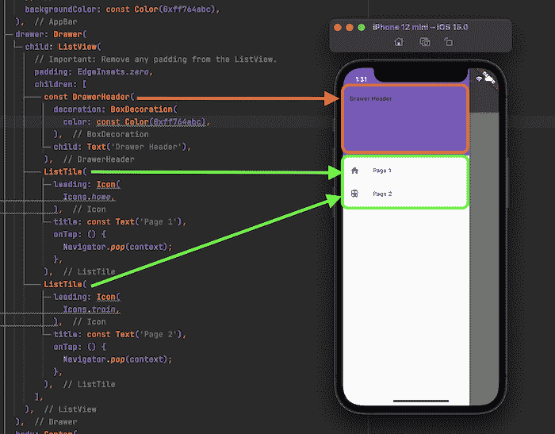
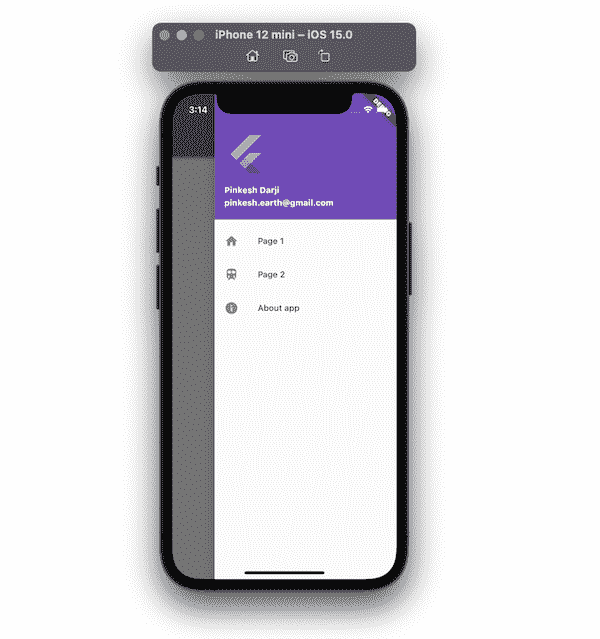
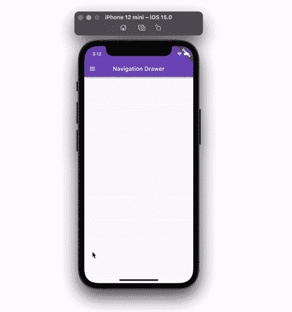
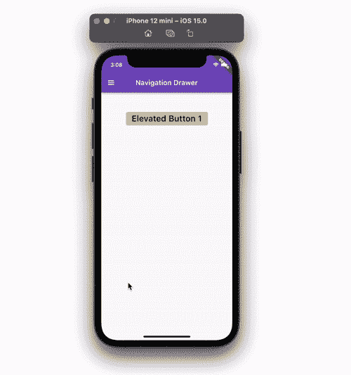
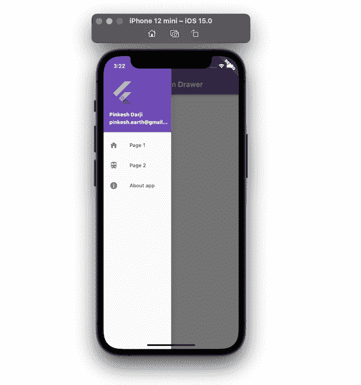

# 如何在 Flutter 中添加导航抽屉

> 原文：<https://blog.logrocket.com/how-to-add-navigation-drawer-flutter/>

Flutter 中的导航抽屉允许用户导航到应用程序的不同页面。使用[抽屉](https://youtu.be/WRj86iHihgY)小部件添加导航抽屉。它可以通过滑动手势或点击应用程序栏中的菜单图标来打开。

通常，导航抽屉从屏幕左侧打开，但是您也可以将其配置为从右侧打开(对于 LTR 文本设置)。当它打开时，抽屉几乎覆盖了 60-70%的屏幕，要关闭它，您只需在抽屉外滑动或点击即可。

[](https://blog.logrocket.com/?attachment_id=102007)

在本教程中，我们将学习如何在 Flutter 中添加导航抽屉。

以下是我们将要介绍的内容:

如果你是视觉学习者，看看这个快速视频教程:

 [https://www.youtube.com/embed/WRj86iHihgY?version=3&rel=1&showsearch=0&showinfo=1&iv_load_policy=1&fs=1&hl=en-US&autohide=2&wmode=transparent](https://www.youtube.com/embed/WRj86iHihgY?version=3&rel=1&showsearch=0&showinfo=1&iv_load_policy=1&fs=1&hl=en-US&autohide=2&wmode=transparent)

视频

## 何时使用导航抽屉

导航抽屉可以用作 [TabBar](https://blog.logrocket.com/flutter-tabbar-a-complete-tutorial-with-examples/) 小部件的替代选项。当您至少有五个页面要导航时，建议使用导航抽屉。如果你的应用有几个页面，在标签栏中提供导航会使用户体验不太直观。

## 如何在 Flutter 中添加基本导航抽屉

要在 Flutter 中添加一个基本的导航抽屉，必须先在你的项目中使用`MaterialApp`。然后，可以将抽屉小部件添加到支架小部件中。

以下是逐步说明:

1.  确保您使用的是`MaterialApp`
2.  在`Scaffold`中，添加`Drawer`属性并分配`Drawer`小部件
3.  在`Drawer`小部件中，添加`ListView`作为子小部件
4.  在`ListView`中，添加`DrawerHeader`小部件。这将创建一个材料设计抽屉标题
5.  在`DrawerHeader`中，添加一个带有一些文本的`Text`小部件
6.  在`DrawerHeader`下面，添加一个`ListTile`小部件，带有代表单个页面的`icon`和`title`
7.  同样为其他页面添加其他`ListTile`

代码示例:

```
@override
Widget build(BuildContext context) {
  return Scaffold(
    appBar: AppBar(
      centerTitle: true,
      title: const Text(
        'Navigation Drawer',
      ),
      backgroundColor: const Color(0xff764abc),
    ),
    drawer: Drawer(
      child: ListView(
        // Important: Remove any padding from the ListView.
        padding: EdgeInsets.zero,
        children: [
          const DrawerHeader(
            decoration: BoxDecoration(
              color: Colors.blue,
            ),
            child: Text('Drawer Header'),
          ),
          ListTile(
            leading: Icon(
              Icons.home,
            ),
            title: const Text('Page 1'),
            onTap: () {
              Navigator.pop(context);
            },
          ),
          ListTile(
            leading: Icon(
              Icons.train,
            ),
            title: const Text('Page 2'),
            onTap: () {
              Navigator.pop(context);
            },
          ),
        ],
      ),
    ),
    body: Center(
      child: Column(
        children: [
          SizedBox(
            height: 50,
          ),
        ],
      ),
    ),
  );
}

```

输出:

[](https://blog.logrocket.com/?attachment_id=102010)

下面是代码如何转化为设计:

[](https://blog.logrocket.com/?attachment_id=102029)

上面的基本示例显示了带有简单文本的抽屉标题，但是在现实场景中，您可能希望在抽屉标题中显示当前用户信息。您可以借助一个名为 UserAccountsDrawerHeader 的现成小部件来实现这一点。

UserAccountsDrawerHeader 用于显示所有与用户相关的信息，如个人资料图片、用户名和电子邮件。当用户点击用户信息时，您也可以打开用户详细信息页面。

要在导航抽屉中显示用户详细信息:

1.  在上面的示例代码中，只需用`UserAccountsDrawerHeader`替换`DrawerHeader`小部件
2.  添加`accountName`参数并设置用户名
3.  添加`accountEmail`参数，设置用户邮箱
4.  添加`currentAccountPicture`参数，设置登录用户的个人资料图片

代码示例:

```
return Scaffold(
  appBar: AppBar(
    centerTitle: true,
    title: const Text(
      'Navigation Drawer',
    ),
    backgroundColor: const Color(0xff764abc),
  ),
  drawer: Drawer(
    child: ListView(
      // Important: Remove any padding from the ListView.
      padding: EdgeInsets.zero,
      children: [
        const UserAccountsDrawerHeader( // <-- SEE HERE
          decoration: BoxDecoration(color: const Color(0xff764abc)),
          accountName: Text(
            "Pinkesh Darji",
            style: TextStyle(
              fontWeight: FontWeight.bold,
            ),
          ),
          accountEmail: Text(
            "[email protected]",
            style: TextStyle(
              fontWeight: FontWeight.bold,
            ),
          ),
          currentAccountPicture: FlutterLogo(),
        ),
        ListTile(
          leading: Icon(
            Icons.home,
          ),
          title: const Text('Page 1'),
          onTap: () {
            Navigator.pop(context);
          },
        ),
        ListTile(
          leading: Icon(
            Icons.train,
          ),
          title: const Text('Page 2'),
          onTap: () {
            Navigator.pop(context);
          },
        ),
      ],
    ),
  ),
  body: Center(
    child: Column(
      children: [
        SizedBox(
          height: 50,
        ),
      ],
    ),
  ),
);

```

输出:

[](https://blog.logrocket.com/?attachment_id=102035)

## 显示关于列表框

有时，您可能需要显示关于应用程序的附加信息，如版本、隐私政策、官方网站等。Flutter 有一个名为 [AboutListTile](https://api.flutter.dev/flutter/material/AboutListTile-class.html) 的专用小部件，你可以在导航抽屉内显示它。

要显示抽屉内的`AboutListTile`:

1.  将`AboutListTile`小部件添加到`ListView`的末尾和内部(这里有页面的`ListTile`项)
2.  在`AboutListTile`里面添加`icon`和`child`参数，在`child`里面添加`Text`小工具
3.  在`AboutListTile`中，添加`applicationName`参数并提供应用名称
4.  在`AboutListTile`中，添加`applicationVersion`参数，并提供当前 app 版本

代码示例:

```
Drawer(
  child: ListView(
    // Important: Remove any padding from the ListView.
    padding: EdgeInsets.zero,
    children: [
      const UserAccountsDrawerHeader(
        decoration: BoxDecoration(color: const Color(0xff764abc)),
        accountName: Text(
          "Pinkesh Darji",
          style: TextStyle(
            fontWeight: FontWeight.bold,
          ),
        ),
        accountEmail: Text(
          "[email protected]",
          style: TextStyle(
            fontWeight: FontWeight.bold,
          ),
        ),
        currentAccountPicture: FlutterLogo(),
      ),
      ListTile(
        leading: Icon(
          Icons.home,
        ),
        title: const Text('Page 1'),
        onTap: () {
          Navigator.pop(context);
        },
      ),
      ListTile(
        leading: Icon(
          Icons.train,
        ),
        title: const Text('Page 2'),
        onTap: () {
          Navigator.pop(context);
        },
      ),
      AboutListTile( // <-- SEE HERE
        icon: Icon(
          Icons.info,
        ),
        child: Text('About app'),
        applicationIcon: Icon(
          Icons.local_play,
        ),
        applicationName: 'My Cool App',
        applicationVersion: '1.0.25',
        applicationLegalese: '© 2019 Company',
        aboutBoxChildren: [
          ///Content goes here...
        ],
      ),
    ],
  ),
)

```

输出:

[](https://blog.logrocket.com/?attachment_id=102018)

## 以编程方式打开导航抽屉

有时，您可能还希望以编程方式打开或关闭抽屉。例如，如果您正在开发一个 onboarding 功能或让用户知道如何导航您的应用程序，您可能希望在用户单击作为 onboarding 功能一部分的 UI 元素时打开导航抽屉，如 next 按钮、open 按钮等。

要以编程方式打开导航抽屉:

1.  首先，在您的类中创建全局变量
2.  在`Scaffold`小部件中，添加`key`参数并分配全局键
3.  将`ElevatedButton`添加到您的页面
4.  在`ElevatedButton`中，添加`onPressed()`方法，并使用全局键调用`openDrawer()`方法

代码示例:

```
class NavigationDrawerDemo extends StatefulWidget {
  const NavigationDrawerDemo({Key? key}) : super(key: key);

  @override
  State<NavigationDrawerDemo> createState() => _NavigationDrawerDemoState();
}

class _NavigationDrawerDemoState extends State<NavigationDrawerDemo> {
  final GlobalKey<ScaffoldState> _key = GlobalKey(); // Create a key

  @override
  Widget build(BuildContext context) {
    return Scaffold(
      key: _key,
      appBar: AppBar(
        centerTitle: true,
        title: const Text(
          'Navigation Drawer',
        ),
        backgroundColor: const Color(0xff764abc),
      ),
      drawer: Drawer(
        child: ListView(
          // Important: Remove any padding from the ListView.
          padding: EdgeInsets.zero,
          children: [
            ListTile(
              leading: Icon(
                Icons.home,
              ),
              title: const Text('Page 1'),
              onTap: () {
                Navigator.pop(context);
              },
            ),
            ListTile(
              leading: Icon(
                Icons.train,
              ),
              title: const Text('Page 2'),
              onTap: () {
                Navigator.pop(context);
              },
            ),
          ],
        ),
      ),
      body: Center(
        child: Column(
          children: [
            SizedBox(
              height: 50,
            ),
            ElevatedButton(
              onPressed: () {
                _key.currentState!.openDrawer(); //<-- SEE HERE
              },
              child: const Text(
                'Elevated Button 1',
                style: TextStyle(fontSize: 24),
              ),
            ),
          ],
        ),
      ),
    );
  }
}

```

输出:

[](https://blog.logrocket.com/?attachment_id=102022)

## 从右侧打开导航抽屉

在极少数情况下，您可能想从右侧打开抽屉。为此，只需用`endDrawer`替换`drawer`参数(在支架内部),就大功告成了。

[](https://blog.logrocket.com/?attachment_id=102024)

## 控制导航抽屉宽度

默认情况下，当导航抽屉打开时，它将覆盖超过 50%的屏幕。您可以更改这一点，并允许导航抽屉占据您定义的空间。

要设定导航抽屉的宽度:

1.  将现有的`Drawer`小部件包装在`Container`小部件中
2.  在`Container`小部件中，添加`width`参数，并使用`MediaQuery`指定您希望导航抽屉覆盖的屏幕百分比。例如，`MediaQuery.of(context).size.width * 0.5`将允许导航抽屉打开，直到它达到屏幕宽度的 50%

代码示例:

```
drawer: Container(
  width: MediaQuery.of(context).size.width * 0.5, //<-- SEE HERE
  child: Drawer(
    child: ListView(
      // Important: Remove any padding from the ListView.
      padding: EdgeInsets.zero,
      children: [
        ListTile(
          leading: Icon(
            Icons.home,
          ),
          title: const Text('Page 1'),
          onTap: () {
            Navigator.pop(context);
          },
        ),
      ],
    ),
  ),
),

```

输出:

[](https://blog.logrocket.com/?attachment_id=102038)

## 结论

在本教程中，我们通过实例学习了如何在 Flutter 中添加导航抽屉。我们首先看到了如何添加一个基本的导航抽屉，然后逐渐转向定制抽屉。最后，我们学习了如何以编程方式打开导航抽屉并控制其宽度。

## 使用 [LogRocket](https://lp.logrocket.com/blg/signup) 消除传统错误报告的干扰

[](https://lp.logrocket.com/blg/signup)

[LogRocket](https://lp.logrocket.com/blg/signup) 是一个数字体验分析解决方案，它可以保护您免受数百个假阳性错误警报的影响，只针对几个真正重要的项目。LogRocket 会告诉您应用程序中实际影响用户的最具影响力的 bug 和 UX 问题。

然后，使用具有深层技术遥测的会话重放来确切地查看用户看到了什么以及是什么导致了问题，就像你在他们身后看一样。

LogRocket 自动聚合客户端错误、JS 异常、前端性能指标和用户交互。然后 LogRocket 使用机器学习来告诉你哪些问题正在影响大多数用户，并提供你需要修复它的上下文。

关注重要的 bug—[今天就试试 LogRocket】。](https://lp.logrocket.com/blg/signup-issue-free)