# 如何将 SliverAppBar 添加到你的 Flutter app 中

> 原文：<https://blog.logrocket.com/how-to-add-sliverappbar-to-your-flutter-app/>

AppBar 小部件对于任何移动应用程序都是必不可少的。它用于显示重要信息，如页面标题、选项卡、图像和可以在页面上执行的操作。

我们已经介绍了[如何在一个 Flutter 应用](https://blog.logrocket.com/flutter-appbar-tutorial/)中定制 AppBar。但是，如果您想在用户上下滚动时动画化 AppBar，该怎么办呢？

例如，当用户向上滚动时，应用程序栏可能会显示完整的个人资料图片，而当用户向下滚动时，应用程序栏可能会慢慢转变为仅显示用户名。这种效果称为浮动应用程序栏。在 Flutter 中，这可以通过使用名为 [SliverAppBar](https://api.flutter.dev/flutter/material/SliverAppBar-class.html) 的小部件来实现。

在本教程中，我们将通过一些实际例子向您展示如何在 Flutter 应用程序中实现 SliverAppBar 小部件。

以下是我们将要介绍的内容:

## 什么是 SliverAppBar？

在 Flutter 中，SliverAppBar 是 [AppBar](https://api.flutter.dev/flutter/material/AppBar-class.html) 小部件的继承者，它允许你创建[浮动应用栏效果](https://flutter.dev/docs/cookbook/lists/floating-app-bar)。当屏幕向上滚动时，SliverAppBar 展开应用程序栏，向下滚动时，SliverAppBar 折叠。

当用户向下滚动一个长列表时，您也可以完全删除或隐藏应用程序栏。SliverAppBar 有很多定制选项，所以你可以根据自己的需要进行定制。

如果你是视觉学习者，看看这个快速视频教程:

 [https://www.youtube.com/embed/R9C5KMJKluE?version=3&rel=1&showsearch=0&showinfo=1&iv_load_policy=1&fs=1&hl=en-US&autohide=2&wmode=transparent](https://www.youtube.com/embed/R9C5KMJKluE?version=3&rel=1&showsearch=0&showinfo=1&iv_load_policy=1&fs=1&hl=en-US&autohide=2&wmode=transparent)

视频

下面是启动和运行 SliverAppBar 的最少代码:

```
return Scaffold(
  //1
  body: CustomScrollView(
    slivers: <Widget>[
      //2
      SliverAppBar(
        expandedHeight: 250.0,
        flexibleSpace: FlexibleSpaceBar(
          title: Text('Goa', textScaleFactor: 1),
          background: Image.asset(
            'assets/images/beach.png',
            fit: BoxFit.fill,
          ),
        ),
      ),
      //3
      SliverList(
        delegate: SliverChildBuilderDelegate(
          (_, int index) {
            return ListTile(
              leading: Container(
                  padding: EdgeInsets.all(8),
                  width: 100,
                  child: Placeholder()),
              title: Text('Place ${index + 1}', textScaleFactor: 2),
            );
          },
          childCount: 20,
        ),
      ),
    ],
  ),
);

```

要添加 [CustomScrollView](https://api.flutter.dev/flutter/widgets/CustomScrollView-class.html) ，请将`CustomScrollView`放在 Scaffold 小部件的 body 部分。这用于同步应用程序栏和列表的滚动位置。

有几个小部件可以添加到 CustomScrollView，SliverAppBar 是其中之一。

SliverAppBar 提供了普通 AppBar 小部件的所有特性，并添加了动画功能。`flexibleSpace`用于在 AppBar 展开时显示任何小部件。`expandedHeight`用于设置小部件 FlexibleSpaceBar 的高度。

[SliverList](https://api.flutter.dev/flutter/widgets/SliverList-class.html) 显示项目列表。我们不能使用普通的 [ListView](https://blog.logrocket.com/creating-listviews-in-flutter/) 类，因为 CustomScrollView 接受 sliver 类型的小部件。

以下是输出:

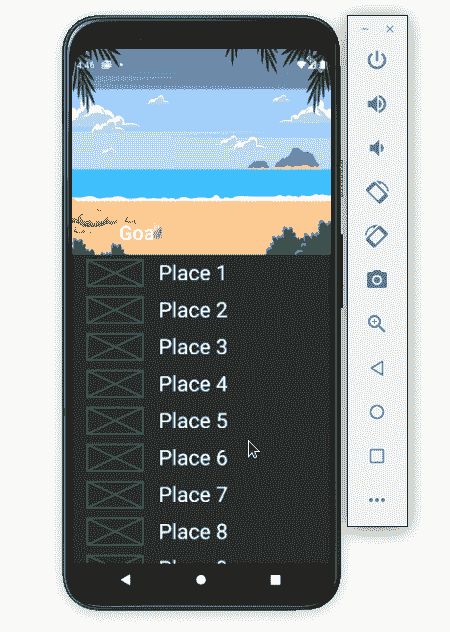

Beach image source: [vecteezy.com](http://vecteezy.com).

下面是代码如何转化为设计:


## 自定义浮动行为

默认行为是向下滚动时隐藏 SliverAppBar，向上滚动时到达列表中的第一项时展开。但是，SliverAppBar 有一些选项可以定制这种行为。

SliverAppBar 有三个重要的属性，称为`pinned`、`snap`和`floating`。设置这三个参数的组合可以让 SliverAppBar 按照您需要的方式工作。

让我们通过一个实际的例子来演示这些属性是如何工作的。

`pinned: true,snap: false,floating: false:`

仅将固定值设置为`true`会在向下滚动时将 SliverAppBar 固定在顶部。向上滚动时，只有到达列表中的第一项时，SliverAppBar 才会展开。


`pinned: true,snap: true,floating: true:`

当所有参数都设置为`true`时，SliverAppBar 在向下滚动时会停留在顶部，向上滚动一点时会完全展开，即使没有到达列表中的第一项。

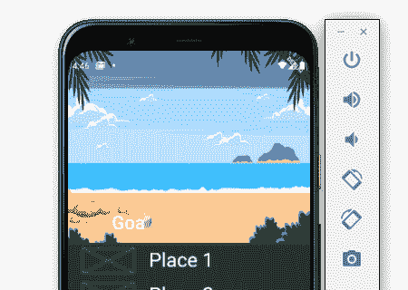

`pinned: true,snap: false,floating: true:`

当只有 snap 值设置为`false`时，SliverAppBar 在向下滚动时保持在顶部。当我们向上滚动时，背景图像开始扩展，并随着滚动而停止。


`pinned: false,snap: false,floating: true:`

仅将浮点值设置为`true`会在向下滚动时隐藏 SliverAppBar，并在我们向上滚动时开始显示背景图像。


`pinned: false,snap: true,floating: true:`

如果您想在向下滚动时隐藏 SliverAppBar，并在向上滚动一点时显示完整的背景图像，即使列表中的第一项没有显示。您可以仅将捕捉和浮动设置为`true`。

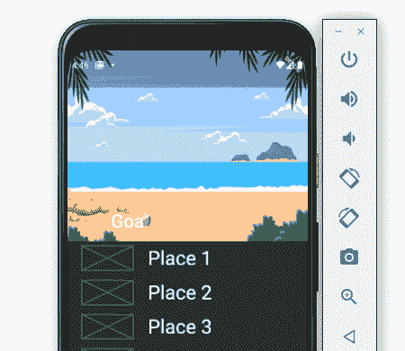

## 在 SliverAppBar 中添加 AppBar

需要注意的是，SliverAppBar 并不是普通 AppBar 的完全替代品。在 Flutter 中编写应用程序的美妙之处在于，你可以混合搭配小部件来创造新的东西。

例如，您可能会遇到需要在 SliverAppBar 中显示包含搜索框的 AppBar 的情况。

让我们看一个例子。下面是一个电子商务应用程序，向下滚动时横幅图像被隐藏，搜索框仍然停留在顶部。

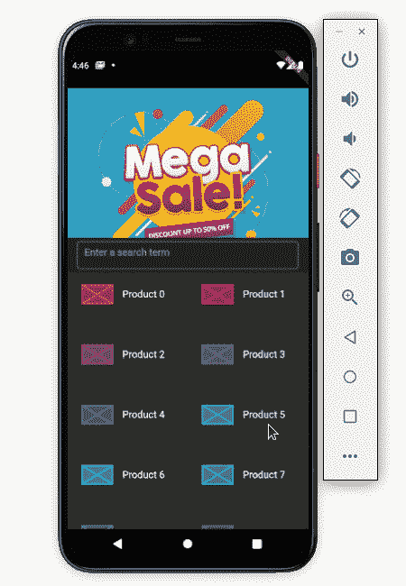

下面是如何做到这一点:

```
Scaffold(
  body: CustomScrollView(
    slivers: <Widget>[
      SliverAppBar(
        ...
        bottom: AppBar(
          title: Container(
            height: 45,
            child: TextField(
              decoration: InputDecoration(
                  border: OutlineInputBorder(),
                  hintText: 'Enter a search term'),
            ),
          ),
        ),
      ),
      SliverGrid(
        gridDelegate: SliverGridDelegateWithFixedCrossAxisCount(
          crossAxisCount: 2,
          childAspectRatio: 2,
        ),
        delegate: SliverChildBuilderDelegate(
          (BuildContext context, int index) {
            return ItemTile(index);
          },
        ),
      ),
    ],
  ),
)

```

让我们分解代码。首先，只需在 SliverAppBar 的`bottom`属性中编写一个普通的 AppBar。AppBar 将包含 TextField 小部件，作为用于搜索项目的输入框。

项目列表显示在 [SliverGrid](https://api.flutter.dev/flutter/widgets/SliverGrid-class.html) 中。由于我们已经使用了 CutomScrollView，所以这里不能使用普通的 [GridView](https://blog.logrocket.com/how-to-create-a-grid-list-in-flutter-using-gridview/) 。

## 使用 SliverAppBar 添加 TabBar

[TabBar](https://blog.logrocket.com/flutter-tabbar-a-complete-tutorial-with-examples/) 小部件用于向用户显示不同类别的内容或功能。在某些情况下，您可能希望用 SliverAppBar 显示 TabBar。

让我们来看看如何添加 TabBar，并使其行为类似于下面的示例:


```
Scaffold(
  body: DefaultTabController(
    length: 3,
    child: NestedScrollView(
      headerSliverBuilder:
          (BuildContext context, bool innerBoxIsScrolled) {
        return <Widget>[
          SliverAppBar(
            pinned: false,
            expandedHeight: 250.0,
            flexibleSpace: FlexibleSpaceBar(
              title: Text('Goa', textScaleFactor: 1),
              background: Image.asset(
                'assets/images/beach.png',
                fit: BoxFit.fill,
              ),
              stretchModes: [StretchMode.zoomBackground],
            ),
            //collapsedHeight: 100,
          ),
          SliverPersistentHeader(
            delegate: MySliverPersistentHeaderDelegate(
              TabBar(
                tabs: [
                  Tab(icon: Icon(Icons.flight)),
                  Tab(icon: Icon(Icons.directions_transit)),
                  Tab(icon: Icon(Icons.directions_car)),
                ],
              ),
            ),
            pinned: false,
          ),
        ];
      },
      body: TabBarView(
        children: [
          Icon(Icons.flight, size: 350),
          Icon(Icons.directions_transit, size: 350),
          Icon(Icons.directions_car, size: 350),
        ],
      ),
    ),
  ),
)

```

NestedScrollView 小部件用于返回标题，作为 SliverAppBar 和 [SliverPersistentHeader](https://api.flutter.dev/flutter/widgets/SliverPersistentHeader-class.html) 小部件的组合。SliverAppBar 内部使用 SliverPersistentHeader 实现收缩和增长效果。您可以使用这个小部件来显示 SliverAppBar 下面的选项卡。

[TabBarView](https://api.flutter.dev/flutter/material/TabBarView-class.html) 在 NestedScrollView 小工具的`body`参数中给出。

下面是上述代码如何转化为设计:

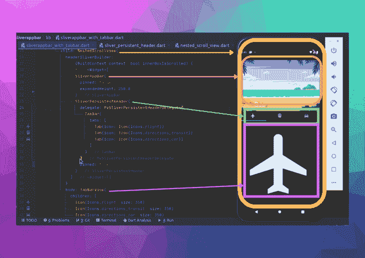

### 锁定 TabBar

如果你仔细看，向下滚动时[标签栏](https://blog.logrocket.com/flutter-tabbar-a-complete-tutorial-with-examples/)是隐藏的。为了改善用户体验，当向下滚动时，你应该始终保持 TabBar 在顶部可见。

将 SliverPersistentHeader 中的`pinned`值设置为`true`可以解决这个问题。

```
SliverPersistentHeader(
  delegate: MySliverPersistentHeaderDelegate(
    TabBar(
      tabs: [
        ...
      ],
    ),
  ),
  pinned: true,
)

```

它是这样工作的:

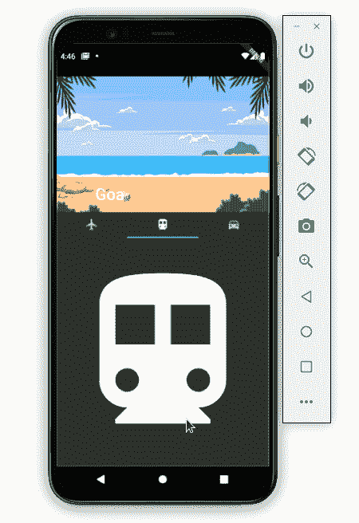

## 监听 SliverAppBar 的状态(展开或折叠)

如果想监听 SliverAppBar 的状态以确定它是展开的还是折叠的，可以使用返回值来更改 SliverAppBar 的设置。例如，您可以在标题展开时更改其文本颜色。

```
late ScrollController _scrollController;
//----------
@override
void initState() {
  // TODO: implement initState
  super.initState();

  _scrollController = ScrollController()
    ..addListener(() {
      setState(() {
        _textColor = _isSliverAppBarExpanded ? Colors.white : Colors.blue;
      });
    });
}
//----------
bool get _isSliverAppBarExpanded {
  return _scrollController.hasClients &&
      _scrollController.offset > (200 - kToolbarHeight);
}
//----------
Scaffold(
  body: CustomScrollView(
    controller: _scrollController,
    slivers: ...,
  ),
);

```

*   创建 ScrollController 并将其分配给 CustomScrollView
*   侦听器被添加到 ScrollController 来计算 SliverAppBar 是否展开
*   侦听器的返回值用于设置标题的文本颜色

下面是当 SliverAppBar 展开时改变标题“Goa”颜色的输出:

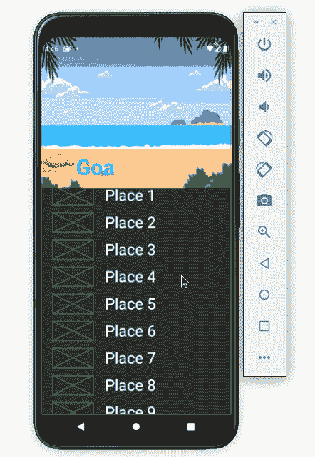

我们已经在观察 SliverAppBar 的状态，看它是展开还是折叠。您可以使用它来显示和隐藏 SliverAppBar 和 FlexibleSpaceBar 的标题。

展开时，显示 FlexibleSpaceBar 标题，折叠时，显示 SliverAppBar 标题。否则，如果添加了两个标题，它们将在应用程序栏展开时可见，并在折叠时重叠。

请检查两者之间的区别，后面是显示和隐藏标题的[代码。](https://gist.github.com/timelessfusionapps/a43714c89ad2e824eec54f8c0cac91b9)

### 重叠标题与显示和隐藏标题

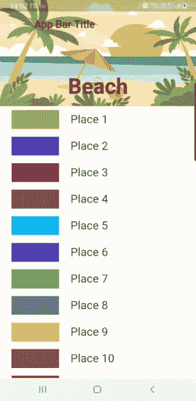

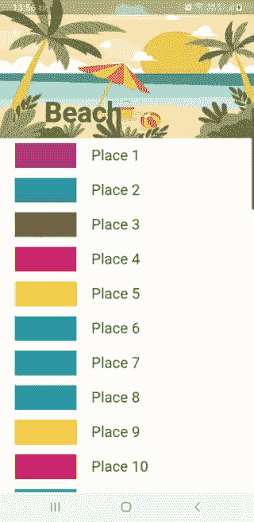

```
SliverAppBar(
 // show and hide SliverAppBar Title
 title: _isSliverAppBarExpanded ? const Text('App Bar Title') : null,
 pinned: true,
 snap: false,
 floating: false,
 expandedHeight: kExpandedHeight,
 // show and hide FlexibleSpaceBar title
 flexibleSpace: _isSliverAppBarExpanded
     ? null
     : FlexibleSpaceBar(
         title: Text(
           'Beach',
           textScaleFactor: 1,
           style: TextStyle(
               color: _textColor,
               fontWeight: FontWeight.bold,
               fontSize: 30),
         ),
         background: Image.asset(
           'assets/images/newBeach.jpg',
           fit: BoxFit.fill,
         ),
       ),
),
```

## 自定义 SliverAppBar:标题位置和圆角

类似于 Scaffold AppBar，我们也可以自定义 SliverAppBar 和 FlexibleSpaceBar 的外观。我们已经知道如何向 FlexibleSpaceBar 添加图像。现在让我们看看如何在 FlexibleSpaceBar 和 SliverAppBar 的底部添加圆角，并更改标题的位置。

通常，我们会使用一个`Container`小部件来设计包装在其中的其他小部件的样式。例如，如果我们在 FlexibleSpaceBar 中添加了颜色或渐变而不是图像，那么容器小部件将是一个理想的选择。但是使用容器包装的图像不会改变图像的属性。

因此，解决方案是使用`ClipRRect`小部件并用它包装`Image.asset`。`ClipRRect`拥有与`Container`装修物业类似的`borderRadius`物业。请[看这里的代码](https://gist.github.com/timelessfusionapps/c1007f964d33cf49f876425afdd7e1c2)和下面的图片做参考。

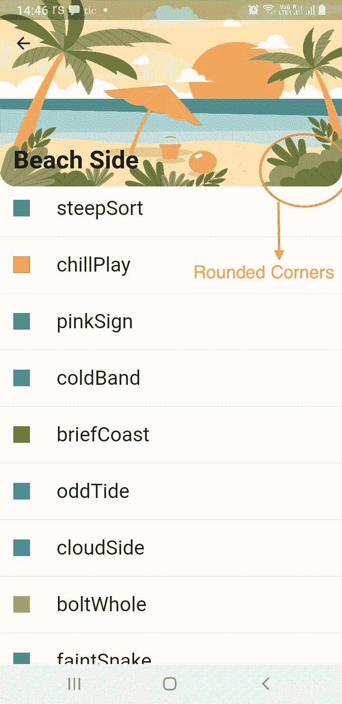

其次，如果我们想改变标题的位置，我们必须将`centerTitle`属性设置为`true`或`false`。

但是，将属性设置为`false`不会将标题完全移向 FlexibleSpaceBar 的开头，因为默认的标题填充需要根据 UI 设计进行调整。

默认情况下，如果`centerTitle`被设置为`false`，则标题填充被设置为`EdgeInsetsDirectional.only(start: 72.0, bottom: 16.0)`。否则，如果`centerTitle`被设置为`true`，填充被设置为`EdgeInsetsDirectional.only(start: 0, bottom: 16.0)`。

我已经将`centerTitle`设置为`false`并更改了填充值。现在，输出将如下所示:

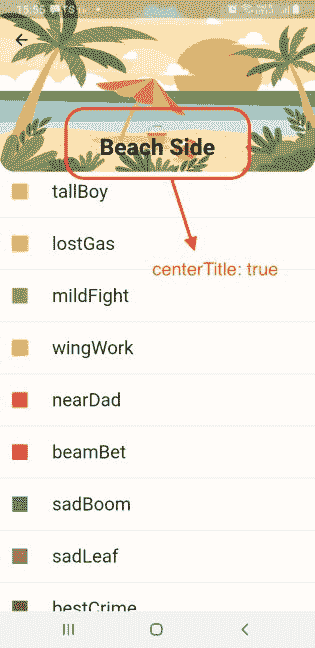

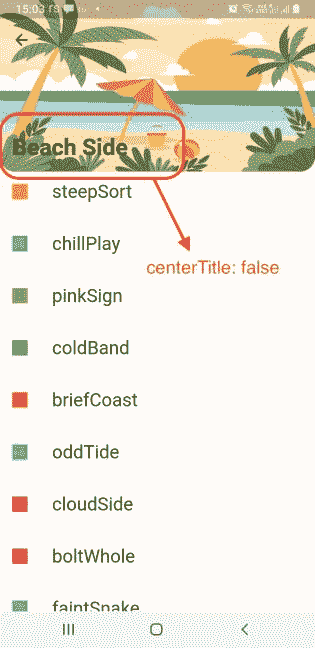

```
// title is not centered with custom padding.
FlexibleSpaceBar(
   titlePadding: const EdgeInsetsDirectional.only(
       start: 16.0, bottom: 16.0),
   centerTitle: false,
   title: const Text(
     'Beach Side',
     textScaleFactor: 1.0,
     style: TextStyle(
         color: Colors.black, fontWeight: FontWeight.bold),
   ),
   // ClipRRect added here for rounded corners
   background: ClipRRect(
     borderRadius: const BorderRadius.only(
       bottomLeft: Radius.circular(20.0),
       bottomRight: Radius.circular(20.0),
     ),
     child: Image.asset(
       'assets/images/newBeach.jpg',
       fit: BoxFit.fill,
     ),   ), ),
```

如果您希望 SliverAppBar 具有类似的样式，它已经有一个名为`shape`的属性，我们可以在其中使用`RoundedRectangleBorder`小部件。我们还通过将`centerTitle`属性设置为`true`来改变标题的位置。请看看下面的图片和代码:

```
SliverAppBar(
 centerTitle: true,
 iconTheme: const IconThemeData(color: Colors.black),
 title: _showAppBarTitle ? const Text('App Bar Title') : null,
// shape property takes in RoundedRectangleBorder widget
 shape: const RoundedRectangleBorder(
   borderRadius: BorderRadius.only(
     bottomLeft: Radius.circular(20.0),
     bottomRight: Radius.circular(20.0), ), ),
```

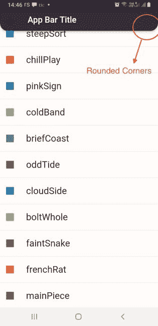

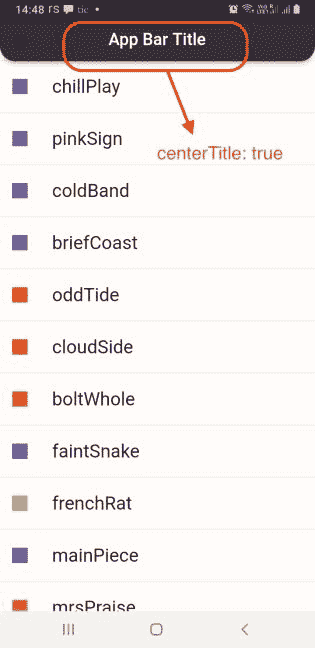

下一段代码的灵感来自于迭戈·贝拉斯克斯。他使用 SliverPersistentHeader 创建了类似于 SliverAppBar 和 FlexibleSpaceBar 的效果。

我已经创建了一个用户的信息和一个圆形头像在中心的个人资料页面。当我们向上滚动时，圆形头像消失了，出现了一个普通的应用程序栏。背景是一个带有渐变颜色的容器。当 AppBar 折叠时，渐变也随之折叠，AppBar 也有同样的渐变效果。

代码块相当长，所以我在这里留了一个到示例的链接[，而不是张贴整个代码。请看下图，以供参考。](https://gist.github.com/timelessfusionapps/35c13dce83ce7c59d5e02f7e3a0a0dda)

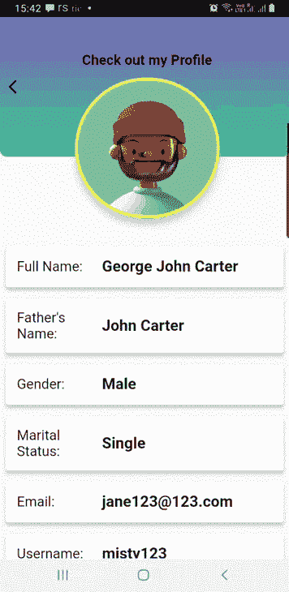

## 结论

如果你已经做到了这一步，你应该已经掌握了在你的 Flutter 应用程序中添加 SliverAppBar 的所有必要知识。

本例使用的完整代码可从 [GitHub](https://github.com/pinkeshdarji/sliverappbar) 获得。

## 使用 [LogRocket](https://lp.logrocket.com/blg/signup) 消除传统错误报告的干扰

[](https://lp.logrocket.com/blg/signup)

[log 火箭](https://lp.logrocket.com/blg/signup)是一款数字体验分析解决方案，只需几个真正重要的项目，便可保护您免受数百次假阳性错误警报的影响。LogRocket 告诉您在应用程序中实际影响用户的最具影响力的 bug 和 UX 问题。

然后，使用具有深层技术遥测的会话重放来确切地查看用户看到了什么以及是什么导致了问题，就像你在他们身后看一样。

LogRocket 自动聚合客户端错误、JS 异常、前端性能指标和用户交互。然后 LogRocket 使用机器学习来告诉你哪些问题正在影响大多数用户，并提供你需要修复它的上下文。

关注重要的 bug—[今天就试试 LogRocket】。](https://lp.logrocket.com/blg/signup-issue-free)