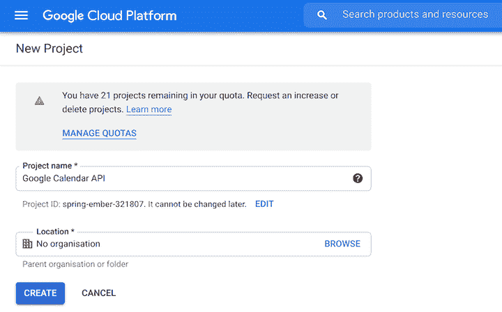
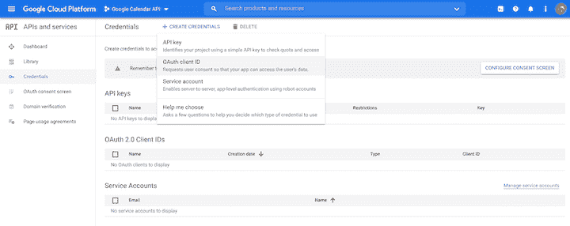
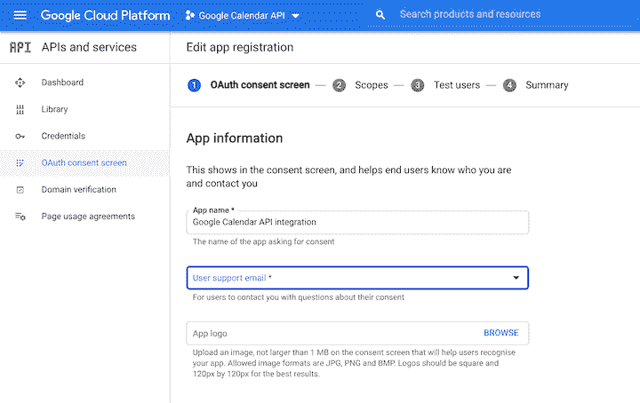
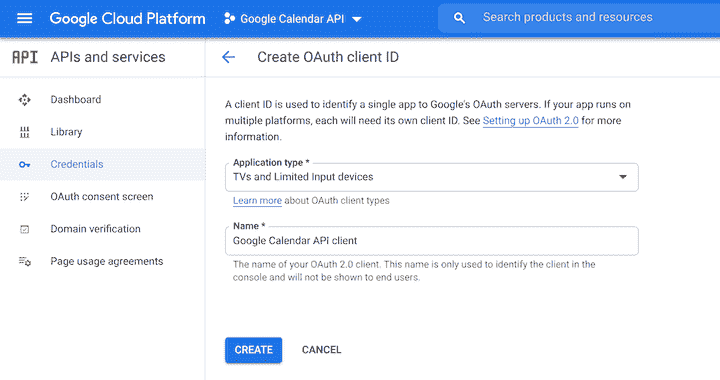
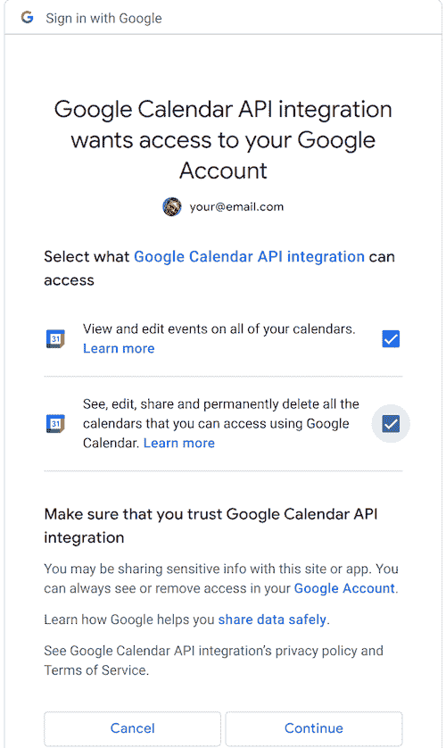
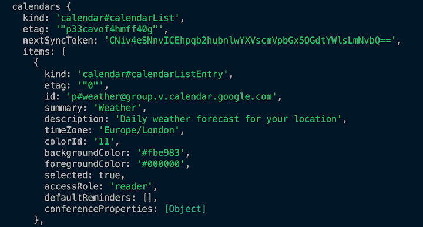

# 如何使用 OAuth 2.0 认证和访问 Google APIs

> 原文：<https://blog.logrocket.com/how-to-authenticate-access-google-apis-using-oauth-2-0/>

Google 有丰富的 API，我们可以与之交互。在撰写本文时，有 200 多个可用的 API，包括 YouTube、Google Calendar 和 Gmail 等等。

为了[与 Google API](https://blog.logrocket.com/build-crud-api-using-google-sheets-api/)集成，需要通过 Google 认证并获得证书。在本教程中，我们将带您了解如何使用 TypeScript 进行 Google 认证。

作为一个实际的例子，我们将演示如何使用获得的刷新令牌来访问 Google Calendar API。你可以应用同样的方法来访问任何其他公共管理的 Google API。

## 在 Google 云平台上创建 OAuth 2.0 客户端 ID

首先去 [Google 云平台创建一个项目](https://console.cloud.google.com/projectcreate)。项目的名称并不重要，尽管根据您打算使用的 API 来命名项目可能会有所帮助。这就是我们在这里要做的，因为我们计划与[谷歌日历 API](https://developers.google.com/calendar) 集成:



该项目是一个容器，其中将存放 [OAuth 2.0](https://blog.logrocket.com/implementing-oauth-2-0-in-node-js/) 客户端 ID。现在我们已经创建了项目，让我们转到[凭证屏幕](https://console.cloud.google.com/apis/credentials)，并使用创建凭证下拉菜单创建一个 OAuth 客户端 ID:



在创建 OAuth 客户端 ID 之前，您可能需要创建一个 OAuth 同意屏幕。这样做感觉有点令人生畏；有许多问题需要回答，因为除了我们今天看到的 API 认证之外，同意屏幕还可以用于各种目的。

当受到质疑时，您通常可以接受默认设置并继续。您需要的用户类型将是**外部**:


系统还会提示您创建应用程序注册。这里真正需要的只是一个名字(可以是任何东西)和你的电子邮件地址:



你不需要担心范围。你可以计划发布应用程序，也可以将自己设置为测试用户；您需要执行其中一项操作才能通过应用程序的身份验证。继续到旅程的最后，应该会为您提供 OAuth 同意屏幕，您需要这个屏幕来创建 OAuth 客户端 ID。

创建 OAuth 客户端 ID 有点混乱，因为所需的**应用类型**是**电视和受限输入设备**。



我们使用这种类型的应用程序是因为我们想要获得一个[刷新令牌](https://oauth.net/2/grant-types/refresh-token/)，我们将能够在将来使用它来获得令牌以访问 Google APIs。

创建完成后，您就可以从谷歌云平台下载客户端 ID 了:


当您下载它时，它应该看起来像这样:

```
{
  "installed": {
    "client_id": "CLIENT_ID",
    "project_id": "PROJECT_ID",
    "auth_uri": "https://accounts.google.com/o/oauth2/auth",
    "token_uri": "https://oauth2.googleapis.com/token",
    "auth_provider_x509_cert_url": "https://www.googleapis.com/oauth2/v1/certs",
    "client_secret": "CLIENT_SECRET",
    "redirect_uris": ["urn:ietf:wg:oauth:2.0:oob", "http://localhost"]
  }
}
```

你需要`client_id`、`client_secret`和`redirect_uris`。将它们保存在安全的地方，不要将`client_id`和`client_secret`提交给源代码管理。

## 获取刷新令牌

现在我们已经有了`client_id`和`client_secret`，我们准备编写一个简单的节点命令行应用程序，我们可以用它来获取刷新令牌。这是一个多阶段的过程，最终会是这样的:

*   向 Google 认证提供者提供`client_id`和`client_secret`。作为回报，它将提供一个身份验证 URL
*   在浏览器中打开身份验证 URL 并授予许可。提供商将移交一个代码
*   向 Google 认证提供者提供`client_id`、`client_secret`和代码。它将获取并向用户提供刷新令牌

开始编码吧。我们将初始化一个 TypeScript 节点项目，如下所示:

```
mkdir src
cd src
npm init -y
npm install googleapis ts-node typescript yargs @types/yargs @types/node
npx tsc --init
```

我们添加了许多依赖项，这些依赖项将允许我们编写 TypeScript 节点命令行应用程序。我们还向 [`googleapis`](https://www.npmjs.com/package/googleapis) 包添加了一个依赖项，它对自己的描述如下:

> 使用 Google APIs 的 Node.js 客户端库。包括了对 OAuth 2.0、API 密钥和 JWT 令牌的授权和认证的支持。

我们将利用 OAuth 2.0 部分。我们将通过创建一个名为`google-api-auth.ts`的文件来开始我们的旅程:

```
import { getArgs, makeOAuth2Client } from "./shared";

async function getToken() {
  const { clientId, clientSecret, code } = await getArgs();
  const oauth2Client = makeOAuth2Client({ clientId, clientSecret });

  if (code) await getRefreshToken(code);
  else getAuthUrl();

  async function getAuthUrl() {
    const url = oauth2Client.generateAuthUrl({
      // 'online' (default) or 'offline' (gets refresh_token)
      access_type: "offline",

      // scopes are documented here: https://developers.google.com/identity/protocols/oauth2/scopes#calendar
      scope: ["https://www.googleapis.com/auth/calendar", "https://www.googleapis.com/auth/calendar.events"],
    });

    console.log(`Go to this URL to acquire a refresh token:\n\n${url}\n`);
  }

  async function getRefreshToken(code: string) {
    const token = await oauth2Client.getToken(code);
    console.log(token);
  }
}

getToken();
```

还有一个名为`shared.ts`的公共文件，它由`google-api-auth.ts`导入，我们稍后将重用:

```
import { google } from "googleapis";
import yargs from "yargs/yargs";
const { hideBin } = require("yargs/helpers");

export async function getArgs() {
  const argv = await Promise.resolve(yargs(hideBin(process.argv)).argv);

  const clientId = argv['clientId'] as string;
  const clientSecret = argv['clientSecret'] as string;

  const code = argv.code as string | undefined;
  const refreshToken = argv.refreshToken as string | undefined;
  const test = argv.test as boolean;

  if (!clientId) throw new Error('No clientId ');
  console.log('We have a clientId');

  if (!clientSecret) throw new Error('No clientSecret');
  console.log('We have a clientSecret');

  if (code) console.log('We have a code');
  if (refreshToken) console.log('We have a refreshToken');

  return { code, clientId, clientSecret, refreshToken, test };
}

export function makeOAuth2Client({
  clientId,
  clientSecret,
}: {
  clientId: string;
  clientSecret: string;
}) {
  return new google.auth.OAuth2(
    /* YOUR_CLIENT_ID */ clientId,
    /* YOUR_CLIENT_SECRET */ clientSecret,
    /* YOUR_REDIRECT_URL */ "urn:ietf:wg:oauth:2.0:oob"
  );
}
```

上面的`getToken`函数做两件事:

1.  如果给定一个`client_id`和`client_secret`，它将获得一个认证 URL
2.  如果给定一个`client_id`、`client_secret`和`code`，它将获得一个刷新令牌(范围是访问 Google 日历 API)

我们将向`package.json`添加一个条目，这将允许我们运行我们的控制台应用程序:

```
"google-api-auth": "ts-node google-api-auth.ts"
```

现在，我们已经准备好获取刷新令牌。我们将运行以下命令，代入适当的值:

`npm run google-api-auth -- --clientId CLIENT_ID --clientSecret CLIENT_SECRET`

单击控制台中生成的 URL。它应该会在浏览器中打开一个同意屏幕，如下所示:



认证和同意，你应该得到一个代码:


然后(快速)将获得的代码粘贴到以下命令中:

```
npm run google-api-auth -- --clientId CLIENT_ID --clientSecret CLIENT_SECRET --code THISISTHECODE
```

`refresh_token`(和其他东西一起)将被打印到控制台上。抓住它，把它放在安全的地方。同样，不要存储在源代码管理中！

值得花点时间反思一下我们所做的事情。我们获得了一个刷新令牌，这涉及到一定量的人类交互。我们必须运行一个控制台命令，在浏览器中做一些工作，然后运行另一个命令。

你不会想重复这样做，因为它涉及到人际交往。有意地，它不能被自动化。但是，一旦您获得了刷新令牌，您就可以重复使用它，直到它过期(可能永远不会过期，或者至少在几年后过期)。

一旦有了刷新令牌并安全地存储了它，就有了自动化 API 交互所需的东西。

## 示例:访问 Google 日历 API

让我们通过尝试访问 Google Calendar API 来测试我们的刷新令牌。我们将创建一个`calendar.ts`文件:

```
import { google } from "googleapis";
import { getArgs, makeOAuth2Client } from "./shared";

async function makeCalendarClient() {
  const { clientId, clientSecret, refreshToken } = await getArgs();
  const oauth2Client = makeOAuth2Client({ clientId, clientSecret });
  oauth2Client.setCredentials({
    refresh_token: refreshToken
  });

  const calendarClient = google.calendar({
    version: "v3",
    auth: oauth2Client,
  });
  return calendarClient;
}

async function getCalendar() {
  const calendarClient = await makeCalendarClient();

  const { data: calendars, status } = await calendarClient.calendarList.list();

  if (status === 200) {
    console.log('calendars', calendars);
  } else {
    console.log('there was an issue...', status);
  }

}

getCalendar();
```

上面的`getCalendar`函数使用`client_id`、`client_secret`和`refresh_token`来访问 Google 日历 API 并检索日历列表。

我们将向我们的`package.json`添加一个条目，这将允许我们运行这个函数:

```
"calendar": "ts-node calendar.ts",
```

现在我们准备测试`calendar.ts`。我们将运行以下命令，代入适当的值:

```
npm run calendar -- --clientId CLIENT_ID --clientSecret CLIENT_SECRET --refreshToken REFRESH_TOKEN
```

当我们第一次运行时，我们可能会遇到一条自我解释的消息，告诉我们需要为我们的应用程序启用日历 API:

```
(node:31563) UnhandledPromiseRejectionWarning: Error: Google Calendar API has not been used in project 77777777777777 before or it is disabled. Enable it by visiting https://console.developers.google.com/apis/api/calendar-json.googleapis.com/overview?project=77777777777777 then retry. If you enabled this API recently, wait a few minutes for the action to propagate to our systems and retry.
```

一旦启用，我们就可以成功运行第一次。我们应该会在控制台中看到类似这样的内容:



这表明我们使用刷新令牌成功地集成了 Google API。

## 与其他 Google APIs 集成

我们已经展示了如何与谷歌日历 API 集成，但这并不是我们所能做的极限。正如我们之前所讨论的，Google 有超过 200 个 API，我们可以按照本教程中描述的认证步骤与之交互。

例如，如果您想与 YouTube API 或 Gmail API 集成，您可以使用相应的[范围](https://developers.google.com/identity/protocols/oauth2/scopes#calendar)简单地遵循上述步骤，并针对该 API 构建一个集成。本教程概述的方法是集成众多 Google APIs 的关键。快乐融入！

## 使用 [LogRocket](https://lp.logrocket.com/blg/signup) 消除传统错误报告的干扰

[](https://lp.logrocket.com/blg/signup)

[LogRocket](https://lp.logrocket.com/blg/signup) 是一个数字体验分析解决方案，它可以保护您免受数百个假阳性错误警报的影响，只针对几个真正重要的项目。LogRocket 会告诉您应用程序中实际影响用户的最具影响力的 bug 和 UX 问题。

然后，使用具有深层技术遥测的会话重放来确切地查看用户看到了什么以及是什么导致了问题，就像你在他们身后看一样。

LogRocket 自动聚合客户端错误、JS 异常、前端性能指标和用户交互。然后 LogRocket 使用机器学习来告诉你哪些问题正在影响大多数用户，并提供你需要修复它的上下文。

关注重要的 bug—[今天就试试 LogRocket】。](https://lp.logrocket.com/blg/signup-issue-free)