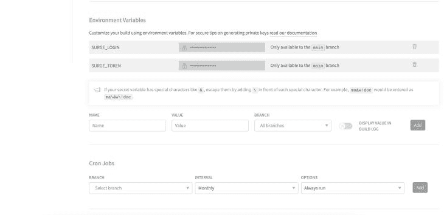

# 如何使用连续部署将前端应用程序自动部署到 Surge

> 原文：<https://blog.logrocket.com/how-to-auto-deploy-frontend-applications-to-surge-using-continuous-deployment/>

以前，当软件开发人员开发新产品时，他们必须等待数周，在某些情况下甚至数月才能将新版本的应用程序部署到生产环境中。如今，软件开发人员已经找到了新的更方便的方法来自动发布他们开发的产品，同时确保零停机时间。

在这篇文章中，我们将讨论如何使用 Git 挂钩和连续部署自动部署前端应用程序，同时确保零宕机。

## 什么是浪涌？

Surge 是一个开源的静态网站托管解决方案。Surge 是免费使用的，并提供基本 SSL 和免费定制域名的选项等功能。Surge 有一个命令行界面，开发者只需点击几下鼠标就可以发布原生 web 应用:

```
npm install --global surge

```

以上命令将在您的计算机上全局安装 Surge。您可以通过在终端中运行`surge`来测试安装。这将提示您登录您的 surge 帐户，或者创建一个免费帐户(如果您还没有)。

## 使用 Git 挂钩自动部署到 Surge

虽然可以使用命令行将网页发布到 Surge，但这不是最好的方法。使用命令行将要求开发人员在项目发生变化时手动重新发布网页。有了 Git 挂钩，一旦触发了指定的 Git 事件，我们就可以自动部署我们的应用程序。要查看 Git 挂钩的运行情况，我们必须创建一个示例 React 项目。运行以下命令:

```
create-react-app githook-demo

```

上面的命令将在 githook-demo 文件夹中创建一个简单的 React 项目。默认情况下，create-react-app (CRA)将初始化一个 Git 存储库。Git 挂钩存储在 Git 文件夹的`Hooks`目录中。

将我们的应用程序部署到 Surge 的最佳时机是在提交之后和提交之前。为此，我们需要使预推送挂钩可执行。我们可以使用名为 Husky 的第三方软件包进行设置:

```
npm install husky --save-dev

```

安装 Husky 后，打开`package.json`文件并添加以下 JSON 数据:

```
"husky": {
  "hooks": {
    "pre-push": "npm run build && surge --project ./build --domain your-domain.surge.sh"
  }
}

```

上面的 JSON 数据包含一个预推送脚本。这个脚本将构建 React 项目，并将构建文件夹中的捆绑应用程序部署到指定的域。默认情况下，CRA 会将构建文件夹添加到`.gitgnore`文件中。在将项目提交给 Git 之前，从`.gitignore`文件中删除构建文件夹是很重要的。

一旦`git push origin main`被执行，Husky 将在远程 refs 被更新之后但在任何对象被传送到它之前执行预推送挂钩。访问指定的域，您应该会看到在 Surge 上实时部署的 githook-demo 应用程序。

## 使用 Travis CI 自动部署到浪涌

在上一节中，我们探讨了如何使用 Git 挂钩将 React 应用程序部署到 Surge，在本节中，我们将学习如何使用 Travis CI 部署一个示例 Vue 应用程序。

Travis CI 是一款流行的持续集成工具，可用于自动构建、测试和部署应用程序的代码库。为了看到这一点，我们需要通过运行`Vue Create Travis-demo`来创建一个样例 Vue 应用程序。

这个示例项目生成后，创建一个远程 GitHub 存储库，并将所有内容推送到那里。这很重要，因为 Travis CI 只作用于已经被推送到 Github 存储库的代码。

为我们的应用程序连接持续部署的下一步是将 GitHub 存储库与 Travis CI 连接起来。为此，请前往 travisci.org，将 GitHub 存储库添加到 Travis。[本文](https://blog.logrocket.com/continuous-integration-and-deployment-with-travis-ci/)解释了如何向 Travis 添加 GitHub 存储库。

我们的设置进展顺利，下一步是添加一个 Travis 清单文件，在这个文件中，我们将包含 Travis 将 Vue 应用程序部署到 Surge 所需的所有信息。在项目目录的根目录下创建一个名为`.travis.yml`的文件，并向其中添加以下代码行:

```
language:node_js
node_js:
   - "node"
cache:
  directories:
    -node_modules
script: 
  - npm run build
deploy:
  provider:surge
  project:./dist/
  domain:example-domain.surge.sh
  skip_cleanup: true
  on:
    branch: main

```

上面几行代码包含 Travis 部署我们的 Vue 应用程序所需的必要配置:

*   `language`字段指定了编写代码的语言
*   `cache.directories`字段用于设置 Travis 应该为之前的构建缓存的目录。节点模块目录将被缓存
*   `script`字段包含 Travis 将在构建期间执行的脚本。在我们的例子中，我们想要执行脚本`npm run build`。这个脚本将创建一个`dist`文件夹，其中将包含样例 Vue 应用程序的缩小版和生产就绪版本
*   `deploy.provider`字段包含我们的应用程序将被部署的平台的值。可以指定各种托管平台，在我们的例子中，值将是 Surge，因为我们打算将我们的 Vue 应用程序部署到 Surge
*   `deploy.project`是我们项目所在的目录。如果未指定，Travis 会将项目字段的值设置为根目录。在我们的例子中，npm 将应用程序的生产优化版本存储在一个`dist`文件夹中
*   顾名思义,`deploy.domain`字段包含您希望应用程序托管的域
*   每当构建完成时，Travis 都会清理未使用的文件，其中一些文件可能是应用程序正常运行所必需的。`skip_cleanup`字段告诉 Travis 跳过清理过程
*   `on.branch`字段指定应该部署存储库的哪个分支。在我们的例子中，我们将其设置为 main。这意味着只有推送到主分支的变更才会被自动部署。这允许开发人员有一个测试分支，用于不应该出现在应用程序的产品版本中的更改

有了`.travis.yml`文件设置，我们离部署应用程序只有一步之遥。Travis CI 需要在部署时验证 surge 帐户。我们需要将我们的 surge 身份验证细节作为秘密环境变量添加到 Travis CI 中。要进行设置，请到终端运行以下命令来检索您的 Surge 身份验证令牌:

```
  Surge Token

```

将返回的代码复制到导入到 Travis CI dashboard 的项目中，并添加令牌。



`SURGE_LOGIN`环境变量将是与您的 Surge 帐户相关联的电子邮件地址。

至此，一切都成立了！您可以继续将本地更改推送到远程存储库的主分支。这将触发 Travis CI 构建，这反过来会将示例 Vue 应用程序自动部署到您在上面的`travis.yml`文件中指定的域。

## 结论

在这篇文章中，我们讨论了如何使用 Git hooks 和 Travis CI(一种用于持续集成和部署的工具)将前端应用程序部署到 Surge。Surge 可以免费使用，非常适合简单的静态页面，尽管它可能不是更高级应用程序的最佳选择。我鼓励您查看官方文档，了解更多关于如何从 surge 中获得更多好处的信息。

## 使用 LogRocket 消除传统反应错误报告的噪音

[LogRocket](https://lp.logrocket.com/blg/react-signup-issue-free)

是一款 React analytics 解决方案，可保护您免受数百个误报错误警报的影响，只针对少数真正重要的项目。LogRocket 告诉您 React 应用程序中实际影响用户的最具影响力的 bug 和 UX 问题。

[ ](https://lp.logrocket.com/blg/react-signup-general) [  ](https://lp.logrocket.com/blg/react-signup-general) [LogRocket](https://lp.logrocket.com/blg/react-signup-issue-free)

自动聚合客户端错误、反应错误边界、还原状态、缓慢的组件加载时间、JS 异常、前端性能指标和用户交互。然后，LogRocket 使用机器学习来通知您影响大多数用户的最具影响力的问题，并提供您修复它所需的上下文。

关注重要的 React bug—[今天就试试 LogRocket】。](https://lp.logrocket.com/blg/react-signup-issue-free)

## 像用户一样体验您的 Vue 应用

调试 Vue.js 应用程序可能会很困难，尤其是当用户会话期间有几十个(如果不是几百个)突变时。如果您对监视和跟踪生产中所有用户的 Vue 突变感兴趣，

[try LogRocket](https://lp.logrocket.com/blg/vue-signup)

.

[](https://lp.logrocket.com/blg/vue-signup)[https://logrocket.com/signup/](https://lp.logrocket.com/blg/vue-signup)

LogRocket 就像是网络和移动应用程序的 DVR，记录你的 Vue 应用程序中发生的一切，包括网络请求、JavaScript 错误、性能问题等等。您可以汇总并报告问题发生时应用程序的状态，而不是猜测问题发生的原因。

LogRocket Vuex 插件将 Vuex 突变记录到 LogRocket 控制台，为您提供导致错误的环境，以及出现问题时应用程序的状态。

现代化您调试 Vue 应用的方式- [开始免费监控](https://lp.logrocket.com/blg/vue-signup)。