# 如何在 Flutter 中建立底部导航栏

> 原文：<https://blog.logrocket.com/how-to-build-a-bottom-navigation-bar-in-flutter/>

移动应用程序通常提供各种类别的内容。例如，谷歌 Play 商店应用程序按游戏、应用程序、电影和书籍等类别展示其内容。在 Flutter 应用程序中，BottomNavigationBar 小部件使用户能够在应用程序启动时看到任何一个类别，并且只需用手指轻轻一点就可以快速查看其他类别。

在本教程中，我们将告诉你所有你需要知道的关于 Flutter 中的 BottomNavigationBar 的信息。我们将演示它是如何工作的，浏览一些用例，并向您展示如何在您的 Flutter 应用程序中定制 BottomNavigationBar 小部件。

以下是我们将要介绍的内容:

## Flutter 中的 BottomNavigationBar 是什么？

BottomNavigationBar 是一个小部件，在 Flutter 应用程序的底部显示一行小部件。通常，它用来展示三到五件商品。每个项目必须有一个标签和图标。BottomNavigationBar 允许您一次选择一个项目，并快速导航到给定页面。

现在让我们一步一步地完成创建一个简单的 BottomNavigationBar 的过程。成品将如下所示:

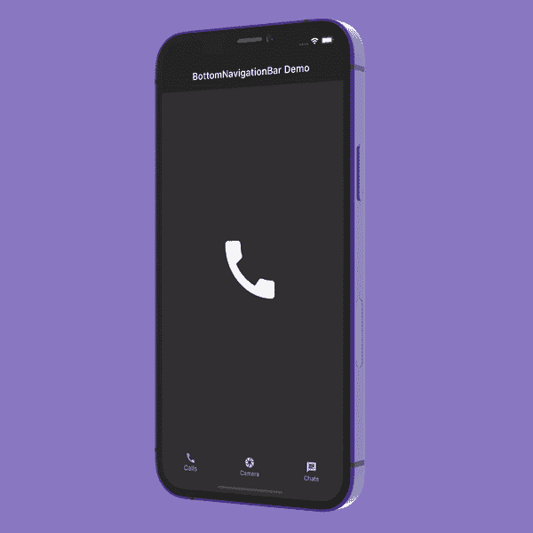

### 显示底部导航栏

BottomNavigationBar 小部件被赋予[脚手架](https://api.flutter.dev/flutter/material/Scaffold-class.html)的`bottomNavigationBar`属性:

```
Scaffold(
  appBar: AppBar(
    title: const Text('BottomNavigationBar Demo'),
  ),
  bottomNavigationBar: BottomNavigationBar(
    items: const <BottomNavigationBarItem>[
      BottomNavigationBarItem(
        icon: Icon(Icons.call),
        label: 'Calls',
      ),
      BottomNavigationBarItem(
        icon: Icon(Icons.camera),
        label: 'Camera',
      ),
      BottomNavigationBarItem(
        icon: Icon(Icons.chat),
        label: 'Chats',
      ),
    ],
  ),
);

```

BottomNavigationBar 有一个名为`items`的必需属性。`items`接受一个`BottomNavigationBarItem`类型的小部件。`BottomNavigationBarItem`仅用于显示 BottomNavigationBar 中的实际项目。

上面的代码只显示了 BottomNavigationBar，其中第一项被选为默认项。当我们单击其他项目时，它不会改变选择:

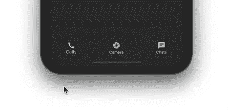

### 显示选择的项目

为了显示其他项目的选择，我们将使用两个属性:`onTap`和`currentIndex`。

```
int _selectedIndex = 0; //New
BottomNavigationBar(
  items: const <BottomNavigationBarItem>[
    ...
  currentIndex: _selectedIndex, //New
  onTap: _onItemTapped,         //New
)
//New
void _onItemTapped(int index) {
  setState(() {
    _selectedIndex = index;
  });
}

```

`_selectedIndex`变量保存当前选中项目的值。`_selectedIndex`被赠予`currentIndex`房产。

`_onItemTapped()`回调被分配给 BottomNavigationBar 的`onTap`，当点击项目时返回索引。只需将当前选中的项目索引分配给`_selectedIndex`并执行`setState`即可在 BottomNavigationBar 中显示该项目已被选中。

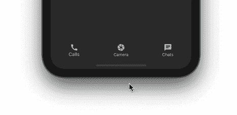

### 显示所选项目的页面

到目前为止，我们没有任何基于所选项目的页面可显示。所以，让我们继续努力吧:

```
//New
static const List<Widget> _pages = <Widget>[
  Icon(
    Icons.call,
    size: 150,
  ),
  Icon(
    Icons.camera,
    size: 150,
  ),
  Icon(
    Icons.chat,
    size: 150,
  ),
];
Scaffold(
  appBar: AppBar(
    title: const Text('BottomNavigationBar Demo'),
  ),
  body: Center(
    child: _pages.elementAt(_selectedIndex), //New
  ),
  bottomNavigationBar: BottomNavigationBar(
    ...
  ),
);

```

保存一个小部件列表。为了简单起见，我们只显示项目本身的一个大图标。

根据项目的`_selectedIndex`在屏幕中央显示从`_pages`开始的一个页面将完成剩下的魔术。

现在我们已经启动并运行了 BottomNavigationBar:

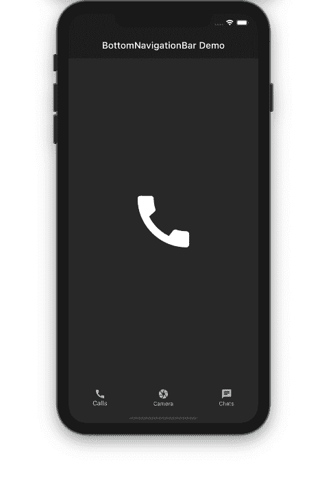

下图显示了代码如何转化为设计:

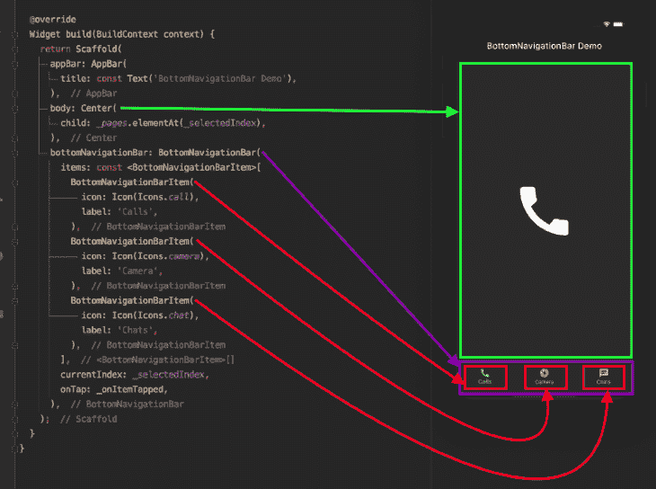

## 自定义底部导航栏

BottomNavigationBar 有很多选项可以根据你的需要进行定制。让我们放大一些您可以自定义的属性。

### 背景颜色

您可能希望更改 BottomNavigationBar 的背景色以匹配您的品牌。只需使用`backgroundColor`属性就可以做到这一点。

```
BottomNavigationBar(
  backgroundColor: Colors.blueAccent,
  items: const <BottomNavigationBarItem>[
    ...
  ],
)

```

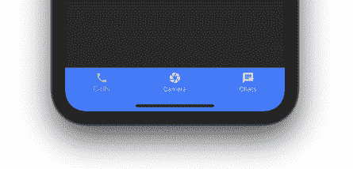

### 海拔

默认情况下，BottomNavigationBar 被设置为从表面提升`8`点，以便它出现在页面的顶部。您可以将该属性设置为任何值:

```
BottomNavigationBar(
  backgroundColor: Colors.white10,
  elevation: 0,
  items: const <BottomNavigationBarItem>[
   ...
  ],
)

```

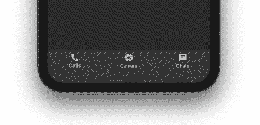

### 图标大小

您可以使用`iconSize`属性一次缩小或放大所有图标的尺寸:

```
BottomNavigationBar(
  iconSize: 40,
  items: const <BottomNavigationBarItem>[
    ...
  ],
)

```

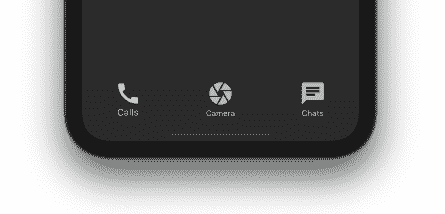

### 鼠标光标

在 web 上运行时，当鼠标光标悬停在 BottomNavigationBar 上的项目上时，您可以自定义鼠标光标:

```
BottomNavigationBar(
  mouseCursor: SystemMouseCursors.grab,
  items: const <BottomNavigationBarItem>[
    ...
  ],
)

```

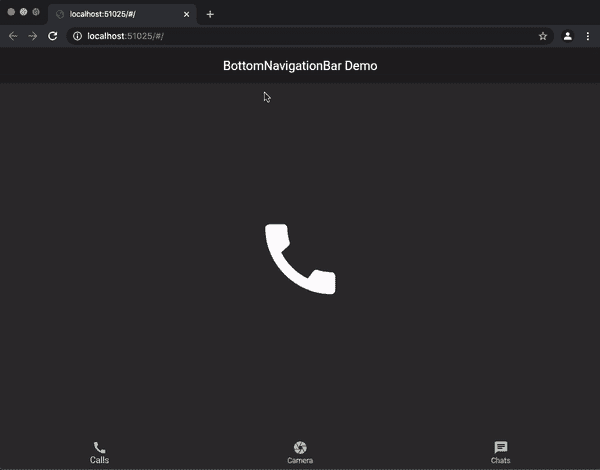

### 选定的项目

使用 BottomNavigationBar 的几个选定属性，可以使选定的项目看起来与未选定的项目不同:

```
BottomNavigationBar(
  selectedFontSize: 20,
  selectedIconTheme: IconThemeData(color: Colors.amberAccent, size: 40),
  selectedItemColor: Colors.amberAccent,
  selectedLabelStyle: TextStyle(fontWeight: FontWeight.bold),
  items: const <BottomNavigationBarItem>[
    ...
  ],
)

```

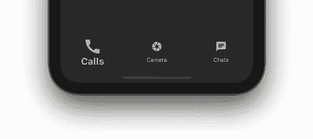

### 未选择的项目

您可能还想更改未选中项目的外观。BottomNavigationBar 有一些未选中的属性可供您使用:

```
BottomNavigationBar(
  unselectedIconTheme: IconThemeData(
    color: Colors.deepOrangeAccent,
  ),
  unselectedItemColor: Colors.deepOrangeAccent,
  items: const <BottomNavigationBarItem>[
    ...
  ],
)

```

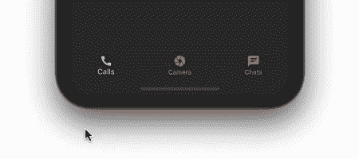

### 移除标签

如果你想完全去掉标签，你可以使用`showSelectedLabels`和`showUnselectedLabels`:

```
BottomNavigationBar(
  iconSize: 40,
  showSelectedLabels: false,
  showUnselectedLabels: false,
  items: const <BottomNavigationBarItem>[
    ...
  ],
)

```

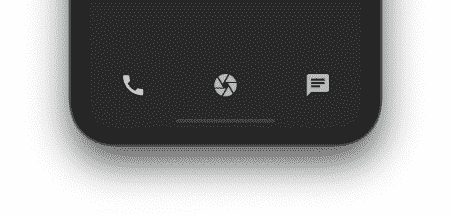

### 突出显示选定的项目

您可以通过将 BottomNavigationBar 类型设置为`BottomNavigationBarType.shifting`来强调所选项目:

```
BottomNavigationBar(
  type: BottomNavigationBarType.shifting,
  selectedFontSize: 20,
  selectedIconTheme: IconThemeData(color: Colors.amberAccent),
  selectedItemColor: Colors.amberAccent,
  selectedLabelStyle: TextStyle(fontWeight: FontWeight.bold),
  items: const <BottomNavigationBarItem>[
    ...
  ],
)

```


## 如何保持页面的状态

尽管 BottomNavigationBar 的基本版本运行良好，但我们有一个问题:无论什么操作——例如，搜索、过滤、输入文本、滚动列表、填写联系人表单等。—从底部导航栏中选择另一个项目时，正在页面上执行的操作将会丢失:


在上面的演示中，我们试图找到一个联系人。当我们在完成搜索之前切换到相机部分，然后返回到聊天部分时，之前输入的文本完全消失了。

不用担心——解决方案非常简单。只需用 [IndexedStack](https://api.flutter.dev/flutter/widgets/IndexedStack-class.html) 替换现有的小部件。IndexedStack 小部件包含一堆小部件，但一次只显示一个。因为所有的小部件都在堆栈中，所以状态被保留。

```
//Before
Center(
  child: _pages.elementAt(_selectedIndex),
)
//After
IndexedStack(
  index: _selectedIndex,
  children: _pages,
)

```

`index`属性用于显示来自`_pages`的一个页面，该页面被赋予 children 属性。

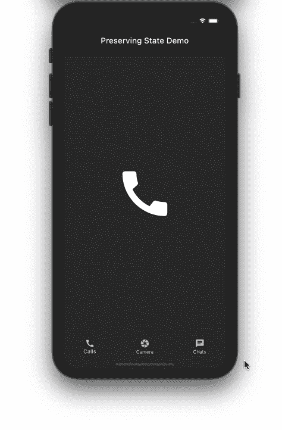

## 如何用 BottomNavigationBar 包含 TabBar

有时，一个页面不足以覆盖 BottomNavigationBar 中父类别中的大量子类别。例如，谷歌 Play 商店应用程序有为你、排行榜、孩子等标记的子类别。像这样的场景需要 [Flutter TabBar 小部件](https://blog.logrocket.com/flutter-tabbar-a-complete-tutorial-with-examples/)。

出于演示的目的，让我们尝试在 calls 部分中添加用于呼入、呼出和未接来电的 TabBar，如下所示:


BottomNavigationBar 的整体结构保持不变。您可能需要为要包含 TabBar 的页面创建一个单独的类。为此，`CallsPage`被创建并添加到页面列表中。

```
static const List<Widget> _pages = <Widget>[
  CallsPage(),
  // Camera page
  // Chats page
];

```

`CallsPage`看起来是这样的:

```
DefaultTabController(
  length: 3,
  child: Scaffold(
    appBar: AppBar(
      flexibleSpace: Column(
        mainAxisAlignment: MainAxisAlignment.end,
        children: [
          TabBar(
            tabs: [
              Tab(
                text: 'Incoming',
              ),
              Tab(
                text: 'Outgoing',
              ),
              Tab(
                text: 'Missed',
              ),
            ],
          )
        ],
      ),
    ),
    body: TabBarView(
      children: [
        IncomingPage(),
        OutgoingPage(),
        MissedPage(),
      ],
    ),
  ),
);

```

以下是输出结果:


构建 Flutter 应用程序时，您总是希望尽可能高效地利用屏幕空间。当用户在应用程序的某个页面上滚动浏览一长串项目时，您可以平滑地隐藏 BottomNavigationBar。这种行为改善了用户体验，因为您只显示了当时需要的内容。

到目前为止，BottomNavigationBar 在滚动呼出列表时保持不变:

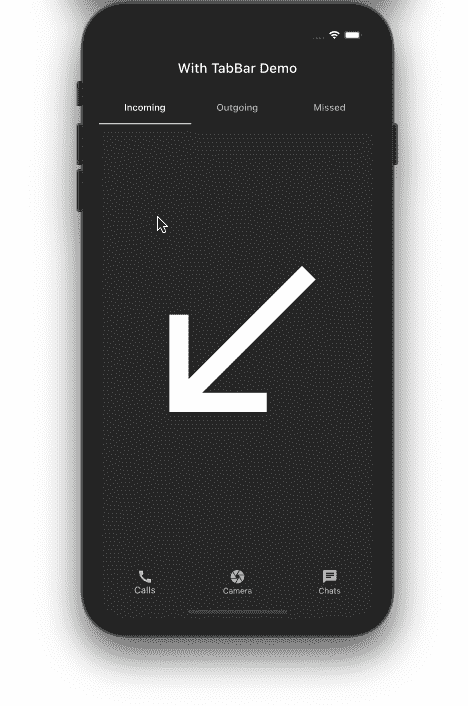

让我们一步步地了解隐藏 BottomNavigationBar 的过程。

首先，将列表视图包装在 [NotificationListener](https://api.flutter.dev/flutter/widgets/NotificationListener-class.html) 小部件中。NotificationListener 侦听 ListView 上发生的滚动通知。

```
NotificationListener<ScrollNotification>(
  onNotification: _handleScrollNotification,
  child: Scaffold(
    body: Center(
      child: ListView.builder(
        itemCount: items.length,
        itemBuilder: (context, index) {
          return ListTile(
            title: Text('${items[index]}'),
          );
        },
      ),
    ),
  ),
);

```

接下来，实现`_handleScrollNotification`方法来确定滚动方向。通知承载 BottomNavigationBar 的页面在用户向下滚动时隐藏它。

```
bool _handleScrollNotification(ScrollNotification notification) {
  if (notification.depth == 0) {
    if (notification is UserScrollNotification) {
      final UserScrollNotification userScroll = notification;
      switch (userScroll.direction) {
        case ScrollDirection.forward:
          widget.isHideBottomNavBar(true);
          break;
        case ScrollDirection.reverse:
          widget.isHideBottomNavBar(false);
          break;
        case ScrollDirection.idle:
          break;
      }
    }
  }
  return false;
}

```

将 BottomNavigationBar 包装在 [SizeTransition](https://api.flutter.dev/flutter/widgets/SizeTransition-class.html) 小部件中。SizeTransition 动画显示 BottomNavigationBar 的大小。

```
AnimationController animationController =
    AnimationController(vsync: this, duration: Duration(milliseconds: 300));
SizeTransition(
  sizeFactor: animationController,
  axisAlignment: -1.0,
  child: BottomNavigationBar(
    items: const <BottomNavigationBarItem>[
      ...
    ],
  ),
)

```

从有[列表视图](https://blog.logrocket.com/creating-listviews-in-flutter/)的页面接收回调时开始隐藏动画。

```
CallsPage(
  isHideBottomNavBar: (isHideBottomNavBar) {
    isHideBottomNavBar
        ? animationController.forward()
        : animationController.reverse();
  },
)

```

结果如下:


就是这样！这个 Flutter BottomNavigationBar 例子的完整代码可以在 [GitHub](https://github.com/pinkeshdarji/flutter_bottom_navigation_bar) 上找到。

## 结论

在本教程中，我们展示了如何集成 BottomNavigationBar 并对其进行定制。我们还学习了各种用例，以及您在开发成熟的 Flutter 应用程序时可能会遇到的示例。我希望我们在本文中研究的实际例子能够帮助您理解这些重要的概念。

## 使用 [LogRocket](https://lp.logrocket.com/blg/signup) 消除传统错误报告的干扰

[](https://lp.logrocket.com/blg/signup)

[LogRocket](https://lp.logrocket.com/blg/signup) 是一个数字体验分析解决方案，它可以保护您免受数百个假阳性错误警报的影响，只针对几个真正重要的项目。LogRocket 会告诉您应用程序中实际影响用户的最具影响力的 bug 和 UX 问题。

然后，使用具有深层技术遥测的会话重放来确切地查看用户看到了什么以及是什么导致了问题，就像你在他们身后看一样。

LogRocket 自动聚合客户端错误、JS 异常、前端性能指标和用户交互。然后 LogRocket 使用机器学习来告诉你哪些问题正在影响大多数用户，并提供你需要修复它的上下文。

关注重要的 bug—[今天就试试 LogRocket】。](https://lp.logrocket.com/blg/signup-issue-free)