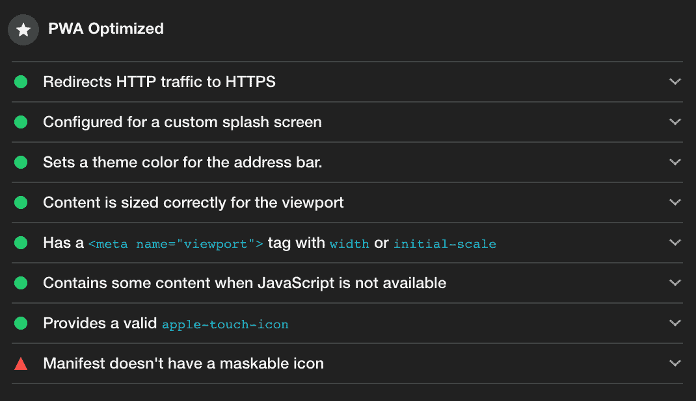

# 如何从你的 Nuxt.js PWA - LogRocket 博客中构建一个 TWA Android 应用程序

> 原文：<https://blog.logrocket.com/how-to-build-a-twa-android-app-out-of-your-nuxt-js-pwa/>

您知道吗，您可以将自己的渐进式网络应用程序(PWA)打包到安卓应用程序中，然后发布到谷歌 Play 商店上。你可以的。这样，移动用户将能够找到并下载它，一切都将像在本地应用程序中一样。就我个人而言，我并没有意识到这一点，直到我看到了 TWA 的缩写，意思是:可信的网络活动。

在最近的一个项目中，我必须用一个 Nuxt.js PWA 构建一个 TWA Android 应用程序。我惊讶地发现这并不像我想象的那么难。我在几个小时内就把我的 PWA 转换成了 APK，并能立即上传到谷歌 Play 商店。

为了帮助你实现同样的事情，我们将在本教程中一步一步地完成这个过程。

最后，你会爱上这种新的环球航空技术的工作方式。

> 通过这个过程，你不需要编写任何 Java 代码来创建你的 Android 应用。此外，为了避免混淆，TWA 不同于你在一些 pwa 上看到的“添加到主页”屏幕按钮。在本教程结束时，您将获得一个 APK 文件，可以随时上传到谷歌 Play 商店。

### 生成您的 Nuxt PWA

> 仅当您使用合法的服务人员时，受信任的 Web 活动才有效。为了简单起见，我们将使用 Nuxt 的官方 PWA 模块，但是你可以自己设置你的 PWA。

您可能已经熟悉如何将 Nuxt 应用程序转换成 PWA。但是如果你不是，这里有一些你应该知道的令人兴奋的事情。如果你的申请已经是 PWA，请直接跳到第二部分。

简而言之，渐进式网络应用使用一系列网络技术，旨在为任何使用浏览器的人(在桌面或移动设备上)提供尽可能原生的体验。您可以让您的应用程序离线可用(通过服务人员)，发送推送通知，更深入地访问智能手机的操作系统，甚至允许移动用户将网站添加到他们的主屏幕上(通过“添加到主页”按钮)。

> PWAs 仅在可信连接上工作，因此请确保您通过 HTTPS 提供您的应用。

但是和往常一样，Nuxt 通过向我们提供官方的 [Nuxt PWA](https://pwa.nuxtjs.org/) 模块，使得将你的应用程序转换成 PWA 变得很容易。

```
npm install @nuxtjs/pwa
```

```
// nuxt.config.js
{
    modules: [
        '@nuxtjs/pwa',
    ],
}
```

该 Nuxt 模块集成了许多子模块，您可以根据需要启用这些子模块:

*   **清单模块**:自动生成强制性的 Web 应用清单，该清单将包含关于您的 PWA 应该如何出现和运行的信息。[阅读文档了解如何定制](https://pwa.nuxtjs.org/manifest)。
*   工具箱模块:注册一个服务工作者(在你的静态文件夹中)，这样你就可以使用工具箱[文档](https://pwa.nuxtjs.org/workbox)让你的应用程序离线可用。简而言之，服务工作者只是一个在后台运行的脚本，它将帮助您管理应用程序发出的网络请求。
*   **OneSignal 模块**:通过 OneSignal [文档](https://github.com/nuxt-community/onesignal-module)帮助您设置免费推送通知。
*   **元模块**:帮助你用零配置[文档](https://pwa.nuxtjs.org/meta)给你的项目添加通用元标签。
*   **图标模块**:自动生成你所有的应用图标和不同大小的 favicon，真是省时。点击这里查看[文档](https://pwa.nuxtjs.org/icon)。

请花几分钟时间浏览每个模块，因为您可能不需要所有模块。

> 令人难以置信的 [web.dev 网站](https://web.dev/)可能包含了改善你的 PWAs 的最佳资源。

### 确保你的 Nuxt PWA 符合所有灯塔要求

TWA 中的网页内容必须符合 Lighthouse 的 PWA 可安装性标准和其他特定于 Android 的标准，如政策合规性。该应用程序还必须快速加载，并达到至少 80 的性能分数。

[Lighthouse 是 Google](https://developers.google.com/web/tools/lighthouse) 制作的开源工具，帮助开发者制作更快更好的网页。简而言之，它运行自动审计，向您展示如何提高应用程序的性能、可访问性、PWA 和 SEO(以及其他一些东西)。

以下是你如何在 Chrome DevTools 中运行 [Lighthouse。](https://developers.google.com/web/tools/lighthouse#devtools)

> 如果你有一个配置项，[你可以通过编程来控制它](https://developers.google.com/web/tools/lighthouse#devtools)以确保你的应用程序总是提供最好的体验。

满足 TWA 要求的所有标准并不难(取决于你的应用)，尤其是当你使用 NUXT PWA 模块时。

我必须解决的唯一问题是丢失的[可屏蔽图像](https://web.dev/maskable-icon/)，这是 Nuxt PWA 模块中的一个问题，[我不是唯一一个面临](https://github.com/nuxt-community/pwa-module/issues/259)的人。



通过在项目中添加一个，以及在 Nuxt 配置清单中添加以下几行代码，我能够快速解决这个问题:

```
manifest: {
    name: 'My app\'s name',
    lang: 'en',
    orientation: 'portrait',
    background_color: '#FFFFFF',
    theme_color: '#F8F8F8'
    theme_color: '#F8F8F8',
    icons: [
        {
            src: '/img/logo/static_maskable_icon.png',
            sizes: '196x196',
            type: 'image/png',
            purpose: 'any maskable'
        }
    ]
}
```

### 使用可信的网络活动，将您的 PWA 转换为 Android 应用程序

可信网络活动(TWA)是一个开放标准，允许浏览器提供一个特殊的容器，在 Android 应用程序中呈现 pwa。在幕后，它使用一个基于[自定义标签](https://developer.chrome.com/multidevice/android/customtabs)的协议，以及一个内置的机制来确保网站和应用程序属于同一个开发者。

请记住，TWA 与 Chrome 共享 cookies(即，如果您在浏览器中登录网站，您也将在应用程序中进行身份验证。)

但是让我们回到 Nuxt。这里有一些更好的消息——也有一个用于此的模块: [nuxt-twa-module](https://github.com/voorhoede/nuxt-twa-module) 。它将为您设置必要的配置，并生成运行应用程序所需的所有文件:

```
npm install nuxt-twa-module --save-dev
```

然后，将此模块添加到您的配置文件中，并填写以下选项:

```
// nuxt.config.js
{
  modules: [
    ['nuxt-twa-module', {
      /* module options */
      defaultUrl: 'https://your-url.com',
      hostName: 'your-url.com',
      applicationId: 'com.example.example',
      launcherName: 'Your app name',
      versionCode: 1,
      versionName: '1.0',
      statusBarColor: /* color */,
      // The sha256Fingerprints by is an array with one SHA-256 key string.
      // But if you have multiple you can add them to the array. More information about the website asociation:
      // https://developer.android.com/training/app-links/verify-site-associations#web-assoc
      sha256Fingerprints: ['/* your SHA-256 keys */'],
      /* optional */
      /* overwrite default location for icon */
      iconPath: '/static/icon.png'
      /* Overwrite folder where to put .wellknown */
      distFolder: '.nuxt/dist/client',
    }],
  ]
}
```

要生成您的 Android 应用程序，您可以运行`npm run build`或`npm run generate`，它会在您的项目根目录下创建一个`android`文件夹，您可以在 Android Studio 中打开它来构建您的应用程序。

### 发布您的 Android TWA 应用程序

您需要一个密钥来签名您的应用程序并将其上传到谷歌 Play 商店。

[本文档将为您提供签署您的应用程序](https://developer.android.com/studio/publish/app-signing)的完整流程。

> 请确保您将此密钥存储在安全的地方，因为您将需要它来进行未来的更新。

要将您的应用程序发布到谷歌 Play 商店，请使用之前在您的`android`文件夹中生成的 APK 文件。前往 [Google Play 控制台](https://play.google.com/apps/publish/signup/)，会有向导欢迎你，并提供一步一步的指导。

通常需要几个小时来审核和批准你的申请。然后，您将能够在 Play store 中看到您的应用程序。

## 结论

就是这样！如果您遵循了一步一步的过程，您将能够将您的 Nuxt 应用程序发布到谷歌 Play 商店。很惊讶，对吧？

如果你想更深入地了解可信网络活动这个主题，[你也可以阅读这篇文章](https://developers.google.com/web/android/trusted-web-activity)。但是说实话，我真的还是觉得很神奇，用最少的代码我们就可以得到我们自己的 Android 应用，而不用学习任何 Java。

如果你需要帮助或者想给这篇文章补充些什么，可以在这篇文章下面评论。你也可以通过 Twitter [@RifkiNada](https://twitter.com/RifkiNada) 联系我。

## 使用 [LogRocket](https://lp.logrocket.com/blg/signup) 消除传统错误报告的干扰

[](https://lp.logrocket.com/blg/signup)

[LogRocket](https://lp.logrocket.com/blg/signup) 是一个数字体验分析解决方案，它可以保护您免受数百个假阳性错误警报的影响，只针对几个真正重要的项目。LogRocket 会告诉您应用程序中实际影响用户的最具影响力的 bug 和 UX 问题。

然后，使用具有深层技术遥测的会话重放来确切地查看用户看到了什么以及是什么导致了问题，就像你在他们身后看一样。

LogRocket 自动聚合客户端错误、JS 异常、前端性能指标和用户交互。然后 LogRocket 使用机器学习来告诉你哪些问题正在影响大多数用户，并提供你需要修复它的上下文。

关注重要的 bug—[今天就试试 LogRocket】。](https://lp.logrocket.com/blg/signup-issue-free)