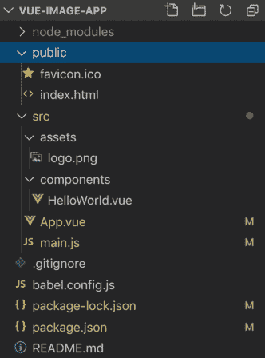

# 如何用 Vue 的 composition API 构建应用程序- LogRocket 博客

> 原文：<https://blog.logrocket.com/how-to-build-applications-with-vues-composition-api/>

Vue 的灵活和轻量级特性使得它非常适合那些想要快速搭建中小型应用程序的开发人员。

然而，在维护不断增长的应用程序时，Vue 当前的 API 有一定的局限性。这是因为 API 通过[组件选项](https://012.vuejs.org/api/options.html) ( Vue 有很多组件选项)而不是逻辑关系来组织代码。

随着更多组件选项的添加和代码库的变大，开发人员可能会发现他们自己与其他团队成员创建的组件进行交互，这就是事情开始变得非常混乱的地方，然后就成为团队改进或更改组件的问题。

幸运的是，Vue 在其最新版本中推出了[组合 API](https://vue-composition-api-rfc.netlify.com/#summary) ，解决了这个问题。据我所知，它是一个基于功能的 API，目的是在组件变大时，方便组件的组合和维护。在这篇博文中，我们将看看 composition API 如何改进我们编写代码的方式，以及我们如何使用它来构建高性能的 web 应用程序。

## 提高代码可维护性和组件重用模式

Vue 2 有两个主要缺点。第一个是**维护大型部件的困难。**

假设我们在一个应用程序中有一个名为`App.vue`的组件，它的工作是处理从一个 API 调用的各种产品的支付。我们最初的步骤是列出适当的数据和函数来处理我们的组件:

```
// App.vue

<script >
import PayButton from "./components/PayButton.vue";

const productKey = "778899";
const API = `https://awesomeproductresources.com/?productkey=${productKey}`;  // not real ;)

export default {
    name: "app",
    components: {
        PayButton
    },
    mounted() {
          fetch(API)
            .then(response => {
                this.productResponse = response.data.listings;
            })
            .catch(error => {
                console.log(error);
            });
    },
    data: function() {
        return {
            discount: discount,
            productResponse: [],
            email: "[email protected]",
            custom: {
                title: "Retail Shop",
                logo: "We are an awesome store!"
            }
        };
    },
   computed: {
    paymentReference() {
              let text = "";
              let possible =
                "ABCDEFGHIJKLMNOPQRSTUVWXYZabcdefghijklmnopqrstuvwxyz0123456789";
              for (let i = 0; i < 10; i++)
                text += possible.charAt(Math.floor(Math.random() * possible.length));
              return text;
          }
        }
      };
</script>
```

在处理导入的组件`payButton`时，`App.vue`所做的就是从 API 中检索数据并将其传递给`data`属性。这看起来并不多，我们至少使用了三个组件选项—`component`、`computed`和`data`以及`[mounted()](https://vuejs.org/v2/api/#mounted)`生命周期挂钩。

将来，我们可能会想给这个组件添加更多的特性。例如，一些功能可以告诉我们某个产品的支付是否成功。为此，我们必须使用`method`组件选项。

添加`method`组件选项只会使组件变得更大、更冗长、更难维护。想象一下，我们有几个这样编写的应用程序组件。这绝对不是开发人员想要使用的理想框架。

Vue 3 对此的修复是一个`setup()`方法，它使我们能够使用复合语法。每一个逻辑都被定义为这个方法之外的一个复合函数。使用组合语法，我们将采用关注点分离方法，首先隔离从我们的 API 调用数据的逻辑:

```
// productApi.js
<script>
import { reactive, watch } from '@vue/composition-api';

const productKey = "778899";

export const useProductApi = () => {
    const state = reactive({
        productResponse: [],
        email: "[email protected]",
        custom: {
            title: "Retail Shop",
            logo: "We are an awesome store!"
        }
    });

    watch(() => {
        const API = `https://awesomeproductresources.com/?productkey=${productKey}`;

        fetch(API)
            .then(response => response.json())
            .then(jsonResponse => {
                state.productResponse = jsonResponse.data.listings;
            })
            .catch(error => {
                console.log(error);
            });
    });

    return state;
};
</script>
```

然后，当我们需要调用`App.vue`中的 API 时，我们将导入`useProductApi`并像这样定义组件的其余部分:

```
// App.vue

<script>
    import { useProductApi } from './ProductApi';
    import PayButton from "./components/PayButton.vue";

export default {
    name: 'app',
    components: {
        PayButton
    },

    setup() {
        const state = useProductApi();

        return {
            state
        }
    }
}

function paymentReference() {
    let text = "";
    let possible =
        "ABCDEFGHIJKLMNOPQRSTUVWXYZabcdefghijklmnopqrstuvwxyz0123456789";
    for (let i = 0; i < 10; i++)
        text += possible.charAt(Math.floor(Math.random() * possible.length));
    return text;
}
</script>
```

值得注意的是，这并不意味着我们的应用程序会有更少的组件，我们仍然会有相同数量的组件，只是它们会使用更少的组件选项，并且更有条理一些。

Vue 2 的第二个缺点是低效的组件重用模式。

重用 Vue 组件中的功能或逻辑的方法是将它放在一个 [mixin](https://vuejs.org/v2/guide/mixins.html) 或[作用域 slot](https://vuejs.org/v2/guide/components-slots.html) 中。假设我们仍然需要为我们的应用程序提供一些可以重用的数据，为了做到这一点，让我们创建一个 mixin 并插入这些数据:

```
<script>
    const storeOwnerMixin = {
        data() {
            return {
                name: 'RC Ugwu',
                subscription: 'Premium'
            }
        }
    }

export default {
    mixins: [storeOwnerMixin]
}
</script>
```

这对于小规模应用来说非常好。但是和第一个缺点一样，整个项目开始变大，我们需要创建更多的 mixins 来处理其他类型的数据。我们可能会遇到一些问题，比如名称冲突和隐式属性添加。composition API 旨在通过让我们在单独的 JavaScript 文件中定义我们需要的任何函数来解决所有这些问题:

```
// storeOwner.js

export default function storeOwner(name, subscription) {
    var object = {
        name: name,
        subscription: subscription
    };
    return object;
}
```

然后导入到我们需要的任何地方，就像这样:

```
<script>
   import storeOwner from './storeOwner.js'
   export default {
     name: 'app',
     setup() {
         const storeOwnerData = storeOwner('RC Ugwu', 'Premium');

         return {
             storeOwnerData
         }
     }
 }
 </script>
```

很明显，我们可以看到它在混音方面的优势。除了使用更少的代码之外，它还让您可以用普通的 JavaScript 更好地表达自己，并且您的代码库更加灵活，因为函数可以更有效地重用。

## Vue 组合 API 与 React 挂钩的比较

尽管 Vue 的 Composition API 和 React Hooks 都是用来处理状态和重用组件中的逻辑的函数集——它们以不同的方式工作。Vue 的`setup`函数在创建组件时只运行一次，而 React 钩子在渲染时可以运行多次。同样对于处理状态，React 只提供了一个钩子-`useState`:

```
import React, { useState } from "react";
const [name, setName] = useState("Mary");
const [subscription, setSubscription] = useState("Premium");
console.log(`Hi ${name}, you are currently on our ${subscription} plan.`);
```

组合 API 有很大的不同，它提供了两个处理状态的函数—`ref`和`reactive`。`ref`返回一个对象，其内部值可以通过其`value`属性访问:

```
const name = ref('RC Ugwu');
const subscription = ref('Premium');
watch(() => {
    console.log(`Hi ${name}, you are currently on our ${subscription} plan.`);
});
```

`reactive`有点不同，它接受一个对象作为它的输入，并返回它的一个反应代理:

```
const state = reactive({
    name: 'RC Ugwu',
    subscription: 'Premium',
});
  watch(() => {
console.log(`Hi ${state.name}, you are currently on our ${state.subscription} plan.`);
});
```

Vue 的 Composition API 在很多方面与 React Hooks 相似，尽管后者目前在社区中显然更受欢迎和支持，看看 Composition 函数是否能赶上 Hooks 将会很有趣。你可能想看看 Guillermo Peralta Scura 的这篇详细的文章,了解更多关于他们如何相互比较的信息。

## 使用组合 API 构建应用程序

为了了解如何进一步使用复合 API，让我们用纯复合函数创建一个图片库。对于数据，我们将使用 [Unsplash 的 API](https://unsplash.com/developers) 。你需要注册并获得一个 API 密匙。我们的第一步是使用 Vue 的 CLI 创建一个项目文件夹:

```
# install Vue's CLI
npm install -g @vue/cli

# create a project folder
vue create vue-image-app

#navigate to the newly created project folder
cd vue-image-app

#install aios for the purpose of handling the API call
npm install axios

#run the app in a developement environment
npm run serve
```

当我们的安装完成时，我们应该有一个类似于下面的项目文件夹:



Vue 的 CLI 还是用 Vue 2，要用 composition API，我们得换个安装。在您的终端中，导航到您的项目文件夹的目录并安装 Vue 的合成插件:

```
npm install @vue/composition-api
```

安装后，我们将它导入到我们的`main.js`文件中:

```
import Vue from 'vue'
import App from './App.vue'
import VueCompositionApi from '@vue/composition-api';

Vue.use(VueCompositionApi);
Vue.config.productionTip = false
new Vue({
  render: h => h(App),
}).$mount('#app')
```

需要注意的是，目前来说，组合 API 只是编写组件的一个不同选项，而不是一次彻底的革新。我们仍然可以像以前一样，使用组件选项、混合和作用域插槽来编写组件。

## 构建我们的组件

对于这个应用程序，我们将有三个组件:

*   `App.vue`:父组件——它处理和收集来自两个子组件——`Photo.vue`和`PhotoApi.js`的数据
*   `PhotoApi.js`:专为处理 API 调用而创建的功能组件
*   `Photo.vue`:子组件，它处理从 API 调用中检索到的每张照片

首先，让我们从 Unsplash API 获取数据。在你的项目的`src`文件夹中，创建一个文件夹`functions`，并在其中创建一个`PhotoApi.js`文件:

```
import { reactive } from "@vue/composition-api";
import axios from "axios";
export const usePhotoApi = () => {
  const state = reactive({
    info: null,
    loading: true,
    errored: false
  });
   const PHOTO_API_URL =
      "https://api.unsplash.com/photos/?client_id=d0ebc52e406b1ac89f78ab30e1f6112338d663ef349501d65fb2f380e4987e9e";
    axios
      .get(PHOTO_API_URL)
      .then(response => {
        state.info = response.data;
      })
      .catch(error => {
        console.log(error);
        state.errored = true;
      })
      .finally(() => (state.loading = false));
  return state;
};
```

在上面的代码示例中，从 Vue 的 composition API 引入了一个新函数—`reactive`。

`reactive`是`Vue.observable()`的长期替代，它包装一个对象并返回该对象可直接访问的属性。

让我们继续创建显示每张照片的组件。在您的`src/components`文件夹中，创建一个文件并将其命名为`Photo.vue`。在该文件中，输入下面的代码示例:

```
<template>
  <div class="photo">
    <h2>{{ photo.user.name }}</h2>
    <div>
      
    </div>
    <p>{{ photo.user.bio }}</p>
  </div>
</template>
<script>
  import { computed } from '@vue/composition-api';
  export default {
    name: "Photo",
    props: ['photo'],
    setup({ photo }) {
      const altText = computed(() => `Hi, my name is ${photo.user.name}`);
      return { altText };
    }
  };
</script>
<style scoped>
p {
  color:#EDF2F4;
}
</style>
```

在上面的代码示例中，`Photo`组件获取要显示的用户照片，并将其显示在用户简历的旁边。对于我们的`alt`字段，我们使用`setup()`和`computed`函数包装并返回变量`photo.user.name`。

最后，让我们创建我们的`App.vue`组件来处理两个子组件。在您的项目文件夹中，导航到`App.vue`,将那里的代码替换为:

```
<template>
  <div class="app">
    <div class="photos">
      <Photo v-for="photo in state.info" :photo="photo" :key="photo[0]" />
    </div>
  </div>
</template>
<script>
  import Photo from './components/Photo.vue';
  import { usePhotoApi } from './functions/photo-api';
  export default {
    name: 'app',
    components: { Photo },
    setup() {
      const state = usePhotoApi();
      return {
        state
      };
    }
  }
</script>
```

在那里，`App.vue`所做的就是使用`Photo`组件显示每张照片，并将应用程序的状态设置为在`PhotoApi.js`中定义的状态。

## 结论

看看组合 API 是如何被接收的将会很有趣。到目前为止，我观察到的它的主要优点之一是它能够为每个组件分离关注点——每个组件只有一个功能要执行。这使得事情非常有条理。以下是我们在文章演示中使用的一些函数:

*   `setup`–控制组件的逻辑。它接收`props`和上下文作为参数
*   `ref`–返回一个反应变量，并触发模板的重新渲染。它的值可以通过改变`value`属性来改变
*   `reactive`–返回一个反应对象。它根据反应变量的变化重新呈现模板。与`ref`不同，它的值可以在不改变`value`属性的情况下改变

你有没有发现其他惊人的方法来实现复合 API？请在下面的评论区分享它们。你可以在 [CodeSandbox](https://codesandbox.io/s/vue-template-x9bqm?fontsize=14) 上查看演示的完整实现。

## 像用户一样体验您的 Vue 应用

调试 Vue.js 应用程序可能会很困难，尤其是当用户会话期间有几十个(如果不是几百个)突变时。如果您对监视和跟踪生产中所有用户的 Vue 突变感兴趣，

[try LogRocket](https://lp.logrocket.com/blg/vue-signup)

.

[](https://lp.logrocket.com/blg/vue-signup)[https://logrocket.com/signup/](https://lp.logrocket.com/blg/vue-signup)

LogRocket 就像是网络和移动应用程序的 DVR，记录你的 Vue 应用程序中发生的一切，包括网络请求、JavaScript 错误、性能问题等等。您可以汇总并报告问题发生时应用程序的状态，而不是猜测问题发生的原因。

LogRocket Vuex 插件将 Vuex 突变记录到 LogRocket 控制台，为您提供导致错误的环境，以及出现问题时应用程序的状态。

现代化您调试 Vue 应用的方式- [开始免费监控](https://lp.logrocket.com/blg/vue-signup)。