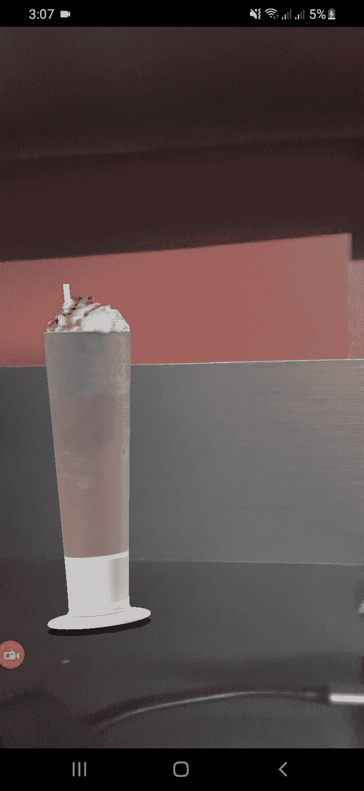
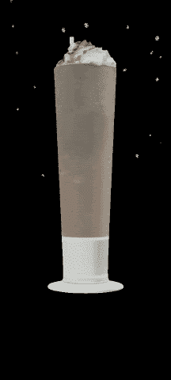

# 如何用 ViroReact - LogRocket 博客搭建 AR/VR app

> 原文：<https://blog.logrocket.com/how-to-build-ar-vr-app-viroreact/>

前端开发最令人兴奋的事情是能够立即交付令人兴奋的东西。我们已经看到对卓越用户体验的需求每天都在增长，开发人员正在很好地满足这些需求。

增强现实(AR)和虚拟现实(VR)是一些增长最快的用户界面。AR 和 VR 技术的应用是无限的，特别是在教育、医学和工程等领域。幸运的是，随着我们的发展，跨平台 AR 体验的开发变得越来越容易。

[ViroReact](https://www.npmjs.com/package/@viro-community/react-viro) 是一个面向想要快速构建 AR 和 VR 体验的开发者的库。它允许代码在所有移动 VR(包括谷歌 Daydream、三星 Gear VR 和谷歌 Cardboard for iOS 和 Android)和 AR (iOS ARKit 和 Android ARCore)平台上原生运行。它建立在 React Native 之上，允许 React 开发人员快速适应这项新技术..

今天，我们正在用 ViroReact 构建一个样本菜单应用程序，它将在“AR 空间”中显示食物，这意味着当用户通过手机摄像头观看时，它们将看起来像是在房间里。

具体来说，当我们的用户关注菜单中的奶昔时，应用程序应该显示带有一些雪花的 3D 奶昔。

## 设置和安装

ViroReact 最初由 [Viro Media](http://www.viromedia.com/) 公司开发，但在 2019 年开源。2020 年末， [Viro 社区](https://virocommunity.github.io/)成立，以帮助维护和推进该项目，更新该项目，使其可以与 React Native 的现代版本一起运行，并能够添加新功能。

在这个演示中，我们将利用 Viro Community 的[初学者工具包来简化事情。您也可以将 ViroReact 集成到您现有的应用程序中。](https://github.com/ViroCommunity/starter-kit)

我们将从以下命令开始:

```
git clone https://github.com/ViroCommunity/starter-kit.git
cd starter-kit
npm install
npx pod-install # (iOS)
npx react-native run-android # or npx react-native run-ios

```

请注意，AR 应用的开发和调试最好在特定设备上完成。你需要一个有增强现实功能的设备。

## 构建 AR 应用程序

让我们通过 ViroReact 使用一些很酷的 AR 元素。这个练习将使我们对 ar 应用程序的动态更加熟悉。

### 预热

作为热身，让我们创建一个带有纹理和一些动画的简单盒子。

代码如下:

```
import React from 'react';  
import {StyleSheet} from 'react-native';
import {
  ViroARScene,
  ViroARSceneNavigator,
  ViroMaterials,
  ViroAnimations,
  ViroBox,
} from '@viro-community/react-viro';

/**
 * Every 3D object will require materials to display texture on body.
 * We have to create all materials before we use them with our elements.
 */
ViroMaterials.createMaterials({
  /**
   * Material in its simplest form is just diffused color
   */
  white: {
    diffuseColor: 'rgba(255,255,255,1)',
  },
  /**
   * We can also diffuse a texture here.
   */
  grid: {
    diffuseTexture: require('./res/grid_bg.jpg'),
  },
});

ViroAnimations.registerAnimations({
  /** To begin with we have added simple rotation animation */
  rotate: {
    properties: {
    rotateY: '+=90',
    },
    duration: 2500, //.25 seconds
  },
});

const BoxTexture = () => {
  const onInitialized = (arSceneState, reason) => {
    console.log(reason);
  };

  return (
    /** ViroARScene will open up AR enabled camera in your scene */
    <ViroARScene onTrackingUpdated={onInitialized}>
    {/**
    * Here us our ViroBox a 3D element with position in AR space
    */}
    <ViroBox
        position={[0, -0.5, -1]}
        animation={{name: 'rotate', run: true, loop: true}} // We have defined our animation at the top;
        scale={[0.3, 0.3, 0.1]}
        materials={['grid']} // We have defined material at the top;
    />
    </ViroARScene>
  );
};

export default () => {
  // All AR scene will reside in ViroARSceneNavigator:
  return (
    <ViroARSceneNavigator
    autofocus={true}
    initialScene={{
        scene: BoxTexture,
    }}
    style={styles.f1}
    />
  );
};

const styles = StyleSheet.create({
  f1: {
    flex: 1,
  },
});

```

这里我们添加了一个`ViroBox`元素，这是一个由宽度、高度和长度定义的 3D 框。我们将盒子放在 3D 空间中，并在上面添加材料。材质和动画是分开定义的。`Box`作为许多 3D 元素的构建模块。

你可以在 ViroReact 文档中阅读关于[盒子](https://docs.viromedia.com/docs/virobox)、[材质](https://docs.viromedia.com/docs/materials#material-prop-types)和[动画](https://docs.viromedia.com/docs/animation)的内容。

## 添加 3D 模型

让我们在基本的 AR 应用程序中添加一些很酷的 3D 模型。

3D 物体不像 2D 图像那样简单；它们通常是定义几何图形的模型(VRX 或 OBJ)文件的网格，加上一些图像来定义嵌入在顶部的纹理。

这是我们的奶昔模型现在的样子:


正如你所看到的，它包括一个对象文件，一个漫反射纹理和一个高光纹理。所有这些组件结合在一起，提供最佳的 3D 体验。

这里我们将使用`Viro3DObject`组件在我们的应用程序中显示一个 3D 模型:

```
ViroMaterials.createMaterials({
  shake: {
    diffuseTexture: require('./res/shake/diffuse.jpg'),
    specularTexture: require('./res/shake/specular.jpg'),
  },
});

...
<Viro3DObject
source={require('./res/shake/geometry.obj')}
position={[0, 0.2, 0]}
scale={[0.2, 0.2, 0.2]}
type="OBJ"
lightReceivingBitMask={3}
shadowCastingBitMask={2}
transformBehaviors={['billboardY']}
resources={[
    require('./res/shake/diffuse.jpg'),
            require('./res/shake/specular.jpg'),
      ]}
materials={['shake']}
/>

```

## 添加平面和阴影

这不仅仅是在空间中放置 3D 物体。最好的体验是当这些物体被嵌入到场景中，就像它们是真实世界的一部分一样。

阴影在使我们的场景更接近真实世界方面起着至关重要的作用。让我们添加一些灯光和平面，这样我们的物体看起来更真实。

以下是我们在场景中包装奶昔模型的方式:

```
<ViroNode
       position={[0, -0.5, -1]}
       dragType="FixedToWorld"
       animation={{name: 'appear', run: true, loop: true}} // We have defined our animation at the top;
       onDrag={() => {}}>
       {/* Spotlight to cast light on the object and a shadow on the surface, see
             the Viro documentation for more info on lights & shadows */}
       <ViroSpotLight
         innerAngle={5}
         outerAngle={45}
         direction={[0, -1, -0.2]}
         position={[0, 3, 0]}
         color="#ffffff"
         castsShadow={true}
         influenceBitMask={4}
         shadowMapSize={2048}
         shadowNearZ={2}
         shadowFarZ={5}
         shadowOpacity={0.7}
       />
       <Viro3DObject
         source={require('./res/shake/geometry.obj')}
         position={[0, 0.01, 0]}
         scale={[0.03, 0.03, 0.03]}
         type="OBJ"
         lightReceivingBitMask={5}
         shadowCastingBitMask={4}
         // transformBehaviors={['billboardY']}
         resources={[
           require('./res/shake/diffuse.jpg'),
           require('./res/shake/specular.jpg'),
         ]}
         materials={['shake']} // We have defined material at the top;
       />
       <ViroQuad
         rotation={[-90, 0, 0]}
         width={0.5}
         height={0.5}
         arShadowReceiver={true}
         lightReceivingBitMask={4}
       />
     </ViroNode>

```

现在我们的奶昔模型被包裹在`ViroNode`中，表现为子场景。在这个节点中，我们有`ViroSpotLight`来给我们的 3D 对象投射光线和阴影。这个影子是由`ViroQuad`接收的。

以下是现在的结果:



## 添加动画

我们的静态场景现在看起来真的很酷，但是我们可以添加一些动画来使事情看起来更真实一些。

之前，我们在盒子上添加了一个简单的动画。基于同样的原则，我们将为奶昔杯添加一点淡入淡出的动画。下面是它的样子:

```
ViroAnimations.registerAnimations({
 appear: {
   properties: {
     opacity: 1,
   },
   duration: 2000,
 },
});

```

## 添加 3D 交互

移动这个玻璃怎么样？让我们通过实现挤压、拖动和旋转在 3D 对象上添加一些交互。

这和处理任何其他 React 交互一样简单；我们将从状态变量中提供对象的比例、位置和旋转，并在回调方法中改变它们。下面是代码的外观:

```
 /*
  Pinch scaling should be relative to its last value *not* the absolute value of the
  scale factor. So while the pinching is ongoing set scale through setNativeProps
  and multiply the state by that factor. At the end of a pinch event, set the state
  to the final value and store it in state.
  */
 const _onPinch = useCallback(
   (pinchState, scaleFactor, source) => {
     console.log('_onPinch');
     var newScale = scale.map(x => {
       return x * scaleFactor;
     });

     if (pinchState === 3) {
       setScale(newScale);
       return;
     }
     arNodeRef.current.setNativeProps({scale: newScale});
     spotLightRef.current.setNativeProps({shadowFarZ: 6 * newScale[0]});
   },
   [scale],
 );

```

## 添加粒子

让我们让我们的环境更加优雅。使用 ViroReact，我们可以创建一些很酷的粒子发射器，使我们的奶昔看起来更令人惊叹。

下面是如何做到这一点:

```
<ViroParticleEmitter
       position={[0, 4.5, 0]}
       duration={2000}
       visible={true}
       delay={0}
       run
       loop={true}
       fixedToEmitter={true}
       image={{
         source: require('./res/particle_snow.png'),
         height: 0.01,
         width: 0.01,
         bloomThreshold: 1.0,
       }}
       spawnBehavior={{
         particleLifetime: [5000, 5000],
         emissionRatePerSecond: [snowSpawnRate, snowSpawnRate],
         spawnVolume: {
           shape: 'box',
           params: [20, 1, 20],
           spawnOnSurface: false,
         },
         maxParticles: 2000,
       }}
       particleAppearance={{
         opacity: {
           initialRange: [0, 0],
           factor: 'Time',
           interpolation: [
             {endValue: 1.0, interval: [0, 500]},
             {endValue: 0.0, interval: [4000, 5000]},
           ],
         },
         rotation: {
           initialRange: [0, 360],
           factor: 'Time',
           interpolation: [{endValue: 1080, interval: [0, 5000]}],
         },
         scale: {
           initialRange: [
             [5, 5, 5],
             [10, 10, 10],
           ],
           factor: 'Time',
           interpolation: [
             {endValue: [6, 6, 6], interval: [0, 1000]},
             {endValue: [10, 10, 10], interval: [3000, 5000]},
             {endValue: [5, 5, 5], interval: [4000, 5000]},
           ],
         },
       }}
       particlePhysics={{
         velocity: {
           initialRange: [
             [-2 * windShear, -0.5, 0],
             [2 * windShear, -3.0 * fallSpeed, 0],
           ],
         },
       }}
     />

```

在这段代码中，我们利用了`ViroParticleEmitter`，它将一个简单的 png 图像显示为一个粒子，并带有一些参数来控制发射频率和粒子在屏幕上停留的时间。

结果如下:



## 添加图像识别

现在是施展魔法的时候了。通过 ViroReact，我们可以将图像识别(IR)结合到我们的 AR 体验中。正如我们的要求所提到的，只有当我们的用户将相机指向我们菜单上的奶昔照片时，奶昔才会出现在屏幕上。

我们将添加`ViroARImageMarker`来处理 ViroReact 中的所有 IR 内容。下面是我们的代码看起来的样子:

首先，就像动画和材料一样，我们必须注册我们的 IR 目标:

```
ViroARTrackingTargets.createTargets({
 shake: {
   source: require('./res/shake.png'),
   orientation: 'Up',
   physicalWidth: 0.05, // real world width in meters
 },
});

<ViroARImageMarker
       target={'shake'}
       onAnchorFound={() =>
         setAnchorFound(true)
       }
>
...
</ViroARImageMarker

```

如您所见，`ViroARImageMarker`采用了一个注册了 ViroReact 的目标。目标只是我们想要识别的物体的 png 图像。当摄像机指向目标时，我们开始展示我们的场景。

## 下一步是什么？

想象力从未停止，我们传递奇妙体验的渴望也是如此。有了 ViroReact 这样的工具，创造最佳 AR 体验比以往任何时候都更容易。请在评论中告诉我你用 ViroReact 创造了多么棒的东西。

## [LogRocket](https://lp.logrocket.com/blg/react-native-signup) :即时重现 React 原生应用中的问题。

[](https://lp.logrocket.com/blg/react-native-signup)

[LogRocket](https://lp.logrocket.com/blg/react-native-signup) 是一款 React 原生监控解决方案，可帮助您即时重现问题、确定 bug 的优先级并了解 React 原生应用的性能。

LogRocket 还可以向你展示用户是如何与你的应用程序互动的，从而帮助你提高转化率和产品使用率。LogRocket 的产品分析功能揭示了用户不完成特定流程或不采用新功能的原因。

开始主动监控您的 React 原生应用— [免费试用 LogRocket】。](https://lp.logrocket.com/blg/react-native-signup)