# 如何用 Firebase - LogRocket Blog 在 Flutter 中构建一个聊天应用程序

> 原文：<https://blog.logrocket.com/how-to-build-chat-application-flutter-firebase/>

今天，我们将用 Firebase 在 Flutter 中创建一个简单而复杂的聊天应用程序。我们的主要重点是运行应用程序，并将其与云 Firestore、Firebase Storage 和 Firebase Authentication 等 Firebase 服务相连接。

我们将在文章中涉及什么？

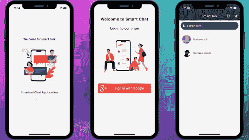

We will understand the basic functionality of a chat application so that enthusiasts like you and me can learn from it. Of course, this demo app is not as complex as WhatsApp or Telegram, but after reading this article, you will understand how other famous chat applications work.

## 创建新的 Flutter 应用程序

Android Studio 已经更新为 Bumblebee，现在它的主屏幕上非常丰富多彩。只需点击**新建颤振项目**按钮，就会确认颤振 SDK 路径；点击**下一个**。

然后，输入您想要的项目名称——确保用小写字母。正确选择您的目录，并确保您已经选择了所有想要的平台，如 Android、iOS 和 web。

完成后，您将拥有自己的 Flutter starter 项目，即众所周知的计数器应用程序。

## 连接到 Firebase 服务(新的和更新的方法)

如果您计划使用 Firebase 作为您的后端，我建议在对您的应用程序进行任何进一步编程之前，将您的项目连接到 Firebase。

去[firebase.google.com](https://firebase.google.com)创建一个新的 Firebase 项目。输入你的项目名称，暂时禁用谷歌分析，点击**创建项目**按钮。

根据 [Flutter Fire](https://firebase.flutter.dev/docs/overview/) 文档，你现在可以直接从 Dart 初始化 Firebase。很直白，所以为颤振队干杯。

在终端窗口中从项目的根目录运行以下命令，添加 Firebase 核心插件:

```
flutter pub add firebase_core
```

接下来，您必须运行 FlutterFire CLI 命令，这取决于 [Firebase CLI](https://firebase.google.com/docs/cli) 命令。如果您不熟悉 Firebase CLI 命令，请通读此[文档](https://firebase.google.com/docs/cli)以理解并将其安装在您的系统上。

运行以下命令激活 FlutterFire CLI:

```
dart pub global activate flutterfire_cli
```

接下来，运行这个命令并选择您刚刚创建的 Firebase 项目:

```
flutterfire configure
```

在运行这个命令并连接到 Firebase 项目之后，您将会看到已经在项目结构中创建了`firebase_options.dart`文件，其中包含了所有必要的信息。

*注意，现在你不再需要手动将`google-services.json`文件添加到 Android，将`GoogleService-Info.plist`* *文件添加到 iOS runner 目录。*

在你的`main.dart`文件中，你需要编辑`main()`函数并确保`WidgetFlutterBinding`被初始化，然后像这样初始化 Firebase:

```
void main() async {
  WidgetsFlutterBinding.ensureInitialized();
  await Firebase.initializeApp(
    options: DefaultFirebaseOptions.currentPlatform,
  );
  runApp(MyApp());
}
```

初始化之后，你就可以使用 Flutter Fire 及其所有服务了。

由于我们将使用 Google 登录我们的聊天应用程序，Firebase 需要 SHA-1 和 SHA-256 证书添加到 Firebase 项目中的 Android 应用程序。同样，你可以浏览这个[文档](https://developers.google.com/android/guides/client-auth)来阅读所有相关内容。

在 Android Studio 中，右键点击 **/gradlew** ，用终端打开。然后运行以下命令:

```
./gradlew signingReport
```

这样，就会为您的应用程序生成签名报告。复制 SHA-1 和 SHA-256 的证书指纹，并将它们添加到 Firebase 项目的项目设置中，在 Android 应用程序下。

在 Firebase 项目中，点击**认证**选项卡，点击**登录方式**，在**登录提供商**下，添加 **Google** 。


在**测试模式**下点击 **Firestore 数据库**和**创建数据库**。

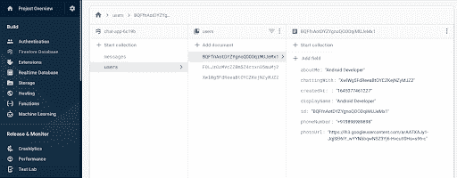

这是可选的，但建议这样做:为了提高 iOS 和 Mac 的构建时间，将这一行添加到您的 iOS/pod 文件中的 Runner:

`pod 'FirebaseFirestore', :git => 'https://github.com/invertase/firestore-ios-sdk-frameworks.git', :tag => '8.11.0'`

*注意，这里假设您的系统上安装了 CocoaPods。*

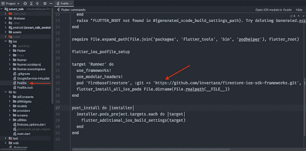

在**测试模式**下，点击 **Firebase 存储器**和**创建新存储器**。

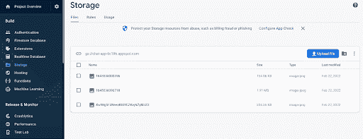

进入 Firebase 项目设置，点击**苹果应用**，下载`GoogleServices-Info.plist`文件。

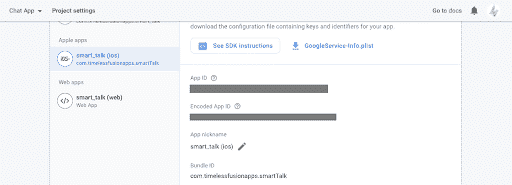

我知道我之前提到过，你不需要将 GoogleServices 文件添加到 iOS 应用程序中。但是，由于我们将使用谷歌登录包，在[的 pub.dev](https://pub.dev/packages/google_sign_in) 网站上的 iOS 集成文档另有说明。您必须在`ios/Runner/Info.plist`文件中添加下面给出的`CFBundleURLTypes`属性:

```
!-- Put me in the [my_project]/ios/Runner/Info.plist file -->
<!-- Google Sign-in Section -->
<key>CFBundleURLTypes</key>
<array>
    <dict>
        <key>CFBundleTypeRole</key>
        <string>Editor</string>
        <key>CFBundleURLSchemes</key>
        <array>
            <!-- TODO Replace this value: -->
            <!-- Copied from GoogleService-Info.plist key REVERSED_CLIENT_ID -->
            <string>com.googleusercontent.apps.861823949799-vc35cprkp249096uujjn0vvnmcvjppkn</string>
        </array>
    </dict>
</array>
<!-- End of the Google Sign-in Section -->
```

现在，您已经成功地用 Firebase 配置了您的 Android 和 iOS 应用程序。我们正在创建一个 Flutter 聊天应用程序，但是需要特定于平台的集成才能让 Google Sign-In 正常工作。

在将我们完成的应用程序上传到 Firebase Hosting 之前，让我们讨论一下 web 集成。

## 构建聊天应用程序的基本 UI

我们总共有五个屏幕，按顺序排列如下。

*   闪屏页面
    *   登录页面
        1.  主页
        2.  配置文件页面(设置屏幕)
        3.  聊天页面
        4.  我不会对每个屏幕进行过多的描述，因为这并不重要。因此，我将对每个屏幕进行概述。
        5.  启动页面:它有两个文本部件，中间有一个图像

**登录页面:**两个文本小部件，一个图像和一个谷歌登录按钮

**主页:** Scaffold，AppBar 带有两个动作按钮，分别用于个人资料页面和注销。它有一个搜索栏用于搜索用户。ListTile 由用户名和谷歌个人资料图片组成

**个人资料页面:**在这里，用户可以更改自己的显示名称，并添加一些自己的详细信息。同时，上传他们自己的照片

**聊天页面:**与大多数著名聊天应用程序非常相似的屏幕。屏幕顶部的消息部分和屏幕底部的带有图像和发送按钮的文本栏

现在，让我们开始编写应用程序。我将只发布应用程序代码的重要部分，其余部分可以在 GitHub 存储库中找到，在本文的后续部分我会留下链接。

在`pubspec.yaml`文件中添加所需的依赖关系

请在 pub.dev 网站上查看最新版本。

### 取消对资产的注释，以将图像添加到应用程序的资产中:

```
firebase_core: ^1.12.0
firebase_auth: ^3.3.7
cloud_firestore: ^3.1.8
firebase_storage: ^10.2.7
google_sign_in: ^5.2.4
fluttertoast: ^8.0.8
image_picker: ^0.8.4+9
shared_preferences: ^2.0.13
intl: ^0.17.0
photo_view: ^0.13.0
provider: ^6.0.2
country_code_picker: ^2.0.2
url_launcher: ^6.0.20
equatable: ^2.0.3
google_sign_in_web: ^0.10.0+5

```

`- assets/images/`

使用 Firebase 身份验证构建登录页面

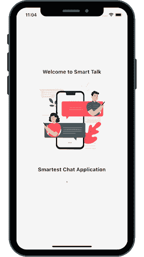

### 第一步:`ChatUser`模型

在我们进入认证部分之前，我们需要一个用户模型类。我把它命名为`[ChatUser](https://github.com/timelessfusionapps/smart_talk/blob/main/lib/models/chat_user.dart)`，它有五个字符串变量:`id`、`photoURL`、`displayName`、`phoneNumber`和`aboutMe`。

#### 我们的`ChatUser`类`toJson()`中的两个函数由一个`Map`和一个工厂方法组成，用于从 Firebase Firestore 返回的快照中读取数据:

第二步:`AuthProvider`类

接下来，我们将在项目中添加一个`[AuthProvider class](https://github.com/timelessfusionapps/smart_talk/blob/main/lib/providers/auth_provider.dart)`来处理 Google 的登录和注销方法。这也是为了检查用户是否登录:

```
class ChatUser extends Equatable {
 final String id;
 final String photoUrl;
 final String displayName;
 final String phoneNumber;
 final String aboutMe;

 const ChatUser(
     {required this.id,
     required this.photoUrl,
     required this.displayName,
     required this.phoneNumber,
     required this.aboutMe});
```

#### 第三步:启动页面

我们将创建[闪屏页面](https://github.com/timelessfusionapps/smart_talk/blob/main/lib/screens/splash_page.dart)，并检查用户是否使用来自`authProvider`类的方法登录。

```
class AuthProvider extends ChangeNotifier {
 final GoogleSignIn googleSignIn;
 final FirebaseAuth firebaseAuth;
 final FirebaseFirestore firebaseFirestore;
 final SharedPreferences prefs;

 Status _status = Status.uninitialized;

 Status get status => _status;

 AuthProvider(
     {required this.googleSignIn,
     required this.firebaseAuth,
     required this.firebaseFirestore,
     required this.prefs});

 String? getFirebaseUserId() {
   return prefs.getString(FirestoreConstants.id);
 }

 Future<bool> isLoggedIn() async {
   bool isLoggedIn = await googleSignIn.isSignedIn();
   if (isLoggedIn &&
       prefs.getString(FirestoreConstants.id)?.isNotEmpty == true) {
     return true;
   } else {
     return false;
   }
 }

 Future<bool> handleGoogleSignIn() async {
   _status = Status.authenticating;
   notifyListeners();

   GoogleSignInAccount? googleUser = await googleSignIn.signIn();
   if (googleUser != null) {
     GoogleSignInAuthentication? googleAuth = await googleUser.authentication;
     final AuthCredential credential = GoogleAuthProvider.credential(
       accessToken: googleAuth.accessToken,
       idToken: googleAuth.idToken,
     );

     User? firebaseUser =
         (await firebaseAuth.signInWithCredential(credential)).user;

     if (firebaseUser != null) {
       final QuerySnapshot result = await firebaseFirestore
           .collection(FirestoreConstants.pathUserCollection)
           .where(FirestoreConstants.id, isEqualTo: firebaseUser.uid)
           .get();
       final List<DocumentSnapshot> document = result.docs;
       if (document.isEmpty) {
         firebaseFirestore
             .collection(FirestoreConstants.pathUserCollection)
             .doc(firebaseUser.uid)
             .set({
           FirestoreConstants.displayName: firebaseUser.displayName,
           FirestoreConstants.photoUrl: firebaseUser.photoURL,
           FirestoreConstants.id: firebaseUser.uid,
           "createdAt: ": DateTime.now().millisecondsSinceEpoch.toString(),
           FirestoreConstants.chattingWith: null
         });}
```

#### 如果用户已经使用 Google 登录方法登录，用户将被重定向到主页。否则，用户将被定向到登录页面。

第 4 步:登录页面

接下来，我们现在将创建我们的[登录页面](https://github.com/timelessfusionapps/smart_talk/blob/main/lib/screens/login_page.dart)。

#### 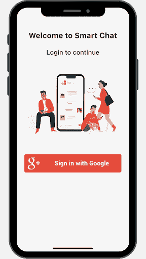

由于我们在应用程序中使用了提供者状态管理，我们将创建一个`authProvider`的实例，如下所示:

接下来，我们将检查我们的应用程序的状态，如果它已经过身份验证:

第五步:登录功能

```
final authProvider = Provider.of<AuthProvider>(context);
```

我们现在将把我们的 Google 登录方法添加到 Google 登录按钮的`onTap`函数中:

```
class _LoginPageState extends State<LoginPage> {
 @override
 Widget build(BuildContext context) {
   final authProvider = Provider.of<AuthProvider>(context);

   switch (authProvider.status) {
     case Status.authenticateError:
       Fluttertoast.showToast(msg: 'Sign in failed');
       break;
     case Status.authenticateCanceled:
       Fluttertoast.showToast(msg: 'Sign in cancelled');
       break;
     case Status.authenticated:
       Fluttertoast.showToast(msg: 'Sign in successful');
       break;
     default:
       break;
   }
```

#### 创建包含用户联系人的主页

这个类包含两个函数:

```
GestureDetector(
 onTap: () async {
   bool isSuccess = await authProvider.handleGoogleSignIn();
   if (isSuccess) {
     Navigator.pushReplacement(
         context,
         MaterialPageRoute(
             builder: (context) => const HomePage()));
   }
 },
 child: Image.asset('assets/images/google_login.jpg'),
),
```

### 要更新云 Firestore 数据库上的数据:

要从云 Firestore 数据库接收数据快照:

主页分为三个部分。

```
Future<void> updateFirestoreData(
   String collectionPath, String path, Map<String, dynamic> updateData) {
 return firebaseFirestore
     .collection(collectionPath)
     .doc(path)
     .update(updateData);
}
```

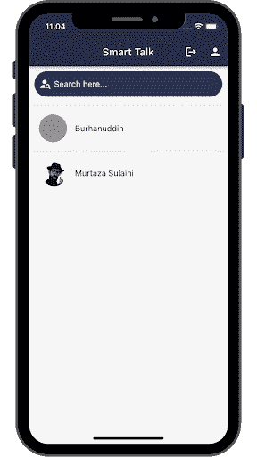

```
Stream<QuerySnapshot> getFirestoreData(
   String collectionPath, int limit, String? textSearch) {
 if (textSearch?.isNotEmpty == true) {
   return firebaseFirestore
       .collection(collectionPath)
       .limit(limit)
       .where(FirestoreConstants.displayName, isEqualTo: textSearch)
       .snapshots();
 } else {
   return firebaseFirestore
       .collection(collectionPath)
       .limit(limit)
       .snapshots();
 }
}
```

*   app bar——由两个按钮组成，注销按钮和个人资料页面按钮:

    ```
    Scaffold(    appBar: AppBar(        centerTitle: true,        title: const Text('Smart Talk'),        actions: [          IconButton(              onPressed: () => googleSignOut(),              icon: const Icon(Icons.logout)),          IconButton(              onPressed: () {                Navigator.push(                    context,                    MaterialPageRoute(                        builder: (context) => const ProfilePage()));              },              icon: const Icon(Icons.person)),        ]),);
    ```

    *   搜索栏—用于搜索应用程序中已登录的用户。如果您有一个很长的用户列表，它会派上用场。我们将使用一个`StreamBuilder`来构建我们的搜索栏，如下所示:

        ```
        Widget buildSearchBar() {  return Container(    margin: const EdgeInsets.all(Sizes.dimen_10),    height: Sizes.dimen_50,    child: Row(      crossAxisAlignment: CrossAxisAlignment.center,      children: [        const SizedBox(          width: Sizes.dimen_10,        ),        const Icon(          Icons.person_search,          color: AppColors.white,          size: Sizes.dimen_24,        ),        const SizedBox(          width: 5,        ),        Expanded(          child: TextFormField(            textInputAction: TextInputAction.search,            controller: searchTextEditingController,            onChanged: (value) {              if (value.isNotEmpty) {                buttonClearController.add(true);                setState(() {                  _textSearch = value;                });              } else {                buttonClearController.add(false);                setState(() {                  _textSearch = "";                });              }            },            decoration: const InputDecoration.collapsed(              hintText: 'Search here...',              hintStyle: TextStyle(color: AppColors.white),            ),          ),        ),        StreamBuilder(            stream: buttonClearController.stream,            builder: (context, snapshot) {              return snapshot.data == true                  ? GestureDetector(                      onTap: () {                        searchTextEditingController.clear();                        buttonClearController.add(false);                        setState(() {                          _textSearch = '';                        });                      },                      child: const Icon(                        Icons.clear_rounded,                        color: AppColors.greyColor,                        size: 20,                      ),                    )                  : const SizedBox.shrink();            })      ],    ),    decoration: BoxDecoration(      borderRadius: BorderRadius.circular(Sizes.dimen_30),      color: AppColors.spaceLight,    ),  ); }
        ```

        1.  用户—使用`StreamBuilder`，我们将在这里显示所有登录的用户。使用`ListView`独立构建器方法中的 ListTile 小部件，我们显示用户的个人资料图像和用户名:

            ```
            Widget buildItem(BuildContext context, DocumentSnapshot? documentSnapshot) {  final firebaseAuth = FirebaseAuth.instance;  if (documentSnapshot != null) {    ChatUser userChat = ChatUser.fromDocument(documentSnapshot);    if (userChat.id == currentUserId) {      return const SizedBox.shrink();    } else {      return TextButton(        onPressed: () {          if (KeyboardUtils.isKeyboardShowing()) {            KeyboardUtils.closeKeyboard(context);          }          Navigator.push(              context,              MaterialPageRoute(                  builder: (context) => ChatPage(                        peerId: userChat.id,                        peerAvatar: userChat.photoUrl,                        peerNickname: userChat.displayName,                        userAvatar: firebaseAuth.currentUser!.photoURL!,                      )));        },        child: ListTile(          leading: userChat.photoUrl.isNotEmpty              ? ClipRRect(                  borderRadius: BorderRadius.circular(Sizes.dimen_30),                  child: Image.network(                    userChat.photoUrl,                    fit: BoxFit.cover,                    width: 50,                    height: 50,                    loadingBuilder: (BuildContext ctx, Widget child,                        ImageChunkEvent? loadingProgress) {                      if (loadingProgress == null) {                        return child;                      } else {                        return SizedBox(                          width: 50,                          height: 50,                          child: CircularProgressIndicator(                              color: Colors.grey,                              value: loadingProgress.expectedTotalBytes !=                                      null                                  ? loadingProgress.cumulativeBytesLoaded /                                      loadingProgress.expectedTotalBytes!                                  : null),                        );                      }                    },                    errorBuilder: (context, object, stackTrace) {                      return const Icon(Icons.account_circle, size: 50);                    },                  ),                )              : const Icon(                  Icons.account_circle,                  size: 50,                ),          title: Text(            userChat.displayName,            style: const TextStyle(color: Colors.black),          ),        ),      );    }  } else {    return const SizedBox.shrink();  } }
            ```

        2.  制作更新 firebase firestorm 信息的个人资料页面
        3.  在这里，用户可以更改他们的显示名称，写一些关于他们自己的东西，并添加他们的联系信息。

### 在输入手机号码之前，有三个文本字段和一个下拉列表可供选择国家代码。接下来，用户点击个人资料图片，并选择另一个来替换它，然后有一个按钮来更新 Firebase Firestore 数据库中的信息。我们开始吧。

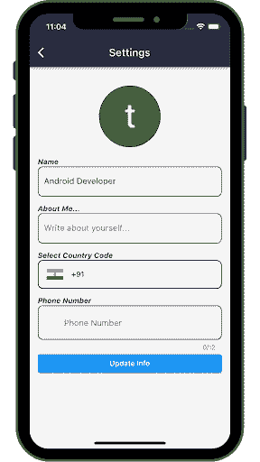

第一步:`ProfileProvider`上课

我们将在项目结构中添加另一个类，并将其命名为`[ProfileProvider](https://github.com/timelessfusionapps/smart_talk/blob/main/lib/providers/profile_provider.dart)`。这个类中有两个主要的函数。

#### 要将映像文件上传到 Firebase 存储:

要将有关用户的更新信息上传到 Firestore 数据库:

第 2 步:个人资料页面

```
UploadTask uploadImageFile(File image, String fileName) {
 Reference reference = firebaseStorage.ref().child(fileName);
 UploadTask uploadTask = reference.putFile(image);
 return uploadTask;
}
```

这个`[ProfilePage](https://github.com/timelessfusionapps/smart_talk/blob/main/lib/screens/profile_page.dart)`有状态小部件中有三个主要方法。

```
Future<void> updateFirestoreData(String collectionPath, String path,
   Map<String, dynamic> dataUpdateNeeded) {
 return firebaseFirestore
     .collection(collectionPath)
     .doc(path)
     .update(dataUpdateNeeded);
}
```

*   从设备中拾取图片并将其设置为个人资料图片的图像拾取方法:

    ```
    Future getImage() async {  ImagePicker imagePicker = ImagePicker();  // PickedFile is not supported  // Now use XFile?  XFile? pickedFile = await imagePicker      .pickImage(source: ImageSource.gallery)      .catchError((onError) {    Fluttertoast.showToast(msg: onError.toString())  });  File? image;  if (pickedFile != null) {    image = File(pickedFile.path);  }  if (image != null) {    setState(() {      avatarImageFile = image;      isLoading = true;    });    uploadFile();  } }
    ```

    *   将照片上传到 Firebase 存储器，并将其照片 URL 信息保存到 Firestore 数据库的**用户信息** :

        ```
        Future uploadFile() async {  String fileName = id;  UploadTask uploadTask = profileProvider.uploadImageFile(avatarImageFile!, fileName);  try {    TaskSnapshot snapshot = await uploadTask;    photoUrl = await snapshot.ref.getDownloadURL();    ChatUser updateInfo = ChatUser(id: id,        photoUrl: photoUrl,        displayName: displayName,        phoneNumber: phoneNumber,        aboutMe: aboutMe);    profileProvider.updateFirestoreData(        FirestoreConstants.pathUserCollection, id, updateInfo.toJson())        .then((value) async {      await profileProvider.setPrefs(FirestoreConstants.photoUrl, photoUrl);      setState(() {        isLoading = false;      });    });  } on FirebaseException catch (e) {    setState(() {      isLoading = false;    });    Fluttertoast.showToast(msg: e.toString());  } }
        ```

        下
        1.  上传数据到 Firestore 数据库，更新**用户信息** :

            ```
            void updateFirestoreData() {  focusNodeNickname.unfocus();  setState(() {    isLoading = true;    if (dialCodeDigits != "+00" && _phoneController.text != "") {      phoneNumber = dialCodeDigits + _phoneController.text.toString();    }  });  ChatUser updateInfo = ChatUser(id: id,      photoUrl: photoUrl,      displayName: displayName,      phoneNumber: phoneNumber,      aboutMe: aboutMe);  profileProvider.updateFirestoreData(      FirestoreConstants.pathUserCollection, id, updateInfo.toJson())      .then((value) async {    await profileProvider.setPrefs(        FirestoreConstants.displayName, displayName);    await profileProvider.setPrefs(        FirestoreConstants.phoneNumber, phoneNumber);    await profileProvider.setPrefs(      FirestoreConstants.photoUrl, photoUrl,);    await profileProvider.setPrefs(        FirestoreConstants.aboutMe,aboutMe );     setState(() {      isLoading = false;    });    Fluttertoast.showToast(msg: 'UpdateSuccess');  }).catchError((onError) {    Fluttertoast.showToast(msg: onError.toString());  }); }
            ```

            下的数据
        2.  构建聊天消息页面
        3.  让我们一步一步地讨论聊天页面的功能，以便更好地理解这个部分是如何工作的。

### 步骤 1: ChatMessage 模型类

首先，我们将为`[ChatMessages](https://github.com/timelessfusionapps/smart_talk/blob/main/lib/models/chat_messages.dart)`创建一个新的模型类，由四个字符串变量组成:`idFrom`、`idTo`、`timestamp`、`content`和一个`integer`类型。然后，类似于我们的`ChatUser`模型，我们将向 Json 添加两个函数，由一个`Map`和一个从 Firestore 数据库返回`DocumentSnapshot`的`factory`方法组成。这就是我们的模型课:

#### 第二步:`ChatProvider`上课

在我们的`[ChatProvider class](https://github.com/timelessfusionapps/smart_talk/blob/main/lib/providers/chat_provider.dart)`中有四个主要的方法来发送和接收文本消息和图像。

```
class ChatMessages {
 String idFrom;
 String idTo;
 String timestamp;
 String content;
 int type;

 ChatMessages(
     {required this.idFrom,
     required this.idTo,
     required this.timestamp,
     required this.content,
     required this.type});

 Map<String, dynamic> toJson() {
   return {
     FirestoreConstants.idFrom: idFrom,
     FirestoreConstants.idTo: idTo,
     FirestoreConstants.timestamp: timestamp,
     FirestoreConstants.content: content,
     FirestoreConstants.type: type,
   };
 }

 factory ChatMessages.fromDocument(DocumentSnapshot documentSnapshot) {
   String idFrom = documentSnapshot.get(FirestoreConstants.idFrom);
   String idTo = documentSnapshot.get(FirestoreConstants.idTo);
   String timestamp = documentSnapshot.get(FirestoreConstants.timestamp);
   String content = documentSnapshot.get(FirestoreConstants.content);
   int type = documentSnapshot.get(FirestoreConstants.type);

   return ChatMessages(
       idFrom: idFrom,
       idTo: idTo,
       timestamp: timestamp,
       content: content,
       type: type);
 }
}
```

*   将图像文件上传到 Firebase 存储器:

    ```
    UploadTask uploadImageFile(File image, String filename) {  Reference reference = firebaseStorage.ref().child(filename);  UploadTask uploadTask = reference.putFile(image);  return uploadTask; }
    ```

    *   更新 Firestore 数据库中与将要相互聊天的用户 id 相关的信息:

        ```
        Future<void> updateFirestoreData(    String collectionPath, String docPath, Map<String, dynamic> dataUpdate) {  return firebaseFirestore      .collection(collectionPath)      .doc(docPath)      .update(dataUpdate); }
        ```

        1.  当用户彼此聊天时，从 Firestore 数据库获取聊天消息流:

            ```
            Stream<QuerySnapshot> getChatMessage(String groupChatId, int limit) {  return firebaseFirestore      .collection(FirestoreConstants.pathMessageCollection)      .doc(groupChatId)      .collection(groupChatId)      .orderBy(FirestoreConstants.timestamp, descending: true)      .limit(limit)      .snapshots(); }
            ```

        2.  借助 Firestore 数据库向其他用户发送消息并将这些消息保存在其中:

            ```
            void sendChatMessage(String content, int type, String groupChatId,    String currentUserId, String peerId) {  DocumentReference documentReference = firebaseFirestore      .collection(FirestoreConstants.pathMessageCollection)      .doc(groupChatId)      .collection(groupChatId)      .doc(DateTime.now().millisecondsSinceEpoch.toString());  ChatMessages chatMessages = ChatMessages(      idFrom: currentUserId,      idTo: peerId,      timestamp: DateTime.now().millisecondsSinceEpoch.toString(),      content: content,      type: type);   FirebaseFirestore.instance.runTransaction((transaction) async {    transaction.set(documentReference, chatMessages.toJson());  }); }
            ```

        3.  首先，我们需要创建两个方法来检查:

*   聊天信息已发送:

    ```
    // checking if sent message bool isMessageSent(int index) {  if ((index > 0 &&          listMessages[index - 1].get(FirestoreConstants.idFrom) !=              currentUserId) ||  index == 0) {    return true;  } else {    return false;  } }
    ```

    *   收到聊天信息:

        ```
        // checking if received message bool isMessageReceived(int index) {  if ((index > 0 &&          listMessages[index - 1].get(FirestoreConstants.idFrom) ==              currentUserId) ||  index == 0) {    return true;  } else {    return false;  } }
        ```

        1.  其次，我们将创建一个发送聊天消息的方法，并从我们的`ChatProvider`类中执行我们的`sendChatMessage`函数:
        2.  第三，我们需要另外两种方法来从设备文件夹中选择一个图像，并将该图像发送给用户。

```
void onSendMessage(String content, int type) {
 if (content.trim().isNotEmpty) {
   textEditingController.clear();
   chatProvider.sendChatMessage(
       content, type, groupChatId, currentUserId, widget.peerId);
   scrollController.animateTo(0,
       duration: const Duration(milliseconds: 300), curve: Curves.easeOut);
 } else {
   Fluttertoast.showToast(
       msg: 'Nothing to send', backgroundColor: Colors.grey);
 }
}
```

*   从设备中选择图像:

    ```
    Future getImage() async {  ImagePicker imagePicker = ImagePicker();  XFile? pickedFile;  pickedFile = await imagePicker.pickImage(source: ImageSource.gallery);  if (pickedFile != null) {    imageFile = File(pickedFile.path);    if (imageFile != null) {      setState(() {        isLoading = true;      });      uploadImageFile();    }  } }
    ```

    *   将图像发送给与我们聊天的用户，将图像保存到 Firebase 存储器，并将其 URL 信息保存到 Firestore 数据库:

        ```
        void uploadImageFile() async {  String fileName = DateTime.now().millisecondsSinceEpoch.toString();  UploadTask uploadTask = chatProvider.uploadImageFile(imageFile!, fileName);  try {    TaskSnapshot snapshot = await uploadTask;    imageUrl = await snapshot.ref.getDownloadURL();    setState(() {      isLoading = false;      onSendMessage(imageUrl, MessageType.image);    });  } on FirebaseException catch (e) {    setState(() {      isLoading = false;    });    Fluttertoast.showToast(msg: e.message ?? e.toString());  } }
        ```

        1.  第四，我们需要创建一个输入字段，用户将在其中键入文本消息，然后单击 **Send** 按钮发送消息。此外，还有一个图像拾取器按钮，当用户单击它时，设备的文件拾取器将打开，拾取图像并将其发送给用户:
        2.  第五，我们将为发送和接收的带有个人资料照片的短信创建聊天气泡。

第六，我们将创建一个视图，其中所有的文本消息和图像将分别显示给发送者和接收者。

```
Widget buildMessageInput() {
 return SizedBox(
   width: double.infinity,
   height: 50,
   child: Row(
     children: [
       Container(
         margin: const EdgeInsets.only(right: Sizes.dimen_4),
         decoration: BoxDecoration(
           color: AppColors.burgundy,
           borderRadius: BorderRadius.circular(Sizes.dimen_30),
         ),
         child: IconButton(
           onPressed: getImage,
           icon: const Icon(
             Icons.camera_alt,
             size: Sizes.dimen_28,
           ),
           color: AppColors.white,
         ),
       ),
       Flexible(
           child: TextField(
         focusNode: focusNode,
         textInputAction: TextInputAction.send,
         keyboardType: TextInputType.text,
         textCapitalization: TextCapitalization.sentences,
         controller: textEditingController,
         decoration:
             kTextInputDecoration.copyWith(hintText: 'write here...'),
         onSubmitted: (value) {
           onSendMessage(textEditingController.text, MessageType.text);
         },
       )),
       Container(
         margin: const EdgeInsets.only(left: Sizes.dimen_4),
         decoration: BoxDecoration(
           color: AppColors.burgundy,
           borderRadius: BorderRadius.circular(Sizes.dimen_30),
         ),
         child: IconButton(
           onPressed: () {
             onSendMessage(textEditingController.text, MessageType.text);
           },
           icon: const Icon(Icons.send_rounded),
           color: AppColors.white,
         ),
       ),
     ],
   ),
 );
}
```

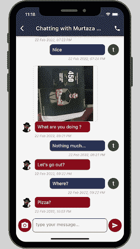

```
Widget buildItem(int index, DocumentSnapshot? documentSnapshot) {
 if (documentSnapshot != null) {
   ChatMessages chatMessages = ChatMessages.fromDocument(documentSnapshot);
   if (chatMessages.idFrom == currentUserId) {
     // right side (my message)
     return Column(
       crossAxisAlignment: CrossAxisAlignment.end,
       children: [
         Row(
           mainAxisAlignment: MainAxisAlignment.end,
           children: [
             chatMessages.type == MessageType.text
                 ? messageBubble(
                     chatContent: chatMessages.content,
                     color: AppColors.spaceLight,
                     textColor: AppColors.white,
                     margin: const EdgeInsets.only(right: Sizes.dimen_10),
                   )
                 : chatMessages.type == MessageType.image
                     ? Container(
                         margin: const EdgeInsets.only(
                             right: Sizes.dimen_10, top: Sizes.dimen_10),
                         child: chatImage(
                             imageSrc: chatMessages.content, onTap: () {}),
                       )
                     : const SizedBox.shrink(),
             isMessageSent(index)
                 ? Container(
                     clipBehavior: Clip.hardEdge,
                     decoration: BoxDecoration(
                       borderRadius: BorderRadius.circular(Sizes.dimen_20),
                     ),
                     child: Image.network(
                       widget.userAvatar,
                       width: Sizes.dimen_40,
                       height: Sizes.dimen_40,
                       fit: BoxFit.cover,
                       loadingBuilder: (BuildContext ctx, Widget child,
                           ImageChunkEvent? loadingProgress) {
                         if (loadingProgress == null) return child;
                         return Center(
                           child: CircularProgressIndicator(
                             color: AppColors.burgundy,
                             value: loadingProgress.expectedTotalBytes !=
                                         null &&
                                     loadingProgress.expectedTotalBytes !=
                                         null
                                 ? loadingProgress.cumulativeBytesLoaded /
                                     loadingProgress.expectedTotalBytes!
                                 : null,
                           ),
                         );
                       },
                       errorBuilder: (context, object, stackTrace) {
                         return const Icon(
                           Icons.account_circle,
                           size: 35,
                           color: AppColors.greyColor,
                         );
                       },
                     ),
                   )
                 : Container(
                     width: 35,
                   ),
           ],
         ),
         isMessageSent(index)
             ? Container(
                 margin: const EdgeInsets.only(
                     right: Sizes.dimen_50,
                     top: Sizes.dimen_6,
                     bottom: Sizes.dimen_8),
                 child: Text(
                   DateFormat('dd MMM yyyy, hh:mm a').format(
                     DateTime.fromMillisecondsSinceEpoch(
                       int.parse(chatMessages.timestamp),
                     ),
                   ),
                   style: const TextStyle(
                       color: AppColors.lightGrey,
                       fontSize: Sizes.dimen_12,
                       fontStyle: FontStyle.italic),
                 ),
               )
             : const SizedBox.shrink(),
       ],
     );
   } else {
     return Column(
       crossAxisAlignment: CrossAxisAlignment.start,
       children: [
         Row(
           mainAxisAlignment: MainAxisAlignment.start,
           children: [
             isMessageReceived(index)
                 // left side (received message)
                 ? Container(
                     clipBehavior: Clip.hardEdge,
                     decoration: BoxDecoration(
                       borderRadius: BorderRadius.circular(Sizes.dimen_20),
                     ),
                     child: Image.network(
                       widget.peerAvatar,
                       width: Sizes.dimen_40,
                       height: Sizes.dimen_40,
                       fit: BoxFit.cover,
                       loadingBuilder: (BuildContext ctx, Widget child,
                           ImageChunkEvent? loadingProgress) {
                         if (loadingProgress == null) return child;
                         return Center(
                           child: CircularProgressIndicator(
                             color: AppColors.burgundy,
                             value: loadingProgress.expectedTotalBytes !=
                                         null &&
                                     loadingProgress.expectedTotalBytes !=
                                         null
                                 ? loadingProgress.cumulativeBytesLoaded /
                                     loadingProgress.expectedTotalBytes!
                                 : null,
                           ),
                         );
                       },
                       errorBuilder: (context, object, stackTrace) {
                         return const Icon(
                           Icons.account_circle,
                           size: 35,
                           color: AppColors.greyColor,
                         );
                       },
                     ),
                   )
                 : Container(
                     width: 35,
                   ),
             chatMessages.type == MessageType.text
                 ? messageBubble(
                     color: AppColors.burgundy,
                     textColor: AppColors.white,
                     chatContent: chatMessages.content,
                     margin: const EdgeInsets.only(left: Sizes.dimen_10),
                   )
                 : chatMessages.type == MessageType.image
                     ? Container(
                         margin: const EdgeInsets.only(
                             left: Sizes.dimen_10, top: Sizes.dimen_10),
                         child: chatImage(
                             imageSrc: chatMessages.content, onTap: () {}),
                       )
                     : const SizedBox.shrink(),
           ],
         ),
         isMessageReceived(index)
             ? Container(
                 margin: const EdgeInsets.only(
                     left: Sizes.dimen_50,
                     top: Sizes.dimen_6,
                     bottom: Sizes.dimen_8),
                 child: Text(
                   DateFormat('dd MMM yyyy, hh:mm a').format(
                     DateTime.fromMillisecondsSinceEpoch(
                       int.parse(chatMessages.timestamp),
                     ),
                   ),
                   style: const TextStyle(
                       color: AppColors.lightGrey,
                       fontSize: Sizes.dimen_12,
                       fontStyle: FontStyle.italic),
                 ),
               )
             : const SizedBox.shrink(),
       ],
     );
   }
 } else {
   return const SizedBox.shrink();
 }
}
```

我们已经用 Firebase 在 Flutter 的后端创建了我们的聊天应用程序。还有很多其他的 Dart 文件和代码涉及到这个应用程序的编程，我没有在本文中发布，但是我已经用 GitHub 链接链接了每个页面来查看完整的代码。

```
Widget buildListMessage() {
   return Flexible(
     child: groupChatId.isNotEmpty
         ? StreamBuilder<QuerySnapshot>(
             stream: chatProvider.getChatMessage(groupChatId, _limit),
             builder: (BuildContext context,
                 AsyncSnapshot<QuerySnapshot> snapshot) {
               if (snapshot.hasData) {
                 listMessages = snapshot.data!.docs;
                 if (listMessages.isNotEmpty) {
                   return ListView.builder(
                       padding: const EdgeInsets.all(10),
                       itemCount: snapshot.data?.docs.length,
                       reverse: true,
                       controller: scrollController,
                       itemBuilder: (context, index) =>
                           buildItem(index, snapshot.data?.docs[index]));
                 } else {
                   return const Center(
                     child: Text('No messages...'),
                   );
                 }
               } else {
                 return const Center(
                   child: CircularProgressIndicator(
                     color: AppColors.burgundy,
                   ),
                 );
               }
             })
         : const Center(
             child: CircularProgressIndicator(
               color: AppColors.burgundy,
             ),
           ),
   );
 }
}
```

将应用程序部署为 PWA

现在，让我们配置我们完成的应用程序，以便上传到 Firebase Hosting，这样每个人都可以体验它，而不需要在任何设备上安装它。

## 步骤 1:创建 OAuth 2.0 凭证

请浏览此[文档](https://developers.google.com/identity/sign-in/web/sign-in#before_you_begin)以创建授权凭证。任何使用 OAuth 2.0 访问 Google APIs 的应用程序都必须拥有授权凭证，以便向 Google 服务器标识该应用程序。

### 运行这个命令`flutterfire configure`后，Google 将为 Android、iOS 和 web 配置 OAuth 2.0 凭据。你可以去这个[凭证页面](https://console.developers.google.com/apis/credentials)，你应该会看到类似下图的东西。

接下来，复制 web 应用程序的客户机 ID，并在进入下一步之前将其保存在某个地方。


第二步:谷歌平台库

创建新的 Flutter 应用程序时，默认情况下会在项目结构中创建一个 web 文件夹。打开`index.html`文件，添加这个脚本来加载 web 文件夹中的 Google 平台库。

### 请查看图像以获得进一步的清晰。


```
<script src="https://apis.google.com/js/platform.js" async defer></script>
```

步骤 3:指定客户端 ID

在同一个文件`index.html`中，添加您刚刚从[凭证页面](https://console.developers.google.com/apis/credentials)中复制的客户端 ID。

### 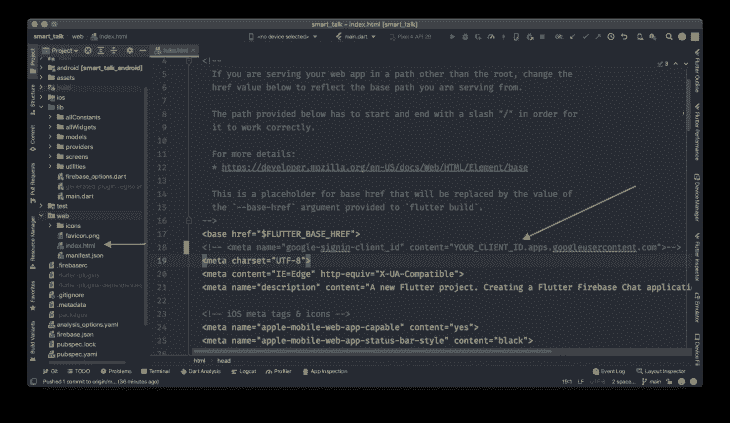

步骤 4:初始化 Firebase 托管

```
<meta name="google-signin-client_id" content="YOUR_CLIENT_ID.apps.googleusercontent.com">
```

由于我们在初始化项目并通过 Firebase 认证时已经配置了 Firebase CLI 命令，所以我们可以从项目的根目录直接在 Android Studio 终端中运行这个命令。

### 该命令将要求您在运行 Firebase 项目时选择它。使用箭头键选择它。

```
$ Firebase init hosting
```

*   接下来，Firebase CLI 将要求您输入公共目录的名称。输入 **build/web**
    *   然后，它会问你是否要将其配置为单页应用程序。输入 y(表示**是**)
        *   最后，它会询问您是否想要配置 GitHub 集成，配置自动构建，并将其部署到 Firebase 主机。当然，你可以以后再做，但是现在，输入 N(代表 **no** )
        *   您将看到在您的项目中创建了两个文件，称为`firebase.json`和`.firebaserc`。
        *   步骤 5:将文件添加到 build/web 文件夹中

从项目结构的根目录，在终端窗口中运行此命令。它会将所有必需的文件添加到根目录下的 build/web 中:

### 步骤 6:上传所有文件到 Firebase 主机

最后，运行这个命令将所有文件上传到 Firebase Hosting，它将生成一个任何人都可以访问的 web URL:

```
$ flutter build web
```

### 

结论

```
$ Firebase deploy
```

就是这样！我们都做完了。希望你和我一样喜欢阅读这篇文章。当我第一次创建这个应用程序时，我学到了很多。有了 FlutterFire 和 Dart CLI，用 Firebase 服务配置 Flutter 应用程序变得容易多了。

## 如果你想了解更多关于[将应用配置为 PWA](https://blog.logrocket.com/build-cross-platform-web-app-flutter/) 的信息，你可以阅读这篇便利的博客。这里是这个演示项目的 [PWA 的链接，以及](https://chat-app-6c19b.web.app/#/) [GitHub](https://github.com/timelessfusionapps/smart_talk) 上的整个项目的链接，供你试验。

使用 [LogRocket](https://lp.logrocket.com/blg/signup) 消除传统错误报告的干扰

[LogRocket](https://lp.logrocket.com/blg/signup) 是一个数字体验分析解决方案，它可以保护您免受数百个假阳性错误警报的影响，只针对几个真正重要的项目。LogRocket 会告诉您应用程序中实际影响用户的最具影响力的 bug 和 UX 问题。

## 然后，使用具有深层技术遥测的会话重放来确切地查看用户看到了什么以及是什么导致了问题，就像你在他们身后看一样。

[](https://lp.logrocket.com/blg/signup)

LogRocket 自动聚合客户端错误、JS 异常、前端性能指标和用户交互。然后 LogRocket 使用机器学习来告诉你哪些问题正在影响大多数用户，并提供你需要修复它的上下文。

关注重要的 bug—[今天就试试 LogRocket】。](https://lp.logrocket.com/blg/signup-issue-free)

LogRocket automatically aggregates client side errors, JS exceptions, frontend performance metrics, and user interactions. Then LogRocket uses machine learning to tell you which problems are affecting the most users and provides the context you need to fix it.

Focus on the bugs that matter — [try LogRocket today](https://lp.logrocket.com/blg/signup-issue-free).