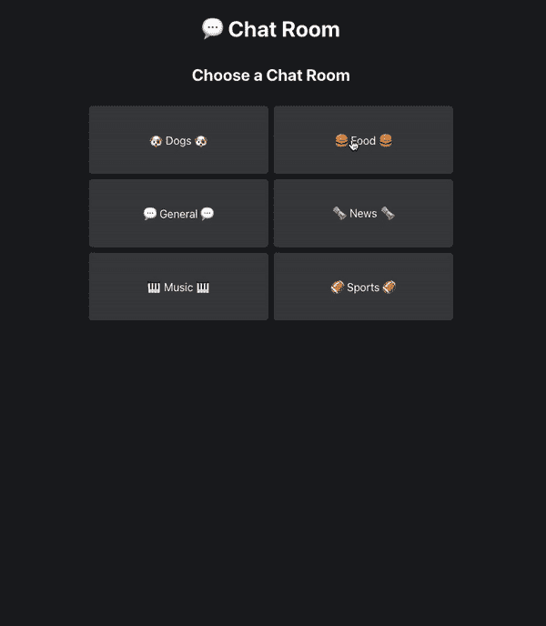
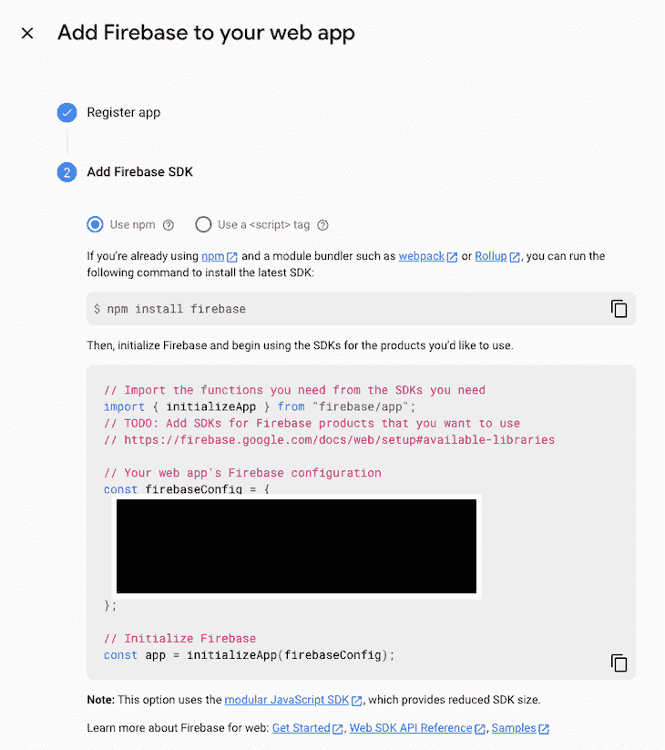
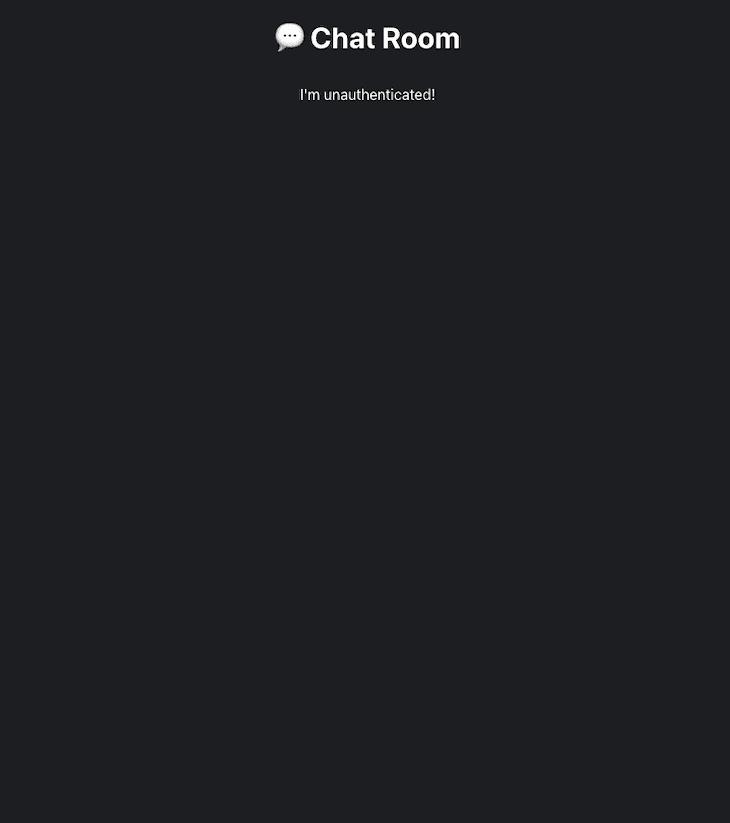
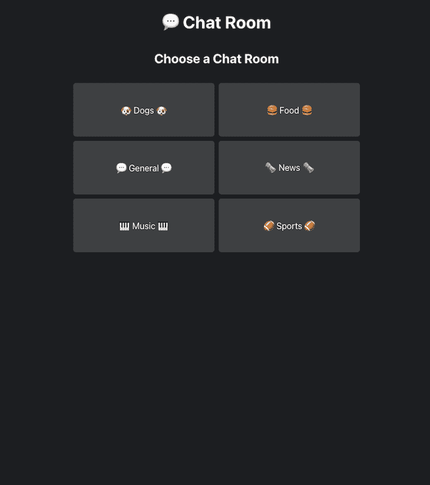
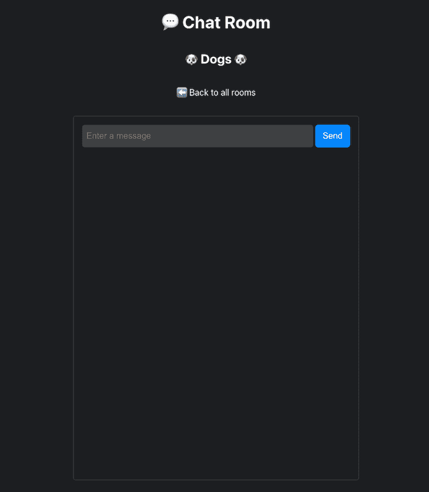
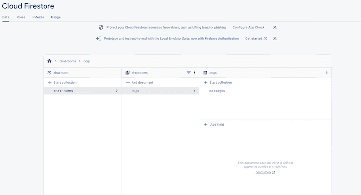

# 如何用 React 和 Firebase - LogRocket Blog 构建聊天室应用程序

> 原文：<https://blog.logrocket.com/how-to-build-chatroom-app-react-firebase/>

在本教程中，你将学习如何使用[云 Firestore](https://firebase.google.com/docs/firestore) 和 [Firebase 认证](https://firebase.google.com/docs/auth)在 React 中构建一个聊天室应用。

我们将使用 Firestore 数据库来存储聊天室消息，并允许用户通过 Firebase 身份验证使用 Google 登录来登录。我们甚至允许用户从多个聊天室话题中选择他们感兴趣的话题。

我们完成的项目将看起来像下面的 gif:



最终的项目代码可以在 [GitHub](https://github.com/zachsnoek/react-firebase-chat-app) 上找到。在本教程的最后，我将给出一些扩展这个应用程序的方法，以进一步提高您的 React 和 Firebase 技能。

要阅读本文，您需要具备中级 JavaScript、React 和 CSS 知识。你还需要一个谷歌账户来访问 Firebase。如果你没有谷歌账户，你可以在这里创建一个。

此外，我们将使用 React Router，React 中用于路由的库。React 路由器的知识不是必需的，但是你可能想要[查阅文档](https://reactrouter.com/docs/en/v6)。我们开始吧！

## 什么是 Firebase Cloud Firestore？

Firebase 是 Google 为开发应用程序而构建的平台。Firebase 提供的产品可以帮助开发人员加快开发速度，快速扩展，并为常见的开发需求创建简单的解决方案。我们将在这个应用程序中使用的两个 Firebase 产品是 Cloud Firestore 和 Firebase Authentication。

云 Firestore 是一个云托管的 NoSQL 数据库。数据以键值对的形式存储在文档中，文档被组织成集合。数据是灵活的，可以嵌套在包含子集合的文档中。Firestore 数据库可自动扩展，并可跨听众同步数据。此外，它们有一个免费层，因此很容易用于实验和学习。

## 什么是 Firebase 认证？

对用户进行身份验证不是一件小事，而是您希望正确完成的事情。幸运的是，Firebase 已经为我们完成了大部分艰苦的工作，并实现了后端和登录解决方案来简化身份验证。我们将使用 Firebase Authentication 的简单 SDK，通过电子邮件和密码、Google 登录和电话号码等登录方法对用户进行身份验证。

现在您已经熟悉了 Firebase，让我们开始这个项目吧！

## 设置 Firebase 项目和 React 应用程序

要将 Firebase 添加到应用程序中，我们首先需要创建一个 Firebase 项目并注册我们的 Firebase 应用程序。

Firebase 项目是 Firebase 应用程序及其资源和服务的容器，如 Firestore 数据库和身份验证提供程序。Firebase 应用程序(即 web 应用程序或 iOS 应用程序)属于一个项目；一个项目可以有许多应用程序，并且它的所有应用程序共享相同的资源和服务。

要创建 Firebase 项目，请导航到 Firebase 控制台，并按照以下步骤操作:

1.  如果你以前用过 Firebase，点击**创建一个项目**或者**添加项目**
2.  输入`Chat Room`作为项目名称，然后点击**继续**
3.  打开或关闭`Enable Google Analytics for this project`；为了简单起见，我选择禁用谷歌分析
4.  点击**创建项目**

最后一步将创建您的 Firebase 聊天室项目并提供其资源。一旦提供了资源，单击**继续**导航到项目的概述页面。

接下来，让我们创建 Firebase 应用程序。因为我们要将 Firebase 添加到 React 应用程序中，所以我们需要创建一个 web 应用程序。

1.  前往**概述**页面，点击**下的网络图标，开始将 Firebase 添加到您的应用**
2.  在`App nickname`字段输入`Chat Room`
3.  点击**注册应用**

注册应用程序后，您应该会在 **Add Firebase SDK** 下看到将 Firebase SDK 添加到您的项目中的说明:



保持此页面打开；在下一节中，我们将回到这个话题来讨论我们的 Firebase 配置。

接下来，让我们设置 React 应用程序并添加所需的依赖项。为简单起见，我们将使用 Create React App 引导我们的应用程序:

```
npx create-react-app chat-room && cd chat-room

```

接下来，安装 Firebase SDK，它使我们能够访问 Firebase 身份验证、云 Firestore 和 React 路由器的功能:

```
npm i firebase react-router-dom

```

## 初始化 Firebase

随着 React 项目的建立和 Firebase 应用程序的注册，我们现在可以在项目中初始化 Firebase 了。在继续之前，先了解一下我们将如何在应用程序中使用 Firebase SDK 会有所帮助。

首先，我们将创建一个登录函数，它使用 Firebase 身份验证通过 Google sign-in 让用户登录。我们将在 state 中存储经过身份验证的用户，并通过上下文 API 使这些信息和登录功能对组件可用[。我们还将使用 Firestore SDK 函数来读取和写入我们的数据库。读取数据库消息的自定义钩子将允许组件获得最新的同步数据。](https://blog.logrocket.com/react-context-api-deep-dive-examples/)

记住这一点，本节的目标是在 React 中初始化我们的 Firebase 应用程序，并设置模块来导出我们前面提到的使用 SDK 的函数。

首先，创建初始化 Firebase 并导出我们的函数的目录和模块文件:

```
mkdir src/services && touch src/services/firebase.js

```

接下来，我们将添加 Firebase 配置并初始化应用程序。`firebaseConfig`对象来自您在`Add Firebase SDK`下注册应用程序后显示的信息:

```
import { initializeApp } from "firebase/app";
const firebaseConfig = {
    // TODO: Add your Firebase configuration here
};
const app = initializeApp(firebaseConfig);

```

返回一个 Firebase 应用程序实例，它允许我们的应用程序跨 Firebase 服务使用通用配置和认证。我们稍后设置 Firestore 时会用到它。

这就是我们在应用程序中初始化 Firebase 所需要做的一切！让我们继续添加 Firebase 身份验证和我们的第一个 React 代码。

## 添加 Firebase 身份验证

在这一节中，我们将把 Firebase 身份验证添加到我们的应用程序中，创建一个作为 Google 用户登录的函数，并设置我们在上一节中简要讨论过的身份验证上下文。我们将创建一个传递一个`user`对象和一个`login`函数的`<AuthProvider>`组件。`login`包装 SDK 的 Google sign-in 功能，然后将认证用户设置为状态。

首先，我们需要在 Firebase 控制台中启用 Google 作为登录方法。首先，导航到控制台。

1.  点击侧边栏中的**认证**
2.  点击**开始**
3.  点击顶部的**登录方式**选项卡
4.  在**登录提供商**下，点击**谷歌**
5.  切换**使能**
6.  选择一个**项目支持电子邮件**
7.  点击**保存**

接下来，我们将在应用程序中添加 Firebase 身份验证。在`src/services/firebase.js`中，添加以下代码:

```
// ...

import { GoogleAuthProvider, signInWithPopup, getAuth } from 'firebase/auth';

// ...

async function loginWithGoogle() {
    try {
        const provider = new GoogleAuthProvider();
        const auth = getAuth();

        const { user } = await signInWithPopup(auth, provider);

        return { uid: user.uid, displayName: user.displayName };
    } catch (error) {
        if (error.code !== 'auth/cancelled-popup-request') {
            console.error(error);
        }

        return null;
    }
}

export { loginWithGoogle };

```

在`try`块中，我们创建一个`GoogleAuthProvider`，它为 Google 生成一个凭证，并调用`getAuth`，它返回一个 Firebase 认证实例。我们将这两个对象传递给`signInWithPopup`，它处理弹出窗口中的登录流，并在用户通过身份验证后返回他们的信息。正如您所看到的，这个 API 使得一个复杂的过程变得相当简单。

* * *

### 更多来自 LogRocket 的精彩文章:

* * *

Firebase 身份验证支持许多其他身份验证方法；你可以在 [Firebase 文档](https://firebase.google.com/docs/auth/web/start)中了解它们。

接下来，让我们创建身份验证上下文和提供者。为上下文创建一个新目录和一个文件来存储它:

```
mkdir src/context && touch src/context/auth.js

```

在`src/context/auth.js`中，添加以下代码:

```
import React from 'react';
import { loginWithGoogle } from '../services/firebase';

const AuthContext = React.createContext();

const AuthProvider = (props) => {
    const [user, setUser] = React.useState(null);

    const login = async () => {
        const user = await loginWithGoogle();

        if (!user) {
            // TODO: Handle failed login
        }

        setUser(user);
    };

    const value = { user, login };

    return <AuthContext.Provider value={value} {...props} />;
};

export { AuthContext, AuthProvider };

```

我们首先创建一个`AuthContext`对象，然后创建一个`<AuthProvider>`组件来返回上下文的提供者。在`AuthProvider`中，我们创建了我们的`user`状态和一个登录函数，一旦用户成功登录，该函数将调用我们的`loginWithGoogle`函数并设置`user`状态。最后，我们让上下文订阅者可以使用`user`和`login`函数。

接下来，我们将创建一个定制的`useAuth`钩子来使用这个上下文。我们将在我们的根`<App>`组件中使用它来检查我们是否有一个登录的`user`状态。如果没有，我们可以呈现一个登录页面并让该页面调用`login`函数，该函数也是通过上下文接收的。如果我们这样做，我们将使用`user`信息来发送和接收消息。

用下面的代码为我们的钩子创建一个目录和一个文件来存储新的钩子:

```
mkdir src/hooks && touch src/hooks/useAuth.js

```

在`src/hooks/useAuth.js`中，我们将实现一个简单的钩子，调用`useContext`来使用我们在`src/context/auth.js`中创建的上下文值:

```
import React from 'react';
import { AuthContext } from '../context/auth';

function useAuth() {
    const value = React.useContext(AuthContext);

    if (!value) {
        throw new Error("AuthContext's value is undefined.");
    }

    return value;
}

export { useAuth };

```

最后，通过用我们的`<AuthProvider>`包装`<App>`组件，让我们的上下文值对整个组件树可用。将以下代码添加到`src/index.js`:

```
// ...

import { AuthProvider } from './context/auth';

// ...

root.render(
    <AuthProvider>
        <App />
    </AuthProvider>
);

// ...

```

有了合适的`<AuthProvider>`并创建了我们的`useAuth`钩子，我们就可以登录用户并在整个应用程序中接收他们的认证信息了。

## 添加`<UnauthenticatedApp>`和`<AuthenticatedApp>`组件

之前，我提到过我们将使用`useAuth`钩子来决定我们是否应该显示一个登录界面。在我们的`<App>`组件中，我们将检查是否有一个`user`。如果这样做，我们将呈现一个`<AuthenticatedApp>`，它是用户可以聊天的主要应用程序。如果我们不这样做，我们将呈现一个`<UnauthenticatedApp>`，这是一个带有登录按钮的页面。

该逻辑的核心如下所示:

```
function App() {
    const { user } = useAuth();
    return user ? <AuthenticatedApp /> : <UnauthenticatedApp />;
}

```

让我们从用占位符实现创建这两个组件开始。首先，让我们创建一个组件目录来存储我们的所有组件以及两个新组件的目录和文件:

```
mkdir src/components src/components/AuthenticatedApp src/components/UnauthenticatedApp
touch src/components/AuthenticatedApp/index.jsx
touch src/components/UnauthenticatedApp/index.jsx src/components/UnauthenticatedApp/styles.css

```

在`src/components/AuthenticatedApp/index.jsx`中，添加一个占位符组件:

```
function AuthenticatedApp() {
    return <div>I'm authenticated!</div>
}

export { AuthenticatedApp };

```

在`src/components/UnauthenticatedApp/index.jsx`中进行同样的操作:

```
function UnauthenticatedApp() {
    return <div>I'm unauthenticated!</div>
}

export { UnauthenticatedApp };

```

现在，在`src/components/App.js`中，让我们执行前面描述的认证检查，添加一个头，最后，设置我们的布局。用以下代码替换默认代码:

```
import { AuthenticatedApp } from './components/AuthenticatedApp';
import { UnauthenticatedApp } from './components/UnauthenticatedApp';
import { useAuth } from './hooks/useAuth';
import './App.css';

function App() {
    const { user } = useAuth();

    return (
        <div className="container">
            <h1>💬 Chat Room</h1>
            {user ? <AuthenticatedApp /> : <UnauthenticatedApp />}
        </div>
    );
}

export default App;

```

在`src/App.css`中，用这些全局样式替换默认样式:

```
* {
    box-sizing: border-box;
}

html {
    --color-background: hsl(216, 8%, 12%);
    --color-blue: hsl(208, 100%, 50%);
    --color-gray: hsl(210, 3%, 25%);
    --color-white: white;
    --border-radius: 5px;
    background-color: var(--color-background);
    color: var(--color-white);
}

html,
body,
#root {
    height: 100%;
}

h1,
h2,
h3,
h4,
ul {
    margin: 0;
}

a {
    color: inherit;
    text-decoration: none;
}

ul {
    padding: 0;
    list-style: none;
}

button {
    cursor: pointer;
}

input,
button {
    font-size: 1rem;
    color: inherit;
    border: none;
    border-radius: var(--border-radius);
}

.container {
    height: 100%;
    max-width: 600px;
    margin-left: auto;
    margin-right: auto;
    padding: 32px;
    display: flex;
    flex-direction: column;
    align-items: center;
    gap: 32px;
}

```

最后，运行`yarn start`并导航到`[http://localhost:3000](http://localhost:3000)`。由于`user`在我们的`<AuthProvider>`中被初始化为`null`，你应该会看到文本阅读`I'm unauthenticated!`:



## 实施`<UnauthenticatedApp>`

现在，是时候将所有东西连接在一起，并将登录按钮添加到`<UnauthenticatedApp>`中。我们已经完成了编写`login`函数并通过上下文传递它的困难部分。现在，我们可以简单地通过`useAuth`消费我们的`AuthContext`来获得`login`函数，并呈现一个调用它的按钮。

当用户点击登录按钮时，`login`被调用，显示 Google 登录弹出窗口。一旦登录完成，`user`将存储在 state 中，显示`<AuthenticatedApp>`。

在`src/components/UnauthenticatedApp/index.jsx`中，添加以下代码:

```
import { useAuth } from '../../hooks/useAuth';
import './styles.css';

function UnauthenticatedApp() {
    const { login } = useAuth();

    return (
        <>
            <h2>Log in to join a chat room!</h2>
            <div>
                <button onClick={login} className="login">
                    Login with Google
                </button>
            </div>
        </>
    );
}

export { UnauthenticatedApp };

```

将以下样式添加到`src/components/UnauthenticatedApp/styles.css`:

```
.login {
    background: var(--color-blue);
    padding: 16px;
}

```

现在，您可以在浏览器中导航到您的应用程序并尝试登录。一旦通过身份验证，您应该会看到文本`I'm authenticated!`:


现在，我们的应用程序中有了基本的身份验证。让我们继续实现`<AuthenticatedApp>`组件。

## 添加聊天室和路由

有能力和别人聊天是很棒的，但是和别人聊不同的话题会更有趣。我们将通过创建硬编码的聊天室主题来实现这一点；在本节中，我们将创建硬编码的聊天室并设置路由，以便我们可以为每个房间设置不同的路由，即`/room/{roomId}`。

首先，为我们的聊天室创建一个文件:

```
mkdir src/data && touch src/data/chatRooms.js

```

在`src/data/chatRooms.js`中，我们将为每个房间导出一个带有`id`和`title`的`chatRooms`对象:

```
const chatRooms = [
    { id: 'dogs', title: '🐶 Dogs 🐶' },
    { id: 'food', title: '🍔 Food 🍔' },
    { id: 'general', title: '💬 General 💬' },
    { id: 'news', title: '🗞 News 🗞' },
    { id: 'music', title: '🎹 Music 🎹' },
    { id: 'sports', title: '🏈 Sports 🏈' },
];

export { chatRooms };

```

这些是我想到的第一个话题，但这是你的项目，所以请随意添加你感兴趣的聊天室话题。

接下来，我们来设置路由器。`<AuthenticatedApp>`将呈现一个包含两条路径的路由器:一条路径`/`将我们带到一个`<Landing>`组件，另一条路径`/room/:id`呈现一个`<ChatRoom>`组件。

让我们为两个新组件创建文件，并将占位符组件放入其中:

```
mkdir src/components/Landing src/components/ChatRoom
touch src/components/Landing/index.jsx src/components/Landing/styles.css
touch src/components/ChatRoom/index.jsx src/components/ChatRoom/styles.css

```

将负责列出我们所有的聊天室。点击其中一个将导航至`/room/:id`。在`src/components/Landing/index.jsx`中添加一个占位符组件:

```
function Landing() {
    return <div>Landing</div>;
}

export { Landing };

```

`<ChatRoom>`将列出一个房间的消息并呈现一个输入和发送另一个消息的按钮。在`src/components/ChatRoom.index.jsx`中，添加以下代码:

```
function ChatRoom() {
    return <div>Chat room</div>;
}

export { ChatRoom };

```

现在，让我们在`<AuthenticatedApp>`中设置路由器，并用我们的新组件渲染路线。用以下代码替换我们在`src/components/AuthenticatedApp/index.jsx`中的占位符实现:

```
import { BrowserRouter, Routes, Route } from 'react-router-dom';
import { Landing } from '../Landing';
import { ChatRoom } from '../ChatRoom';

function AuthenticatedApp() {
    return (
        <BrowserRouter>
            <Routes>
                <Route path="/" element={<Landing />} />
                <Route path="/room/:id" element={<ChatRoom />} />
            </Routes>
        </BrowserRouter>
    );
}

export { AuthenticatedApp };

```

用 React 路由器讨论导航已经超出了本文的范围；如果你有兴趣了解更多关于 React 路由器的信息，[查看他们的文档](https://reactrouter.com/docs/en/v6)。

让我们通过实现`<Landing>`来测试我们的路由器，这样我们就可以选择一个聊天室。在`<Landing>`中，我们将简单地为每个硬编码的`chatRooms`创建一个 React 路由器`<Link>`:

```
import { Link } from 'react-router-dom';
import { chatRooms } from '../../data/chatRooms';
import './styles.css';

function Landing() {
    return (
        <>
            <h2>Choose a Chat Room</h2>
            <ul className="chat-room-list">
                {chatRooms.map((room) => (
                    <li key={room.id}>
                        <Link to={`/room/${room.id}`}>{room.title}</Link>
                    </li>
                ))}
            </ul>
        </>
    );
}

export { Landing };

```

为了让事情看起来更好，让我们给`src/components/Landing/styles.css`添加一些样式:

```
.chat-room-list {
    display: flex;
    flex-wrap: wrap;
    gap: 8px;
}

.chat-room-list li {
    height: 100px;
    background: var(--color-gray);
    flex: 1 1 calc(50% - 4px);
    border-radius: var(--border-radius);
    display: flex;
    justify-content: center;
    align-items: center;
}

```

当您导航到`[http://localhost:3000](http://localhost:3000)`并登录时，路由器会将您带到更新后的`<Landing>`组件:



如果你点击**🐶狗🐶**例如，您应该被带到`[http://localhost:3000/room/dogs](http://localhost:3000/room/dogs)`并看到文本`Chat room`。

最后，让我们设置我们的`<ChatRoom>`组件，稍后我们将完成实现。现在，让我们显示聊天室信息，并提供返回登录页面的链接:

```
import { Link, useParams } from 'react-router-dom';
import { chatRooms } from '../../data/chatRooms';
import './styles.css';

function ChatRoom() {
    const params = useParams();

    const room = chatRooms.find((x) => x.id === params.id);
    if (!room) {
        // TODO: 404
    }

    return (
        <>
            <h2>{room.title}</h2>
            <div>
                <Link to="/">⬅️ Back to all rooms</Link>
            </div>
            <div className="messages-container">
                                {/* TODO */}
            </div>
        </>
    );
}

export { ChatRoom };

```

回想一下，这个组件是为路径`/room/:id`呈现的。使用 React Router 的`useParams`钩子，我们可以检索 URL 中的 ID 并找到相应的硬编码聊天室。

将以下样式添加到`src/components/ChatRoom/styles.css`:

```
.messages-container {
    width: 100%;
    padding: 16px;
    flex-grow: 1;
    border: 1px solid var(--color-gray);
    border-radius: var(--border-radius);
    overflow: hidden;
    display: flex;
    flex-direction: column;
}

```

如果您导航回`[http://localhost:3000/room/dogs](http://localhost:3000/room/dogs)`，您应该会看到我们更新的组件:


## 编写聊天室消息

现在我们每个聊天室都有页面了，让我们添加向房间发送消息的功能。首先，我们需要在控制台中创建一个 Firestore 数据库:

1.  在 Firebase 控制台中，单击**聊天室**项目，进入其项目概述页面
2.  在导航菜单中，点击 **Firestore 数据库**
3.  点击**创建数据库**
4.  在模式下，在`Secure rules for Cloud Firestore`下，点击**在测试模式下开始**
5.  点击下一个的**，选择离你最近的**云火店位置****
6.  点击**启用**

在测试模式下启动云 Firestore 可以让我们快速上手，而无需立即担心设置安全规则。在测试模式下，任何人都可以读取和覆盖我们的数据，但是在生产中，您会希望保护您的数据库。

提供云 Firestore 数据库后，您应该会转到一个带有数据库数据查看器的页面:


添加数据后，数据查看器将显示数据的结构，并允许我们查看、添加、编辑和删除数据。

回想一下，Firestore 数据存储在键值文档中，这些文档被分组到集合中。每个文档都必须属于一个集合。文档类似于 JSON 例如，一个`dogs`聊天室的文档可以按如下方式构建:

```
[dogs]
name : "🐶 Dogs 🐶"
description : "A place to chat about dogs."
dateCreated : 2022-01-01

```

我们可以创建多个聊天室文档，并将它们存储在一个`chat-rooms`集合中:

```
[chat-rooms]

    [dogs]
    name : "🐶 Dogs 🐶"
    description : "A place to chat about dogs."
    dateCreated : 2022-01-01

    [general]
    name : "🍔 Food 🍔"
    description : "All things food."
    dateCreated : 2022-01-01

    ...

```

但是，对于我们的应用程序，我们将为每个房间 ID 创建一个`chat-rooms`集合和一个嵌套文档。我们将为每个文档创建一个`messages`子集合，而不是将每个文档中的消息存储为键值对。子集合是与文档相关联的集合。每个`messages`子集合将包含多个消息文档，其结构如下所示:

```
[chat-rooms]

    [dogs]
        [messages]
            [documentID]
            text : "..."
            timestamp : ...

    [general]
        [messages]
            [documentId]
            text : "..."
            timestamp : ...

    ...

```

例如，为了引用我们的`messages`子集合中的文档，我们将使用路径`chat-rooms/{roomId}/messages/{documentId}`。

注意，我们不会使用数据查看器来显式地创建这些集合和文档。当我们写入数据库时，Firestore 将创建一个集合或文档，如果它还不存在的话。

记住这一点，让我们创建一个`sendMessage`函数，将一个文档添加到一个房间的`messages`子集合中。首先，我们需要在我们的应用程序中用`getFirestore`初始化一个 Firestore 实例，它返回一个对 Firestore 服务的引用，我们可以用它来执行读写操作:

```
// ...

import { getFirestore } from 'firebase/firestore';

// ...

const app = initializeApp(firebaseConfig);
const db = getFirestore(app);

// ...

```

接下来，我们将使用`addDoc`和`collection` SDK 函数来添加文档。`addDoc`接受一个集合，我们通过使用`collection`和一个文档对象获得一个引用。`collection`获取 Firestore 实例和构成集合路径的参数，在我们的例子中是`messages`子集合。

同样，Firestore 将创建任何不存在的集合和文档，因此我们可以简单地指定我们想要的路径。`addDoc`还将为我们创建一个 ID:

```
// ...

import { getFirestore, collection, addDoc, serverTimestamp } from 'firebase/firestore';

// ...

async function sendMessage(roomId, user, text) {
    try {
        await addDoc(collection(db, 'chat-rooms', roomId, 'messages'), {
            uid: user.uid,
            displayName: user.displayName,
            text: text.trim(),
            timestamp: serverTimestamp(),
        });
    } catch (error) {
        console.error(error);
    }
}

export { loginWithGoogle, sendMessage };

```

我们的`sendMessage`函数接收`roomId`、当前的`user`(它是存储在上下文中的对象，我们使用身份验证获得它)和消息`text`。我们使用这些数据来形成作为第二个参数传递给`addDoc`的文档对象。

我们还为我们的`timestamp`属性使用了`serverTimestamp`函数，这样我们可以在检索消息时按照消息日期进行排序。你可以在[文档](https://firebase.google.com/docs/reference/android/com/google/firebase/Timestamp)中读到更多关于这个功能的内容。

现在我们有了一个写消息数据的函数，我们需要一个调用它的输入组件。我们将创建一个`<MessageInput>`组件，它呈现在`<ChatRoom>`组件的底部。创建组件目录和文件:

```
mkdir src/components/MessageInput
touch src/components/MessageInput/index.jsx src/components/MessageInput/styles.css

```

将返回一个带有文本输入和提交按钮的简单表单。我们将从道具中获取`roomId`，从上下文中获取`user`。当表单提交后，我们将使用所有需要的信息调用我们的`sendMessage`函数。

将以下代码添加到`src/components/MessageInput/index.jsx`:

```
import React from 'react';
import { useAuth } from '../../hooks/useAuth';
import { sendMessage } from '../../services/firebase';
import './styles.css';

function MessageInput({ roomId }) {
    const { user } = useAuth();
    const [value, setValue] = React.useState('');

    const handleChange = (event) => {
        setValue(event.target.value);
    };

    const handleSubmit = (event) => {
        event.preventDefault();
        sendMessage(roomId, user, value);
        setValue('');
    };

    return (
        <form onSubmit={handleSubmit} className="message-input-container">
            <input
                type="text"
                placeholder="Enter a message"
                value={value}
                onChange={handleChange}
                className="message-input"
                required
                minLength={1}
            />
            <button type="submit" disabled={value < 1} className="send-message">
                Send
            </button>
        </form>
    );
}
export { MessageInput };

```

将样式添加到`src/components/MessageInput/styles.css`:

```
.message-input-container {
    display: flex;
    gap: 4px;
}

.message-input {
    padding: 12px 8px;
    flex: 1;
    background: var(--color-gray);
    border-radius: var(--border-radius);
}

.send-message {
    padding: 12px 14px;
    background: var(--color-blue);
    border-radius: var(--border-radius);
    cursor: pointer;
}

```

现在，我们可以渲染`<ChatRoom>`中的组件:

```
// ...

import { MessageInput } from '../MessageInput';

// ...

function ChatRoom() {
    // ...
        return (
        <>
            <h2>{room.title}</h2>
            <div>
                <Link to="/">⬅️ Back to all rooms</Link>
            </div>
            <div className="messages-container">
                <MessageInput roomId={room.id} />
            </div>
        </>
    );
}

// ...

```

如果您返回到`[http://localhost:3000/room/dogs](http://localhost:3000/room/dogs)`，您应该会看到消息输入:



尝试输入一些消息，然后返回到 Firebase 控制台中的数据查看器。您应该看到一个`chat-rooms`集合是用以下结构创建的:



如果您点击进入`messages`子集合，您将看到您刚刚创建的消息的文档。尝试在不同的聊天室中添加消息，并注意如何为每个聊天室创建新文档。

## 阅读聊天室消息

现在我们可以向 Firestore 写入数据，我们需要做的最后一件事是检索聊天室的所有消息。我们将创建一个在`<ChatRoom>`中呈现的`<MessageList>`组件，并列出一个房间的所有消息。我们将创建一个获取房间消息的`getMessages`函数和一个将它们存储在 state 中的`useMessages`钩子。

让我们从创建`getMessages`开始。用下面的代码更新`src/services/firebase.js`:

```
// ...

import {
    getFirestore,
    collection,
    addDoc,
    serverTimestamp,
    onSnapshot,
    query,
    orderBy,
} from 'firebase/firestore';

// ...

function getMessages(roomId, callback) {
    return onSnapshot(
        query(
            collection(db, 'chat-rooms', roomId, 'messages'),
            orderBy('timestamp', 'asc')
        ),
        (querySnapshot) => {
            const messages = querySnapshot.docs.map((doc) => ({
                id: doc.id,
                ...doc.data(),
            }));
            callback(messages);
        }
    );
}

export { loginWithGoogle, sendMessage, getMessages };

```

SDK 功能让我们可以利用 Firestore 的实时更新。它侦听查询的结果，并在发生更改时接收更新。

我们传递给它一个使用`query`函数构造的查询。在我们的例子中，我们希望监听一个房间的`messages`子集合的变化，并按照文档的`timestamp`对文档进行升序排序。

我们给它的第二个参数是一个回调，当它接收到初始查询和任何后续更新时，比如添加新文档时，就会调用这个回调。我们通过映射每个文档形成一个消息数组，然后用格式化的消息调用`callback`。当我们在钩子中调用`getMessages`时，我们将传递一个`callback`，这样我们就可以在状态中存储消息。

`onSnapshot`返回一个取消订阅函数来分离侦听器，这样当不再需要回调函数时就不会调用它；我们用这个来清理我们的钩子。

首先，创建`useMessages`钩子文件:

```
touch src/hooks/useMessages.js

```

`useMessages`将接受一个`roomId`，在 state 中存储消息，并返回消息。它将使用一个效果来获取带有`getMessages`的消息，并在效果清理后取消听众的订阅:

```
import React from 'react';
import { getMessages } from '../services/firebase';

function useMessages(roomId) {
    const [messages, setMessages] = React.useState([]);

    React.useEffect(() => {
        const unsubscribe = getMessages(roomId, setMessages);
        return unsubscribe;
    }, [roomId]);

    return messages;
}

export { useMessages };

```

接下来，我们将创建`<MessageList>`组件来获取和呈现房间的消息。为此组件创建新的组件文件:

```
mkdir src/components/MessageList
touch src/components/MessageList/index.jsx src/components/MessageList/styles.css

```

`<MessageList>`将把`roomId`作为道具，传递给`useMessages`，然后渲染消息。将以下代码添加到`src/components/MessageList/index.jsx`:

```
import React from 'react';
import { useAuth } from '../../hooks/useAuth';
import { useMessages } from '../../hooks/useMessages';
import './styles.css';

function MessageList({ roomId }) {
    const containerRef = React.useRef(null);
    const { user } = useAuth();
    const messages = useMessages(roomId);

    React.useLayoutEffect(() => {
        if (containerRef.current) {
            containerRef.current.scrollTop = containerRef.current.scrollHeight;
        }
    });

    return (
        <div className="message-list-container" ref={containerRef}>
            <ul className="message-list">
                {messages.map((x) => (
                    <Message
                        key={x.id}
                        message={x}
                        isOwnMessage={x.uid === user.uid}
                    />
                ))}
            </ul>
        </div>
    );
}

function Message({ message, isOwnMessage }) {
    const { displayName, text } = message;
    return (
        <li className={['message', isOwnMessage && 'own-message'].join(' ')}>
            <h4 className="sender">{isOwnMessage ? 'You' : displayName}</h4>
            <div>{text}</div>
        </li>
    );
}

export { MessageList };

```

布局效果中的逻辑导致容器滚动到底部，因此我们总是看到最近的消息。

现在，我们将向`src/components/MessageList/styles.css`添加样式:

```
.message-list-container {
    margin-bottom: 16px;
    flex: 1;
    overflow: scroll;
}

.message-list {
    height: 100%;
    display: flex;
    flex-direction: column;
    align-items: flex-start;
}

.message {
    padding: 8px 16px;
    margin-bottom: 8px;
    background: var(--color-gray);
    border-radius: var(--border-radius);
    text-align: left;
}

.own-message {
    background: var(--color-blue);
    align-self: flex-end;
    text-align: right;
}

.sender {
    margin-bottom: 8px;
}

```

最后，将`<ChatRoom>`中的组件呈现在我们之前添加的`<MessageInput>`之上:

```
// ...

import { MessageList } from '../MessageList';

// ...

function ChatRoom() {
    // ...
    return (
        <>
            <h2>{room.title}</h2>
            <div>
                <Link to="/">⬅️ Back to all rooms</Link>
            </div>
            <div className="messages-container">
                <MessageList roomId={room.id} />
                <MessageInput roomId={room.id} />
            </div>
        </>
    );
}

// ...

```

恭喜你，你现在有一个用 React 和 Firebase 构建的聊天室应用程序了！可以在 [GitHub](https://github.com/zachsnoek/react-firebase-chat-app) 上查看最终代码。

## 后续步骤

一个很好的学习方法是拿一个项目，修改它或者添加更多的特性。这里有一些扩展这个项目的方法:

*   [保护 Firestore 数据库](https://firebase.google.com/docs/firestore/quickstart#secure_your_data)
*   添加对不同身份验证方法的支持
*   在 firestorm 中而不是代码中存储聊天室
*   允许用户添加他们自己的聊天室
*   让用户注销
*   进入聊天室时只显示最后一分钟的聊天消息
*   当用户进入或离开聊天室时显示信息
*   显示用户头像
*   显示聊天室中的所有用户
*   为用户随机分配邮件颜色

## 结论

在本教程中，您学习了如何使用 Firebase 构建一个简单的聊天室应用程序。您了解了如何创建一个 Firebase 项目并将其添加到 React 应用程序中，以及如何使用 Firebase Authentication 的 Google 登录方法对用户进行身份验证。

然后，您学习了如何使用`addDoc` API 写入 Firestore 数据库，以及如何使用`onSnapshot` API 监听实时更新。

如果你有兴趣学习更多关于 Firebase 的知识，你可以[查看文档](https://firebase.google.com/docs)。如果您有任何问题或想与我联系，请务必在 [LinkedIn](https://www.linkedin.com/in/zachsnoek/) 或 [Twitter](https://twitter.com/zach_snoek) 上留言或联系我！

## 使用 LogRocket 消除传统反应错误报告的噪音

[LogRocket](https://lp.logrocket.com/blg/react-signup-issue-free)

是一款 React analytics 解决方案，可保护您免受数百个误报错误警报的影响，只针对少数真正重要的项目。LogRocket 告诉您 React 应用程序中实际影响用户的最具影响力的 bug 和 UX 问题。

[ ](https://lp.logrocket.com/blg/react-signup-general) [  ](https://lp.logrocket.com/blg/react-signup-general) [LogRocket](https://lp.logrocket.com/blg/react-signup-issue-free)

自动聚合客户端错误、反应错误边界、还原状态、缓慢的组件加载时间、JS 异常、前端性能指标和用户交互。然后，LogRocket 使用机器学习来通知您影响大多数用户的最具影响力的问题，并提供您修复它所需的上下文。

关注重要的 React bug—[今天就试试 LogRocket】。](https://lp.logrocket.com/blg/react-signup-issue-free)