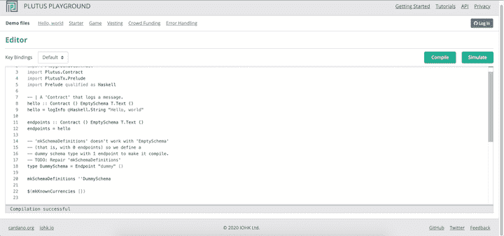
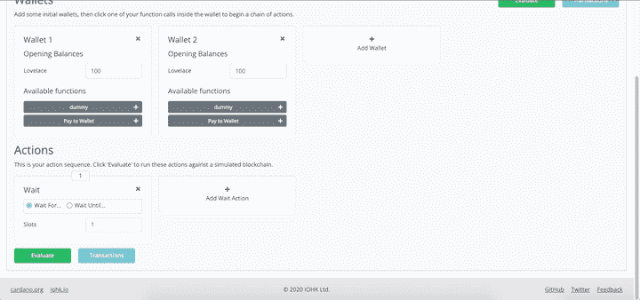
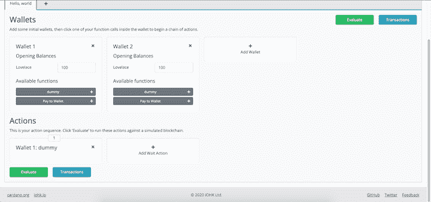
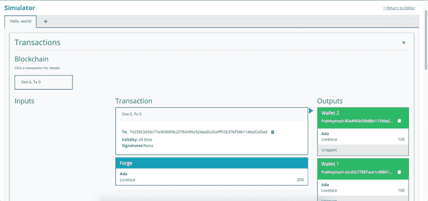
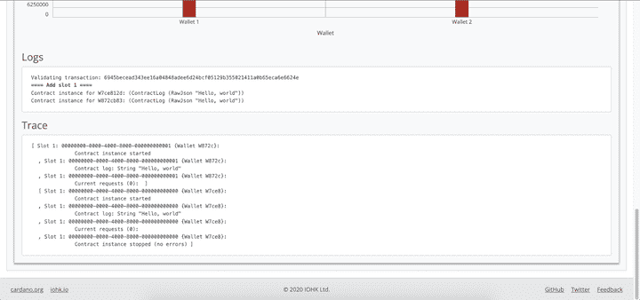
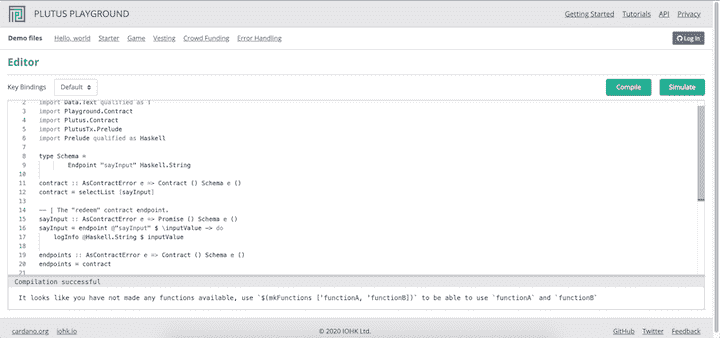
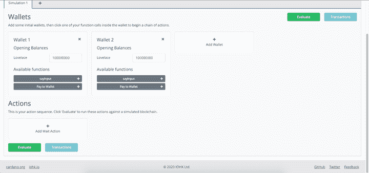
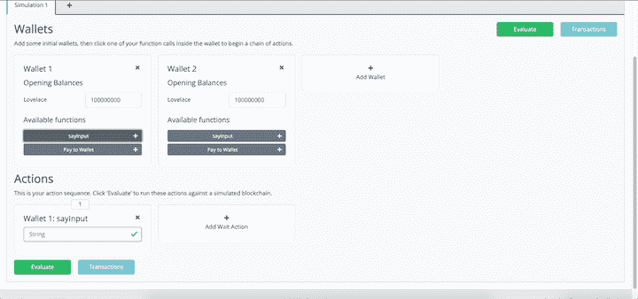

# 如何在卡尔达诺区块链博客上建立 DApps

> 原文：<https://blog.logrocket.com/how-to-build-dapps-cardano-blockchain/>

卡尔达诺区块链是 2022 年崛起最快、应用最广的区块链之一。卡尔达诺区块链是第三代，证明股份区块链平台和 ADA 加密货币的家。

在本教程中，我们将向您展示如何建立一个卡尔达诺区块链 DApp。我们将讨论以下内容:

我们开始吧🎉

## 卡尔达诺是什么？

卡尔达诺区块链是基于 T2 谢利共识算法的新区块链。它旨在成为一个安全、可伸缩且易于使用的平台，用于构建和运行分散的应用程序。

Shelley 是一个软件堆栈，它在底层区块链之上提供了一个抽象层。

## 什么是区块链？

区块链是一个分布式数据库，记录通过一系列密码证明链接在一起。这些记录被称为块；区块链是一堆积木。

以太坊是基于[以太坊虚拟机](https://ethereum.org/)的区块链。为了在以太坊区块链进行交易，我们将花费一些以太。这是一种加密货币，用于支付区块链以太坊的汽油费用。

同样，在卡尔达诺区块链，我们将花阿达支付汽油费。

## 什么是 DApps？

分散、分布式应用程序是不受单个实体控制的应用程序。除此之外，DApp 就像任何传统的应用程序。DApp 可以是 web 应用程序、命令行应用程序、桌面应用程序或移动应用程序。

DApp 和传统应用之间的区别在于，传统应用由单个实体控制。DApp 有一个区块链作为它的后端。

例如，一个 React to-do 应用程序可能将其数据(待办事项)存储在以太坊区块链中。或者，你可以在 Angular 中建立一个投票系统，并将它的数据存储在卡尔达诺区块链中。

## 阿达是什么？

如上所述，ADA 是卡尔达诺区块链的本地加密货币。你可以在卡尔达诺区块链上使用和传输 ADA，就像在以太坊区块链上一样。

ADA 既可以作为加密货币，也可以作为代币。阿达被用作卡尔达诺的本国货币意味着它是:

*   作为费用支付被接受
*   接受存款
*   奖励分配的唯一货币

就像 ETH 分为教派一样(如魏)，ADA 也有教派。Lovelace 是 ADA 的最小单位；1 阿达等于 10^(-18)洛夫莱斯，总共可分为 1，000，000 个洛夫莱斯。

## 卡尔达诺和土著代币

卡尔达诺区块链使建立本地令牌成为可能。这些代币可以用来代表一个价值，并在卡尔达诺区块链上交易。

令牌可以是可替换的，也可以是不可替换的。可替换令牌代表一个值，而不可替换令牌代表现实世界中的项目(例如，一辆汽车或一件艺术品)。

在接下来的章节中，我们将介绍如何使用普路托斯编程语言在卡尔达诺区块链上编写和创建智能合同。

## 什么是普路托斯？

普路托斯是一种用于在卡尔达诺区块链上编写智能合同的编程语言。你可以为卡达诺区块链使用的其他编程语言包括[辉光郎](https://testnets.cardano.org/en/programming-languages/glow/)、[马洛](https://testnets.cardano.org/en/programming-languages/marlowe/)等。，但普路托斯是其中最快的。

普路托斯是基于 Haskell 的，所以使用它需要事先了解 Haskell 编程。

## 使用普路托斯撰写智能合同

让我们来看看如何使用普路托斯编程语言编写智能合同。这些应用程序可以离线运行，并管理活动的合同实例。

根据 [Cardano Testnets](https://testnets.cardano.org/en/programming-languages/plutus/overview/) 的说法，普路托斯合同由运行在区块链上的部分(链上代码)和运行在用户机器上的部分(链外或客户代码)组成。我们将在[普路托斯在线编辑器和模拟器](https://playground.plutus.iohkdev.io/)中编写我们的智能合同。

普路托斯智能合约是运行在用户钱包中的 Haskell 代码，它将代码发送到区块链，由区块链中的节点运行。智能合约在区块链上运行，而不是在用户的机器上。

普路托斯智能合同具有用于定义智能合同及其状态的定义。这些定义中包含端点，它们定义了智能合约的行为。这些端点是由钱包执行的功能。它们被称为链外函数，用于构建事务并将它们发送到区块链。

## 例如:写一句“你好，世界！”普路托斯的应用程序

让我们用普路托斯编程语言在卡尔达诺区块链写一个简单的 DApp。

* * *

### 更多来自 LogRocket 的精彩文章:

* * *

我们将编写一个智能合同，打印“Hello，World！”到控制台。

打开[普路托斯在线编辑器和模拟器](https://playground.plutus.iohkdev.io/)。

```
import Data.Text qualified as T
import Playground.Contract
import Plutus.Contract
import PlutusTx.Prelude
import Prelude qualified as Haskell

-- | A 'Contract' that logs a message.
hello :: Contract () EmptySchema T.Text ()
hello = logInfo @Haskell.String "Hello, world"

endpoints :: Contract () EmptySchema T.Text ()
endpoints = hello

type DummySchema = Endpoint "dummy" ()

mkSchemaDefinitions ''DummySchema

$(mkKnownCurrencies [])

```

上面已经为我们填充了。让我们看一下代码:

```
import Data.Text qualified as T
import Playground.Contract
import Plutus.Contract
import PlutusTx.Prelude
import Prelude qualified as Haskell

```

这里，我们导入了我们将需要的库和内置函数:

*   `Data.Text`库用于将字符串转换成文本
*   `Playground.Contract`导入操场中定义的智能合约接口
*   `Plutus.Contract`库用于定义来自普路托斯核心库的智能合同
*   `PlutusTx.Prelude`库取代了普通的 Haskell Prelude 库，并包含了一些函数，这些函数经过了优化，更容易被`PlutusTx`编译器编译

```
hello :: Contract () EmptySchema T.Text ()
hello = logInfo @Haskell.String "Hello, world"
```

上面定义了一个`hello`函数。`Contract () EmptySchema T.Text ()`告诉编译器函数将不返回任何内容。`logInfo`功能是一个内置的功能，它向控制台记录一条消息。综上所述。`hello`功能会将`Hello, world`记录到控制台。

```
endpoints :: Contract () EmptySchema T.Text ()
endpoints = hello

```

这创建了一个`endpoints`函数，它将用于运行`hello`函数。这将`hello`功能暴露给了区块链。

```
type DummySchema = Endpoint "dummy" ()

mkSchemaDefinitions ''DummySchema

$(mkKnownCurrencies [])

```

上面创建了`DummySchema`类型，用于定义智能契约的状态。最后，它向区块链公开端点。

在我们普路托斯的操场上，我们可以点击绿色的**编译**按钮来编译我们的合同。蓝色的**模拟**按钮将打开一个页面，我们可以在这里运行区块链上的智能合约。



点击绿色的**编译**按钮。成功编译后，蓝色的**模拟**按钮将打开一个页面，我们可以在该页面上运行区块链上的智能合约:




你会注意到我们有两个钱包，每个都有 100 Lovelaces 的未结余额。每个钱包中的`Available functions`将显示可供使用的功能。

在我们的例子中，我们看到我们的`hello`函数和另一个`Pay to Wallet`函数。`Pay to Wallet`功能用于将资金发送到另一个钱包，它是由普路托斯契约定义的。我们看不到代码，因为它是在我们导入以下模块时添加的:

```
import Playground.Contract
import Plutus.Contract

```

如果我们查看页面的下半部分，我们会看到一个**操作**部分。当点击上面的钱包地址卡时，我们要运行的功能就添加到这个部分。

我们已经在**动作**中有了一张卡片，这张卡片模拟了区块链上的延迟。我们可以通过点击“X”图标来移除这张卡。

现在，点击**虚拟**按钮，你会看到一张卡片出现在**动作**部分:



点击绿色的**评估**按钮，您将看到`hello`功能在区块链上运行。一段时间后，会出现一个`Transactions`页面:



向下滚动到**日志**部分，您将看到控制台的`hello`功能日志`Hello, world`:



## 示例:使用`sayInput`功能

让我们编写另一个程序，它将获取一个字符串并将其打印到控制台。

将以下代码添加到您的普路托斯在线编辑器中:

```
import Data.Text qualified as T
import Playground.Contract
import Plutus.Contract
import PlutusTx.Prelude
import Prelude qualified as Haskell

type Schema =
        Endpoint "sayInput" Haskell.String

contract :: AsContractError e => Contract () Schema e ()
contract = selectList [sayInput]

-- | The "sayInput" contract endpoint.
sayInput :: AsContractError e => Promise () Schema e ()
sayInput = endpoint @"sayInput" $ \inputValue -> do
    logInfo @Haskell.String $ inputValue

endpoints :: AsContractError e => Contract () Schema e ()
endpoints = contract

mkSchemaDefinitions ''Schema

$(mkKnownCurrencies [])

```

我们已经看到了代码的第一部分；这里，我们导入了运行应用程序所需的库。

接下来，我们定义了一个`Schema`类型。此类型用于定义智能合约的状态。之后，我们建立了一个契约端点列表，并添加了`sayInput`端点。

我们还定义了`sayInput`端点，它接受一个字符串作为输入，并将其记录到控制台。

最后，我们让端点对区块链可用。

点击绿色的**编译**按钮。成功编译后，您应该会看到:



点击蓝色的**模拟**按钮。这将打开一个页面，我们可以在其中运行区块链上的智能合约。



注意，我们对钱包地址使用了`sayInput`函数。点击它。

`sayInput`功能将出现在**动作**部分:



现在，在输入字段中输入任意字符串，并点击`Evaluate`按钮:


您将在`Transactions`页面中看到您输入的字符串。

## 结论

在本教程中，我们演示了如何使用普路托斯编程语言在卡尔达诺区块链上编写一个 DApp。

我们从介绍卡尔达诺区块链和普路托斯编程语言开始。接下来，我们通过将卡尔达诺与以太坊区块链相比较来解释它。然后，我们介绍了普路托斯编程语言，并描述了如何使用它在卡尔达诺区块链上编译和运行智能合约。

最后，我们浏览了一些用普路托斯编程语言编写的智能合约的例子，并在模拟的卡尔达诺区块链上运行。

## 加入像 Bitso 和 Coinsquare 这样的组织，他们使用 LogRocket 主动监控他们的 Web3 应用

影响用户在您的应用中激活和交易的能力的客户端问题会极大地影响您的底线。如果您对监控 UX 问题、自动显示 JavaScript 错误、跟踪缓慢的网络请求和组件加载时间感兴趣，

[try LogRocket](https://lp.logrocket.com/blg/web3-signup)

.

[](https://lp.logrocket.com/blg/web3-signup)[https://logrocket.com/signup/](https://lp.logrocket.com/blg/web3-signup)

LogRocket 就像是网络和移动应用的 DVR，记录你的网络应用或网站上发生的一切。您可以汇总和报告关键的前端性能指标，重放用户会话和应用程序状态，记录网络请求，并自动显示所有错误，而不是猜测问题发生的原因。

现代化您调试 web 和移动应用的方式— [开始免费监控](https://lp.logrocket.com/blg/web3-signup)。