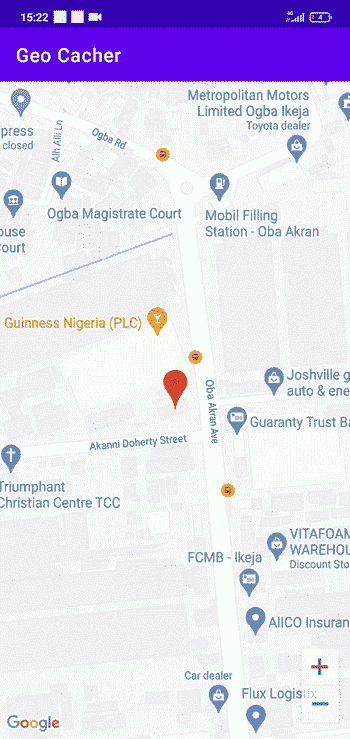
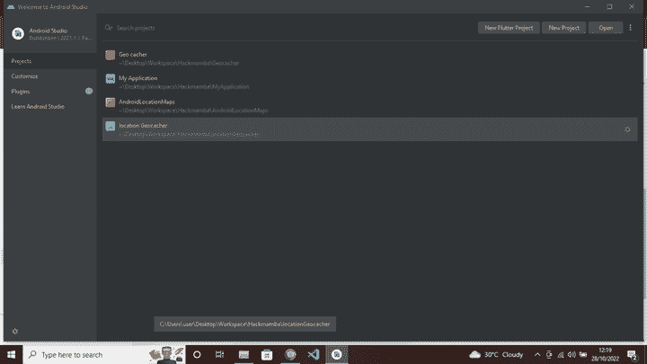
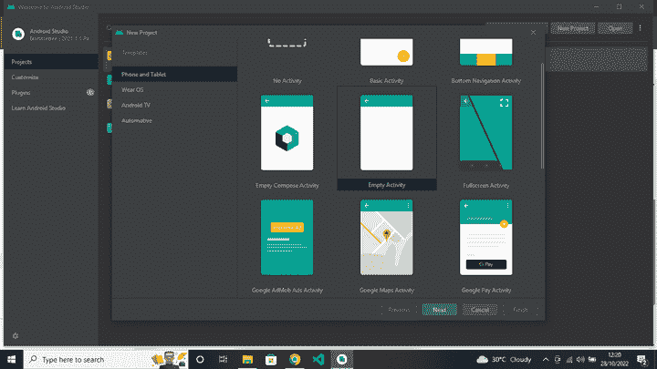
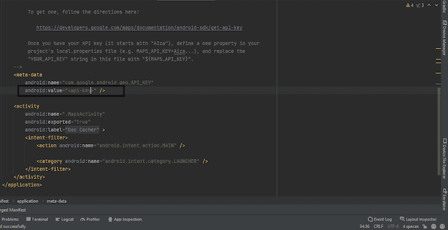
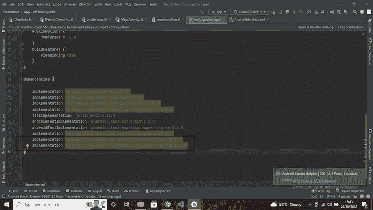
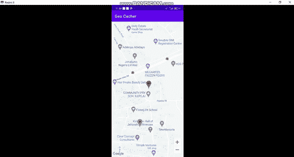

# 如何使用 Android 的融合位置构建地理藏宝应用

> 原文：<https://blog.logrocket.com/how-to-build-geocaching-app-androids-fused-location/>

根据牛津词典，地理藏宝是指“一项活动或消遣，其中一个项目或一个装有几个项目的容器被隐藏在一个特定的位置，以便 GPS 用户使用互联网上发布的坐标找到。”

对于地理藏宝应用程序，我们希望应用程序在用户位于项目 a 的特定半径范围内时通知用户。假设用户(由标记表示)将项目存储在由另一个标记表示的坐标中。在这种情况下，项目的标记是静态的，而用户的标记是动态的。

使用 Android 中的融合位置库，我们可以构建一个地理藏宝应用程序，提供关于当前用户坐标的后台服务通知。如果用户在缓存的五英里半径范围内，他们将收到通知，如果他们靠近或远离该项目，将继续更新距离计算。

在本教程结束时，我们的应用程序将如下所示:



向前跳:

## 先决条件

读者需要在其特定设备上安装[Android](https://developer.android.com/studio?gclid=Cj0KCQjw--2aBhD5ARIsALiRlwCoYCg3Mx_u8KzH64Fklt5kQGDUdg6MUGPwmcTH1ktpLeoyPIdCjLgaApS-EALw_wcB&gclsrc=aw.ds#downloads)[S](https://developer.android.com/studio?gclid=Cj0KCQjw--2aBhD5ARIsALiRlwCoYCg3Mx_u8KzH64Fklt5kQGDUdg6MUGPwmcTH1ktpLeoyPIdCjLgaApS-EALw_wcB&gclsrc=aw.ds#downloads)[tudio](https://developer.android.com/studio?gclid=Cj0KCQjw--2aBhD5ARIsALiRlwCoYCg3Mx_u8KzH64Fklt5kQGDUdg6MUGPwmcTH1ktpLeoyPIdCjLgaApS-EALw_wcB&gclsrc=aw.ds#downloads)代码编辑器和 Kotlin。

## 入门指南

我们将从创建一个谷歌`MapFragment`开始。为此，创建一个新的 Android Studio 项目。选择**谷歌地图活动**作为您的模板，并填写我们的应用名称和包名称。这样做可以减少很多流程，因为现在我们只需要从 Google 控制台获取一个 API 键:






接下来，我们将前往 [Google 开发者控制台](https://console.cloud.google.com/apis)获取 API 密钥。

然后，选择**创建凭证**和 **API key** 来创建 API key:

复制我们新创建的键，转到`AndroidManifest.xml`文件，用关键字 API key 将它粘贴到元数据标签属性`value`:



## 创建功能

按照上面的步骤操作后，我们只剩下一个由 Android Studio 自动创建的自定义谷歌地图了。在本节中，我们希望使用`fusedlcation` API 为用户获得连续的位置更新，即使在关闭应用程序之后。我们将通过后台通知更新来实现这一点。

首先，转到模块`build.gradle`文件，添加下面的依赖项:

```
implementation 'com.google.android.gms:play-services-location:20.0.0'
implementation "org.jetbrains.kotlinx:kotlinx-coroutines-android:1.3.9"

```



接下来，返回到`AndroidManifest.xml`文件，在 applications 标签的正上方设置以下权限:

```
<uses-permission android:name="android.permission.INTERNET" />
<uses-permission android:name="android.permission.ACCESS_COARSE_LOCATION" />
<uses-permission android:name="android.permission.ACCESS_FINE_LOCATION" />
<uses-permission android:name="android.permission.FOREGROUND_SERVICE" />

```

### 创建抽象和权限设置

我们不想打开一个应用程序，并自动获得位置访问(好吧，应用程序不这样工作)。相反，我们希望客户端得到一个通知，要求访问一些系统设置。

我们将构建一个接口文件，抽象出根文件夹中的位置更新，并将其命名为`ClientInfo.kt`。在该接口中，我们将创建一个函数，其参数 interval 指定了我们希望位置更新的频率。该函数将从我们之前添加到依赖项的协程库中返回一个类型为`Location`的`Flow`。

我们还将创建一个类，以便在 GPS 关闭时传递消息:

```
interface ClientInfo {
    fun getLocationUpdates(interval: Long): Flow<Location>

    class LocException(message: String): Exception()
}

```

现在，我们需要展示`ClientInfo`的实现。因此，在同一个根文件夹中，创建一个名为`DefaultClientInfo.kt`的类文件，它将实现我们上面声明的接口(`ClientInfo`)。该类将接受两个构造函数参数:`Context`和`FusedLocationProviderClient`。

接下来，我们将覆盖`getLocationUpdates`函数，并使用 *`callbackFlow`* 实例，我们将首先检查用户是否接受了位置许可。我们将通过在同一个根文件夹中创建一个名为`ExtendContext.kt`的实用程序文件来编写一个返回布尔值的扩展函数。

该函数将检查是否授予了`COARSE`和`FINE_LOCATION`权限:

```
fun Context.locationPermission(): Boolean{
    return  ContextCompat.checkSelfPermission(
        this,
        Manifest.permission.ACCESS_COARSE_LOCATION
    )== PackageManager.PERMISSION_GRANTED &&
            ContextCompat.checkSelfPermission(
                this,
                Manifest.permission.ACCESS_FINE_LOCATION
            ) == PackageManager.PERMISSION_GRANTED
}

```

如果用户有允许的权限，我们想检查他们是否可以使用`SytemService LocationManager`获取他们的位置(如果位置被启用)。

现在我们可以获取用户的位置，我们需要创建一个请求来指定获取用户位置的频率和数据的准确性。此外，我们将创建一个回调函数，每当[F](https://developers.google.com/android/reference/com/google/android/gms/location/FusedLocationProviderClient)usedLocationProviderClient 获取一个新位置时，该回调函数将使用`onLocationResult`函数。

最后，我们将使用`fusedlocation.requestLocationUpdates`方法调用回调函数、请求和一个 looper。下面是实现过程:

```
class DefaultClientInfo(
    private val context:Context,
    private val fusedlocation: FusedLocationProviderClient
):ClientInfo{

    @SuppressLint("MissingPermission")
    override fun getLocationUpdates(interval: Long): Flow<Location> {
        return callbackFlow {
            if(!context.locationPermission()){
                throw ClientInfo.LocException("Missing Permission")
            }

            val locationManager = context.getSystemService(Context.LOCATION_SERVICE) as LocationManager
            val hasGPS = locationManager.isProviderEnabled(LocationManager.GPS_PROVIDER)
            val hasNetwork = locationManager.isProviderEnabled(LocationManager.NETWORK_PROVIDER)
            if(!hasGPS && hasNetwork){
                throw  ClientInfo.LocException("GPS is unavailable")
            }

            val locationRequest = LocationRequest.create().apply {
                setInterval(interval)
                fastestInterval = interval
                priority = Priority.PRIORITY_HIGH_ACCURACY
            }
            val locationCallback = object : LocationCallback(){
                override fun onLocationResult(result: LocationResult) {
                    super.onLocationResult(result)
                    result.locations.lastOrNull()?.let{ location ->
                        launch { send(location) }
                    }
                }
            }

            fusedlocation.requestLocationUpdates(
                locationRequest,
                locationCallback,
                Looper.getMainLooper()
            )

            awaitClose {
                fusedlocation.removeLocationUpdates(locationCallback)
            }
        }
    }
}

```

### 创建前台服务

为了创建前台服务，我们将在我们的根项目中创建另一个名为`locservices.kt`的类文件，并使它从服务类继承。使用协程，我们将创建一个绑定到服务生命周期的`serviceScope`，调用我们之前创建的`ClientInfo`抽象，以及一个存储缓存坐标信息的类。

```
class LocServices: Service(){

    private val serviceScope = CoroutineScope(SupervisorJob() + Dispatchers.IO)
    private lateinit var clientInfo: ClientInfo

}

```

接下来，我们将创建一个返回`null`的`onBind`函数，因为我们没有将服务绑定到任何东西。然后，我们将使用`onCreate`函数来调用`DefaultClientInfo`类，其中我们将提供`*applicationContext*`和
`LocationServices.getFusedLocationProviderClient(*applicationContext*)`作为参数。

```
class LocServices: Service(){

    // do something

    override fun onBind(p0: Intent?): IBinder? {
        return null
    }

    override fun onCreate() {
        super.onCreate()
        clientInfo = DefaultClientInfo(
            applicationContext,
            LocationServices.getFusedLocationProviderClient(applicationContext)
        )
    }
}

```

现在，我们将创建一个`companion object`，并在其中创建一个常量值`START`，当我们想要开始跟踪时，我们会将它发送给服务。然后，我们将调用服务的`onStartCommand()`函数，并提供我们之前创建的常量作为链接到`start()`函数的`intent`:

```
class LocServices: Service(){

    override fun onStartCommand(intent: Intent?, flags: Int, startId: Int): Int {
        when(intent?.action){
            START -> start()
        }
        return super.onStartCommand(intent, flags, startId)
    }

    @SuppressLint("NewApi")
    private fun start(){
    }

    companion object{
        const val START = "Start"
    }
}

```

`start`函数将处理通知，以提醒用户他们的位置正被主动监控。这意味着我们想要提供给用户的信息是他们和缓存之间的距离(以米为单位)。为此，我们将使用[Ha](https://en.wikipedia.org/wiki/Haversine_formula)正矢公式，该公式使用球面上两点的坐标来计算它们之间的距离。

因此，使用我们的`callbackflow`，我们将调用`clientInfo.getLocationUpdates(interval)`方法，并使用`coroutines`提供的`onEach`方法，我们将能够获得更新的纬度和经度。

正如我们前面所说的，我们希望用户知道他们和缓存之间的距离，但是有一个问题。我们不希望用户不断收到通知，告诉他们与缓存之间的距离。

因此，我们将创建一个条件语句，检查用户是否在缓存的一千米半径内。如果为真，用户将得到一个持续的通知，通知他们是否离缓存更远或更近。一旦他们进入 50 米半径范围内，他们会收到不同的消息通知，并且服务会停止:

```
class LocServices: Service(){

    @SuppressLint("NewApi")
    private fun start(){
        val notif = NotificationCompat.Builder(this, "location")
            .setContentTitle("Geocaching")
            .setContentText("runnning in the background")
            .setSmallIcon(R.drawable.ic_launcher_background)
            .setOngoing(true)
        val notificationManager = getSystemService(Context.NOTIFICATION_SERVICE) as NotificationManager

        clientInfo
            .getLocationUpdates(1000L)
            .catch { e -> e.printStackTrace() }
            .onEach { location ->
                val lat1 = location.latitude
                val long1 = location.longitude
                val radius = 6371 //in km
                val lat2 = secrets.d
                val long2 = secrets.d1
                val dlat = Math.toRadians(lat2 - lat1)
                val dlong = Math.toRadians(long2 - long1)
                val a = sin(dlat / 2) * sin(dlong / 2) + cos(Math.toRadians(lat1)) * cos(Math.toRadians(lat2)) * sin(dlong / 2) * sin(dlong / 2)
                val c = 2 * asin(sqrt(a))
                val valuresult = radius * c
                val km = valuresult / 1
                val meter = km * 1000
                val truemeter = String.format("%.2f", meter)
                if (meter > 100 && meter <= 1000){
                    val updatednotif = notif
                        .setContentText("You are $truemeter meters away")
                    notificationManager.notify(1, updatednotif.build())
                }
                if (meter < 100){
                    val getendnotice = notif
                        .setContentText("You are $truemeter meters away, continue with your search")
                        .setOngoing(false)
                    notificationManager.notify(1, getendnotice.build())
                    stopForeground(STOP_FOREGROUND_DETACH)
                    stopSelf()
                }
            }
            .launchIn(serviceScope)
        startForeground(1, notif.build())
    }
}

```

最后，我们将创建一个`onDestroy`函数，当我们关闭应用程序或清除系统缓存时，该函数会取消服务。下面是代码的实现:

```
class LocServices: Service(){
    override fun onDestroy() {
        super.onDestroy()
        serviceScope.cancel()
    }
}

```

现在我们已经准备好前台服务，我们将返回到`AndroidManifest.xml`文件和元数据标签正上方的标签:

```
<service android:name=".fusedLocation.LocServices"
    android:foregroundServiceType = "location"/>

```

### 通知渠道

如果我们想为用户到缓存的距离创建一个通知，我们需要创建一个通道来发送通知。让我们首先创建一个名为`LocationApp.kt`的类，我们将创建一个`Application()`。

在`onCreate`函数中，我们将从 Android oreo OS 向上创建一个通知通道。代码如下所示:

```
class LocationApp: Application() {

    override fun onCreate() {
        super.onCreate()
        if (Build.VERSION.SDK_INT >= Build.VERSION_CODES.O) {
            val channel = NotificationChannel(
                "location",
                "Location",
                NotificationManager.IMPORTANCE_LOW
            )
            val notificationManager = getSystemService(Context.NOTIFICATION_SERVICE) as NotificationManager
            notificationManager.createNotificationChannel(channel)
        }
    }
}

```

最后，我们将属性添加到下面的`AndroidManifest.xml`文件的应用程序标签中:

```
android:name=".fusedLocation.LocationApp"

```

### MapsActivity.kt

当我们创建 Google Maps 活动时，我们得到了一个`MapsActivity.kt`文件，而不是常规的`MainActivity.kt`。这个文件处理带有标记的地图的创建。我们需要对此做一些改变。所以，让我们创建三个`private lateinit`变量:`LocationCallback`、`LocationRequest`和`FusedLocationProviderClient`。

接下来，我们将创建三个函数；`launchintent`、`getupdatedlocation`和`startupdate`。我们将在`onMapReady`回调函数中调用它们。

`launchintent`函数处理位置许可请求，`getupdatedlocation`函数取`LocationRequest`和`LocationCallback`。`getupdatedlocation`函数也将使用它的意图来处理启动函数的调用。

最后，在`startupdate`函数中，我们将使用`fusedlocation.requestLocationUpdates`方法来调用回调函数、请求和一个循环(设置为 null)。

下面是代码的样子:

```
class MapsActivity : AppCompatActivity(), OnMapReadyCallback{

    companion object{
        private var firsttime = true
    }

    private lateinit var mMap: GoogleMap
    private lateinit var binding: ActivityMapsBinding
    private lateinit var locationCallback: LocationCallback
    private lateinit var locationRequest: LocationRequest
    private lateinit var fusedLocationProviderClient: FusedLocationProviderClient
    private var mMarker: Marker? = null
    private var secrets = Secretlocation()

    override fun onCreate(savedInstanceState: Bundle?) {
        super.onCreate(savedInstanceState)

        binding = ActivityMapsBinding.inflate(layoutInflater)
        setContentView(binding.root)
        fusedLocationProviderClient = LocationServices.getFusedLocationProviderClient(this)

        // Obtain the SupportMapFragment and get notified when the map is ready to be used.
        val mapFragment = supportFragmentManager
            .findFragmentById(R.id.map) as SupportMapFragment
        mapFragment.getMapAsync(this)
    }

    private fun launchintent() {
        ActivityCompat.requestPermissions(
            this,
            arrayOf(
                Manifest.permission.ACCESS_COARSE_LOCATION,
                Manifest.permission.ACCESS_FINE_LOCATION
            ),
            0
        )
    }

    private fun getupdatedlocation(){
        locationRequest = LocationRequest.create().apply {
            interval = 10000
            fastestInterval = 5000
            priority = Priority.PRIORITY_HIGH_ACCURACY
        }

        locationCallback = object : LocationCallback(){
            override fun onLocationResult(result: LocationResult) {
                if (result.locations.isNotEmpty()){
                    val location = result.lastLocation
                    if (location != null){
                        mMarker?.remove()
                        val lat1 = location.latitude
                        val long1 = location.longitude
                        val d = secrets.d
                        val d1 = secrets.d1
                        val latlong = LatLng(lat1, long1)
                        val stuff = LatLng(d, d1)

                        val stuffoption= MarkerOptions().position(stuff).title("$stuff").icon(
                            BitmapDescriptorFactory.defaultMarker(BitmapDescriptorFactory.HUE_ORANGE))
                        mMarker = mMap.addMarker(stuffoption)
                        val markerOptions = MarkerOptions().position(latlong).title("$latlong")
                        mMarker = mMap.addMarker(markerOptions)
                        if (firsttime){
                            mMap.animateCamera(CameraUpdateFactory.newLatLngZoom(latlong, 17f ))
                            firsttime = false
                        }
                    }
                }
            }
        }
        Intent(applicationContext, LocServices::class.java).apply {
            action = LocServices.START
            startService(this)
        }
    }

    @SuppressLint("MissingPermission")
    private fun startupdate(){
        fusedLocationProviderClient.requestLocationUpdates(
            locationRequest,
            locationCallback,
            null
        )
    }

    override fun onMapReady(googleMap: GoogleMap) {
        mMap = googleMap
        launchintent()
        getupdatedlocation()
        startupdate()
        mMap.uiSettings.isZoomControlsEnabled = true
    }
}

```

当我们运行我们的应用程序时，我们应该得到下面的结果:



## 结论

在本教程中，我们使用 Android 的融合位置库创建了一个地图，它会不断更新用户在地图上的位置。我们还创建了一个前台服务来确定用户和特定物品之间的距离。最后，我们创建了一个通知，每当我们的用户接近缓存。

感谢您的阅读，祝您编码愉快！

## LogRocket :即时重现你的安卓应用中的问题。

[](https://lp.logrocket.com/blg/kotlin-signup)

[LogRocket](https://lp.logrocket.com/blg/kotlin-signup) 是一款 Android 监控解决方案，可以帮助您即时重现问题，确定 bug 的优先级，并了解您的 Android 应用程序的性能。

LogRocket 还可以向你展示用户是如何与你的应用程序互动的，从而帮助你提高转化率和产品使用率。LogRocket 的产品分析功能揭示了用户不完成特定流程或不采用新功能的原因。

开始主动监控您的 Android 应用程序— [免费试用 LogRocket】。](hhttps://lp.logrocket.com/blg/kotlin-signup)