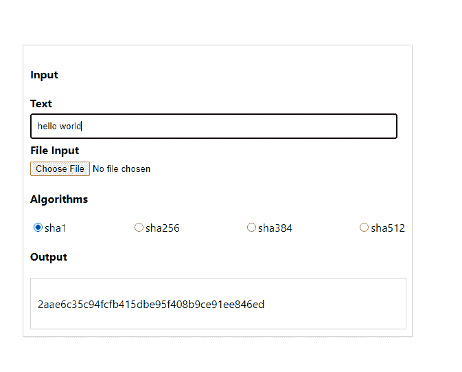

# 如何用 React 构建一个哈希生成器应用程序

> 原文：<https://blog.logrocket.com/how-to-build-hash-generator-application-react/>

## 介绍

哈希函数通常用于生成数据的数字指纹。

哈希在区块链中使用得最多，它使用交易信息(如发送的金额、交易时间戳以及发送和接收地址)来生成交易 ID。这些信息被组合起来，并通过散列函数产生 ID，用于识别交易是否已经发生。因此，这个 ID 应该是不可变的、惟一的、安全的，并且没有冲突。

哈希也用于产生安全的密码算法。在任何数据库中存储纯文本都会造成重大的安全威胁。每当用户使用纯文本密码注册时，都会根据哈希算法运行密码，哈希值保存在服务器中。

当用户尝试使用他们注册时使用的密码登录时，该密码将再次通过相同的哈希算法进行传递。然后将新生成的哈希值与服务器上先前保存的哈希值进行比较。如果新计算的哈希与服务器上存储的哈希相同，则密码必须正确，并且用户被授予登录权限。

这个概念基于哈希函数术语，即相同的输入将总是提供相同的输出。这确保数据库中没有存储明文密码，从而确保用户、应用程序所有者或黑客之间没有用户数据泄露。

在本文中，我们将使用 React 实现一个哈希生成器应用程序。React 提供了交互式用户界面设计，允许您创建必要的组件，用户可以使用这些组件从文本和文件中生成哈希值。我们的实现将涉及 SHA-1、SHA-256、SHA-384 和 SHA-512 散列算法。

## 哈希是什么？

哈希是转换给定的随机输入值以生成完全唯一的密钥的过程。哈希使用称为哈希算法的特殊数学函数，也称为哈希函数，这是一种将输入值转换为固定长度、唯一且不可变的哈希字符串的计算。输入值可以是一个大数字、一长串文本或两者的组合。无论输入值的长度如何，该函数都将始终创建固定大小的输出。

## 什么是好的哈希算法？

有不同的散列算法可用于散列给定的输入。这包括 SHA-1、SHA-256、SHA-384 和 SHA-512 算法。一个好的哈希算法需要具备某些被认为有用的品质:

首先，每个哈希值必须是唯一的，这意味着不同的输入在任何给定的时间都不应该产生相同的值。这个概念被称为自由冲突，它表明实际上不可能产生重复的散列值。

哈希也应该有固定的大小。使用给定的散列技术，您应该总是获得固定大小的散列，而不管原始输入有多长。无论数据集是短还是长，哈希值的大小都保持不变。

接下来，散列函数应该能够快速生成散列值，并且应该总是随机的——对输入值的任何微小改变都应该总是生成完全不同的唯一值。

最后，散列算法应该是安全的；根据哈希值确定输入值几乎是不可能的。

> 哈希不同于数据加密的概念。哈希过程总是不可逆的，而加密数据是可逆的。加密旨在以两种方式发挥作用:您可以加密数据以确保其安全，也可以解密相同的数据以揭示原始输入。这意味着如果攻击者设法窃取了加密密钥，他们就可以解锁加密数据。这就是加密无法生成诸如区块链交易 id 之类的值的原因。

## 先决条件

要遵循本指南，必须具备以下条件:

*   哈希算法的工作知识
*   JavaScript 和 React 的工作知识
*   安装在电脑上的 [Node.js](https://nodejs.org/en/)

## 概观

## 设置 React 应用程序

为了设置我们的应用程序，我们将使用 [Create React App](https://reactjs.org/docs/create-a-new-react-app.html) ，这是 React 提供的命令行工具，用于方便地引导您的应用程序。这就创建了一个现成的 React 应用程序模板。

要执行创建 React 应用程序模板，请导航到您希望项目所在的文件夹。然后运行以下命令来初始化应用程序:

```
npx create-react-app hashing-app

```

一旦设置过程完成，您就可以通过启动开发服务器来测试模板应用程序。首先，将命令行改为指向新创建的应用程序目录:

```
cd hashing-app

```

然后使用以下 npm 命令启动服务器:

```
npm run start

```

在您的浏览器上打开`[http://localhost:3000](http://localhost:3000)`，您应该能够访问默认的 Create React App 登录页面。


## 设置哈希组件

在 React 中，组件代表用户界面的一部分。组件可以是页面、页眉、页脚、侧栏或包装其他组件的主组件。要使用 React 创建哈希应用，您需要设置一个组件，让用户能够与不同的哈希函数进行交互。

为此，导航到您的`src`文件夹，创建一个新目录，并将其命名为`components`。在`components`目录中，创建一个用于渲染 React 组件的`hashing.js`文件和一个用于样式化组件的`hashing.css`文件。

前往`hashing.js`创建您的组件，如以下步骤所示:

首先，设置导入和渲染功能:

```
import React,{useState} from 'react';
import './hashing.css';

export default function HashingForm(){

}

```

这里，我们导入`useState`钩子。在 React 中，组件中可以有一个状态，允许您构造其他状态。然后，我们可以使用该组件的状态来显示 render 函数内部的信息。

从这一步开始，剩下的代码将进入渲染`HashingForm()`函数。

让我们从设置初始状态开始:

```
const [algorithms] = useState(['sha1','sha256','sha384','sha512']);
let [text_input, setTextInput] = useState('');
let [file_input, setFileInput] = useState('');
let [algorithm, setAlgorithm] = useState('sha1');
let [output,setOutput] = useState('');

```

状态可以是一组值、布尔值、字符串、对象或组件使用的任何其他数据。这里我们用`useState`创建了一些变量。这将让我们在生成不同的散列算法时与这些变量存储的值进行交互。

接下来，设置各种`onChange`处理程序:

```
// For handling text input
const handleTextInput = async (e) => {

}

// For handling file input
const handleFileInput = (e) => {

}

// For handling algorithm change
const handleAlgorithmChange = async (e) => {

}

```

我们定义的初始状态保存的数据将根据用户交互和他们想要生成的哈希算法而改变。因此，我们必须设置上述处理程序来跟踪用户对事件的反应，比如单击按钮。

* * *

### 更多来自 LogRocket 的精彩文章:

* * *

现在，我们将像这样呈现输入字段:

```
return (
    <div className='hashing-container'>
        <div className='hashing-content'>

        // Start: Hashing form
            <div className="hashing-form">
                <h4 className="hashing-form-heading">Input</h4>
                <form>
                    <div className="form-group">
                        <label htmlFor="text-input">Text</label>
                        <input type="text" className="form-control" id="text-input" placeholder='Write some text' value={text_input} onChange={handleTextInput} />
                    </div>
                    <div className="form-group">
                        <label htmlFor="file-input">File Input</label>
                        <input type="file" className="form-control" id="file-input" onChange={handleFileInput} />
                    </div>
                </form>
            </div>
        // End: Hashing form

        </div>
    </div>
);

```

该模板将设置一个基本的用户输入，允许用户输入他们想要散列的不同数据。

接下来，在`hashing-form` div 下面的`hashing-content` div 中呈现散列算法:

```
// Start: Hashing algorithms
<div className="hashing-algorithms">
    <h4 className="hashing-algorithms-heading">Algorithms</h4>
    <div className="hashing-algorithms-list">
        {
            algorithms.map(algo => {
                return (
                    <div className="form-check" key={algo}>
                        <input className="form-check-input" type="radio" name="algorithm" id={algo} value={algo} checked={algorithm === algo} onChange={handleAlgorithmChange} />
                        <label className="form-check-label" htmlFor={algo}>
                            {algo}
                        </label>
                    </div>
                )
            }
            )}
    </div>
</div>
// End: Hashing algorithms

```

该模板允许用户选择他们想要使用的哈希算法。

接下来，我们将在`hashing-algorithms` div 下面的`hashing-container` div 中呈现散列输出:

```
// Start: Hashed output
<div className="hashed-output">
    <h4 className="hashed-algorithm-heading">Output</h4>
    <div className="hashed-algorithm-container">
        <p className="hashed-algorithm-text">
            {output}
        </p>
    </div>
</div>
// End: Hashed output

```

> 在复制和粘贴上面的代码模板时，记得删除`Start:`和`End:`注释，以确保它们不会在组件中呈现。

一旦用户输入了要散列的数据并选择了要使用的散列算法，我们希望捕获散列算法的输出并使用上面的模板显示它。

接下来是对我们创建的组件进行样式化。将以下样式添加到`hashing.css`文件中:

```
.hashing-container {
    width: 100%;
    height: 100vh;
    display: flex;
    justify-content: center;
    align-items: center;
}

.hashing-content {
    width: 40%;
    margin: 0px auto;
    padding: 10px;
    box-shadow: 0 1px 3px #d4d4d5, 0 0 0 1px #d4d4d5;
}

.form-group label {
    width: 100%;
    display: block;
    margin-bottom: 5px;
    font-weight: bold;
}

.form-group input[type="text"] {
    width: 94%;
    padding: 10px;
    border: 1px solid #d4d4d5;
    border-radius: 3px;
    margin-bottom: 5px;
}

.hashing-algorithms .hashing-algorithms-list {
    display: flex;
    justify-content: space-between;
}

.hashed-output .hashed-algorithm-container {
    width: 100%;
    border: 1px solid #d4d4d5;
}

.hashed-output .hashed-algorithm-text {
    padding: 10px;
    word-wrap: break-word;
    width: 90%;
}

```

转到`src`目录，编辑`App.js`主组件，如下所示:

```
import Hashing from './components/hashing'; // hashing component

function App() {
    return (
        <div className="App">
            <Hashing />
        </div>
    );
}

export default App;

```

从上面开始，我们导入并呈现`Hashing`组件作为页面的主要组件。

现在让我们测试一下所创建的组件是否如预期的那样工作。确保您的开发服务器启动并运行，并在浏览器上打开`[http://localhost:3000](http://localhost:3000)`。如果您的服务器没有运行，在前往`[http://localhost:3000](http://localhost:3000)`之前运行`npm run start`。

您的登录页面现在应该显示哈希组件，如下所示:


## 哈希文本

在本文中，我们将使用[加密哈希](https://www.npmjs.com/package/crypto-hash)，这是一个使用本地加密 API 的哈希包。
要将它安装到您的项目中，请打开一个指向您的项目文件夹的新终端，并运行以下命令:

```
npm install crypto-hash

```

在`src/components/hashing.js`中，将其添加到导入列表中:

```
import {sha1,sha256,sha384,sha512} from 'crypto-hash';

```

为了散列一个文本，我们将如下处理`handleTextInput` `onChange`处理程序:

```
const handleTextInput = async (e) => {
    // Get the value
    let value = e.target.value;

    let result = '';

    // Get the current active algorithm and hash the value using it.
    if (algorithm == 'sha1') {
        result = await sha1(value);
    } else if (algorithm == 'sha256') {
        result = await sha256(value);
    } else if (algorithm == 'sha384') {
        result = await sha384(value);
    } else if (algorithm == 'sha512') {
        result = await sha512(value);
    }

    // Set the hashed text as output
    setOutput(result);

    // Set the value of the text input
    setTextInput(value);
}

```

这将接受一个文本作为数据值，并根据用户的偏好对其进行散列。用户可以选择使用 SHA-1、SHA-256、SHA-384 或 SHA-512 散列算法。一旦文本被散列，我们将存储新值并更新`setTextInput`状态。这个新值将显示在输出部分。

为了测试这一点，请转到 React 散列页面，输入任何文本，您应该看到输出部分呈现了如下的散列文本:



## 哈希文件内容

类似地，为了散列文件内容，我们将对`handleFileInput` `onChange`处理程序进行如下操作:

```
const handleFileInput = (e) => {

    // Initializing the file reader
    const fr = new FileReader();

    // Listening to when the file has been read.
    fr.onload = async () => {

        let result = '';

        // Hashing the content based on the active algorithm
        if (algorithm == 'sha1') {
            result = await sha1(fr.result);
        } else if (algorithm == 'sha256') {
            result = await sha256(fr.result);
        } else if (algorithm == 'sha384') {
            result = await sha384(fr.result);
        } else if (algorithm == 'sha512') {
            result = await sha512(fr.result);
        }

        // Setting the hashed text as the output
        setOutput(result);

        // Setting the content of the file as file input
        setFileInput(fr.result);
    }

    // Reading the file.
    fr.readAsText(e.target.files[0]);
}

```

从您的计算机中选择任何一个`txt`文件，您应该能够看到如下散列内容:


## 处理算法开关

因为我们使用不同的算法，所以我们需要使用`handleAlgorithmChange` `onChange`处理程序来可视化各种算法的散列输出。

编辑处理程序，如下所示:

```
const handleAlgorithmChange = async (e) => {

    // Get the selected algorithm
    let value = e.target.value;

    let result = '';

    // Check if we have a text input
    if (text_input) {

        // Hash the text based on the selected algorithm
        if (value == 'sha1') {
            result = await sha1(text_input);
        } else if (value == 'sha256') {
            result = await sha256(text_input);
        }
        else if (value == 'sha384') {
            result = await sha384(text_input);
        }
        else if (value == 'sha512') {
            result = await sha512(text_input);
        }

    }

    // Check if we have a file input
    if (file_input) {

        // Hash the file content based on the selected algorithm
        if (value == 'sha1') {
            result = await sha1(file_input);
        } else if (value == 'sha256') {
            result = await sha256(file_input);
        } else if (value == 'sha384') {
            result = await sha384(file_input);
        } else if (value == 'sha512') {
            result = await sha512(file_input);
        }

    }

    // Set the selected algorithm
    setAlgorithm(value);

    // Set the hashed text
    setOutput(result);
}

```

现在输入一些文本或选择一个`.txt`文件并在算法之间切换，您应该会看到散列输出分别发生了变化。

继续尝试选择不同的散列，并了解不同的散列算法如何将文本字符串和文件转换为不同的值。

## 结论

本文是在 React 应用程序中创建和实现散列算法的分步指南。

哈希可以用在认证应用中，比如日志系统，因为哈希总是不可逆的。一旦生成，这些值就不能更改。每个哈希算法都有特定长度的哈希输出，在这种情况下，文件输入文本的长度无关紧要。哈希算法的目标是生成随机和唯一的哈希字符串，因此，对输入值的轻微更改总是会导致完全不同的哈希值。

在这个 [GitHub 库](https://github.com/Rose-stack/hash-generator-app-in-reactjs)上检查本文中使用的代码。

我希望这篇文章对你有帮助！

## 使用 LogRocket 消除传统反应错误报告的噪音

[LogRocket](https://lp.logrocket.com/blg/react-signup-issue-free)

是一款 React analytics 解决方案，可保护您免受数百个误报错误警报的影响，只针对少数真正重要的项目。LogRocket 告诉您 React 应用程序中实际影响用户的最具影响力的 bug 和 UX 问题。

[ ](https://lp.logrocket.com/blg/react-signup-general) [  ](https://lp.logrocket.com/blg/react-signup-general) [LogRocket](https://lp.logrocket.com/blg/react-signup-issue-free)

自动聚合客户端错误、反应错误边界、还原状态、缓慢的组件加载时间、JS 异常、前端性能指标和用户交互。然后，LogRocket 使用机器学习来通知您影响大多数用户的最具影响力的问题，并提供您修复它所需的上下文。

关注重要的 React bug—[今天就试试 LogRocket】。](https://lp.logrocket.com/blg/react-signup-issue-free)