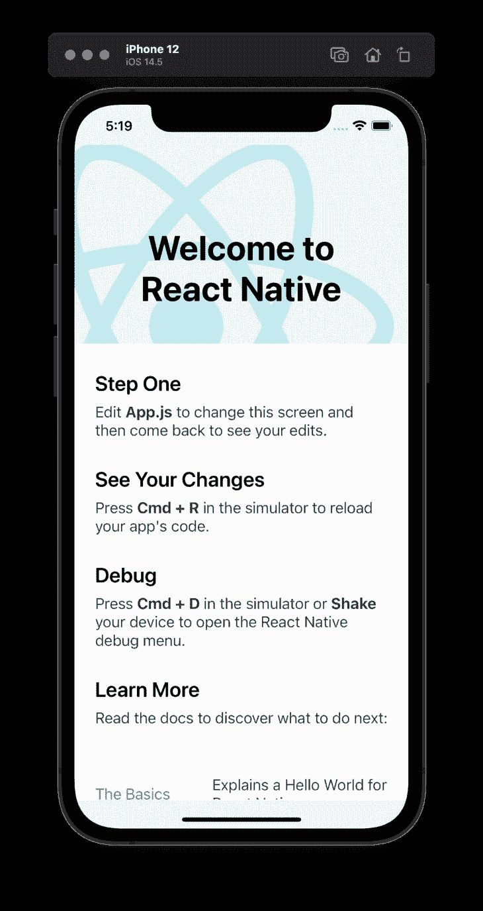
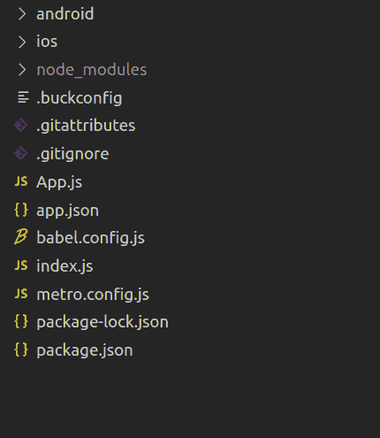
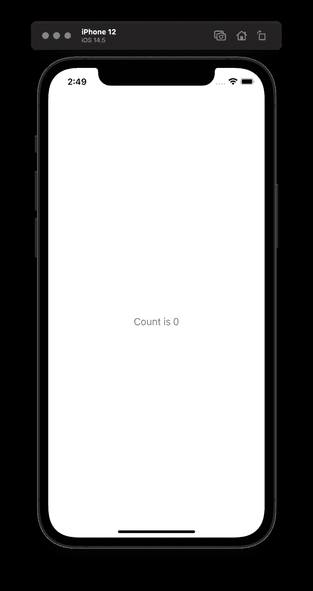
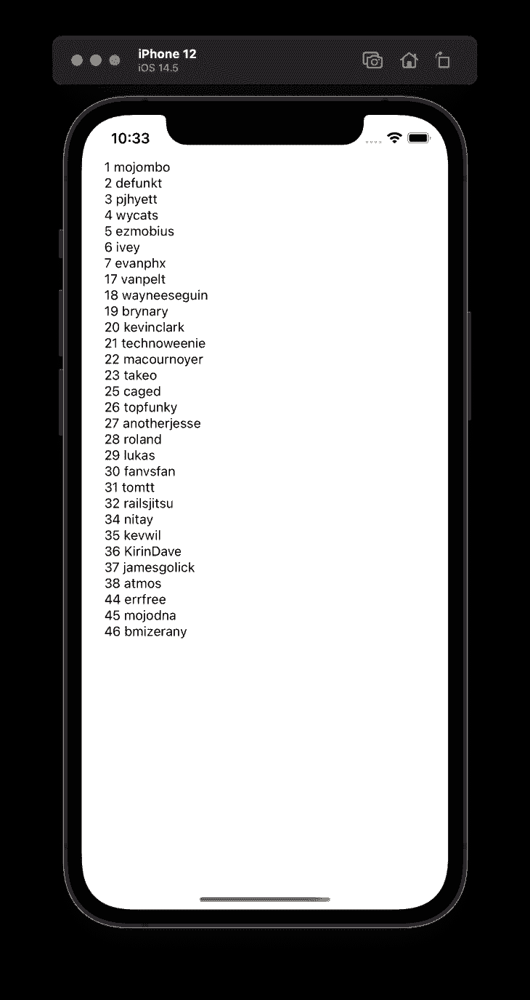
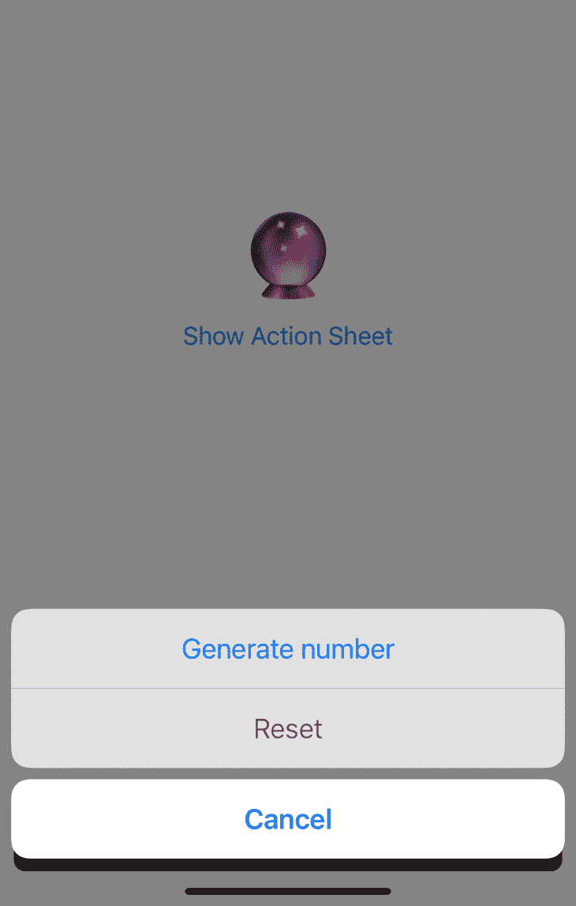

# 如何使用 React Native 构建 iOS 应用

> 原文：<https://blog.logrocket.com/how-to-build-ios-apps-using-react-native/>

React 对于创建大型应用程序非常简单高效。React Native 使您能够使用 React 构建可在 Android 和 iOS 上运行的移动应用程序。

在本教程中，我们将演示如何使用 React Native 构建 iOS 应用程序。

## 什么是 React Native？

React Native 使你能够使用 JavaScript 编写 Android 和 iOS 应用。它使用 React 的虚拟 DOM 概念来操作原生平台 UI 组件，为用户提供熟悉的体验。

构建 iOS 应用程序有两种方式:

*   React Native CLI:更复杂，但能让您更好地控制您的应用程序。它只能在 macOS 上构建
*   世博会:更容易举办，但占地面积更大。可以在所有桌面平台上使用

在本指南中，我们将同时使用这两种方法。

## 环境设置

### 在 macOS 上使用 React Native

[React Native CLI](https://www.npmjs.com/package/react-native-cli) 作为 npm 包提供。安装之前，请确定 Xcode 已安装在您的系统上。这是您构建本机 iOS 代码以供 React Native 使用的地方。第一步，从应用商店安装 [Xcode](https://apps.apple.com/us/app/xcode/id497799835?mt=12) 。


一旦 Xcode 安装完毕，我们就可以开始构建我们的应用了。我们将使用 [CocoaPods](https://cocoapods.org) 作为依赖项管理器，使用 [Watchman](https://formulae.brew.sh/formula/watchman) 来运行我们的项目:

```
brew install watchman #watches file changes and runs the project automatically
sudo gem install cocoapods #manages dependencies for Xcode projects
```

我们完了！要创建新的 React 本机项目，请运行以下命令:

```
npx react-native init myproject
```

应该在当前工作目录中创建一个新的`myproject`文件夹，其结构如下:

```
├── App.js
├── __tests__
├── android
├── app.json
├── babel.config.js
├── index.js
├── ios
├── metro.config.js
├── node_modules
├── package.json
└── yarn.lock
```

通过运行`npm run ios`启动项目。这将在 iOS 模拟器上启动应用程序。


### 使用 React Native for Windows/Linux

没有 MacOSX 机？没问题！我们可以使用 Expo CLI。要安装 Expo，请运行以下终端命令:

```
npm install -g expo-cli

```

现在我们已经下载了`expo-cli`，像这样初始化一个 Expo 存储库:

```
expo init myproject

```

这将构建一个项目向导，允许您从模板创建项目。在这里，选择`minimal`选项。


因此，这将在您的计算机上创建一个名为`myproject`的文件夹，其结构如下:



要运行您的 Expo 应用程序:

```
expo start

```

这将生成一个二维码，在你的 iOS 设备上运行该程序。


## 为 iOS 构建 React 原生应用

在开始处理特定于平台的 API 之前，为 iOS 和 Android 构建 React 原生应用的过程是相似的。大多数可用的 UI 元素都适用于 Android 和 iOS 平台。

React Native 提供了用于构建复杂 ui 的基本构建块元素。其中最重要的有:

*   `Text`用于显示应用程序中的文本，例如`<Text>Some Text</Text>`
*   `View`是一个支持布局和样式的容器，例如`<View><Text>Some Text</Text></View>`

您可以在 [React 原生文档](https://reactnative.dev/docs/components-and-apis)中找到按钮、列表、图像、样式、用户输入等核心组件和 API 的完整列表。

React 本机应用程序的入口点是`index.js`。这包含呈现应用程序的主要组件。

```
import {AppRegistry} from 'react-native';
import App from './App';
import {name as appName} from './app.json';
// registering the component to be rendered.
AppRegistry.registerComponent(appName, () => App);

```

## 反应原生成分

React 本机组件与 React 组件非常相似。React Native 中也提供了所有 React APIs。

让我们创建一个简单的增量按钮来更好地理解 React 本机 API:

```
import React, { useState } from 'react';

/* Import basic components from react native */
import {
  Button,
  SafeAreaView,
  StatusBar,
  View,
  Text,
  StyleSheet
} from 'react-native';

const App = () => {
/* using useState Hook for creating state*/
  const [count,setCount]=useState(0);
  return (
   /* using state in button and updating on click*/
    <SafeAreaView>
      <StatusBar/>
      <View style={styles.view}>
      {/* using state in button and updating on click*/}
        <Button onPress={()=>setCount(count+1)} title={`Count is ${count}`} />
      </View>
    </SafeAreaView>
  );
};

const styles = StyleSheet.create({
  view: {
    marginTop: "100%",
  },
});

export default App;

```

所有的 [React 钩子](https://blog.logrocket.com/react-hooks-the-good-the-bad-and-the-ugly/)都可以在 React Native 中使用。



## 拨打网络电话

与外部服务的通信对于任何应用程序都非常重要。React Native 提供了对平台 API 的统一抽象。这个例子用 React Native 提供的`Image`非常有效地演示了`fetch`的用法:

```
import React, { useEffect, useState } from "react";
import {
  ActivityIndicator,
  SafeAreaView,
  Text,
  View,
  Image,
} from "react-native";
function App() {
  // state for loading
  const [isLoading, setLoading] = useState(true);
  // state to hold fetched data
  const [data, setData] = useState(null);
  // use effect to fire up on component load
  useEffect(() => {
    fetch("https://random.dog/woof.json")
      .then((response) => response.json())
      // set the data
      .then((json) => setData(json.url))
      // if error log the error
      .catch((error) => console.error(error))
      // stop loading(by setting the isLoading false)
      .finally(() => setLoading(false));
  }, []);
  return (
    <View style={{ flex: 1, padding: 24 }}>
      <SafeAreaView />
      {/*Check if the photo is loading..*/}
      {isLoading ? <ActivityIndicator /> : <Photo data={data} />}
      <Text>{data}</Text>
    </View>
  );
}
//create our Photo component.
function Photo({ data }) {
  return (
    <View>
    {/*If the data prop is not undefined, display the image*/}
      {data ? (
        <Image
          style={{
            width: 350,
            height: 400,
          }}
          source={{
            uri: data,
          }}
        />
      ) : (
        <Text>No Image</Text>
      )}
    </View>
  );
}
export default App;

```


## 使用 npm 包

React Native 有一个庞大的开发人员社区，他们不断生产高质量的库来帮助完成各种任务。

为了演示如何在 React 原生 iOS 应用中集成第三方库，让我们使用一个流行的存储库为我们的应用添加缓存。[react-native-mmkv-storage](https://github.com/ammarahm-ed/react-native-mmkv-storage)用 C++编写。

由于 react-native-mmkv-storage 使用本机代码，安装过程与纯 JavaScript 模块略有不同。

首先，使用 npm 安装`react-native-mmkv-storage`:

```
npm install react-native-mmkv-storage
pod install #for iOS only 

```

现在使用`ios`目录中的`pod install`命令安装模块的本机部分。安装因模块而异。

在代码中使用库来存储从 API 返回的数据:

```
// App.js
import React, { useEffect, useState } from 'react';
import { ActivityIndicator, FlatList, SafeAreaView, Text, View } from 'react-native';
import { MMKV } from './storage';
export default App = () => {
  // state for loading
  const [isLoading, setLoading] = useState(true);
  // state to hold fetched data
  const [data, setData] = useState([]);
  // use effect to fire up on component load
  useEffect(() => {
    MMKV.getArrayAsync("data_val").then((cachedValue) => {
      if (cachedValue && cachedValue.length) {
        setData(cachedValue)
        return
      }
      fetch('https://api.github.com/users')
        .then((response) => response.json())
        // set the data
        .then(async (json) => {
          await MMKV.setArrayAsync("data_val", json)
          setData(json)
        })
        // if error log the error
        .catch((error) => console.error(error))
      // stop loading(by setting the isLoading false)
    }).finally(() => setLoading(false));
  }, [])
  return (
    <View style={{ flex: 1, padding: 24 }}>
      <SafeAreaView>
      </SafeAreaView>
      {/*Check if */}
      {isLoading ? <ActivityIndicator /> : (
        <FlatList
          data={data}
          keyExtractor={({ id }, index) => id}
          renderItem={({ item }) => (
            <Text>{item.id} {item.login}</Text>
          )}
        />
      )}
    </View>
  );
};

// storage.js
import MMKVStorage from "react-native-mmkv-storage"
export const MMKV = new MMKVStorage.Loader().initialize();

```



## 使用 React Native 提供的本机 API

React Native 围绕一些本地 API 提供了一个瘦包装器 JavaScript，包括`ActionSheetIOS`、`DynamicColorIOS`和`Settings`。

`Settings`用于在设备上存储键值对。`ActionSheetIOS`打开动作底单，与 iOS 设备共享底单。`DynamicColorIOS`用于定义基于设备主题的颜色(即，深色或浅色主题)。

下面的例子来自 [React Native docs](https://reactnative.dev/docs/actionsheetios#example) 使用`ActionSheetIOS`。这些 API 的使用就像普通的 JavaScript 对象或函数一样。如果您使用 Expo，请选择 ActionSheet API:

```
import React, { useState } from "react";
import { ActionSheetIOS, Button, StyleSheet, Text, View } from "react-native";

const App = () => {
  const [result, setResult] = useState("🔮");

  const onPress = () =>
 // open sheet
    ActionSheetIOS.showActionSheetWithOptions(
      {
        options: ["Cancel", "Generate number", "Reset"],
        destructiveButtonIndex: 2,
        cancelButtonIndex: 0,
        userInterfaceStyle: 'dark'
      },
      buttonIndex => {
 // handle button press on the sheet
        if (buttonIndex === 0) {
          // cancel action
        } else if (buttonIndex === 1) {
          setResult(Math.floor(Math.random() * 100) + 1);
        } else if (buttonIndex === 2) {
          setResult("🔮");
        }
      }
    );

  return (
    <View style={styles.container}>
      <Text style={styles.result}>{result}</Text>
      <Button onPress={onPress} title="Show Action Sheet" />
    </View>
  );
};

const styles = StyleSheet.create({
  container: {
    flex: 1,
    justifyContent: "center"
  },
  result: {
    fontSize: 64,
    textAlign: "center"
  }
});

export default App;

```



## 结论

使用 React Native 构建 iOS 应用程序非常简单。在本教程中，我们演示了如何使用 React Native 中的 React 概念安装 React Native。我们讨论了 React Native 提供的现成的基本组件，展示了如何安装库，并向您介绍了 React Native 提供的一些本机 API 的包装器。

## [LogRocket](https://lp.logrocket.com/blg/react-native-signup) :即时重现 React 原生应用中的问题。

[](https://lp.logrocket.com/blg/react-native-signup)

[LogRocket](https://lp.logrocket.com/blg/react-native-signup) 是一款 React 原生监控解决方案，可帮助您即时重现问题、确定 bug 的优先级并了解 React 原生应用的性能。

LogRocket 还可以向你展示用户是如何与你的应用程序互动的，从而帮助你提高转化率和产品使用率。LogRocket 的产品分析功能揭示了用户不完成特定流程或不采用新功能的原因。

开始主动监控您的 React 原生应用— [免费试用 LogRocket】。](https://lp.logrocket.com/blg/react-native-signup)