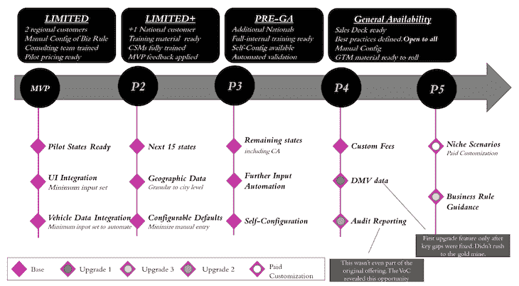

# 如何建立一个每个人都购买的产品路线图

> 原文：<https://blog.logrocket.com/product-management/how-to-build-product-roadmap-overview-examples/>

产品生命周期不断发展。让每个人都了解产品路线图，从[定义 MVP](https://blog.logrocket.com/product-management/what-is-minimum-viable-product-mvp-how-to-define/) 到[预测三年后的情况](https://blog.logrocket.com/product-management/what-is-a-product-vision-statement-examples/)，这对于获得 360 度的认同至关重要，你需要这种认同来定位你的产品在市场上的长期成功。

在本指南中，我们将描述拥有一个好的产品路线图的好处，并根据您的受众列出应该包含在文档中的内容。然后，我们将通过真实的例子详细解释，如何创建一个每个人都理解的产品路线图，从执行领导和同行组织到客户和合作伙伴。

* * *

## 目录

* * *

## 什么是产品路线图？

一份[产品路线图](https://www.atlassian.com/agile/product-management/product-roadmaps)是一份共享的、活的文档，概述了你的产品在其整个生命周期中的远景和方向。路线图，在最基本的层面上，阐明了你在构建什么以及为什么要构建。它还列出了团队交付价值的策略，并作为执行整体产品策略的计划。

## 产品路线图的主要目标和好处是什么？

建立和管理一个灵活且有弹性的路线图是[产品经理的职责](https://blog.logrocket.com/product-management/what-does-a-product-manager-do-role-responsibilities/)。他们必须说服利益相关者为什么投资是有意义的，从组织内部和外部获得认同和支持系统，设定期望，并传递对未来的兴奋感。

产品经理可以通过以下方式获得成功推动新产品或新功能投资所需的支持:

*   获得管理层的认同，以构建和维持产品
*   指定所有团队的短期和长期需求
*   展示与生态系统合作伙伴的凝聚力
*   向客户展示为什么产品符合他们的需求
*   应用灵活适应的原则，同时最大限度地减少噪音

## 产品路线图包括什么？

定义产品的第一步是让领导层相信产品符合公司战略。虽然[产品愿景](https://blog.logrocket.com/product-management/what-is-a-product-vision-statement-examples/)展示了这种一致性，现金流分析展示了价值，但当领导层查看产品路线图时，它就变成了现实。

路线图中包含的信息应该让执行团队相信产品是可行的，值得组织和财务支持。它应该包括一个明确定义的目标和实现该目标的关键步骤或里程碑列表。

产品路线图还应该阐明整体产品战略，并提供背景来解释它将如何帮助团队实现产品愿景中阐述的目标。

## 如何构建人人都懂的产品路线图

构建好的产品路线图的关键是了解你的受众。一份旨在获得公司领导层认同的路线图，看起来与一份旨在吸引客户的路线图截然不同。这就是基于主题的产品路线图真正派上用场的地方，正如 Andrea Saez 的这本[有用指南](https://www.prodpad.com/blog/how-to-build-a-product-roadmap-everyone-understands/)所描述的。

在接下来的部分中，我们将解释如何创建一个产品路线图，以获得管理层、整个组织、合作伙伴和客户的认同。

### 执行领导

领导力路线图需要捕捉 MVP 何时可用、目标客户、预期收入和产品使用的人口统计数据。利益相关者想知道何时获得全部市场潜力是可行的(一般发布)以及追加销售机会的考虑因素。对于每个功能，他们都想了解其用途和顺序。

产品路线图的主要目的是教育和说服领导层，产品或功能值得他们投资。另一个关键原因是寻求他们的方向。你有一些最好的头脑在电话中，所以你不妨利用它！

领导层还需要了解你监控的 KPI，并希望了解你如何定期跟踪的最新情况。产品路线图为批判性思维搭建了舞台。它设定了交易量何时增长的预期，以便领导层对短期和长期前景有一个方向。

对你提出的路线图要有创意。通常，演示文稿会在顶部展示时间表、关键特性和两行摘要。在许多情况下，这是不够的。在每个阶段抓住关键客户的叙述是至关重要的。

### 同行组织

为同行组织创建产品路线图需要超越工程团队的更广阔的视角。

例如，在处理索赔时考虑运营团队；当开始一个新的计划时，手动处理对于某些场景可能是必要的。您识别这些场景的能力、每月预期的交易数量以及使这种处理变得不必要的特性可以决定一个项目的成败。考虑产品内部涉及的每个团队，包括法律、采购、分析和实施(我们一会儿将进入销售)。

将我们的注意力转回到产品开发团队，[了解“完成”是什么样子的](https://www.leadingagile.com/2017/02/definition-of-done/)非常重要。虽然面向客户或领导层的路线图不需要详细的视图，但这对开发团队来说是至关重要的。路线图必须进一步分解，以阐明更广泛的功能中需要优先考虑的部分，而不是以后的增强。

实施和客户成功团队需要明确沙盒和生产环境中的功能何时可用，以便为他们的团队提供必要的培训。当新数据集可用于推动 KPI 测量时，分析团队需要沟通。

开发团队需要路线图来设计产品架构。大多数成功的产品之所以能够成功，是因为产品管理和工程设计之间的默契配合。

我发现与团队一起工作，创造性地分解一个更重要的特性是很有价值的。我的经验是，如果开发时间超过两周，那么进一步的分解可能是必要的。这种功能分解转化为更详细的路线图，推动跨职能部门的协调。

请注意，功能划分应该是结果驱动的——它不应该是单独衡量进展的分解。你可能会问，为什么领导团队不关心这个？简而言之，他们会的，如果特性分裂足够显著，那么沟通是关键。通常，这些拆分是 UX 增强的问题，而不是阻碍收入的问题。

### 伙伴

系统集成商通常是产品和用户之间的媒介。他们的收养可能会成就你的事业，也可能毁掉你的事业。

考虑一个 ERP 系统。SAP 等产品公司依赖埃森哲等系统集成商为客户部署和管理解决方案。

想象一下，你的产品的增强(无论多么用心良苦)打破了现有的定制。假设 SI 没有预见到这种情况，或者这种情况经常发生。在这种情况下，SI 可能会停止升级产品，因为客户现在认为升级导致的停机时间是不可接受的。不要成为那种产品！

网络研讨会是传达下一季度产品路线图的绝佳方式。虽然这是一个好的开始，但记录尤其是 UI 或 API 的变化，并预先警告可能的兼容性问题是非常重要的。瓶颈不是升级的准备工作，而是在客户面前表现不佳。

* * *

订阅我们的产品管理简讯
将此类文章发送到您的收件箱

* * *

### 客户和用户

客户希望你的产品能立即缓解当前的痛点，同时也要求你的产品超越当前的痛点。

举个例子，两个卖主的故事。在我之前的一份工作中，我们的运营严重依赖第三方供应商的解决方案。没有进入具体的细节，两个供应商都提供重叠的产品。

难点在于数据驻留在他们的系统中。供应商 1 没有提供标准接口来检索数据以进行更深入的分析。厂商 2 做了，但是有相当大的压力来建立我们的人工智能和自动化环境。

在下一个季度，我们要求两家供应商展示他们的路线图。当供应商 2 向我们展示其路线图时，很明显他们的代表已经听取了我们的需求。更重要的是，路线图包括了明确的时间表。供应商 1 计划提供重要的更新，包括那些可以让我们的问题消失的更新。不幸的是，除了一篇激励性的演讲之外，它从未展示过任何东西。这消除了供应商 1，我们通过供应商 2 整合了我们的解决方案。

Vendor-1 的客户经理在网下承认，他从未得到产品团队的支持向客户展示任何东西。设身处地为他们想想:为什么销售经理会把你的产品卖给顾客？如果你不能为一个产品提供路线图、定价和时间安排，你还不如不开发它。

另一个需要考虑的问题是构建一套产品功能来增加机会。把你的产品想象成一组乐高积木，其结果比零件的总和更显著。当你构建一个包罗万象的产品时，你向你的大多数客户过度交付了。

面向客户的路线图通常是强调产品重大增强的季度或月度时间表。它需要用大约 15-20 个词来说明为什么该功能会为他们带来价值。

销售团队更喜欢类似的快照。但是，我建议根据销售团队的受众进行定制。

## 收集反馈(并消除噪音)

了解什么样的反馈是至关重要的，什么是噪音，对于构建可持续产品至关重要。

在介绍一个新产品的时候，你总能期待反馈，这就是上帝。然而，大部分是战术性的，建议倾向于解决症状而不是根本原因。

举个例子，有一次我有一个客户要求一个独特场景的特性。销售团队坚持认为，在我们添加该功能之前，该产品是不可行的。我们和客户通了电话，讨论了一下，确定这是一个神秘的规则，甚至是无效的。

在其他情况下，我看到产品团队将一个增强请求变成了一个新收入流的机会。关键是要把信号和噪音分开。当有一个好的理由时，不要害怕重新安排你的产品路线图的优先次序。

与客户通话，进行开放式讨论；你可能会发现未经打磨的钻石，这可能会带来新的成功之路。一旦你交付了一个 MVP，就要接近用户，并根据预期来衡量产品的结果。了解关键痛点。然后，根据投资回报、开发的容易程度、产品的准备程度和市场，对它们进行优先排序。

## 产品路线图如何与产品待办事项相关联？

作为产品经理，[你拥有待办事项](https://blog.logrocket.com/product-management/what-is-backlog-grooming-aka-refinement/)。确保捕获待办事项，提高组织内的透明度，并提供一个基本原理。

产品路线图是一个流动的文档；它可能基于各种参数而发展，例如组织战略的变化、市场或用户行为的转变，或者新竞争对手的到来。

积压需要定期更新和重新排列，以跟上产品路线图的变化。在这个过程中，用户故事和任务变得过时是很常见的，所以一旦你从涉众那里得到明确的指示，你就应该从待办事项列表中删除这些不相关的项目。

记住[产品管理](https://blog.logrocket.com/product-management/)是 70%的科学和 30%的工艺，所以发挥创造力吧！

## 产品路线图示例/模板

下面是一个真实产品的产品路线图示例。注意它是如何从一个阶段过渡到下面的进入标准考虑的，包括产品、人员和过程的微调。这些考虑也提供了必要的过滤器，以确定滩头客户。

在构建您自己的路线图时，请随意使用此示例产品路线图作为模板。

从小规模开始，然后扩大规模，这并不可耻。然而，在你的产品路线图中设定这些期望是至关重要的。

关于这个示例产品路线图，我想提出两个关键的观察结果，它基于我工作过的一个真实的产品(出于明显的原因，已经进行了消毒):第一，我们计划进行额外的集成，以引入新的收入流。然而，我们没有追求那个模型，直到我们得到基本的权利。

第二个收获是回到灵活性:我们发现了一个新的机会，这是我们在进一步探索时甚至没有想到的。不要低估与客户进行开放式讨论的力量。

确保全面一致至关重要。作为产品经理，你的工作是确保领导层、面向内部和面向客户的路线图同步。

诸如 Aha 之类的工具与吉拉集成得很好，并且有可能设置这样的工具来自动化流程以提供实时状态。我也看到了 Azure DevOps 的成功。无论您决定投资哪种工具，都要通过与其他系统集成来充分利用它，以实现完全透明。

*精选图片来源:[icon scout](https://iconscout.com/icon/map-and-location-2569358)*

## [LogRocket](https://lp.logrocket.com/blg/pm-signup) 产生产品见解，从而导致有意义的行动

[LogRocket](https://lp.logrocket.com/blg/pm-signup) 确定用户体验中的摩擦点，以便您能够做出明智的产品和设计变更决策，从而实现您的目标。

使用 LogRocket，您可以[了解影响您产品的问题的范围](https://logrocket.com/for/analytics-for-web-applications)，并优先考虑需要做出的更改。LogRocket 简化了工作流程，允许工程和设计团队使用与您相同的[数据进行工作](https://logrocket.com/for/web-analytics-solutions)，消除了对需要做什么的困惑。

让你的团队步调一致——今天就试试 [LogRocket](https://lp.logrocket.com/blg/pm-signup) 。

[Harish Natarahjan Follow](https://blog.logrocket.com/author/harishnatarahjan/) Harish brings 18+ years of product, strategy and technology expertise, delivering solutions in mission-critical environments in public safety, discrete manufacturing, and insurance verticals.