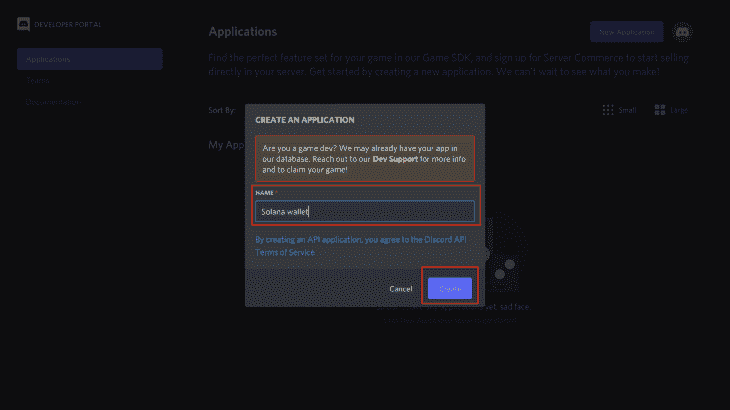
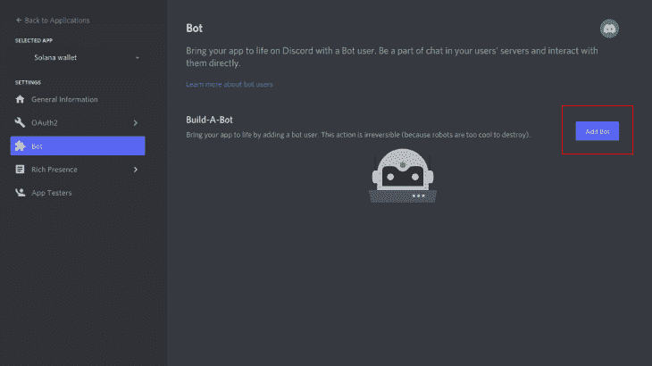
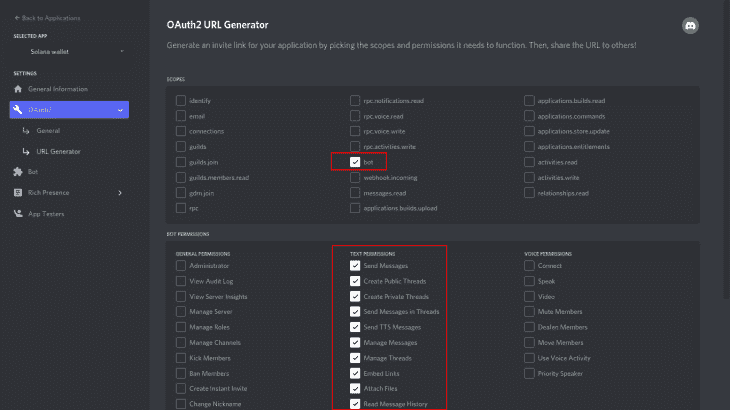
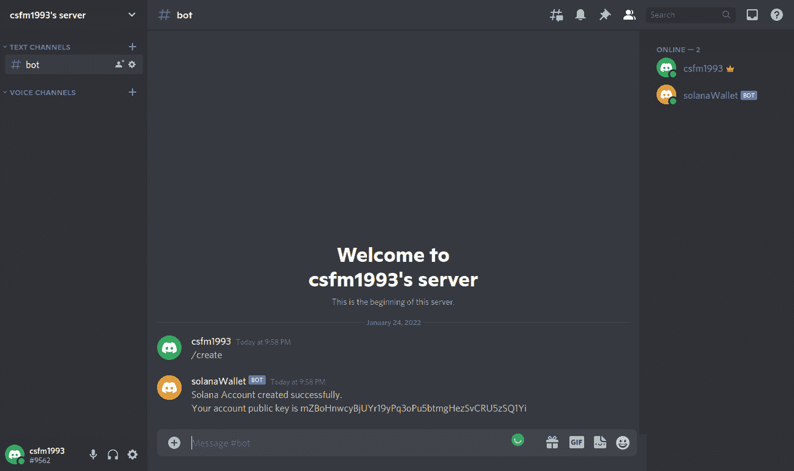
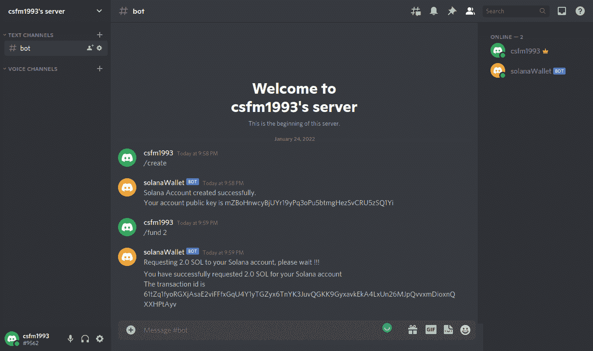

# 如何用 Python 构建一个 Solana Discord 钱包

> 原文：<https://blog.logrocket.com/how-to-build-solana-discord-wallet-python/>

在本教程中，我们将学习如何用 Python、discord.py 和 Solana Python SDK 构建一个 Solana Discord 聊天机器人钱包。这个聊天机器人将能够创建一个帐户，为一个帐户提供资金，检查帐户余额，并向另一个帐户发送索拉纳令牌，所有这些都通过 Discord 完成。

Solana 是一个区块链公共网络，允许其用户[创建 NFTs](https://blog.logrocket.com/how-to-create-nfts-with-javascript/) 、财务应用和其他智能合同应用。索拉纳的原生代币被称为 SOL，根据 coinmarketcap.com[的消息，在撰写本文时，SOL 的市值在加密货币中排名第七。索拉纳钱包是一个应用程序，允许您创建索拉纳帐户，存储，发送和接收 SOL 和其他令牌，以及与智能合同进行交互。](https://coinmarketcap.com/)

[Discord](https://discord.com/) 是一款流行的免费语音、视频和文本聊天应用，拥有超过 3.5 亿用户，运行在 Windows、macOS、Android、iOS、iPadOS、Linux 和 web 浏览器上。Discord 聊天机器人是一种能够响应命令并自动执行某些任务的机器人，例如欢迎新成员、调节内容和禁止违反规则者。我们将要创建的机器人将帮助我们创建和管理 Solana 钱包。

在本教程结束时，您将拥有一个如下所示的 Solana Discord 钱包:


## 先决条件

*   不一致的说法
*   您的设备上安装或可访问的 Discord
*   Python 3.6 以上版本

## 创造一个不和谐机器人

在本节中，我们将创建一个新的 Discord bot 帐户，检索 bot 令牌，并将 bot 邀请到我们的一个服务器上。

使用您首选的浏览器，导航至 Discord 开发人员门户，并使用您的 Discord 帐户登录。导航到**应用**页面，点击**新应用**按钮。

给你的应用程序起一个名字，比如“Solana wallet”，然后按下 **Create** 。



接下来，导航到**机器人**选项卡，点击**添加机器人**按钮，创建一个机器人用户。



向下滚动到页面的 **Build-A-Bot** 部分，点击**复制**按钮复制 Bot 令牌。我们将在下一节中使用这个 bot 令牌，所以请将它保存在安全的地方。这个令牌应该保持私有，因为任何能够访问这个令牌的人都能够控制您的 bot。

按照上述步骤操作后，您已经成功创建了一个 bot 帐户！现在，为了能够与这个 bot 帐户进行交互，您需要邀请它加入您的服务器。

导航到 **OAuth2** 选项卡，然后导航到 **URL 生成器**子选项卡。在**范围**部分，选择**机器人**。



在下面出现的 **Bot 权限**部分，选择**文本权限**列中的所有字段。转到显示**生成 URL** 的部分，点击**复制**按钮复制 bot 邀请 URL。

将复制的 URL 粘贴到一个新标签中，选择要添加机器人的服务器，然后单击**继续**按钮。


检查机器人的权限，当你满意时，点击**授权**按钮。

现在，您的机器人将被邀请到您的服务器，一旦我们对它进行编码，您就可以与它进行交互。

## 创建项目结构

在本节中，我们将创建我们的项目目录。在这个目录中，我们将创建并激活一个虚拟环境，然后安装构建这个聊天机器人所需的 Python 包。最后，我们将创建一个名为`.env`的文件，并在这个文件中存储我们的 Discord bot 令牌。

打开终端窗口，输入以下命令:

```
mkdir solana-discord-wallet
cd solana-discord-wallet

```

在我们的工作目录中，创建一个虚拟环境并激活它。如果您使用的是 Unix 或 MacOS 系统，请运行以下命令:

```
python3 -m venv venv
source venv/bin/activate

```

如果您在 Windows 上遵循教程，请改为运行以下命令:

```
python -m venv venv
venvScriptsactivate

```

现在我们已经创建并激活了虚拟环境，我们可以安装创建应用程序所需的库了:

```
pip install discord.py solana python-dotenv 

```

在上面的命令中，我们使用了`pip`，Python 包安装程序，来安装我们将在这个项目中使用的以下包:

*   discord.py 是一个现代的、易于使用的、功能丰富的异步 API 包装器，我们将使用它与 discord 的 API 进行交互
*   [solana-py](https://github.com/michaelhly/solana-py) 是基于 [JSON RPC API](https://docs.solana.com/developing/clients/jsonrpc-api) 构建的 Solana Python 库
*   [python-dotenv](https://github.com/theskumar/python-dotenv) 是一个从`.env`文件中读取键值对并将它们作为环境变量添加的库。我们将使用这个模块来检索我们的 bot 令牌，它将存储在`.env`文件中

现在让我们开始构建我们的应用程序。创建一个名为`.env`的文件，并将您在上一节中保存的 Discord bot 令牌粘贴为`BOT_TOKEN`。

## 创建`main.py`文件

在本节中，我们将创建 Python 脚本，允许我们的 Discord 聊天机器人发送和接收消息。

在项目的根目录下，创建一个名为`main.py`的文件。使用您最喜欢的文本编辑器打开它，并添加以下代码:

```
import os
import discord
from discord.ext import commands
from dotenv import load_dotenv

```

这里，我们导入了聊天机器人应用程序发送和接收消息所需的所有包:

*   `os`将与`python-dotenv`一起用于从`.env`文件中检索我们的不和谐机器人令牌
*   `discord`包将用于与 Discord 的 API 交互，并创建命令处理程序，从而允许我们发送和接收 Discord 消息

将以下代码添加到`main.py`文件的底部:

```
load_dotenv()
description = ''' A bot that allows you to create and manage a Solana wallet  '''
intents = discord.Intents.default()
bot = commands.Bot(command_prefix='/', description=description, intents=intents)

@bot.event
async def on_ready():
    print('Bot is online')
    print(bot.user.name)
    print(bot.user.id)
    print('------ n')

```

在上面的代码中，我们通过调用`load_dotenv()`导入了存储在`.env`文件中的环境变量。

加载变量后，我们为机器人创建了一个基本描述，并将机器人的意图设置为`default`。意图是指允许机器人订阅特定的事件，如直接消息、反应或输入。

* * *

### 更多来自 LogRocket 的精彩文章:

* * *

然后，我们创建了一个新的 bot 实例，并将命令前缀(`/`)、描述和意图作为参数传递给构造函数。我们将 bot 实例存储在一个名为`bot`的变量中。

最后，我们为 bot 运行时创建一个事件监听器。当这个事件侦听器被触发时，我们在控制台上打印几行内容，说明机器人在线，并显示机器人的用户名和用户 ID。

现在，在`on_ready()`函数下面添加以下代码:

```
@bot.command(description='Create a new solana account')
async def create(ctx):
    await ctx.send('Create account')

@bot.command(description='Fund your account')
async def fund(ctx):
    await ctx.send('Fund your account')

@bot.command(description='Check account balance')
async def balance(ctx):
    await ctx.send('Check account balance')

@bot.command(description='Send SOL to another account')
async def send(ctx):
    await ctx.send('Send SOL to another account')

bot.run(os.environ['BOT_TOKEN'])

```

在上面的代码块中，我们为聊天机器人创建了所有的命令处理程序。上面的代码确定用户试图调用哪个命令，并采取适当的行动。

请注意，我们不需要在每个命令处理程序中指定命令前缀，因为我们在创建 bot 实例时已经这样做了。

我们的聊天机器人钱包将能够处理以下命令:

*   `/create`创建新的 Solana 帐户
*   `/fund amount`用一定数量的 SOL 为现有的 Solana 帐户提供资金
*   检查现有 Solana 账户的余额
*   `/send amount receiver`负责向另一个索拉纳账户发送一定数量的溶胶

目前，每个命令处理程序只会发回一个描述用户想要执行的操作的文本。为了向用户发送消息，我们使用了每个命令处理程序中的 context ( `ctx`)对象提供的`send()`方法。

最后，我们调用了由`bot`对象提供的`run()`方法，并将机器人令牌作为参数传递，以启动我们的聊天机器人。

您的`main.py`文件应该如下所示:

```
import os
import discord
from discord.ext import commands
from dotenv import load_dotenv

load_dotenv()
description = ''' A bot that allows you to create and manage a Solana wallet  '''
intents = discord.Intents.default()
bot = commands.Bot(command_prefix='/', description=description, intents=intents)

@bot.event
async def on_ready():
    print('Bot is online')
    print(bot.user.name)
    print(bot.user.id)
    print('------ n')

@bot.command(description='Create a new solana account')
async def create(ctx):
    await ctx.send('Create account')

@bot.command(description='Fund your account')
async def fund(ctx):
    await ctx.send('Fund your account')

@bot.command(description='Check account balance')
async def balance(ctx):
    await ctx.send('Check account balance')

@bot.command(description='Send SOL to another account')
async def send(ctx):
    await ctx.send('Send SOL to another account')

bot.run(os.environ['BOT_TOKEN'])

```

转到您的终端，运行以下命令以启动应用程序:

```
python main.py

```

使用您首选的 Discord 客户端，向机器人发送`/create`命令，您应该会得到类似如下的响应:


## 创建`wallet.py`文件

在本节中，我们将创建一个文件，该文件将允许我们创建一个 Solana 帐户，为该帐户提供资金，检查该帐户的余额，并将资金从该帐户发送到另一个帐户。

创建 Solana 帐户时，会生成一个 KeyPair 对象。该对象包含用于访问帐户的公钥和相应的私钥。

公钥类似于可以与任何人公开共享以接收资金的账号，而私钥是授予 Solana 用户对给定账户上的资金的所有权。顾名思义，这个私钥不应该公开共享。

一个索拉纳账户可能持有名为“lamports”的资金。灯端口是值为 0.000000001 SOL 的小数本机令牌。

在项目的根目录下，创建一个名为`wallet.py`的文件。使用您喜欢的文本编辑器打开它，然后添加以下代码:

```
from solana.keypair import Keypair
from solana.publickey import PublicKey
from solana.rpc.api import Client
from solana.transaction import Transaction
from solana.system_program import TransferParams, transfer

import json

solana_client = Client("https://api.devnet.solana.com")

```

这里，我们从`Solana`包中导入了以下对象:

*   `Keypair`，它将用于创建一个新的 Solana 帐户
*   `PublicKey`，它将把一个字符串格式的公钥转换成一个`PublicKey`对象，以便将 Solana 令牌发送到另一个帐户
*   `Client`，创建一个 Solana 客户端实例，该实例将允许该应用程序与 Solana 区块链交互
*   `Transaction`，创建一个索拉纳交易。事务是由客户端使用单个或多个密钥对签名的指令，并且自动执行，只有两种可能的结果:成功或失败
*   `TransferParams`，创建一个包含转账交易参数的对象
*   `transfer`，创建一个对象，允许一个账户向另一个账户发送资金

之后我们导入了`json`，用来将创建的 Solana 账号公钥和私钥存放在一个文件中。

最后，我们在名为`solana_client`的变量中创建了一个 Solana 客户端实例，并将 RPC 端点设置为`devnet`。RPC(远程过程调用)端点是可以向其发送区块链数据请求的 URL。

### 构建一个函数来创建新的 Solana 帐户

将以下代码添加到`wallet.py`的底部:

```
def create_account(sender_username):
    try:
        kp = Keypair.generate()
        public_key = str(kp.public_key)
        secret_key = kp.secret_key

        data = {
            'public_key': public_key,
            'secret_key': secret_key.decode("latin-1"),
        }

        file_name = '{}.txt'.format(sender_username)
        with open(file_name, 'w') as outfile:
            json.dump(data, outfile)

        return public_key

    except Exception as e:
        print('error:', e)
        return None

```

上面创建的`create_account()`函数接收发送`/create`命令的用户的用户名作为参数，它负责创建一个新的 Solana 帐户并将帐户细节存储在本地`.txt`文件中。

我们通过首先生成一个新的 Solana account KeyPair 对象并将其存储在一个名为`kp`的变量中来开始代码。

然后，我们将它存储在一个名为`data`的对象中，这是生成的帐户的`public_key`和`secret_key`的字符串值。

最后，我们使用存储在名为`sender_username`的变量中的值创建一个`.txt`文件，将`data`转储到其中，如果没有异常，则返回帐户的`public_key`。如果出了问题，我们返回`None`。

在`create_account()`函数下面添加以下代码:

```
def load_wallet(sender_username):
    try:
        file_name = '{}.txt'.format(sender_username)
        with open(file_name) as json_file:
            account = json.load(json_file)
            account['secret_key'] = account['secret_key'].encode("latin-1")
            return account

    except Exception as e:
        print(e)
        return None  

```

在这里，我们创建了一个名为`load_wallet()`的函数。这个函数接收用户的用户名作为参数，并使用它从本地`.txt`文件中检索他的 Solana 帐户的公钥和私钥，这个文件是在调用`create_account()`函数时创建的。

### 创建一个为 Solana 帐户提供资金的函数

在`load_wallet()`函数下面添加以下代码:

```
def fund_account(sender_username, amount):
    try:
        amount = int(1000000000 * amount)
        account = load_wallet(sender_username)
        resp = solana_client.request_airdrop(
            account['public_key'], amount)   
        print(resp)    

        transaction_id = resp['result']
        if transaction_id != None:
            return transaction_id
        else:
            return None

    except Exception as e:
        print('error:', e)
        return None

```

在上面的代码中，我们创建了一个名为`fund_account()`的函数。该函数负责为特定帐户请求 SOL，并接收发送`/fund`命令的用户的用户名和用户请求的 SOL 数量作为参数。

首先，我们使用一些基本的数学方法来防止 Solana 将我们希望请求的 SOL 数量转换成它应该达到的数量的一小部分。比方说，我们希望请求将一个 SOL 添加到我们的帐户中。如果我们只输入“1”作为金额，Solana 会将此金额转换为 0.000000001。所以为了防止这种行为，我们把我们想要的量乘以十亿(1000000000)。

然后，使用`load_wallet()`函数获取用户的 Solana 帐户数据，并将其存储在一个名为`account`的变量中。

最后，我们使用由`solana_client`对象提供的`request_airdrop()`方法为我们提供了公钥的帐户请求一些 SOL 令牌。如果请求成功，我们返回事务 ID，但是如果出错，我们返回`None`。

为了让我们认为请求是成功的，`request_airdrop()`方法应该返回类似如下的响应:

```
{
    "jsonrpc": "2.0",
    "result":"uK6gbLbhnTEgjgmwn36D5BRTRkG4AT8r7Q162TLnJzQnHUZVL9r6BYZVfRttrhmkmno6Fp4VQELzL4AiriCo61U",
    "id": 1
}

```

您在上面看到的`jsonrpc`是使用的协议，`id`是请求 ID，`result`是响应结果，在这个特定的例子中，是一个事务 ID。

您可以通过首先导航到[索拉纳区块链探索](https://explorer.solana.com/?cluster=devnet) [r](https://explorer.solana.com/?cluster=devnet) ，选择`Devnet`网络，并输入您在`result`属性中看到的交易 ID 来检查索拉纳交易的细节。

### 创建一个函数来检查 Solana 帐户的余额

在`fund_account()`方法下添加以下代码:

```
def get_balance(sender_username):
    try:
        account = load_wallet(sender_username)
        resp = solana_client.get_balance(account['public_key'])
        print(resp)
        balance = resp['result']['value'] / 1000000000
        data = {
            "publicKey": account['public_key'],
            "balance": str(balance),
        }
        return data
    except Exception as e:
        print('error:', e)
        return None

```

这里我们创建了一个名为`get_balance()`的函数。这个函数接收发送`/balance`命令的用户的用户名作为参数，它负责检索用户的 Solana 帐户余额。

首先，我们使用`load_wallet()`方法获取用户的 Solana 帐户，然后我们调用 Solana 客户端提供的`get_balance()`方法获取帐户余额，将帐户公钥作为参数传递，并将响应赋给一个名为`resp`的变量。

在检索帐户余额后，我们将余额除以 10 亿，使其更具可读性。

最后，我们将公钥和帐户余额存储在一个名为`data`的对象中，然后我们返回这个对象。

如果由`get_balance()`方法发送的请求成功，您应该会看到类似如下的响应:

```
{
    "jsonrpc": "2.0", 
    "result": {
        "context": { "slot": 228 }, 
        "value": 0
    }, 
    "id": 1
}

```

您在上面看到的`context`是一个`RpcResponseContext` JSON 结构，包括一个用于评估操作的`slot`字段。`value`是操作本身返回的值，在本例中是账户余额。

### 创建一个在 Solana 钱包之间发送 SOL 的函数

在`get_balance()`函数下面添加以下代码:

```
def send_sol(sender_username, amount, receiver):
    try:
        account = load_wallet(sender_username)
        sender = Keypair.from_secret_key(account['secret_key'])
        amount = int(1000000000 * amount)

        txn = Transaction().add(transfer(TransferParams(
            from_pubkey=sender.public_key, to_pubkey=PublicKey(receiver), lamports=amount)))
        resp = solana_client.send_transaction(txn, sender)
        print(resp)

        transaction_id = resp['result']
        if transaction_id != None:
            return transaction_id
        else:
            return None

    except Exception as e:
        print('error:', e)
        return None

```

上面创建的`send_sol()`函数接收发送`/send`命令的用户的用户名、该用户希望发送的 SOL 的`amount`以及她希望发送到的 Solana 帐户地址作为参数。顾名思义，这个函数负责向用户提供的一个 SOL 账户地址发送一定量的 SOL。

首先，我们使用`load_wallet()`函数获取用户的 Solana 帐户，然后我们将用户的 Solana 帐户密钥对存储在一个名为`sender`的变量中。她希望发送的金额存储在一个名为`amount`的变量中。

然后，我们创建一个事务对象，添加发送者和接收者的公钥，添加她希望发送的 SOL 数量，并将该对象赋给一个名为`txn`的变量。

为了发送和签署事务，我们调用 Solana 客户端提供的`send_transaction()`方法，将事务对象和发送者的密钥对作为参数传递，然后将响应存储在名为`resp`的变量中。由`send_transaction()`方法发送的请求响应类似于我们前面看到的`request_airdrop()`方法响应。

最后，我们获取存储在`resp`对象的`result`属性中的事务 ID，将其存储在一个名为`transaction_id`的变量中，并返回它。

`wallet.py`文件应该如下所示:

```
from solana.keypair import Keypair
from solana.publickey import PublicKey
from solana.rpc.api import Client
from solana.transaction import Transaction
from solana.system_program import TransferParams, transfer

import json

solana_client = Client("https://api.devnet.solana.com")

def create_account(sender_username):
    try:
        kp = Keypair.generate()
        public_key = str(kp.public_key)
        secret_key = kp.secret_key

        data = {
            'public_key': public_key,
            'secret_key': secret_key.decode("latin-1"),
        }

        file_name = '{}.txt'.format(sender_username)
        with open(file_name, 'w') as outfile:
            json.dump(data, outfile)

        return public_key

    except Exception as e:
        print('error:', e)
        return None

def load_wallet(sender_username):
    try:
        file_name = '{}.txt'.format(sender_username)
        with open(file_name) as json_file:
            account = json.load(json_file)
            account['secret_key'] = account['secret_key'].encode("latin-1")
            return account

    except Exception as e:
        print(e)
        return None   

def fund_account(sender_username, amount):
    try:
        amount = int(1000000000 * amount)
        account = load_wallet(sender_username)
        resp = solana_client.request_airdrop(
            account['public_key'], amount)   
        print(resp)    

        transaction_id = resp['result']
        if transaction_id != None:
            return transaction_id
        else:
            return None

    except Exception as e:
        print('error:', e)
        return None

def get_balance(sender_username):
    try:
        account = load_wallet(sender_username)
        resp = solana_client.get_balance(account['public_key'])
        print(resp)
        balance = resp['result']['value'] / 1000000000
        data = {
            "publicKey": account['public_key'],
            "balance": str(balance),
        }
        return data
    except Exception as e:
        print('error:', e)
        return None

def send_sol(sender_username, amount, receiver):
    try:
        account = load_wallet(sender_username)
        sender = Keypair.from_secret_key(account['secret_key'])
        amount = int(1000000000 * amount)

        txn = Transaction().add(transfer(TransferParams(
            from_pubkey=sender.public_key, to_pubkey=PublicKey(receiver), lamports=amount)))
        resp = solana_client.send_transaction(txn, sender)
        print(resp)

        transaction_id = resp['result']
        if transaction_id != None:
            return transaction_id
        else:
            return None

    except Exception as e:
        print('error:', e)
        return None                

```

## 把所有东西放在一起

在上一节中，我们创建了包含允许聊天机器人在索拉纳区块链中执行事务的函数的文件。在本节中，我们将把这些功能与聊天机器人的命令处理程序集成在一起。

转到您的`main.py`，将以下代码添加到导入语句中:

```
from wallet import create_account, fund_account, get_balance, send_sol

```

在上面的代码行中，我们将在前面几节中创建的所有函数导入到了`wallet.py`文件中。让我们仔细检查每个命令，将它们集成到聊天机器人的命令处理程序中。

### `/create`命令

在`main.py`文件中，用以下代码替换`/create`命令处理程序中的代码:

```
async def create(ctx):
    sender_username = ctx.message.author
    try:
        public_key = create_account(sender_username)
        if public_key is not None:
            message = "Solana Account created successfully.n"
            message += "Your account public key is {}".format(public_key)
            await ctx.send(message)
        else:
            message = "Failed to create account.n"
            await ctx.send(message)
    except Exception as e:
        print('error:',e)
        await ctx.send('Failed to create account')
        return

```

这里，我们获取发送`/create`命令的用户的用户名，并将其存储在一个名为`sender_username`的变量中。

之后，我们调用`wallet.py`文件中的`create_account()`函数，将用户的用户名作为参数传递，并将其存储在一个名为`public_key`的变量中。新创建的 Solana 帐户的公钥由`create_account()`函数返回。

然后，我们使用条件逻辑来检查`public_key`的值是否不等于`None`，如果是这样，我们在一个名为`message`的变量中存储一条消息，说明 Solana 帐户创建成功，并显示公钥。之后，我们使用`send()`方法将消息发送给用户。

然而，如果`public_key`等于`None`,我们会发送一条消息，说明机器人未能创建帐户。

### `/fund`命令

现在，用以下代码替换`/fund`命令处理程序中的代码:

```
async def fund(ctx):
    sender_username = ctx.message.author
    incoming_msg = ctx.message.content
    try:
        amount = float(incoming_msg.split(" ")[1])
        if amount <= 2 :
            message = "Requesting {} SOL to your Solana account, please wait !!!".format(amount)
            await ctx.send(message)
            transaction_id = fund_account(sender_username, amount)
            if transaction_id is not None:
                message = "You have successfully requested {} SOL for your Solana account n".format(
                    amount)
                message += "The transaction id is {}".format(transaction_id)
                await ctx.send(message)
            else:
                message = "Failed to fund your Solana account"
                await ctx.send(message)
        else:
            message = "The maximum amount allowed is 2 SOL"
            await ctx.send(message)
    except Exception as e:
        print('error:',e)
        await ctx.send('Failed to fund account')
        return

```

在上面的代码中，我们获得了发送`/fund`命令的用户的用户名和收到的消息，然后我们将这些值分别存储在名为`sender_username`和`incoming_msg`的变量中。

然后，我们从收到的消息中检索用户想要请求的 SOL 数量，并将其存储在一个名为`amount`的变量中。

在获取金额后，我们检查`amount`是否大于 2，因为在写本教程时，2 是你可以请求的最大 SOL 金额。如果金额不大于 2，我们在名为`message`的变量中存储一条消息，说明用户请求的金额将被添加到他的帐户中，并要求他等待。然后，我们使用`send()`方法将这条消息发送给用户。

通知用户后，我们调用`wallet.py`文件中的`fund_account()`函数。我们将用户的用户名和他希望添加到帐户中的 SOL 数量作为参数传递。在调用了`fund_account()`函数之后，我们将返回的事务 ID 存储在一个名为`transaction_id`的变量中。

最后，我们使用条件逻辑来检查交易 ID 是否不等于`None`，如果是这样，我们在一个名为`message`的变量中存储一条消息，表明他请求的资金被添加到他的帐户中。我们将事务 ID 添加到该消息中，然后将该消息发送给用户。

但是，如果`transaction ID`等于`None`,我们会发送一条消息，说明机器人未能向帐户提供资金。

### `/balance`命令

现在让我们执行`/balance`命令。用以下代码替换`/balance`命令处理程序中的代码:

```
async def balance(ctx):
    sender_username = ctx.message.author
    try:
        data = get_balance(sender_username)
        if data is not None:
            public_key = data['publicKey']
            balance = data['balance']
            message = "Your Solana account {} balance is {} SOL".format(
                public_key, balance)
            await ctx.send(message)
        else:
            message = "Failed to retrieve balance"
            await ctx.send(message)
    except Exception as e:
        print('error:',e)
        await ctx.send('Failed to check account balance')
        return

```

这里，首先，我们获取发送`/balance`命令的用户的用户名，并将其存储在一个名为`sender_username`的变量中。

然后我们调用`wallet.py`文件中的`get_balance()`函数。我们将用户的用户名作为参数传递，并将其存储在一个名为`data`的变量中，作为该函数返回的对象。这个对象应该包含用户的 Solana 帐户公钥和余额。

最后，我们使用条件逻辑来检查返回值是否不等于`None`。如果是这种情况，我们将消息存储在名为`message`的变量中，包含用户的 Solana 帐户公钥和余额，然后我们将消息发送给用户。

然而，如果由`get_balance()`返回的值等于`None`,我们将发送一条消息，说明机器人未能检索到帐户余额。

### `/send`命令

继续，用以下代码替换`/send`命令处理程序中的代码:

```
async def send(ctx):
    sender_username = ctx.message.author
    incoming_msg = ctx.message.content
    try:
        split_msg = incoming_msg.split(" ")
        amount = float(split_msg[1])
        receiver = split_msg[2]
        message = "Sending {} SOL to {}, please wait !!!".format(
            amount, receiver)
        await ctx.send(message)
        transaction_id = send_sol(sender_username, amount, receiver)
        if transaction_id is not None:
            message = "You have successfully sent {} SOL to {} n".format(
                amount, receiver)
            message += "The transaction id is {}".format(transaction_id)
            await ctx.send(message)
        else:
            message = "Failed to send SOL"
            await ctx.send(message)
    except Exception as e:
        print('error:',e)
        await ctx.send('Failed to send SOL')
        return

```

在上面的代码中，我们获得了发送`/send`命令的用户的用户名，收到的消息，然后我们将这些值分别存储在一个名为`sender_username`和`incoming_msg`的变量中。

然后，我们解析传入的消息，从中检索用户希望发送的 SOL 数量和接收者帐户的地址，并将这些值分别存储在名为`amount`和`receiver`的变量中。

在存储了`amount`和`receiver`之后，向用户发送一条消息，通知她希望发送的 SOL 的数量正在被发送到接收器，并要求用户等待。

通知用户后，我们调用`wallet.py`文件中的`send_sol()`函数。我们将用户的用户名、她希望转移的 SOL 数量以及接收者的地址作为参数传递。然后，我们将该函数返回的事务 ID 存储在一个名为`transaction_id`的变量中。

最后，我们使用条件逻辑来检查事务 ID 是否不等于`None`。如果是这种情况，我们在名为`message`的变量中存储一条消息，说明用户成功地将 SOL 发送到了所需的帐户。我们将交易 ID 附加到消息中，然后将消息发送给用户。

然而，如果`send_sol()`函数返回的值等于`None`,我们会发送一条消息，说明机器人未能发送 SOL。

替换每个命令处理程序中的代码后，`main.py`文件应该如下所示:

```
import os
import discord
from discord.ext import commands
from dotenv import load_dotenv
from wallet import create_account, fund_account, get_balance, send_sol

load_dotenv()
description = ''' A bot that allows you to create and manage a Solana wallet  '''
intents = discord.Intents.default()
bot = commands.Bot(command_prefix='/', description=description, intents=intents)

@bot.event
async def on_ready():
    print('Bot is online')
    print(bot.user.name)
    print(bot.user.id)
    print('------ n')

@bot.command(description='Create a new solana account')
async def create(ctx):
    sender_username = ctx.message.author
    try:
        public_key = create_account(sender_username)
        if public_key is not None:
            message = "Solana Account created successfully.n"
            message += "Your account public key is {}".format(public_key)
            await ctx.send(message)
        else:
            message = "Failed to create account.n"
            await ctx.send(message)
    except Exception as e:
        print('error:',e)
        await ctx.send('Failed to create account')
        return

@bot.command(description='Fund your account')
async def fund(ctx):
    sender_username = ctx.message.author
    incoming_msg = ctx.message.content
    try:
        amount = float(incoming_msg.split(" ")[1])
        if amount <= 2 :
            message = "Requesting {} SOL to your Solana account, please wait !!!".format(amount)
            await ctx.send(message)
            transaction_id = fund_account(sender_username, amount)
            if transaction_id is not None:
                message = "You have successfully requested {} SOL for your Solana account n".format(
                    amount)
                message += "The transaction id is {}".format(transaction_id)
                await ctx.send(message)
            else:
                message = "Failed to fund your Solana account"
                await ctx.send(message)
        else:
            message = "The maximum amount allowed is 2 SOL"
            await ctx.send(message)
    except Exception as e:
        print('error:',e)
        await ctx.send('Failed to fund account')
        return

@bot.command(description='Check your account balance')
async def balance(ctx):
    sender_username = ctx.message.author
    try:
        data = get_balance(sender_username)
        if data is not None:
            public_key = data['publicKey']
            balance = data['balance']
            message = "Your Solana account {} balance is {} SOL".format(
                public_key, balance)
            await ctx.send(message)
        else:
            message = "Failed to retrieve balance"
            await ctx.send(message)
    except Exception as e:
        print('error:',e)
        await ctx.send('Failed to check account balance')
        return

@bot.command(description='Send SOL to another account')
async def send(ctx):
    sender_username = ctx.message.author
    incoming_msg = ctx.message.content
    try:
        split_msg = incoming_msg.split(" ")
        amount = float(split_msg[1])
        receiver = split_msg[2]
        message = "Sending {} SOL to {}, please wait !!!".format(
            amount, receiver)
        await ctx.send(message)
        transaction_id = send_sol(sender_username, amount, receiver)
        if transaction_id is not None:
            message = "You have successfully sent {} SOL to {} n".format(
                amount, receiver)
            message += "The transaction id is {}".format(transaction_id)
            await ctx.send(message)
        else:
            message = "Failed to send SOL"
            await ctx.send(message)
    except Exception as e:
        print('error:',e)
        await ctx.send('Failed to send SOL')
        return

bot.run(os.environ['BOT_TOKEN'])

```

返回运行`main.py`文件的终端窗口，停止该进程，然后使用以下命令再次运行它:

```
python main.py

```

转到您喜欢的 Discord 客户端，向您的机器人发送`/create`命令，创建一个新的 Solana 帐户。您应该会看到类似下面的内容:



复制公钥并将其存储在某个地方以备后用。再次发送`/create`命令，生成一个新的 Solana 账户。

现在，发送`/fund 2`命令，用两个 SOL 令牌为您的 SOL 帐户提供资金。您可以随意将数量更改为小于 2 的任何值。您应该会看到类似下面的内容:



请务必测试其他命令，以确保它们都能按预期工作。

## 结论

在本教程中，您学习了如何创建一个 Solana Discord 聊天机器人钱包，该钱包能够创建一个 Solana 帐户，为该帐户提供资金，检索该帐户的余额，并将 SOL 发送到另一个 Solana 帐户。

我们在本教程中构建的 Solana Discord 钱包尚未准备好投入生产，我建议在将 SOL 发送到另一个帐户之前添加更多功能，如身份验证和帐户余额检查。完整的应用程序代码可以在[这个库](https://github.com/CSFM93/logrocket-solana-discord-wallet)中找到。

有关 Solana 和 discord.py 包的更多信息，请访问 [Solana 文档](https://docs.solana.com/)和 [discord.py 文档](https://discordpy.readthedocs.io/en/stable/)。

## 加入像 Bitso 和 Coinsquare 这样的组织，他们使用 LogRocket 主动监控他们的 Web3 应用

影响用户在您的应用中激活和交易的能力的客户端问题会极大地影响您的底线。如果您对监控 UX 问题、自动显示 JavaScript 错误、跟踪缓慢的网络请求和组件加载时间感兴趣，

[try LogRocket](https://lp.logrocket.com/blg/web3-signup)

.

[](https://lp.logrocket.com/blg/web3-signup)[https://logrocket.com/signup/](https://lp.logrocket.com/blg/web3-signup)

LogRocket 就像是网络和移动应用的 DVR，记录你的网络应用或网站上发生的一切。您可以汇总和报告关键的前端性能指标，重放用户会话和应用程序状态，记录网络请求，并自动显示所有错误，而不是猜测问题发生的原因。

现代化您调试 web 和移动应用的方式— [开始免费监控](https://lp.logrocket.com/blg/web3-signup)。