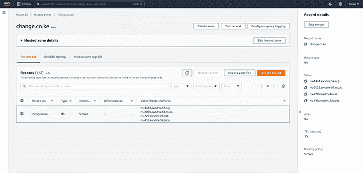
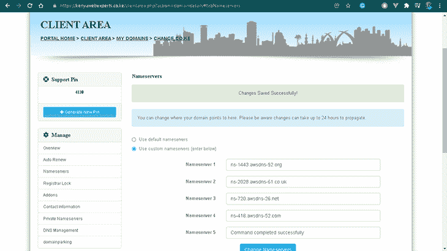
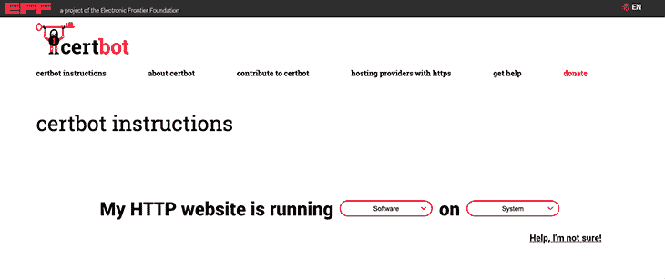
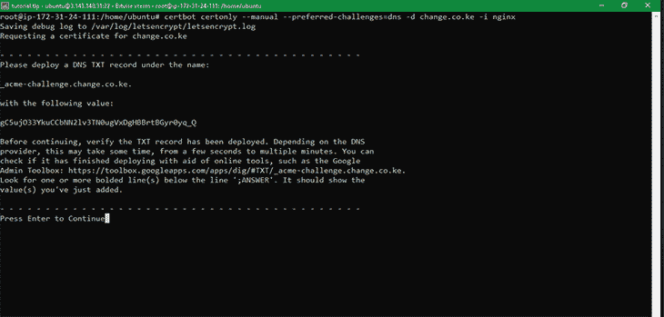
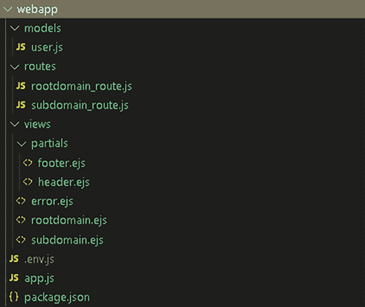

# 如何使用 Nginx - LogRocket Blog 构建一个包含多个子域的 web 应用程序

> 原文：<https://blog.logrocket.com/how-to-build-web-app-with-multiple-subdomains-nginx/>

## 介绍

Atlassian、GitHub、Slack 和 Zoom 是我们许多人日常使用的一些流行服务。如果你是一个好奇的灵魂，我敢打赌，你是着迷于这些 SaaS 产品如何发出自定义子域给他们的客户在飞行中。

让我们考虑一个例子。当注册一个 Atlassian 产品时，你会为你的公司获得一个子域，比如`mycompany.atlassian.net`；当你在 GitHub 页面上发布时，你会自动得到一个子域，比如`myusername.github.io`。

在本指南中，我将带你一步一步地构建一个支持多个子域的 web 应用程序，揭开使它看起来复杂的部分的神秘面纱。

在我们开始之前，让我们先规划一下旅程，这样你就可以边走边参考。

1.  [技术要求](#technical-requirements)
2.  [术语和定义](#terms-definitions)
3.  [设置我们的域名系统](#setting-up-our-dns)
4.  [设置 Nginx](#setting-up-nginx)
5.  [运行 Certbot 命令](#running-certbot-commands)
6.  [为我们的 SSL 证书配置 Nginx】](#configuring-nginx-ssl-certificates)
7.  [设置我们的网络应用](#setting-up-our-web-app)
8.  [启动我们的 Nginx 服务器](#starting-nginx-server)

## 技术要求

除了遵循本教程所需的服务之外，值得一提的是，我将在我的服务器实例中使用 Linux Ubuntu v 20.04。你可以使用任何你选择的操作系统。

本教程要求您具备:

### 您拥有的域名

对于本文，我将使用`change.co.ke`，我的域名注册商是`KenyaWebExperts`。您可以从自己选择的任何域名注册商处购买域名，例如:

*   伊诺姆
*   王朝式的
*   戈达迪
*   谷歌域名
*   名字便宜
*   场地

### 云提供商

您需要一个云提供商来部署服务器实例。

对于本文，我将使用 AWS EC 2，但是您可以使用您选择的任何云提供商。

以下是除 AWS 之外的其他云提供商的一些示例:

*   蔚蓝的
*   谷歌云
*   阿里云
*   IBM 云
*   神谕
*   销售力量
*   精力
*   Rackspace 云
*   VMWare

### 您的服务器的公共 IP 地址

您的服务器实例也应该有一个公共 IP 地址。对于本文，我的 IP 地址是`3.143.148.31`。

### DNS 提供商

其目的是建立 DNS 记录。对于这篇文章，我将使用亚马逊的 53 号路线。

您可以使用自己选择的任何 DNS 提供商，例如:

*   阿卡迈边缘
*   阿里云 DNS
*   蓝色的
*   云 flare
*   谷歌云域名系统
*   无 IP
*   Verisign 管理的 DNS
*   Oracle 云 DNS

### 一个数据库

对于本文，我将使用 MongoDB，托管在 MongoDB Atlas 中。如果您可以存储和检索数据，您可以使用您选择的任何数据库。

## 术语和定义

为了让我们的旅程更容易，以下是您需要了解的一些术语的定义:

### 域名系统(DNS)

一种命名系统，用于标识互联网上的 IP 网络，其中域和 IP 地址是互联网上网络的唯一标识符。

它的工作原理就像你手机上的联系人应用程序，你可以保存人们的电话号码，上面标有他们的名字(假设号码和名字都是他们唯一的)。

### a-记录和通配符域

A 记录将一个域(或子域，或通配符域)映射到一个 IP 地址。通配符域是 DNS 区域中的一个记录，它响应对以前未定义的子域的请求，通常在域名前加一个星号来定义，即`*.logrocket.com`。

假设你请求`somerandomtext.logrocket.com`，但是 DNS 服务器不识别。DNS 将尝试检查通配符的值，如果`*.logrocket.com`映射到`104.22.4.148`的 A 记录，那么`logrocket.com`的任何未定义的子域将由 IP 地址为`104.22.4.148`的资源提供服务。

因此，在请求`somerandomtext.logrocket.com`时，DNS 服务器将使用 IP 地址`104.22.4.148`进行响应。

### 生存时间

生存时间是一个时间间隔，它指定 DNS 服务器应该缓存 DNS 记录多长时间。例如，如果您为`1 hour`设置了 A 记录的 TTL，那么 DNS 服务器将缓存 A 记录一小时。

在开发阶段，设置较低的 TTL 是一个很好的做法，这样您可以快速更改服务器实例的 IP 地址并查看您的更改，而不必等待 TTL 过期，因为这有时需要一段时间。TTL 越低，DNS 的传播时间越短，反之亦然。

在生产/现场阶段，您应该设置一个较高的 TTL，这样可以避免 DNS 延迟问题。

### TXT 记录

TXT 记录是将域、子域或通配符域映射到文本值的记录。它主要由外部实体用来证明一个人或组织确实拥有他们声称的域名。

## 设置我们的 DNS

我们需要做的第一件事是将我们的域名指向我们的名称服务器。这可以通过登录域名注册商的控制面板，点击**域名服务器**选项卡，并添加 DNS 提供商发给我们的域名服务器来完成。我的 DNS 提供商( [AWS Route 53](https://docs.aws.amazon.com/Route53/latest/DeveloperGuide/GetInfoAboutHostedZone.html) )向我发布了以下域名服务器:

*   `ns-1443.awsdns-52.org`
*   `ns-2028.awsdns-61.co.uk`
*   `ns-720.awsdns-26.net`
*   `ns-418.awsdns-52.com`

### 我如何获得一个名称服务器？

这个问题的答案因 DNS 提供商而异。我通过在 53 号公路上创建一个`Hosted Zone`获得了我的。53 号公路的[具体说明超出了本文的范围，但是您可以在 AWS 文档中找到它们。](https://docs.aws.amazon.com/Route53/latest/DeveloperGuide/CreatingHostedZone.html)

下面是本文的 DNS 设置截图。



Screenshot of our Route53 setup



Our domain registrar’s DNS setup

接下来，我们将在域名中添加一个 A 记录。这是通过登录 DNS 提供商的控制面板，然后将我们的域名添加到 DNS 区域，以解析为我们的云提供商部署实例的 IP 地址来实现的。下面是显示 Route53 配置的屏幕截图。记下域名(`change.co.ke`)、IP 地址(`3.143.148.31`)、TTL (10 秒)和记录类型(A-record)。


### 添加另一个 A 记录

接下来，我们将添加另一个 A 记录。这次它将是一个通配符域。为此，我们可以登录 DNS 提供商的控制面板，向 DNS 区域添加一个通配符域名，以解析为我们的云提供商部署实例的 IP 地址。

下面是 53 号公路上的配置截图。记下域名(`*.change.co.ke`)、IP 地址(`3.143.148.31`)、TTL (10 秒)和记录类型(A-record)。


Add another A-record to Route53

## 设置 Nginx

我们已经建立了我们的域名和 DNS，我们有我们的 IP 地址。现在，我们需要设置 Nginx，一个位于 TCP/IP 栈之上的 web 服务器。对于我们的文章，我们将使用 Nginx 作为反向代理。

### 如果 Node.js 可以充当服务器，为什么还需要 Nginx？

这是一个很好的实践。我们的 EC2 实例将外部端口`80`和`443`暴露给互联网。如果我们要使用 Node.js 作为服务器，我们还必须向互联网开放内部端口`80`和`443`。

这是没有问题的，除非我们需要在同一台机器上配置多个节点服务器以实现负载平衡——更不用说在没有 Nginx 的情况下维护 SSL 证书是多么痛苦了。

或者，我们可以添加更多的端口，但是你不觉得告诉你的客户使用像`change.co.ke:3000`或`change.co.ke:8080`这样的地址很难看吗？

在您的终端中运行以下命令来安装 Nginx:

```
sudo apt-get install nginx

```

接下来，我们将为我们的域和通配符域安装 SSL 证书。

### 如何安装 SSL 证书？

1.  首先，参观 [`https://certbot.eff.org/instructions`](https://certbot.eff.org/instructions)
    
2.  在表单中，选择您正在使用的操作系统和发行版。我的是这样写的:我的 HTTP 网站在 **Ubuntu 20** 上运行 **Nginx**
3.  选择**通配符**选项
    

该表单帮助您获得在终端中运行特定操作系统所需的确切命令。在我的例子中，当使用 Ubuntu 20.04 发行版时，表单建议我使用以下命令:

首先，通过在终端中运行以下命令来安装 Snap:

```
sudo snap install core; sudo snap refresh core

```

然后，通过在终端中运行以下命令来安装和准备 Certbot:

```
sudo snap install --classic certbot
sudo ln -s /snap/bin/certbot /usr/bin/certbot
sudo snap set certbot trust-plugin-with-root=ok

```

现在我们准备运行 Certbot 命令。

## 运行 Certbot 命令

对于域`change.co.ke`，运行命令:

```
certbot certonly --manual --preferred-challenges=dns -d change.co.ke -i nginx 

```

如下图所示，该脚本将提示您向 DNS 区域添加一条 TXT 记录。在我的例子中，系统提示我添加一个值为`gC5ujO33YkuCCbNN2lv3TN0ugVxDgHBBrtBGyr0yq_Q`的 TXT 记录`_acme-challenge.change.co.ke`。

下面的屏幕截图显示了该命令的输出。


为了添加这个值，我登录了 DNS 提供商的控制面板(即 Route 53)并添加了 TXT 记录，如下面的截图所示。

注意记录名称(`_acme-challenge.change.co.ke`)、值(`gC5ujO33YkuCCbNN2lv3TN0ugVxDgHBBrtBGyr0yq_Q`)、记录类型(`TXT-record`)和 TTL ( `10seconds`)。


在您的 DNS 区域中添加 TXT 记录后，回到终端并点击 **Enter** 。

您的根域 SSL 证书已创建。运行该命令时的响应将显示证书在操作系统文件系统中的存储位置。在我的案例中，地点是:

```
1\. Certificate for change.co.ke is saved at: /etc/letsencrypt/live/change.co.ke/fullchain.pem
2\. Key for change.co.ke is saved at:         /etc/letsencrypt/live/change.co.ke/privkey.pem

```

对于通配符域`*.change.co.ke`，运行命令:

```
certbot certonly --manual --preferred-challenges=dns -d *.change.co.ke -i nginx

```

接下来的程序类似于上述域`change.co.ke`的程序；唯一的区别是 TXT 记录的值。将该值添加到 DNS 区域中的 TXT 记录中。然后，回到终端，点击**进入**。

如下图所示，通配符证书存储在以下位置:

```
1\. Certificate for *.change.co.ke is saved at: /etc/letsencrypt/live/change.co.ke-0001/fullchain.pem
2\. Key for *.change.co.ke is saved at:         /etc/letsencrypt/live/change.co.ke-0001/privkey.pem

```


此时，我们已经安装了 SSL 证书。我们现在可以配置 Nginx 来使用这些证书。

## 为我们的 SSL 证书配置 Nginx

在 Ubuntu 中，Nginx 配置文件位于`/etc/nginx/sites-available/default`。我们将通过运行`sudo nano /etc/nginx/sites-available/default`来编辑这个文件。

首先，清除该文件中的所有内容，并添加以下几行:

```
# For use in /etc/nginx/sites-available/default

# This directive redirects all(All is denoted by a dot prefix on the domain) HTTP requests of change.co.ke and *.change.co.ke to their HTTPS versions respectively.
server {
  listen 80;
  listen [::]:80;
  server_name .change.co.ke;

  return 301 https://$server_name$request_uri;
}

# This directive tells Nginx to use HTTP2 and SSL. And also proxy requests of https://change.co.ke to a local Node.js app running on port 9000
server {
    listen 443 ssl http2;
    listen [::]:443 ssl http2;
  server_name change.co.ke;

  ssl_certificate /etc/letsencrypt/live/change.co.ke/fullchain.pem;
  ssl_certificate_key /etc/letsencrypt/live/change.co.ke/privkey.pem;
  ssl_session_timeout 5m;

  location / {
    proxy_set_header X-Real-IP $remote_addr;
    proxy_set_header X-Forwarded-For $proxy_add_x_forwarded_for;
    proxy_set_header X-NginX-Proxy true;
    proxy_pass http://localhost:9000/;
    proxy_ssl_session_reuse off;
    proxy_set_header Host $http_host;
    proxy_cache_bypass $http_upgrade;
    proxy_redirect off;
  }
}

# This directive tells Nginx to use HTTP2 and SSL. And also proxy requests of wildcard *.change.co.ke (first level subdomain of change.co.ke) to a local Node.js app running on port 9000
server {
    listen 443 ssl http2;
    listen [::]:443 ssl http2;
  server_name *.change.co.ke;

  ssl_certificate /etc/letsencrypt/live/change.co.ke-0001/fullchain.pem;
  ssl_certificate_key /etc/letsencrypt/live/change.co.ke-0001/privkey.pem;
  ssl_session_timeout 5m;

  location / {
    proxy_set_header X-Real-IP $remote_addr;
    proxy_set_header X-Forwarded-For $proxy_add_x_forwarded_for;
    proxy_set_header X-NginX-Proxy true;
    proxy_pass http://localhost:9000/;
    proxy_ssl_session_reuse off;
    proxy_set_header Host $http_host;
    proxy_cache_bypass $http_upgrade;
    proxy_redirect off;
  }
}

```

## 设置我们的 web 应用程序

整个设置中最重要的部分是网络部分，现在我们已经完成了！你现在可以轻松地使用任何技术栈来构建你的 web 应用。我将在本教程中使用 MERN 堆栈，其中包括:

*   节点. js
*   快递. js
*   用于模板的 EJS
*   MongoDB

为了保持简单，我们的 web 应用程序将是一个简单的 CRUD 应用程序，允许我们创建一个用户，并为他们分配一个唯一的子域。如果我们浏览一个已经分配给用户的子域，我们将看到该用户的信息。如果我们试图浏览一个尚未分配给用户的子域，我们会得到一条错误消息。

下面的截图显示了我们的 web 应用程序的目录结构。


首先，让我们为节点应用程序创建一个目录；我叫我的`webapp`。然后我将`cd`放入这个目录并运行下面的命令:

```
npm init --yes

```

接下来，我将安装所需的软件包:

```
npm install ejs express mongoose signale vhost mongoose-unique-validator --save

```

包`vhost`用于创建虚拟主机。我们将使用这个包为我们的 web 应用程序创建虚拟主机，以将子域与根域分开。

接下来，我们将创建一个文件`./.env.js`，它将包含连接到 MongoDB 数据库所需的环境变量。它还将包含我们将用来运行节点应用程序的端口，以及我们将用来创建虚拟主机的域。

您应该将`MONGODB_URI`的值替换为您的 MongoDB Atlas URI，将`DOMAIN`的值替换为您的域名。该文件中的代码如下所示:

```
module.exports = {
  ...process.env,
  MONGODB_URI: 'mongodb+srv://dbuser:[email protected]/tutorial?retryWrites=true&w=majority',
  DOMAIN: 'change.co.ke',
  PORT: 9000  
};

```

接下来，我们将创建一个名为`./app.js`的文件。这个文件将包含连接到我们的 MongoDB 数据库并在端口 9000 上运行我们的 Express 应用程序的代码。根据用户的请求，该文件还将包含在根域和子域之间划分流量的代码。

由于根域和子域将通过相同的 Express app 提供服务，vhost 包将用于在根域和子域之间分流流量。该文件中的代码如下所示:

```
process.env = require('./.env.js');
const express = require('express');
const path = require('path');
const mongoose = require('mongoose');
const vhost = require('vhost');

const rootDomainRoutes = require('./routes/rootdomain_route.js');
const subDomainRoutes = require('./routes/subdomain_route.js');

const main = async () => {
    const app = express();
    const port = process.env.PORT;

    const db = await mongoose.connect(process.env.MONGODB_URI);
    console.log('Connected to MongoDB ' + db.connection.name);

    // view engine setup
    app.set('views', path.join(__dirname, 'views'));
    app.set('view engine', 'ejs');

    app.use(express.json());
    app.use(express.urlencoded({ extended: false }));

    app.use(vhost(process.env.DOMAIN, rootDomainRoutes))
        .use(vhost('www.' + process.env.DOMAIN, rootDomainRoutes))
        .use(vhost('*.' + process.env.DOMAIN, subDomainRoutes));

    // error handler
    app.use(function (err, req, res) {
        res.status(404).render('error', {
            title: 'Error',
            Domain: process.env.DOMAIN,
        });
    });

    app.listen(port, () => console.log('App now listening on port ' + port));

    return app;
};

main()
    .then(() => console.log('App is running'))
    .catch((err) => console.log({ err }));

```

代码部分`.use(vhost('www.' + process.env.DOMAIN, rootDomainRoutes))`只是告诉 Node 将`[http://www.change.co.ke](http://www.change.co.ke)`子域视为根域的一部分。如果没有这一行，Node 会认为`[http://www.change.co.ke](http://www.change.co.ke)`是一个未定义的子域，因此会在通配符中处理它。

接下来，我们将创建一个名为`./routes/rootdomain_route.js`的文件。该文件将包含根域的路由代码。该文件中的代码如下所示:

```
const express = require('express');
const router = express.Router();
const User = require('../models/user.js');

router.get('/', async (req, res, next) => {
    var allUsers = await User.find({});

    return res.render('rootdomain', {
        title: 'Accessing: ' + req.vhost.hostname,
        allUsers: allUsers.map((user) => {
            return {
                ...user._doc,
                link: 'https://' + user.link,
                fullname: user.fullname,
            };
        }),
    });
});

router.post('/', async (req, res) => {
    try {
        let data = {
            email: req.body.email,
            username: req.body.username,
            firstname: req.body.firstname,
            lastname: req.body.lastname,
        };

        var user = new User(data);
        await user.save();
        return res.redirect('/');
    } catch (error) {
        return res.json({ ...error });
    }
});
module.exports = router;

```

接下来，我们将创建一个名为`./routes/subdomain_route.js`的文件。该文件将包含特定于所请求的子域的代码。该文件中的代码如下所示:

```
const express = require('express');
const router = express.Router();
const User = require('../models/user.js');

router.use(async (req, res, next) => {
    var users = await User.find({});

    users.forEach((user) => {
        if (user.link.indexOf(req.headers.host) > -1) {
            res.profile = {
                ...user._doc,
                link: 'https://' + user.link,
                fullname: user.fullname,
            };
        }
    });

    next();
});

router.get('/', (req, res, next) => {
    if (res.profile) {
        return res.render('subdomain', {
            subdomain: req.vhost.hostname,
            profile: res.profile,
            title: 'Accessing: ' + req.vhost.hostname,
        });
    } else {
        return res.render('subdomain', {
            subdomain: req.vhost.hostname,
            profile: null,
            title: 'Invalid: ' + req.vhost.hostname,
            create_subdomain_link: 'https://' + process.env.DOMAIN,
        });
    }
});

module.exports = router;

```

接下来，我们将创建一个名为`./models/user.js`的文件。这个文件将用于创建一个名为`users`的 MongoDB 集合，然后我们将使用它来存储用户的数据。该文件中的代码如下所示:

```
const Mongoose = require('mongoose');
const uniqueValidator = require('mongoose-unique-validator');

const UserSchema = new Mongoose.Schema({
    firstname: { type: String },
    lastname: { type: String },
    email: {
        type: String,
        require: true,
        unique: true,
        uniqueCaseInsensitive: true,
    },
    username: {
        type: String,
        require: true,
        unique: true,
        uniqueCaseInsensitive: true,
    },
});

UserSchema.plugin(uniqueValidator);

UserSchema.virtual('fullname').get(function () {
    return this.firstname + ' ' + this.lastname;
});

UserSchema.virtual('link').get(function () {
    return this.username + '.' + process.env.DOMAIN;
});

module.exports = Mongoose.model('User', UserSchema);

```

接下来，我们将创建一个名为`./views/partials/header.ejs`的文件。该文件将用于呈现每一页的页眉。该文件中的代码如下所示:

```
<!DOCTYPE html>
<html>
  <head>
    <title><%= title %></title>
  </head>
  <body>

```

接下来，我们将创建一个名为`./views/partials/footer.ejs`的文件。该文件将用于呈现每一页的页脚。该文件中的代码如下所示:

```
 </body>
</html>

```

接下来，我们将创建一个名为`./views/rootdomain.ejs`的文件。该文件将用于呈现根域页面。该文件中的代码如下所示:

```
<%- include('./partials/header.ejs') %>
<h2><%= title %></h2>

<div id="main">
  <div id="new">
    <form method="POST" action="/">
      <h3>Create a new subdomain</h3>
      First Name: <input type="text" name="firstname"><br>
      Last Name: <input type="text" name="lastname"><br>
      Email: <input type="email" name="email"><br>
      Username: <input type="text" name="username"><br>
      <input type="submit" value="Signup">
    </form>
  </div>

  <div id="list">
    <% if(allUsers.length){ %> 
      <p>List of registered users and their Subdomains</p>

      <table>
        <thead>
          <tr>
            <th>Id</th>
            <th>Name</th>
            <th>Email</th>
            <th>Username</th>
            <th>Subdomain</th>
          </tr>
        </thead>
        <tbody>
          <% 
            allUsers.map((user)=>{
          %>    
            <tr>
              <td>
                <%= user._id %>
              </td>
              <td>
                <%= user.fullname %>
              </td> 
              <td>
                <%= user.email %>
              </td>
              <td>
                <%= user.username %>
              </td>
              <td>
                <a href="<%= user.link %>"><%= user.link %></a>
              </td>
            </tr>
          <% })%>
        </tbody>
      </table>

    <% }else{ %>
      <p>No users have been registered</p>
    <% } %>
  </div>
</div>
<%- include('./partials/footer.ejs') %>

```

接下来，我们将创建一个名为`./views/subdomain.ejs`的文件。该文件将用于呈现子域页面。该文件中的代码如下所示:

```
<%- include('./partials/header.ejs') %>

<h2><%= title %></h2>

<div id="main">

  <% if (profile) { %>
    <h3>This is the profile page for <%= profile.fullname %>.</h3>
    <p>Email: <%= profile.email %></p>
    <p>Username: <%= profile.username %></p>
    <p>Subdomain: <a href="<%= profile.link %>"><%= profile.link %></a></p> 

  <% }else{ %>
      <p>
          This is not a valid subdomain.
      </p>
      <p>
          <a href="<%= create_subdomain_link %>">Want this subdomain? Click to claim it now.</a>
      </p>
  <% } %>  

</div>
<%- include('./partials/footer.ejs') %>

```

此时，我们所有的基本文件都已准备就绪。我们准备启动我们的服务器。

## 启动我们的 Nginx 服务器

要启动服务器，我们将运行以下命令:

```
node ./app.js

```

如果您遵循了上述每个步骤，您应该会看到以下内容:

1.  浏览你的根域(`[https://change.co.ke](https://change.co.ke)`，在我的例子中)会显示一个类似下面截图的页面:
    
2.  浏览一个随机的、未注册的子域(如`[https://somerandomtext.change.co.ke](https://somerandomtext.change.co.ke)`)会显示一个类似下面截图的页面:
    
3.  当您通过根域页面上显示的表单注册新用户时，您将被重定向到根域，并看到所有注册用户及其子域的列表。下面的截图显示了一个例子
    
4.  如果你点击子域链接，你将被重定向到类似下面截图的子域页面
    

如果上面的截图与你在浏览器中看到的相似，那么恭喜你！你已经成功地理解了项目的基础。

## 结论

在本教程中，我们已经介绍了构建支持多个子域的 web 应用程序的要求。你现在有一个坚实的基础来构建你的 web 应用程序，支持多个可定制的子域，干得好！

我很期待看到你的作品。祝您编码愉快，并保持安全！

## 使用 [LogRocket](https://lp.logrocket.com/blg/signup) 消除传统错误报告的干扰

[](https://lp.logrocket.com/blg/signup)

[LogRocket](https://lp.logrocket.com/blg/signup) 是一个数字体验分析解决方案，它可以保护您免受数百个假阳性错误警报的影响，只针对几个真正重要的项目。LogRocket 会告诉您应用程序中实际影响用户的最具影响力的 bug 和 UX 问题。

然后，使用具有深层技术遥测的会话重放来确切地查看用户看到了什么以及是什么导致了问题，就像你在他们身后看一样。

LogRocket 自动聚合客户端错误、JS 异常、前端性能指标和用户交互。然后 LogRocket 使用机器学习来告诉你哪些问题正在影响大多数用户，并提供你需要修复它的上下文。

关注重要的 bug—[今天就试试 LogRocket】。](https://lp.logrocket.com/blg/signup-issue-free)