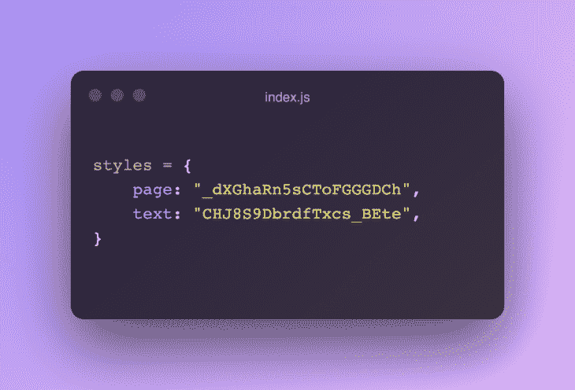
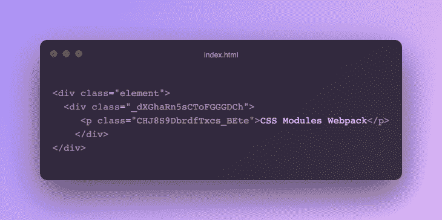

# 如何为 webpack 配置 CSS 模块

> 原文：<https://blog.logrocket.com/how-to-configure-css-modules-webpack/>

随着您的应用程序或网站变得越来越大，只使用一个 CSS 文件变得越来越困难。这种大小的增加可能会导致大量的问题，比如试图拥有不同的选择器名称，以及上下滚动以在巨大的文件中查找和编辑单个选择器。

有了 CSS 模块，你可以传统地编写你的 CSS 规则，但是样式是和 JavaScript 一起使用的，并且在本地限定范围，以避免在其他地方产生意外的副作用。这是通过为 CSS 选择器创建唯一的类名来实现的，允许您在不同的文件中使用相同的 CSS 类名，而不用担心名称冲突。此外，您不需要想出不同的选择器名称，这为您提供了组件中 CSS 的完全灵活性和可重用性。

简而言之，CSS 模块是基于组件的样式表，允许我们通过创建唯一的类和作用域选择器来创建包含的模块化 CSS。

在本文中，我们将通过一个 webpack 演示项目来练习使用 CSS 模块，以了解如何配置应用程序来避免 CSS 众所周知的棘手的全局范围问题。

## 设置 webpack

让我们从设置 webpack 开始。我们的演示应用程序有一个包含`index.html`、`style.css`和`index.js`的`src`文件夹。

在`src`文件夹之外，我们有自己的`webpack.config.js`、`babel.config.js`、`package.json`和`package-lock.json`文件。


您可以使用`npm run build`命令构建项目，并使用`npm run dev`在 localhost 8080 中启动应用程序。

现在，在`package.json`文件中，我们应该已经安装了`webpack`、`webpack-cli`、`webpack-dev-server`、`html-webpack-plugin`。

`babel`-相关模块用于将现代的 JavaScript 转换成较旧的语法，`CleanWebpackPlugin`会在每次构建项目时删除`dist`文件夹的内容。

对于`webpack.config.js`文件，我们有一些这样写的配置:

```
const path = require("path");
const HtmlWebpackPlugin = require("html-webpack-plugin");
const { CleanWebpackPlugin } = require("clean-webpack-plugin");

module.exports = {
  entry: {
    main: "./src/index.js",
  },
  output: {
    path: path.resolve(__dirname, "dist"),
    filename: "main.js",
    publicPath: "",
  },
  target: ["web", "es5"],
  stats: { children: true },
  mode: "development",
  devServer: {
    static: path.resolve(__dirname, "./dist"),
    compress: true,
    port: 8080,
    open: true,
  },
  devtool: "inline-source-map",
  module: {
    rules: [
      {
        test: /\\.js$/,
        loader: "babel-loader",
        exclude: "/node_modules/",
      },
    ],
  },
  plugins: [
    new HtmlWebpackPlugin({
      template: "./src/index.html",
    }),
    new CleanWebpackPlugin(),
  ],
}; 

```

为了使用 CSS 模块，我们需要安装`style-loader`和`css-loader`:

```
npm i css-loader --save-dev
npm i style-loader --save-dev

```

我们需要`css-loader`模块像`import/require()`一样解释`@import`和`url()`，并解析它们，同时需要`style-loader`模块将我们的 CSS 注入 DOM。

## 设置`style-loader`和`css-loader`

我们已经在我们的`rules`数组中设置了`babel-loader`；这是在 webpack 中添加加载器的地方。

[加载器](https://webpack.js.org/loaders/)告诉 webpack 如何在文件被添加到依赖图之前修改它们。数组由我们的加载器组成，帮助我们对文件执行转换。这些有助于加载文件和图像。

请注意，我们可以将多个加载器链接在一起。在下面的代码块中，`css-loader`和`style-loader`一起使用。

类似于`babel-loader`，我们可以像这样加载 CSS 文件来设计我们的页面:

```
module: {
    rules: [
      {
        test: /\\.js$/,
        loader: "babel-loader",
        exclude: "/node_modules/",
      },
     // CSS rules
      {
        test: /\\.css$/,
        use: [
          "style-loader",
          {
            loader: "css-loader",
            options: {
              importLoaders: 1,
              modules: true,
            },
          },
        ],
      },
    ],
  },

```

在`babel-loader`之后，我们有几个其他的对象将寻找任何 CSS 文件并转换它们:

*   `test`键告诉 webpack 将此规则应用于任何以扩展名`.css`结尾的文件
*   `importLoaders`选项被赋予一个值`1`，它设置了在 CSS 模块和`@import` at-rule 之前应用的加载程序的数量
*   最后，`modules:true`选项启用 CSS 模块

## 创建 HTML 文件

在 HTML 中，我们有一个类名为`element`的`div`。我们将在 JavaScript 文件中访问这个元素:

```
<!DOCTYPE html>
<html lang="en">
  <head>
    <meta charset="UTF-8" />
    <meta http-equiv="X-UA-Compatible" content="IE=edge" />
    <meta name="viewport" content="width=device-width, initial-scale=1.0" />
    <title>CSS Modules Webpack</title>
  </head>
  <body>
    <div class="element"></div>
  </body>
</html>

```

## 创建 CSS 文件

在`src`文件夹中，我们有`style.css`文件。让我们在里面添加一些 CSS:

```
:global body {
  margin: 0;
  padding: 0;
}

.page {
  background-color: purple;
  width: 100vw;
  height: 100vh;
  font-family: "Helvetica Neue", Arial, sans-serif;
  display: flex;
  align-items: center;
  justify-content: center;
}

.text {
  text-transoform: capitalize;
  color: #fff;
  font-weight: bold;
  font-size: 4em;
}

```

如您所见，我们为`body`选择器和另外两个类名设置了样式。

你可能认识到我们在身体选择器之前有`:global`。这将允许我们为`body`选择器编写全局样式。

我们不需要在`index.html`中添加一个`link`标签；相反，我们将在 JavaScript 文件中导入我们的`style.css`:

```
// index.js

import styles from "./style.css";

console.log(styles);

```

没有 webpack，用 JavaScript 导入 CSS 文件是不可能的。一旦我们连接了`css-loader`，webpack 将能够处理这个导入，并将我们的 CSS 文件放入包中。

所以，为了开始理解 CSS 模块，让我们先来看看这个`import`声明:`import styles from './style.css';`。

让我们看看通过控制台日志记录从`styles`对象中得到什么:



我们的`page`和`text`类名将被编译成由字母、数字和字符组成的随机字符串。基于此，我们可以用`styles.page`和`styles.text`来指代我们的类。

因此，我们可以在保持非全局 CSS 的优点的同时，轻松地引用简单的类。这将把生成的类名添加到我们的`import`语句中，然后我们可以利用引用生成的`classNames`的`style`对象:

```
const element = document.querySelector(".element");

element.innerHTML = `<div class="${styles.page}">
     <p class="${styles.text}">CSS Modules Webpack</p>
   </div>`;

```

现在，`npm run build`命令在`dist`文件夹中构建我们项目的捆绑版本。

运行`npm run dev`将显示应用于页面的样式。


我们可以在 DOM 树中看到生成的类名。



## 结论

在本文中，我们学习了如何在 webpack 中使用 CSS 模块。我用过 vanilla JS，但是你也可以在 Gatsby、 [React](https://blog.logrocket.com/the-best-styling-in-react-tutorial-youve-ever-seen-676f1284b945/#:~:text=Method%20%233%3A%20CSS%C2%A0Modules) 和 Next.js 中使用 CSS 模块。

编写模块化风格在 web 开发社区中变得越来越重要，并且出现了与 CSS 模块相似的不同方法。其中之一是 CSS-in-JS，或 [styled-components](https://blog.logrocket.com/8-awesome-features-of-styled-components/) 。有了这个，你可以直接在你的 JavaScript 文件中写 CSS。

你可以在 [GitHub](https://github.com/hulyak/css-module-webpack) 上找到这个演示项目！

## 使用 [LogRocket](https://lp.logrocket.com/blg/signup) 消除传统错误报告的干扰

[](https://lp.logrocket.com/blg/signup)

[LogRocket](https://lp.logrocket.com/blg/signup) 是一个数字体验分析解决方案，它可以保护您免受数百个假阳性错误警报的影响，只针对几个真正重要的项目。LogRocket 会告诉您应用程序中实际影响用户的最具影响力的 bug 和 UX 问题。

然后，使用具有深层技术遥测的会话重放来确切地查看用户看到了什么以及是什么导致了问题，就像你在他们身后看一样。

LogRocket 自动聚合客户端错误、JS 异常、前端性能指标和用户交互。然后 LogRocket 使用机器学习来告诉你哪些问题正在影响大多数用户，并提供你需要修复它的上下文。

关注重要的 bug—[今天就试试 LogRocket】。](https://lp.logrocket.com/blg/signup-issue-free)

## 你的前端是否占用了用户的 CPU？

随着 web 前端变得越来越复杂，资源贪婪的特性对浏览器的要求越来越高。如果您对监控和跟踪生产环境中所有用户的客户端 CPU 使用情况、内存使用情况等感兴趣，

[try LogRocket](https://lp.logrocket.com/blg/css-signup)

.

[](https://lp.logrocket.com/blg/css-signup)[https://logrocket.com/signup/](https://lp.logrocket.com/blg/css-signup)

LogRocket 就像是网络和移动应用的 DVR，记录你的网络应用或网站上发生的一切。您可以汇总和报告关键的前端性能指标，重放用户会话和应用程序状态，记录网络请求，并自动显示所有错误，而不是猜测问题发生的原因。

现代化您调试 web 和移动应用的方式— [开始免费监控](https://lp.logrocket.com/blg/css-signup)。