# 如何用 React - LogRocket 博客创建一个定制的 toast 组件

> 原文：<https://blog.logrocket.com/how-to-create-a-custom-toast-component-with-react/>

Toast 通知是向用户显示信息的类模态元素，通常以按钮或另一种行动号召的形式出现。显示的消息往往很简短，有时会通过用户操作删除或设置为自动过期。最重要的是，toast 通知不会干扰用户与您的应用程序的交互，无论他们使用的是桌面还是移动设备。

开发人员通常使用 toast 通知来显示以下内容:

*   表单提交或 API 请求成功时的成功消息
*   API 请求失败时的错误消息
*   聊天信息

在本教程中，我将演示如何用 React 创建一个定制的 toast 组件。我们将使用 React 挂钩，如`useState`和`useEffect`。在创建了 toast 组件之后，我们将添加一些简单的按钮来测试并在页面上显示 toast。

下面是我们创建并调用 toast 通知后的样子:

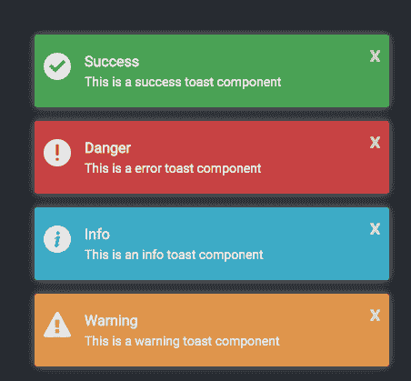

你可以在  中参考本教程的完整源代码。

在我们创建了一些触发 toast 通知的按钮后，页面应该如下所示:

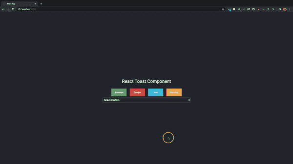

最后，我们将演示如何自动删除 toast 通知。


让我们开始吧！

## 入门指南

为了演示如何创建定制的 toast 组件，我们必须首先创建一个 React 应用程序。我假设你的电脑上已经安装了 [Node.js](https://nodejs.org/en/) 。Node.js 附带 npm，我们将使用 [`create-react-app`](https://blog.logrocket.com/getting-started-with-create-react-app-d93147444a27/) 和 npx 来构建我们的 React 应用程序。

打开终端，导航到您想要添加项目的目录，然后键入以下内容。

```
npx create-react-app react-toast
```

您可以随意命名该项目。我们不会在项目中安装任何其他模块；我们将简单地使用由`create-react-app`工具添加的模块。

默认的文件夹结构如下。

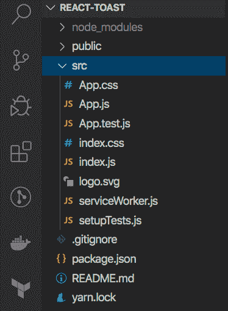

文件夹是我们完成大部分工作的地方。在`src`中，创建一个名为`components`的新文件夹。我们将把我们的 toast 和 button 组件添加到这个文件夹中。

在 React 中，您可以使用类组件，这需要您扩展一个`React.Component`并创建一个返回 React 元素的呈现函数，也可以使用函数组件，这只是接受 props 并返回 React 元素的普通 JavaScript 函数。我们将在本教程中使用功能组件。`create-react-app`默认使用功能组件。

在`App.js`组件内部，您可以删除 header 元素的内容，并用`className="app-header"`将标题更改为 div。父元素类应该改为`app`。我们还会把函数改成箭头函数(这只是我个人的喜好；如果您愿意，可以随意使用默认功能)。

```
import React from 'react';

import './App.css';

const App = () => {
    return (
        <div className="app">
            <div className="app-header">

            </div>
        </div>
    );
}
export default App;

```

接下来，将 CSS 样式添加到`App.css`文件中。删除`App.css`的内容，并将样式添加到文件中。你可以从 [GitHub](https://github.com/uzochukwueddie/react-toast/blob/master/src/App.css) 获得 CSS 样式。

CSS 文件中的某些带有样式的元素尚未添加。随着我们的进展，我们将添加这些元素。这些样式由一些简单的 CSS 属性组成。

删除`index.css`的内容，增加以下内容。

```
@import url('https://fonts.googleapis.com/css?family=Roboto&display=swap');
body {
  margin: 0;
  font-family: 'Roboto', 'sans-serif';
}

```

## 创建 toast 组件

要创建一个 toast 组件，在`components`目录下创建一个名为`toast`的文件夹，并添加两个文件:`Toast.js`和`Toast.css`。我们正在使用。我们的 JavaScript 文件和 CSS 的 js 扩展名——可选地，您可以使用 JSX 和 s CSS 文件。


在`Toast.js`文件中，创建一个名为`Toast`的箭头函数，并将导出函数设置为`default`。将父元素设置为空标记。

```
import React from 'react';
const Toast = () => {
    return (
        <>

        </>
    )
}
export default Toast;

```

该函数将始终返回一个 React 元素。要添加的第一个元素是通知容器，它将包装将要显示的每个 toast 通知元素。

```
<div className="notification-container">
</div>

```

稍后，我们将添加一个动态属性来显示通知容器的位置。我们将在容器中添加其他元素来显示按钮、图像、标题和消息。

```
<div className="notification toast">
    <button>
        X
    </button>
    <div className="notification-image">
        
    </div>
    <div>
        <p className="notification-title">Title</p>
        <p className="notification-message">Message</p>
    </div>
</div>

```

该按钮将用于关闭特定的烤面包通知。将根据烤面包的类型显示一个图像图标。我们最终将得到四种类型的烤面包:

1.  成功
2.  危险
3.  信息
4.  警告

将`Toast.css`文件导入到组件中，并将下面的`notification-container`CSS 样式添加到`Toast.css`文件中。

```
.notification-container {
    font-size: 14px;
    box-sizing: border-box;
    position: fixed;
}

```

吐司元素有四种不同的位置:

1.  右上方
2.  右下方
3.  左上角
4.  左下方

以下是该职位的 CSS 样式。

* * *

### 更多来自 LogRocket 的精彩文章:

* * *

```
.top-right {
    top: 12px;
    right: 12px;
    transition: transform .6s ease-in-out;
    animation: toast-in-right .7s;
}

.bottom-right {
    bottom: 12px;
    right: 12px;
    transition: transform .6s ease-in-out;
    animation: toast-in-right .7s;
}

.top-left {
    top: 12px;
    left: 12px;
    transition: transform .6s ease-in;
    animation: toast-in-left .7s;
}

.bottom-left {
    bottom: 12px;
    left: 12px;
    transition: transform .6s ease-in;
    animation: toast-in-left .7s;
}

```

这些位置将根据用户添加到 toast 组件的`position props`动态添加。

接下来的 CSS 样式用于样式化 notification 类，它包含 remove 按钮、图像、标题、消息和动画，用于在页面的左侧或右侧滑动 toast。从 [GitHub repo](https://github.com/uzochukwueddie/react-toast/blob/master/src/components/toast/Toast.css) 中复制样式并添加到`Toast.css`文件中。

为了查看 toast 组件是什么样子，让我们应用一些属性，比如`position`，作为`props`在 toast 组件中传递。

`Props`或`properties`，用于在 React 中将数据从一个组件传递到另一个组件。

toast 组件接受两个道具:`toastList`和`position`。`toastList`代表一个包含对象的数组，`position`决定了通知容器在页面上的位置。让我们给`Toast`函数添加一个`props`参数，然后使用 ES6 对象`destructing`来获得`toastList`和`position`道具。

```
const Toast = (props) => {
    const { toastList, position } = props;

    return (
        <>
            ...
        </>
    )
}
export default Toast;

```

要使用`position`道具，将其添加到带有`notification-container`的`className`的元素中。从`notification-container`中删除类，然后添加:

```
className={`notification-container ${position}`}

```

接下来，从 notification div 中删除该类，并添加以下内容。

```
className={`notification toast ${position}`}

```

无论 position prop 被传递到 toast 组件中，它都将作为一个类被添加到这些元素中(回想一下，我们已经在 CSS 文件中设置了 CSS position 属性)。

因为`toastList`是一个数组，我们可以在 HTML 中直接循环它，但是我不打算这么做。相反，我将使用`useState`钩子来创建一个新的属性。 [`useState`](https://reactjs.org/docs/hooks-reference.html#usestate) 允许你创建一个有状态变量和一个函数来更新它。

首先，从 React 导入`useState`和`useEffect`钩子，其中`useState`将用于创建一个变量和一个更新变量的函数。当需要重新渲染时，将调用`useEffect`钩子。

```
import React, { useState, useEffect } from 'react';

```

在道具破坏后加上这个:

```
const [list, setList] = useState(toastList);

```

无论`toastList`数组的默认值是什么，`useState`列表的默认值将是什么。

添加`useEffect`方法并使用`setList`来更新列表属性。

```
useEffect(() => {
    setList(toastList);
}, [toastList, list]);

```

`useEffect`钩子接受一个函数和一个依赖数组。每当一个新的对象被添加到作为道具传递的`toastList`数组时，`setList`方法被用来更新列表数组。该数组由依赖项组成，每当这些依赖项的值发生变化时都会被监视。换句话说，当依赖关系数组中的值有更新时，总是会调用`useEffect`方法。

让我们遍历 HTML 中的列表数组。我们将使用`map`方法来遍历数组。

```
import React, { useState, useEffect } from 'react';

import './Toast.css';

const Toast = props => {
    const { toastList, position } = props;
    const [list, setList] = useState(toastList);

    useEffect(() => {
        setList(toastList);
    }, [toastList, list]);

    return (
        <>
            <div className={`notification-container ${position}`}>
                {
                    list.map((toast, i) =>     
                        <div 
                            key={i}
                            className={`notification toast ${position}`}
                        >
                            <button>
                                X
                            </button>
                            <div className="notification-image">
                                
                            </div>
                            <div>
                                <p className="notification-title">{toast.title}</p>
                                <p className="notification-message">
                                    {toast.description}
                                </p>
                            </div>
                        </div>
                    )
                }
            </div>
        </>
    );
}

```

将被添加到`toastList`数组的对象的结构如下所示:

```
{
    id: 1,
    title: 'Success',
    description: 'This is a success toast component',
    backgroundColor: '#5cb85c',
    icon: ''
}

```

我们将动态添加吐司的背景颜色。为此，我们需要向通知元素添加一个样式属性。在具有类`notification toast`的元素上，添加一个将使用列表中的`backgroundColor`的样式属性。在`className`之后加上它。

```
style={{ backgroundColor: toast.backgroundColor }}

```

现在让我们在`App`组件中使用这个组件。进入`App`组件并导入`toast`组件。

```
import Toast from './components/toast/Toast';

```

在类名为`app-header`的 div 元素之后，添加`toast`组件。

```
<Toast />

```

现在我们需要将道具传递给`toast`组件。去 [GitHub repo](https://github.com/uzochukwueddie/react-toast/tree/master/src/assets) 下载吐司图标的 SVG 文件。在 src 文件夹中创建一个名为`assets`的新目录，并添加所有的 SVG 文件。

将导入添加到`App`组件。

```
import checkIcon from './assets/check.svg';
import errorIcon from './assets/error.svg';
import infoIcon from './assets/info.svg';
import warningIcon from './assets/warning.svg';

```

每个图标将用于以下一种类型的 toast 通知:`success`、`danger`、`info`和`warning`。

为了试验 toast 组件，将这个数组添加到`App`组件中(这只是为了测试)

```
const testList = [
    {
      id: 1,
      title: 'Success',
      description: 'This is a success toast component',
      backgroundColor: '#5cb85c',
      icon: checkIcon
    },
    {
      id: 2,
      title: 'Danger',
      description: 'This is an error toast component',
      backgroundColor: '#d9534f',
      icon: errorIcon
    },
];

```

将此`testList`作为道具传递给 toast 组件，并将位置设置为`bottom-right`。

```
<Toast 
    toastList={testList}
    position="bottom-right"
/>

```

回想一下，`toastList`和`position`是我们在 toast 组件中析构的道具。

在终端中打开项目，运行`npm start`或`yarn start`启动服务器。服务器应该运行在端口 3000 上。这是浏览器上的结果:

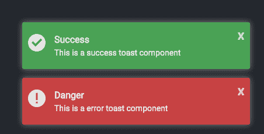

您可以更改位置来查看祝酒词在页面上的位置。如果您将鼠标悬停在 toast 元素上，您会看到一些效果。将以下对象添加到`testList`数组。

```
{
    id: 3,
    title: 'Info',
    description: 'This is an info toast component',
    backgroundColor: '#5bc0de',
    icon: infoIcon
},
{
    id: 4,
    title: 'Warning',
    description: 'This is a warning toast component',
    backgroundColor: '#f0ad4e',
    icon: warningIcon
}

```

将其他对象添加到数组后，toast 组件应该如下所示:


让我们给 toast 组件添加一些`prop-types`。React 提供了[类型检查特性](https://blog.logrocket.com/how-to-build-a-type-safe-react-redux-app/)来验证组件接收了正确类型的道具。`PropTypes`帮助确保组件获得正确类型的道具。

从 React 导入`prop-types`。toast 组件需要两个道具`toastList`和`position`。

```
import PropTypes from 'prop-types';

```

在 toast 组件箭头函数下面添加以下道具检查。

```
Toast.defaultProps = {
    position: 'bottom-right'
}

Toast.propTypes = {
    toastList: PropTypes.array.isRequired,
    position: PropTypes.string
}

```

`position`道具不是必须的道具，但是如果你愿意，你可以把它变成必须的。如果没有设置位置，将使用默认的位置属性。

## 添加按钮组件

现在我们已经构建了一个 toast 组件，让我们创建一个按钮组件，并使用按钮来触发 toast 通知。

创建一个名为`button`的新文件夹，并添加一个名为`Button.js`的文件。将以下代码粘贴到文件中。

```
import React from 'react';
import PropTypes from 'prop-types';

const Button = props => {
    const { label, className, handleClick } = props;
    return (
        <>
            <button 
                className={className}
                onClick={handleClick}
            >
                {label}
            </button>
        </>
    );
}

Button.propTypes = {
    label: PropTypes.string.isRequired,
    className: PropTypes.string.isRequired,
    handleClick: PropTypes.func
}

export default Button;

```

按钮组件内部需要的道具是标签、`className`和`handleClick`，这是按钮上的`onClick`方法。我们需要做的就是将道具传递给按钮组件。

在`App`组件中，导入`Button`组件，然后在`App`箭头函数之前添加一个`BUTTON_PROPS`数组。

```
import Button from './components/button/Button';

```

```
const BUTTON_PROPS = [
  {
    id: 1,
    type: 'success',
    className: 'success',
    label: 'Success'
  },
  {
    id: 2,
    type: 'danger',
    className: 'danger',
    label: 'Danger'
  },
  {
    id: 3,
    type: 'info',
    className: 'info',
    label: 'Info'
  },
  {
    id: 4,
    type: 'warning',
    className: 'warning',
    label: 'Warning'
  },
];

```

我们添加这个数组是为了在一个循环中传递具有不同属性的`Button`组件。

在具有类`app-header`的 div 元素内，添加以下内容。

```
<p>React Toast Component</p>
<div className="toast-buttons">
    {
        BUTTON_PROPS.map(e => 
            <Button 
                key={e.id}
                className={e.className}
                label={e.label}
                handleClick={() => showToast(e.type)}
            />
        )
    }
</div>

```

我们没有创建四个不同的按钮，而是在一个循环中使用了一个按钮。循环根据`BUTTON_PROPS`的长度显示按钮的数量。

创建一个名为`showToast`的函数，并传递一个名为`type`的参数。

```
const showToast = (type) => {
}

```


导入`useState`钩子，然后创建一个名为 list 的新属性。

```
const [list, setList] = useState([]);

```

当点击任何按钮时，应用程序都会根据用户选择的位置显示相应的 toast。如果没有选择位置，则使用默认位置。

在`showToast`方法中，我们将使用 JavaScript switch 语句将相应的 toast 对象传递到`toastList`数组中。

创建一个新变量。

```
let toastProperties = null;

```

我们将随机生成每个 toast 通知的 id，因为在添加删除功能时我们将使用这些 id。

在`showToast`方法中，添加以下内容。

```
const id = Math.floor((Math.random() * 100) + 1);

```

id 将介于 1 和 100 之间。switch 语句中的每种情况都对应一个按钮。
案例有`success`、`danger`、`info`和`warning`。

在`showToast`方法中添加以下开关案例。

```
switch(type) {
    case 'success':
        toastProperties = {
            id,
            title: 'Success',
            description: 'This is a success toast component',
            backgroundColor: '#5cb85c',
            icon: checkIcon
        }
        break;
    case 'danger':
        toastProperties = {
            id,
            title: 'Danger',
            description: 'This is an error toast component',
            backgroundColor: '#d9534f',
            icon: errorIcon
        }
        break;
    case 'info':
        toastProperties = {
            id,
            title: 'Info',
            description: 'This is an info toast component',
            backgroundColor: '#5bc0de',
            icon: infoIcon
        }
        break;
    case 'warning':
        toastProperties = {
            id,
            title: 'Warning',
            description: 'This is a warning toast component',
            backgroundColor: '#f0ad4e',
            icon: warningIcon
        }
        break;
    default:
        setList([]);
}
setList([...list, toastProperties]);

```

每种情况下的`toastProperties`对象都是我们在`testList`中拥有的相同对象。你可以删除`testList`数组。如果点击`success`按钮，`toastProperties`对象将被添加到列表数组中。

```
setList([...list, toastProperties]);

```

列表数组首先使用 spread 操作符进行析构，然后添加`toastProperties`对象。`setList`方法用于更新列表数组。

现在,`App`组件中的 toast 组件应该是这样的:

```
<Toast 
    toastList={list}
    position="bottom-right"
/>

```


这里，我们使用`bottom-right`位置来放置 toast 通知。让我们创建一个 select 标记，用户可以从下拉列表中选择一个位置。

将这些 div 添加到`App`组件中的`toast-buttons` div 下面。

```
<div className="select">
    <select
        name="position"
        value={position}
        onChange={selectPosition}
        className="position-select"
    >
        <option>Select Position</option>
        <option value="top-right">Top Right</option>
        <option value="top-left">Top Left</option>
        <option value="bottom-left">Bottom Left</option>
        <option value="bottom-right">Bottom Right</option>
    </select>
</div>
>
```

`select`标签具有名称、值和`onChange`属性。每当选择一个选项时，`position`属性将被更新并设置为`select`标签上的`value`属性。将使用`onChange`的`selectPosition`方法中的`useState`方法更新位置。

添加一个新的`useState`方法。

```
const [position, setPosition] = useState();

```

如您所见，`useState`没有默认值。这是因为我们为 toast 组件内部的位置设置了一个默认属性。如果你不想在 toast 组件中设置默认属性，你可以把默认属性添加到`useState`中。

创建一个名为`selectPosition`的函数，它接受一个名为 event 的参数。在这个方法中，我们将把`event.target.value`传递给`setPosition`来根据用户选择的选项更新位置。我们还将传递一个空数组到`setList`方法中，每当从标签中选择一个新的位置时，该方法总是清除列表数组。

```
const selectPosition = (event) => {
    setPosition(event.target.value);
    setList([]);
}

```

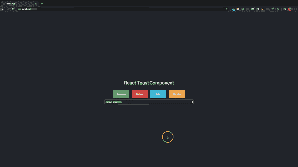

将 toast 组件上的 position prop 设置为`useState`位置变量后，`App`组件中的 toast 组件应该如下所示:

```
<Toast 
    toastList={list}
    position={position}
/>

```

如果用户在点击按钮前没有选择位置，将使用在 toast 组件`prop-types`上设置的默认位置。

右上角:

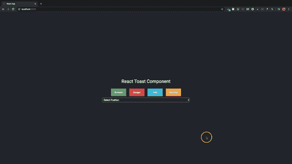

左上角:

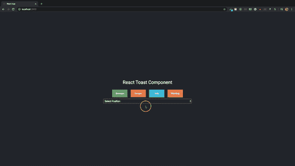

左下方:

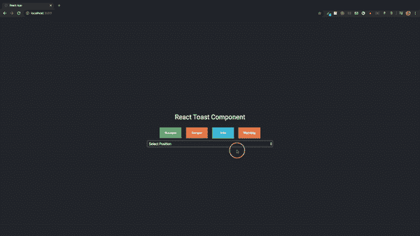

右下方:

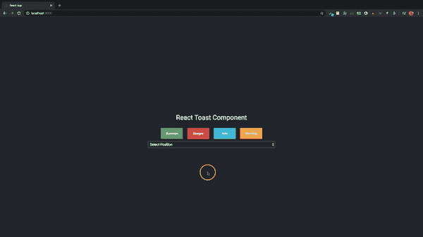

## 删除 toast 通知

到目前为止，我们已经创建了一个 toast 组件，并设置了单击按钮时显示的通知。现在是时候添加一个从页面和`toastList`数组中删除 toast 的方法了。

我们将使用 JavaScript 方法`findIndex`和`splice`。我们还将使用`toastList`对象数组中 toast 的惟一 ID 来查找对象的索引，并使用`splice`方法从数组中移除对象，从而从页面中清除特定的 toast。

进入你的吐司组件。在按钮上，添加一个带有名为`deleteToast`的方法的`onClick`，该方法将一个 toast ID 作为参数。

```
onClick={() => deleteToast(toast.id)}

```

创建一个`deleteToast`方法。

```
const deleteToast = id => {
    const index = list.findIndex(e => e.id === id);
    list.splice(index, 1);
    setList([...list]);
}

```

在列表数组中获得 toast 对象的索引后，在 splice 方法中使用该索引，该方法从数组中移除该索引处的属性。数字`1`让拼接方法知道我们只想删除一个值。

移除 toast 后，使用 spread 操作符通过`setList`方法更新列表数组。这就是删除 toast 通知所需做的全部工作。

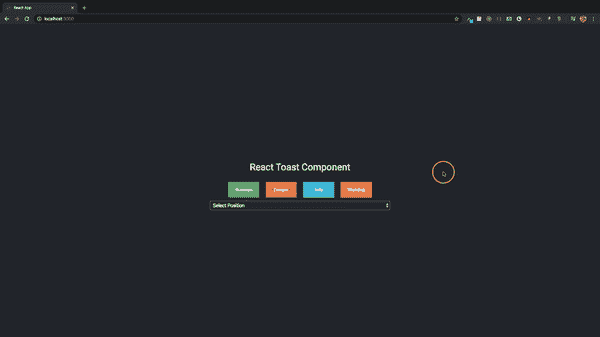

在 

如果你喜欢看我写代码，你可以在 YouTube 上看看这个[视频教程。](https://www.youtube.com/watch?v=Zh8qBhnVAWI&t=1s)

## 自动删除 toast 通知

通过在 JavaScript `setInterval`方法中添加删除功能，可以在一定时间过后自动删除 Toast 通知。

toast 通知组件将采用两个新的`props`:

*   `autoDelete` —决定是否需要删除通知的布尔值
*   `autoDeleteTime` —以毫秒为单位的数字

将新属性添加到 toast 组件中的`props`对象。

```
const { ..., autoDelete, autoDeleteTime } = props;

```

您可以向一个功能组件添加多个 React `useEffect`方法，只要您保持它们被调用的顺序。

添加另一个`useEffect`方法。

```
useEffect(() => {
}, []);

```

在这个`useEffect`里面，添加`setInterval()`方法。

```
useEffect(() => {
    const interval = setInterval(() => {

    }, autoDeleteTime);
}, []);

```

`setInterval`方法的第二个参数是`autoDeleteTime`，它是一个以毫秒为单位的数字，决定了如何调用`setInterval`方法。`interval`变量是一个需要通过调用`clearInterval()`方法来清除的数字。`clearInterval()`方法清除用`setInterval()`方法设置的定时器。间隔在`useEffect`清理方法中被清除。

```
useEffect(() => {
    const interval = setInterval(() => {

    }, autoDeleteTime);
    return () => {
        clearInterval(interval);
    }
}, []);

```

在`useEffect`方法卸载并启动新的 rerender 后，调用 cleanup 方法。如果没有调用`clearInterval`方法，`interval`变量将总是保存最后的计时器值，这将导致关于如何调用`setInterval`方法的问题。

让我们通过从`toastList`数组中移除条目来更新`deleteToast`方法。

```
const deleteToast = id => {
    ...
    ...
    const toastListItem = toastList.findIndex(e => e.id === id);
    toastList.splice(toastListItem, 1);
    ...
}

```

每当从`list`数组中删除一个项目时，该项目也会从`toastList`数组中删除。在`setInterval()`中会调用`deleteToast`方法。

`autoDelete`属性是一个布尔值，它决定通知是否在某个时间后自动删除。如果属性为`true`，通知将被自动删除。否则，它们不会自动删除。

在`setInterval()`中，我们需要检查`autoDelete`是否为真，以及`list`和`toastList`数组中是否有值。回想一下，`deleteToast`方法需要一个`id`参数来从数组中移除 toast。我们将获取`toastList`数组中第一项的`id`，并将其传递给`deleteToast`方法。

```
useEffect(() => {
    const interval = setInterval(() => {
        if (autoDelete && toastList.length && list.length) {
            deleteToast(toastList[0].id);
        }
    }, autoDeleteTime);
    return () => {
        clearInterval(interval);
    }
}, []);

```

每次调用`setInterval`时，索引为 0 的项的 ID 被传递给 delete 方法。如果`toastList`和列表数组中没有更多的值，则跳过该方法。我们不需要组件内的`defaultProps`，所以它可以被移除。

将这些添加到道具验证中:

```
Toast.propTypes = {
    ...
    autoDelete: PropTypes.bool,
    autoDeleteTime: PropTypes.number
}

```

现在我们已经用新的属性更新了 toast 组件，让我们从`App`组件内部将这些值作为道具添加到组件中。出于演示的目的，我将添加一个复选框输入和一个文本输入，这样用户就可以动态地设置道具的值。

在`App`组件中添加两个`useState`变量。

```
let [checkValue, setCheckValue] = useState(false);
const [autoDeleteTime, setAutoDeleteTime] = useState(0);

```

在 select dropdown 标记之前，添加以下新元素:

```
<div className="select">
    <input 
    id="auto"
    type="checkbox"
    name="checkbox"
    value={}
    onChange={}
    />
    <label htmlFor="auto">Auto Dismiss</label>
</div>

<div className="select">
    <input 
    type="text"
    name="checkbox"
    placeholder="Dismiss time Ex: 3000"
    autoComplete="false"
    onChange={}
    />
</div>

```

新元素的 CSS 样式:

```
input[type=checkbox] + label {
  display: block;
  cursor: pointer;
  margin-top: 1em;
}

input[type=checkbox] {
  display: none;
}

input[type=checkbox] + label:before {
  content: "\2714";
  border: 0.1em solid #fff;
  border-radius: 0.2em;
  display: inline-block;
  width: 1em;
  height: 1em;
  padding-top: 0.1em;
  padding-left: 0.2em;
  padding-bottom: 0.3em;
  margin-right: 1em;
  vertical-align: bottom;
  color: transparent;
  transition: .2s;
}

input[type=checkbox] + label:active:before {
  transform: scale(0);
}

input[type=checkbox]:checked + label:before {
  background-color: #4aa1f3;
  border-color: #4aa1f3;
  color: #fff;
}

label {
  font-size: 14px;
}

input[type=text] {
  margin: 15px 0;
    padding: 15px 10px;
    width: 100%;
    outline: none;
    border: 1px solid #bbb;
    border-radius: 5px;
  height: 1px;
  background-color: #282c34;
  font-size: 14px;
  color: #fff;
}

.disabled {
  cursor: none;
  pointer-events: none;
  opacity: 0.5;
}

.btn-disable {
  cursor: none;
  pointer-events: none;
  opacity: 0.6;
}

::-webkit-input-placeholder {
  color: #acabab;
  font-style: italic;
}

:-ms-input-placeholder {
  color: #acabab;
  font-style: italic;
}

::placeholder {
  color: #acabab;
  font-style: italic;
}

```

让我们禁用按钮，直到从选择下拉列表中选择了一个位置，如果未选中自动消除复选框，也禁用输入。为了实现这一点，将字符串`Select Position`添加到`position`的`useState`方法中。

```
const [position, setPosition] = useState('Select Position');

```

然后，在按钮`className`上，添加:

```
className={`${position === 'Select Position' ? `${e.className} btn-disable` : `${e.className}`}`}

```

如果位置是字符串`Select Position`，为每个按钮添加类`btn-disable`和类名。如果位置不是字符串`Select Position`，那么只添加按钮类名。

在用于添加自动删除时间的输入文本框中，添加:

```
className={`${!checkValue ? 'disabled' : ''}`}

```

除非勾选复选框，否则默认禁用输入。

禁用的按钮和文本输入:

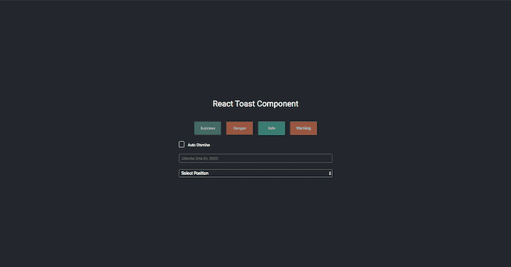

启用的按钮和文本输入:


更新 toast 组件。

```
<Toast 
    toastList={list}
    position={position}
    autoDelete={checkValue}
    autoDeleteTime={autoDeleteTime}
/>

```

在组件内部创建一个新方法`onCheckBoxChange`，并将其添加到复选框输入的`onChange`方法中。

```
<input 
    id="auto"
    type="checkbox"
    name="checkbox"
    value={checkValue}
    onChange={onCheckBoxChange}
/>

```

```
const onCheckBoxChange = () => {
    checkValue = !checkValue;
    setCheckValue(checkValue);
    setList([]);
}

```

`useState` `checkValue`的默认值为`false`。如果该复选框被点击，该值被改变为相反的值，因为它是一个布尔值，然后用`setCheckValue`方法更新，并且`list`数组被重置为空。

向文本输入添加一个`onInputChange`方法。

```
<input 
    className={`${!checkValue ? 'disabled' : ''}`}
    type="text"
    name="checkbox"
    placeholder="Dismiss time Ex: 3000"
    autoComplete="false"
    onChange={onInputChange}
/>

```

```
const onInputChange = (e) => {
    const time = parseInt(e.target.value, 10);
    setAutoDeleteTime(time);
}

```

我们将值从一个字符串转换为一个数字，并将其传递给`setAutoDeleteTime`方法。下面演示了自动删除 toast 通知的结果。

两秒钟后自动删除:

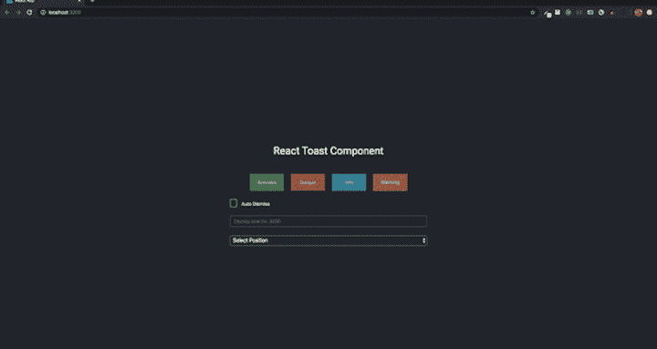

三秒后自动删除:

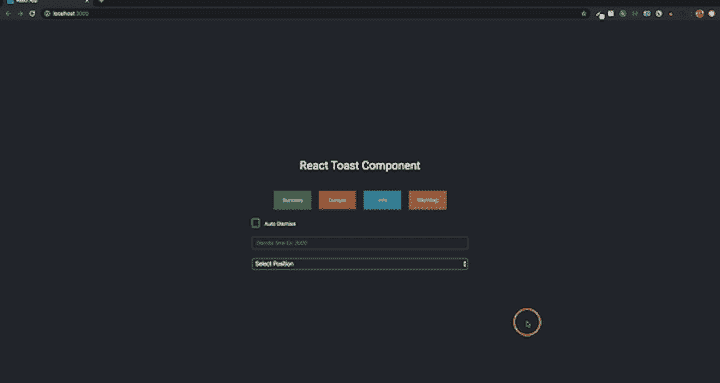

## 结论

本教程将让您对如何创建一个能够显示多个通知的简单 toast 组件有一个坚实的理解。您现在应该知道如何使用流行的 React 挂钩`useState`和`useEffect`，显示和取消 toast 通知，并根据您的需要定制组件。

## 使用 LogRocket 消除传统反应错误报告的噪音

[LogRocket](https://lp.logrocket.com/blg/react-signup-issue-free)

是一款 React analytics 解决方案，可保护您免受数百个误报错误警报的影响，只针对少数真正重要的项目。LogRocket 告诉您 React 应用程序中实际影响用户的最具影响力的 bug 和 UX 问题。

[ ](https://lp.logrocket.com/blg/react-signup-general) [  ](https://lp.logrocket.com/blg/react-signup-general) [LogRocket](https://lp.logrocket.com/blg/react-signup-issue-free)

自动聚合客户端错误、反应错误边界、还原状态、缓慢的组件加载时间、JS 异常、前端性能指标和用户交互。然后，LogRocket 使用机器学习来通知您影响大多数用户的最具影响力的问题，并提供您修复它所需的上下文。

关注重要的 React bug—[今天就试试 LogRocket】。](https://lp.logrocket.com/blg/react-signup-issue-free)