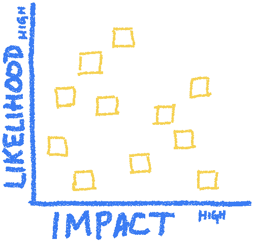

# 如何创建有效的应急计划

> 原文：<https://blog.logrocket.com/product-management/how-to-create-an-effective-contingency-plan/>

在 1998 年，这是一个不值得纪念的日子。《玩具总动员 2》的副技术总监柳文欢·雅各布坐在一位同事旁边，谈论着对即将上映的电影中的一个角色进行改动。他们碰巧瞥了一眼屏幕中间的句子，看到目录中的文件数量迅速减少…40…30…20…10…4…

一种恐慌感随之而来，促使柳文欢打电话到服务器机房，指挥团队拔掉服务器上的每一根电线。当该说的都说了，该做的都做了，电影的 90%已经被删除。

经过进一步调查，有人可能运行了一个命令来清除不需要的文件；然而，他们错误地选择在核心目录上运行它，在那里它开始破坏每一个…单个…文件。在大多数地方，只有少数用户可以访问主目录。在皮克斯，几乎每个电影工作者都有读写权限。

幸运的是，这种情况在皮克斯发生过一次，他们明智地投资了一个备份系统。不幸的是，备份没有经过持续的测试，只捕获了文件的 20 个版本(团队使用的是 420 版本)。多亏了一位远程员工的运气，他下载了整个文件树，Pixar 能够将他们的损失限制在两周的返工量内；然而，这仍然是数百万美元的生产力损失。

皮克斯的故事给我们上了一课，告诉我们制定应急计划的重要性。

应急计划也称为“B 计划”或“备用计划”，组织使用它来有效地应对风险。目的是降低风险的影响。这不要与缓解计划混淆，后者的目的是降低风险发生的概率或避免其部分潜在影响。

* * *

## 目录

* * *

## 如何创建应急计划

创建一个可靠的应急计划和[创建一个风险缓解计划](https://blog.logrocket.com/product-management/effectively-manage-product-risks-product-manager/)实际上有前几个步骤是相同的。

### 确定你的情景和风险

首先，拿几张便利贴，要求每个人列出风险，不管这些风险有多小。每个便利贴一个想法。想想…

*   政治:如果法规改变会发生什么？
*   经济:如果经济衰退会发生什么？
*   技术:如果一个关键系统出现故障，会发生什么？
*   流程:如果供应商迟到、提价或破产，会发生什么？
*   员工:如果有关键员工或者大规模离职会怎么样？
*   竞争:如果替代商品变得可用或更有吸引力，会发生什么？
*   环境:如果发生了与天气相关的灾难，会发生什么？

然后，公开分享想法，留出一点时间进行额外的头脑风暴(以防有人的想法引发另一个想法)。开始将相似的风险聚集在一起，并为每个集群命名。

### 优先考虑最有可能和/或最大的影响

画一个 2×2 的大矩阵。将一个轴命名为“影响”(低、中、高)，将另一个轴命名为“可能性”(低、中、高)。在新的便利贴上复制您的集群名称，并相应地放置它们。尽最大努力不要让两个集群在任何一个轴上都有相同的位置，讨论为什么一个比另一个更有可能或更有影响是一件值得做的事情。

现在是关注多少风险的偏好问题。那些被列为高影响、高可能性的人应该晋级。之后就是高/中或中/高风险见仁见智了。在应急计划的情况下，我建议将重点放在任何具有高度影响的事情上，不管可能性有多大:

在这一点上，如果您要创建一个缓解计划，重要的问题应该是“为什么会发生这种情况？”在应急计划的情况下,“为什么”并不重要，因为假设风险已经发生。

### 创建应急计划本身

在这个计划中，你要回答几个关键问题:

试着把这句话开头作为你计划的简要梗概:万一发生 ***【具体措施】***【条件】**(哪些个人)**【应对制定】__。****

 ****举个例子:如果雷击发生在不到五英里的地方，对于地面上的飞机，空中交通管制会指示飞行员将飞机返回登机口，等待进一步的指示。

### 分享和测试你的计划

经常被忽略的一个重要步骤是共享和重新测试应急计划。在皮克斯的例子中，他们有一个备份系统。缺陷是没有人持续测试应急计划以确保备份的完整性和可用性。

我们建议定期花时间来检查和更新您的计划，并进行测试以确保您的计划是有效的。

## 应急计划的好处(以苹果为例)

几十年来，苹果一直是供应链专业人士的典范。这背后的原因很大程度上是因为他们在采购策略中建立了应急计划。这是现代企业的一个很好的例子，突出了应急计划的重要性。

对于同一组件，苹果使用分布在不同地理位置的多家供应商。虽然据估计，他们集中了前 200 家供应商中 95%的采购工作，但他们还与另外 600 家供应商保持着关系，这使得他们能够在发生灾难或中断时快速转移。

回到我们上面的列表，您可以很容易地看到该计划是如何与已确定的风险情景联系在一起的:

*   政治:随着罢工或停工在中国发生，他们能够转向大陆以外的制造商
*   经济:随着消费者需求的变化，他们可以迅速增减产能
*   流程:如果一个或多个供应商遇到问题，他们可以换成另一个，不需要很长的交付周期
*   竞争:由于有如此多的排他性关系，谷歌和其他公司被自动排除在利用相同的生产线之外

随着 COVID 的消退，苹果更加倾向于这一战略，要求供应商投资进一步的地理多样化。

## 结论

普华永道的一项研究显示，在美国，17%的顾客在一次糟糕的经历后会放弃与他们喜欢的品牌做生意。值得一提的是:我们都有一次糟糕的经历，可能会失去近五分之一的客户。

应急计划的目标不一定是避免所有的服务中断，而是通过一系列有记录的步骤来快速纠正您的业务，从而最大限度地减少服务中断的影响。

毫不奇怪，问题解决的速度与以下因素高度相关:

*   降低运营成本
*   更高的客户满意度(包括推荐和保留)
*   更高的员工满意度

从今天开始，召集一小群合适的人:

*   确定你的情景和风险
*   优先考虑最有可能和/或最大的影响
*   创建应急计划本身
*   分享和测试你的计划

[LogRocket](https://lp.logrocket.com/blg/pm-signup) 产生产品见解，从而导致有意义的行动

## [LogRocket](https://lp.logrocket.com/blg/pm-signup) 确定用户体验中的摩擦点，以便您能够做出明智的产品和设计变更决策，从而实现您的目标。

使用 LogRocket，您可以[了解影响您产品的问题的范围](https://logrocket.com/for/analytics-for-web-applications)，并优先考虑需要做出的更改。LogRocket 简化了工作流程，允许工程和设计团队使用与您相同的[数据进行工作](https://logrocket.com/for/web-analytics-solutions)，消除了对需要做什么的困惑。

让你的团队步调一致——今天就试试 [LogRocket](https://lp.logrocket.com/blg/pm-signup) 。

订阅我们的产品管理简讯
将此类文章发送到您的收件箱

* * *

Subscribe to our product management newsletter
Get articles like this to your inbox

* * *

[Michael Crawford Follow](https://blog.logrocket.com/author/michaelcrawford/) Mike Crawford is the Senior Product Lead in charge of Shopify Tax. He has also spent the past decade building products in Banking, FinTech, Analytics, Homeland Security and Intelligence, as well as helping startups at Ocean Accelerator. Mike, his wife, and twin boys passionately volunteer in Cincinnati, Ohio as Wish Granters for Make A Wish Foundation.****