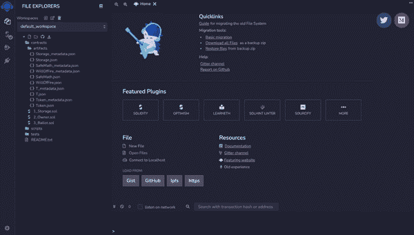
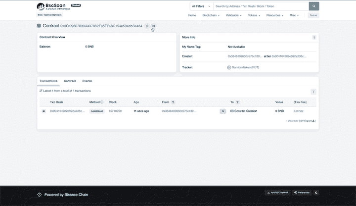

# 如何创建 BEP-20 令牌并将其部署到币安智能链博客

> 原文：<https://blog.logrocket.com/how-to-create-deploy-bep-20-token-binance-smart-chain/>

BEP-20 是币安智能链(BSC)的令牌标准。[币安智能链](https://www.binance.org/en/smartChain)是一个可编程的区块链，支持智能合约和 EVM 兼容性。这使得它成为构建分散式应用程序的良好候选。

为了与 BSC 区块链进行交互，需要使用基于 BEP-20 标准的令牌——BNB 来支付交易，就像在区块链以太坊中使用乙醚来支付汽油费一样。实际上，BEP-20 标准是以太坊上[ERC](https://blog.logrocket.com/create-deploy-erc-20-token-ethereum-blockchain/)T2—[20 标准](https://blog.logrocket.com/create-deploy-erc-20-token-ethereum-blockchain/)的延伸。这使得使用当前的以太坊工具在币安智能链上构建去中心化的应用成为可能。

在本教程中，我们将通过实现 BEP-20 令牌标准来编码一个示例 BEP-20 令牌，使用 Remix 将其部署到币安智能链测试网，在 BscScan 上验证令牌源代码，最后将部署的令牌导入到 MetaMask 中。

我们将详细介绍以下内容:

本指南假设事先了解固体和 EVM。这里有一个关于可靠性的好资源和一个关于 EVM 的[。](https://coinmarketcap.com/alexandria/glossary/ethereum-virtual-machine-evm)

## 实现 BEP-20 令牌提案

BEP-20 令牌需要某些功能来使其他帐户能够正确地与之交互。你可以看看官方 [BEP-20 提案](https://github.com/binance-chain/BEPs/blob/master/BEP20.md)中概述的这些。我建议通读建议书，以熟悉所需的功能。

然而，大多数真实世界的令牌以不同的方式扩展了这个提议。例如，大多数令牌都添加了以下功能:

*   铸造和燃烧代币
*   将令牌合约的所有权转移到不同的地址
*   暂停/播放代币合约作为紧急停止机制

出于本教程的目的，我们将实现基本的 BEP-20 提案，并允许铸造和燃烧令牌。作为练习，您可以进一步扩展这一点，以便更熟悉如何使用令牌。

编码 BEP-20 令牌有几个先决条件:

在 Remix 中对令牌进行编码后，您可以进行测试，然后将其部署到公共网络中。

现在，打开 [Remix](https://remix.ethereum.org/) ，在`/contracts`下创建一个新的`Token.sol`文件。确保它已在编辑器中打开。

让我们开始编写 BEP-20 令牌吧！



声明一个许可证和写令牌的 Solidity 版本(我们将使用最新版本`0.8`和更高版本。

```
// SPDX-License-Identifier: GPL-3.0
pragma solidity >=0.8.0;

```

创建一个名为`Token`的新合同声明。

```
contract Token {
 // All subsequent code will be inside this block
}

```

接下来，让我们逐一初始化实现 BEP-20 令牌标准所需的变量和事件:

```
contract Token {
    string public name; // Holds the name of the token
    string public symbol; // Holds the symbol of the token
    uint8 public decimals; // Holds the decimal places of the token
    uint256 public totalSupply; // Holds the total suppy of the token
    address payable public owner; // Holds the owner of the token

    /* This creates a mapping with all balances */
    mapping (address => uint256) public balanceOf;
    /* This creates a mapping of accounts with allowances */
    mapping (address => mapping (address => uint256)) public allowance;

    /* This event is always fired on a successfull call of the
       transfer, transferFrom, mint, and burn methods */
    event Transfer(address indexed from, address indexed to, uint256 value);
    /* This event is always fired on a successfull call of the approve method */
    event Approve(address indexed owner, address indexed spender, uint256 value);

... code continues below (1)
```

如果你读了这个提议，你会注意到变量和一些函数有相同的名字。这很有用，因为在 Solidity v0.8 及以上版本中，公共变量会自动生成 getter 函数。

因此，实际上，我们将自动提供以下功能:

*   `name()`
*   `symbol()`
*   `decimals()`
*   `totalSupply()`
*   `owner()`
*   `balanceOf()`
*   `allowance()`

接下来，我们定义令牌协定的构造函数。在这个构造函数中，我们指定了令牌的细节，比如名称、符号等。我们铸造(即创建)特定数量的代币，并将它们转移给代币的所有者。

目前，我们将这些值直接硬编码在构造函数定义中，但是也可以从构造函数参数中检索它们。

```
... code continues from above (1)

    constructor() {
        name = "RandomToken"; // Sets the name of the token, i.e Ether
        symbol = "RDT"; // Sets the symbol of the token, i.e ETH
        decimals = 18; // Sets the number of decimal places
        uint256 _initialSupply = 1000000000; // Holds an initial supply of coins

        /* Sets the owner of the token to whoever deployed it */
        owner = payable(msg.sender);

        balanceOf[owner] = _initialSupply; // Transfers all tokens to owner
        totalSupply = _initialSupply; // Sets the total supply of tokens

        /* Whenever tokens are created, burnt, or transfered,
            the Transfer event is fired */
        emit Transfer(address(0), msg.sender, _initialSupply);
    }

... code continues below (2)

```

我们现在可以开始定义那些不是自动为我们创建的函数。记住，所有的公共变量都有 Solidity 0.8 及以上版本自动定义的 getter 函数。

### `getOwner()`

`getOwner()`返回 BEP-20 令牌所有者的地址。它只是返回我们在`constructor`中初始化的`owner`变量。

```
... code continues from above (2)

    function getOwner() public view returns (address) {
        return owner;
    }

... code continues below (3)

```

### `transfer(address _to, uint256 _value)`

`transfer(address _to, uint256 _value)`将指定数量的令牌转移到某个地址。该函数基本上从调用该函数的地址中扣除一个数量(`_value`)。然后将扣除的金额添加到参数中指定的地址(`_to`)。

```
... code continues from above (3)

    function transfer(address _to, uint256 _value) public returns (bool success) {
        uint256 senderBalance = balanceOf[msg.sender];
        uint256 receiverBalance = balanceOf[_to];

        require(_to != address(0), "Receiver address invalid");
        require(_value >= 0, "Value must be greater or equal to 0");
        require(senderBalance > _value, "Not enough balance");

        balanceOf[msg.sender] = senderBalance - _value;
        balanceOf[_to] = receiverBalance + _value;

        emit Transfer(msg.sender, _to, _value);
        return true;
    }

... code continues below (4)

```

### `transferFrom(address _from, address _to, uint256 _value)`

将指定数量的令牌从一个地址转移到另一个地址。这种方法不同于`transfer`，它允许一个账户代表另一个账户转移代币。

为了实现这一功能，津贴由接受者(`_to`)事先批准。所有对此函数的调用都使用预先批准的限额进行转账。

这种方法的一个使用案例是代表您转移令牌和/或收取费用的智能合约。

```
... code continues from above (4)

    function transferFrom(address _from, address _to, uint256 _value)
      public returns (bool success) {
        uint256 senderBalance = balanceOf[msg.sender];
        uint256 fromAllowance = allowance\[_from\][msg.sender];
        uint256 receiverBalance = balanceOf[_to];

        require(_to != address(0), "Receiver address invalid");
        require(_value >= 0, "Value must be greater or equal to 0");
        require(senderBalance > _value, "Not enough balance");
        require(fromAllowance >= _value, "Not enough allowance");

        balanceOf[_from] = senderBalance - _value;
        balanceOf[_to] = receiverBalance + _value;
        allowance\[_from\][msg.sender] = fromAllowance - _value;

        emit Transfer(_from, _to, _value);
        return true;
    }

... code continues below (5)

```

### `approve(address _spender, uint256 _value)`

`approve(address _spender, uint256 _value)`允许一个账户(`_spender`)从另一个账户(调用者)多次提现，最高可达指定金额(`_value`)。这种方法使得`transferFrom`成为可能，因为一个账户能够授权另一个账户代表它进行转账。

```
... code continues from above (5)

    function approve(address _spender, uint256 _value) public returns (bool success) {
        require(_value > 0, "Value must be greater than 0");

        allowance\[msg.sender\][_spender] = _value;

        emit Approve(msg.sender, _spender, _value);
        return true;
    }

... code continues below (6)

```

### `mint(uint256 _amount)`

`mint(uint256 _amount)`允许代币所有者创建指定数量(`_amount`)的新代币，并将它们转移给自己。这增加了代币的总供应量。

* * *

### 更多来自 LogRocket 的精彩文章:

* * *

```
... code continues from above (6)

    function mint(uint256 _amount) public returns (bool success) {
        require(msg.sender == owner, "Operation unauthorised");

        totalSupply += _amount;
        balanceOf[msg.sender] += _amount;

        emit Transfer(address(0), msg.sender, _amount);
        return true;
    }

... code continues below (7)

```

### `burn(uint256 _amount)`

`burn(uint256 _amount)`允许代币持有者烧毁(即销毁)自己帐户中指定数量的现有代币。这个操作减少了令牌的总供应量。

```
... code continues from above (7)

    function burn(uint256 _amount) public returns (bool success) {
      require(msg.sender != address(0), "Invalid burn recipient");

      uint256 accountBalance = balanceOf[msg.sender];
      require(accountBalance > _amount, "Burn amount exceeds balance");

      balanceOf[msg.sender] -= _amount;
      totalSupply -= _amount;

      emit Transfer(msg.sender, address(0), _amount);
      return true;
    }

... end of all code

```

你的源代码应该和上面的完全一样。

## 使用 Remix 部署令牌合约

现在我们已经完成了令牌的编码，是时候部署它了。对于本教程，我们将使用 Remix 部署令牌契约。

开始之前，我们需要:

*   安装了元掩码的浏览器，因此我们可以通过 Remix 签署部署令牌合同的交易，以及与令牌进行交互。按照这些指令[用正确的币安智能链网络](https://academy.binance.com/en/articles/connecting-metamask-to-binance-smart-chain)设置 [设置](https://academy.binance.com/en/articles/connecting-metamask-to-binance-smart-chain) [元掩码](https://academy.binance.com/en/articles/connecting-metamask-to-binance-smart-chain)
*   一些 BNB 来支付部署新合同的成本。如果您正在部署到 testnet，请前往 [BSC testnet 水龙头](https://testnet.binance.org/faucet-smart)，使用您在上一步中设置的帐户请求一些资金。这可能需要几秒钟的时间，但是一旦您通过元掩码验证了您有一些 BNB，请继续

现在，我们已经配置了元掩码，并且在开发帐户中有了一些 BNB，我们可以继续将令牌合同部署到公共 BSC 网络。

如果你一直遵循这个教程，那么你已经有混音打开。否则，打开 Remix，创建一个新的契约文件，并粘贴您的令牌源代码的内容。

在左侧栏，点击 **Solidity 编译器**选项(在撰写本文时，是第二个选项)，点击**编译 Token.sol** 。

点击**部署并运行事务**选项(第三个选项)。

将**环境**设置为**注入的 Web3** 。应该会弹出一个元掩码提示，要求您确认交易。如果没有，请确保在正确的 BSC 网络上安装和配置了元掩码。

点击 **Deploy** 按钮，确认交易，您应该可以在 **Deployed Contracts** 部分看到您的合同。

复制已部署合同的地址；您将在下一节用到它。只需点击已部署合同旁边的**复制**图标。


## 在 BscScan 上验证和发布您的令牌合同

一旦您在公共网络上部署了令牌，您可能需要在 [BscScan](https://bscscan.com/) 上验证源代码。

BscScan 是一个允许您查看 BSC 网络(mainnet 和 testnet)上发生的事务的工具。当您在 BscScan 上验证源代码时，您为令牌赋予了额外的合法性，因为它允许每个人都看到令牌下发生了什么。

幸运的是，做这种验证相对容易，只要您能够访问源代码。

首先，让我们在 BscScan 上查看已部署的契约(下面是完整的 GIF 演练)。

导航到主页。如果您部署到 mainnet，请访问 BscScan Mainnet。如果您部署到 testnet，请访问 BscScan testnet。

将您在上一步中复制的已部署合同的地址粘贴到搜索栏中，并点击 enter。

您应该会看到令牌的详细信息。点击令牌详情下方的**合同**标签。

点击**验证发布**并填写如下所示的表格。

确保编译器版本与 Remix 中的完全相同，并且许可证字段设置为与源代码中的相同(在本例中为 GNU 公共许可证 3.0)。然后，点击**继续**。

您应该会看到一个输入框，用于粘贴契约智能代码。从 Remix 编辑器中复制源代码，粘贴到框中，点击**验证**和**发布**。



现在，在 BscScan 上部署并验证了令牌契约，因此现在可以在 MetaMask 中导入令牌并使用它进行事务处理。

既然令牌契约已经部署在公共网络上，我们就可以通过元掩码与它进行交互，就像处理任何其他令牌一样。然而，在这成为可能之前，需要采取一些步骤(下面的完整 GIF 演练)。

首先，打开 MetaMask，确保它在正确的网络上；这应该是一个币安智能连锁网络。

接下来，确保您使用的是部署令牌契约时使用的同一帐户。还要确保你在**资产**选项卡上，然后点击**导入令牌**。

粘贴您之前复制的已部署令牌合同地址。元掩码应该自动读取令牌符号和小数。

点击**添加自定义令牌**，点击**导入令牌**确认操作。就是这样！


现在，您应该能够执行诸如向另一个地址发送令牌之类的操作。**交换**功能可能可用，也可能不可用，这取决于您部署的网络。

## 结论和下一步措施

如果您从头到尾都遵循了本教程，那么您应该对 BEP-20 提案、如何使用 Remix 进行编码和部署、如何在 BscScan 上验证令牌的源代码以及如何使用令牌地址将任何令牌导入 MetaMask 有很好的理解。

您可以通过以下方式积累这方面的知识:

在币安智能链上部署 BEP-20 令牌并没有您想象的那么困难。希望这篇教程能帮助你入门！

## 加入像 Bitso 和 Coinsquare 这样的组织，他们使用 LogRocket 主动监控他们的 Web3 应用

影响用户在您的应用中激活和交易的能力的客户端问题会极大地影响您的底线。如果您对监控 UX 问题、自动显示 JavaScript 错误、跟踪缓慢的网络请求和组件加载时间感兴趣，

[try LogRocket](https://lp.logrocket.com/blg/web3-signup)

.

[](https://lp.logrocket.com/blg/web3-signup)[https://logrocket.com/signup/](https://lp.logrocket.com/blg/web3-signup)

LogRocket 就像是网络和移动应用的 DVR，记录你的网络应用或网站上发生的一切。您可以汇总和报告关键的前端性能指标，重放用户会话和应用程序状态，记录网络请求，并自动显示所有错误，而不是猜测问题发生的原因。

现代化您调试 web 和移动应用的方式— [开始免费监控](https://lp.logrocket.com/blg/web3-signup)。