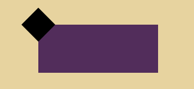
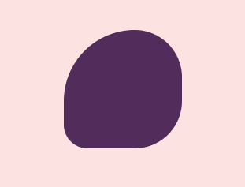
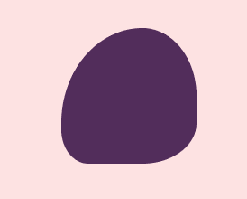

# 如何用 CSS - LogRocket 博客创建别致的角落

> 原文：<https://blog.logrocket.com/how-to-create-fancy-corners-in-css/>

CSS 可以做出惊人的事情。创造奇特的角落就是其中之一。只需几行 CSS 代码，您就可以轻松美化 HTML 元素的边角，并为用户创建令人惊叹的视觉效果。

在本教程中，我们将首先演示如何创建圆角，然后展示如何应用这些概念来创建自己的设计——我喜欢称之为花式角。


首先，让我们在`<body>`的中心创建一个简单的盒子，这样我们就可以试验它的角了。

```
<body>
  <div></div>
</body>

body {
  display:flex;
  height:100vh;
  align-items:center;
  justify-content: center;
  background-color: #e7d39f;
}
div {
  width: 200px;
  height: 80px;
  background-color: #522d5b;
}

```


现在，我们将使用这个盒子作为模型来构建五种类型的花式拐角:圆形、缺口、铲形、倒置和随机。我们开始吧！

## 1.圆角

`[border-radius](https://developer.mozilla.org/en-US/docs/Web/CSS/border-radius)`是创建圆角的基本 CSS 属性。你可能已经用过了。以下是该物业的概况:

```
/* sets radius of all 4 corners */
border-radius: 10px;

/* top-left top-right bottom-right bottom-left */
border-radius: 10px 15px 15px 10px;

```

你可以直接使用`border-radius`来创建圆角。

```
div {
  border-radius:15px;
}

```


您还可以为每个角设置不同的值。

```
div {
  border-radius:5px 30px 30px 5px;
}

```


例如，如果您只想将一个角变圆，您可以设置下列 CSS 属性之一。

```
div {
  border-top-left-radius:15px;
  /* or
  border-top-right-radius:15px;
  border-bottom-right-radius:15px;
  border-bottom-left-radius:15px;
  */
}

```


一个圆呢？例如，用户头像通常显示在圆圈内。你首先需要创建一个正方形来制作一个正圆。

```
div {
  width:100px; /* overriding previous values */
  height:100px;
  border-radius: 50%; /* here's the trick */
}

```


## 2.缺口角

除了`border-radius`属性，您还可以利用伪元素(如`box-shadow`属性)来创建不同类型的角。

使用这种方法时，只能改变盒子的一面。你会明白为什么。

下面是这个盒子的 CSS:

```
div {
  position:relative; /* this one is new - used to contain absolute elements */
  width: 200px;
  height: 80px;
  background-color: #522d5b;
}

```

接下来，使用`:after`伪元素创建一个边框。

```
div:after {
  content: "";
  position:absolute;
  margin:-20px;
  width:40px;
  height:40px;
  transform:rotate(45deg);
  background-color:#000; /* to see where it is */
}

```



在盒子上设置`overflow:hidden`来隐藏其子元素的溢出部分。

```
div {
  /* other styles */
  overflow:hidden;
}

```

现在是最有趣的部分:使用`box-shadow`填充背景。

```
div:after {
  /* other styles */
  box-shadow: 0 0 0 250px #522d5b;
}

```

这里我们在伪元素周围创建了一个没有任何模糊的大阴影(第二个`0`参数)，所以我们得到了它周围元素的放大副本。感谢盒子里的`overflow:hidden`，它之外的任何东西都是隐藏的。您应该得到这样的结果:


最后，移除盒子和伪元素的背景颜色。背景颜色在`box-shadow`属性中设置(在我们的例子中是`#522d5b`)。


你会注意到用这种方法你被限制在一个角落里。你怎么把四个角都刻好？有两种方法:

1.  使用 [SVG](https://blog.logrocket.com/animating-svg-with-css-83e8e27d739c/) ，这不在本文的讨论范围之内
2.  使用`clip-path`，这很简单，但对浏览器的支持较少

### 用`clip-path`创建无蚀刻角

属性决定在元素中显示什么区域。您可以将它与`polygon()`函数一起使用来创建一个切角(或任何具有复杂值的东西)。

```
div {
  position:relative;
  width: 100px;
  height: 100px;
  overflow:hidden;
  background: #522d5b;
  clip-path: polygon(
    0 10%,
    10% 0,
    90% 0,
    100% 10%,
    100% 90%,
    90% 100%,
    10% 100%,
    0% 90%,
    0% 10%
  )
}

```


你可以使用 [CSS 变量](https://blog.logrocket.com/how-to-use-css-variables-like-a-pro/)或者 [SCSS](https://blog.logrocket.com/the-definitive-guide-to-scss/) 变量，而不是重复相同的百分比。

## 3.铲角

创建铲角类似于创建缺口角。除了使用旋转的正方形作为伪元素，还可以使用圆。

```
div:after {
  content: "";
  position:absolute;
  margin:-20px;
  width:40px;
  height:40px;
  border-radius: 50%; /* NEW */
  box-shadow: 0 0 0 250px #522d5b;
}

```


然而，如果你需要把四个角都挖出来，你最好的选择是使用 SVG。

## 4.倒置的角

您可以再次使用相同的方法，只需稍作调整。

要创建盒子:

```
div {
  position:relative;
  width: 200px;
  height: 80px;
  background: #522d5b;
}

```

要创建伪元素:

```
div:before {
  content: "";
  position:absolute;
  top:-40px;
  left:0;
  height:40px;
  width: 40px;
  border-bottom-left-radius: 50%;
  background:#000;
}

```


下一步是填充伪元素之间的小部分，去掉背景色。我们可以使用`box-shadow`属性来做到这一点。

```
div:before {
   box-shadow: 0 20px 0 0 #522d5b;
}

```

在`box-shadow`中，我们将`x`、`spread`、`blur`设置为零，将`y`设置为`20px`(高度的一半)。因此，方框阴影是它下面显示的伪元素的副本。当`box-shadow`使用与盒子相同的颜色时，访问部分隐藏。


这种类型的设计非常适合语音气泡。


## 5.随机角

你知道吗，你只需要`border-radius`就可以创造出有趣的形状，比如吉他拨片和有机细胞。

`border-radius`支持由斜线分隔的八个值。据 [W3C](https://www.w3.org/TR/css-backgrounds-3/#border-radius) 报道:

> 如果在斜线前后给出值，那么斜线前的值设置水平半径，斜线后的值设置垂直半径。如果没有斜线，则两个半径的值相等。

首先创建一个简单的正方形。

```
div {
  position:relative;
  width: 150px;
  height: 150px;
  background: #522d5b;
}

```

创建随机拐角的最简单方法是使用四个值。

```
div {
  border-radius: 60% 40% 40% 20%;
}

```



在本例中，您可以看到所有角在垂直轴和水平轴上都具有相同的圆度。在`border-radius`中有八个值可以用来改变它。

```
div {
  border-radius: 60% 40% 40% 20% / 70% 50% 30% 25%;
}

```



这个鲜为人知的功能非常有效地创造了美丽的角落。如果你觉得无聊，想用这些值来创建随机的角落，试着用[这个可视化工具](https://9elements.github.io/fancy-border-radius/)来摆弄一下。

## 结论

如你所见，只需使用`border-radius`、`box-shadow`和伪元素，就可以创建各种有趣的角落——从简单的圆角到时髦的随机设计。您可以利用今天学到的基本工具，发展您的技能，创造出令人惊叹的独特设计，尤其是为您的下一个登录页面项目。

你最喜欢什么类型的花式角落？

## 你的前端是否占用了用户的 CPU？

随着 web 前端变得越来越复杂，资源贪婪的特性对浏览器的要求越来越高。如果您对监控和跟踪生产环境中所有用户的客户端 CPU 使用、内存使用等感兴趣，

[try LogRocket](https://lp.logrocket.com/blg/css-signup)

.

[](https://lp.logrocket.com/blg/css-signup)[https://logrocket.com/signup/](https://lp.logrocket.com/blg/css-signup)

LogRocket 就像是网络和移动应用的 DVR，记录你的网络应用或网站上发生的一切。您可以汇总和报告关键的前端性能指标，重放用户会话和应用程序状态，记录网络请求，并自动显示所有错误，而不是猜测问题发生的原因。

现代化您调试 web 和移动应用的方式— [开始免费监控](https://lp.logrocket.com/blg/css-signup)。