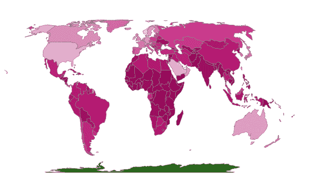
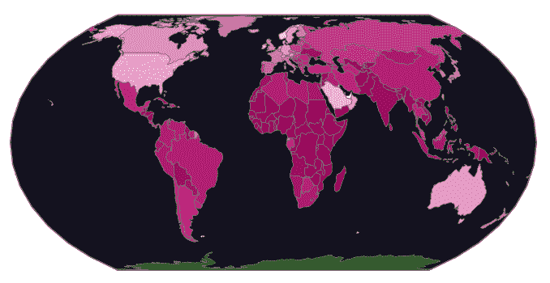
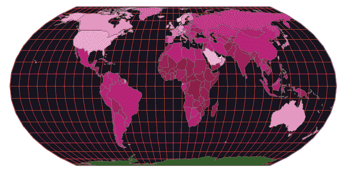
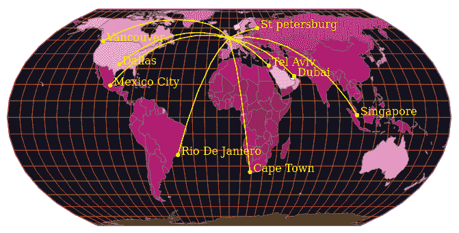

# 如何在 react-simple-maps 中创建 SVG 地图

> 原文：<https://blog.logrocket.com/how-to-create-svg-maps-react-react-simple-maps/>

## 介绍

地图提供了一种最引人注目、最具美感的方式来呈现与地理位置相关的数据。当希望在地图上直观地呈现数据时，可以使用一个强大的库 [D3.js](https://www.d3-graph-gallery.com/index.html) 。

然而，尽管 D3 是一个具有多种图形功能的特性丰富的库，但它有一个陡峭的学习曲线。如果你是一个绝对的初学者，学会 D3 并立即变得高效是困难的。D3 有更小更容易学习的替代品。一个这样的替代包是 [react-simple-maps](https://www.react-simple-maps.io/) ，它依赖于 D3 包。

React-simple-maps，顾名思义，是一个简单的库，用于在 [React](https://blog.logrocket.com/tag/react/) 应用程序中创建 SVG 地图。它自诩易学、灵活、小巧且可扩展。简单性和较小的包大小使它成为创建简单地图的理想库。

这篇文章将是一个关于如何使用 react-simple-maps 创建 [SVG](https://blog.logrocket.com/make-any-svg-responsive-with-this-react-component/) 地图的完整指南。

## 什么是简单反应贴图？

正如简介中提到的，react-simple-maps 是一个简单的库，用于向 react 应用程序添加 SVG 地图。因为它在底层使用了 [React Hooks API](https://blog.logrocket.com/react-hooks-frustrations/) ，所以你必须使用 React 16.8 或更高版本。

React-simple-maps 内部依赖 D3 包`d3-geo`来创建地图。react-simple-maps 使用的其他 D3 包包括`d3-selection`、`d3-zoom`和`topojson-client`。关于这些 D3 包的更多信息，您需要阅读 D3 文档的 API 部分。

react-simple-maps 提供的大多数功能都是以简单的 react 组件的形式出现的，您可以导入这些组件并使用适当的道具进行渲染。这就是这个包可以有多简单。

让我们通过构建一个简单的 SVG 地图来了解更多关于 react-simple 地图的知识。

## 如何使用 react-simple-maps 创建 SVG 地图

本节假设您已经设置了一个 React 项目。如果还没有，可以用`creat-react-app`建立一个 React 项目。它可以让您几乎立即编写 React 代码。

在使用 react-simple-maps 之前，您需要使用以下命令之一从 npm 安装它:

```
# Using npm
npm install react-simple-maps

# Using yarn
yarn add react-simple-maps

```

要使用 react-simple-maps 创建最基本的 SVG 地图，您需要导入并使用`ComposableMap`、`Geography`和`Geographies`组件。

`ComposableMap`组件是您想要使用 react-simple-maps 创建的任何地图的包装器。它接受用于设置地图的宽度、高度、投影和投影配置的道具。

### GeoJSON 和 TopoJSON

在使用 react-simple-maps 之前，您需要有一个有效的 GeoJSON 或 TopoJSON 文件。最简单的 GeoJSON 和 TopoJSON 文件是存储创建地图所需数据的 JSON 文件。TopoJSON 是 GeoJSON 的衍生品。

正如上一段所暗示的，您可以在这两种格式之间找到一些相似之处。然而，它们中的每一个都有其优点和缺点。GeoJSON 相对于 TopoJSON 的一个优势是它的简单性和可读性。

另一方面，尽管 TopoJSON 文件更复杂、可读性更差，但它比 GeoJSON 文件小几个数量级。已经证实，TopoJSON 文件比其对应的 GeoJSON 文件小 80%。因此，由于包的大小较小，如果要通过网络传输文件或使用它在浏览器中创建地图，最好使用 TopoJSON。

因为本文主要不是关于 GeoJSON 或 TopoJSON 的，所以我们不会在这里详细讨论它们。如果你想了解更多，网上资源可以很好地解释它们。

`Geographies`组件接受`geography`道具。其值应为 GeoJSON 或 TopoJSON 文件的 URI。在本文中，我们将使用一个为试验 react-simple-maps 包而创建的简单 TopoJSON 文件。网上还有其他免费的 TopoJSON 文件，带有友好的许可，你也可以使用。类似地，您也可以使用命令行或在线工具用 [mapshaper](https://github.com/mbloch/mapshaper) 创建一个 TopoJSON 文件。

### 使用反应简单贴图创建简单贴图

下面的代码演示了如何使用 react-simple-maps 创建最基本的 SVG 地图。是一张显示世界各国人均 GDP 收入分布的地图。

通常，您可以从数据库或第三方 API 中检索这样的数据集。然而，在这个例子中，我是从 TopoJSON 中计算出来的，因为它包含了每个国家的国内生产总值和人口估计值。这就是`generateGdpPerCapita`函数的目的。

因为 react-simple-maps 依赖 D3 包来创建 SVG 地图，所以我也使用了 D3 库中的几个包:

```
import "./App.css";
import { ComposableMap, Geography, Geographies } from "react-simple-maps";
import { scaleSequential } from "d3-scale";
import { interpolatePiYG } from "d3-scale-chromatic";

function generateGdpPerCapita(geographies) {
  let minGdpPerCapita = Infinity;
  let maxGdpPercapita = -Infinity;
  geographies = geographies.map((geography) => {
    const { GDP_MD_EST, POP_EST } = geography.properties;
    const gdpPerCapita = Math.round((GDP_MD_EST * 1e6) / POP_EST);
    if (gdpPerCapita < minGdpPerCapita) {
      minGdpPerCapita = gdpPerCapita;
    }
    if (gdpPerCapita > maxGdpPercapita) {
      maxGdpPercapita = gdpPerCapita;
    }
    geography.properties.gdpPerCapita = gdpPerCapita;
    return geography;
  });
  return { minGdpPerCapita, maxGdpPercapita, modifiedGeographies: geographies };
}
const geoUrl =
  "https://raw.githubusercontent.com/zcreativelabs/react-simple-maps/master/topojson-maps/world-110m.json";

function App() {
  return (
    <ComposableMap projectionConfig={{ scale: 75 }}>
      <Geographies geography={geoUrl}>
        {({ geographies }) => {
          const { minGdpPerCapita, maxGdpPercapita, modifiedGeographies } =
            generateGdpPerCapita(geographies);

          const chromaticScale = scaleSequential()
            .domain([minGdpPerCapita, maxGdpPercapita])
            .interpolator(interpolatePiYG);

          return modifiedGeographies.map((geography) => {
            const { gdpPerCapita, rsmKey } = geography.properties;
            return (
              <Geography
                key={rsmKey}
                geography={geography}
                stroke="grey"
                strokeWidth={0.5}
                fill={chromaticScale(gdpPerCapita)}
              />
            );
          });
        }}
      </Geographies>
    </ComposableMap>
  );
}
export default App;

```

上面代码的输出是下面的 choropleth 图。只需几行代码，您就可以在 React 项目中使用漂亮的地图直观地呈现数据。



在进入下一节之前，值得注意的是，react-simple-maps 默认使用等地球投影。它还支持其他几个投影，如果您有兴趣，可以在文档中阅读。您可以将首选投影作为`ComposableMap`组件的`projection`属性的值进行传递。

我们刚刚创建了最基本的地图。让我们在它周围添加一个球形路径。

### 如何在 SVG 地图周围添加一条球形线

React-simple-maps 有`Sphere`组件，用于在地图周围添加球形路径。您需要像导入其他组件一样导入它。

要在 SVG 地图周围添加一条球形线，您需要使用适当的道具来呈现`Sphere`组件，如下面的代码片段所示:

```
    <ComposableMap projectionConfig={{ scale: 75 }}>
      <Sphere stroke="grey" fill="#14121f" strokeWidth="1" />
      <Geographies geography={geoUrl}>
        {({ geographies }) => {
          const { minGdpPerCapita, maxGdpPercapita, modifiedGeographies } =
            generateGdpPerCapita(geographies);

          const chromaticScale = scaleSequential()
            .domain([minGdpPerCapita, maxGdpPercapita])
            .interpolator(interpolatePiYG);

          return modifiedGeographies.map((geography) => {
            const { gdpPerCapita, rsmKey } = geography.properties;
            return (
              <Geography
                key={rsmKey}
                geography={geography}
                stroke="grey"
                strokeWidth={0.5}
                fill={chromaticScale(gdpPerCapita)}
              />
            );
          });
        }}
      </Geographies>
    </ComposableMap>

```

添加了`Sphere`组件后，您的地图应该如下图所示。现在地图周围有一个球形轮廓。我也给了球体一个黑色的背景。通过设置 SVG `fill`属性的值，您可以将其更改为您选择的任何颜色。`Sphere`组件将任何有效的 SVG 属性作为道具，并将它们应用于球体。



### 如何向 SVG 地图添加经纬网

有时，您可能想要添加交叉纬度和经度的网络(经纬网)作为地图上的参考点。React-simple-maps 有`Graticule`组件可以做到这一点。

导入`Graticule`组件后，您可以在`Geographies`组件之前渲染它，使线条出现在地图的顶部。另一方面，在`Geographies`组件之后渲染它将显示地图后面的线条。

以下代码修改了之前的地图，使其包含一个经纬网。唯一增加的是我们渲染`Graticule`组件的那一行:

```
    <ComposableMap projectionConfig={{ scale: 75 }}>
      <Sphere stroke="grey" fill="#14121f" strokeWidth="1" />
      <Graticule stroke="#F53" strokeWidth={0.5} />
      <Geographies geography={geoUrl}>
        {({ geographies }) => {
          const { minGdpPerCapita, maxGdpPercapita, modifiedGeographies } =
            generateGdpPerCapita(geographies);

          const chromaticScale = scaleSequential()
            .domain([minGdpPerCapita, maxGdpPercapita])
            .interpolator(interpolatePiYG);

          return modifiedGeographies.map((geography) => {
            const { gdpPerCapita, rsmKey } = geography.properties;
            return (
              <Geography
                key={rsmKey}
                geography={geography}
                stroke="grey"
                strokeWidth={0.5}
                fill={chromaticScale(gdpPerCapita)}
              />
            );
          });
        }}
      </Geographies>
    </ComposableMap>

```

下图显示了添加经纬网后的地图外观。你会注意到地图上有一个纬度和经度交叉的网络。



### 如何在 SVG 地图上创建线条和标记

React-simple-maps 有一个内置特性，可以在 SVG 地图上创建线条和标记。您可以通过使用`Line`组件连接两个或多个坐标来创建一条线。如果你的目标是连接两个坐标，它接受`to`和`from`道具。如果你打算通过一系列点画一条线，你需要使用`coordinates`道具。`coordinates`道具接受一个数组，该数组的条目应该是形式为`[longitude,` `latitude]`的数组。

使用`stroke`和`strokeWidth`道具绘制线条时，您还可以分别指定线条颜色和线条宽度。

值得注意的是，当地图上的某个要素位于本初子午线以西时，其经度为负。向东时为正。同样，一个点在赤道以北时纬度为正，在赤道以南时纬度为负。

React-simple-maps 也有用于向地图添加标记的`Marker`组件。标记可以是任何有效的 SVG。您可以使用`coordinates`属性指定它的位置，该属性的值是一个形式为`[longitude, latitude]`的数组。

下面的代码演示了如何向 SVG 地图添加线条和标记。为了便于说明，我们将在地图上用线条和标记表示一些受欢迎的英国航空公司目的地。通常，您会从数据库中检索此类数据。

我已经把它硬记录在这里了:

```
const flightDestinations = [
  {
    from: { coord: [-0.128, 51.507], city: "London" },
    to: { coord: [55.271, 25.205], city: "Dubai" },
  },
  {
    from: { coord: [-0.128, 51.507], city: "London" },
    to: { coord: [-96.797, 32.777], city: "Dallas" },
  },
  {
    from: { coord: [-0.128, 51.507], city: "London" },
    to: { coord: [-123.121, 49.283], city: "Vancouver" },
  },
  {
    from: { coord: [-0.128, 51.507], city: "London" },
    to: { coord: [-43.173, -22.907], city: "Rio De Janiero" },
  },
  {
    from: { coord: [-0.128, 51.507], city: "London" },
    to: { coord: [18.424, -33.925], city: "Cape Town" },
  },
  {
    from: { coord: [-0.128, 51.507], city: "London" },
    to: { coord: [34.782, 32.085], city: "Tel Aviv" },
  },
  {
    from: { coord: [-0.128, 51.507], city: "London" },
    to: { coord: [30.361, 59.931], city: "St petersburg" },
  },
  {
    from: { coord: [-0.128, 51.507], city: "London" },
    to: { coord: [103.82, 1.352], city: "Singapore" },
  },
  {
    from: { coord: [-0.128, 51.507], city: "London" },
    to: { coord: [-99.133, 19.433], city: "Mexico City" },
  },
];

```

在下面的代码中，`Line`组件的`from`道具包含伦敦的坐标，`to`道具包含目的地的坐标。我已经使用`Marker`组件在起点和终点放置了圆形标记:

```
    <ComposableMap projectionConfig={{ scale: 75 }}>
      <Sphere stroke="grey" fill="#14121f" strokeWidth="1" />
      <Graticule stroke="#F53" strokeWidth={0.5} />
      <Geographies geography={geoUrl}>
        {({ geographies }) => {
          const { minGdpPerCapita, maxGdpPercapita, modifiedGeographies } =
            generateGdpPerCapita(geographies);

          const chromaticScale = scaleSequential()
            .domain([minGdpPerCapita, maxGdpPercapita])
            .interpolator(interpolatePiYG);

          return modifiedGeographies.map((geography) => {
            const { gdpPerCapita, rsmKey } = geography.properties;
            return (
              <Geography
                key={rsmKey}
                geography={geography}
                stroke="grey"
                strokeWidth={0.5}
                fill={chromaticScale(gdpPerCapita)}
              />
            );
          });
        }}
      </Geographies>

      {flightDestinations.map((route) => (
        <>
          <Line
            key={route.to.city}
            from={route.from.coord}
            to={route.to.coord}
            stroke="yellow"
            strokeWidth={1}
            strokeLinecap="round"
          />
          <Marker coordinates={route.to.coord}>
            <circle r={2} fill="yellow" />
          </Marker>
        </>
      ))}
      <Marker coordinates={[-0.128, 51.507]}>
        <circle r={2} fill="yellow" />
      </Marker>
    </ComposableMap> 

```

添加线条和标记后，地图看起来如下图所示。请注意黄色曲线和位于线条起点和终点的黄色圆形标记。


### 如何在 SVG 地图上创建注释

在前一小节中，我们研究了如何在 SVG 地图上创建线条和标记。您也可以用类似的方式向地图添加注释。

要添加注释，需要将注释主题的坐标和注释偏移量传递给`Annotations`组件。

下面是对前面代码的修改，演示了如何向 SVG 地图添加注释。它们之间的区别在于`Annotations`组件:

```
    <ComposableMap projectionConfig={{ scale: 75 }}>
      <Sphere stroke="grey" fill="#14121f" strokeWidth="1" />
      <Graticule stroke="#F53" strokeWidth={0.5} />
      <Geographies geography={geoUrl}>
        {({ geographies }) => {
          const { minGdpPerCapita, maxGdpPercapita, modifiedGeographies } =
            generateGdpPerCapita(geographies);

          const chromaticScale = scaleSequential()
            .domain([minGdpPerCapita, maxGdpPercapita])
            .interpolator(interpolatePiYG);

          return modifiedGeographies.map((geography) => {
            const { gdpPerCapita, rsmKey } = geography.properties;
            return (
              <Geography
                key={rsmKey}
                geography={geography}
                stroke="grey"
                strokeWidth={0.5}
                fill={chromaticScale(gdpPerCapita)}
              />
            );
          });
        }}
      </Geographies>

      {flightDestinations.map((route) => (
        <>
          <Line
            key={route.to.city}
            from={route.from.coord}
            to={route.to.coord}
            stroke="yellow"
            strokeWidth={1}
            strokeLinecap="round"
          />
          <Marker coordinates={route.to.coord}>
            <circle r={2} fill="yellow" />
          </Marker>

          <Annotation subject={route.to.coord} dx={0} dy={0} fill="yellow">
            <text fontSize="10px" x="3">
              {route.to.city}
            </text>
          </Annotation>
        </>
      ))}
      <Marker coordinates={[-0.128, 51.507]}>
        <circle r={2} fill="yellow" />
      </Marker>
    </ComposableMap>

```

添加注释后，地图看起来如下图所示。



## react-simple-映射包大小和依赖关系

正如在简介中提到的，react-simple-maps 依赖于 D3 包来创建 SVG 地图。其中一些包包括`d3-geo`、`d3-selection`、`d3-zoom`和`topojson-client`。根据 [bundlephobia](https://bundlephobia.com) 的说法，尽管它依赖于 D3 包的数量，react-simple-maps 的缩小和压缩包大小为 34.8 kB。考虑到它的简单性和实用性，这是一个非常小的包。

D3，react-simple-maps 所依赖的第三方包，是一个非常成熟和流行的基于 SVG、Canvas 和 HTML 的数据可视化库。它还有一个活跃的维护者社区。因此，你不应该因为 D3 包的质量而失眠。

从问题的数量和项目存储库中的提交历史来看，似乎 react-simple-maps 没有得到积极的维护。因此，如果您决定在生产中使用它，请准备好自己进行更新和错误修复。

## 结论

React-simple-maps 是一个简单的映射包，可以在 React 应用程序中使用。其简单性和微小的包大小使其成为向 React 应用程序添加基本地图的绝佳选择。然而，如果你想建立一个更复杂的地图，它可能达不到你的期望。在这种情况下，您将不得不选择像 D3 这样更强大、功能更丰富的库。

它有`Sphere`、`Graticule`、`Geography`、`Geographies`、`Markers`等组件。您必须使用适当的道具导入和渲染这些内置组件，以创建地图或添加功能。这使得使用 react-simple-maps 创建地图变得轻而易举。

由于其简单性，本文已经暗示了 react-simple-maps 必须提供的几乎所有特性。但是，您可以阅读 GitHub 上的文档或源代码，以熟悉这里没有提到的其他一些特性，或者全面了解这个包。

不利的一面是，该项目的 GitHub 库至少一年没有太多活动了。这清楚地表明一揽子计划没有得到积极的维护。因此，当您在生产中使用它时，您将负责在需要时进行更新和修复错误。

## [LogRocket](https://lp.logrocket.com/blg/react-signup-general) :全面了解您的生产 React 应用

调试 React 应用程序可能很困难，尤其是当用户遇到难以重现的问题时。如果您对监视和跟踪 Redux 状态、自动显示 JavaScript 错误以及跟踪缓慢的网络请求和组件加载时间感兴趣，

[try LogRocket](https://lp.logrocket.com/blg/react-signup-general)

.

[ ](https://lp.logrocket.com/blg/react-signup-general) [](https://lp.logrocket.com/blg/react-signup-general) 

LogRocket 结合了会话回放、产品分析和错误跟踪，使软件团队能够创建理想的 web 和移动产品体验。这对你来说意味着什么？

LogRocket 不是猜测错误发生的原因，也不是要求用户提供截图和日志转储，而是让您回放问题，就像它们发生在您自己的浏览器中一样，以快速了解哪里出错了。

不再有嘈杂的警报。智能错误跟踪允许您对问题进行分类，然后从中学习。获得有影响的用户问题的通知，而不是误报。警报越少，有用的信号越多。

LogRocket Redux 中间件包为您的用户会话增加了一层额外的可见性。LogRocket 记录 Redux 存储中的所有操作和状态。

现代化您调试 React 应用的方式— [开始免费监控](https://lp.logrocket.com/blg/react-signup-general)。