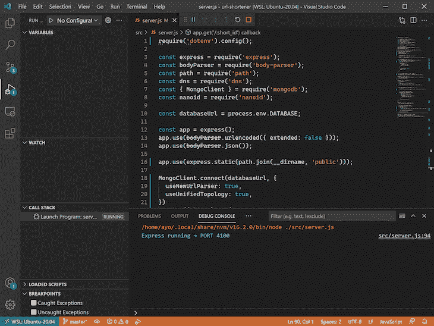
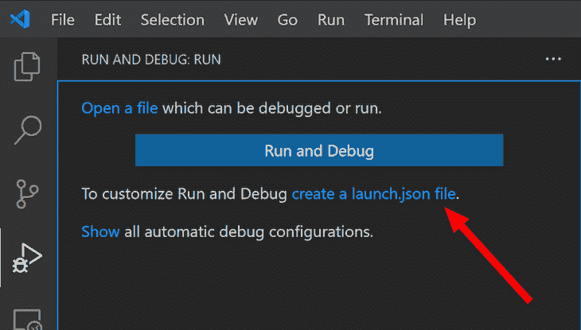
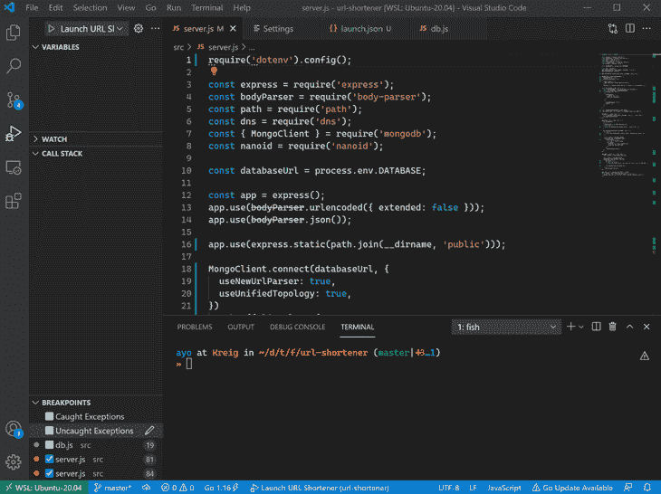
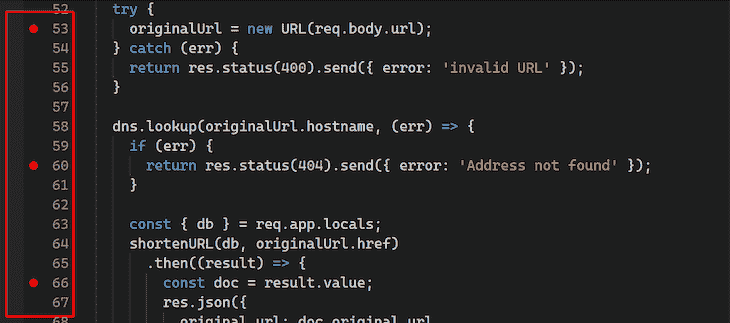
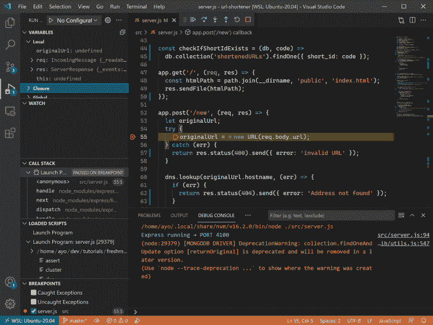
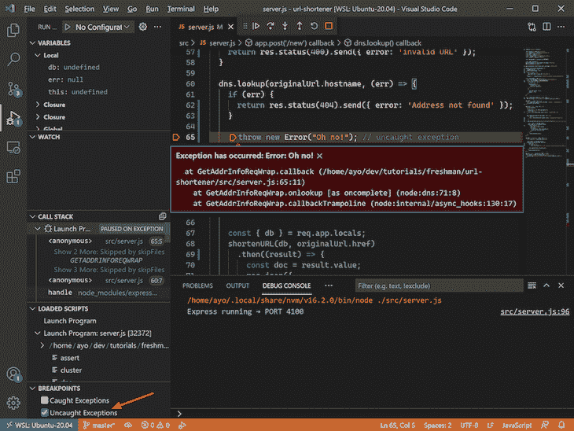
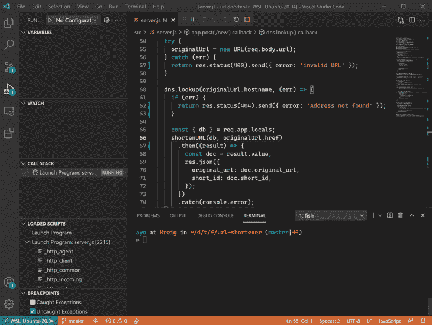
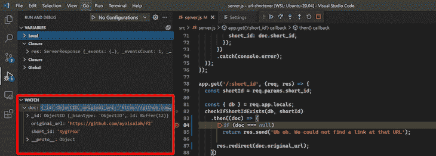
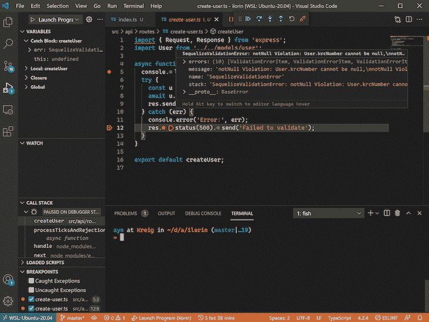

# 如何在 Visual Studio 代码中调试 Node.js 应用程序

> 原文：<https://blog.logrocket.com/how-to-debug-node-js-apps-in-visual-studio-code/>

Visual Studio 代码编辑器提供了有效调试 Node.js 应用程序的所有工具。它的内置调试器可以调试任何以 Node.js 运行时为目标的应用程序，即使应用程序的源代码是一种将文件转换为 JavaScript 的语言，如 TypeScript。

开始调试会话时，必须检查调用堆栈和当前状态下的任何作用域变量。您还可以在编辑器中计算表达式，并单步执行代码以深入到有问题的部分。

为 Node.js 调试设置一个项目并不特别困难，本教程将帮助您在第一次尝试时就做好它！

## 先决条件

开始之前，请确保安装了 Node.js 和 Visual Studio 代码的最新版本。本教程分别使用 v16.2.0 和 1.56.2。

还需要一个 Node.js 项目；你可以使用你自己的或者下载这个[URL shorter 应用程序](https://github.com/finallyayo/url-shortener)。设置它的说明在项目的自述文件中。

## 在 Visual Studio 代码中启动调试会话

在 Visual Studio 代码中启动调试会话最简单的方法是在编辑器中打开一个文件，单击**活动栏**中的**运行视图**图标(或按键盘上的`Ctrl+Shift+D`)，然后单击应用程序左上角的**运行和调试**按钮。

[Visual Studio 代码调试器](https://blog.logrocket.com/top-10-vs-code-extensions-2021/)将尝试自动检测项目的调试环境，但如果失败，将提示您选择合适的环境；在这种情况下，选择 **Node.js** 。


**Node.js (legacy)** 选项引用旧的 JavaScript 调试器，它仍然可用，但不推荐使用。

选择环境后，项目启动，调试器附加到进程。您可以在**调试控制台**中看到项目的输出，调试工具栏出现在屏幕的顶部，用于单步调试代码、暂停脚本或结束会话。

在编辑器的左侧，有五个标题为**变量**、**观察**、**调用栈**、**加载脚本**和**断点**的窗格。



您还可以为项目创建一个启动配置文件，以配置和保存调试设置的详细信息，从事该项目的任何人都可以无限地重复使用这些信息。这个配置文件作为`launch.json`保存在项目根目录下的`.vscode`文件夹中。

通过点击**运行和调试:运行**视图中的**创建 launch.json 文件**链接来创建配置文件。



为您的项目选择环境后，`launch.json`文件应该出现在编辑器中，包含以下内容:

```
// .vscode/launch.json
{
    "version": "0.2.0",
    "configurations": [
        {
            "type": "pwa-node",
            "request": "launch",
            "name": "Launch URL Shortener",
            "skipFiles": [
                "<node_internals>/**"
            ],
            "program": "${workspaceFolder}/src/server.js"
        }
    ]
}

```

配置的`name`是如何在**配置**菜单中识别的；将运行的程序在`program`字段中指定。

每个配置都有许多可以设置的选项，比如传递给程序的参数、环境变量和预调试任务。[阅读文档](https://code.visualstudio.com/docs/editor/debugging_launchjson-attributes)了解哪些设置与您的项目相关。

完成项目配置设置后，通过**配置**下拉菜单选择并执行。

### 附加外部 Node.js 流程

开始调试会话的另一个选项是附加到外部 Node.js 进程。使用以下命令启动程序:

```
$ node --inspect src/server.js

```

或者，如果您希望在程序开始运行之前附加调试器，请添加:

```
$ node --inspect-brk src/server.js

```

执行上述任一命令后，可以在 Visual Studio 代码中打开一个进程选择器，该选择器列出了 Node.js 调试器可用的所有进程。要打开进程选择器，键入`Ctrl+Shift+P`并找到**Debug:Attach to Node Process**命令:


这将打开一个菜单，其中列出了您的计算机上运行的每个 Node.js 进程。可能有几个条目，但是选择你感兴趣的一个应该很容易。

选择相关条目以启动调试会话。



### 创建断点

断点允许您暂停特定行上的代码执行，以对其进行检查。除了函数声明语句之外，几乎可以在 Visual Studio 代码中的任何位置创建断点。在变量声明、表达式、注释和空行中，您可以这样做。

通过在编辑器中单击行号左侧的装订线来创建断点。当您将鼠标移动到数字上时，每行都会出现一个红色圆圈。单击某行上的红色圆圈会使该行变成鲜红色，这表示该行上存在活动断点。

您可以对程序中与您试图解决的问题相关的所有行重复这一操作。



例如，当您在一个路由的处理程序中创建一个断点时，您可以通过使用浏览器或类似于 [Postman](https://www.postman.com/) 或`curl`的工具向该路由发出请求来执行该部分代码，从而触发断点。

这将导致程序停止执行，您可以通过将鼠标悬停在当前用黄色突出显示的断点行上，在**变量**窗格中检查任何当前作用域标识符的值。这类似于 web 浏览器中的 JavaScript 调试器。



在**断点**窗格中，项目中启用的所有断点都可用。您可以在那里编辑或禁用任何断点，如果您的应用程序中有几个跨不同文件的断点，这将很有帮助。

您还可以中断应用程序中发生的所有异常，或者只中断未捕获的异常。在后一种情况下，这意味着调试器在打印错误信息之前暂停，您可以在进程退出之前检查可能出现的错误。



对调试工作流有用的断点的变体是 logpoint **，**，它将消息或值记录到控制台，而不是暂停代码执行并中断调试器。

可以把它想象成一个更复杂的`console.log()`语句，不用编辑代码本身就可以轻松地添加和删除。它由红色菱形图标代替红色圆圈表示。

通过右击槽并选择**添加记录点**来设置记录点。这将打开一个输入字段，您可以在其中将文本记录到控制台。如果您想要记录表达式或变量的值，请将其放在花括号内。



### 检查值

让我们更深入地看看如何在程序运行时检查程序中的值。编辑器关注的主要方面是**变量**和**观察**窗格。


### **变量**窗格

在**变量**窗格中，您可以检查在断点处评估的变量和表达式的值。如果通过右键单击列出的任何值来打开上下文菜单，可以对变量执行一些操作:

*   **设置值**允许您修改变量值，以便在代码执行时测试某些值
*   **复制值**将变量的值复制到剪贴板
*   **复制为表达式**复制一个表达式来访问变量
*   **添加到监视**将变量添加到**监视**窗格进行监视

### **手表**窗格

**WATCH** 窗格的主要好处是，当代码暂停时，您可以轻松地将想要监视的值显示出来。

每次您想要检查其值时，不必在**变量**窗格中深入挖掘嵌套属性，您可以将它添加到**观察**窗格中以便于访问。这在一次确定几个变量的值时最有用，因为它们在执行过程中会自动重新计算。



## 跟踪代码执行的路径

编辑器顶部的调试工具栏提供了几个命令来有效地浏览调试器。当您试图找到程序到达特定行或函数的路径时，这些特性证明是无价的。


### 继续(`F8`)

当程序在断点处停止时，您可以使用此按钮继续执行代码，直到下一个断点(如果有)。

### 跨过(`F10`)

该命令执行当前突出显示的行，并在下一行执行之前暂停。您可以运行命令来下移一个函数，并完全理解它在过程中的执行。

如果您在调用函数的行上使用此命令，它将执行整个函数并暂停在函数调用下面的行上。

### 踏入(`F11`)

“单步执行”命令的工作方式与“单步执行”类似，只是当它遇到函数调用时，会进入被调用的函数并在第一行暂停。这是在代码库中从一个地方移到另一个地方的一种有用的方式，不会跳过任何细节。

### 步出(`Shift+F11`)

该命令继续执行，并在当前函数的最后一行暂停。如果你不小心输入了一个与你要解决的问题不相关的函数，这就可以用了。

这个命令帮助您快速退出该功能并返回到相关位。

### 重启(`Ctrl+Shift+F5`)

使用它来重置调试器，而不是终止并再次启动它。

### 停止(`Shift+F5`)

当您调试完程序后，使用此命令退出调试会话。如果附加到外部 Node.js 进程，则会显示一个图标来断开与该进程的连接。

## 使用源映射调试 TypeScript

现在很多 Node.js 项目都是用 TypeScript 编写的，也可以用 Visual Studio 代码调试。

首先，在您的`tsconfig.json`文件中启用`sourceMap`:

```
{
  "compilerOptions": {
    "sourceMap": true
  }
}

```

启用后，附加到正在运行的进程，并在 TypeScript 文件中设置断点。Visual Studio 代码在整个项目中搜索源地图，不包括`node_modules`文件夹。

您可以在启动配置文件中使用`outFiles`属性来指定 Visual Studio 代码必须查找源映射的确切位置；这应该是 JavaScript 输出的位置:

```
{
    "version": "0.2.0",
    "configurations": [
        {
            "type": "pwa-node",
            "request": "launch",
            "name": "Launch TypeScript",
            "skipFiles": [
                "<node_internals>/**"
            ],
            "preLaunchTask": "compile",
            "program": "${workspaceFolder}/src/server.ts",
            "outFiles": ["${workspaceFolder}/dist/**/*.js"]
        }
    ]
}

```

如果您使用 [`ts-node`运行您的项目](https://blog.logrocket.com/typescript-with-node-js-and-express/)而没有构建步骤，这个过程会更简单。不使用上面的`launch.json`配置，而是使用以下配置:

```
{
    "version": "0.2.0",
    "configurations": [
        {
            "type": "pwa-node",
            "request": "launch",
            "name": "Launch Server",
            "skipFiles": [
                "<node_internals>/**"
            ],
            "runtimeArgs": [
                "-r",
                "ts-node/register"
            ],
            "args": [
                "${workspaceFolder}/src/server.ts"
            ]
        }
    ]
}

```

没有`program`属性，所以`runtimeArgs`将`ts-node`注册为 TypeScript 文件的处理程序，`args`的第一个参数是程序的入口文件。一旦设置完成，您就可以开始调试会话了！



## 结论

在本教程中，我们已经讨论了在 Visual Studio 代码中调试 Node.js 项目的许多重要方面。有关调试器提供的所有功能的更多信息，请参考[在线文档](https://code.visualstudio.com/docs/nodejs/nodejs-debugging)。

感谢阅读，调试愉快！

## 200 只显示器出现故障，生产中网络请求缓慢

部署基于节点的 web 应用程序或网站是容易的部分。确保您的节点实例继续为您的应用程序提供资源是事情变得更加困难的地方。如果您对确保对后端或第三方服务的请求成功感兴趣，

[try LogRocket](https://lp.logrocket.com/blg/node-signup)

.

[](https://lp.logrocket.com/blg/node-signup)[https://logrocket.com/signup/](https://lp.logrocket.com/blg/node-signup)

LogRocket 就像是网络和移动应用程序的 DVR，记录下用户与你的应用程序交互时发生的一切。您可以汇总并报告有问题的网络请求，以快速了解根本原因，而不是猜测问题发生的原因。

LogRocket 检测您的应用程序以记录基线性能计时，如页面加载时间、到达第一个字节的时间、慢速网络请求，还记录 Redux、NgRx 和 Vuex 操作/状态。

[Start monitoring for free](https://lp.logrocket.com/blg/node-signup)

.