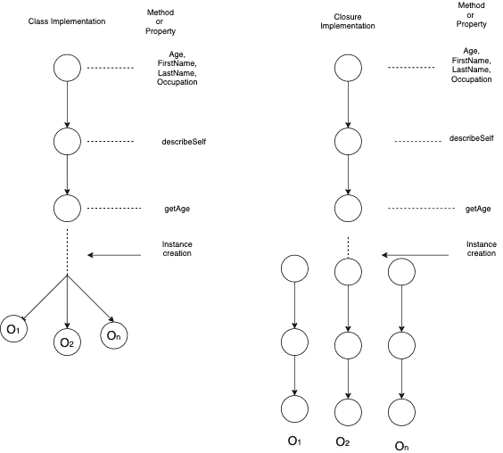

# 如何在 JavaScript - LogRocket 博客中决定类还是闭包

> 原文：<https://blog.logrocket.com/how-to-decide-between-classes-v-closures-in-javascript/>

在 JavaScript 中出现 ES6 类之前，创建生产相似类型对象的工厂的基本方法之一是通过闭包和 JavaScript 构造函数。

闭包和类在 JavaScript 中的行为是不同的，有一个基本的区别:闭包支持封装，而 JavaScript 类不支持封装。

注意:有一个关于这个的提议，并且在第三阶段。它在一些浏览器中是默认启用的，也可以通过一个巴别塔插件来启用。

封装是 OOP(面向对象编程)的核心原则之一，它本质上是关于保护对象的私有数据，使得它们只能通过同一对象公开的公共 API 来访问或改变。

公共 API 确保以受控的方式访问对象的私有数据，并且如果满足某些验证条件，可以决定更新私有数据。

传统上，JavaScript 开发人员使用`_`作为他们打算私有的属性或方法的前缀。

这是有问题的，原因有几个。

首先，新开发人员可能没有意识到这一点，可能会修改私有数据。

此外，有经验的开发人员可能会修改私有数据，认为他们很清楚自己在做什么，这可能会导致意想不到的副作用。

让我们考虑一个例子，它首先使用类(构造函数的合成糖)来实现用户模型，然后用闭包来做同样的事情。

注意区别:

```
// class Example
 class UserClasses {
  constructor({firstName, lastName, age, occupation}){
    this.firstName = firstName;
    this.lastName = lastName;
    this.age = age;
    this.occupation = occupation;
  }
  describeSelf() {
    console.log(`My name is ${this.firstName} ${this.lastName}, I am ${this.age}years     Old and i work as a ${this.occupation}`);
  }
getAge() {
    return this.age;
  }
}
const gbolahan = new UserClasses({firstName: "Gbolahan", lastName: "Olagunju", age: 28, occupation: "Software Developer"});
gbolahan.describeSelf();
//My name is Gbolahan Olagunju. I am 28 years old and I work as a Software Developer.
```

```
// closure Example
const UserClosure = ({firstName, lastName, age, occupation }) => {
  return ({
    describeSelf : () => {
      console.log(`My name is ${firstName} ${lastName}, I am ${age}years Old and i work as a ${occupation}`);
    },
    getAge: () => age;
  })
}
const zainab = UserClosure({firstName: "Zaynab", lastName: "Olagunju", age: 30, occupation: "Economist"});
zainab.describeSelf();

//My name is Zaynab Olagunju. I am 30 years Old and I work as a Economist.
```

从上面的例子中，您会注意到我们可以使用闭包或类来实现一个对象蓝图。然而，有一些差异对我们来说很重要。

classe 模型使用`this`关键字来引用私有数据，而我们在闭包实现中没有以任何方式引用`this`。由于这个原因，闭包更受欢迎，因为与其他传统的 OOP 语言相比，JavaScript 中的`this`并不总是像预期的那样工作。

类实现使用 new 关键字来创建一个实例，而我们只是简单地调用闭包实现中的函数。

闭包实现支持封装，因为我们不能直接访问它的私有数据，除非通过它公开的方法。我们可以操纵类实现的私有数据，从而使类实现变得更加脆弱。

另一方面，上课可以更快。

考虑这个例子:

```
const zainab = UserClosure({firstName: "Zaynab", lastName: "Olagunju", age: 30, occupation: "Economist"});

console.log(zainab.firstName) // undefined
//can only be accessed via the expose API
console.log(zainab.getAge()) // 30
vs
const gbolahan = new UserClasses({firstName: "Gbolahan", lastName: "Olagunju", age: 28, occupation: "Software Developer"});

console.log(gbolahan.firstName) // Gbolahan
```

这里，类的实现往往更快，因为它是由浏览器或节点环境在内部实现的。

该类的每个实例共享同一个原型，这意味着原型的变化也会影响每个实例。同时，闭包实现创建的每个实例都是唯一的。

让我们看看这在视觉上是如何进行的:



从上图中，我们可以大致想象一下，类实现在内存中创建了一个蓝图，通过它创建的所有实例将共享这个蓝图。

另一方面，闭包实现在内存中为每个实例创建一个新的引用，从而降低了内存效率。

让我们在 Node 中实现它，并查看使用`process.memoryUsage()`记录的值:

```
// class Example
class UserClass {
  constructor({firstName, lastName, age, occupation}){
    this.firstName = firstName;
    this.lastName = lastName;
    this.age = age;
    this.occupation = occupation;
  }
  describeSelf() {
    console.log(`My name is ${this.firstName} ${this.lastName}, I am ${this.age}years Old and i work as a ${this.occupation}`);
  }
  getAge() {
    return this.age;
  }
  showStrength () {
    let howOld = this.age;
    let output = 'I am';
    while (howOld-- > 0) {
      output += ' very';
    }
    return output + ' Strong';
  }
}
const individuals = [];
for (let i = 0; i < 4000; i++) {
    const person = new UserClass({firstName: "Zaynab", lastName: "Olagunju", age: [i], occupation: "Economist"})
    individuals.push(person)
  }
  const used = process.memoryUsage();
for (let key in used) {
  console.log(`${key} ${Math.round(used[key] / 1024 / 1024 * 100) / 100} MB`);
}
const start = Date.now()
individuals.map(person => person.showStrength());
console.log('Finished displaying strength in ' + (Date.now() - start) / 1000 + ' seconds');

//This was the result that was displayed by my mac
// rss 29.72 MB heapTotal 17.73 MB heapUsed 6.99 MB external 0.01 MB
// Finished displaying strength in 1.233 seconds
```

现在让我们将其与闭包实现进行比较:

```
const UserClosure = ({firstName, lastName, age, occupation }) => {
  return ({
    describeSelf : () => {
      console.log(`My name is ${firstName} ${lastName}, I am ${age}years Old and i work as a ${occupation}`);
    },
    getAge: () => {
      return age;
    },
    showStrength: () => {
      let howOld = age;
      let output = 'I am';
      while (howOld-- > 0) {
        output += ' very';
      }
      return output + ' Strong';
    }
  })
}
const individuals = [];
for (let i = 0; i < 4000; i++) {
    const person = UserClosure({firstName: "Zaynab", lastName: "Olagunju", age: [i], occupation: "Economist"})
    individuals.push(person)
  }
  const used = process.memoryUsage();
for (let key in used) {
  console.log(`${key} ${Math.round(used[key] / 1024 / 1024 * 100) / 100} MB`);
}
const start = Date.now()
individuals.map(person => person.showStrength());
console.log('Finished displaying strength in ' + (Date.now() - start) / 1000 + ' seconds')
// rss 30.12 MB heapTotal 18.23 MB heapUsed 8.03 MB external 0.01 MB
// Finished displaying strength in 4.037 seconds
```

注意:使用`process.memoryUsage()`不是确定内存使用的最准确的方法，因为它在不同的运行中略有不同。尽管如此，它还是完成了任务。

## 结论

闭包提供了简单性，因为我们不必担心`this`所指的上下文。

同时，如果我们要创建一个对象的多个实例，类的性能会稍微好一些。

如果我们正在创建一个对象的多个实例，类将最适合我们的需要。同时，如果我们不打算创建多个实例，闭包的简单性可能更适合我们的项目。

项目的需求将决定是闭包还是类最合适。

编码快乐！

## 通过理解上下文，更容易地调试 JavaScript 错误

调试代码总是一项单调乏味的任务。但是你越了解自己的错误，就越容易改正。

LogRocket 让你以新的独特的方式理解这些错误。我们的前端监控解决方案跟踪用户与您的 JavaScript 前端的互动，让您能够准确找出导致错误的用户行为。

[](https://lp.logrocket.com/blg/javascript-signup)

LogRocket 记录控制台日志、页面加载时间、堆栈跟踪、慢速网络请求/响应(带有标题+正文)、浏览器元数据和自定义日志。理解您的 JavaScript 代码的影响从来没有这么简单过！

[Try it for free](https://lp.logrocket.com/blg/javascript-signup)

.