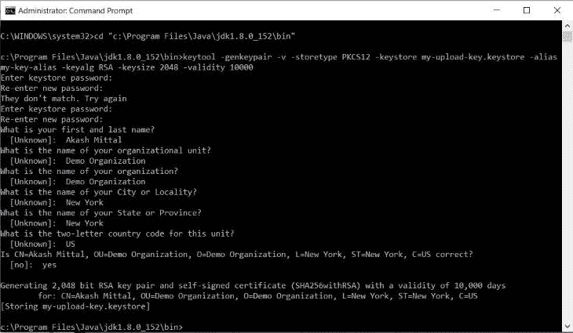
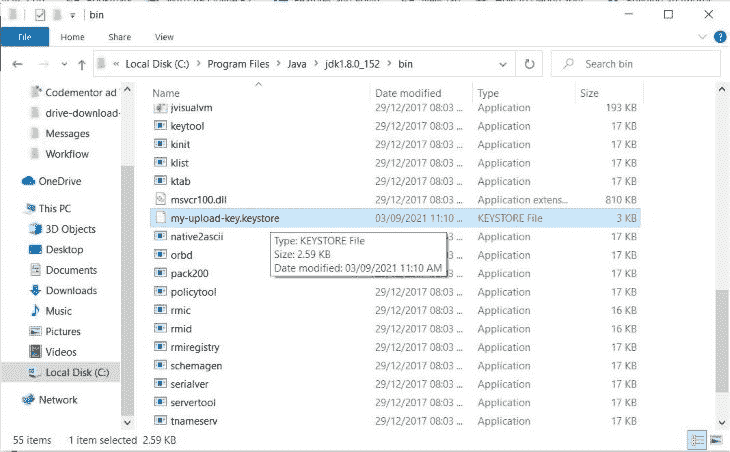
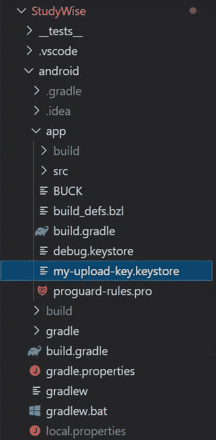
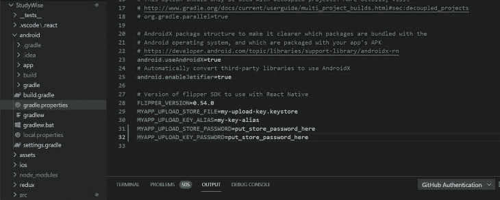
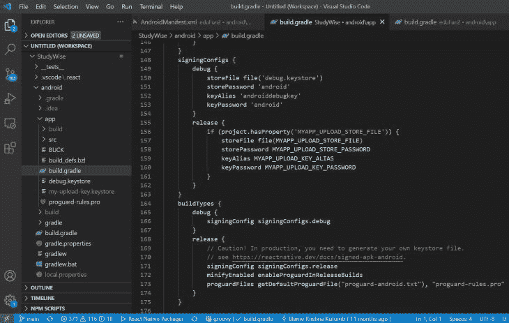

# 如何将 React 原生应用部署到谷歌 Play 商店博客

> 原文：<https://blog.logrocket.com/how-to-deploy-a-react-native-app-to-the-google-play-store/>

React Native 最重要的一个特点是，它可以为 Android 和 iOS 生成应用程序。在本教程中，我们将关注 Android，并演示如何生成`.apk`文件以成功部署在谷歌 Play 商店上。

以下是我们将要介绍的内容:

## 对您的 Android 应用进行数字签名

谷歌 Play 商店是安卓应用的官方搜索引擎和数字分发平台。为了安全和加密，在发布应用程序之前必须对其进行数字签名。

要对应用程序进行签名，您需要一个哈希密钥，该密钥称为释放密钥。此密钥用于签署所有未来的更新，因此确保其安全非常重要；否则，您可能无法访问您的应用程序。

谷歌提供了一个选项，让它通过一个名为[播放应用程序签名](https://developer.android.com/studio/publish/app-signing#app-signing-google-play)的功能来管理您的签名密钥，这使您能够

1.  减少您的应用捆绑包大小
2.  使用 Google 的复杂算法安全地存储签名密钥
3.  允许用户在安全受到威胁时更新密钥

谷歌 Play 商店还需要另一个密钥来上传 Android 应用程序，即上传密钥。

虽然发布密钥可以由 Google 生成和管理，但上传密钥由您生成并用于签署所有更新。如果你不想让 Google 为你生成一个发布密钥，那么你可以使用上传密钥作为发布密钥。不建议这样做，因为拥有不同的密钥更安全。

如果您碰巧丢失了上传密钥，您可以生成一个新的密钥，并联系 Google 支持人员[重置密钥](https://support.google.com/googleplay/android-developer/answer/9842756?visit_id=637662435570044236-2680284147&rd=1#reset)。

## 生成上传密钥

您可以使用 [Java keytool](https://docs.oracle.com/javase/8/docs/technotes/tools/unix/keytool.html) 生成上传密钥。

### 对于 Windows

Java SDK 提供了 keytool 实用程序，因此我们需要从那里运行它。检查 Java SDK 的安装位置。默认情况下，其位置如下:

```
C:\Program Files\Java\jdkx.x.x_x\

```

`x.x.x_x`代表版本号(在我的 PC 上是 1.8.0_152)。keytool 在`bin`文件夹中。第一步是迁移到终端中的这个位置:

```
cd "c:\Program Files\Java\jdk1.8.0_152\bin"

```

接下来，使用一些已定义的选项运行 keytool:

```
keytool -genkeypair -v -storetype PKCS12 -keystore my-upload-key.keystore -alias my-key-alias -keyalg RSA -keysize 2048 -validity 10000

```

让我们来分析一下这里发生了什么:

*   `[PKCS12](https://en.wikipedia.org/wiki/PKCS_12)`是一种存档文件格式，用于存储加密密钥。它代表公钥加密标准
*   `my-upload-key.keystore`是生成文件的名称和扩展名。您可以在这里输入任何有效的名称
*   `my-key-alias`是密钥的标识名。同样，您可以在这里输入任何有效的名称。请记住此别名，因为您将需要它来签署应用程序
*   `[RSA](https://en.wikipedia.org/wiki/RSA_(cryptosystem))`是一种广泛使用的基于私有-公共密钥的加密系统
*   `2048`是将要生成的密钥的大小
*   `validity`以天数表示密钥的有效性。在我们的命令中，我们将其保持在`10000`

当你运行这个 keytool 时，它会要求你输入密码。请记住此密码，因为你将需要使用它来进行应用程序签名。

除此之外，它还会多问几个问题，比如你的名字、地点、单位等等。回答完所有问题后，它将生成密钥库:



您可以在当前终端位置找到生成的密钥库。我们在`bin`文件夹中:



### 对于 MacOS

在 Mac 上生成上传密钥的过程与 Windows 非常相似。如果您不知道 Java SDK 的位置，请使用以下命令:

```
/usr/libexec/java_home

```

这将打印位置，如下所示:

```
/Library/Java/JavaVirtualMachines/jdkX.X.X_XXX.jdk/Contents/Home

```

使用`cd`移动到该位置并运行 keytool:

```
sudo keytool -genkey -v -keystore my-upload-key.keystore -alias my-key-alias -keyalg RSA -keysize 2048 -validity 10000

```

## 更新 Gradle 文件

成功生成密钥库之后，就该用密钥库信息更新 gradle 文件了，这样我们的应用程序就可以用它来签名了。

首先，将 keystore 文件从`bin`文件夹复制到 React Native app 的`android/app`文件夹:



接下来，打开`~/.gradle/gradle.properties`或`android/gradle.properties`，添加以下参照:

```
MYAPP_UPLOAD_STORE_FILE=my-upload-key.keystore
MYAPP_UPLOAD_KEY_ALIAS=my-key-alias
MYAPP_UPLOAD_STORE_PASSWORD=*****
MYAPP_UPLOAD_KEY_PASSWORD=*****

```

将存储密码和密钥密码更改为您在创建密钥库时输入的密码:



如果您运行的是 MacOS，并且不想以纯文本形式存储密码，您可以使用[钥匙串访问](https://pilloxa.gitlab.io/posts/safer-passwords-in-gradle/)并跳过 Gradle 中的密码栏。

在上面的步骤中，我们设置了变量。现在我们需要指导 Gradle 使用这些值。

打开`android/app/build.gradle`并用以下信息进行编辑:

```
...
android {
    ...
    defaultConfig { ... }
    signingConfigs {
        release {
            if (project.hasProperty('MYAPP_UPLOAD_STORE_FILE')) {
                storeFile file(MYAPP_UPLOAD_STORE_FILE)
                storePassword MYAPP_UPLOAD_STORE_PASSWORD
                keyAlias MYAPP_UPLOAD_KEY_ALIAS
                keyPassword MYAPP_UPLOAD_KEY_PASSWORD
            }
        }
    }
    buildTypes {
        release {
            ...
            signingConfig signingConfigs.release
        }
    }
}
...

```



## 生成 APK 发布版本

完成以上所有步骤后，您就可以生成发布版本了。进入 Android 目录并运行发布版本:

```
cd android
./gradlew bundleRelease

```

该命令将创建一个 [AAB](https://developer.android.com/guide/app-bundle) 格式的优化包。自 2021 年 8 月起，新应用必须在 AAB 发布。

借助这种格式，Google Play 可以为各种设备配置生成优化的 apk。这导致应用程序更小，因为资源是根据设备需求有选择地使用的。

## 测试发布版本

如果您想测试您的发布版本，而不在您的手机上手动安装，您可以使用以下命令运行它:

```
npx react-native run-android --variant=release

```

请确保您已经从手机中卸载了任何以前的版本；调试版本使用调试密钥签名，与发布版本不匹配。如果您尝试安装两者，React Native 将抛出一个错误。

## 结论

您可以从 Google Play 帐户轻松发布您的版本。对于一个新鲜的 app(不是现有 app 的更新)，需要填写一些必填信息，包括 app 名称、描述、类别、语言等。还要求截图和视频。

你需要完成一项评级调查，让谷歌知道你的应用程序是否适合给定的年龄范围。上传 AAB 时，Google 会要求您创建一个发布密钥，并允许您管理该密钥。这是你的最佳选择，因为你将来不需要担心它。

在本教程中，我们学习了如何为 Android 创建签名密钥和生成 AAB。如您所见，只需很少的配置就可以构建部署就绪的 Android 包。

## [LogRocket](https://lp.logrocket.com/blg/react-native-signup) :即时重现 React 原生应用中的问题。

[](https://lp.logrocket.com/blg/react-native-signup)

[LogRocket](https://lp.logrocket.com/blg/react-native-signup) 是一款 React 原生监控解决方案，可帮助您即时重现问题、确定 bug 的优先级并了解 React 原生应用的性能。

LogRocket 还可以向你展示用户是如何与你的应用程序互动的，从而帮助你提高转化率和产品使用率。LogRocket 的产品分析功能揭示了用户不完成特定流程或不采用新功能的原因。

开始主动监控您的 React 原生应用— [免费试用 LogRocket】。](https://lp.logrocket.com/blg/react-native-signup)