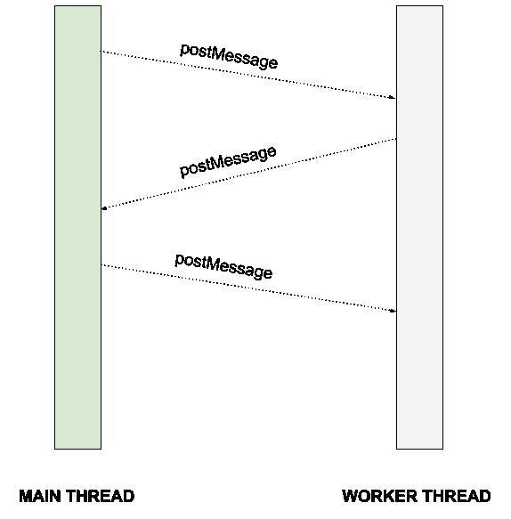
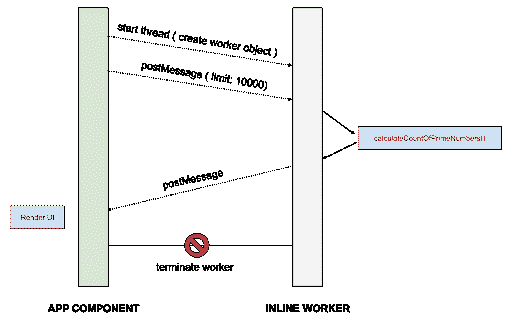
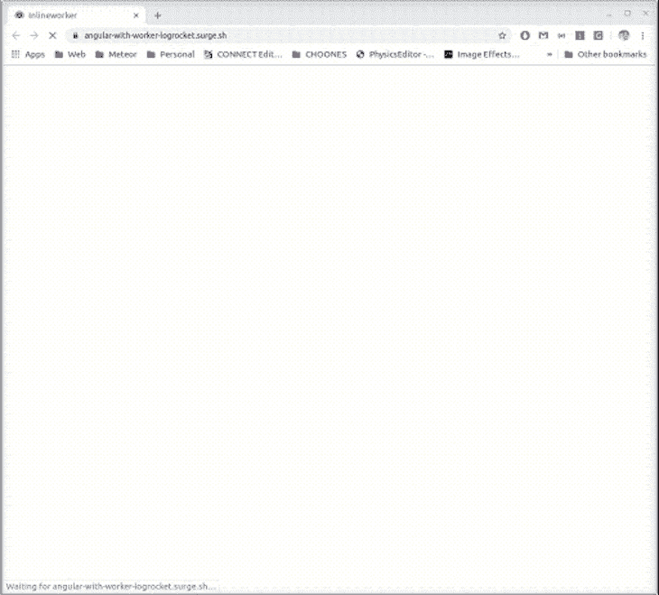

# 如何在 Angular 中用不同线程上的 web worker 执行函数

> 原文：<https://blog.logrocket.com/how-to-execute-a-function-with-a-web-worker-on-a-different-thread-in-angular/>

有了 [web workers](https://developer.mozilla.org/en-US/docs/Web/API/Web_Workers_API) ，我们能够在后台线程中执行脚本，让主线程空闲下来做 UI 工作。默认情况下，Web Workers 接受文件 URL 作为参数，但在我们的例子中，这是不可接受的，因为我们使用 TypeScript 作为主要语言，我们不想将它与 JavaScript 混合使用。第二个问题是脚本需要有一个固定的 URL，因为我们使用 Webpack 来捆绑和连接文件，所以有一个非捆绑文件不是最好的模式。

[工人](https://developer.mozilla.org/en-US/docs/Web/API/Worker)类是[服务工人](https://developer.mozilla.org/en-US/docs/Web/API/ServiceWorker)和[共享工人](https://developer.mozilla.org/en-US/docs/Web/API/SharedWorker)的基础。SharedWorker 类似于 Worker，只是它可以从几个不同的上下文中访问，包括弹出窗口、iframes 等。ServiceWorker 是一种不同的动物，不是本次展览的主题。

由工作线程执行的代码与在主线程上运行的代码在不同的上下文中运行。当我们在 worker 中运行代码时，我们不能操作 DOM 元素、使用窗口对象等等。workers 运行的上下文被称为[DedicatedWorkerGlobalScope](https://developer.mozilla.org/en-US/docs/Web/API/DedicatedWorkerGlobalScope)，并且在您可以访问的内容和通常要做的事情方面非常有限。

工作人员的常见用例包括使用进行繁重处理的纯函数。因为我们不希望它们破坏我们的 web 应用程序的性能，所以我们应该将它们转移到一个工作线程中。

工作线程可以用`postMessage`方法通过消息与主线程通信。通信可以是双向的，这意味着工作线程和主线程可以相互发送消息。



主线程和工作线程都可以相互监听和发送消息。

让我们创建一个 **InlineWorker** 类，它将接受一个函数作为参数，并在另一个线程中运行该函数，就像这样:

```
import { Observable, Subject } from 'rxjs';

export class InlineWorker {

  private readonly worker: Worker;
  private onMessage = new Subject<MessageEvent>();
  private onError = new Subject<ErrorEvent>();

  constructor(func) {

    const WORKER_ENABLED = !!(Worker);

    if (WORKER_ENABLED) {
      const functionBody = func.toString().replace(/^[^{]*{\s*/, '').replace(/\s*}[^}]*$/, '');

      this.worker = new Worker(URL.createObjectURL(
        new Blob([ functionBody ], { type: 'text/javascript' })
      ));

      this.worker.onmessage = (data) => {
        this.onMessage.next(data);
      };

      this.worker.onerror = (data) => {
        this.onError.next(data);
      };

    } else {
      throw new Error('WebWorker is not enabled');
    }
  }

  postMessage(data) {
    this.worker.postMessage(data);
  }

  onmessage(): Observable<MessageEvent> {
    return this.onMessage.asObservable();
  }

  onerror(): Observable<ErrorEvent> {
    return this.onError.asObservable();
  }

  terminate() {
    if (this.worker) {
      this.worker.terminate();
    }
  }
}

```

上面显示的代码中最重要的部分是一个类，它将一个函数转换成一个字符串，并创建将通过构造函数传递给 worker 类的`ObjectURL`。

```
const functionBody = func.toString().replace(/^[^{]*{\s*/, '').replace(/\s*}[^}]*$/, '');
this.worker = new Worker(URL.createObjectURL(
 new Blob([ functionBody ], { type: 'text/javascript' })
));

```

## 如何使用 InlineWoker 类

假设我们有一个 Angular 函数(就像上面代码块中显示的类)，我们想在后台处理它。

我们将建立一个应用程序，计算我们有多少素数在范围内。

主线程将向工作线程发送限制参数，一旦线程完成其任务，它将向主线程提供结果并终止工作线程。

需要注意的是，我们不能使用任何在传递给 InlineWorker 的回调函数之外定义的方法、变量或函数。

如果我们需要传递参数( [postMessage 函数接受任何东西作为参数](https://developer.mozilla.org/en-US/docs/Web/API/Worker/postMessage)，我们必须用`postMessage`方法来做。

```
import { Component, OnInit } from '@angular/core';
import { InlineWorker } from './inlineworker.class';

@Component({
  selector: 'app-root',
  templateUrl: './app.component.html',
  styleUrls: ['./app.component.css']
})
export class AppComponent implements OnInit {

  result = 0;

  ngOnInit() {

    const worker = new InlineWorker(() => {
      // START OF WORKER THREAD CODE
      console.log('Start worker thread, wait for postMessage: ');

      const calculateCountOfPrimeNumbers = (limit) => {

        const isPrime = num => {
          for (let i = 2; i < num; i++) {
            if (num % i === 0) { return false; }
          }
          return num > 1;
        };

        let countPrimeNumbers = 0;

        while (limit >= 0) {
          if (isPrime(limit)) { countPrimeNumbers += 1; }
          limit--;
        }

        // this is from DedicatedWorkerGlobalScope ( because of that we have postMessage and onmessage methods )
        // and it can't see methods of this class
        // @ts-ignore
        this.postMessage({
          primeNumbers: countPrimeNumbers
        });
      };

      // @ts-ignore
      this.onmessage = (evt) => {
        console.log('Calculation started: ' + new Date());
        calculateCountOfPrimeNumbers(evt.data.limit);
      };
      // END OF WORKER THREAD CODE
    });

    worker.postMessage({ limit: 300000 });

    worker.onmessage().subscribe((data) => {
      console.log('Calculation done: ', new Date() + ' ' + data.data);
      this.result = data.data.primeNumbers;
      worker.terminate();
    });

    worker.onerror().subscribe((data) => {
      console.log(data);
    });
  }
}

```

如我们所见，我们将匿名函数作为参数传递给 InlineWorker。传递的函数的上下文是隔离的，这意味着我们不能访问它之外的任何内容。如果我们尝试，它将是不确定的。

我们的应用程序的流程如下所示:



我们必须将@ts-ignore 注释放在 postMessage 和`onmessage`方法的前面，因为 TypeScript 不能从当前上下文中读取定义。在这种情况下，TypeScript 就没那么有用了。

回调函数中的监听器`onmessage`将监听传递给这个 worker 的任何消息，在我们的例子中，它将调用传递给它的参数`calculateCountOfPrimeNumbers`。

函数将进行计算，并通过`postMessage`方法将结果传递给主线程上的监听器。

使用:

```
worker.postMessage({ limit: 10000 });
```

我们将触发一个工作线程的执行。当我们用 Angular 编写这个例子时，我们将使用 RXJS observables 来传递和监听数据变化。

在下一行，我们正在订阅来自一个工人的消息。

```
worker.onmessage().subscribe((data) => {
 console.log(data.data);
 worker.terminate();
});

```

简单地说，我们将一个结果输出到一个控制台，然后我们终止这个 worker，这样它就不能再被使用了。我们可以向一个工作线程发送多条消息并接收多个结果，我们不会像上面的例子那样被锁定为单次执行。

我们订阅一个`onerror` observable 很重要，因为这是查看工作线程中发生的错误的唯一方法。

## 演示时间

下面是工人实现的演示:[https://angular-with-worker-logrocket.surge.sh/](https://angular-with-worker-logrocket.surge.sh/)(没有阻塞 UI)



And here is the demo without the worker: [https://angular-without-worker-logrocket.surge.sh/](https://angular-without-worker-logrocket.surge.sh/) ( UI is blocked while computation is running )


## 结论

在这篇文章中，我们学习了如何将繁重的处理从主线程转移到后台线程，而不会阻塞主线程，并在应用程序中提供良好的用户体验。

Web workers 是 Web API 的[部分，这意味着它们只在浏览器中可用，需要注意的是它们在所有主流浏览器](https://developer.mozilla.org/en-US/docs/Web/API)中都得到了[的良好支持。](https://developer.mozilla.org/en-US/docs/Web/API/Worker#Browser_compatibility)

## 像用户一样体验 Angular 应用程序

调试 Angular 应用程序可能很困难，尤其是当用户遇到难以重现的问题时。如果您对监视和跟踪生产中所有用户的角度状态和动作感兴趣，

[try LogRocket](https://lp.logrocket.com/blg/angular-signup)

.

[](https://lp.logrocket.com/blg/angular-signup)[https://logrocket.com/signup/](https://lp.logrocket.com/blg/angular-signup)

LogRocket 就像是网络和移动应用程序的 DVR，记录你网站上发生的一切，包括网络请求、JavaScript 错误等等。您可以汇总并报告问题发生时应用程序的状态，而不是猜测问题发生的原因。

LogRocket NgRx 插件将角度状态和动作记录到 LogRocket 控制台，为您提供导致错误的环境，以及出现问题时应用程序的状态。

现代化调试 Angular 应用的方式- [开始免费监控](https://lp.logrocket.com/blg/angular-signup)。