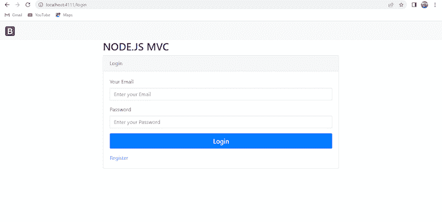
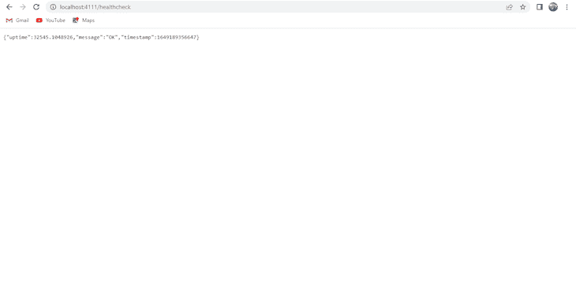
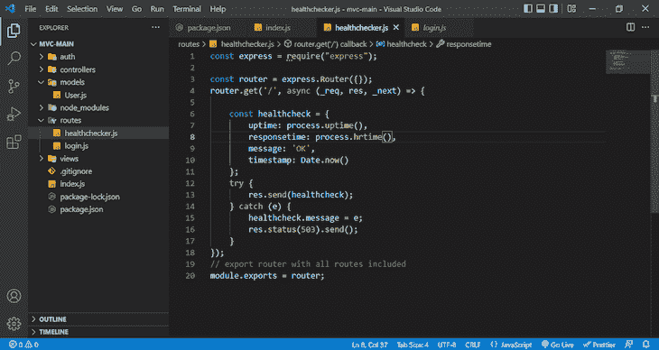

# 如何在 Node.js 中实现健康检查

> 原文：<https://blog.logrocket.com/how-to-implement-a-health-check-in-node-js/>

健康真的很重要。有一种流行的说法是健康就是财富——即使在软件工程领域也是如此。是啊！就像生物一样，如果我们不小心使用，应用程序也会崩溃。

软件中的健康检查帮助我们识别应用程序中的低效之处，以便更好地维护它们。

就像我们如何看医生来知道我们是否有什么问题，对，同样的原则也适用于软件，例如，我们关注服务器或响应时间。

在本文中，我们将研究如何在 Node.js 应用程序中进行健康检查。

## 要求

我们将实现一个基本的 Node.js 健康检查。以下是需要遵循的内容:

## 为什么你需要进行健康检查

正如我们在引言中已经提到的；健康就是财富。在我们开始讨论如何在 Node.js 中实现健康检查之前，让我们讨论一下它的重要性以及为什么您应该养成执行这些检查的习惯。

我们首先需要承认软件或功能的可用性极其重要。例如，对 API 可用性的常规健康检查有助于您了解关键问题并尽快修复它们。

如果发生停机，可以立即通知应用程序所有者，以便快速解决问题。

随着我们软件基础设施的增长，运行状况检查变得更加重要，确保所有微服务和端点完美运行的需求对于我们管理的应用变得更加重要。

在考虑任何编程语言或堆栈中的软件的健康状况时，我们检查的一些事情是服务器在发出请求时的响应时间，以及服务器如何连接到数据库(如果有数据库的话)。

健康检查之所以必要的另一个原因是为了保持你的服务的可用性。您的应用程序或产品不应该被视为其竞争对手中停机时间最长的一个——这对业务不利，正如他们所说，好名声胜过财富。

## 在 Node.js 中实现健康检查

我们现在将看看如何在 Node.js 中实现基本的健康检查。

我将使用我自己开发的应用程序。这里有一个链接指向它的教程。Github 代码可以在[这里](https://github.com/bigpreshy/mvc)找到。
你可以从[这里](https://github.com/bigpreshy/mvc)克隆或下载。

使用`git clone`将存储库克隆到您自己的机器上:

```
git clone https://github.com/bigpreshy/mvc

```

然后通过执行以下操作移动到文件夹中:

```
cd mvc

```

package.json 文件应该如下所示:


之后，运行这个命令来安装应用程序中使用的所有依赖项(包):

```
npm install

```

完成后，运行:

```
npm run develop

```

在你的浏览器上，进入[http://localhost:4111/log in](http://localhost:4111/login)(还有其他路线如 */register/dashboard* )。



现在一切都在运行。可以按照 MVC 教程连接 [MongoDB Atlas](https://www.mongodb.com/cloud/atlas)

### 添加运行状况检查路线

添加执行检查(服务器健康和运行时间等)的基本健康检查。)，在我们的 route 文件夹中添加 healthchecker.js，并添加以下代码:

```
//js
const express = require("express");
const router = express.Router({});
router.get('/', async (_req, res, _next) => {

    const healthcheck = {
        uptime: process.uptime(),
        message: 'OK',
        timestamp: Date.now()
    };
    try {
        res.send(healthcheck);
    } catch (error) {
        healthcheck.message = error;
        res.status(503).send();
    }
});
// export router with all routes included
module.exports = router;

```

我们在这里做的是添加另一个路由，这个路由有一个`healthcheck`对象，它有三个属性(正常运行时间 ***、*** 消息 ***、*** 和时间戳)，分别有值`process.uptime()` **、** `OK` **、**和`Date.now()`。

我们还有一个 [try catch](https://developer.mozilla.org/en-US/docs/Web/JavaScript/Reference/Statements/try...catch) ，它执行 try 块中的代码。如果存在异常，它会以错误响应(`healthcheck`对象中的消息值成为错误)并发送状态 [503](https://developer.mozilla.org/en-US/docs/Web/HTTP/Status/503) 。

最后，我们必须导出模块(路由器)，因此文件末尾有`module.exports = router;`。

### 注册运行状况检查路线

在我们创建了路线之后，继续编辑 index.js 文件。只需添加这行代码:

```
app.use('/healthcheck', require('./routes/healthchecker'));

```

之后，您的完整 index.js 文件将如下所示:

```
const express = require("express");
const app = express();
const mongoose = require("mongoose");
const dotenv = require("dotenv");
const session = require('express-session');
dotenv.config();
const passport = require("passport");
const { loginCheck } = require("./auth/passport");
loginCheck(passport);
// Mongo DB conncetion
const database = process.env.MONGOLAB_URI;
mongoose
  .connect(database, { useUnifiedTopology: true, useNewUrlParser: true })
  .then(() => console.log("e don connect"))
  .catch((err) => console.log(err));
app.set("view engine", "ejs");
//BodyParsing
app.use(express.urlencoded({ extended: false }));
app.use(session({
    secret:'oneboy',
    saveUninitialized: true,
    resave: true
  }));

app.use(passport.initialize());
app.use(passport.session());
//Routes
app.use("/", require("./routes/login"));
app.use('/healthcheck', require('./routes/healthchecker'));

const PORT = process.env.PORT || 4111;
app.listen(PORT, console.log("Server has started at port " + PORT));

```

请注意我们的路线是如何注册的。它被添加在我们的`passport.session()`和`passport.initialize()`方法之后。

之后，停止服务器并重新运行`npm run develop`，然后进入[http://localhost:4111/health check](http://localhost:4111/healthcheck)，会显示这个:



这是我们的正常运行时间(我们的服务器自启动以来已经运行了多长时间)，一条“OK”消息表明一切正常，还包括一个时间戳。

### 添加响应时间

另一个需要检查的是响应时间——服务器响应请求需要多长时间。

为此，我们将把下面的`process.hrtime()`方法作为值添加到`healthcheck`对象的`processtime`属性中，该对象是我们的 route 文件夹中的 healthchecker.js 文件。

您的 healthchecker.js 应该如下所示:



刷新你的服务器，重新访问[http://localhost:4111/health check](http://localhost:4111/healthcheck)会给你这个。现在它将拥有以纳秒为单位记录的值的`responsetime`属性:


同样值得注意的是，多年来构建的一些服务定期检查我们的应用程序的健康状况(不仅仅是 Node.js，还有其他堆栈中的应用程序)。我通常用 https://uptimerobot.com/的。

还有其他人。 [Logrocket](https://logrocket.com/) 用于前端监控，还有 [Freshping](https://app.freshping.io/) 、[正常运行时间](https://uptime.com/go/home)、[logit monitor](https://www.logicmonitor.com/)，所有这些都应该告诉您，应用程序的运行状况非常重要！

## 结论

在本文中，我们讨论了健康检查需要什么，以及为什么我们需要在您的应用程序中考虑它们，以便轻松快速地解决问题。

此外，我们通过一个示例项目研究了如何在 Node.js 中实现健康检查。这个[项目](https://github.com/bigpreshy/mvc)只是一个基于 Model-view-controller Node.js 的项目，它使用 Mongo DB 作为数据库来处理用户注册和登录。

下面是我们检查的一些内容:服务器的响应时间、服务器的正常运行时间、服务器的状态代码(只要它是 200，我们就会得到一个“OK”消息)，以及服务器的时间戳。

在开发时，您需要考虑应用程序的健康状况。这有助于你密切监视正在发生的事情，如果最终发生了不可预见的事情，你会知道去哪里找。

## 200 只显示器出现故障，生产中网络请求缓慢

部署基于节点的 web 应用程序或网站是容易的部分。确保您的节点实例继续为您的应用程序提供资源是事情变得更加困难的地方。如果您对确保对后端或第三方服务的请求成功感兴趣，

[try LogRocket](https://lp.logrocket.com/blg/node-signup)

.

[](https://lp.logrocket.com/blg/node-signup)[https://logrocket.com/signup/](https://lp.logrocket.com/blg/node-signup)

LogRocket 就像是网络和移动应用程序的 DVR，记录下用户与你的应用程序交互时发生的一切。您可以汇总并报告有问题的网络请求，以快速了解根本原因，而不是猜测问题发生的原因。

LogRocket 检测您的应用程序以记录基线性能计时，如页面加载时间、到达第一个字节的时间、慢速网络请求，还记录 Redux、NgRx 和 Vuex 操作/状态。

[Start monitoring for free](https://lp.logrocket.com/blg/node-signup)

.