# 如何将 FaunaDB 集成到 React 应用程序中

> 原文：<https://blog.logrocket.com/how-to-integrate-faunadb-in-react-apps-with-material-ui/>

使用 React 之类的库创建单页面应用程序(SPA)有几种方法。为 SPA 选择技术组合时，有许多无服务器选项可供选择。一个流行的选择是将 FaunaDB 集成到 React 应用程序中。

FaunaDB 是一个数据库即服务( *DBaaS* )，它通过使用预先存在的基础设施来构建 web 应用程序，而无需设置定制的 API 服务器，从而有助于节省时间。

在这篇文章中，我们将看看如何开始使用 FaunaDB 来创建可以直接在 React 应用程序中使用的 API。

## 我们在建造什么？

这是最终的应用程序的样子:

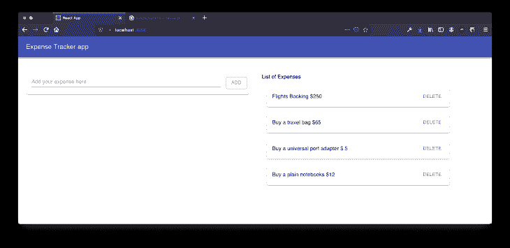

出于学习的目的，我将保持 UI 最小化。

## 先决条件

为了充分利用本教程，请确保在本地开发环境中安装了以下软件:

*   [Node.js](https://nodejs.org/en/) 版本> = `12.x.x`已安装
*   有权访问一个包管理器，如`[npm](https://www.npmjs.com/)`或`[yarn](https://classic.yarnpkg.com/en/)`
*   [`create-react-app`](https://reactjs.org/docs/create-a-new-react-app.html) CLI 作为全局包安装或使用`npx`
*   访问 FaunaDB 仪表板
*   反应钩的基本知识

## 为什么是 FaunaDB？

以下是使用 FaunaDB 时需要考虑的几点:

*   它支持事务并遵循 [ACID(原子性、一致性、隔离性、持久性)约定](https://fauna.com/blog/acid-transactions-in-a-globally-distributed-database)
*   它伸缩性很好。FaunaDB 的架构允许数据库根据需求和负载平衡进行扩展。数据库实例[分布在世界各地的许多实例中](https://fauna.com/blog/consistency-without-clocks-faunadb-transaction-protocol#:~:text=Summary,identifier%20that%20wrote%20that%20version),这样应用程序的用户将总是能够访问最近的实例
*   数据存储为增强的 JSON 文档，因此文档可以包含嵌套的复杂引用
*   FaunaDB 与 React 应用程序配合良好的另一个原因是它总体上易于使用。作为开发人员或开发团队，您可以专注于构建您的应用程序，而不是设置和运行后端环境来创建 API
*   它的仪表板中有一个 GraphQL playground，您可以使用. gql 或。graphql 文件

## FaunaDB 入门

首先使用电子邮件凭证或 GitHub 帐户注册一个新帐户。您可以在此注册一个新账户[:](https://dashboard.fauna.com/accounts/register)

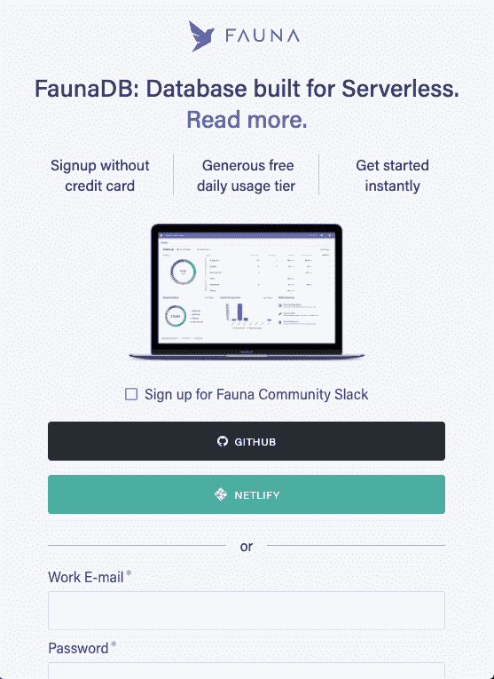

创建新帐户或登录后，您将会看到仪表板屏幕:

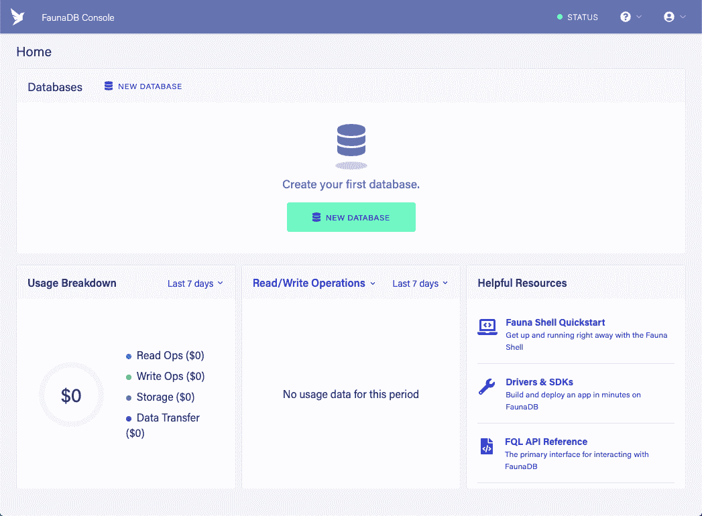

就是这样！现在我们已经建立了我们的帐户。

## 创建新的 FaunaDB 实例

要使用 FaunaDB 服务创建一个新的数据库实例，您必须遵循一些简单的步骤。在仪表板屏幕上，按下按钮`New Database`:

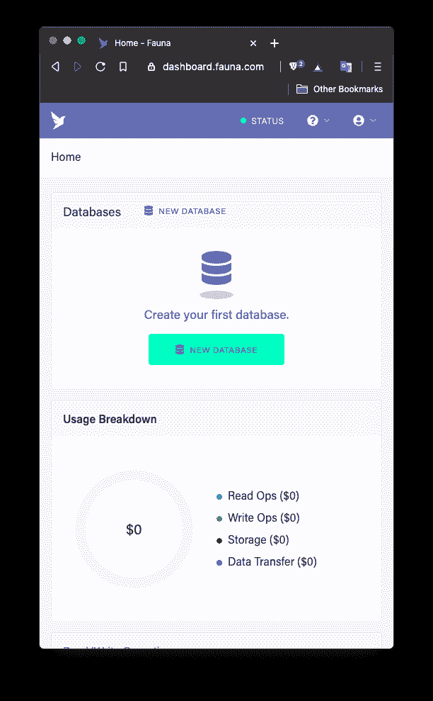

然后，输入数据库的名称并按下按钮`Save`:

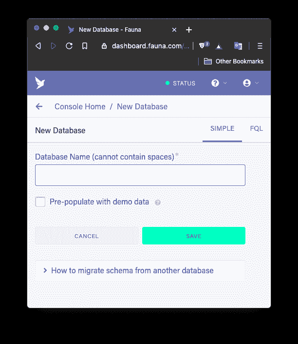

一旦建立了数据库实例，就可以创建访问键了。访问键是连接授权和从 React 应用程序到数据库的连接。该键允许您控制谁拥有对数据库的读写操作。

要创建第一个访问键，从侧面菜单进入`Security`选项卡并点击按钮`New Key`:

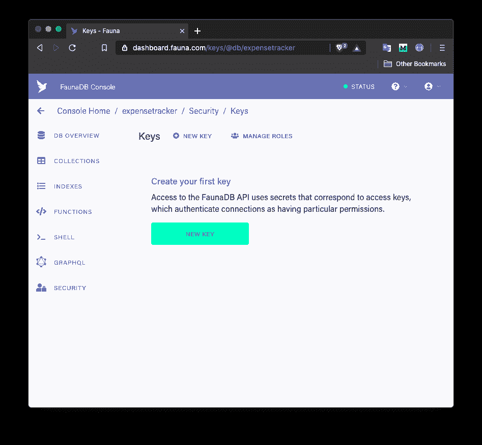

一旦您在下面的屏幕上按下`Save`,将会生成一个新的密钥:

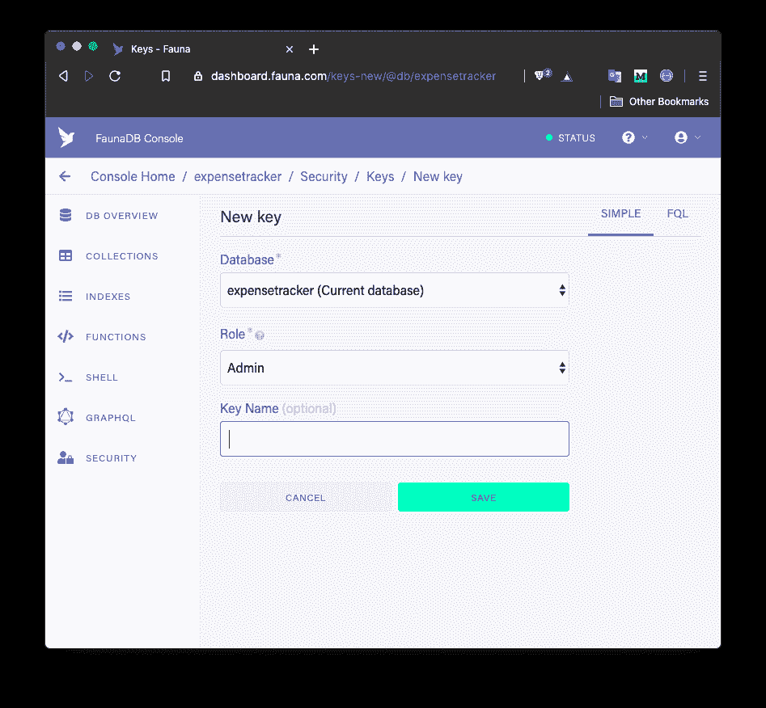

请注意，您现在创建的密钥会将权限授予任何可以访问它的人。这意味着拥有这个密钥的人将有权访问数据库实例。在为生产级应用程序创建访问键时，您可能需要重新考虑这个角色。(您可以选择另一个名为`server`的选项，它提供较少的访问权限):

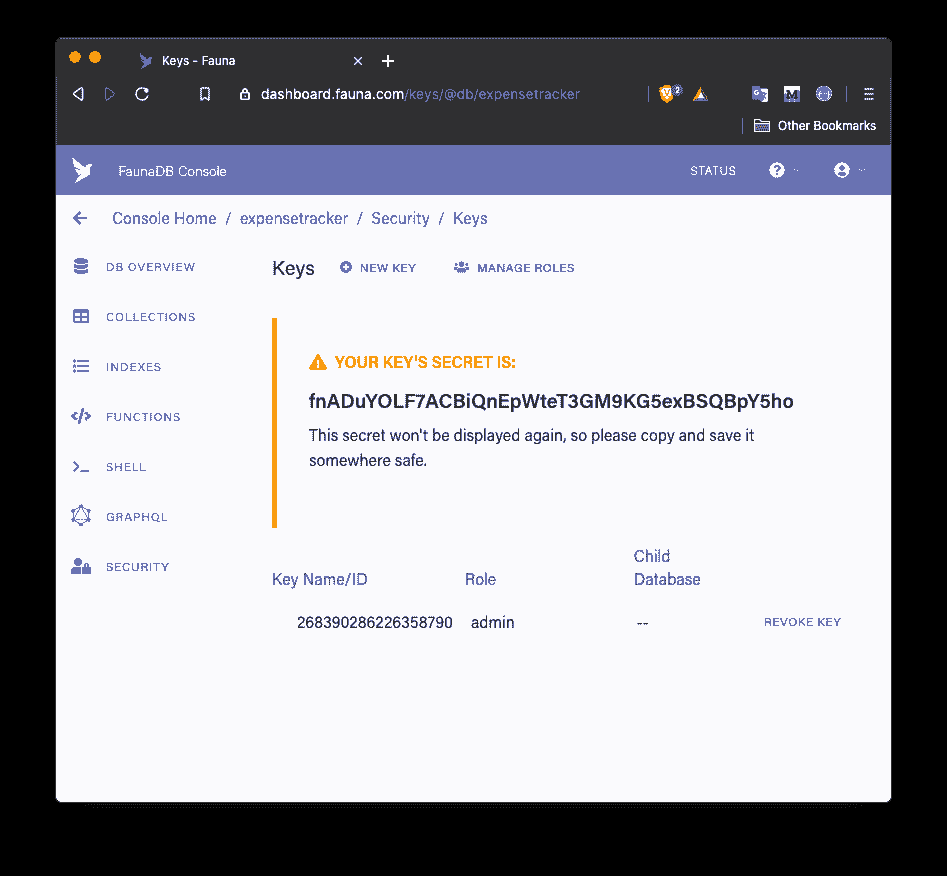

当通过 GitHub 存储项目时，为了避免令牌从 React 应用中泄漏，在 React 项目的根目录中创建一个`.env`文件，并将访问密钥粘贴在下面代码片段中的`YOUR_KEY_HERE`位置:

```
DB_KEY=YOUR_KEY_HERE
```

确保在`.gitignore`中添加该文件。现在，让我们从 FaunaDB 仪表板创建一个新的数据集合。从侧面菜单转到`Collections`选项卡，并按下`New Collection`按钮:

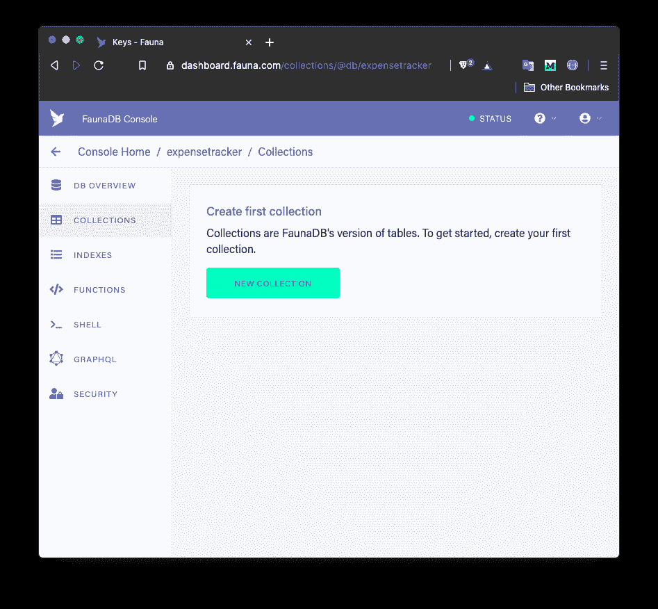

输入收藏的名称并按下`Save`按钮:

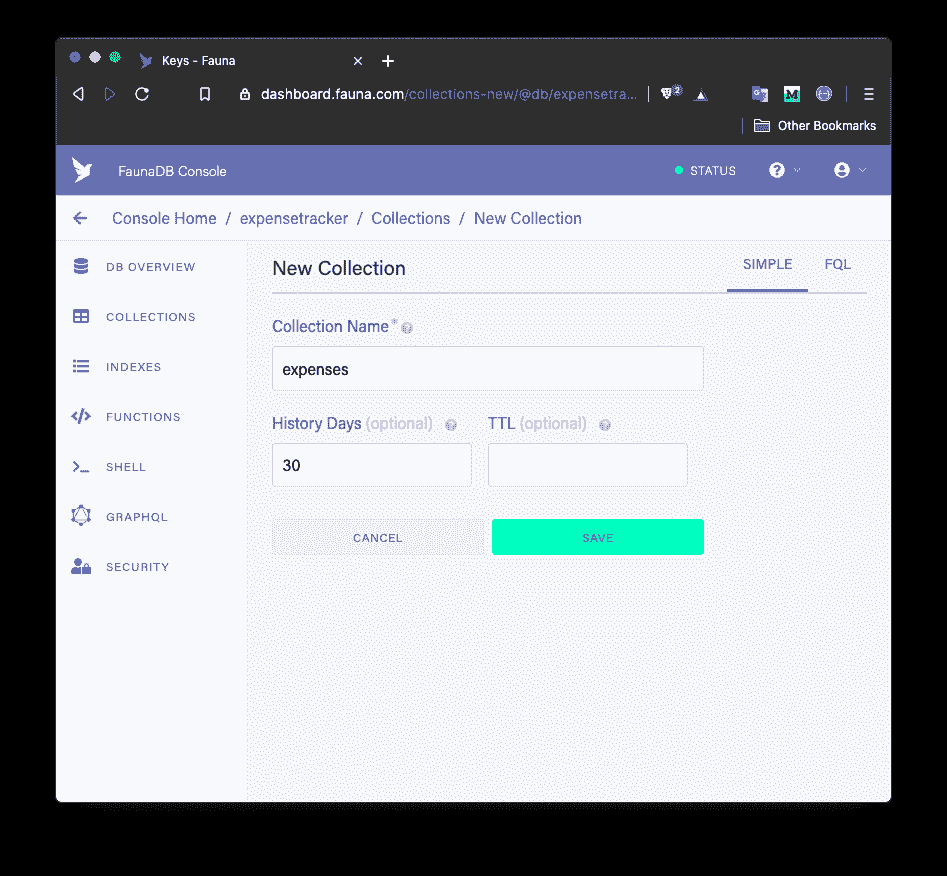

最后一步是创建一个新的索引。转到`Indexes`选项卡创建一个索引。[在 FaunaDB 中搜索文档](https://docs.fauna.com/fauna/current/tutorials/indexes/search.html)可以通过使用`indexes`来完成，特别是通过将输入与索引的`terms`字段进行匹配。如果您希望拥有在特定屏幕上搜索等功能，这将很有帮助:

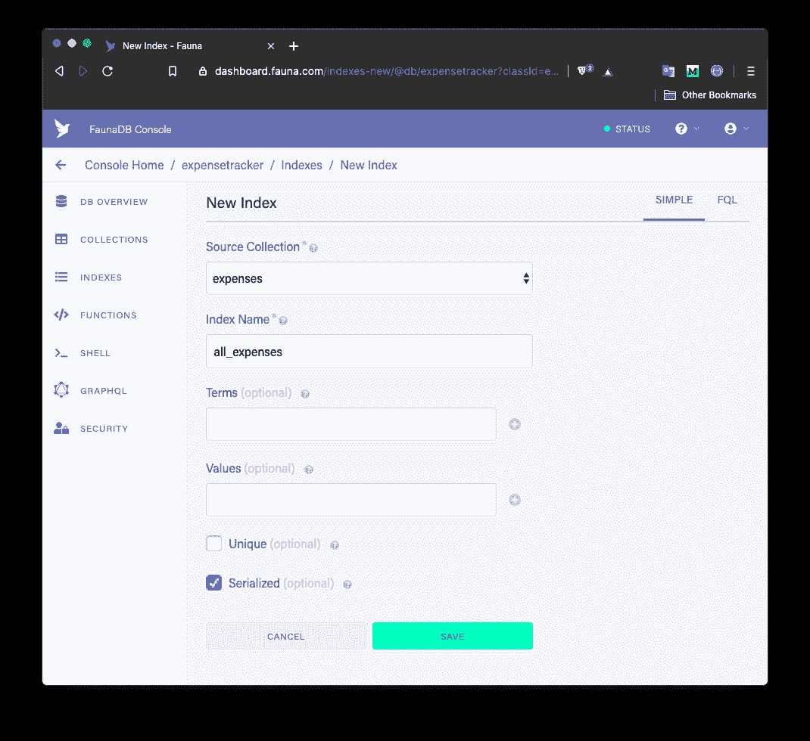

就是这样。现在让我们开始将 React 应用程序连接到动物群数据库的过程，并开始构建它。

## 创建新的 React 应用程序并安装依赖项

要在 React 应用程序中集成 FaunaDB SDK，首先，让我们创建一个新的 React 项目。然后，安装所需的依赖项。为了快速设置 UI，让我们使用 React 应用程序的材质 UI 库。您可以替换自己选择的 UI 组件库:

```
npx create-react-app expense-tracker-FaunaDB
# after the project directory is created
cd expense-tracker-FaunaDB
# install dependencies
yarn add faunadb @material-ui/core
```

`faunadb`包是 FaunaDB 的 FaunaDB JavaScript 驱动。`@material-ui/core`是基于材质设计系统的 UI 库，内置了 React 组件，可以直接在 React 应用中使用。

要在 React 应用程序中集成@material-ui/core 包，请确保您遵循官方文档[中的说明指南。](https://material-ui.com/getting-started/installation/)在此步骤之后，`package.json`文件将使用以下依赖项进行更新:

```
{
  "faunadb": "2.14.2",
  "@material-ui/core": "4.10.2"
}
```

## 在 React 应用中集成 FaunaDB SDK

要将`faunadb`客户端与 React 应用程序集成，您必须从应用程序进行初始连接。在目录路径`src/config/`下创建一个新文件`db.js`。然后导入`faunadb`驱动程序并定义一个新的客户端。

作为参数传递给`faunadb.Client()`方法的`secret`将保存来自`.env`文件的访问密钥:

```
import faunadb from 'faunadb';
const client = new faunadb.Client({
  secret: process.env.DB_KEY
});
const q = faunadb.query;
export { client, q };
```

这就是最初的整合。

## 使用材质用户界面创建导航栏

首先在`src/`目录中创建一个新的`components/`目录。该目录将包含本教程中演示 React 应用程序将使用的大多数组件。在目录中创建一个文件，我们称之为`Navigation.js`。

```
import { React } from 'react';
export default function Navigation() {
  // ...
}
```

这个组件文件将负责显示带有应用程序标题的导航栏。应用程序的标题将作为道具从父组件(当前情况下是`App`组件)传递给这个组件。

要构建导航栏，让我们使用材料用户界面库中一些预定义的用户界面组件:

```
// other import statements
import { AppBar, Toolbar, Typography } from '@material-ui/core';
```

`AppBar`组件用于显示 web 应用程序的品牌、屏幕标题和导航。这就是我们要用它的原因。`ToolBar`组件是包装器，您可以在其中水平放置组件。`Typography`组件应用默认可用的材质 UI 主题。

`title`道具将是应用程序的标题或名称:

```
export default function Navigation({ title }) {
  return (
    <AppBar>
      <Toolbar>
        <Typography variant="h6">{title}</Typography>
      </Toolbar>
    </AppBar>
  );
}
```

在上面的代码片段中，请注意`Typography`组件上的`variant`属性。它使用变体映射将一个 UI 元素与一个 HTML 语义元素恰当地关联起来(比如代码片段中的`h6`)。

要查看它的运行，请在`App.js`文件中导入 Navbar 组件:

```
import React from 'react';
import Navigation from './components/Navigation';
function App() {
  return <Navigation title="Expense Tracker app" />;
}
export default App;
```

从终端窗口中，启动开发服务器并在浏览器窗口中打开 URL `[http://localhost:3000](http://localhost:3000)`。结果如下:

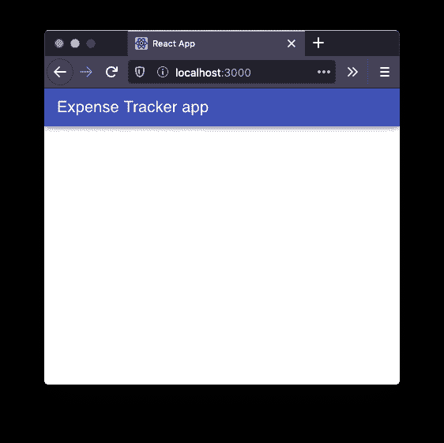

## 使用网格布局组件

要在使用材质 UI 库时布局 React 组件，一个常用的方法是使用`Grid`组件。首先，将该组件导入到`App`组件中，如下所示:

```
import { Grid } from '@material-ui/core';
```

该组件提供对它所环绕的自定义组件的大小以及它们的间距的控制。Material Design 的响应式用户界面基于 12 列网格布局。`Grid`组件帮助您实现这个布局系统，然后提供想要显示的值或网格数。材质 UI 使用 CSS 的 Flexbox 来管理网格列的布局对齐和大小调整。基本网格可能如下所示:


这个组件是如何工作的呢？首先定义一个父`Grid`组件，它有一个名为`container`的属性，其行为类似于`flex`容器。在它里面，你可以定义其他的`Grid`组件，这些组件将拥有另一个名为`item`的属性。基本列宽断点如`xs`、`md`等可以应用于每一项。

断点在各种组件内部使用，以使它们能够响应。你可以在官方文档[这里](https://material-ui.com/customization/breakpoints/#breakpoints)读到更多关于它们的内容。

看看如何使用`Grid`组件设置相邻对齐的两个段落的例子。每个`item`组件都有一些虚拟文本要显示。`makeStyles`来自于材质 UI API。它将一个样式表与一个函数组件链接起来，并通过使用对象名作为一个`className`属性的值，返回一个在组件内部使用的钩子。

```
import React from 'react';
import { Grid, Typography, makeStyles } from '@material-ui/core';
import Navigation from './components/Navigation';
const useStyles = makeStyles({
  root: {
    marginTop: 80,
    margin: 20,
    flexGrow: 1
  }
});
function App() {
  const classes = useStyles();
  return (
    <>
      <Navigation title="Expense Tracker app" />
      <Grid container className={classes.root}>
        <Grid item xs={12} md={6}>
          <Typography variant="p">
            Lorem ipsum dolor sit, amet consectetur adipisicing elit.
            Reprehenderit itaque iusto perferendis consectetur culpa
            accusantium! Dolor, nemo natus ducimus esse minus, ut laborum
            excepturi deserunt recusandae praesentium eligendi consectetur
            labore.
          </Typography>
        </Grid>
        <Grid item xs={12} md={6}>
          <Typography variant="p">
            Lorem ipsum dolor sit, amet consectetur adipisicing elit.
            Reprehenderit itaque iusto perferendis consectetur culpa
            accusantium! Dolor, nemo natus ducimus esse minus, ut laborum
            excepturi deserunt recusandae praesentium eligendi consectetur
            labore.
          </Typography>
        </Grid>
      </Grid>
    </>
  );
}
export default App;
```

在更宽的屏幕上，这是断点`md`将如何显示内容:
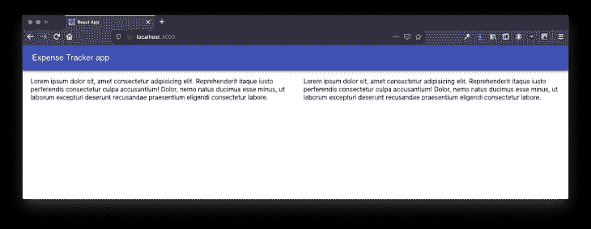

在较小的屏幕上，断点`xs`将显示如下所示的内容:

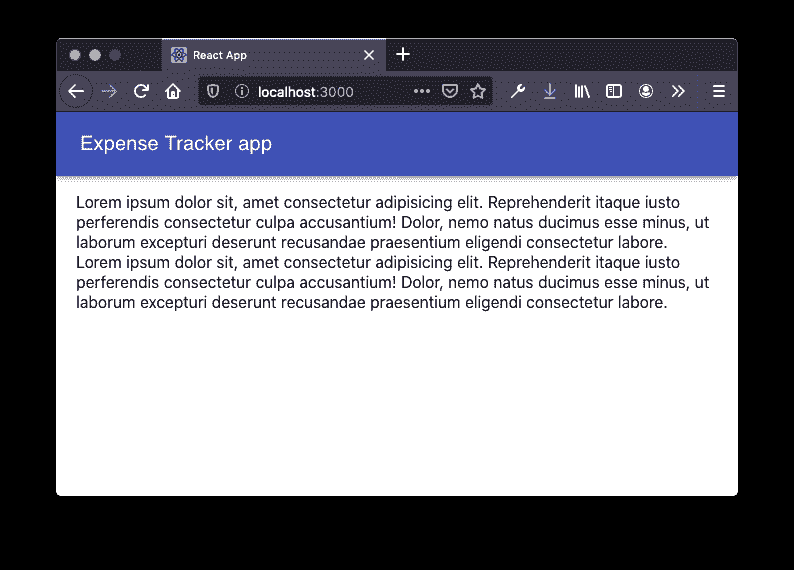

现在你已经对材质 UI 的工作原理有了基本的了解，让我们来设置 React 应用的核心 UI。

## 构建费用应用程序的用户界面

在本节中，让我们首先使用 Material UI 库组件添加一些 UI，以显示一个输入字段，用户将在该字段中输入新的费用。此外，在输入字段旁边添加一个按钮，以便在将费用添加到费用跟踪器列表时触发操作。在`App.js`文件中，导入以下语句:

```
import React, { useState } from 'react';
import {
  Paper,
  Grid,
  Button,
  Typography,
  TextField,
  makeStyles
} from '@material-ui/core';
```

在`App`组件内部，使用`useState` React 钩子创建一个名为`expenseName`的状态变量，默认值为空字符串。它将存储用户输入的值，即费用的详细信息。

然后用数组的默认值定义第二个状态变量，名为`expenses`，它将存储所有的费用明细项目:

```
function App() {
  const classes = useStyles();
  const [expenseDetail, setExpenseDetail] = useState('');
  const [expenses, setExpenses] = useState([]);
  // ...
}
```

然后，定义三个处理函数:`handleExpenseDetailChange`、`handleSubmit`、`resetInputField`。

第一个处理函数将更新状态变量`expenseDetail`中用户输入的值。

第二个函数将请求数据库在数据库中存储值。让我们在后面的部分定义这个函数的内容。

第三个处理程序方法将输入字段重置为空，并在 UI 上显示占位符值:

```
function App() {
  // ...
  function handleExpenseDetailChange(event) {
    console.log(event.target.value);
    setExpenseDetail(event.target.value);
  }
  function handleSubmit(event) {
    event.preventDefault();
  }
  function resetInputField() {
    setExpenseDetail('');
  }
  // ...
}
```

最后，定义输入字段和按钮，以便使用物料 UI 中的可视组件添加费用详细信息。此外，为费用列表添加一些样式:

```
const useStyles = makeStyles({
  root: {
    marginTop: 80,
    margin: 20,
    flexGrow: 1
  },
  list: {
    marginTop: 20
  }
});
function App() {
  // ...
  return (
    <>
      <Navigation title="Expense Tracker app" />
      <Grid container className={classes.root} spacing={3}>
        <Grid item xs={12} md={6}>
          <Paper style={{ margin: 16, padding: 16 }}>
            <Grid container>
              <Grid xs={10} md={11} item style={{ paddingRight: 16 }}>
                <TextField
                  type="text"
                  name={expenseDetail}
                  value={expenseDetail}
                  placeholder="Add your expense here"
                  fullWidth
                  onChange={handleExpenseDetailChange}
                />
              </Grid>
              <Grid xs={2} md={1} item>
                <Button
                  fullWidth
                  color="secondary"
                  variant="outlined"
                  onClick={handleSubmit}
                >
                  Add
                </Button>
              </Grid>
            </Grid>
          </Paper>
        </Grid>
        <Grid item xs={12} md={5} className={classes.list}>
          <Typography>List of Expenses</Typography>
        </Grid>
      </Grid>
    </>
  );
}
```

完成此步骤后，您将在浏览器窗口中看到以下结果:

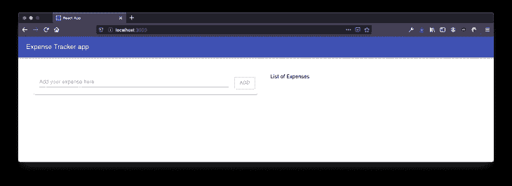


为了确保记录用户输入的值，让我们转到浏览器窗口并进行测试。确保打开开发工具->控制台选项卡。

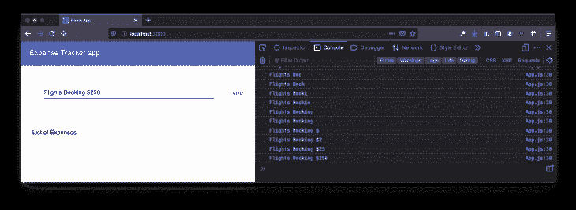

## 通过编写查询创建 API

因为我们的费用列表应用程序将有一些基本的 CRUD 操作，所以让我们创建一个名为`src/api/`的新目录和一个名为`index.js`的新文件。确保从`config/db.js`文件中导入客户端和查询实例:

```
import { client, q } from '../config/db';
export const getAllExpenses;
export const createExpenseItem;
export const deleteExpenseItem;
```

从该文件中导出的所有三个变量都是查询。让我们来定义它们。第一个查询是从数据库集合中读取所有项目。

要查询数据库集合中的费用列表，需要使用`all_expenses`索引。下面的查询将返回一个 ref，可以通过映射得到结果。确保添加 catch，以便在运行查询时出现错误时可以将其注销:

```
export const getAllExpenses = client
  .query(q.Paginate(q.Match(q.Ref('indexes/all_expenses'))))
  .then(response => {
    const expenseRef = response.data;
    const getAllDataQuery = expenseRef.map(ref => {
      return q.Get(ref);
    });
    return client.query(getAllDataQuery).then(data => data);
  })
  .catch(error => console.error('Error: ', error.message));
```

下一个查询是在`expenses`集合中创建一个新项目(*文档*):

```
export const createExpenseItem = name =>
  client
    .query(
      q.Create(q.Collection('expenses'), {
        data: {
          name
        }
      })
    )
    .then(ret => ret)
    .catch(error => console.error('Error: ', error.message));
```

要从数据库集合中删除一个项目，您只需参考您想要删除的`expense` ID:

```
export const deleteExpenseItem = expenseId =>
  client
    .query(q.Delete(q.Ref(q.Collection('expenses'), expenseId)))
    .then(ret => ret)
    .catch(error => console.error('Error: ', error.message));
```

## 向 FaunaDB 添加费用项目

要将费用明细添加到 FaunaDB 集合中，请在`App.js`文件中导入 API 函数`createExpenseItem`:

```
import { createExpenseItem } from './api';
```

然后，修改`handleSubmit`方法，调用 API 函数`createExpenseItem`，并将`expenseDetail`状态变量作为唯一的参数传递。

```
function handleSubmit(event) {
  event.preventDefault();
  createExpenseItem(expenseDetail).then(res => {
    console.log('Expense details added to the database');
  });
  resetInputField();
}
```

现在，当您尝试添加新费用时，数据库集合也将得到更新:


这是最新的数据库集合。FaunaDB 数据库负责为每个文档创建一个唯一的`id`:

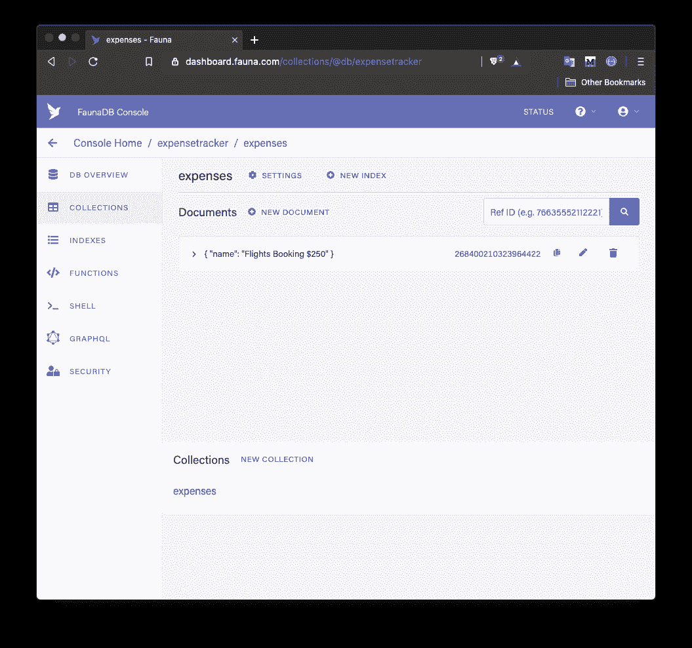

## 显示数据库中的费用项目列表

要显示 FaunaDB 集合的费用列表，您所要做的就是从`useEffect`钩子内的`./api/index.js`文件中调用查询`getAllExpenses`。这是因为当应用程序组件第一次呈现时，它会将数据显示为项目列表(如果数据库中有任何项目的话):

```
import { getAllExpenses, createExpenseItem, deleteExpenseItem } from './api';
```

因为集合中的数据将以列表格式显示，所以让我们导入所有必要的组件来显示项目列表，并更新其他导入语句:

```
import React, { useState, useEffect } from 'react';
import {
  Paper,
  Grid,
  Button,
  Typography,
  TextField,
  makeStyles,
  List,
  ListItem,
  ListItemText,
  ListItemSecondaryAction
} from '@material-ui/core';
```

在 App 组件内部，在所有处理函数之前定义`useEffect`钩子，以在初始渲染时获取数据:

```
function App() {
  // ...
  useEffect(() => {
    getAllExpenses.then(res => {
      setExpenses(res);
      console.log(res);
    });
  }, []);
  // ...
}
```

下面是从数据库中获取的数据数组的结构:

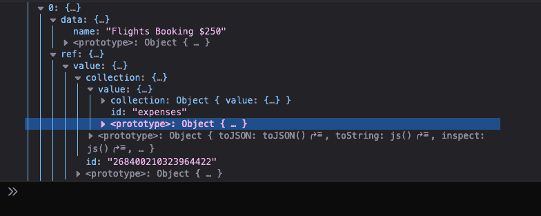

可以看到 ID 是由`ref.id`呈现的。

现在，在输入字段后添加以下 JSX 来显示项目列表。为了在列表中显示这些费用，让我们仅在`expenses`数组不为空时使用 JavaScript `map`函数映射`expenses`数组:

```
<Grid item xs={12} md={5} className={classes.list}>
  <Typography>List of Expenses</Typography>
  {expenses &&
    expenses.map(expense => (
      <div key={expense.ref.id}>
        <Paper style={{ margin: 16 }}>
          <List style={{ overflow: 'scroll' }}>
            <ListItem>
              <ListItemText primary={expense.data.name} />
              <ListItemSecondaryAction>
                <Button
                  color="primary"
                  // onClick={}
                >
                  Delete
                </Button>
              </ListItemSecondaryAction>
            </ListItem>
          </List>
        </Paper>
      </div>
    ))}
</Grid>
```

这是这个步骤之后你将要得到的输出:
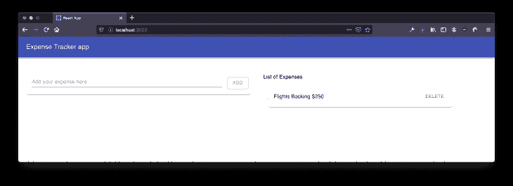

## 从列表中删除费用项目

要删除一个费用项目，让我们添加处理函数`handleDeleteItem`来从数据库和 UI 中删除该项目:

```
function App() {
  // ...
  function handleDeleteItem(event, id) {
    event.preventDefault();
    deleteExpenseItem(id).then(res => res);
    const newExpenses = expenses.filter(expense => expense.ref.id !== id);
    setExpenses(newExpenses);
  }
  // ...
}
```

此外，要触发此方法，请将其添加到`<List>`组件内的`<Button>`:

```
<Button
  color="primary"
  onClick={event => handleDeleteItem(event, expense.ref.id)}>
  Delete
</Button>
```

现在，返回浏览器窗口，尝试删除一个项目。您会注意到数据库集合也更新了:

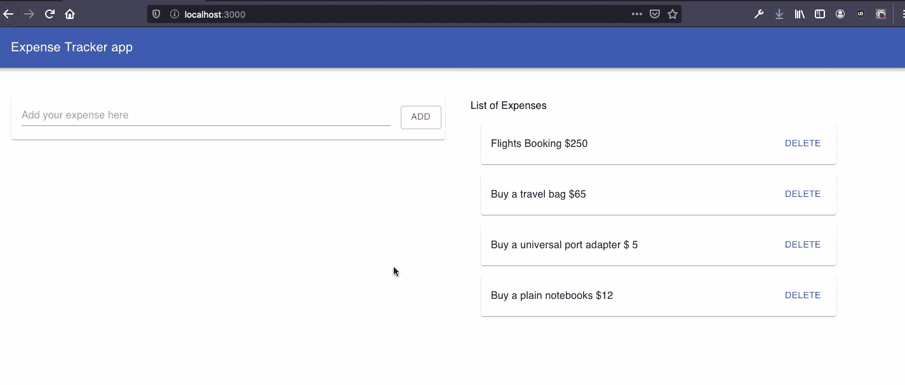

## 结论

*恭喜你！*

我希望通过阅读这篇文章，你能学到一些新的东西。FaunaDB 和 React 的结合对水疗来说很棒。您可以通过使用订阅来扩展此应用程序，以便在数据库实时获得新信息时更新 UI。

👉以下是一些你可能在读完这篇文章后会喜欢的资源列表:

## 使用 LogRocket 消除传统反应错误报告的噪音

[LogRocket](https://lp.logrocket.com/blg/react-signup-issue-free)

是一款 React analytics 解决方案，可保护您免受数百个误报错误警报的影响，只针对少数真正重要的项目。LogRocket 告诉您 React 应用程序中实际影响用户的最具影响力的 bug 和 UX 问题。

[ ](https://lp.logrocket.com/blg/react-signup-general) [  ](https://lp.logrocket.com/blg/react-signup-general) [LogRocket](https://lp.logrocket.com/blg/react-signup-issue-free)

自动聚合客户端错误、反应错误边界、还原状态、缓慢的组件加载时间、JS 异常、前端性能指标和用户交互。然后，LogRocket 使用机器学习来通知您影响大多数用户的最具影响力的问题，并提供您修复它所需的上下文。

关注重要的 React bug—[今天就试试 LogRocket】。](https://lp.logrocket.com/blg/react-signup-issue-free)