# 如何将 PayPal 支付与 React Native 集成

> 原文：<https://blog.logrocket.com/how-to-integrate-paypal-payments-with-react-native/>

在 React 原生应用中添加支付接口的方法并不多。因此，许多移动开发者选择使用 PayPal SDK 构建自己的支付界面。

PayPal 是世界上最早也是最大的互联网支付服务之一。它在 200 个国家的可用性使其成为企业和个人的可靠支付接口。PayPal 有一个巨大的库，可以集成各种编程语言，包括 Python、Java、JavaScript、PHP 等。

在本教程中，我们将向您展示如何在 React Native 中使用 PayPal SDK for JavaScript 通过将 web 和本地技术相互链接来构建支付接口。

我们将从构建基本的 [React Native](https://reactnative.dev) 和 [React](http://reactjs.org) 应用开始。要继续学习，您应该已经熟悉 JavaScript、Node.js 工具，如`npx`和`npm`或`yarn`、模块和基本的 React 组件。你还需要一个 PayPal 开发者账户[来创建支付整合的凭证。](https://developer.paypal.com/)

我们将使用 PayPal 的 web JavaScript 集成 API。我们将在 React 中将支付界面构建为一个单页应用程序，并将其托管在 [Firebase Hosting](https://firebase.google.com/docs/hosting) 上。最后，我们将使用 [React 本地 WebView](https://blog.logrocket.com/the-complete-guide-to-react-native-webview/) 来创建 React 本地应用程序和 React web 应用程序之间的链接。

## React 原生 PayPal 集成:基本设置

首先，我们将创建一个基本的 React 本机应用程序。要创建应用程序，只需输入以下命令:

```
$ npx react-native init myPayPalApp

```

我们还需要创建一个反应应用程序。要创建 web 应用程序，请输入以下命令:

```
npx create-react-app my-paypal-web

```

由于这些应用程序正在初始化，我们将使用我们的 PayPal 开发人员帐户来创建新的应用程序和集成所需的凭据。

前往[developer.paypal.com](https://developer.paypal.com)并登录您的开发者账户。登录后，您将被重定向到您的控制面板，如下所示:

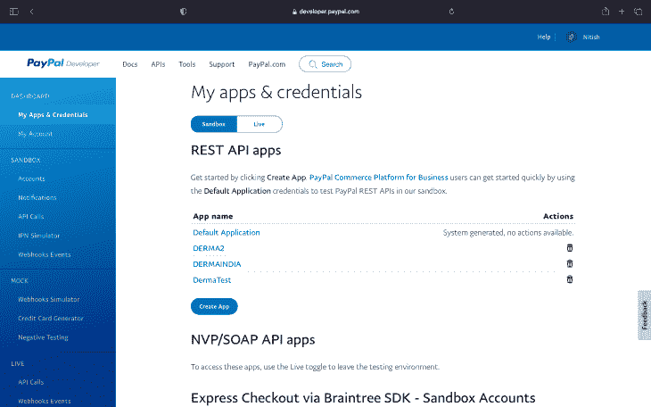

您将看到一个默认的应用程序列表。对于本教程，我们将采取以下步骤来创建一个新的应用程序。

点击**创建应用**按钮。我们正在使用 [PayPal 沙盒](https://developer.paypal.com/docs/api-basics/sandbox/)进行测试，所以你可以根据自己的喜好随意填充。然后点击，**创建 App** 。

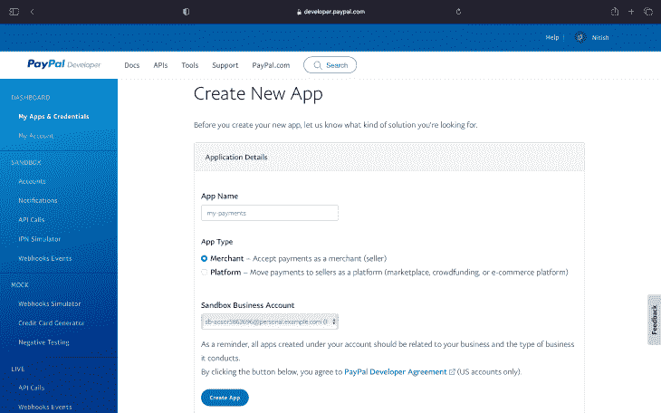

创建应用程序后，您将被重定向到设置和凭据页面。你可以查看你的应用的沙盒帐户电子邮件、客户端 ID 和其他设置。客户端 ID 是我们在本教程中需要的。

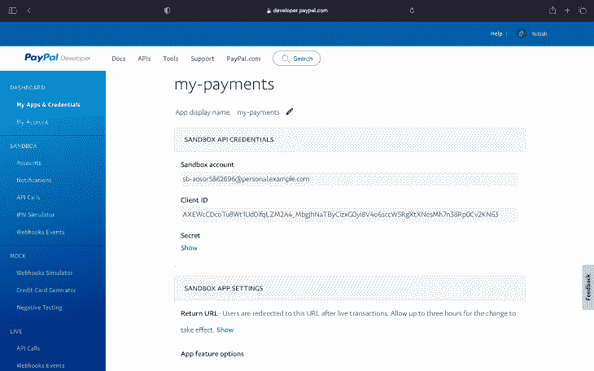

为了测试，我们还需要沙盒客户帐户。要创建客户账户，点击左侧导航菜单中**沙箱**下的**账户**。

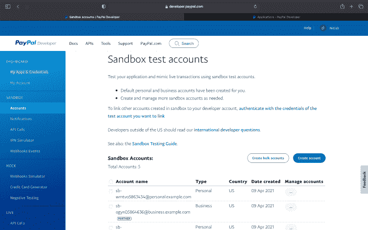

现在点击**创建账户**，然后选择**美国**，点击**创建**。


创建帐户后，要查看用于登录测试支付网关的帐户凭证(即电子邮件和密码)，请将鼠标悬停在新创建帐户旁边的菜单按钮上，然后单击**查看/编辑帐户**。

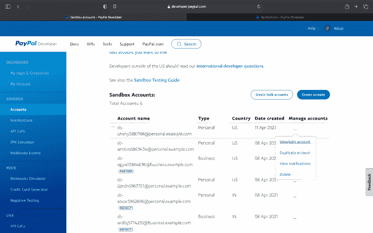

你会落在这样的地方:


您将看到电子邮件 ID 以及系统生成的密码。您可以点击**修改密码**链接修改密码，也可以在支付时使用系统生成的密码登录。

现在我们已经完成了基本的需求，我们可以继续构建支付接口了。

## 构建支付界面

对于支付接口，我们将对上面创建的 React 项目(`my-paypal-web`)进行更改。我们将在网页上添加 PayPal 按钮，并将结果作为我们的回调。

从您刚刚通过 PayPal 创建的新应用程序页面(如上所示)中复制客户 ID，并将其粘贴到项目中的`public/index.html`文件的`<head>`中。

```
<script src="https://www.paypal.com/sdk/js?client-id=[replace-this-with-your-client-id]&currency=USD"></script>

```

您的代码应该如下所示:

```
<!DOCTYPE html>
<html lang="en">
  <head>
    <meta charset="utf-8" />
    <link rel="icon" href="%PUBLIC_URL%/favicon.ico" />
    <meta name="viewport" content="width=device-width, initial-scale=1" />
    <meta name="theme-color" content="#000000" />
    <meta
      name="description"
      content="Web site created using create-react-app"
    />
    <link rel="apple-touch-icon" href="%PUBLIC_URL%/logo192.png" />
    <link rel="manifest" href="%PUBLIC_URL%/manifest.json" />

    <script src="https://www.paypal.com/sdk/js?client-id=AXEWcCDcoTu8Wt1Ud0ifqLZM2A4_MbgJhNaTByCizxG0yi8V4o6sccW5RgXtXNesMh7n38Rp0Cv2KN63&currency=USD"></script>

    <title>React App</title>
  </head>
  <body>
    <noscript>You need to enable JavaScript to run this app.</noscript>
    <div id="root"></div>
  </body>
</html>

```

在用你自己的客户端 ID 添加了这个脚本标签之后，是时候为你的应用程序创建 PayPal 按钮了。

编辑`App.js`文件。首先，创建一个对 PayPal 按钮的引用作为 React 组件:

```
const PayPalButton = window.paypal.Buttons.driver("react", { React, ReactDOM });

```

您可以将它作为您的`App.js`组件中的一个组件。删除父组件的内容，添加`PayPalButton`即可。你的`App.js`应该是这样的:

```
import React from "react";
import ReactDOM from "react-dom";
import "./App.css";
const PayPalButton = window.paypal.Buttons.driver("react", { React, ReactDOM });
function App() {
  function _createOrder(data, actions) {
    return actions.order.create({
      purchase_units: [
        {
          amount: {
            value: "1",
          },
        },
      ],
    });
  }
  return (
    <div className="App">
      <PayPalButton
        createOrder={(data, actions) => _createOrder(data, actions)}
      />
    </div>
  );
}
export default App;

```

转到项目目录，根据您的喜好输入`yarn start`或`npm start`。React 服务器在本地主机上启动并运行后，它会自动在浏览器窗口中打开`localhost:3000`。如果没有，请从您喜欢的浏览器访问`[http://localhost:3000](http://localhost:3000)`。您将看到如下输出:


您可以随意设置页面样式；我们不会在这里讨论这个问题。你可以根据自己的喜好进行修改。

如果您查看代码，您会发现我们已经为`PayPalButton`定义了一个名为`[createOrder](https://developer.paypal.com/docs/business/javascript-sdk/javascript-sdk-reference/#createorder)`的 prop，这使您能够指定请求的内容。本例中主要是金额，但也可以指定币种等。

对于回调，我们将创建函数并将它们作为道具添加到`PayPalButton`中。首先，我们将添加`onApprove`。当 PayPal 批准订单时，将调用此函数。

要创建异步`_onApprove`函数:

```
async function _onApprove(data, actions) {
    let order = await actions.order.capture();
    console.log(order);
    return order;
  }

```

这里，await 关键字用于获取订单的详细信息。然后，我们将`console.log`订单细节。

也给`PayPalButton`道具加上这个功能:

```
<PayPalButton
    createOrder={(data, actions) => _createOrder(data, actions)}
    onApprove={(data, actions) => _onApprove(data, actions)}
/>

```

此外，我们将添加`onCancel`和`onError`属性，以便在用户取消支付或 PayPal 出现错误时获得回调。我们将只创建一个调用函数，并在两个道具上使用它:

```
function _onError(err) {
  console.log(err);
}

```

您的 PayPal 按钮代码应该如下所示:

```
<PayPalButton
    createOrder={(data, actions) => _createOrder(data, actions)}
    onApprove={(data, actions) => _onApprove(data, actions)}
    onCancel={() => _onError("Canceled")}
    onError={(err) => _onError(err)}
/>

```

添加这些内容后，您的`App.js`文件应该看起来像这样:

```
import React from "react";
import ReactDOM from "react-dom";
import "./App.css";
const PayPalButton = window.paypal.Buttons.driver("react", { React, ReactDOM });
function App() {
  function _createOrder(data, actions) {
    return actions.order.create({
      purchase_units: [
        {
          amount: {
            value: "1",
          },
        },
      ],
    });
  }
  async function _onApprove(data, actions) {
    let order = await actions.order.capture();
    console.log(order);
    return order;
  }
  function _onError(err) {
    console.log(err);
  }
  return (
    <div className="App">
      <PayPalButton
        createOrder={(data, actions) => _createOrder(data, actions)}
        onApprove={(data, actions) => _onApprove(data, actions)}
        onCancel={() => _onError("Canceled")}
        onError={(err) => _onError(err)}
      />
    </div>
  );
}
export default App;

```

我们所做的就是从用户那里创建一个$1.00 的支付请求，并记录它以查看结果。

要测试您的支付网关，只需点击 PayPal 按钮，输入用户凭据(即第一步中的电子邮件和密码)，然后进行支付。

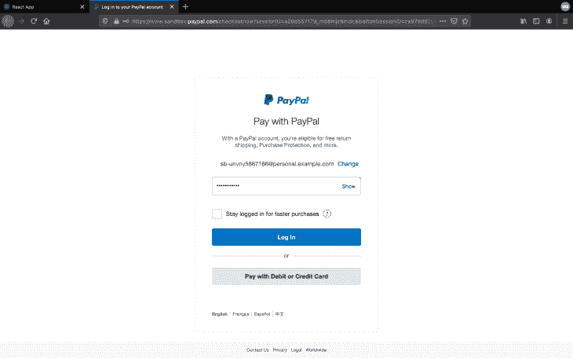

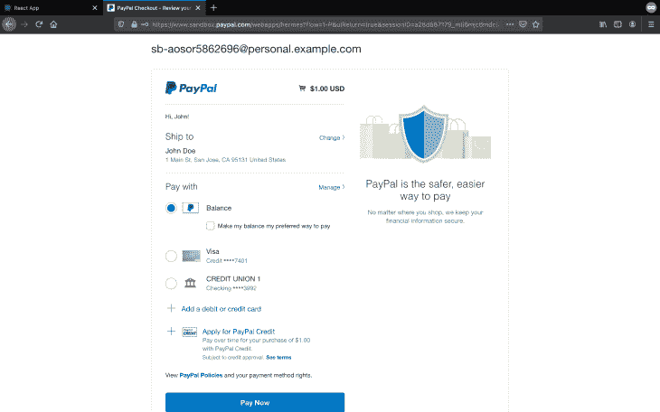

付款后，你将被重定向回你的应用程序页面。右键单击打开开发人员控制台，检查元素，然后转到控制台选项卡。您将看到您刚刚进行的虚拟支付的结果:


## 设置 Firebase 托管

因为我们使用 Firebase 来托管 React web 应用，所以从注册一个 Firebase 帐户开始。

拥有帐户后，点击**添加项目**并设置项目名称:


您可以选择是启用还是禁用分析:


现在你已经创建了你的 Firebase 项目，点击**继续**。

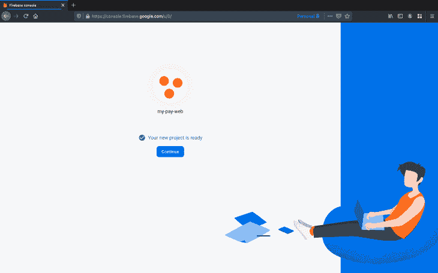

要设置主机，请转到侧边栏中的主机选项卡，然后单击**开始**按钮。

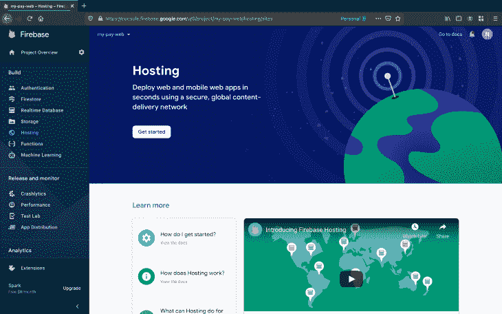

打开终端窗口，在系统上安装`firebase-tools`:

```
$ npm install -g firebase-tools

```

使用您的 firebase 帐户登录，这样您就可以轻松地从终端窗口连接到项目:

```
$ firebase login

```

使用您的帐户授权登录。成功登录后，转到`my-paypal-web`项目目录并输入以下命令:

```
$firebase init

```

使用键盘上的箭头键导航至`Hosting`。按空格键选择，然后按回车键继续。

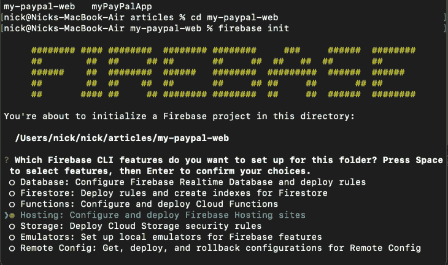

因为我们已经创建了一个项目，所以我们将选择`Use and existing project`:


接下来，从列表中选择我们创建的项目，并点击 return/enter。

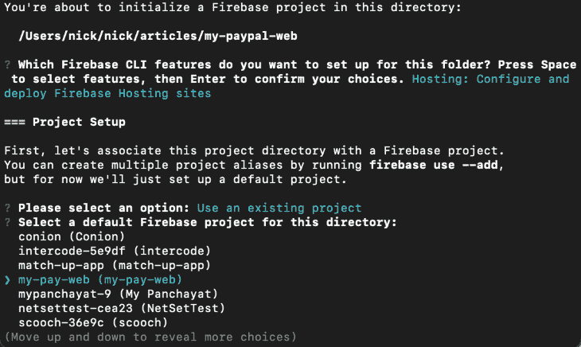

在下一步中，输入以下配置:

```
=== Hosting Setup

Your public directory is the folder (relative to your project directory) that
will contain Hosting assets to be uploaded with firebase deploy. If you
have a build process for your assets, use your build's output directory.

? What do you want to use as your public directory? build
? Configure as a single-page app (rewrite all urls to /index.html)? Yes
? Set up automatic builds and deploys with GitHub? No

```

完成后，您会在底部看到一条成功消息:

```
✔  Wrote build/index.html

i  Writing configuration info to firebase.json...
i  Writing project information to .firebaserc...

✔  Firebase initialization complete!

```

要实时推送您的 web 应用，请输入以下命令:

```
$ yarn build

```

构建完成后，输入:

```
$ firebase deploy

```

您将会看到一个包含托管 URL 的结果:

```
=== Deploying to 'my-pay-web'...

i  deploying hosting
i  hosting[my-pay-web]: beginning deploy...
i  hosting[my-pay-web]: found 18 files in build
✔  hosting[my-pay-web]: file upload complete
i  hosting[my-pay-web]: finalizing version...
✔  hosting[my-pay-web]: version finalized
i  hosting[my-pay-web]: releasing new version...
✔  hosting[my-pay-web]: release complete

✔  Deploy complete!

Project Console: https://console.firebase.google.com/project/my-pay-web/overview
Hosting URL: https://my-pay-web.web.app

```

你可以复制主机网址并粘贴到你喜欢的浏览器中。这是我的样子:

```
https://my-pay-web.web.app

```

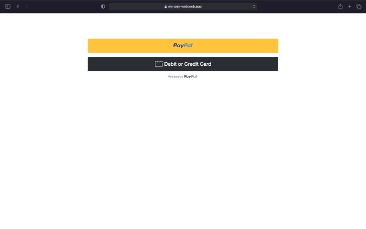

## 在 React Native 中构建基本 WebView

如果你以前有与 React Native 一起工作的经验[，那是一个加分。如果没有，官方文档会提供一个](https://blog.logrocket.com/react-native-web-complete-tutorial/)[指南来设置你的环境](https://reactnative.dev/docs/environment-setup)和安装应用程序。如果您还没有这样做，只需转到项目目录并使用以下命令安装 React Native 的 WebView 模块:

```
yarn add react-native-webview

```

接下来，使用 USB 连接您的设备，并输入以下命令:

```
npx react-native run-android

```

在您的设备或模拟器上成功安装应用程序后，打开`App.js`文件。删除默认的额外代码并导入 WebView 模块:

```
import { WebView } from 'react-native-webview';

```

为了从 React Native 初始化支付网关，我们将创建一个按钮，以模态方式显示 web 视图，并从 web view 获得响应。我们还将创建一个`useState()`挂钩来显示和隐藏 WebView。

```
const [showGateway, setShowGateway] = useState(false);

```

按钮:

```
<View style={styles.btnCon}>
  <TouchableOpacity
    style={styles.btn}
    onPress={() => setShowGateway(true)}>
      <Text style={styles.btnTxt}>Pay Using PayPal</Text>
  </TouchableOpacity>
</View>

```

按钮样式:

```
  btnCon: {
    height: 45,
    width: '70%',
    elevation: 1,
    backgroundColor: '#00457C',
    borderRadius: 3,
  },
  btn: {
    flex: 1,
    alignItems: 'center',
    justifyContent: 'center',
  },
  btnTxt: {
    color: '#fff',
    fontSize: 18,
  },

```

按钮输出:


现在，从`react-native`导入`Modal`组件，并创建一个显示`google.com`的基本 web 视图。

模式和网络视图:

```
{showGateway ? (
        <Modal
          visible={showGateway}
          onDismiss={() => setShowGateway(false)}
          onRequestClose={() => setShowGateway(false)}
          animationType={"fade"}
          transparent>
          <View style={styles.webViewCon}>
            <View style={styles.wbHead}>
              <TouchableOpacity
                style={{padding: 13}}
                onPress={() => setShowGateway(false)}>
                <Feather name={'x'} size={24} />
              </TouchableOpacity>
              <Text
                style={{
                  flex: 1,
                  textAlign: 'center',
                  fontSize: 16,
                  fontWeight: 'bold',
                  color: '#00457C',
                }}>
                PayPal GateWay
              </Text>
              <View style={{padding: 13}}>
                <ActivityIndicator size={24} color={'#00457C'} />
              </View>
            </View>
            <WebView
              source={{uri: 'https://www.google.com'}}
              style={{flex: 1}}
            />
          </View>
        </Modal>
      ) : null}

```

我们使用来自`[react-native-vector-icons](https://github.com/oblador/react-native-vector-icons)`的`<Feather />`和来自`react-native`的`ActivityIndicator`。

模式和 WebView 输出:

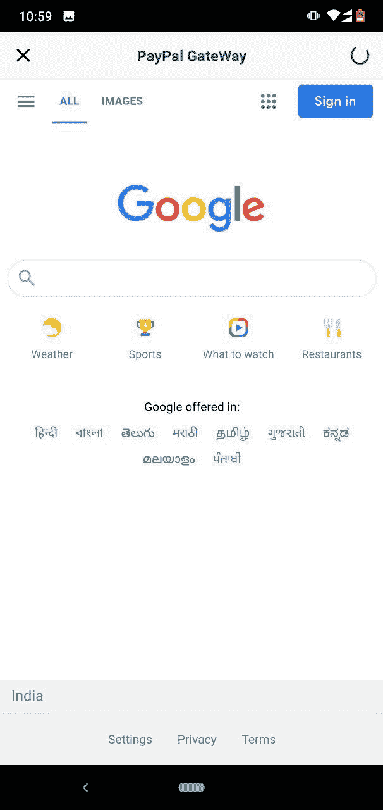

现在，我们将在页面加载后显示/隐藏`ActivityIndicator`以从 WebView 获得回调。如果页面已经加载，我们将添加以下挂钩和道具:

```
const [prog, setProg] = useState(false);
const [progClr, setProgClr] = useState('#000');

```

WebView 的道具:

```
onLoadStart={() => {
  setProg(true);
  setProgClr('#000');
}}
onLoadProgress={() => {
  setProg(true);
  setProgClr('#00457C');
}}
onLoadEnd={() => {
  setProg(false);
}}
onLoad={() => {
  setProg(false);
}}

```

仅仅为了额外的 UX，这段代码根据页面的进度改变了`ActivityIndicator`的颜色。

您的`App.js`文件现在应该看起来像这样:

```
import React, {useState} from 'react';
import {
  SafeAreaView,
  StyleSheet,
  Text,
  View,
  TouchableOpacity,
  Modal,
  ActivityIndicator,
} from 'react-native';
import {WebView} from 'react-native-webview';
import Feather from 'react-native-vector-icons/Feather';

const App = () => {
  const [showGateway, setShowGateway] = useState(false);
  const [prog, setProg] = useState(false);
  const [progClr, setProgClr] = useState('#000');
  return (
    <SafeAreaView style={{flex: 1}}>
      <View style={styles.container}>
        <View style={styles.btnCon}>
          <TouchableOpacity
            style={styles.btn}
            onPress={() => setShowGateway(true)}>
            <Text style={styles.btnTxt}>Pay Using PayPal</Text>
          </TouchableOpacity>
        </View>
      </View>
      {showGateway ? (
        <Modal
          visible={showGateway}
          onDismiss={() => setShowGateway(false)}
          onRequestClose={() => setShowGateway(false)}
          animationType={"fade"}
          transparent>
          <View style={styles.webViewCon}>
            <View style={styles.wbHead}>
              <TouchableOpacity
                style={{padding: 13}}
                onPress={() => setShowGateway(false)}>
                <Feather name={'x'} size={24} />
              </TouchableOpacity>
              <Text
                style={{
                  flex: 1,
                  textAlign: 'center',
                  fontSize: 16,
                  fontWeight: 'bold',
                  color: '#00457C',
                }}>
                PayPal GateWay
              </Text>
              <View style={{padding: 13, opacity: prog ? 1 : 0}}>
                <ActivityIndicator size={24} color={progClr} />
              </View>
            </View>
            <WebView
              source={{uri: 'https://www.google.com'}}
              style={{flex: 1}}
              onLoadStart={() => {
                setProg(true);
                setProgClr('#000');
              }}
              onLoadProgress={() => {
                setProg(true);
                setProgClr('#00457C');
              }}
              onLoadEnd={() => {
                setProg(false);
              }}
              onLoad={() => {
                setProg(false);
              }}
            />
          </View>
        </Modal>
      ) : null}
    </SafeAreaView>
  );
};
const styles = StyleSheet.create({
  container: {
    flex: 1,
    alignItems: 'center',
    justifyContent: 'center',
    backgroundColor: '#fff',
  },
  btnCon: {
    height: 45,
    width: '70%',
    elevation: 1,
    backgroundColor: '#00457C',
    borderRadius: 3,
  },
  btn: {
    flex: 1,
    alignItems: 'center',
    justifyContent: 'center',
  },
  btnTxt: {
    color: '#fff',
    fontSize: 18,
  },
  webViewCon: {
    position: 'absolute',
    top: 0,
    left: 0,
    right: 0,
    bottom: 0,
  },
  wbHead: {
    flexDirection: 'row',
    alignItems: 'center',
    backgroundColor: '#f9f9f9',
    zIndex: 25,
    elevation: 2,
  },
});
export default App;

```

## 使用 WebView 将 PayPal 界面连接到 React 本地应用程序

为了从 WebView 页面接收数据到 React 本地应用程序，我们将使用`onMessage` prop。我们还需要向我们的 web 应用程序添加一些代码来发送所需的数据。`window.ReactNativeWebView.postMessage`方法用于将数据从 WebView 发送到我们的 React 本地应用程序。

对`_onApprove`和`_onError`函数进行必要的修改后，您的代码应该如下所示:

```
async function _onApprove(data, actions) {
    let order = await actions.order.capture();
    console.log(order);
    window.ReactNativeWebView &&
      window.ReactNativeWebView.postMessage(JSON.stringify(order));
    return order;
}
function _onError(err) {
    console.log(err);
    let errObj = {
      err: err,
      status: "FAILED",
    };
    window.ReactNativeWebView &&
      window.ReactNativeWebView.postMessage(JSON.stringify(errObj));
}

```

我们使用`JSON.stringify`是因为 postMessage 只能接受字符串参数。

记得构建 web 应用程序并将其部署到 Firebase:

```
$ yarn build
$ firebase deploy

```

为了获得 React 本机端的数据，我们将使用`onMessage`。创建以下函数，并将其添加到`onMessage`属性中:

```
function onMessage(e) {
    let data = e.nativeEvent.data;
    setShowGateway(false);
    console.log(data);
  }

```

添加`onMessage`道具，并将源`uri`设置为你的 web app 的 URI:

```
<WebView
  source={{uri: 'https://www.google.com'}}
  onMessage={onMessage}
  ...
/>

```

现在是测试支付网关的时候了。此时，我们正在 React 本机应用程序中记录来自`postMessage`的结果。

点击**使用 PayPal 支付**显示支付页面。输入您的凭据并付款:

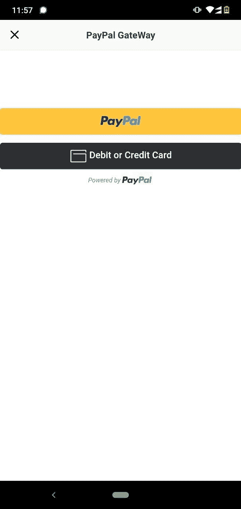

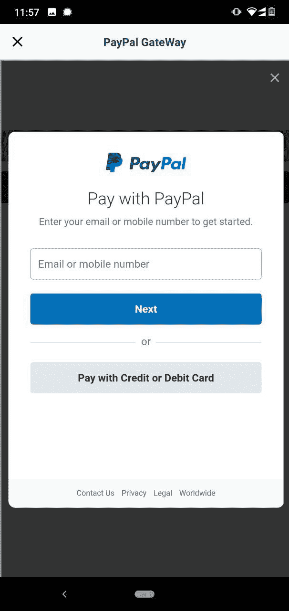
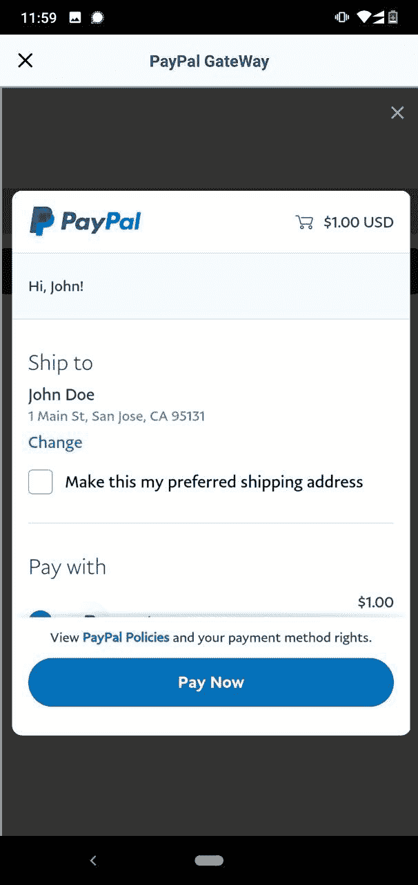

付款成功(或不成功)后，您将在控制台中看到打印的结果:


您可以通过在`onMessage`功能中添加提醒来提醒用户刚刚支付的状态:

```
function onMessage(e) {
    ...
    let payment = JSON.parse(data);
    if (payment.status === 'COMPLETED') {
      alert('PAYMENT MADE SUCCESSFULLY!');
    } else {
      alert('PAYMENT FAILED. PLEASE TRY AGAIN.');
    }
}

```

以下是输出结果:

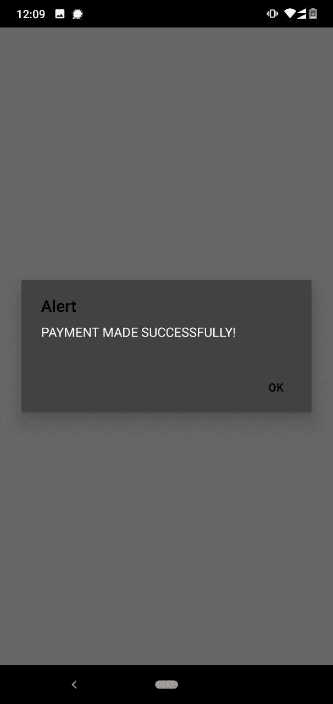

完整代码如下。

`App.js`(反应`my-paypal-web`):

```
import React from "react";
import ReactDOM from "react-dom";
import "./App.css";
const PayPalButton = window.paypal.Buttons.driver("react", { React, ReactDOM });
function App() {
  function _createOrder(data, actions) {
    return actions.order.create({
      purchase_units: [
        {
          amount: {
            value: "1",
          },
        },
      ],
    });
  }
  async function _onApprove(data, actions) {
    let order = await actions.order.capture();
    console.log(order);
    window.ReactNativeWebView &&
      window.ReactNativeWebView.postMessage(JSON.stringify(order));
    return order;
  }
  function _onError(err) {
    console.log(err);
    let errObj = {
      err: err,
      status: "FAILED",
    };
    window.ReactNativeWebView &&
      window.ReactNativeWebView.postMessage(JSON.stringify(errObj));
  }
  return (
    <div className="App">
      <PayPalButton
        createOrder={(data, actions) => _createOrder(data, actions)}
        onApprove={(data, actions) => _onApprove(data, actions)}
        onCancel={() => _onError("CANCELED")}
        onError={(err) => _onError("ERROE")}
      />
    </div>
  );
}
export default App;

```

`App.js`(反应原生`myPayPalApp`):

```
import React, {useState} from 'react';
import {
  SafeAreaView,
  StyleSheet,
  Text,
  View,
  TouchableOpacity,
  Modal,
  ActivityIndicator,
} from 'react-native';
import {WebView} from 'react-native-webview';
import Feather from 'react-native-vector-icons/Feather';
const App = () => {
  const [showGateway, setShowGateway] = useState(false);
  const [prog, setProg] = useState(false);
  const [progClr, setProgClr] = useState('#000');
  function onMessage(e) {
    let data = e.nativeEvent.data;
    setShowGateway(false);
    console.log(data);
    let payment = JSON.parse(data);
    if (payment.status === 'COMPLETED') {
      alert('PAYMENT MADE SUCCESSFULLY!');
    } else {
      alert('PAYMENT FAILED. PLEASE TRY AGAIN.');
    }
  }
  return (
    <SafeAreaView style={{flex: 1}}>
      <View style={styles.container}>
        <View style={styles.btnCon}>
          <TouchableOpacity
            style={styles.btn}
            onPress={() => setShowGateway(true)}>
            <Text style={styles.btnTxt}>Pay Using PayPal</Text>
          </TouchableOpacity>
        </View>
      </View>
      {showGateway ? (
        <Modal
          visible={showGateway}
          onDismiss={() => setShowGateway(false)}
          onRequestClose={() => setShowGateway(false)}
          animationType={'fade'}
          transparent>
          <View style={styles.webViewCon}>
            <View style={styles.wbHead}>
              <TouchableOpacity
                style={{padding: 13}}
                onPress={() => setShowGateway(false)}>
                <Feather name={'x'} size={24} />
              </TouchableOpacity>
              <Text
                style={{
                  flex: 1,
                  textAlign: 'center',
                  fontSize: 16,
                  fontWeight: 'bold',
                  color: '#00457C',
                }}>
                PayPal GateWay
              </Text>
              <View style={{padding: 13, opacity: prog ? 1 : 0}}>
                <ActivityIndicator size={24} color={progClr} />
              </View>
            </View>
            <WebView
              source={{uri: 'https://my-pay-web.web.app/'}}
              style={{flex: 1}}
              onLoadStart={() => {
                setProg(true);
                setProgClr('#000');
              }}
              onLoadProgress={() => {
                setProg(true);
                setProgClr('#00457C');
              }}
              onLoadEnd={() => {
                setProg(false);
              }}
              onLoad={() => {
                setProg(false);
              }}
              onMessage={onMessage}
            />
          </View>
        </Modal>
      ) : null}
    </SafeAreaView>
  );
};
const styles = StyleSheet.create({
  container: {
    flex: 1,
    alignItems: 'center',
    justifyContent: 'center',
    backgroundColor: '#fff',
  },
  btnCon: {
    height: 45,
    width: '70%',
    elevation: 1,
    backgroundColor: '#00457C',
    borderRadius: 3,
  },
  btn: {
    flex: 1,
    alignItems: 'center',
    justifyContent: 'center',
  },
  btnTxt: {
    color: '#fff',
    fontSize: 18,
  },
  webViewCon: {
    position: 'absolute',
    top: 0,
    left: 0,
    right: 0,
    bottom: 0,
  },
  wbHead: {
    flexDirection: 'row',
    alignItems: 'center',
    backgroundColor: '#f9f9f9',
    zIndex: 25,
    elevation: 2,
  },
});
export default App;

```

## 结论

如果你已经做到了这一步，那么恭喜你——你已经成功地使用 PayPal 为 React Native 设置了测试支付网关。虽然上面的代码对于基本的支付系统应该足够了，但是您可以根据自己的需要对其进行更改。也可以参考官方 [PayPal 指南](https://developer.paypal.com/docs/business/javascript-sdk/javascript-sdk-reference/)进一步参考。

## [LogRocket](https://lp.logrocket.com/blg/react-native-signup) :即时重现 React 原生应用中的问题。

[](https://lp.logrocket.com/blg/react-native-signup)

[LogRocket](https://lp.logrocket.com/blg/react-native-signup) 是一款 React 原生监控解决方案，可帮助您即时重现问题、确定 bug 的优先级并了解 React 原生应用的性能。

LogRocket 还可以向你展示用户是如何与你的应用程序互动的，从而帮助你提高转化率和产品使用率。LogRocket 的产品分析功能揭示了用户不完成特定流程或不采用新功能的原因。

开始主动监控您的 React 原生应用— [免费试用 LogRocket】。](https://lp.logrocket.com/blg/react-native-signup)