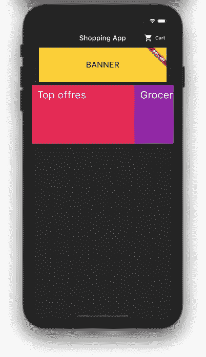
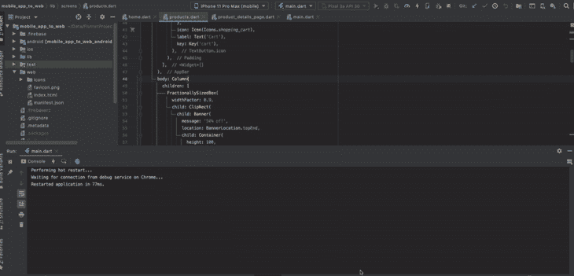
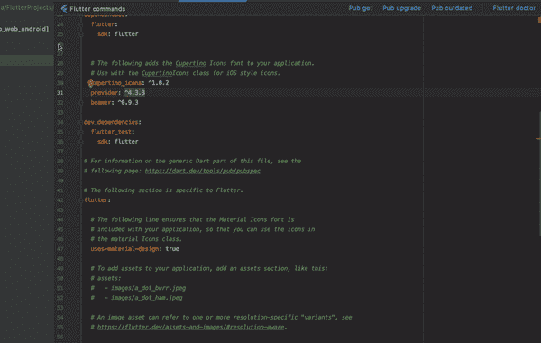
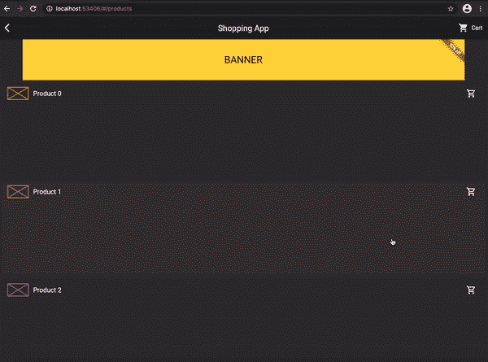
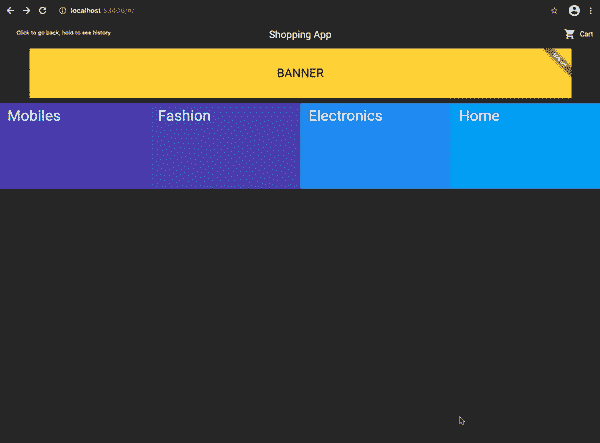
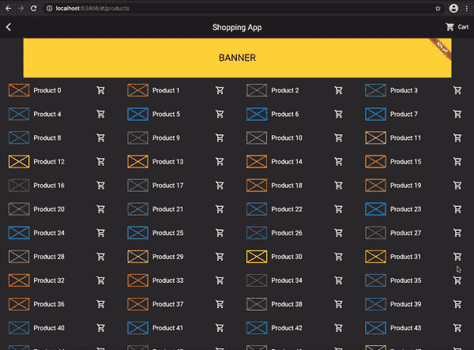
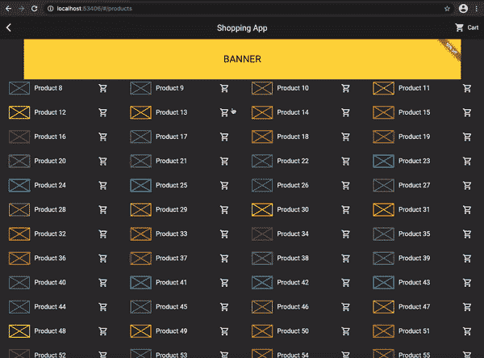
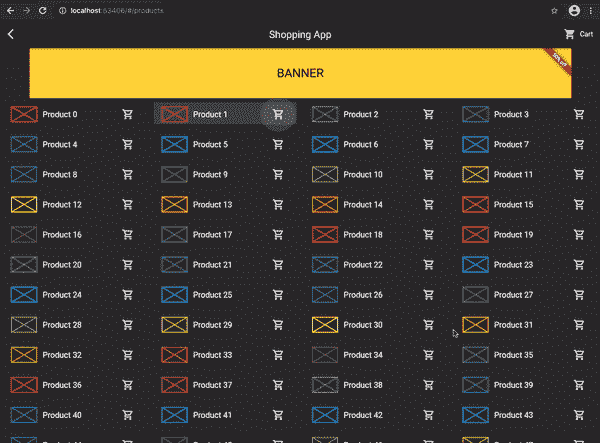
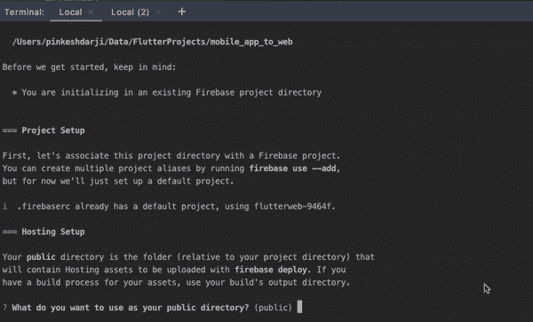

# 将 Flutter 移动应用程序迁移到 web:示例教程

> 原文：<https://blog.logrocket.com/how-to-migrate-a-flutter-mobile-app-to-the-web/>

一家公司需要雇佣多名工程师才能在移动平台和网络上发布应用的日子已经一去不复返了。这种方法总是导致版本之间微妙的不一致，以及与管理多个代码库相关的其他挑战。

有了 [Flutter 2.0](https://blog.logrocket.com/whats-new-in-flutter-2-0/) ，你可以将你现有的移动应用程序作为一个 web 应用程序来发布，只需对现有的代码做很少或不做任何更改。在撰写本文时，web 的稳定版本适合开发:

*   **单个**–**页面应用(spa)**在单个页面上运行，无需加载新页面即可动态更新
*   **渐进式网络应用(PWAs)** ，可作为桌面应用运行

在本教程中，我们将向您展示如何将您的 [Flutter 移动应用](https://blog.logrocket.com/flutter-vs-react-native/)转换为 web 应用，并将其部署在 [Firebase 主机](https://firebase.google.com/docs/hosting)上。我们将讨论以下内容:

我们将构建一个示例 Flutter 应用程序，显示购物类别列表。单击一个类别会打开可用产品列表。用户可以在购物车中添加和删除产品。我们的目标是用相同的代码将这个简单的应用程序发布到 web 上。

成品看起来会像这样:



## 为你的 Flutter 应用程序创建一个网络目录

如果你想把一个 Flutter 移动应用程序转换成一个 web 应用程序，第一步是创建一个 web 目录:

```
flutter create .

```

上面的命令应该在 Android 和 iOS 文件夹旁边的项目根目录下创建 web 目录。

现在是时候在网络上运行相同的应用程序了:



要在浏览器中运行应用程序，如果你使用的是 Mac 或 Linux 系统，请选择 **Chrome** ，如果你使用的是 Windows 系统，请选择 **Edge** 。然后，点击**运行**按钮。

太神奇了！现在，我们的 Flutter 应用程序已经可以在网络上运行了，它以前是针对移动设备的。但是仅仅因为它在运行，并不意味着它会像在移动设备上一样完美。让我们看看我们还需要采取哪些步骤来使网页版应用程序无缝运行。

## 验证插件支持

这是非常重要的一步。在我们继续之前，我们需要确保所有支持移动应用的包和插件都有一个可用的 web 版本。

要检查给定包的 web 版本是否可用，请前往 [pub.dev](https://pub.dev/) ，在搜索栏中粘贴包名，并检查它在搜索结果中是否有 **web** 标签。



在我们的示例 Flutter 应用程序中，我们使用 [provider](https://pub.dev/packages/provider) 进行状态管理，这在 web 上是可用的。如果 web 上没有可用的库，您可以尝试找到该库的替代库并重构代码。如果你倾向于把事情掌握在自己手中，你也可以为图书馆做贡献，并引入对网络的支持。

## 让应用程序响应迅速

网络浏览器有很大的空间。既然我们的购物应用程序也将在 web 浏览器上运行，我们需要重新考虑 UI 在浏览器中呈现时的外观。该应用程序应该能够尊重不同的屏幕尺寸，并提供丰富的体验不同的用户界面/UX。

让我们看看没有任何响应 UI 的购物应用程序是什么样子的:



它只是看起来像一个更大的屏幕上的移动 UI。产品名称和购物车图标之间有一个难看的缺口，这使得用户体验很差。让我们看看如何适应这种巨大的差距，并开发一个响应迅速的用户界面:

```
//Before
GridView.builder(
  itemCount: 100,
  itemBuilder: (context, index) => ItemTile(index),
  gridDelegate: SliverGridDelegateWithFixedCrossAxisCount(
    crossAxisCount: 1,
    childAspectRatio: 5,
  ),
)
//After
LayoutBuilder(builder: (context, constraints) {
  return GridView.builder(
    itemCount: 100,
    itemBuilder: (context, index) => ItemTile(index),
    gridDelegate: SliverGridDelegateWithFixedCrossAxisCount(
      crossAxisCount: constraints.maxWidth > 700 ? 4 : 1,
      childAspectRatio: 5,
    ),
  );
})

```

每当父窗口小部件通过不同的布局约束时，就会调用 [LayoutBuilder](https://api.flutter.dev/flutter/widgets/LayoutBuilder-class.html) 窗口小部件的 x builder 函数。这意味着每当屏幕分辨率改变时，它提供`constraints`，它决定宽度并相应地提供各种 UI。

对于我们的购物应用程序，如果当前宽度大于 700，我们将在`GridView.builder`中呈现 4 列。结果将如下所示:


## 处理导航

我们的应用程序的移动和网络版本之间的主要区别是用户在应用程序中导航的方式。

移动应用程序有一些固定的流程，这意味着要打开任何屏幕，用户都必须遵循预定义的路径。例如，要打开产品详细信息页面，用户必须首先打开产品列表。但是当它在 web 上运行时，用户可以通过修改 URL 直接跳转到产品详情页面。除了在应用程序中导航，用户还可以在浏览器的地址栏中导航。

那么，我们如何为我们的购物应用程序处理这个问题呢？为此，我们可以使用[光束器](https://pub.dev/packages/beamer)组件。beamer 使用了 [Navigator 2.0 API](https://flutter.dev/docs/release/breaking-changes/route-navigator-refactoring) 的强大功能，并为您实现了所有底层逻辑。

```
class HomeLocation extends BeamLocation {
  @override
  List<String> get pathBlueprints => ['/'];

  @override
  List<BeamPage> pagesBuilder(BuildContext context) => [
        BeamPage(
          key: ValueKey('home'),
          child: HomePage(),
        ),
      ];
}

```

上面的代码只是在应用程序启动时打开`HomePage()`。

```
class ProductsLocation extends BeamLocation {
  @override
  List<String> get pathBlueprints => ['/products/:productId'];

  @override
  List<BeamPage> pagesBuilder(BuildContext context) => [
        ...HomeLocation().pagesBuilder(context),
        if (pathSegments.contains('products'))
          BeamPage(
            key: ValueKey('products-${queryParameters['title'] ?? ''}'),
            child: ProductsPage(),
          ),
        if (pathParameters.containsKey('productId'))
          BeamPage(
            key: ValueKey('product-${pathParameters['productId']}'),
            child: ProductDetailsPage(
              productId: pathParameters['productId'],
            ),
          ),
      ];
}

```

如果用户尝试`/products`，将打开所有产品的列表。如果这个链接有一个产品 ID——类似于`/products/2`——它将打开给定产品 ID 的产品详细信息页面:



## 支持特定于浏览器和桌面的交互

既然应用程序在网络浏览器中运行得非常好，我们应该启用一些特定于浏览器或桌面的交互来提供更好的体验。

**滚动条**

将整个产品列表包裹在 [`Scrollbar`](https://api.flutter.dev/flutter/material/Scrollbar-class.html) 中，会在产品列表旁边显示滚动条，这样用户就可以知道滚动的位置。

```
LayoutBuilder(builder: (context, constraints) {
  return Scrollbar(
    child: GridView.builder(
      itemCount: 100,
      itemBuilder: (context, index) => ItemTile(index),
      gridDelegate: SliverGridDelegateWithFixedCrossAxisCount(
        crossAxisCount: constraints.maxWidth > 700 ? 4 : 1,
        childAspectRatio: 5,
      ),
    ),
  );
})

```



**鼠标**

将产品列表平铺在`[MouseRegion](https://api.flutter.dev/flutter/widgets/MouseRegion-class.html)`内会在您将鼠标悬停在产品上时改变光标。

```
MouseRegion(
  cursor: SystemMouseCursors.text,
  child: ListTile(
    ...
  ),
)

```



**键盘快捷键**

键盘快捷键在购物应用中不是很有用。但是为了演示它们是如何工作的，让我们假设按下 ALT 键会将一个产品放到用户的购物车中。

```
Shortcuts(
  shortcuts: <LogicalKeySet, Intent>{
    LogicalKeySet(LogicalKeyboardKey.alt): const AddProduct(),
  },
  child: Actions(
    actions: <Type, Action<Intent>>{
      AddProduct: CallbackAction<AddProduct>(
          onInvoke: (AddProduct intent) => setState(() {
                addRemoveProduct(cartList, context);
              })),
    },
    child: Focus(
      autofocus: true,
      child: MouseRegion(
        cursor: SystemMouseCursors.text,
        child: ListTile(
          ...
        ),
      ),
    ),
  ),
)

```



## 将你的 Flutter 应用程序部署到网络上

现在，我们已经准备好使用 Firebase 托管服务发布我们新转换的购物应用程序。

查看[官方 Firebase 托管文档](https://firebase.google.com/docs/hosting/quickstart)了解详细的托管说明。下面是如何用 Firebase 主机部署你的 Flutter 应用程序的快速概述。

首先，初始化项目的 Firebase 托管:

```
firebase init hosting

```



接下来，使用以下命令部署您的应用程序:

```
firebase deploy --only hosting

```

你可以点击查看我们的 Flutter 移动应用[的网页版。用于这个例子的完整代码可以在](https://flutterweb-9464f.web.app/#/) [GitHub](https://github.com/pinkeshdarji/mobile_app_to_web) 上获得。

## [LogRocket](https://logrocket.com/signup/) :全面了解您的网络应用

[](https://logrocket.com/signup/)

LogRocket 是一个前端应用程序监控解决方案，可以让您回放问题，就像问题发生在您自己的浏览器中一样。LogRocket 不需要猜测错误发生的原因，也不需要向用户询问截图和日志转储，而是让您重放会话以快速了解哪里出错了。它可以与任何应用程序完美配合，不管是什么框架，并且有插件可以记录来自 Redux、Vuex 和@ngrx/store 的额外上下文。

除了记录 Redux 操作和状态，LogRocket 还记录控制台日志、JavaScript 错误、堆栈跟踪、带有头+正文的网络请求/响应、浏览器元数据和自定义日志。它还使用 DOM 来记录页面上的 HTML 和 CSS，甚至为最复杂的单页面应用程序重新创建像素级完美视频。

[免费试用](https://logrocket.com/signup/)。