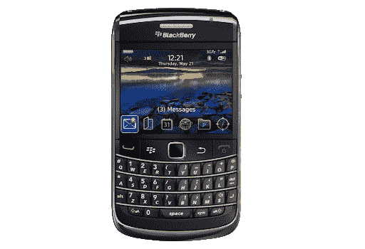
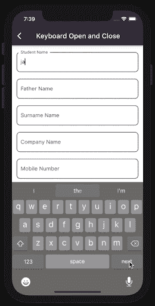

# 如何在 Flutter - LogRocket 博客中打开或关闭键盘

> 原文：<https://blog.logrocket.com/how-to-open-dismiss-keyboard-flutter/>

你想念黑莓手机吗？我知道。他们有一个完整的 QWERTY 键盘，打字很容易。我希望它们能随着时间和操作系统一起进化。我们将会看到它的物理键盘和触摸屏设备的一些伟大创新。



相反，我们程序员和设计师面临着一个特殊的现代挑战:软键盘。手机应用开发者必须记住，手机键盘总是隐藏在视线之外。

因此，UI 设计者必须更加小心。当键盘出现时，在向特定小部件输入数据时，它不应该遮挡 UI 的其他部分。

## 合上键盘:按钮、敲击、滑动？

然后就是屏幕尺寸多样的各种设备。现在考虑两种类型的设备:iOS 和 Android。Android 智能手机包含用于导航软件的物理或软按钮。在 iOS 设备上，关闭或切换应用程序目前是通过从底部到顶部的单次滑动来完成的。

当谈到这两款设备上的键盘管理时，点击一个允许数据输入的小工具，从屏幕底部打开键盘。现在真正的问题是如何在不使用时合上键盘，或者让用户对键盘的开合有足够的控制。

安卓设备有解决方案；按下物理后退按钮(在某些手机上提供)或软键后退按钮，它会关闭键盘。但是 iOS 设备呢？在 iPhones 上，如果用户从底部向顶部滑动，它将完全关闭应用程序或在应用程序之间切换。在 iPads 上，右下角有一个按钮，用于最小化键盘或关闭键盘。

## 用颤动打开和关闭键盘

作为一个多平台框架，我们如何解决打开和关闭键盘的问题，以与所有设备上的应用程序保持一致？

根据我的研究和经验，我为以下客户提供此解决方案:

1.  在 Android 和 iOS 设备上打开和关闭键盘
2.  方便地移动到下一个输入窗口小部件，而无需关闭键盘

一些提供文本和数字输入的 Flutter 小部件有:

1.  textfield . textfield
2.  TextFormField
3.  CupertinoSearchTextField
4.  CupertinoTextField

### 轻按即可调用或取消键盘

程序员使用这些小部件最常见的屏幕是登录和注册屏幕。如果应用程序需要用用户数据填充表单，屏幕上可能会有更多的文本字段。有些可能只需要文本输入，有些只需要数字或两者都需要。点击这些小工具将会打开键盘。

如果你创建了类似于上面屏幕的东西，你必须记住，当键盘打开时，它会将小部件向上推，导致溢出错误。为了解决这个问题，您需要将小部件包装在一个 SingleChildScrollView 或一个 ListView 中，这取决于您的 UI。

当您用 SingleChildScrollView 或 ListView 包装小部件时，这两个小部件都有一个名为`keyboardDismissBehavior`的属性。它表示 ScrollView 应该如何关闭屏幕键盘。

此外，它有两种类型的拖动行为:一种是手动的，由用户决定关闭键盘，另一种是`onDrag`的，当用户开始在屏幕上拖动时，键盘被关闭。


```
SingleChildScrollView(
 keyboardDismissBehavior: ScrollViewKeyboardDismissBehavior.onDrag,
 child: Padding(
   padding: const EdgeInsets.symmetric(
       vertical: Sizes.dimen_20, horizontal: Sizes.dimen_14),
   child: Column(
     children: [
       TextFormField(
         controller: _studentNameController,
         keyboardType: TextInputType.name,
         textCapitalization: TextCapitalization.words,
         textInputAction: TextInputAction.next,
         decoration:
   kTextInputDecoration.copyWith(labelText:'Student Name'), ),
```

另一种消除键盘的方法是包装整个视图，这意味着最常用的父窗口小部件是 Scaffold 窗口小部件或带有手势检测器的 SafeArea。在它的`onTap`属性中，您必须传递一个`unfocus`函数，该函数将焦点从当前节点移开，并将其主要焦点移动到另一个节点。

为了更好地理解键盘何时打开，主要关注点在键盘上。当您单击屏幕上的任何其他地方时，手势检测器会将焦点从键盘上移开，并将其主要焦点转移到视图上，最终关闭键盘。


```
@override
Widget build(BuildContext context) {
 return GestureDetector(
   //onTap: () => FocusScope.of(context).unfocus(),
   /// > flutter 2.0
   onTap: () => FocusManager.instance.primaryFocus?.unfocus(),
   child: Scaffold(
     resizeToAvoidBottomInset: true,
     appBar: AppBar(
       title: const Text('Keyboard Open and Close'),     ),
     body: ListView(
       padding: const EdgeInsets.all(14.0),
       shrinkWrap: true,
       keyboardDismissBehavior: ScrollViewKeyboardDismissBehavior.onDrag,
       children: [
         TextFormField(
           controller: _studentNameController,
           keyboardType: TextInputType.name,
           textCapitalization: TextCapitalization.words,
           textInputAction: TextInputAction.next,
           decoration:
     kTextInputDecoration.copyWith(labelText: 'Student Name'),),
```

您可能想知道在整个视图上使用手势检测器是否明智。根据文档，无论视图是否请求焦点，都可以安全地调用。

但是，如果它有焦点或主焦点，则什么都不会发生。为了充分理解这个动作，当用户单击文本字段小部件旁边的屏幕上的任何其他地方时，除了关闭键盘之外，屏幕上的任何其他地方都不会发生视觉上的变化。

#### 创建**下一个**按钮以在字段间移动

如果你的屏幕上有不止一个文本域部件，那么`textInputAction`属性将对你的用户体验有很大帮助。因此，我建议您为每个文本字段传递`(TextInputAction.next)`。

然后，你会看到**下一个**按钮，而不是键盘上的**回车**按钮。当用户在第一个文本字段中输入完数据后，点击**下一个**按钮将直接将用户带到下一个文本字段小部件，无需额外的触摸输入。当焦点从一个文本字段切换到另一个文本字段时，此操作还会阻止键盘关闭和打开。



```
TextFormField(
 controller: _fatherNameController,
 keyboardType: TextInputType.name,
 textCapitalization: TextCapitalization.words,
 textInputAction: TextInputAction.next,
 decoration:
     kTextInputDecoration.copyWith(labelText: 'Father Name'),
),
```

## 结论

用户界面和用户体验密不可分。作为程序员，我们应该更关心用户体验，因为如果用户觉得很难交互，应用程序看起来有多吸引人并不重要。一旦 UX 问题得到解决，UI 将会给整个应用程序体验带来额外的好处。

移动应用程序的用户体验包括打开和关闭键盘。应该什么时候开？应该在屏幕出现时打开还是用户轻点屏幕时打开？还有键盘应该什么时候合上？键盘打开时是否会挡住屏幕上的某些东西，比如用户想要输入数据的小工具？

有如此多的事情发生，在单个屏幕上有如此多的事情需要考虑，仅仅关注键盘的打开和关闭。

总有一个问题，我用 Flutter 框架写了两个在智能手机上打开和关闭软键盘的可能解决方案。希望你会在你的下一个项目中使用这些解决方案，如果你提出了一个比我提供的更好的解决方案，我很乐意听到。我喜欢在 Flutter 中发现新事物，这需要一点点实验。

谢谢大家！注意安全！

## 使用 [LogRocket](https://lp.logrocket.com/blg/signup) 消除传统错误报告的干扰

[](https://lp.logrocket.com/blg/signup)

[LogRocket](https://lp.logrocket.com/blg/signup) 是一个数字体验分析解决方案，它可以保护您免受数百个假阳性错误警报的影响，只针对几个真正重要的项目。LogRocket 会告诉您应用程序中实际影响用户的最具影响力的 bug 和 UX 问题。

然后，使用具有深层技术遥测的会话重放来确切地查看用户看到了什么以及是什么导致了问题，就像你在他们身后看一样。

LogRocket 自动聚合客户端错误、JS 异常、前端性能指标和用户交互。然后 LogRocket 使用机器学习来告诉你哪些问题正在影响大多数用户，并提供你需要修复它的上下文。

关注重要的 bug—[今天就试试 LogRocket】。](https://lp.logrocket.com/blg/signup-issue-free)