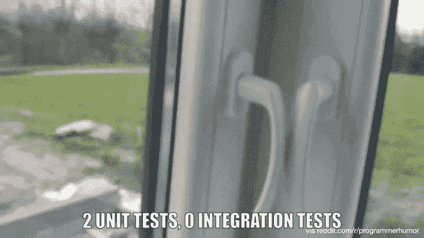

# 如何组织你的 Rust 测试

> 原文：<https://blog.logrocket.com/how-to-organize-your-rust-tests/>

每当你写任何类型的代码时，对它进行测试是至关重要的。在本指南中，我们将带您了解如何测试 Rust 代码。

但在此之前，我想解释一下为什么测试如此重要。说白了，代码有 bug。这个不幸的事实是由最早的程序员发现的，并且一直困扰着程序员到今天。我们唯一的希望是在将代码投入生产之前找到并修复错误。

测试是发现 bug 的一种廉价而简单的方法。单元测试的伟大之处在于它们建立起来并不昂贵，并且可以以适中的成本重新运行。

把测试想象成天黑后在操场上捉迷藏的游戏。你可以带一个手电筒，它非常轻便耐用，但是在任何时候只能照亮很小的区域。你甚至可以把它和一个马达结合起来，旋转灯光来显示更多随机的点。或者，你可以带一盏大型工业灯，这种灯携带起来很重，很难安装，而且更临时，但它本身可以照亮半个操场。即便如此，还是会有一些阴暗的角落。

## 测试方法

有一整套测试方法，从测试驱动设计，到全覆盖测试，再到随时测试的方法。无论您的偏好是什么，我都不会对您进行评判，但是我会注意到我的测试策略在很大程度上取决于手头的任务。

## 何时断言

如果被检查的函数有所有可能的输入都必须为真的前提条件或函数返回时必须成立的后置条件，那么在方法中断言这些条件是可以接受的，只要检查条件在时间和/或内存方面的开销不是非常大。

在某些情况下，一个`debug_assert!`就可以了。这样做通常是成功的，因为无论代码是否在测试中，这些断言都会被检查。一旦不再需要，您可以随时删除它们。将它们视为构建程序的脚手架的一部分。

测试通常知道它们的输出，并且可以断言精确的等价。也就是说，有时“只是”让测试中的代码自我检查是可以的。

## 两用文件测试

您的第一轮测试通常应该包括针对我们 API 的快乐路径的文档测试。如果代码有足够的自检，不断言任何东西通常是可以接受的。在这里使用`unwrap()`或者`?`操作符就可以了。

doctests 的一个鲜为人知的特性是，如果最后一行是`Ok::<_, T>(())`(对于某些类型`T`)，您仍然可以省略`main`方法。例如，我的 aleph-alpha-tokenizer 机箱有以下模块级 doctest:

```
//! ```
//!# use std::error::Error;
//! use aleph_alpha_tokenizer::AlephAlphaTokenizer;
//!
//! let source_text = "Ein interessantes Beispiel";
//! let tokenizer = AlephAlphaTokenizer::from_vocab("vocab.txt")?;
//! let mut ids: Vec<i64> = Vec::new();
//! let mut ranges = Vec::new();
//! tokenizer.tokens_into(source_text, &mut ids, &mut ranges, None);
//! for (id, range) in ids.iter().zip(ranges.iter()) {
//!      let _token_source = &source_text[range.clone()];
//!      let _token_text = tokenizer.text_of(*id);
//!      let _is_special = tokenizer.is_special(*id);
//!      // etc.
//! }
//!# Ok::<_, Box<dyn Error + Send + Sync>>(())
//! ```

```

我们在这里看到一些东西:

*   所有模块级的文档注释行都以`//!`开头，表示外部作用域。其他项目注释通常以`///`开头，表示下面的项目
*   在这个例子中，我们可以给行前缀附加一个`#`散列标记，让`rustdoc`在呈现这个例子时省略这个行
*   最后一行的`Ok(())`通过著名的`turbofish`语法明确了错误类型

对所有公共 API 进行文档测试是一个很好的开始。它既证明了这些方法在没有错误的情况下可以正常工作，也证明了 API 至少在某种程度上是可用的。回到我们的捉迷藏类比，这是一个非常方便的手电筒。你只能看到操场的一小部分，但是很明亮，细节也很好。

## 以身作则

提供展示典型用法的示例程序也是有用的，尤其是对于图书馆。那些进入`examples`子目录，虽然没有被`cargo test`执行，但是可以通过`cargo run`T3 执行。这些例子可以是完全成熟的，尤其有助于图书馆给潜在用户一个良好的起点。

## 测试出错的情况

根据所需的保证水平，这可能远远不够。错误往往潜伏在各种错误案例中。因此，在经济的范围内为所有可能发生的错误类增加测试是有意义的。

例如，对于一个解析器，我会编写一个测试来验证它在空输入时表现良好。这些测试没有给文档增加任何东西，所以我不会添加 doctest，而是添加一个测试方法。

```
#[test]
#[should_panic(expected = "empty input")]
fn empty_input() {
    parse("").unwrap();
}

```

`expected`参数获取 panic 的预期输出消息子字符串。没有它，任何恐慌都被认为是成功的测试，所以当测试中断时，您不会得到通知。注意`should_panic`不能和`Result`一起工作——返回测试函数。在我们的操场游戏中，这是一个指向灌木丛的聚光灯。

## 黑白盒子

在这种情况下，`parse`方法属于公共接口，所以测试是黑盒测试，这意味着它只使用您的机箱的公共 API。黑盒测试通常属于你的机箱的`tests`子目录中的一个或多个文件。一个好的惯例是每个模块有一个测试文件，以便容易找到相应的测试。

有时测试私有功能是有意义的，这样你就可以更好地查明错误或回归。这些测试被称为白盒测试。因为它们需要访问板条箱内部，所以必须在板条箱内定义它们。最佳实践是在你的机箱中直接包含一个`test`子模块，并且只在测试中编译它。

```
#[cfg(test)]
mod test {
    use super::{parse_inner, check};

    #[test]
    fn test_parse_inner() { .. }

    #[test]
    fn test_check() { .. }
}

```

## 验证事情以正确的方式失败

您甚至可能想要验证某些东西没有编译。有两个板条箱可以做到这一点。第一个叫做`compiletest`，是 Rust 编译器测试基础设施的一部分，由 Rust 开发者维护。

* * *

### 更多来自 LogRocket 的精彩文章:

* * *

使用 UI 测试，您只需编写一个应该无法编译的 Rust 程序，`compiletest`运行编译器，将错误输出写入每个测试文件的`.stderr`文件中。如果错误输出改变，测试失败。 [Rustc 开发指南](https://rustc-dev-guide.rust-lang.org/tests/adding.html#ui)有很好的设置文档。

例如，我的`[compact_arena](https://docs.rs/compact_arena)`箱有许多 UI 测试，其中一个我将在下面重现。

```
extern crate compact_arena;

use compact_arena::mk_nano_arena;

fn main() {
    mk_nano_arena!(a);
    mk_nano_arena!(b);
    let i = a.add(1usize);
    let j = b.add(1usize);
    let _ = b[i];
}

```

运行测试将会在`target/debug/ui_tests`箱子目录中创建一个`.stderr`文件(您可以对此进行配置)。只要编译器输出保持不变，将这些文件复制到测试程序旁边就可以通过测试。这意味着只要错误消息得到改进，它就会失败，这种情况经常发生。

顺便说一下，当用新的 Rustc 测试时，由于诊断的改进，所有的测试都失败了，这促使我将测试移植到`compile_fail`测试。这些插件将各种错误、警告和帮助消息的匹配器作为注释嵌入，这使得它们对变化更有弹性。上面的测试类似于编译测试:

```
extern crate compact_arena;

use compact_arena::mk_nano_arena;

fn main() {
    mk_nano_arena!(a);
    mk_nano_arena!(b);
    //~^ ERROR `tag` does not live long enough [E0597]
    let i = a.add(1usize);
    let j = b.add(1usize);
    let _ = b[i];
}

```

每个匹配器必须以`//~`开头。可选地，任意数量的`^`会将错误消息的预期行以及实际错误消息的子字符串向上移动`1`。同样，你可以在 [Rustc 开发指南](https://rustc-dev-guide.rust-lang.org/tests/adding.html#error_annotations)中读到更多这方面的内容。

第二个，create，叫 [`trybuild`](https://github.com/dtolnay/trybuild) ，更年轻更小。由势不可挡的 David Tolnay 编写，它与`compiletest`中的 UI 测试非常相似，但它只打印预期和实际输出，而不是差异。

注意，doctests 也可以被标记为`compile_fail`(可选地，带有一个错误消息子串)，但是我只在让一些东西在工作代码中不可表示是你的 crate 的主要卖点之一时才使用它。

## 快照测试

快照测试是对设置类行为的测试，其中您调用一些方法来设置一些数据，并与预期结果的静态表示进行比较。编写快照测试最困难的部分是设置预期的结果。然而，你不需要手工完成这项工作；您可以让测试工具为您做这件事。如果你的被测类型实现了`Default`，你可以简单的把它和`YourType::default()`进行比较，复制其中的差异。

请注意，这要求您的类型的`Debug`输出代表实际代码中的类型。如果这是不可能的，你可以使用 [insta](https://docs.rs/insta) ，它提供了一个方便的方法来做快照测试。板条箱使用货物子命令`cargo-insta`来检查快照测试，这使得检查结果变得非常容易。

## 随机测试

既然我们已经关注了几个不同的领域，是时候引进大人物了。还记得我们说过的那个把手电筒旋转到操场上不同位置的马达吗？那是我们的财产测试。这个想法是定义一个必须持有的属性，然后随机生成输入进行测试。

当然，这只有在你有一个明确定义的属性来测试时才有效。根据您的用例，获得合适的属性可能非常简单，也可能非常困难。一些需要记住的事情:

*   许多函数都有某种界限。你应该测试他们留在里面
*   有时，某些类型具有不变量——在模块内的代码之外始终保持不变的属性。例如，`Vec`有长度和容量，长度总是小于或等于容量
*   如果你有一个算法的简单版本和快速版本，你可以测试这两个版本是否达到相同的解。
*   解析器可能会失败，但不会因为随机输入而崩溃

好的属性测试工具不仅会给出一个失败的测试用例，还会将输入缩减到仍然显示失败的最小限度——如果您不想在 50，000 个整数中寻找触发 bug 的三个整数序列，这是一个非常有用的特性。

有两个板条箱有助于性能测试。一个是安德鲁·格兰特的[快速检查](https://docs.rs/quickcheck)。您可以从单元测试中调用它，它会很快生成 100 个输入来进行测试。例如，我的`[bytecount](https://docs.rs/bytecount)`板条箱具有简单和快速计数功能，并相互测试它们。

```
use quickcheck::quickcheck;

quickcheck! {
    fn check_count_correct((haystack, needle): (Vec<u8>, u8)) -> bool {
        count(&haystack, needle) == naive_count(&haystack, needle)
    }
}

```

在这种情况下，输入相当简单，但是您可以从字节中获取值，或者为要测试的类型实现 QuickCheck 的`Arbitrary`特征。

用于随机特性测试的另一个板条箱是`[proptest](https://docs.rs/proptest)`。与 QuickCheck 相比，它有一个更精细的收缩机制，另一方面，也需要更多的时间来运行。不然还挺像的。以我的经验来看，两者都会产生好的结果。

我们的示例`proptest`应该是这样的:

```
use proptest::prelude::*;

proptest! {
    #[test]
    fn check_count_correct(haystack: Vec<u8>, needle: u8) {
        prop_assert_eq!(count(&haystack, needle), naive_count(&haystack, needle));
    }
}

```

`proptest`的好处之一，除了在策略上更高的灵活性之外，就是故障持久性:所有发现的错误都被写入文件，下次自动运行。这将创建一个简单的回归测试线束。

## 起毛

让我们说，我们有一个聪明的装置，它将偏置我们的光马达的随机旋转，在以前黑暗的地方照射更多的光。代码覆盖率用于引导随机性远离已经尝试过的代码路径。这个简单的想法造就了一个惊人强大的技术，一个有可能发现大量 bug 的技术。

从 Rust 中做到这一点最简单的方法是使用`[cargo-fuzz](https://rust-fuzz.github.io/book/cargo-fuzz.html)`。这是用`cargo install cargo-fuzz`安装的。注意，现在运行模糊测试需要一个夜间 Rust 编译器。

```
$ cargo fuzz init
$ cargo fuzz add count
$ # edit the fuzz target file
$ cargo fuzz run count

```

对于我的`bytecount`机箱，一个模糊目标看起来像这样:

```
#![no_main]
use libfuzzer_sys::fuzz_target;

use bytecount::{count, naive_count};
fuzz_target!(|data: &[u8]| {
    if !data.is_empty() {
        return;
    }
    let needle = data[0];
    let haystack = &data[1..];
    assert_eq!(count(&haystack, needle), naive_count(&haystack, needle));
});

```

我可以很高兴地证明，即使运行了两天，`libfuzzer`也没有在这个实现中发现任何错误。这让我对自己代码的正确性充满了信心。

## 测试助手

复杂的系统导致复杂的测试，所以有一些测试助手通常是有用的。特别是对于文档测试，您可以在`#[cfg(test)]`下定义函数，这样它们就不会出现在产品代码中。当然，`tests`子目录中的文件可以包含任意函数。

在极少数情况下，测试可以受益于嘲笑。有许多生锈的板条箱。Alan Somers 创建了一个很好的[对比页面](https://asomers.github.io/mock_shootout)。

## 其各部分的总和

当然，单元测试只是孤立地看组件。集成测试经常发现组件间接口定义的问题，即使组件本身测试成功。所以不要把你所有的预算时间都花在单元测试上；也留下一些用于集成测试。



## 一如既往，知道什么时候停下来

测试是一项很好的活动。目标是明确定义的，测试代码通常非常简单且易于编写。因此，记住测试的目标是发现错误是至关重要的。从不失败的测试几乎是没有价值的。

不幸的是，你无法预见一个测试什么时候会开始失败，所以我不建议删除已经有一段时间没有失败的测试。您必须在拥有快速测试套件和防止回归之间权衡取舍。

## [log rocket](https://lp.logrocket.com/blg/rust-signup):Rust 应用的 web 前端的全面可见性

调试 Rust 应用程序可能很困难，尤其是当用户遇到难以重现的问题时。如果您对监控和跟踪 Rust 应用程序的性能、自动显示错误、跟踪缓慢的网络请求和加载时间感兴趣，

[try LogRocket](https://lp.logrocket.com/blg/rust-signup)

.

[](https://lp.logrocket.com/blg/rust-signup)

LogRocket 就像是网络和移动应用程序的 DVR，记录你的 Rust 应用程序上发生的一切。您可以汇总并报告问题发生时应用程序的状态，而不是猜测问题发生的原因。LogRocket 还可以监控应用的性能，报告客户端 CPU 负载、客户端内存使用等指标。

现代化调试 Rust 应用的方式— [开始免费监控](https://lp.logrocket.com/blg/rust-signup)。