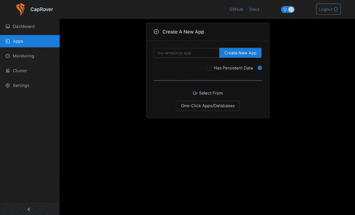
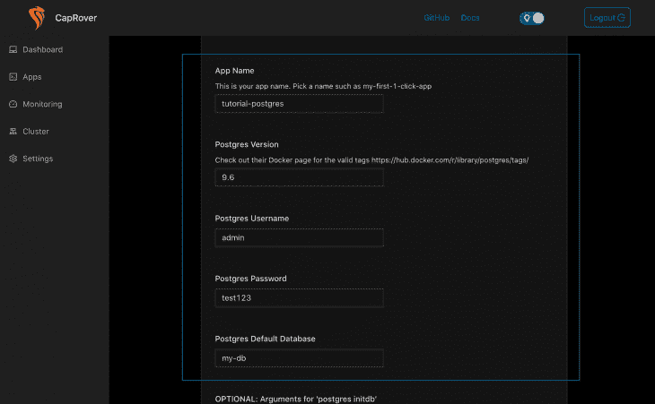
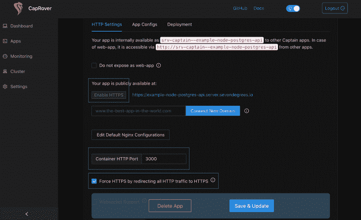
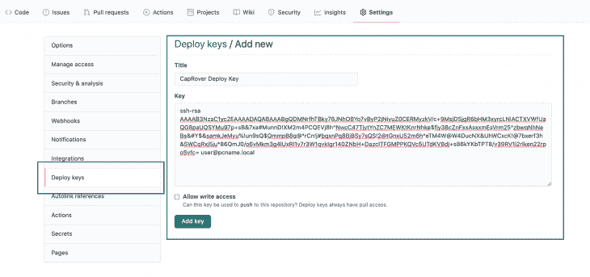
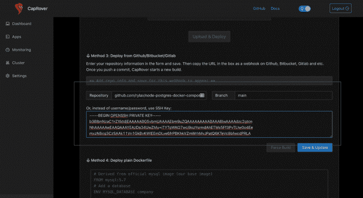
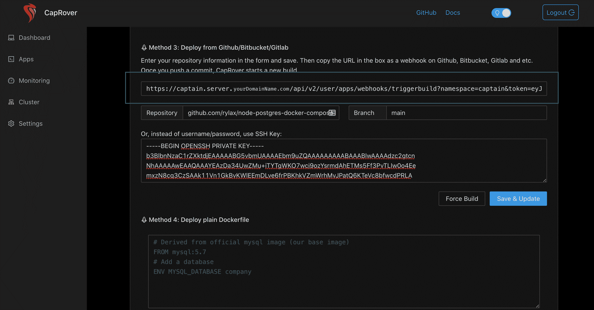
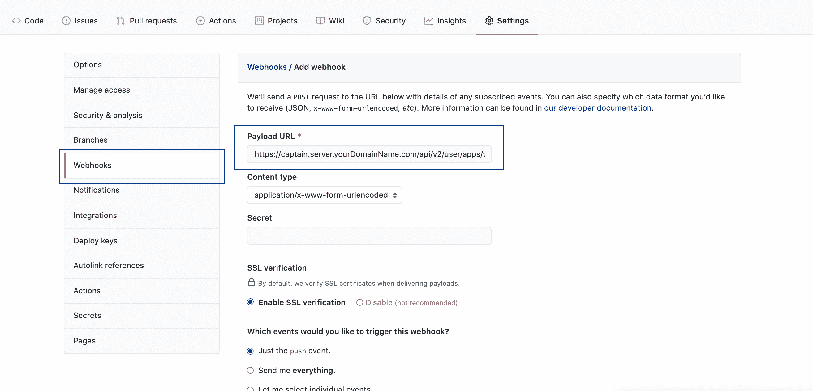
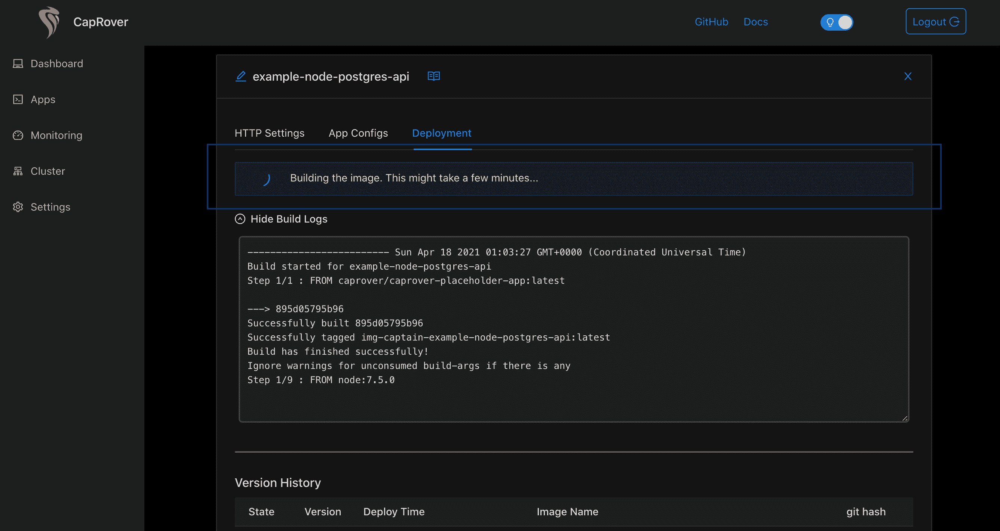
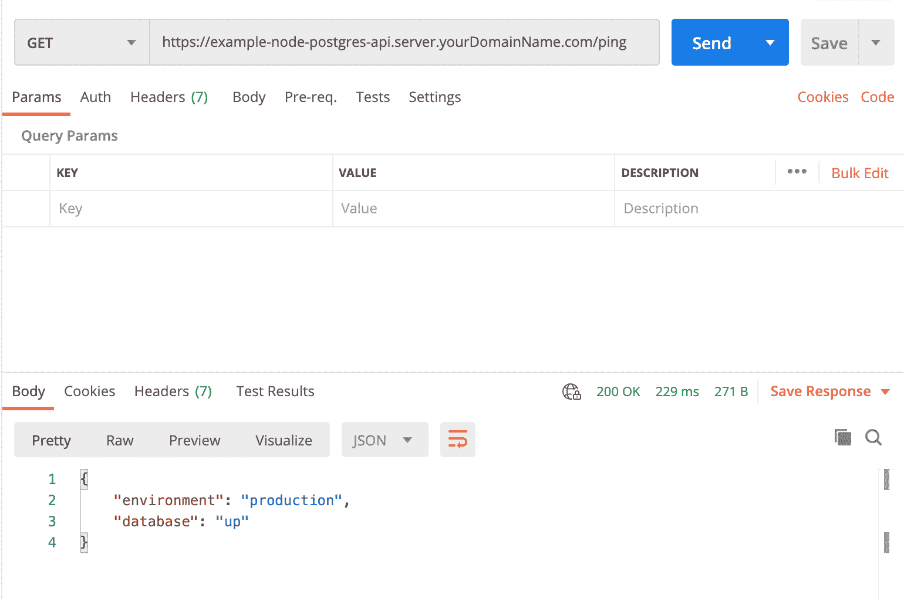

# 如何用 CapRover - LogRocket 博客建立自己的 PaaS

> 原文：<https://blog.logrocket.com/how-to-set-up-your-own-paas-with-caprover/>

## 介绍

平台即服务(PaaS)是基于云的服务，有助于消除开发应用程序的成本和复杂性。像 [Heroku](https://www.heroku.com/) 、 [Google App Engine](https://cloud.google.com/appengine) 或 [AWS Elastic Beanstalk](https://aws.amazon.com/elasticbeanstalk/) 这样的服务允许开发人员完全在云中构建、运行和操作应用程序，使用预先构建的软件组件来帮助快速创建和扩展应用程序。

这些服务的问题在于，便捷的可用性带来了更高的价格。一旦你离开免费层(例如在 Heroku 上)，它就开始变得昂贵。如果你想在你的服务中添加一个数据库，你必须花更多的钱。

如果可以选择在您喜欢的任何基础架构上实施您自己的 PaaS，同时获得典型 PaaS 服务的优势并大幅降低成本，会怎么样？让我给你介绍一下 ca prover——一个开源的 DIY PaaS。

## 什么是 CapRover？

是一个易于使用的应用/数据库部署和 web 服务器管理器，适用于 Node.js、Ruby、PHP、Postgres 和 MongoDB 等各种应用。它运行速度快，非常健壮，因为它使用了 Docker、Nginx、LetsEncrypt 和 NetData。

CapRover 通过专注于应用程序而不是底层基础设施来帮助您提高工作效率。此外，有了 CapRover 的 [One Click Apps](https://github.com/caprover/one-click-apps/tree/master/public/v4/apps) ，你只需点击一个按钮，就可以设置 Postgres、MongoDB、似是而非的 Analytics 或 PGAdmin 等应用。

## 卡波弗 vs Heroku

CapRover 是 Heroku 的绝佳替代品。Heroku 是一个平台即服务(PaaS ),使开发人员能够完全在云中构建、运行和操作应用程序。自推出以来，Heroku 已经帮助大量开发人员提高了工作效率，并更容易地部署应用程序。

然而，Heroku 也有不好的一面。伟大的可用性是有代价的。虽然 Heroku 确实提供了一个免费层，但是如果你想运行一个生产就绪的应用程序，你需要使用他们的一个付费层。这些层的价格相当昂贵，而且肯定是基于可用性因素，特别是与通过购买虚拟专用服务器(VPS)获得的相同规格相比。此外，Heroku 免费层上的每个应用程序在大约 30 分钟不活动后都会进入睡眠状态。

如果有一种方法可以在你自己的 VPS 上实现你自己版本的 Heroku 会怎么样？让我们来谈谈 CapRover，我们自己的私有、开源和免费的 PaaS。

这些是 CapRover 的一些伟大的功能:

*   用于自动化和脚本编写的 CLI
*   方便易用的 Web GUI
*   没有锁定。你可以移除 CapRover，你的应用程序继续工作
*   码头工人蜂拥而至，进行集装箱化和集群化
*   Nginx(完全可定制的模板),用于负载平衡
*   让我们为免费的 SSL 加密(HTTPS)

## 安装 CapRover 并部署您的第一个应用程序

在本教程中，我们的目标是教您在自己的 VPS 上安装 CapRover，然后演示如何部署一个带有平滑 CI/CD 流的 Node.js 和 Postgres 应用程序，以便当我们推送到我们的主分支时，我们的应用程序会自动重建。

### 先决条件

*   您已经购买了虚拟专用服务器(VPS)
*   您已经购买了一个域名
*   Node.js 和 npm 安装在您的本地计算机上
*   对 Docker 的基本了解
*   对 Node.js 的基本了解
*   对 Linux 命令的基本理解
*   基本了解如何生成 SSH 密钥

## 购买 VPS 和选择操作系统

CapRover 官方网站建议你的 VPS 至少有 1 GB 的内存，以避免构建过程中的问题。有许多云服务提供商，如 Digital Ocean、Vultr、Hetzner 或 Linode，您可以在那里购买 VPS，起价仅为每月 3 美元。

CapRover 是在 Ubuntu 18.04 上测试的。CapRover 官方网站建议 Ubuntu 18.04 优于 Ubuntu 20，以最大限度地减少您的生产问题。Ubuntu 18.04 至少要到 2023 年才会继续收到更新。

对于本教程，我将使用 Hetzner 的 CX11 VPS，它配有 1 个 vCPU，2 GB 的 RAM，20 GB 的磁盘空间，20 TB 的流量，每月仅花费 3 美元。

## 设置您的 VPS

除了您的操作系统之外，您的新 VPS 不包含任何内容。在我们安装 CapRover 之前，我们首先要确保我们已经安装了所有必要的工具，允许我们这样做。幸运的是，我们唯一真正需要的是 Docker。

Docker 是一个容器引擎，它使用 Linux 内核特性，如名称空间和控制组，在操作系统上创建容器(了解更多信息[这里](https://docs.docker.com/get-started/overview/))。

如果您从未听说过 Docker，我强烈建议您在安装和使用 CapRover 之前学习一些基础知识。这也将极大地提高你的开发效率。

## 安装 Docker

好了，让我们安装 Docker 社区版(Docker CE)。

以下代码将更新 apt 包索引并安装允许 apt 通过 HTTPS 使用存储库的包:

```
sudo apt-get update

sudo apt-get install \\
    apt-transport-https \\
    ca-certificates \\
    curl \\
    gnupg-agent \\
    software-properties-common

```

添加 Docker 的官方 GPG ( [GNU 隐私卫士](https://en.wikipedia.org/wiki/GNU_Privacy_Guard))键:

```
curl -fsSL https://download.docker.com/linux/ubuntu/gpg | sudo gpg --dearmor -o /usr/share/keyrings/docker-archive-keyring.gpg

```

再次更新 apt 包索引，为你的 Ubuntu 18.04 安装最新版本的 Docker 引擎和 Containerd:

```
sudo add-apt-repository "deb [arch=amd64] https://download.docker.com/linux/ubuntu bionic stable"
sudo apt-get update
sudo apt-get install docker-ce docker-ce-cli containerd.io

```

运行`docker -v`查看您的 Docker 版本，并检查安装是否成功。

最后，我们可以用这个简单的命令神奇地安装 CapRover:

```
docker run -p 80:80 -p 443:443 -p 3000:3000 -v /var/run/docker.sock:/var/run/docker.sock -v /captain:/captain caprover/caprover

```

> 如果你使用的是数字海洋，你也可以使用他们的[一键式](https://marketplace.digitalocean.com/apps/caprover) droplet，它会自动为你安装 CapRover。

## 配置域

接下来，我们希望将我们的域指向我们的 VPS。

首先，我们必须找到我们的 VPS 的公共(或外部)IP 地址。您可以在 VPS 用户界面上轻松找到该 IP 地址:


接下来，去你的域名注册商的网站。登录，并导航到您的域的 DNS 设置。我们将使用一个子域，通过 A 记录指向我们的 VPS:


我们在这里使用了一个通配符子域，这使得我们的应用程序可以通过 yourApplicationName.server.yourDomainName.com 访问(注意，您不必在这里使用`.server`，您可以使用您想要的任何名称)。

## 配置防火墙

防火墙是一种网络安全设备，它监控传入和传出的网络流量，并根据一组定义的安全规则决定是允许还是阻止特定流量。为了让 CapRover 正常工作并与外界通信，我们需要确保打开正确的端口。根据其使用的官方 CapRover 网站:

*   80 TCP 用于常规 HTTP 连接
*   用于安全 HTTPS 连接的 443 TCP
*   用于初始 Captain 安装的 3000 TCP(一旦 Captain 连接到域，就会被阻止)
*   996 TCP 用于特定于 Docker 注册表的安全 HTTPS 连接
*   7946 用于容器网络发现的 TCP/UDP
*   4789 用于容器覆盖网络的 TCP/UDP
*   2377 Docker Swarm API 的 TCP/UDP

我们将使用 Ubuntu UFW 的默认防火墙配置工具(简单防火墙)来设置我们的防火墙。

首先，启用防火墙:

```
sudo ufw enable
```

然后，允许前面提到的端口:

```
sudo ufw allow 80,443,3000,996,7946,4789,2377/tcp
sudo ufw allow 7946,4789,2377/udp

```

您可以运行`ufw status`来检查您的防火墙的当前状态。

您可能已经注意到，像 Digital Ocean 或 Hetzner 这样的提供商在其网站上为您的 VPS 提供了专用的防火墙部分。这些被称为云防火墙。云防火墙会在流量到达您的服务器之前对其进行过滤。这对于 DDoS 攻击非常有利，因为恶意流量甚至不会到达您的 VPS。如果你设置了云防火墙，没有必要启用 UFW 这样的软件防火墙。因为设置云防火墙主要取决于提供商的用户界面，所以我们在本教程中使用 UFW。

## 正在初始化 carlover

我们几乎准备好了！在您的本地机器上(在我的例子中是 Macbook Pro)，让我们通过 npm 安装 CapRover CLI，然后设置服务器。

安装 CapRover CLI:

```
npm i -g caprover
```

现在我们可以运行 setup 命令了。基于一些输入，CapRover 将让我们配置一个新的安全密码(默认为 **captain42** )以及一个 SSL 证书，这样我们就可以启用 HTTPS:

```
caprover serversetup
```

下面是一个输出示例:

```
Setup CapRover machine on your server...

? have you already started CapRover container on your server? Yes
? IP address of your server: [yourIPAddress]
? CapRover server root domain: server.[yourDomainName].com
? new CapRover password (min 8 characters): [hidden]
? enter new CapRover password again: [hidden]
? "valid" email address to get certificate and enable HTTPS: [[email protected]]
? CapRover machine name, with whom the login credentials are stored locally: [yourCustomCapRoverMachineName]

CapRover server setup completed: it is available as [yourCustomCapRoverMachineName] at https://captain.server.[yourDomainName].com

For more details and docs see CapRover.com

```

我们现在可以导航到`[https://captain.server.[yourDomainName].com](https://captain.server.%5ByourDomainName%5D.com)`:


让我们使用新的安全密码登录:



恭喜你！您的 CapRover PaaS 现已启动并运行。

## 在 carlover 上托管应用程序

既然您已经建立了自己的 PaaS，我们可以在上面托管您的第一个 Node.js 应用程序。

本节的目标是托管一个连接到 Postgres 数据库的基本 Node.js 应用程序。此外，我们希望它的设置方式可以自动重建和部署我们的应用程序，每当我们推到我们的主分支。

我们将使用来自 Github 的一个示例项目。如果你想了解更多关于如何用这个技术栈创建一个 CRUD Rest API，请查看这个[教程](https://blog.logrocket.com/nodejs-expressjs-postgresql-crud-rest-api-example/)。

首先，我从 Github 中 git 克隆了[这个项目，并将其推送到我自己的 Github 帐户上的一个新的私有存储库中。](https://github.com/MichalZalecki/docker-compose-node-postgres)

这个示例项目搭建了一个连接到 Postgres 数据库的基本 Express.js 应用程序。正如你在根文件夹中看到的，我们有一个`Dockerfile`和`docker-compose.yml`。

虽然我们通常只是运行 Docker Compose 文件，然后就收工了，但有些事情我们必须改变，才能让它与 CapRover 一起工作。CapRover 只是 Docker 周围薄薄的一层。它使用 Docker 来构建和运行您的应用程序，这是通过 Docker API 完成的。

尽管 Docker Compose 是 Docker CLI 中的一个特性，但它在 Docker API 中不可用。这意味着 CapRover 不能处理 Docker 编写文件。有一些方法可以解决这个问题，但是我们可以在这个限制下工作。

我们将这样做:

1.  用 CapRover 的一键式应用程序建立一个 Postgres 数据库
2.  创建一个`captain-definition`文件
3.  在 CapRover 界面中创建一个新的定制应用程序
4.  调整我们的 Postgres 配置
5.  连接我们的 Github repo 并部署

### 1.用 CapRover 的一键式应用程序建立一个 Postgres 数据库

选择**一键应用**并选择 **PostgreSQL** 应用:


然后，输入数据库的详细信息(如数据库名称、用户名和密码):



安装完成后，数据库将在端口 5432 作为`srv-captain--YOUR_CONTAINER_NAME`对其他 CapRover 应用程序可用。在我们的例子中是`srv-captain--tutorial-postgres-db`。

### 2.创建一个`captain-definition`文件

CapRover 的关键组件之一是位于项目根目录下的`[captain-definition](https://caprover.com/docs/captain-definition-file.html)`文件。这个文件告诉 CapRover 实际上要做什么。

在我们的例子中，我们想让它运行位于我们项目的根中的`Dockerfile`。创建文件并添加:

```
{
  "schemaVersion": 2,
  "dockerfilePath": "./Dockerfile"
 }

```

> 根据 CapRover 官方网站的说法，`"schemaVersion"`始终为 2。

### 3.在 CapRover 界面中创建一个新的定制应用程序

接下来，我们必须创建一个带有 CapRover 界面的自定义应用程序。只需给你的应用命名，然后点击**创建新应用**按钮。在我们的例子中，我们的节点应用程序是无状态的，因为它与 Postgres 数据库通信。因此，我们不需要勾选**有持久数据**复选框。


在 **HTTP 设置**选项卡中，我们将**启用 HTTPS** 以及**通过将所有 HTTP 流量重定向到 HTTPS** 来强制 HTTPS，以确保最大的安全性。最后但同样重要的是，我们必须添加我们的应用程序运行的端口。在我们的例子中，它是端口 3000。



### 4.调整我们的 Postgres 配置

`index.ts`让我们补充一下:

```
const client = new Client({
  user: "admin",
  password: "test123",
  host: "srv-captain--tutorial-postgres-db",
  database: "my-db"
});

```

### 5.连接我们的 Github repo 并部署

现在让我们将 CapRover 连接到我们的 Github repo，这样每当我们推送到主分支时，就会自动构建一个新版本。连接到 Github 需要两个步骤。

我们首先要从 Github repo 中获得一个部署密钥。在您的 VPS 或本地机器上使用`ssh-keygen`生成一个新的公钥/私钥对。

然后，在 Github repo 上，导航到**设置/部署键**。您应该在这里输入您的公钥:



回到我们的 CapRover 界面，在 **Deployment** 选项卡下，我们将首先以`github.com/user/repository`的格式输入我们的存储库位置。此外，您可以指定您的分支机构名称。例如，如果你想让你的应用程序在你推送到你的`dev`分支的任何时候都可以构建，只需输入`dev`。

最后但同样重要的是，我们必须添加我们的私钥，而不是用户名和密码。我强烈建议您这样做，因为这样更安全:



为了更加安全，CapRover 官方网站建议您使用服务帐户。你可以在这里阅读更多关于 CapRover 最佳实践的信息。

点击**保存&更新**，等待你的 webhook 网址生成:



太好了！现在，最后一步是复制这个 URL，并导航回我们在 Github 上的 repo 的**设置**页面。在 **Webhooks** 下，简单地添加一个新的 webhook，带有 CapRover 为您生成的 URL。您可以保留其余字段不变:



一旦你保存了你的 webhook，你的应用程序将自动在 CapRover 上构建:



最后，我们可以检查一下`[https://example-node-postgres-api.server.sevendegrees.io/ping](https://example-node-postgres-api.server.sevendegrees.io/ping)`，看到一切都运行顺利。



恭喜，我们已经成功地建立了一个 Node.js 项目，该项目连接到一个 Postgres 数据库，每当我们推送到我们的主分支时，该数据库都会自动重建。所有这些都在不到一个小时内完成，而且每月只需三美元！

## 一般安全提示

与 Heroku 不同，你要对服务器上发生的一切负责。因此，您应该将 VPS 的安全性视为最高优先级。

以下是我建议你做的一些事情:

*   让您的服务器保持最新
*   使用 SSH 密钥登录
*   使用强密码
*   更改默认 SSH 端口
*   设置防火墙
*   备份您的服务器
*   设置监控

请记住，服务器安全的关键是建立安全层，使黑客更难入侵您的系统。我们的层数越多，难度就越大。没有一个系统是百分之百安全的，但是你需要确保尽你最大的努力。

## 摘要

在本教程中，我们了解了什么是 CapRover，如何在不到一个小时的时间内将自己的平台设置为服务，以及如何通过部署一个简单的 Node.js 和 Postgres 应用程序来部署生产就绪的应用程序。

这仅仅是你能用 CapRover 做的事情的皮毛。我强烈推荐你查看他们的官方文档以了解更多。

如果你有任何问题，请在下面的评论中告诉我。

## 200 只显示器出现故障，生产中网络请求缓慢

部署基于节点的 web 应用程序或网站是容易的部分。确保您的节点实例继续为您的应用程序提供资源是事情变得更加困难的地方。如果您对确保对后端或第三方服务的请求成功感兴趣，

[try LogRocket](https://lp.logrocket.com/blg/node-signup)

.

[](https://lp.logrocket.com/blg/node-signup)[https://logrocket.com/signup/](https://lp.logrocket.com/blg/node-signup)

LogRocket 就像是网络和移动应用程序的 DVR，记录下用户与你的应用程序交互时发生的一切。您可以汇总并报告有问题的网络请求，以快速了解根本原因，而不是猜测问题发生的原因。

LogRocket 检测您的应用程序以记录基线性能计时，如页面加载时间、到达第一个字节的时间、慢速网络请求，还记录 Redux、NgRx 和 Vuex 操作/状态。

[Start monitoring for free](https://lp.logrocket.com/blg/node-signup)

.