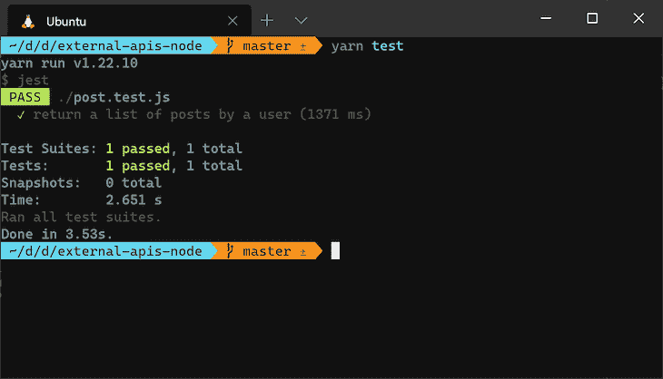
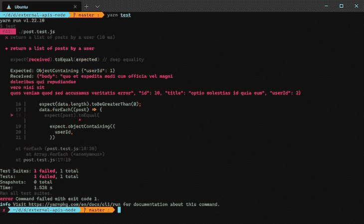

# 如何在 Node.js 中测试依赖外部 API 的代码

> 原文：<https://blog.logrocket.com/how-to-test-code-that-depends-on-external-apis-in-node-js/>

依赖于外部 API 的单元测试代码带来了各种各样的挑战。由于网络中断，一些外部 API 很慢，容易出错，受到速率限制，并且很难跟踪，因为它们可能在没有通知的情况下改变或消失。幸运的是，这些问题相对容易克服。

在本文中，我们将介绍两种最常用的测试使用第三方 API 的代码的模式。我将通过以下方式演示如何从直接调用外部 API 的测试转到移除外部依赖的测试:

*   用预定义的响应模仿请求
*   拦截请求并保存它们的响应以备后用

## **测试使用外部 API 的代码**

为了演示使用外部 API 的测试代码，我们将使用一个例子来检索由 [JSON 占位符](https://jsonplaceholder.typicode.com/)提供的用户 ID 过滤的一系列帖子。

```
// post.js
const fetch = require('node-fetch');

async function getPosts(userId) {
  const response = await fetch(
    `https://jsonplaceholder.typicode.com/posts?userId=${userId}`
  );

  if (!response.ok) {
    throw new Error(response.statusText);
  }

  return await response.json();
}

module.exports = {
  getPosts,
};

```

让我们假设您有一个调用外部 API 的函数，如上所示，并以下面的[格式](https://jsonplaceholder.typicode.com/posts?userId=1)生成一个 JSON 响应:

```
[
  {
    "userId": 1,
    "id": 1,
    "title": "sunt aut facere repellat provident occaecati excepturi optio reprehenderit",
    "body": "quia et suscipit\nsuscipit recusandae consequuntur expedita et cum\nreprehenderit molestiae ut ut quas totam\nnostrum rerum est autem sunt rem eveniet architecto"
  },
  {
    "userId": 1,
    "id": 2,
    "title": "qui est esse",
    "body": "est rerum tempore vitae\nsequi sint nihil reprehenderit dolor beatae ea dolores neque\nfugiat blanditiis voluptate porro vel nihil molestiae ut reiciendis\nqui aperiam non debitis possimus qui neque nisi nulla"
  }
]

```

现在，我们将编写一个测试来确认返回的帖子有一个与传递给`getPost()`函数的值相匹配的`userId`。尽管我选择使用 [Jest](http://Jestjs.io/) 进行测试是因为它很受欢迎，但是同样的原则也可以应用于其他测试框架，比如 [Mocha](https://mochajs.org/) 或者 [Jasmine](https://jasmine.github.io/) 。

```
// post.test.js
const { getPosts } = require('./post');

test('return a list of posts by a user', () => {
  const userId = 1;
  return getPosts(userId).then((data) => {
    expect(data.length).toBeGreaterThan(0);
    data.forEach((post) => {
      expect(post).toEqual(
        expect.objectContaining({
          userId,
        })
      );
    });
  });
});

```

上面的测试确认了预期数据不为空，并且每个对象中的`userId`与函数的参数匹配。这个测试的问题是它调用真正的 API，这使得它完成起来很慢，因为实际的请求是通过网络发送的。例如，这个特定的测试花了一秒多的时间在我的机器上运行。



虽然一个缓慢的测试本身可能没什么大不了的，但是当您运行许多这样的测试时，整个测试套件会变得越来越慢，越来越脆弱，这可能会受到连接性问题和速率限制的影响。

此外，一些 API 需要认证或授权。如果它是由付费服务提供的，调用 API 的成本可能会增加。由于这些原因，使用下面描述的策略将测试从 API 调用中分离出来是很重要的。

## 手动模拟 HTTP 请求

模仿是一种单元测试的方法，在这种方法中，外部依赖关系被模拟其行为的对象所取代。这使得将被测试的代码从它的外部依赖项中分离出来变得容易，并且避免了由于与外部系统的交互而产生的负面影响。对于外部 API，模仿包括拦截 HTTP 请求并返回真实场景中预期的响应。

Jest 库为模仿外部依赖提供了有用的[方法](https://jestjs.io/docs/mock-functions)。在这种情况下，我们想要模拟对`getPosts`函数中的`fetch`的调用，以便它返回一个固定的响应，而不是到达真正的 API。这可以在测试文件中实现:

```
// post.test.js
jest.mock('node-fetch');

const fetch = require('node-fetch');
const getPostResponse = require('./testdata/postResponse');
const { getPosts } = require('./post');
const { Response } = jest.requireActual('node-fetch');

test('return a list of posts by a user', () => {
  const userId = 1;

  fetch.mockResolvedValue(new Response(JSON.stringify(getPostResponse)));

  return getPosts(userId).then((data) => {
    expect(data.length).toBeGreaterThan(0);
    data.forEach((post) => {
      expect(post).toEqual(
        expect.objectContaining({
          userId,
        })
      );
    });
  });
});

```

在第一行中，`jest.mock()`方法用于模拟整个`node-fetch`模块。这将每个模块导出设置为`jest.fn()`，后者返回`undefined`。有了这个，您可以将由`node-fetch`导出的任何方法的返回值指定为您想要的任何值。

在上面的代码片段中，`fetch`被分配了一个承诺的返回值，该值通过`mockResolvedValue()`方法解析为预定义的响应。这里有必要使用`jest.requireActual()`助手来保留`Response`对象的实际行为，而不是不符合原始行为的模仿版本。

在执行测试之前，预期的响应应该放在一个单独的文件中:

```
// testdata/postResponse.js
module.exports = [
  {
    userId: 1,
    id: 1,
    title:
      'sunt aut facere repellat provident occaecati excepturi optio reprehenderit',
    body:
      'quia et suscipit\nsuscipit recusandae consequuntur expedita et cum\nreprehenderit molestiae ut ut quas totam\nnostrum rerum est autem sunt rem eveniet architecto',
  },
  {
    userId: 1,
    id: 2,
    title: 'qui est esse',
    body:
      'est rerum tempore vitae\nsequi sint nihil reprehenderit dolor beatae ea dolores neque\nfugiat blanditiis voluptate porro vel nihil molestiae ut reiciendis\nqui aperiam non debitis possimus qui neque nisi nulla',
  },
  // truncated for brevity
];

```

如果您再次运行测试，它将不再调用外部 API。相反，它将从指定的文件中检索响应，并将其用作来自`fetch`的解析值，这样测试仍然会通过:


如果您想确定您正在测试的是固定的响应，请编辑 response 对象中的一个字段，这样测试就会失败。例如，您可以将其中一个`userId`字段更改为`2`。您将得到如下所示的错误:



尽管模仿是对依赖外部服务的代码进行单元测试的有效方法，但它也有一些缺陷。

被模仿的响应可能与真实的 API 不同步，这可能导致潜在的误导性结果。您的测试将会成功，但是如果外部依赖关系发生变化，而模拟仍然基于旧版本，那么您的功能可能会在生产中失败。如果被模仿的对象中有尚未被考虑的突破性改变，这尤其可能。

此外，如果过度使用模拟对象，您需要对测试本身执行的维护量可能会增加。

因此，在使用这种技术时，及时了解 API 返回的数据的变化是非常重要的。幸运的是，这可以通过像 [Nock](https://github.com/nock/nock) 这样的工具来自动完成，我们将在下一节讨论。

## 用 Nock 记录、保存和重用 API 响应

Nock 可以用来模仿单个 API 的响应，就像我们在上一节中使用`jest.mock()`一样。像所有其他节点包一样，在脚本中需要它之前，您必须先安装它:

```
$ yarn add nock -D

```

在下面的代码片段中，Nock 用于通过指定主机名和请求路径以及预期的 HTTP 状态代码和响应正文来拦截 GET 请求。这允许 Nock 拦截来自`getPosts()`的请求，以便返回指定的响应体并对其进行测试。

```
const nock = require('nock');
const { getPosts } = require('./post');
const getPostResponse = require('./testdata/postResponse');

test('return a list of posts by a user', () => {
  const userId = 1;

  nock('https://jsonplaceholder.typicode.com')
    .get(`/posts?userId=${userId}`)
    .reply(200, getPostResponse);

  return getPosts(userId).then((data) => {
    expect(data.length).toBeGreaterThan(0);
    data.forEach((post) => {
      expect(post).toEqual(
        expect.objectContaining({
          userId,
        })
      );
    });
  });
});

```

Nock 还有另一个锦囊妙计，它允许我们保存拦截 HTTP 请求的真实响应，以备后用；它记录外部 API 请求的输出，并将其作为 fixture 添加到初始运行中。下次运行测试时，将使用记录的夹具。下面是它的使用方法:

```
const nockBack = require('nock').back;
const path = require('path');
const { getPosts } = require('./post');

nockBack.fixtures = path.join(__dirname, '__nock-fixtures__');
nockBack.setMode('record');

test('return a list of posts by a user', async () => {
  const userId = 1;

  const { nockDone } = await nockBack('post-data.json');

  const data = await getPosts(userId);

  expect(data.length).toBeGreaterThan(0);
  data.forEach((post) => {
    expect(post).toEqual(
      expect.objectContaining({
        userId,
      })
    );
  });

  nockDone();
});

```

在运行测试之前，您需要通过`fixtures`属性配置记录响应的位置。之后，将[模式](https://github.com/nock/nock#modes)设置为`record`，以便使用任何记录的 Nocks，并记录缺失的 Nocks。

在测试函数中，将一个文件名传递给`nockBack`,以便将记录的输出保存在那里。一旦测试期望被断言，调用`nockDone()`方法。

当测试第一次运行时，Nock 将向 real API 发出实际的请求，并将响应记录到一个文件中`__nock-fixtures__/post-data.json`。在后续运行中，将使用记录的响应，而不是再次点击记录的 API。


这种方法的主要好处是，您不再需要手动模拟每个 HTTP 请求。这使您可以避免潜在的误导结果和不必要的维护。在运行测试之前，只需删除先前保存的版本，就可以很容易地重新记录 fixture。

## 结论

模仿是保持测试快速和确定性的一种简便方法。使用 mocking，您可以移除任何与外部依赖的耦合，这样它们就不再是被测单元的约束了。如果没有嘲讽，可能很难诊断测试失败是由于我们的代码还是依赖。

在本文中，我们考虑了在 Node.js 测试套件中模仿外部 API 的两种方法，但在这方面，使用 [Jest](https://jestjs.io/docs/) 和 [Nock](https://github.com/nock/nock) 仅仅触及了表面。它们都有非常详细的文档，非常值得研究。

感谢阅读，祝测试愉快！

* * *

### 更多来自 LogRocket 的精彩文章:

* * *

## 200 只显示器出现故障，生产中网络请求缓慢

部署基于节点的 web 应用程序或网站是容易的部分。确保您的节点实例继续为您的应用程序提供资源是事情变得更加困难的地方。如果您对确保对后端或第三方服务的请求成功感兴趣，

[try LogRocket](https://lp.logrocket.com/blg/node-signup)

.

[](https://lp.logrocket.com/blg/node-signup)[https://logrocket.com/signup/](https://lp.logrocket.com/blg/node-signup)

LogRocket 就像是网络和移动应用程序的 DVR，记录下用户与你的应用程序交互时发生的一切。您可以汇总并报告有问题的网络请求，以快速了解根本原因，而不是猜测问题发生的原因。

LogRocket 检测您的应用程序以记录基线性能计时，如页面加载时间、到达第一个字节的时间、慢速网络请求，还记录 Redux、NgRx 和 Vuex 操作/状态。

[Start monitoring for free](https://lp.logrocket.com/blg/node-signup)

.