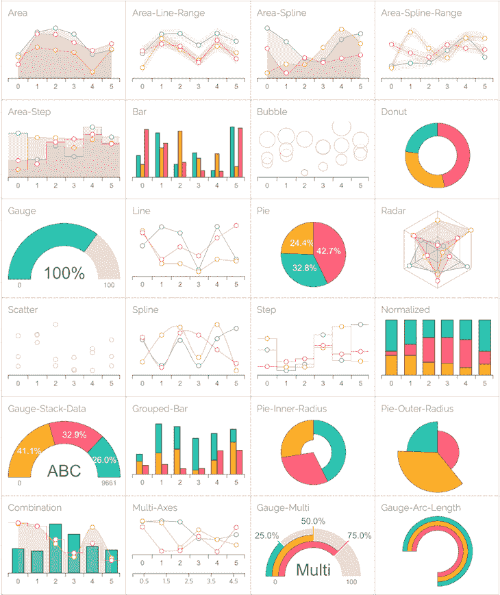
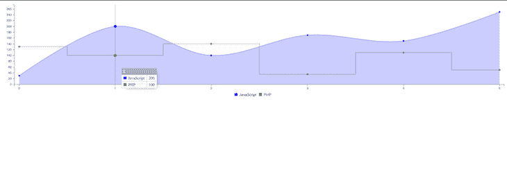
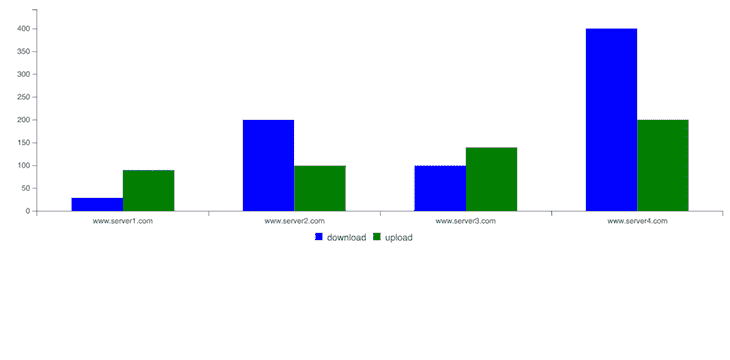
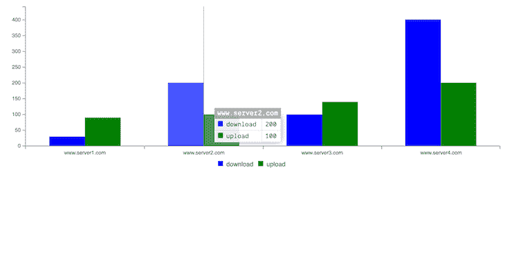
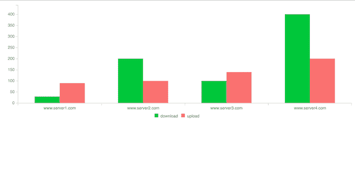

# 使用 billboard.js 在 Node.js 中创建图表

> 原文：<https://blog.logrocket.com/how-to-use-billboard-js/>

数据不仅仅是软件开发的关键部分，对整个社会也是如此。不管数据位于何处，也不管它是如何使用的，以一种有助于受众消化和理解的方式显示数据是非常重要的。

有许多库有助于图表和其他形式的数据可视化。 [billboard.js](https://naver.github.io/billboard.js/) 因其简单易用而脱颖而出。

在本教程中，我们将探索 billboard.js，并向您展示如何使用它在 Node.js 中创建漂亮的图表。

以下是我们将要介绍的内容:

要学习本教程，您应该具备以下条件:

## billboard.js 是什么？

billboard.js 是一个基于 D3 v4+的强大的、可重用的、优雅的界面图表库。这是一个 JavaScript 库，允许开发人员即时创建图表来可视化数据。

billboard.js 的名字来自于 [Billboard 排行榜](https://www.billboard.com/charts)，它列出了在美国和其他地方发行的音乐的相对每周受欢迎程度。

开发人员喜欢使用 billboard.js，因为它易于上手和使用。它还支持 D3.js V4+,并提供多种图表选项供选择。

## 安装 billboard.js

在项目中使用 billboard.js 有多种方式。billboard.js 在引擎盖下使用 D3.js，所以你也需要加载 D3.js。

安装 billboard.js 的第一种方法是从[官方 billboard.js 网站](https://naver.github.io/billboard.js/)下载库(CSS 和 JavaScript 文件)并加载到你的项目中:

```
<!-- Step 1) Load D3.js -->
<script src="https://d3js.org/d3.v5.min.js"></script>

<!-- Step 2) Load billboard.js with style -->
<script src="$YOUR_DOWNLOAD_PATH/billboard.js"></script>

<!-- Load with base style -->
<link rel="stylesheet" href="$YOUR_DOWNLOAD_PATH/billboard.css">

```

为您的图表创建一个`div`以显示在:

```
<div id="chart"></div>

```

也可以通过官网下载各种图表主题的样式。

或者，您可以使用 npm 安装 billboard.js:

```
$ npm install billboard.js # latest
$ npm install [email protected] # Release Candidate

```

如果您想试用 billboard.js 而不下载或安装它，您可以使用下面的任何 CDN 链接将其加载到您的项目中:

## 支持的图表类型

billboard.js 支持多种图表。根据[官方文件](https://naver.github.io/billboard.js/release/latest/doc/)，以下是目前可用的图表类型:



请注意，各种图表类型有各种配置选项，请参见官方 billboard.js 文档的[示例](https://naver.github.io/billboard.js/demo/#AreaChartOptions.Above)部分了解更多信息。

## 使用 billboard.js 创建简单的图表

在这一节中，我将演示如何使用 billboard.js 在您的项目中轻松创建图表。

首先，使用上面提到的任何一种方法安装 billboard.js。对于这个演示，我将使用 D3.js 和 billboard.js CDN 来使用这个库并创建我的图表。

在空文件夹中创建一个名为`chart.html`的文件，并输入以下内容:

```
<!--chart.html -->
<!DOCTYPE html>

<title>billboard.js DEMO</title>

<head>
<!-- Load billboard.js css files via cdn -->
<link rel="stylesheet" href="https://cdn.jsdelivr.net/npm/billboard.js/dist/billboard.min.css">

<!--Load D3.js -->
<script src="https://d3js.org/d3.v5.min.js"></script>

<!-- Load billboard.js via cdn --> 
<script src="https://cdn.jsdelivr.net/npm/billboard.js/dist/billboard.min.js"></script>
</head>

</html>

```

下一步是在 HTML 文件中创建一个`div`来显示您的图表:

```
<body>
<div id="chart"></div>
</body>

```

现在创建一个新文件，将其命名为`chart.js`，并粘贴以下内容:

```
bb.generate({
    bindto: "#chart",
    data: {
        columns: [
            ["JavaScript", 30, 200, 100, 170, 150, 250],
            ["PHP", 130, 100, 140, 35, 110, 50]
        ],
        types: {
          JavaScript: "area-spline",
          PHP: "step"
        },
        colors: {
          JavaScript: "blue",
          PHP: "green"
        }
    }
});

```

让我们来分析一下上面的代码片段。

```
bb.generate({})

```

这个函数用您在其中指定的参数生成图表。

```
bb.generate({
    bindto: "#chart"
})

```

`bindto`属性保存我们创建的用于显示图表的 div 的 ID。这使您能够轻松定位特定的 HTML 元素，而不必手动操作 DOM。

```
bb.generate({
    bindto: "#chart",
    data: {
        columns: [
            ["JavaScript", 30, 200, 100, 170, 150, 250],
            ["PHP", 130, 100, 140, 35, 110, 50]
        ],
        types: {
          JavaScript: "area-spline",
          PHP: "step"
        },
        colors: {
          JavaScript: "blue",
          PHP: "green"
        }
    }
});

```

*   `data`属性包含一个对象，该对象包含您需要在图表中显示的所有数据
*   `columns`保存一个数组，其中包含要显示的数据的值和数据的名称
*   保存一个对象，包含你想要用来显示数据的图表类型。在我们的例子中，对于 JavaScript，我们使用“直线”图表类型，对于 PHP，我们使用“步进”图表类型。你可以使用我在上面展示的[中支持的任何图表类型](https://paper.dropbox.com/doc/How-to-use-Billboard.js--BEMMvf56GC2bNto6~_~ldYeUAg-YLbqVYKeEFHl7Vki3b7Py#:uid=490780751176208605341954&h2=Supported-Chart-types)
*   属性保存一个对象，该对象包含您希望数据显示的颜色类型

在您的`chart.html`文件中，注入`chart.js`:

```
<body>
<div id="chart"></div>
<script src="YOUR_PROJECT_PATH/chart.js"></script>
</body>

```

当您打开`chart.html`文件时，您应该会在浏览器中看到下面的图表:



我们刚刚创建了一个图表来快速、轻松地显示数据。使用 billboard.js，还有很多其他的方式来创建图表，比如分类等。(稍后会详细介绍)。billboard.js 还为您经常使用的图表提供了各种主题，方法是将您想要的任何主题的 CSS 文件加载到项目中。

## 按类别显示数据

当您需要在单个图表上显示广泛的信息时，按类别显示数据非常方便。

例如，假设您有一组服务器，人们可以从这些服务器下载和上传数据，您希望在一个图表中显示下载和上传值。以下是如何用 billboard.js 做到这一点:

```
var chart = bb.generate({
  data: {
    x: "x",
    columns: [
        ["x", "www.site1.com", "www.site2.com", "www.site3.com", "www.site4.com"],
        ["download", 30, 200, 100, 400],
        ["upload", 90, 100, 140, 200]
    ],
    groups: [
      [
        "download",
        "loading"
      ]
    ],
        colors: {
          download: "blue",
          upload: "green"
        },
    type: "bar", // for ESM specify as: bar()
  },
  axis: {
    x: {
      type: "category"
    }
  },
  bindto: "#categoryData"
});

```

让我们分解代码。

```
  data: {
    x: "x",
    columns: [
        ["x", "www.server1.com", "www.server2.com", "www.server3.com", "www.server4.com"],
        ["download", 30, 200, 100, 400],
        ["upload", 90, 100, 140, 200]
    ],

```

这里，我们基本上指定了轴(`x`属性)。`columns`属性保存一个数组，该数组包含您想要显示的数据的值和名称。

与上一个示例不同，这里我们有三个数组，包含与图表相关的各种数据:

*   第一个数组包含我们想要显示的数据类别的名称。它从`x`值开始，因为我们希望类别名称显示在`x`轴上
*   第二个数组包含我们希望为各种类别显示的数据
*   第三个数组也是如此

如果您需要通过 URL 从服务器获取数据，您可以在`bb.generate()`函数的顶层使用以下内容:

```
  data: {
    url: "./data/test.csv",
    type: "line", // for ESM specify as: line()
  },

```

`url`应该包含您想要在图表上显示的数据的链接或路径:

```
    groups: [
      [
        "download",
        "loading"
      ]
    ],
        colors: {
          download: "blue",
          upload: "green"
        },

```

在本节中，我们将命名类别组及其颜色，在本例中是`download`和`upload`。

```
  axis: {
    x: {
      type: "category"
    }
  },

```

这里，我们指定什么数据应该在哪个轴上。我们告诉 billboard.js，`x`轴应该保存类别名称。

下面是我们的图表:



如果您将鼠标悬停在任何图表栏上，将会显示一个工具提示，其中包含该特定类别的数据:



如果您不想在悬停或任何时候显示工具提示，只需在`bb.generate()`函数中添加以下属性:

```
tooltip: {
    show: false
  },

```

## billboard.js 中的主题

billboard.js 有多种主题可供使用，包括:

*   `default`
*   `insight`
*   `datalab`
*   `graph`

您可以在项目中使用这些主题，只需加载 billboard.js 提供的 [CSS 文件，而不是默认的 CSS 文件。](https://naver.github.io/billboard.js/release/latest/doc/index.html)

例如，下面是我们使用 insight 主题创建的上图:



将以下内容添加到 HTML 文件的 head 标记中，以使用 insight 主题:

```
<link rel="stylesheet" href="
https://naver.github.io/billboard.js/release/latest/dist/theme/insight.css">

```

如果您喜欢使用 JavaScript 来导入主题，或者如果您使用 npm 安装了 billboard.js，只需将以下内容添加到 JavaScript 文件的顶层，就可以开始了:

```
// base css
import "billboard.js/dist/theme/insight.css";

```

## 结论

在本教程中，我们学习了什么是 billboard.js，回顾了它的功能，并演示了如何创建一个简单的图表。我们还学习了如何使用图表库来分类显示数据，以及如何在 billboard.js 中使用主题。

## 200 只显示器出现故障，生产中网络请求缓慢

部署基于节点的 web 应用程序或网站是容易的部分。确保您的节点实例继续为您的应用程序提供资源是事情变得更加困难的地方。如果您对确保对后端或第三方服务的请求成功感兴趣，

[try LogRocket](https://lp.logrocket.com/blg/node-signup)

.

[](https://lp.logrocket.com/blg/node-signup)[https://logrocket.com/signup/](https://lp.logrocket.com/blg/node-signup)

LogRocket 就像是网络和移动应用程序的 DVR，记录下用户与你的应用程序交互时发生的一切。您可以汇总并报告有问题的网络请求，以快速了解根本原因，而不是猜测问题发生的原因。

LogRocket 检测您的应用程序以记录基线性能计时，如页面加载时间、到达第一个字节的时间、慢速网络请求，还记录 Redux、NgRx 和 Vuex 操作/状态。

[Start monitoring for free](https://lp.logrocket.com/blg/node-signup)

.