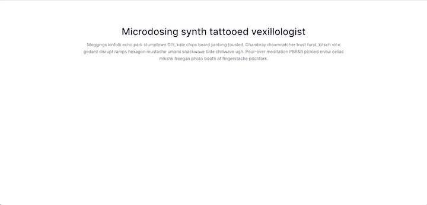
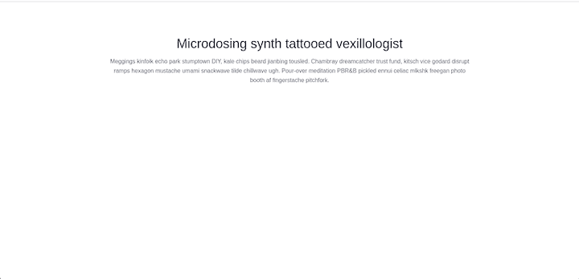

# 如何在顺风 CSS 中使用自定义字体

> 原文：<https://blog.logrocket.com/how-to-use-custom-fonts-tailwind-css/>

你如何处理你的前端项目？让我猜猜:你得到 UI 设计，然后实现它们。或者你自己设计。无论哪种方式，用户界面设计通常会带有你还没有的自定义字体。

如果你正在使用 Tailwind 进行构建，这篇文章将向你展示如何将 web 字体(Google 字体)和本地安装的字体添加到你的 Tailwind 项目中。这将确保您用正确的/必需的资产构建您的前端项目。

> ***注意，**这篇文章不包含关于安装顺风或者[如何给项目](https://blog.logrocket.com/using-tailwind-css-in-production/)添加顺风的信息。它假设你已经排序，并期待添加自定义字体。*

*向前跳转:*

## 使用 web 字体构建

Web 字体是专为应用于网页上的文本而创建的字体。浏览器在呈现网页时下载指定的 web 字体，并将这些字体应用于该网页上的文本。

Web 字体存在于 web 服务器上，因此您可以在您的托管提供商上托管您自己的 web 字体并使用它们。或者，你可以使用来自外部提供商的网络字体，如[谷歌网络字体](https://fonts.google.com/)。

在本文中，我们将使用 [Poppins 字体](https://fonts.google.com/specimen/Poppins)。这是由[印度活字铸造厂](https://fonts.google.com/?query=Indian+Type+Foundry)和 [Jonny Pinhorn](https://fonts.google.com/?query=Jonny+Pinhorn) 设计的谷歌网页字体。Poppins 字体是一种流行的设计工具，其特点是几何无衬线字体。你可以在这里了解这个字体[的更多信息，或者在这里](https://fonts.google.com/specimen/Poppins/about)为它做贡献[。](https://github.com/itfoundry/poppins)

## 顺风和网络字体

现在让我们来看看如何给你的顺风应用程序添加网页字体。

随着我们的进展，最好有一个小的应用程序来试验，所以我在 GitHub 上建立了一个[s](https://github.com/lawrenceagles/next-tw)[ta](https://github.com/lawrenceagles/next-tw)[r](https://github.com/lawrenceagles/next-tw)[ter](https://github.com/lawrenceagles/next-tw)[项目。](https://github.com/lawrenceagles/next-tw)

来设置这个。js 和 Tailwind 项目，按照 [Read.me](https://github.com/lawrenceagles/next-tw#readme) 文件中的说明操作。克隆此项目后，运行以下命令安装所需的依赖项:

```
npm install

```

现在，通过运行以下命令启动 dev 服务器:

```
npm run dev

```

您应该看到以下内容:



要使用 Poppins web 字体，添加代码以将 web 字体导入到`global.css`文件:

```
@tailwind base;
@tailwind components;
@tailwind utilities;
@import url("https://fonts.googleapis.com/css2?family=Poppins&display=swap");

```

接下来，用`font-poppins`类对`index.js`组件中的标记进行样式化，如下所示:

```
export default function Home() {
  return (
    <section className="text-gray-600 body-font font-poppins">
      ...
    </section>
  );
}

```

在上面的代码片段中，我们将`font-poppins`类添加到了`index.js`组件的`section`元素中。然而，如果我们看看下面浏览器上的输出，我们还不会看到字体生效。我们将在下一节学习如何定制顺风时解决这个问题:


## 定制顺风

Tailwind 框架的构建考虑到了定制。默认情况下，Tailwind 在根目录中搜索一个包含我们所有定制的`tailwind.config.js`文件。

看来我们的项目仍然使用默认的顺风字体。让我们告诉 Tailwind 使用我们添加的 Poppins 字体。

打开您的`tailwind.config.js`文件并更新配置以扩展我们刚刚添加的`Poppins`字体:

```
/** @type {import('tailwindcss').Config} */
module.exports = {
  content: [
    "./pages/**/*.{js,ts,jsx,tsx}",
    "./components/**/*.{js,ts,jsx,tsx}",
  ],
  theme: {
    extend:
    {
      fontFamily: {
        'poppins': ['Poppins', 'sans-serif']
      },
    },
  },
  plugins: [],
}

```

我们在上面所做的是扩展默认的 Tailwind 配置，以公开一个新的`font-poppins`字体家族实用程序类。这意味着它将与 Tailwind 默认字体类并存。因此，我们可以看到 Poppins 字体应用于我们的项目如下:



这也是 Tailwind 以实用为基础的造型理念的加分点。如果我们需要在项目中的其他地方使用该字体，我们需要做的就是将`font-poppins`类添加到元素中，它应该就可以工作了。这也使得我们可以根据需要在不同的断点设置不同的字体。

## 更改顺风 CSS 中的默认字体

当 Tailwind 处理我们的源 CSS 文件时，它使用默认配置。这些配置决定了我们在标记中使用的顺风类的值。例如，基于[默认字体大小配置](https://tailwindcss.com/docs/font-size)，类`text-sm`解析为字体大小`0.875rem`，类`text-xl`解析为字体大小`1.25rem`。同样，类`text-gray-500`解析为值`rgb(107 114 128)`，类`text-gray-900`解析为值`rgb(17 24 39)`。

虽然 Tailwind 在默认情况下提供了许多选项，但它也使您能够通过添加自己的类或更改默认配置的属性来扩展默认配置。为此，我们使用了`tailwind.config.js`文件。

要创建`tailwind.config.js`文件，运行以下命令:

```
npm inx tailwind init

```

然而，starter 项目已经包含了一个`tailwind.config.js`文件。所以，对于这个项目，你应该跳过这一步。

现在，通过更新`tailwind.config.js`文件来扩展颜色和字体大小配置，如下所示:

```
/** @type {import('tailwindcss').Config} */
module.exports = {
  content: [
    "./pages/**/*.{js,ts,jsx,tsx}",
    "./components/**/*.{js,ts,jsx,tsx}",
  ],
  theme: {
    fontSize: {
      title: `2.6rem;`,
      paragraph: `1.2rem;`
    },
    extend: {
      colors: {
        primary: {
          500: '#FF6363;',
          800: '#FF1313;',
        }
      },
      fontFamily: {
        poppins: ['Poppins', 'sans-serif'],
      },
    },
  },
  plugins: [],
}

```

在上面的代码中，我们向`theme`对象添加了一个`fontSize`属性。这个`fontSize`属性包含我们自定义的字体大小:`title`和`paragraph`。我们添加了一个新的`colors`属性，它包含一种带有两种阴影的`primary`颜色:`500`和`800`。

我们可以应用这些类来设计我们的组件，就像这样:

```
export default function Home() {
  return (
    <section className="text-gray-600 body-font font-poppins">
      <div className="container mx-auto flex px-5 py-24 items-center justify-center flex-col">
        <div className="text-center lg:w-2/3 w-full">
          <h1 className="title-font text-title mb-4 font-medium text-primary-800 ">
            Microdosing synth tattooed vexillologist
          </h1>
          <p className="mb-8 leading-relaxed text-primary-500 text-paragraph">
            Meggings kinfolk echo park stumptown DIY, kale chips beard jianbing
            tousled. Chambray dreamcatcher trust fund, kitsch vice godard
            disrupt ramps hexagon mustache umami snackwave tilde chillwave ugh.
            Pour-over meditation PBR&amp;B pickled ennui celiac mlkshk freegan
            photo booth af fingerstache pitchfork.
          </p>
        </div>
      </div>
    </section>
  );
}

```

现在，如果您查看您的浏览器，您会看到我们的项目有了新的外观，应用了以下样式:


## 使用本地安装的字体进行构建

这是这篇文章中非常有趣的一点。每当我在谷歌上搜索“如何在顺风中使用自定义字体”，结果很少提到使用本地/下载的字体。然而，90%的时候，这正是我在寻找的。因此，我添加了这一节，向您展示如何在您的顺风项目中使用本地安装的字体。

### 安装字体

首先，我们需要找到我们想要的字体并安装它。通常，我们可以通过谷歌搜索字体的名称来找到它。接下来，下载字体，解压缩，并将其安装在本地机器上。

### 将本地字体添加到 Tailwind

在 web 字体的例子中，我们需要做的就是在项目的 HTML head 标签中添加一个指向 Google 字体的链接。这次情况会有所不同。

首先，将字体添加到应用程序的公共文件夹中。然后，使用`@font-face` CSS 规则将字体导入 CSS 文件，如下所示:

```
@tailwind base;
@tailwind components;
@tailwind utilities;

@import url("https://fonts.googleapis.com/css2?family=Poppins&display=swap");

@font-face {
  font-family: "ADELIA";
  src: url("../public/fonts/ADELIA.otf");
}

```

使用 font-face 规则，我们指定自定义字体的`font-family`值，然后通过`src`属性指定项目中字体文件的路径。

至此，我们已经成功地将一个本地安装的字体添加到了我们的 Tailwind 项目中。接下来，让我们使用它。打开顺风配置文件并更新`extend`属性，如下所示:

```
...
extend: {
  colors: {
    primary: {
      500: '#FF6363;',
      800: '#FF1313;',
    }
  },
  fontFamily: {
    poppins: ['Poppins', 'sans-serif'],
    adelia: ["ADELIA", "cursive"],
  },
},
...

```

就像我们对 Poppins 字体所做的一样，这里我们扩展了 Tailwind 的`fontFamily`实用程序类，以包括我们刚刚添加到项目中的 Adelia 字体。这将公开一个`font-adelia`类供我们在整个项目中使用。要看到这一点，通过将`font-adelia`类添加到`<section>`标签来更新 HTML，如下所示:

```
export default function Home() {
  return (
    <section className="text-gray-600 body-font font-adelia">
     ...
    </section>
  );
}

```

现在，您应该可以在我们项目的 UI 中看到更新后的字体:


就是这样！我们现在在项目中使用本地安装的字体。

## 移除默认顺风字体

性能是最重要的。它确保了很好的用户体验，我们都喜欢网站速度快。因此，您可能不想运送任何在生产中不使用的资产。

在这种情况下，如果您想在发布前去掉项目中的任何默认字体，您只需更新您的 Tailwind 配置文件，如下所示:

```
// tailwind.config.js
module.exports = {
  content: [
    "./pages/**/*.{js,ts,jsx,tsx}",
    "./components/**/*.{js,ts,jsx,tsx}",
  ],
  theme: {
    fontFamily: {
        poppins: ["Poppins", "sans-serif"],
        adelia: ["ADELIA", "cursive"],
      },
  },
  plugins: [],
};

```

不同之处在于，我们省略了`theme: {}`对象中的`extend: {}`对象，直接为`fontFamily`指定值。这将最终覆盖所有默认字体，只使用我们指定的字体。

为了提高性能，Tailwind 还有一个清除特性，允许我们丢弃生产中所有未使用的 CSS。您可以通过将它添加到配置文件中来启用它，如下所示:

```
// tailwind.config.js
purge: {
    enabled: true,
    content: [
        './**/*.html'
    ]
}

```

你在网络项目中常用的字体是什么？在评论里和我分享吧！

## 结论

在本文中，我们研究了如何在 Tailwind 中使用自定义字体。我们同时使用网络字体和本地字体。我们还学习了如何通过向`tailwind.config.js`文件添加我们的定制来扩展 Tailwind 的默认配置。

我希望这篇教程有助于提高你的顺风知识，并且你可以在顺风中使用你的定制。

如果您对我们创建的小应用程序的源代码感兴趣，您可以在 [Git](https://github.com/lawrenceagles/next-tw-final) [H](https://github.com/lawrenceagles/next-tw-final) [ub](https://github.com/lawrenceagles/next-tw-final) 上找到它。

## 你的前端是否占用了用户的 CPU？

随着 web 前端变得越来越复杂，资源贪婪的特性对浏览器的要求越来越高。如果您对监控和跟踪生产环境中所有用户的客户端 CPU 使用、内存使用等感兴趣，

[try LogRocket](https://lp.logrocket.com/blg/css-signup)

.

[](https://lp.logrocket.com/blg/css-signup)[https://logrocket.com/signup/](https://lp.logrocket.com/blg/css-signup)

LogRocket 就像是网络和移动应用的 DVR，记录你的网络应用或网站上发生的一切。您可以汇总和报告关键的前端性能指标，重放用户会话和应用程序状态，记录网络请求，并自动显示所有错误，而不是猜测问题发生的原因。

现代化您调试 web 和移动应用的方式— [开始免费监控](https://lp.logrocket.com/blg/css-signup)。