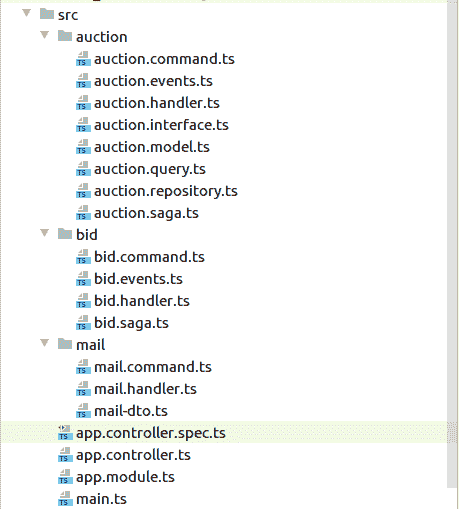

# 如何在 Node.js - LogRocket 博客中使用事件驱动编程

> 原文：<https://blog.logrocket.com/how-to-use-event-driven-programming-in-node-js/>

今天，构建软件最常用的方法是请求/响应机制，下面是分层架构(n 层),其中调用通过层垂直传播。像 [MVC](https://en.wikipedia.org/wiki/Model%E2%80%93view%E2%80%93controller) 这样的模式已经变得非常流行，并且在某种程度上成为人们学习和编写软件的标准。

由于分层架构是最简单的架构，并且可以解决许多问题，这并不意味着它是解决软件行业中存在的所有问题的灵丹妙药。使用不同的设计模式，一些软件可以写得更有表现力。分层架构非常适合中小型项目。棘手的部分是保持一切有序，不要做太多的层，否则我们会以 [Baklava 代码](https://www.johndcook.com/blog/2009/07/27/baklav-code/)结束。


## 分层架构

或者，我们有**事件驱动编程**，它主要用于前端开发，其中一个事件可以通过系统传播，许多参与者可以在捕捉到该事件后采取行动。数据流是单向的，添加新功能无需编辑现有组件。

虽然事件驱动编程在构建用户界面方面占主导地位，但我们也可以用它来编写服务器端代码。好的用例是高度异步的系统，这些系统不需要来自服务器的即时响应，并且使用不同的通信通道来发布请求的进度。

## 示范

在本教程中，我们不仅将调度事件来演示事件驱动编程，还将实现 [CQRS](https://en.wikipedia.org/wiki/Command%E2%80%93query_separation) 设计模式，该模式将编辑数据(命令)的代码与用于读取数据(查询)的代码分开。

我们的应用程序的主要构件将是:

*   命令
*   经理人
*   事件
*   问题

**命令**是运行业务逻辑或分派新事件的动作。**事件**将用于调度其他命令。我们也可以有**事件处理程序**。**查询**动作和**查询处理程序**负责查询(读取)项目。

如果我们想象一个竞价系统，其中一个动作可以按照定义的顺序触发其他动作，我们
希望让它高度异步。我们最终将获得如下功能:

*   检查出价是否是最高的
*   向所有相关方(投标人和业主)发送电子邮件
*   在数据库中添加投标
*   为投标创建一个活动
*   收到最新投标后，延长投标过程两小时([投标费用拍卖](https://en.wikipedia.org/wiki/Bidding_fee_auction)

这是我们系统中的流程图:


随着 **CQRS** 模块的实现，每个事件将产生一个或多个命令，每个命令将触发一个新的事件。

这个事件驱动的系统支持[面向方面的编程](https://en.wikipedia.org/wiki/Aspect-oriented_programming)范例。这基本上意味着你可以在不改变现有功能的情况下给软件增加额外的功能。在我们的例子中，这意味着将新的**命令**和**命令处理程序**与**事件**链接起来。

## 履行

我们已经选择了 [Nestjs](https://nestjs.com/) 来实现我们的虚拟投标系统所描述的解决方案。

Nestjs 在其丰富的生态系统中提供了 **CQRS** 模块。该模块的主要构件是三个可注入类: **EventBus** 、 **QueryBus、**和 **CommandBus** 。顾名思义，每个都可以触发事件、查询或命令。

阅读和编写这个演示的代码需要学习和钻研 Nestjs，因为有许多概念需要掌握。Nestjs 是一个功能丰富的框架，它严重依赖于[装饰器](https://www.typescriptlang.org/docs/handbook/decorators.html)、[观察器](https://rxjs-dev.firebaseapp.com/guide/observable)，并附带了一个模块系统(类似 Angular 的那个)、[依赖注入](https://en.wikipedia.org/wiki/Dependency_injection)、[控制反转](https://en.wikipedia.org/wiki/Inversion_of_control)等。

我将尽量只突出代码中重要的部分，否则，这篇文章会太长。在它的底部，你会找到一个链接，链接到一个包含所有代码和工作演示的 [Github 库](https://github.com/vladotesanovic/cqrs)。下面是目录结构:



从主控制器(和主路径/)我们将分派**坐浴盆事件**。**在 Nestjs 中，管制员就是路线处理员。**

```
@Controller()
export class AppController {
  constructor(private readonly eventBus: EventBus, private queryBus: QueryBus) {}

  @Get()
  async bid(): Promise<object> {

    // We are hard-coding values here
    // instead of collecting them from a request
    this.eventBus.publish(
      new BidEvent('4ccd1088-b5da-44e2-baa0-ee4e0a58659d', '0ac04f2a-4866-42de-9387-cf392f64cd52', 233),
    );

    return {
      status: 'PENDING',
    };
  }

  @Get('/audiences')
  async getAudiences() {
    const allAudiences = await this.queryBus.execute(new GetAuctionQuery());

    return allAudiences;
  }
}
```

我们系统的真正力量在于 **BidSaga** 类。这个类(服务)的职责是监听**事件**并发送命令。*有使用 **rxjs** 和在 **ngrx** 包中编写特效经验的开发者会发现这段代码很熟悉，也很容易阅读*。

```
@Injectable()
export class BidSaga {

  @Saga()
  createBid = (events$: Observable<any>): Observable<ICommand> => {
    return events$.pipe(
      ofType(BidEvent),
      map((event: BidEvent) => {
        return new BidCommand(event.bidUser, event.auctionID, event.bidAmount);
      }),
    );
  }

  @Saga()
  createBidSuccess = (events$: Observable<any>): Observable<ICommand> => {
    return events$.pipe(
      ofType(BidEventSuccess),
      flatMap((event: BidEventSuccess) => {

        return [
          new MailCommand(event.user.email, {
            title: 'You did it...',
            message: 'Congrats',
          }),
          new PostponeAuctionCommand(event.auctionID),
          // create activity command
        ];
      }),
    );
  }
}
```

注意，我们创建了 **bidTransactionGUID** 变量，并将其传递给 **BidEvent** ，该值用于粘合命令和事件。

正如你在上面的代码中看到的， **BidEvent** 将调度 **BidCommand** 。接下来，在我们的代码**中，biddhandler**(用于 **BidCommand** )将调度 **BidEventSuccess** 或 **BidEventFail** 。

```
export class AuctionModel extends AggregateRoot {
  constructor(private readonly auction: IAuctionInterface) {
    super();
  }

  postponeAuction() {
    // validation and etc.

    // postpone it, and return new auction object with postponed date
    const auction = { ...this.auction };

    this.apply(new AuctionEventsPostponed(auction));
  }

  bidOnAuction(userID: string, amount: number) {
    // validation and etc.
    try {

      // business logic
      // upon successful bidding, dispatch new event
      this.apply(new BidEventSuccess(this.auction.id, amount, { email: '[email protected]', id: userID }));

    } catch (e) {

      // dispatch bid event fail action
      this.apply(new BidEventFail(e));
    }
  }
}
```

上面显示的模型是通过 BidHandler 服务运行的。

在调度 BidEventSuccess 之后，将启动新的命令 MailCommand 和 PostponeAuctionCommand。

```
@Injectable()
export class AuctionSaga {

  @Saga()
  createBid = (events$: Observable<any>): Observable<ICommand> => {
    return events$.pipe(
      ofType(AuctionEventsPostponed),
      flatMap((event: AuctionEventsPostponed) => {

        // send emails to all existing bidders
        const bidders = [
          new MailCommand('[email protected]', {
            title: 'Someone made a bid',
            message: 'Hurry up',
          }),
          new MailCommand('[email protected]', {
            title: 'Someone made a bid',
            message: 'Hurry up',
          }),
        ];

        return [
          ...bidders,
          // create activity
        ];
      }),
    );
  }
}
```

正如我们在上面的例子中看到的，一切都是关于分派命令和用新事件链接它们。一个新的特性将意味着创建新的命令和新的事件。

如果这个过程失败了，我们可以发送带有 bidTransactionGUID 信息的清理命令来删除系统中与这个 bid 相关的东西。

## 结论

如果将它应用到正确的地方和正确的场景，事件驱动编程范式可以成为应用程序架构的巨大胜利。如果您想到一个程序流由事件决定的应用程序，它可能非常适合这种编程方法。

知识库:[https://github.com/vladotesanovic/cqrs](https://github.com/vladotesanovic/cqrs)

## 200 只显示器出现故障，生产中网络请求缓慢

部署基于节点的 web 应用程序或网站是容易的部分。确保您的节点实例继续为您的应用程序提供资源是事情变得更加困难的地方。如果您对确保对后端或第三方服务的请求成功感兴趣，

[try LogRocket](https://lp.logrocket.com/blg/node-signup)

.

[](https://lp.logrocket.com/blg/node-signup)[https://logrocket.com/signup/](https://lp.logrocket.com/blg/node-signup)

LogRocket 就像是网络和移动应用程序的 DVR，记录下用户与你的应用程序交互时发生的一切。您可以汇总并报告有问题的网络请求，以快速了解根本原因，而不是猜测问题发生的原因。

LogRocket 检测您的应用程序以记录基线性能计时，如页面加载时间、到达第一个字节的时间、慢速网络请求，还记录 Redux、NgRx 和 Vuex 操作/状态。

[Start monitoring for free](https://lp.logrocket.com/blg/node-signup)

.